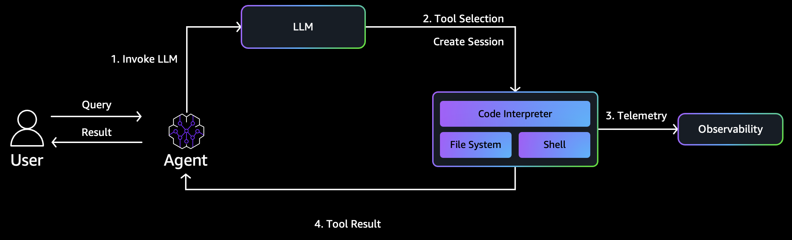
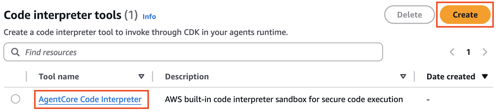
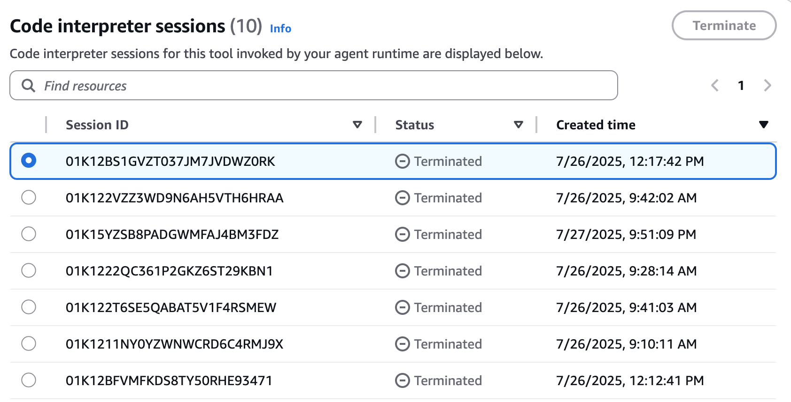
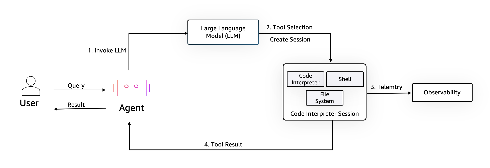
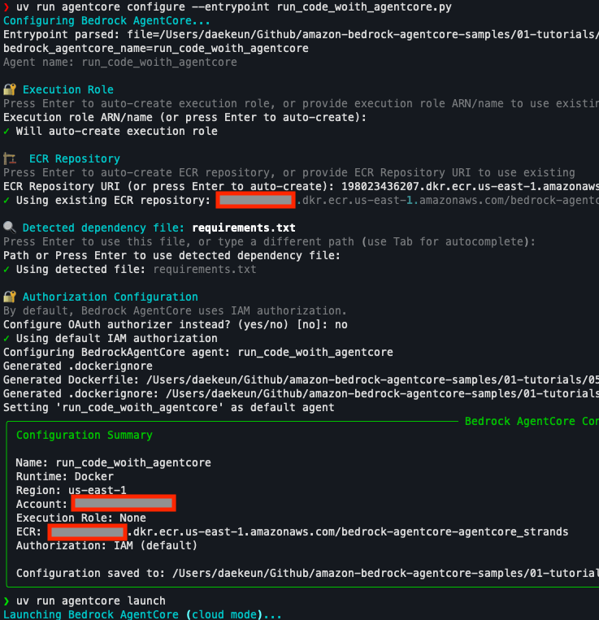
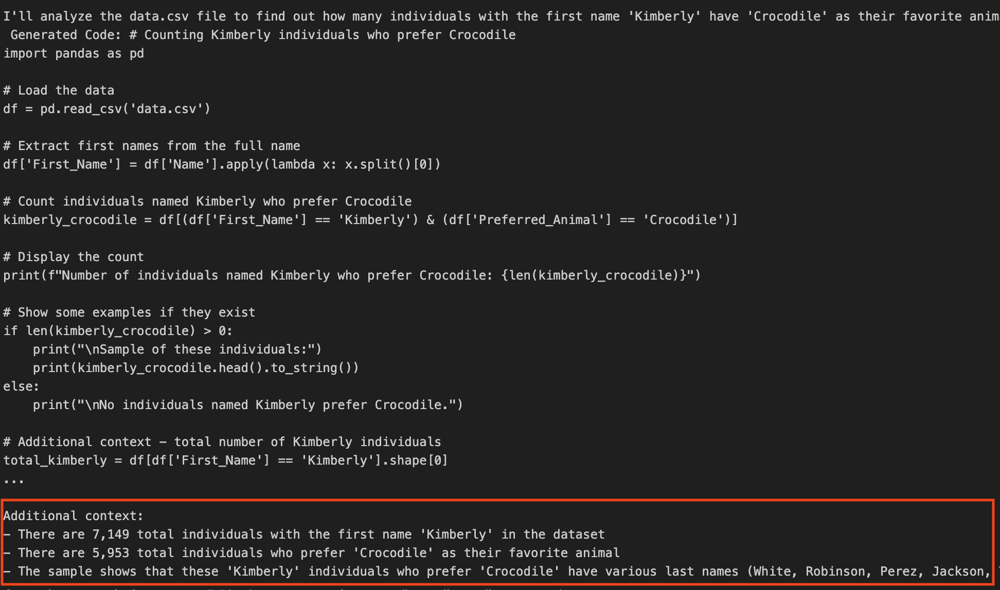

# AgentCore Code Interpreter

## 1. Overview

***

Amazon Bedrock AgentCore Code Interpreter는 AI 에이전트가 코드를 실행하고 데이터를 분석할 수 있게 해주는 서비스입니다. 이 서비스는 안전하고 격리된 환경에서 코드를 실행하여 데이터 분석, 시각화 및 복잡한 계산을 수행할 수 있습니다. 로컬이 아닌 **AWS 클라우드 인프라**에서 실행되는 완전 관리형 서비스로 각 세션은 독립적인 컨테이너화된 환경에서 실행되어 높은 수준의 보안과 격리를 제공합니다.

### 주요 기능

* 안전한 샌드박스 환경: 각 코드 실행은 격리된 마이크로VM에서 실행되어 보안 위험을 최소화합니다.
* 다양한 프로그래밍 언어 지원: Python, JavaScript, TypeScript 등 여러 프로그래밍 언어 지원
* 데이터 분석 및 시각화: pandas, matplotlib 등의 라이브러리를 사용하여 데이터 분석 및 시각화를 수행할 수 있습니다.
* 파일 처리: 다양한 형식의 파일(CSV, Excel, JSON 등)을 처리할 수 있습니다.
* 세션 지속성: 코드 실행 세션 간에 상태를 유지할 수 있습니다.
* 인라인 업로드의 경우 최대 100MB, Amazon S3를 통한 업로드의 경우 최대 5GB 파일 크기 지원

### 작동 방식

<figure><figcaption></figcaption></figure>

AgentCore Code Interpreter는 다음과 같은 방식으로 작동합니다:

1. 사용자가 코드 실행이 필요한 요청을 제출합니다.
2. AI 모델이 요청을 해석하고 실행할 코드를 생성합니다.
3. 코드는 격리된 샌드박스 환경에서 실행됩니다.
4. 실행 결과(출력, 오류, 시각화 등)가 사용자에게 반환됩니다.
5. 필요한 경우 AI 모델이 결과를 해석하고 설명합니다.

#### **인프라 위치 및 아키텍처**

* AgentCore Code Interpreter는 Amazon Bedrock AgentCore 내에서 컨테이너화된 환경에서 실행됩니다
* 각 사용자 세션이 전용 microVM에서 실행되며, CPU, 메모리, 파일시스템 리소스가 격리되어 세션 간 데이터 오염을 방지합니다
* 각 사용자 세션이 자체 보호된 환경에서 실행되어 데이터 유출을 방지하는 격리 기능을 제공합니다.

#### **보안, 네트워크 및 리소스 설정**

빌트인 코드 인터프리터를 제공하며, 코드 인터프리터 생성 시 두 가지 네트워크 모드를 선택할 수 있습니다.

<figure><figcaption></figcaption></figure>

* Sandbox - 외부 네트워크 액세스가 없는 격리된 환경 (가장 안전한 모드)
* Public network - 공용 인터넷 리소스에 대한 액세스 허용

<figure><figcaption></figcaption></figure>

### Core interpreter Session

* 코드 실행 샌드박스는 코드 인터프리터, 셸, 파일 시스템을 갖춘 격리된 환경을 생성하여 에이전트가 사용자 쿼리를 안전하게 처리할 수 있게 합니다. 효과적인 세션 관리는 데이터 분석 워크플로, 반복적 문제 해결, 이전 결과에 기반한 코드 실행 또는 상태 유지를 필요로 하는 모든 시나리오에서 매우 중요합니다.

<figure><figcaption></figcaption></figure>

* 실행 환경 지속성 - 여러 코드 실행 간 변수, 함수 및 데이터 구조를 유지하여 반복적인 개발 및 분석을 가능하게 함
* 변수 및 데이터 구조 보존 - 계산된 결과와 처리된 데이터를 이후 코드 실행에서 재사용할 수 있도록 보존하여 재계산이나 재처리의 필요성을 제거
* 세션 타임아웃 - 세션은 구성 가능한 타임아웃(기본 15분, 최대 8시간 연장 가능)을 가지고 있어 자원 사용과 복잡한 계산 요구 사이의 균형을 맞춤
* 격리된 실행 환경 - 각 대화는 보안과 사용자 간 간섭 방지를 위해 자체 격리된 코드 실행 환경을 가짐
* 파일 업로드, 코드 실행, 데이터 분석(예: pandas 기반 EDA) 수행 가능
* Observability를 통해 실행 내역 추적 가능

<figure><figcaption></figcaption></figure>

## 3. Getting Started

***

### Standalone (print Hello world)

`run_code.py`

```python
import json
from bedrock_agentcore.tools.code_interpreter_client import CodeInterpreter

# Configure and Start the code interpreter session
code_client = CodeInterpreter("us-east-1")
code_client.start(session_timeout_seconds=1200)

# Execute the hello world code
response = code_client.invoke(
    "executeCode", {"language": "python", "code": 'print("Hello World!!!")'}
)

# Process and print the response
for event in response["stream"]:
    print(json.dumps(event["result"], indent=2))
    
# Clean up and stop the code interpreter sandbox session
code_client.stop()
```

실행 결과

```bash
❯ uv run python hello_code.py
{
  "content": [
    {
      "type": "text",
      "text": "Hello World!!!"
    }
  ],
  "structuredContent": {
    "stdout": "Hello World!!!",
    "stderr": "",
    "exitCode": 0,
    "executionTime": 0.015172719955444336
  },
  "isError": false
}
```

### Execute Code

`run_code_with_agentcore.py`

```python
import asyncio
from bedrock_agentcore.runtime import BedrockAgentCoreApp
from bedrock_agentcore.tools.code_interpreter_client import code_session
from strands import Agent, tool

# 시스템 프롬프트 정의
SYSTEM_PROMPT = """코드를 실행해서 답변을 검증해주세요.
사용 가능한 도구:
- execute_python: Python 코드를 실행"""

# 코드 인터프리터 도구 정의
@tool
def execute_python(code: str, description: str = "") -> str:
    """Execute Python code in the sandbox."""
    if description:
        code = f"# {description}\\n{code}"
    print(f"\\n실행 코드: {code}")
    
    # 코드 인터프리터 세션 내에서 코드 실행
    try:
        with code_session("us-east-1") as code_client:
            response = code_client.invoke(
                "executeCode",
                {"code": code, "language": "python", "clearContext": False},
            )
            for event in response["stream"]:
                result = event["result"]
                
                # 에러 체크
                if result.get("isError", False):
                    error_content = result.get("content", [])
                    if error_content:
                        return (
                            f"오류: {error_content[0].get('text', 'Unknown error')}"
                        )
                
                # 정상적인 실행 결과 반환
                content = result.get("content", [])
                if content and content[0].get("type") == "text":
                    return content[0].get("text", "실행 완료(출력 없음)")
                return "실행 완료"
    except Exception as e:
        return f"실행 오류: {str(e)}"
        
# 도구가 포함된 에이전트 설정
agent = Agent(tools=[execute_python], system_prompt=SYSTEM_PROMPT)

# BedrockAgentCore 애플리케이션 설정
app = BedrockAgentCoreApp()

@app.entrypoint
def invoke(payload):
    """Process user input and return a response with code execution capability"""
    user_message = payload.get("prompt", "Hello")
    
    async def run_agent():
        response_text = ""
        async for event in agent.stream_async(user_message):
            if "data" in event:
                chunk = event["data"]
                response_text += chunk
        return response_text
    
    # asyncio.run으로 비동기 처리 실행
    try:
        response = asyncio.run(run_agent())
        return response
    except Exception as e:
        print(f"에이전트 실행 오류: {str(e)}")
        
if __name__ == "__main__":
    app.run()
```

배포

```python
uv run agentcore configure --entrypoint run_code_woith_agentcore.py
```

<figure><figcaption></figcaption></figure>

Invoke

```python
uv run agentcore invoke '{"prompt": "Hello"}'
```

### Data analysis example

샘플 데이터 읽기

```python
def read_file(file_path: str) -> str:
    """Helper function to read file content with error handling"""
    try:
        with open(file_path, 'r', encoding='utf-8') as file:
            return file.read()
    except FileNotFoundError:
        print(f"Error: The file '{file_path}' was not found.")
        return ""
    except Exception as e:
        print(f"An error occurred: {e}")
        return ""

data_file_content = read_file("samples/data.csv")

# Preparing Files for Sandbox Environment
files_to_create = [
    {
        "path": "data.csv",
        "text": data_file_content
    }
]
```

샌드박스 환경에 파일 쓰기

```python
def call_tool(tool_name: str, arguments: Dict[str, Any]) -> Dict[str, Any]:
    """Helper function to invoke sandbox tools

    Args:
        tool_name (str): Name of the tool to invoke
        arguments (Dict[str, Any]): Arguments to pass to the tool

    Returns:
        Dict[str, Any]: JSON formatted result
    """
    response = code_client.invoke(tool_name, arguments)
    for event in response["stream"]:
        return json.dumps(event["result"])
        
# Write files to sandbox
writing_files = call_tool("writeFiles", {"content": files_to_create})
print("Writing files result:")
print(writing_files)

# Verify files were created
listing_files = call_tool("listFiles", {"path": ""})
print("\\nFiles in sandbox:")
print(listing_files)
```

Code 실행 툴 정의: @tool 데코레이터로 해당 함수가 에이전트용 사용자 지정 도구라고 알려줌.

```python
# Define and configure the code interpreter tool
@tool
def execute_python(code: str, description: str = "") -> str:
    """Execute Python code in the sandbox."""

    if description:
        code = f"# {description}\\n{code}"

    #Print generated Code to be executed
    print(f"\\n Generated Code: {code}")

    # Call the Invoke method and execute the generated code, within the initialized code interpreter session
    response = code_client.invoke("executeCode", {
        "code": code,
        "language": "python",
        "clearContext": False
    })
    for event in response["stream"]:
        return json.dumps(event["result"])
```

에이전트 정의 w/ Strands SDK

```python
model_id="us.anthropic.claude-3-7-sonnet-20250219-v1:0"
model= BedrockModel(model_id=model_id)

#c onfigure the strands agent including the model and tool(s)
agent=Agent(
    model=model,
        tools=[execute_python],
        system_prompt=SYSTEM_PROMPT,
        callback_handler=None)
```

에이전트 호출

```python
### Query to perform EDA
query = "Load the file 'data.csv' and perform exploratory data analysis(EDA) on it. Tell me about distributions and outlier values."

# Invoke the agent asynchcronously and stream the response
response_text = ""
agent_stream = agent.stream_async(query)
async for event in agent_stream:
    if "data" in event:
        # Stream text response
        chunk = event["data"]
        response_text += chunk
        print(chunk, end="")
        
### Query to extract information
query = "Within the file 'data.csv', how many individuals with the first name 'Kimberly' have 'Crocodile' as their favourite animal?"

# Invoke the agent asynchcronously and stream the response
response_text = ""
async for event in agent.stream_async(query):
    if "data" in event:
        # Stream text response
        chunk = event["data"]
        response_text += chunk
        print(chunk, end="")        
```

<figure><figcaption></figcaption></figure>

## 4. 결론

***

Amazon Bedrock AgentCore Code Interpreter는 AI 에이전트에 코드 실행 기능을 추가하여 데이터 분석, 시각화 및 복잡한 계산을 수행할 수 있게 합니다. 안전한 샌드박스 환경에서 실행되어 보안을 유지하면서도 강력한 기능을 제공합니다.

이 서비스는 다른 AgentCore 서비스(Runtime, Memory, Identity 등)와 함께 사용하여 더욱 강력하고 지능적인 AI 에이전트를 구축할 수 있습니다. 특히 데이터 중심 애플리케이션에서 사용자가 자연어로 복잡한 데이터 분석 작업을 요청할 수 있게 하여 사용자 경험을 크게 향상시킵니다.
