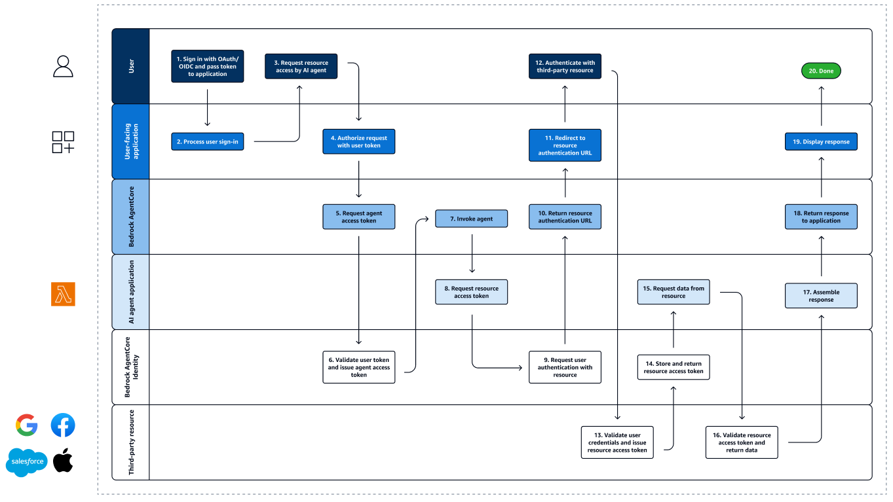

# AgentCore Identity

## 1. Overview

***

AgentCore Identity는 AI 에이전트가 여러 서비스에서 사용자별 데이터에 안전하게 접근할 수 있도록 하는 문제를 해결합니다. 기존 방식의 단점들(광범위한 접근 권한 또는 서비스마다 반복적인 사용자 동의)을 극복하고, **위임 기반 인증**과 **제로 트러스트 보안** 원칙을 통해 이를 해결합니다.

<figure><figcaption></figcaption></figure>

### 전체 워크플로

#### **Step 1. 사용자 인증 및 요청**

1. **사용자 OAuth/OIDC 로그인** → 기존 ID 제공업체(Auth0, Cognito 등)에서 토큰 발급
2. **애플리케이션 처리** → 사용자 토큰 검증 및 세션 설정
3. **AI 에이전트 요청** → 사용자가 에이전트에게 리소스 접근 요청

#### **Step 2. 토큰 교환**

1. **애플리케이션 → 에이전트** → 사용자 토큰과 함께 에이전트 서비스 호출
2. **워크로드 액세스 토큰 요청** → AgentCore Identity에 토큰 교환 요청
3. **워크로드 액세스 토큰 발급** → 사용자 토큰 검증 후 에이전트용 토큰 생성

#### **Step 3. 에이전트 실행 시작**

1. **AI 에이전트 호출** → 워크로드 액세스 토큰으로 에이전트 실행
2. **리소스 액세스 토큰 요청** → 외부 서비스(Google, Slack 등) 접근용 토큰 요청

#### **Step 4. 사용자 동의 프로세스** (토큰이 없는 경우)

1. **사용자 인증 요구** → 토큰 저장소에 없으면 사용자 동의 URL 반환
2. **인증 요청** → 애플리케이션에 인증 URL 전달
3. **동의 화면 표시** → 사용자에게 제3자 서비스 접근 동의 요청
4. **사용자 동의** → 사용자가 데이터 공유 승인
5. **리소스 액세스 토큰 발급** → 제3자 서비스가 토큰 발급

#### **Step 5. 데이터 접근 및 응답**

1. **토큰 저장 및 반환** → AgentCore Identity가 토큰을 안전하게 저장하고 에이전트에 반환
2. **리소스 데이터 요청** → 에이전트가 토큰으로 실제 데이터 접근
3. **데이터 검증 및 반환** → 제3자 서비스가 토큰 검증 후 데이터 제공
4. **응답 조합** → 에이전트가 받은 데이터로 최종 응답 생성
5. **사용자에게 결과 표시** → 애플리케이션이 사용자에게 최종 결과 제공

| 단계                                     | 내용 및 설명                                                                                                                                                               |
| -------------------------------------- | --------------------------------------------------------------------------------------------------------------------------------------------------------------------- |
| **1. 사용자 OAuth/OIDC 로그인 및 토큰 전달**      | 사용자는 조직의 기존 ID 공급자(예: Auth0, AWS Cognito, 기타 OIDC 호환 시스템)를 통해 인증을 받고, 액세스 토큰 또는 ID 토큰을 획득합니다. 이 토큰에는 사용자 ID와 권한 범위가 포함되어, 애플리케이션과 AI 에이전트에 전달되어 사용자 인증과 권한 확인에 사용됩니다. |
| **2. 사용자 로그인 처리 및 세션 설정**              | 애플리케이션은 받은 토큰을 검증하여 사용자가 적절히 인증되었는지 확인하고, 보안 세션을 설정합니다. 또한 토큰에서 사용자 정보를 추출하여 개인화 및 액세스 제어에 활용합니다.                                                                     |
| **3. AI 에이전트 리소스 액세스 요청**              | 사용자가 AI 에이전트와 상호작용을 시작하면, 애플리케이션은 사용자 인증 토큰과 요청 컨텍스트를 포함하여 AI 에이전트 호출을 요청합니다. 이 과정에서 애플리케이션은 프록시 역할을 하여 사용자 신원을 유지하며 요청을 전달합니다.                                       |
| **4. AgentCore 서비스의 토큰 유효성 검사**        | Bedrock AgentCore는 사용자 토큰의 서명, 만료, 발급자, 대상, 권한 범위 등을 엄격히 검증하고, 요청이 보안 정책에 부합하는지 확인합니다.                                                                                |
| **5. 워크로드 액세스 토큰 요청 (토큰 교환)**          | AgentCore는 사용자 토큰을 기반으로 워크로드 액세스 토큰을 얻기 위해 토큰 교환 API를 호출합니다. 이 과정은 IAM 자격 증명을 통해 인증되며, 안전한 신뢰 체인을 유지합니다.                                                              |
| **6. AgentCore Identity의 토큰 검증 및 발급**  | AgentCore Identity는 사용자 토큰을 다시 한번 철저히 검증한 후 워크로드 액세스 토큰을 발급합니다. 이 단계는 제로 트러스트 보안 원칙에 따라 모든 요청을 독립적으로 인증하고 권한을 부여합니다.                                                  |
| **7. AI 에이전트가 워크로드 액세스 토큰으로 작업 수행**    | AI 에이전트는 받은 토큰을 사용해 자신과 사용자의 신원을 증명하며 요청된 작업을 실행합니다. 이를 통해 다양한 리소스에 대한 인증된 요청이 가능해집니다.                                                                                |
| **8. 에이전트가 리소스 액세스 토큰 요청**             | AI 에이전트가 AWS 리소스나 Google 캘린더, Slack 등의 타사 서비스 접근 시 AgentCore 자격 증명 공급자에게 적절한 자격 증명을 요청합니다. 이때 워크로드 액세스 토큰이 신원 및 권한 증거로 활용됩니다.                                         |
| **9. 사용자 동의 및 인증 요청**                  | 만약 요청된 리소스에 대한 기존 액세스 토큰이 없거나 명시적 사용자 동의가 필요한 경우, AgentCore Identity는 사용자 인증 및 동의 절차를 시작합니다. 이는 OAuth 2.0 권한 부여 코드 흐름 등을 통해 이루어집니다.                                   |
| **10. 사용자 인증 및 동의 프롬프트**               | 사용자 측 애플리케이션이 권한 부여 URL을 받아 사용자에게 인증 및 데이터 공유 동의를 요청합니다.                                                                                                              |
| **11. 사용자 동의 수락 및 리소스 액세스 토큰 발급**      | 사용자가 동의하면, 타사 서비스(예: Google, Microsoft)는 사용자의 자격 증명과 동의를 검증하고 제한된 범위의 액세스 토큰을 발급합니다.                                                                                  |
| **12. AgentCore Identity의 토큰 저장 및 반환** | 발급된 리소스 액세스 토큰은 안전하게 저장되어 나중에 재사용 가능합니다. 이 저장소는 제로 트러스트 원칙에 따라 엄격히 관리되어, 무단 접근을 방지합니다.                                                                                |
| **13. 에이전트가 리소스 API 호출**               | 에이전트는 저장된 액세스 토큰을 사용해 타사 API를 호출하여 데이터 읽기/쓰기 작업을 수행합니다.                                                                                                               |
| **14. 타사 리소스의 토큰 검증 및 데이터 반환**         | 타사 서비스는 토큰의 유효성, 만료 여부, 권한 범위를 확인한 후 요청된 데이터를 반환하거나 작업 완료를 확인합니다.                                                                                                     |
| **15. AI 에이전트 응답 조합**                  | 에이전트는 AWS 및 타사 서비스에서 받은 데이터를 처리하고, 추가 로직과 결합하여 사용자 요청에 맞는 최종 응답을 생성합니다.                                                                                               |
| **16. AgentCore가 애플리케이션에 응답 반환**       | 완성된 응답은 사용자 대면 애플리케이션으로 전달되며, 작업 결과와 관련 데이터, 감사 정보가 포함됩니다.                                                                                                            |
| **17. 사용자 애플리케이션에서 응답 표시**             | 사용자는 애플리케이션에서 결과를 확인하고, AI 에이전트가 수행한 작업과 접근 권한을 이해할 수 있습니다.                                                                                                           |
| **18. 워크플로 종료 및 보안 유지**                | 모든 토큰 관리, 감사 로그 기록, 요청 처리 과정이 완료되면서 안전한 환경에서 워크플로가 종료됩니다.                                                                                                             |

### 주요 개념 및 특징

#### **핵심 기능**

**Identity Management**

* 기존 ID 제공업체와 호환되는 안전하고 확장 가능한 에이전트 ID 및 액세스 관리 기능을 제공하여 사용자 마이그레이션이나 인증 플로우 재구축이 필요하지 않습니다.

**Token Vault**

* 동의 피로를 최소화하는 안전한 토큰 저장소를 통해 간소화된 AI 에이전트 경험을 구축할 수 있습니다.
* OAuth 2.0 호환 도구 및 서비스의 경우, 사용자가 처음 에이전트가 자신을 대신하여 작업할 수 있도록 동의할 때, AgentCore Identity는 도구에서 발급된 사용자 토큰을 저장소에 수집하고 저장하며, 에이전트의 OAuth 클라이언트 자격 증명을 안전하게 저장합니다.

**Permission Delegation**

* 적절한 액세스 및 안전한 권한 위임을 통해 에이전트가 AWS 리소스와 제3자 도구 및 서비스에 안전하게 액세스할 수 있습니다.

#### **지원되는 인증 방식**

**Inbound Authentication (들어오는 인증)**

* IAM SigV4 인증: 추가 구성 없이 자동으로 작동하는 기본 인증 및 권한 부여 메커니즘
* JWT Bearer Token 인증: 에이전트 생성 시 권한 부여자 구성을 제공하여 JWT bearer 토큰을 수락하도록 에이전트 런타임을 구성할 수 있습니다.

**Outbound Authentication (나가는 인증)**

* OAuth2 인증을 사용하여 외부 리소스에 안전하게 액세스하기 위해 AgentCore Credential Providers와 에이전트 코드를 연결
* API 키 기반 인증
* IAM 역할 기반 인증

#### **지원되는 ID 제공업체**

Amazon Cognito, Microsoft Entra ID, Okta 등 기존 ID 제공업체와 통합하여 사용자가 에이전트를 호출할 수 있도록 지원하며, Google, GitHub 등 인기 있는 OAuth 제공업체도 지원합니다.

## 2. 개발 단계

***

### 기술적 구현

#### 1. **워크로드 아이덴티티 (Workload Identity)**

AgentCore Identity는 워크로드 액세스 토큰을 사용하여 저장소에 저장된 자격 증명에 대한 에이전트 액세스를 승인하며, 이 토큰에는 에이전트의 ID와 에이전트가 대신 작업하는 최종 사용자의 ID가 모두 포함됩니다.

Amazon Bedrock AgentCore로 런타임을 생성하면 AgentCore Identity 서비스와 함께 런타임에 대한 워크로드 아이덴티티가 자동으로 생성됩니다.

#### 2. **토큰 관리**

**토큰 저장 및 갱신**

* AgentCore Identity 서비스는 에이전트 워크로드 아이덴티티와 사용자 ID(AWS Cognito 토큰과 같은 인바운드 JWT 토큰에서)를 바인딩 키로 사용하여 Google 액세스 토큰을 AgentCore Token Vault에 저장하여 Google 토큰이 만료될 때까지 반복적인 동의 요청을 제거합니다.
* 사용자 토큰이 만료되면 AgentCore Identity는 에이전트가 업데이트된 사용자 토큰을 얻을 수 있도록 사용자에게 새로운 권한 부여 프롬프트를 트리거합니다.

**API 키 관리**

* API 키를 사용하는 도구의 경우, AgentCore Identity도 이러한 키를 안전하게 저장하고 필요할 때 에이전트가 이를 검색할 수 있도록 제어된 액세스를 제공합니다.

### 인바운드

#### Provision a Cognito User Pool

Cognito User pool 프로비저닝

```bash
# Create User Pool
aws cognito-idp create-user-pool \\
  --pool-name "DemoUserPool" \\
  --policies '{"PasswordPolicy":{"MinimumLength":8}}' \\
  --region "$REGION" \\
  > pool.json

# Store Pool ID
export POOL_ID=$(jq -r '.UserPool.Id' pool.json)

# Create App Client
aws cognito-idp create-user-pool-client \\
  --user-pool-id $POOL_ID \\
  --client-name "DemoClient" \\
  --no-generate-secret \\
  --explicit-auth-flows "ALLOW_USER_PASSWORD_AUTH" "ALLOW_REFRESH_TOKEN_AUTH" \\
  --token-validity-units AccessToken=hours,IdToken=hours,RefreshToken=days \\
  --access-token-validity 2 \\
  --id-token-validity 2 \\
  --refresh-token-validity 1 \\
  --region "$REGION" \\
  > client.json

# Store Client ID
export CLIENT_ID=$(jq -r '.UserPoolClient.ClientId' client.json)

# Create User
aws cognito-idp admin-create-user \\
  --user-pool-id $POOL_ID \\
  --username "testuser" \\
  --temporary-password "Temp123!" \\
  --region "$REGION" \\
  --message-action SUPPRESS | jq

# Set Permanent Password
aws cognito-idp admin-set-user-password \\
  --user-pool-id $POOL_ID \\
  --username "testuser" \\
  --password "MyPassword123!" \\
  --region "$REGION" \\
  --permanent | jq

# Authenticate User
aws cognito-idp initiate-auth \\
  --client-id "$CLIENT_ID" \\
  --auth-flow USER_PASSWORD_AUTH \\
  --auth-parameters USERNAME='testuser',PASSWORD='MyPassword123!' \\
  --region "$REGION" \\
  > auth.json

# Display auth response
jq . auth.json

# Store Access Token
ACCESS_TOKEN=$(jq -r '.AuthenticationResult.AccessToken' auth.json)

# Export variables for use in Jupyter notebook
COGNITO_DISCOVERY_URL="<https://cognito-idp.$REGION.amazonaws.com/$POOL_ID/.well-known/openid-configuration>"
COGNITO_CLIENT_ID="$CLIENT_ID"
COGNITO_ACCESS_TOKEN="$ACCESS_TOKEN"

```

#### AgentCore Config 설정 후 배포

* 종래 `agentcore_runtime.configure`의 인자값에서 `authorizer_configuration` 만 추가합니다.
* AgentCore Config로 Runtime에 배포하기 위한 설정 파일 (Dockerfile, `.bedrock_agentcore.yml` 생성). ECR과 IAM role을 명시하거나 자동으로 생성할 수 있습니다.
  * For AgentCore Identity: 기본적으로는 인증에 IAM을 사용하나, OAuth를 사용할 수도 있습니다. OAuth를 사용하는 경우 AgentCore 런타임 리소스 또는 AgentCore 게이트웨이 엔드포인트를 구성할 때 다음을 지정해야 합니다.
    * OAuth 검색 서버 URL — OpenID Connect 검색 URL의 ^.+/\\.well-known/openid-configuration$ 패턴과 일치해야 하는 문자열
    * 허용된 대상 — JWT 토큰에 허용되는 대상 목록
    * 허용된 클라이언트 — 허용되는 클라이언트 식별자 목록

```python
from bedrock_agentcore_starter_toolkit import Runtime
from boto3.session import Session
boto_session = Session()
region = boto_session.region_name

# discovery_url와 client_ids는 위 스크립트를 실행하면 얻을 수 있음.
discovery_url = ""
client_id = ""

agentcore_runtime = Runtime()

response = agentcore_runtime.configure(
    entrypoint="strands_claude.py",
    execution_role=agentcore_iam_role['Role']['Arn'],
    auto_create_ecr=True,
    requirements_file="requirements.txt",
    region=region,
    agent_name=agent_name,
    
    # For AgentCore Identity: 추가된 부분
    authorizer_configuration={
        "customJWTAuthorizer": {
            "discoveryUrl": discovery_url,
            "allowedClients": [client_id]
        }
    }
)
```
