# AgentCore Observability

## 0. **Observability and** OpenTelemetry (OTEL)

***

### What is **Observability?**

관찰 가능성(Observability)은 시스템의 내부 작동 방식을 알지 못해도 그 시스템에 대해 질문할 수 있게 하여 외부에서 시스템을 이해할 수 있게 해줍니다. 더 나아가, 이는 쉽게 문제를 해결하고 새로운 문제, 즉 "알려지지 않은 미지의 문제(unknown unknowns)"를 다룰 수 있게 해줍니다. 또한 "왜 이런 일이 발생하는가?"라는 질문에 답할 수 있도록 도와줍니다.

시스템에 대해 이러한 질문을 하려면 애플리케이션이 적절히 계측(instrumented)되어야 합니다. 즉, 애플리케이션 코드가 추적(trace), 지표(metrics), 로그(log)와 같은 신호를 내보내야 합니다. 개발자가 문제를 해결하기 위해 추가적인 계측을 더할 필요 없이 필요한 모든 정보를 이미 갖추고 있을 때 애플리케이션은 적절히 계측된 것입니다.

#### **3가지 기본 요소**

* **Traces(추적)**: 하나의 요청이 시스템을 통과하는 End-to-end 여정을 보여줍니다. GenAI에서는 사용자 질문부터 최종 응답까지의 전체 흐름을 추적합니다.
* **Metrics(메트릭)**: 수치형 집계 데이터로 시스템 성능을 측정합니다. 토큰 사용량, 응답 시간, 비용 등을 추적할 수 있습니다.
* **Logs(로그)**: 구조화된 상세 이벤트 데이터로 GenAI에서는 프롬프트 내용, 모델 응답, 에러 메시지 등을 기록합니다.

#### **핵심 개념**

* **Spans(구간)**: Trace 내의 개별 작업 단위(Traces are collections of spans)입니다. 예를 들어 "프롬프트 전처리", "LLM 호출", "응답 후처리" 각각이 하나의 span이 됩니다.
* **Baggage**: OpenTelemetry에서 컨텍스트 정보를 전파하는 메커니즘으로 Span 간에 전달이 필요한 컨텍스트 정보입니다.
  * **자동 전파**: 명시적으로 전달하지 않아도 모든 span에서 접근 가능
  * **키-값 쌍**: 문자열 형태로 저장
  * **전역 접근**: 코드 어디서든 현재 baggage 값을 읽을 수 있음

#### Monitoring vs. Observability

GenAI & Agentic AI 시스템은 특히 예측하기 어려운 동작이 많아서 Observability가 더욱 중요합니다. "왜 이 프롬프트에서만 이상한 답변이 나올까?" 같은 질문에 답하려면 단순한 메트릭 모니터링을 넘어서 전체 요청 흐름을 추적할 수 있어야 합니다.

* Monitoring으로 문제를 빠르게 감지: **reactive(반응적)** 접근으로 집계된 메트릭을 통해 **사전 정의된 문제를 감지**하는 것
  * LLM API 응답시간 > 5초면 알람
  * 토큰 사용량이 일일 한도의 80% 초과시 알림
  * 프롬프트 처리 실패율 > 1%면 경고
* Observability로 문제의 원인을 깊이 파악: **proactive(능동적)** 접근으로 원시 데이터와 컨텍스트를 통해 **예상치 못한 문제도 디버깅**할 수 있는 능력
  * 해당 사용자/세션의 전체 요청 trace 추적
  * 프롬프트 변화 패턴 분석
  * 모델 버전, 온도 설정, 컨텍스트 길이 등 상관관계 파악

| 구분              | Monitoring                                                  | Observability                                                                          |
| --------------- | ----------------------------------------------------------- | -------------------------------------------------------------------------------------- |
| **핵심 목적**       | 사전에 정의된 문제들을 감지하고 알림을 보내는 것이 주된 목적입니다.                      | 예상치 못한 문제까지 포함하여 시스템의 내부 상태를 이해하고 디버깅할 수 있는 능력을 제공합니다.                                 |
| **접근 방식**       | 알려진 메트릭과 임계값을 기반으로 시스템 상태를 판단하는 반응적 접근을 취합니다.               | 시스템의 전체적인 동작을 이해하기 위해 다양한 데이터를 수집하고 분석하는 능동적 접근을 취합니다.                                 |
| **질문의 종류**      | "시스템이 정상적으로 작동하고 있는가?"라는 이분법적 질문에 답합니다.                     | "왜 시스템이 이렇게 동작하는가?"라는 복잡한 질문에 답할 수 있도록 설계됩니다.                                          |
| **데이터 형태**      | CPU 사용률, 메모리 사용량, 응답시간 등 집계된 메트릭 데이터를 주로 사용합니다.             | traces, logs, metrics를 포함한 원시 데이터와 풍부한 컨텍스트 정보를 활용합니다.                                 |
| **문제 범위**       | 미리 예상하고 정의한 알려진 장애 상황들을 감지하는 데 특화되어 있습니다.                   | 예상하지 못한 새로운 문제나 복잡한 상호작용으로 인한 이슈까지 분석할 수 있습니다.                                         |
| **시간적 관점**      | 현재 시점의 시스템 상태를 실시간으로 모니터링하는 데 집중합니다.                        | 과거의 특정 시점 상황을 재구성하고 시간에 따른 변화 패턴을 분석할 수 있습니다.                                          |
| **GenAI 활용 예시** | LLM API 응답시간이 5초를 초과하거나 토큰 사용량이 일일 한도의 80%를 넘으면 알람을 발생시킵니다. | 특정 사용자가 "AI가 이상한 답변을 한다"고 보고했을 때, 해당 요청의 전체 trace를 추적하여 프롬프트, 모델 설정, 컨텍스트 등을 종합 분석합니다. |
| **도구 설정**       | 임계값과 알람 규칙을 사전에 정의하고 대시보드를 구성하는 설정 중심적 접근입니다.               | 다양한 상황에서 필요한 정보를 쿼리하고 탐색할 수 있는 유연한 도구와 인터페이스를 제공합니다.                                   |
| **장점**          | 빠른 장애 감지와 즉각적인 대응이 가능하며, 운영팀의 업무 부담을 줄여줍니다.                 | 복잡한 시스템의 근본 원인을 파악할 수 있고, 새로운 유형의 문제도 해결할 수 있는 통찰력을 제공합니다.                             |
| **한계**          | 미리 정의하지 않은 문제는 감지할 수 없으며, 문제의 원인 파악보다는 증상 감지에 머물 수 있습니다.    | 더 많은 데이터 수집과 저장이 필요하며, 분석을 위한 전문성과 도구 활용 능력이 요구됩니다.                                    |

### What is OpenTelemetry?

OpenTelemetry는 애플리케이션의 성능과 동작을 관찰하고 모니터링하기 위한 오픈소스 프레임워크입니다. 특히 GenAI 시스템에서는 LLM 호출, 프롬프트 처리, 응답 생성 과정을 추적하는 데 매우 유용합니다. GenAI에서의 활용 예시는 아래와 같습니다.

* LLM API 호출 지연시간과 토큰 비용 추적
* 프롬프트 엔지니어링 효과 측정
* RAG 시스템에서 문서 검색부터 답변 생성까지의 전체 파이프라인 모니터링
* 모델별 성능 비교와 A/B 테스트

머신러닝에서 모델 훈련 과정을 wandb나 mlflow로 추적하듯이, OpenTelemetry는 프로덕션 환경에서 GenAI 애플리케이션의 실시간 동작을 관찰할 수 있게 해줍니다. 이를 통해 성능 병목점을 찾고, 비용을 최적화하며, 사용자 경험을 개선할 수 있습니다.

#### **OTLP (OpenTelemetry Protocol)**

OpenTelemetry에서 텔레메트리 데이터(trace, metrics, logs)를 구조화하고 전송하기 위한 표준 데이터 형식 중 **OTLP (OpenTelemetry Protocol)를 가장 널리 사용합니다.**

* OpenTelemetry의 네이티브 프로토콜
* gRPC(바이너리, 고성능), HTTP/JSON(디버깅 용이), HTTP/Protobuf 형태로 전송
* 가장 효율적이고 완전한 기능 지원

#### OpenTelemetry Distro

OpenTelemetry의 표준 기능을 기반으로 하여, 기업이나 벤더가 자신들의 요구에 맞게 기능을(예: 로그 수집, 설정 자동화 등) **확장하거나 커스터마이징한 배포판**을 말합니다. 비유하자면,

* OpenTelemetry = 리눅스 커널
* OpenTelemetry Distro = Ubuntu, CentOS 같은 배포판

종래 OpenTelemetry

```python
# 표준 OpenTelemetry - 모든 걸 수동 설정
from opentelemetry import trace
from opentelemetry.exporter.otlp.proto.grpc.trace_exporter import OTLPSpanExporter
from opentelemetry.sdk.trace import TracerProvider
from opentelemetry.sdk.trace.export import BatchSpanProcessor

# 수동으로 설정해야 할 것들
tracer_provider = TracerProvider()
trace.set_tracer_provider(tracer_provider)
otlp_exporter = OTLPSpanExporter(endpoint="<http://localhost:4317>")
span_processor = BatchSpanProcessor(otlp_exporter)
tracer_provider.add_span_processor(span_processor)
```

OpenTelemetry Distro는 이런 설정을 자동화해줍니다:

```python
# Distro 사용 - 간단한 설정
pip install opentelemetry-distro[otlp]
opentelemetry-instrument python my_app.py
```

### AWS Distro for OpenTelemetry(ADOT)


한줄요약: 텔레메트리 데이터를 수집하고 처리해서 AWS 서비스로 보내주는 중간 에이전트. 쉽게 비유하면 우편 집배원 역할로 애플리케이션들이 보낸 텔레메트리 "편지"들을 모아서 적절한 AWS "우체국"(X-Ray, CloudWatch 등)으로 배달함.


* AWS 환경에 최적화된 공식 Distro으로 설치 후 바로 **X-Ray, CloudWatch, OpenSearch 같은 AWS 서비스**와 연동되도록 구성됩니다.
* Lambda, ECS, EC2, EKS 등에서 쉽게 배포 가능합니다.

| **항목**    | **AWS X-Ray**           | **Amazon CloudWatch** |
| --------- | ----------------------- | --------------------- |
| **목적**    | 분산 추적(Trace) 분석         | 메트릭, 로그, 알람 관리        |
| **분석 대상** | 요청 흐름, 서비스 간 호출         | CPU, Memory, 응답 시간 등  |
| **시각화**   | 호출 트리(Trace Map), 타임라인  | 대시보드(그래프, 로그 검색)      |
| **사용 환경** | 마이크로서비스, Lambda, 컨테이너 등 | 전체 AWS 서비스 전반         |
| **알람 기능** | 없음 (CloudWatch 사용)      | 있음 (자동 알람 설정 가능)      |
| **로그 기능** | 없음 (CloudWatch에 통합 가능)  | 있음 (CloudWatch Logs)  |

**ADOT Python 설치 및 실행 예시:**

```python
# 설치
pip install aws-opentelemetry-distro[otlp]

# 환경변수 설정
export OTEL_PYTHON_DISTRO="aws_distro"
export OTEL_PYTHON_CONFIGURATOR="aws_configurator"
..

# 자동 계측으로 실행
opentelemetry-instrument python chatbot.py
```

```python
# ADOT에만 있는 기능들
- X-Ray 추적 ID 형식 지원
- AWS X-Ray Propagator
- CloudWatch 메트릭 자동 내보내기
- AWS 서비스 자동 계측 (Bedrock, DynamoDB, S3 등)
- AWS 리소스 메타데이터 자동 수집
- ECS/EKS 통합 기능
- Lambda Layer 지원
```

```python
# 직접 전송의 문제
App → AWS X-Ray  (X-Ray SDK 필요)
App → CloudWatch (CloudWatch SDK 필요)  
App → OpenSearch (별도 SDK 필요)

# ADOT 사용시
App → OTLP → ADOT Collector → 모든 AWS 서비스
  - ADOT Collector → AWS X-Ray (traces)
  - ADOT Collector → CloudWatch (metrics)  
  - ADOT Collector → OpenSearch (logs)
```

OpenTelemetry Distro vs. ADOT

| 구분             | OpenTelemetry Distro           | ADOT                              |
| -------------- | ------------------------------ | --------------------------------- |
| **제공자**        | OpenTelemetry 커뮤니티             | AWS                               |
| **대상 환경**      | 모든 환경 (AWS, GCP, Azure, 온프레미스) | AWS 환경 최적화                        |
| **AWS 서비스 통합** | 기본적인 HTTP 계측만                  | 네이티브 AWS SDK 계측                   |
| **추적 ID 형식**   | 표준 OpenTelemetry 형식            | OpenTelemetry 형식 + X-Ray 호환 형식 지원 |
| **메타데이터**      | 기본 리소스 정보                      | AWS 리소스 정보 자동 수집                  |
| **백엔드 지원**     | 모든 OTLP 호환 백엔드                 | AWS 서비스 + OTLP 백엔드                |

| Category                    | OpenTelemetry Distro                            | ADOT                                                   |
| --------------------------- | ----------------------------------------------- | ------------------------------------------------------ |
| **Provider**                | OpenTelemetry Community                         | AWS                                                    |
| **Target Environment**      | All environments (AWS, GCP, Azure, On-premises) | Optimized for AWS environment                          |
| **AWS Service Integration** | Basic HTTP instrumentation only                 | Native AWS SDK instrumentation                         |
| **Trace ID Format**         | Standard OpenTelemetry format                   | OpenTelemetry format + X-Ray compatible format support |
| **Metadata**                | Basic resource information                      | Automatic collection of AWS resource information       |
| **Backend Support**         | All OTLP-compatible backends                    | AWS services + OTLP backends                           |

**코드 수준에서의 차이**

OpenTelemetry Distro:

```python
# Bedrock 호출이 일반 HTTP로만 보임
import boto3
client = boto3.client('bedrock-runtime')
response = client.invoke_model(...)

# Span에서 보이는 정보:
- http.method: POST
- http.url: <https://bedrock-runtime.us-east-1.amazonaws.com>
- http.status_code: 200
```

ADOT

```python
# 같은 코드지만 더 상세한 정보 자동 수집
import boto3
client = boto3.client('bedrock-runtime')
response = client.invoke_model(...)

# Span에서 보이는 정보:
- aws.service: bedrock-runtime
- aws.operation: InvokeModel
- aws.region: us-east-1
- bedrock.model_id: anthropic.claude-3-sonnet
- bedrock.input_tokens: 150
- bedrock.output_tokens: 200
- aws.account_id: 123456789012
```

## 1. Overview

***


한줄요약: Amazon Bedrock AgentCore, Amazon EKS, Amazon ECS, 또는 온프레미스 인프라에서 실행되는 위치에 관계없이 GenAI 애플리케이션을 모니터링하기 위해 구축된 솔루션


Amazon Bedrock AgentCore Observability는 AI 에이전트의 성능, 사용량 및 동작을 모니터링하고 분석하기 위한 포괄적인 도구 세트를 제공합니다. 이 서비스는 에이전트 운영에 대한 가시성을 높이고, 문제를 신속하게 진단하며, 사용자 경험을 최적화하는 데 도움이 됩니다.

AgentCore Observability는 Amazon CloudWatch 기반 대시보드와 세션 수, 지연 시간, 지속 시간, 토큰 사용량, 오류율과 같은 주요 지표에 대한 원격 분석을 통해 에이전트 운영 성능에 대한 실시간 가시성을 제공합니다. 풍부한 메타데이터 태그 지정 및 필터링을 통해 대규모 문제 조사 및 품질 유지 관리가 간소화됩니다. AgentCore는 표준화된 OpenTelemetry(OTEL) 호환 형식으로 원격 분석 데이터를 생성하므로 기존 모니터링 및 관측 스택과 쉽게 통합할 수 있습니다.

AgentCore Observability는 기존 모니터링 시스템과도 통합되도록 설계되었습니다. 표준 원격 측정(및 CloudWatch)을 사용하므로 필요한 경우 이러한 관측 데이터를 다른 도구로 내보내거나 전달하거나 애플리케이션의 광범위한 모니터링과 결합할 수 있습니다.개발자는 에이전트의 성능과 그 이유를 실시간으로 파악할 수 있으며, 이는 문제 해결뿐만 아니라 에이전트 설계 최적화(예: 관찰된 동작에 따라 프롬프트 또는 tool usage 조정)에도 도움이 됩니다.

<figure>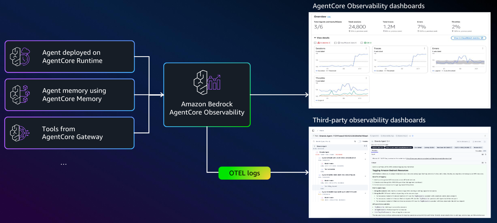<figcaption></figcaption></figure>

### 주요 기능

#### **🎯 실시간 모니터링**

* 주요 지표 추적: 지연 시간, 세션 수, 토큰 사용량, 오류율
* 풍부한 시각화 기능을 갖춘 CloudWatch 대시보드 내장

#### 🔧 심층 디버깅

* 전체 에이전트 실행 경로 추적
* 중간 출력 및 의사 결정 지점 검사
* 성능 병목 현상을 신속하게 파악

#### 📊 프로덕션 환경에 바로 적용 가능

* OpenTelemetry 호환 - 기존 모니터링 스택과 통합
* 풍부한 메타데이터 태그 기능으로 간편한 필터링 및 조사 가능
* 엔터프라이즈 배포를 위한 확장 가능한 모니터링

#### 🛡️ 규정 준수 및 감사

* 규정 준수 요구 사항에 대한 에이전트 워크플로우에 대한 완벽한 가시성 확보
* 에이전트 의사 결정 및 출력에 대한 감사 추적

### AWS 서비스와의 통합

AgentCore Observability는 다음과 같은 AWS 서비스와 통합되어 포괄적인 모니터링 및 분석 기능을 제공합니다:

* Amazon CloudWatch: 에이전트 성능 지표와 로그를 CloudWatch에 자동으로 전송하여 실시간 모니터링과 경고를 설정할 수 있습니다.
* AWS X-Ray: 에이전트 실행 과정을 추적하여 성능 병목과 오류를 식별할 수 있습니다.
* Amazon S3: 상세한 로그와 추적 데이터를 S3에 저장하여 장기 보관 및 분석을 위한 액세스를 제공합니다.
* AWS Cost Explorer: 에이전트 사용과 관련된 비용을 분석하고 추적할 수 있습니다.

### 추가 가이드

* [Add observability to your agents](https://docs.aws.amazon.com/bedrock-agentcore/latest/devguide/observability-configure.html)
* [Observability concepts](https://docs.aws.amazon.com/bedrock-agentcore/latest/devguide/observability-telemetry.html)
* [AgentCore provided metrics](https://docs.aws.amazon.com/bedrock-agentcore/latest/devguide/observability-service-provided.html)
* [View metrics for your agents](https://docs.aws.amazon.com/bedrock-agentcore/latest/devguide/observability-view.html)

## 2. Getting Started

### Enable Transaction Search

AgentCore observability를 사용하려면 트랜잭션 검색([Transaction Search](https://docs.aws.amazon.com/AmazonCloudWatch/latest/monitoring/Enable-TransactionSearch.html))을 먼저 활성화해야 합니다. AgentCore 콘솔에서 트랜잭션 검색을 자동으로 활성화하려면 'Enable Observability' 버튼을 선택하세요. CloudWatch에서도 트랜잭션 검색을 활성화할 수 있습니다.

트랜잭션 검색은 X-Ray가 수집한 모든 스팬을 CloudWatch Logs에 저장해 Logs Insights로 즉시 조회할 수 있게 하고, 필요하면 Trace Summary 색인을 추가해 오류·지연의 원인을 한눈에 파악할 고급 분석까지 제공하는 AWS CloudWatch의 분산 트랜잭션 분석 기능입니다.

* **100% Span 로그 수집** 및 저장: 애플리케이션의 모든 span 데이터를 구조화된 로그로 CloudWatch Logs의 `aws/spans` 로그 그룹에 저장합니다. 이를 통해 큰 trace(최대 10,000 spans까지도)도 문제없이 조사할 수 있습니다. (참조:[https://docs.aws.amazon.com/AmazonCloudWatch/latest/monitoring/CloudWatch-Transaction-Search.html](https://docs.aws.amazon.com/AmazonCloudWatch/latest/monitoring/CloudWatch-Transaction-Search.html))
  * Why 10,000 spans?: 분산 트레이스가 매우 복잡한 시스템에서 실행되는 경우, 스팬이 수만 개에 이를 수 있습니다. 이 제한을 통해 이러한 복잡한 트레이스에서도 **분석 가능한 범위 내에서 시각화**할 수 있도록 최적화된 값입니다.
*   **Indexing을 통한 Trace 요약 생성:** 인덱싱은 Trace Summary와 연관된 기능 (Trace Summary Search/Analytics/Insights) 을 통한 고급 트레이스 분석 활용을 위해 필요합니다. AWS는 X-Ray에서 수신된 span 중 **기본적으로 1%만(조정 가능)를** 인덱싱하여 **CloudWatch Logs Insights 쿼리로 검색 가능**하게 만듭니다.

    * 대규모 서비스에서는 trace 수가 많기 때문에, 전체 인덱싱은 **비효율적 + 쓸모 없는 정보가 많을 확률이 높습니다.**

    | **고속 검색**                        | 특정 사용자 ID나 요청 ID로 trace를 빠르게 검색 가능    |
    | -------------------------------- | ------------------------------------- |
    | **APM 대시보드 기능**                  | Application Signals에서 오류 비율, 지연 시간 분석 |
    | **CloudWatch Logs Insights와 연계** | SQL-like 쿼리로 인덱싱된 trace 데이터 분석        |

    * [https://docs.aws.amazon.com/AmazonCloudWatch/latest/monitoring/CloudWatch-Transaction-Search-ingesting-spans.html](https://docs.aws.amazon.com/AmazonCloudWatch/latest/monitoring/CloudWatch-Transaction-Search-ingesting-spans.html)
* 성능 이슈 발생 시: 즉시 비율 증가 / AB 테스트시: 해당 기간만 증가
* 비용 최적화 전략 예시: 초기 (1주일): 10% 인덱싱으로 패턴 파악 / 안정화 (2주-1달): 5% 인덱싱으로 모니터링 / 운영: 1% 인덱싱으로 비용 절약
* **시각적 검색 및 분석 UI 제공**: CloudWatch Application Signals 내의 비쥬얼 에디터를 통해 span 속성(예: 서비스 이름, 상태 코드, 비즈니스 ID 등) 기반 필터링, 그룹 분석, 시간 시계열 분석 등을 제공합니다.



<figure>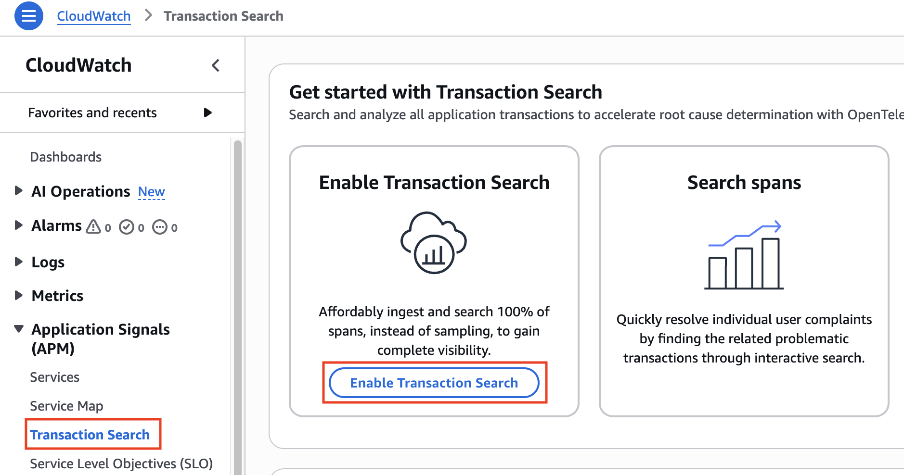<figcaption></figcaption></figure>



<figure>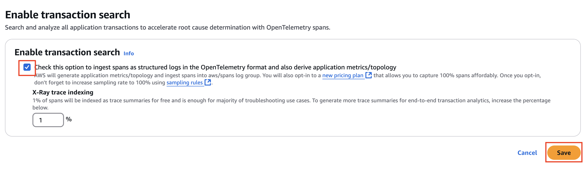<figcaption></figcaption></figure>



<figure>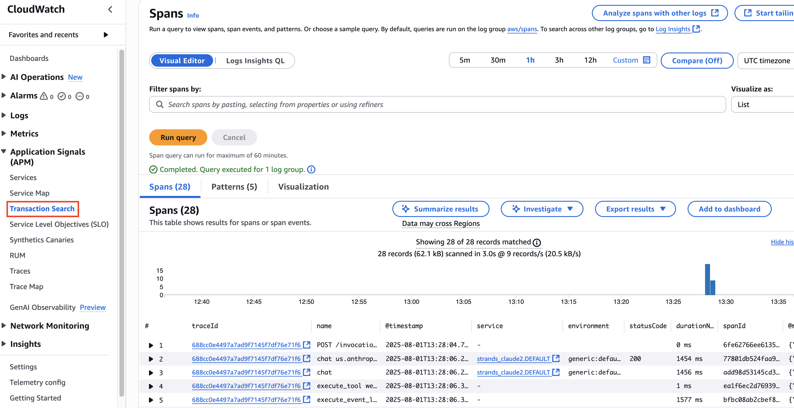<figcaption></figcaption></figure>



트랜잭션 검색 활성화 이후 에이전트 호출은 CloudWatch Logs의 `aws/spans` 로그 그룹에 저장되며, spans 키워드로 쉽게 검색할 수 있습니다.

<figure>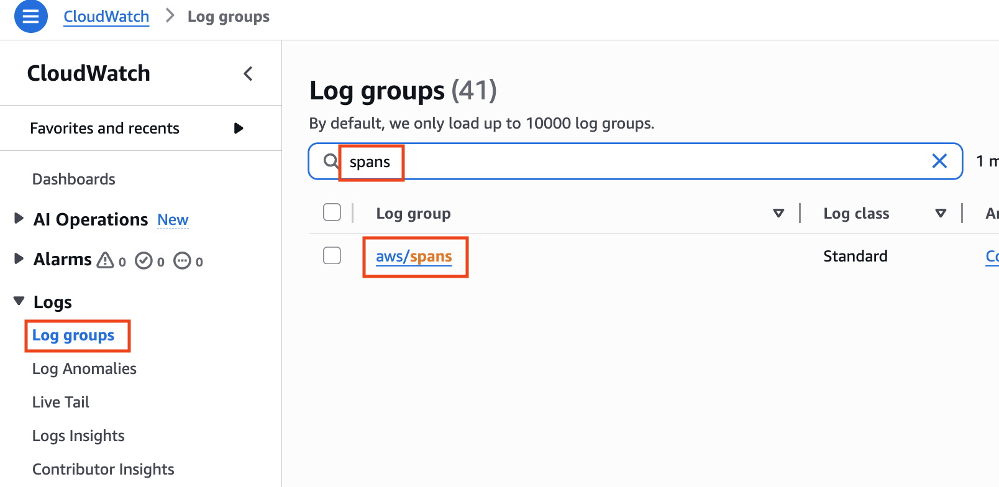<figcaption></figcaption></figure>

### Model invocation logging (Optional)

* Amazon Bedrock 콘솔 좌측의 Settings에서 Model invocation logging 활성화

<figure>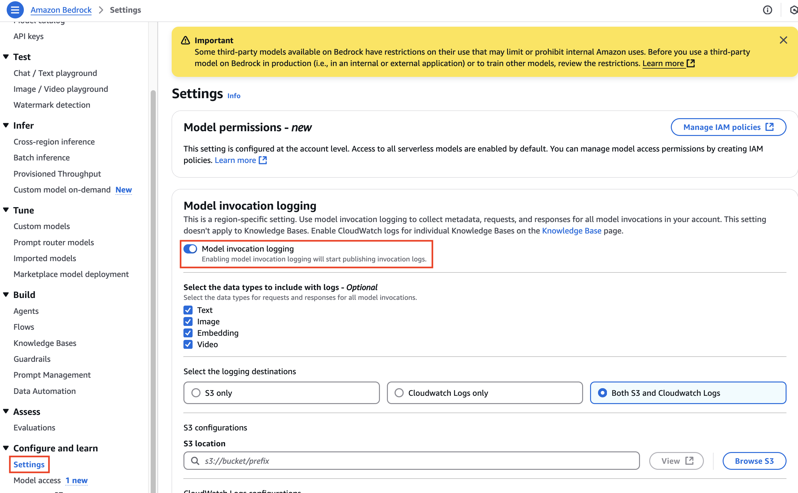<figcaption></figcaption></figure>

* **Model invocation logging**: Amazon Bedrock 콘솔에서 좌측 하단의 **Settings** 선택 후, **Model invocation logging** 활성화
* **Select the data types to include with logs**: 로그에 포함할 필수 데이터 유형 선택
* **Select the logging destinations**: 로그를 CloudWatch Logs에만 전송하거나 Amazon S3와 CloudWatch Logs 모두에 전송하도록 선택
* **CloudWatch Logs configuration**: Log group name을 생성하고 적절한 서비스 역할 선택

### **Option A: Runtime-Hosted Agents (AgentCore)**

참조: [https://github.com/awslabs/amazon-bedrock-agentcore-samples/tree/main/01-tutorials/06-AgentCore-observability/01-Agentcore-runtime-hosted](https://github.com/awslabs/amazon-bedrock-agentcore-samples/tree/main/01-tutorials/06-AgentCore-observability/01-Agentcore-runtime-hosted)

1. **SDK 설치:** `pip install aws-opentelemetry-distro boto3`


AgentCore Runtime Configure 시에 `aws-opentelemetry-distro` 패키지를 반드시 `requirements.txt`에 포함시켜야 합니다. 그러면 `Dockerfile`이 자동으로 생성되면서 `RUN pip install aws-opentelemetry-distro` 가 추가됩니다.


```python
# AgentCore Runtime Configure 
response = agentcore_runtime.configure(
    entrypoint="strands_claude.py",
    execution_role=agentcore_iam_role['Role']['Arn'],
    auto_create_ecr=True,
    requirements_file="requirements.txt", 
    region=region,
    agent_name=agent_name+"2"
)
```

```bash
# requirements.txt 예시
strands-agents
strands-agents-tools
uv
boto3
bedrock-agentcore
bedrock-agentcore-starter-toolkit
aws-opentelemetry-distro
```

2. **Restart with monitoring:** Run: `opentelemetry-instrument python my_runtime_agent.py`
   1. Starter Toolkit 사용 시 opentelemetry-instrument python 커맨드를 수행하면 자동으로 Runtime Agent가 수행됩니다.
3. **View data:** Open [CloudWatch GenAI Dashboard](https://console.aws.amazon.com/cloudwatch/home#gen-ai-observability) 을 열어서 Bedrock AgentCore 탭 클릭

위 과정 후에 AgentCore Runtime으로 에이전트를 배포하면 GenAI Observavility 대시보드를 통해 log, trace, metrics등을 확인할 수 있습니다.

### **Option B: Local Agents (Non-Runtime Hosted Agents)**

Local, Lambda, EC2, EKS 등의 non-AgentCore 환경에서 로깅하는 방법 - 참조: [https://github.com/awslabs/amazon-bedrock-agentcore-samples/tree/main/01-tutorials/06-AgentCore-observability/02-Agent-not-hosted-on-runtime](https://github.com/awslabs/amazon-bedrock-agentcore-samples/tree/main/01-tutorials/06-AgentCore-observability/02-Agent-not-hosted-on-runtime)

* 아래와 같이 프로젝트의 `.env`에 OTEL 환경 변수를 추가한 후 몇 줄의 코드를 수정해야 합니다.

#### 환경 변수 (.env)

`.env.template` (\<agent-name>, \<agent-id> 변경 필요)


* `OTEL_RESOURCE_ATTRIBUTES` 환경 변수에 에이전트 이름을 반드시 명시해 주세요.
* 이미 사용하고 있는 log group과 log stream이 있다면 `OTEL_EXPORTER_OTLP_LOGS_HEADERS` 환경 변수에 x-aws-log-group과 x-aws-log-stream을 추가해 주세요.&#x20;


```bash
AGENT_OBSERVABILITY_ENABLED=true
OTEL_PYTHON_DISTRO=aws_distro
OTEL_PYTHON_CONFIGURATOR=aws_configurator # required for ADOT Python only
OTEL_RESOURCE_ATTRIBUTES=service.name=<agent-name>,aws.log.group.names=/aws/bedrock-agentcore/runtimes/<agent-id>,cloud.resource_id=<AgentEndpointArn:AgentEndpointName> # endpoint is optional
OTEL_EXPORTER_OTLP_LOGS_HEADERS=x-aws-log-group=/aws/bedrock-agentcore/runtimes/<agent-id>,x-aws-log-stream=runtime-logs,x-aws-metric-namespace=bedrock-agentcore
OTEL_EXPORTER_OTLP_PROTOCOL=http/protobuf
OTEL_TRACES_EXPORTER=otlp
```

`.env` 예시

```bash
# =============================================================================
# OpenTelemetry Configuration for AWS CloudWatch GenAI Observability
# =============================================================================

# AWS OpenTelemetry Distribution
OTEL_PYTHON_DISTRO=aws_distro
OTEL_PYTHON_CONFIGURATOR=aws_configurator

# Export Protocol
OTEL_EXPORTER_OTLP_PROTOCOL=http/protobuf
OTEL_TRACES_EXPORTER=otlp

# CloudWatch Integration (uncomment and configure as needed)
OTEL_EXPORTER_OTLP_LOGS_HEADERS=x-aws-log-group=agents/strands-agent-logs,x-aws-log-stream=default,x-aws-metric-namespace=agents

# Service Identification
OTEL_RESOURCE_ATTRIBUTES=service.name=agentic-travel-strands

# Enable Agent Observability
AGENT_OBSERVABILITY_ENABLED=true

```

`OTEL_EXPORTER_OTLP_LOGS_HEADERS=x-aws-log-group=agents/strands-agent-logs,x-aws-log-stream=default,x-aws-metric-namespace=agents` 로 설정 후, `opentelemetry-instrument` 커맨드로 로컬 환경에서 에이전트 실행 시:



<figure>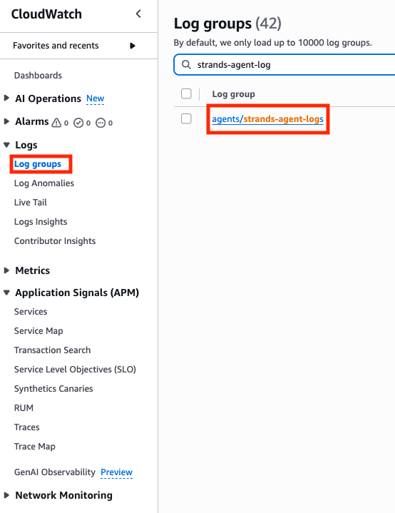<figcaption></figcaption></figure>



<figure>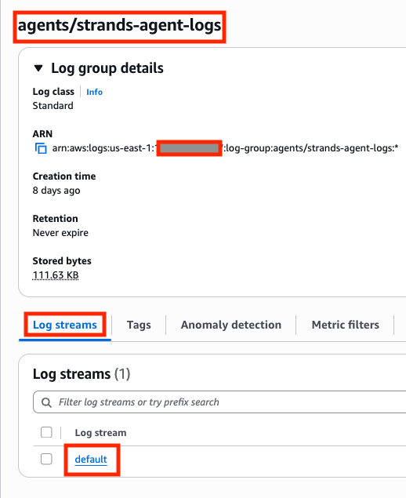<figcaption></figcaption></figure>



`OTEL_RESOURCE_ATTRIBUTES=service.name=custom-span-agent` 로 설정 후, `opentelemetry-instrument` 커맨드로 로컬 환경에서 에이전트 실행 시:

<figure>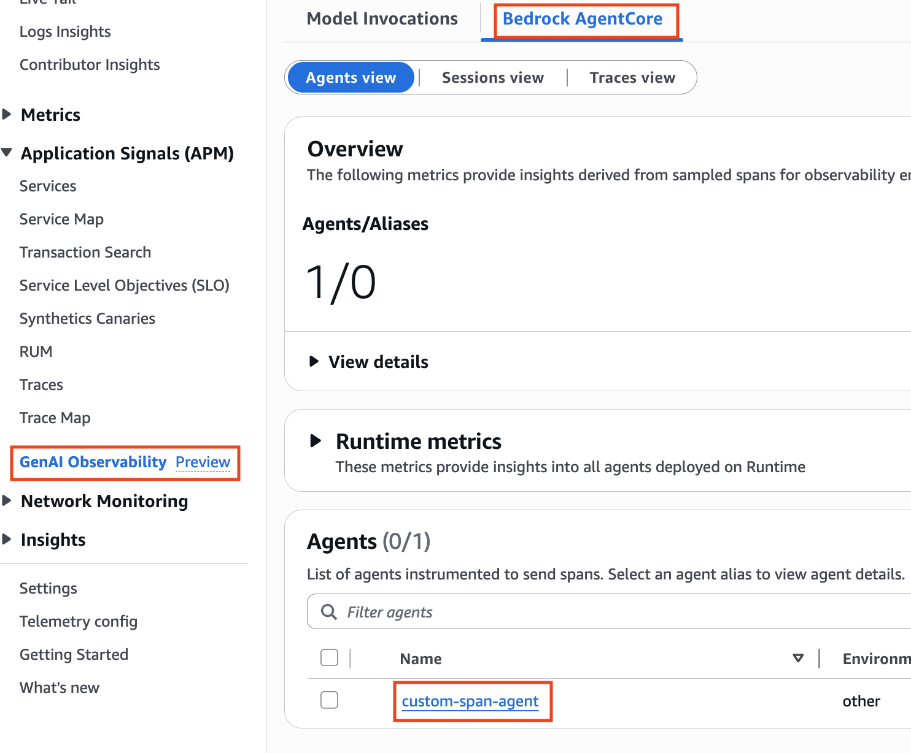<figcaption></figcaption></figure>

#### Session ID Support

* `baggage.set_baggage("session.id", session_id)`

```python
from opentelemetry import baggage, context

def parse_arguments():
    parser = argparse.ArgumentParser(description='LangGraph Travel Agent with Session Tracking')
    parser.add_argument('--session-id', type=str, required=True, help='Session ID to associate with this agent run')
    parser.add_argument('--user-type', type=str, help='User type for analysis (e.g., premium, free)')
    parser.add_argument('--experiment-id', type=str, help='Experiment ID for A/B testing')
    parser.add_argument('--dataset', type=str, help='Dataset name for offline evaluation')
    return parser.parse_args()

def set_session_context(session_id, user_type=None, experiment_id=None, dataset=None):
    ctx = baggage.set_baggage("session.id", session_id)
    
    if user_type:
        ctx = baggage.set_baggage("user.type", user_type, context=ctx)
    if experiment_id:
        ctx = baggage.set_baggage("experiment.id", experiment_id, context=ctx)
    if dataset:
        ctx = baggage.set_baggage("dataset", dataset, context=ctx)
    
    return context.attach(ctx)
    
    
def main():
    args = parse_arguments()
    context_token = set_session_context(args.session_id, args.user_type, args.experiment_id, args.dataset)
    
    try:
        input_query = "Hi, can you tell me about Broadway shows in NYC today at 7pm?"
        result = agent_invocation(input_query, args.session_id)
        print("Basic Query Result:", result)
        
        task_description = "Research and recommend suitable travel destinations for someone looking for cowboy vibes, rodeos, and museums in New York city. Use web search to find current information about venues, events, and attractions."
        task_result = run_agent_with_task(task_description, args.session_id)
        print("Task-based Query Result:", task_result)
        
    finally:
        context.detach(context_token)

if __name__ == "__main__":
    main()    
```

Session 적용/미적용 코드 차이

<figure>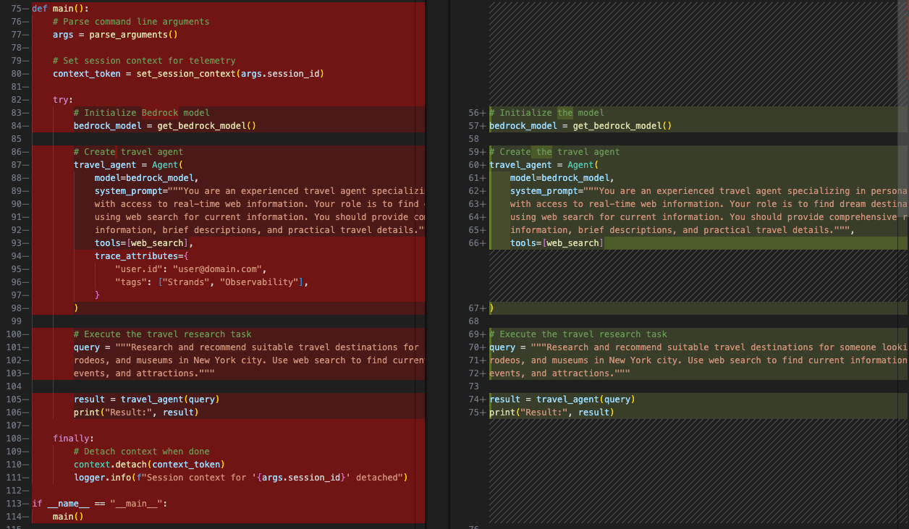<figcaption></figcaption></figure>

### Creating a Custom Span Agent

Span은 에이전트 관측성에 필수적인 다음과 같은 속성을 포함합니다:

* 실행 중인 특정 함수나 프로세스를 식별하는 작업 이름
* 작업의 정확한 시작 및 종료 시간을 표시하는 타임스탬프
* 작업들이 더 큰 프로세스 내에서 어떻게 중첩되는지 보여주는 부모-자식 관계
* 작업에 대한 컨텍스트 메타데이터를 제공하는 태그와 속성
* 스팬 수명 내 중요한 사건을 표시하는 이벤트
* 성공, 실패 또는 기타 완료 상태를 나타내는 상태 정보
* 작업에 특화된 리소스 사용량 지표

Custom Span을 정의하면 에이전트 실행 흐름 내 특정 작업이나 구간을 추적할 수 있습니다.

* **특정 작업 추적**: 도구 호출, 데이터 처리, 의사결정 지점 등 중요한 작업에 대한 스팬 생성
* **커스텀 속성 추가**: 필터링 및 분석을 위한 비즈니스 특화 메타데이터로 스팬을 풍부하게 함
* **이벤트 기록**: 스팬 수명 주기 내 중요한 순간 표시
* **오류 추적**: 상세한 컨텍스트와 함께 오류 캡처 및 보고
* **관계 설정**: 실행 흐름 모델링을 위해 스팬 간 부모-자식 관계 생성

이를 통해 CloudWatch GenAI Observability 대시보드에 표시되는 내용을 훨씬 더 세밀하게 제어할 수 있습니다.

#### Code snippet

```python
### Step 1. Tracer 생성
# 트레이서는 스팬을 생성하는 역할을 합니다. 이름(보통 서비스나 컴포넌트 이름)과 버전을 제공합니다.
tracer = trace.get_tracer("web_search", "1.0.0")

...
### Step 2. Span 작업 수행
with tracer.start_as_current_span("custom span web search tool") as span:
  ...
    
	### Step 3. 속성 추가
	# 속성은 스팬에 대한 컨텍스트를 제공하는 키-값 쌍입니다. 
	# CloudWatch에서 필터링과 분석에 사용할 수 있습니다.
	span.set_attribute("search.query", query)
	span.set_attribute("tool.name", "web_search")
	
	...
	
	### Step 4. 이벤트 기록
	# 이벤트는 스팬 수명 주기 내 중요한 순간을 표시합니다. 추가 속성을 포함할 수 있습니다.
	span.add_event("search_started", {"query": query})

  ### Step 5. 상태 설정하기
  # 상태는 작업이 성공했는지 오류가 있었는지를 나타냅니다.
	span.set_status(trace.Status(trace.StatusCode.OK))
	# 또는 오류가 발생한 경우
	span.set_status(trace.Status(trace.StatusCode.ERROR, str(e)))
```

<figure>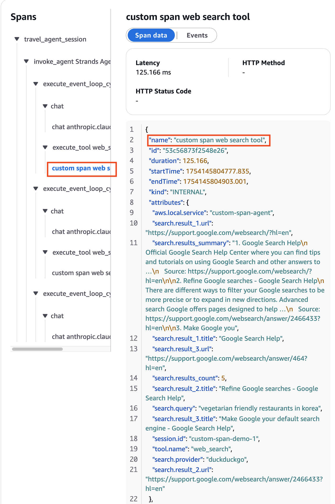<figcaption></figcaption></figure>

### GenAI Observability 화면

#### Model Invocations Tab

* **Invocation count** (호출 횟수) – Converse, ConverseStream, InvokeModel, InvokeModelWithResponseStream API 작업에 대한 성공적인 요청 수
* **Invocation latency** – 호출의 지연 시간
* **Token Counts by Mode** – 입력 토큰 수와 출력 토큰 수로 구분된 모델별 토큰 수
* **Daily Token Counts by ModelID** – 모델 ID별 일일 총 토큰 수
* **InputTokenCount, OutputTokenCoun**t – 선택한 모델 전반에 걸친 해당 계정의 입력 및 출력 토큰 총 수
* **Requests, grouped by input tokens** (입력 토큰별 요청 수) – 6개의 범위로 나눈 입력 토큰별 요청 수. 각 라인은 특정 범위에 속하는 요청 수를 나타냄
* **Invocation Throttles** (호출 제한 횟수) – 시스템이 제한한 호출 수. 표시되는 제한 횟수는 SDK의 retry 설정에 따라 달라짐. (참조: [https://docs.aws.amazon.com/sdkref/latest/guide/feature-retry-behavior.html](https://docs.aws.amazon.com/sdkref/latest/guide/feature-retry-behavior.html))
* **Invocation Error Count**  – 서버 측 및 클라이언트 측 오류로 인해 발생한 호출 수

<figure>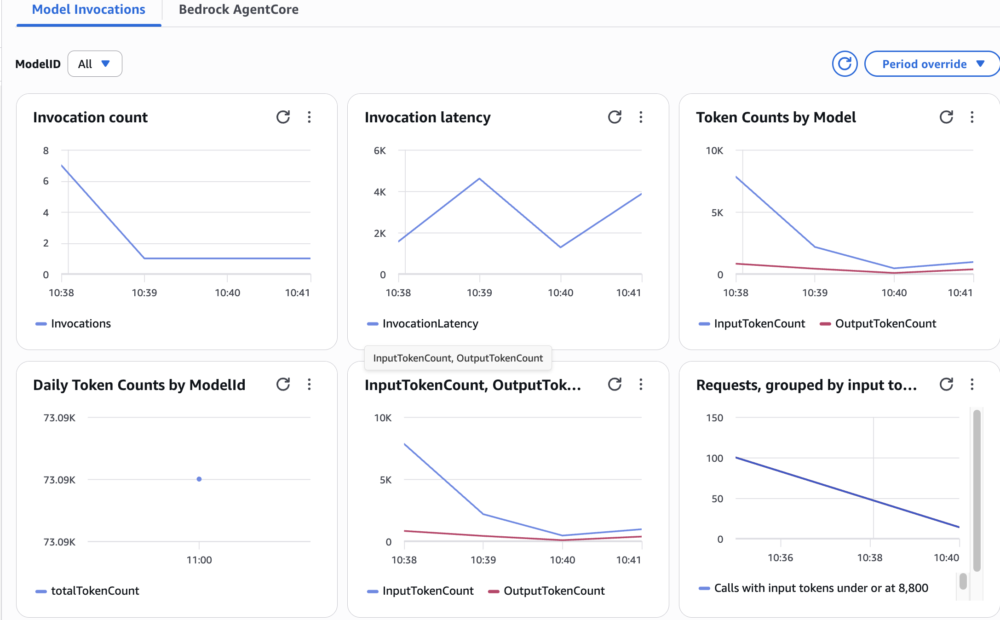<figcaption></figcaption></figure>

#### Bedrock AgentCore Tab



<figure>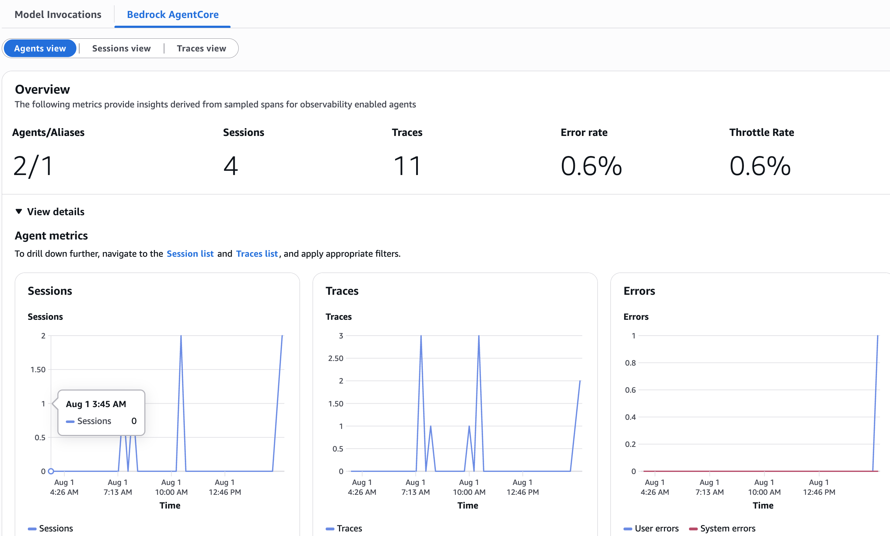<figcaption></figcaption></figure>



<figure>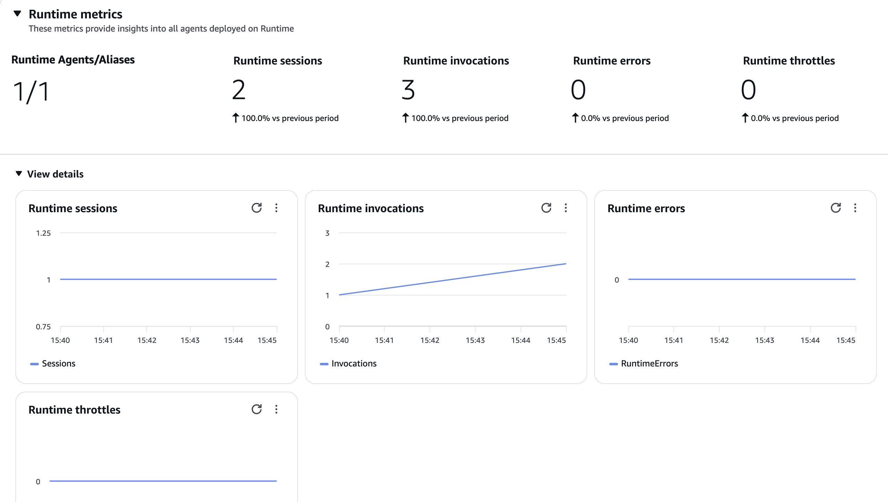<figcaption></figcaption></figure>



* **Runtime sessions** (런타임 세션) - AgentCore Runtime에서 실행되는 에이전트가 생성한 세션 수 추적. 세션은 대화와 유사하며 전체 상호작용 흐름의 광범위한 맥락을 포함하며, 전반적인 플랫폼 사용량 모니터링, 용량 계획 및 사용자 참여 패턴 파악에 유용함.
* **Runtime invocations** (런타임 호출) - 데이터 플레인 API에 대한 총 요청 수. 각 API 호출은 요청 페이로드 크기 또는 응답 상태에 관계없이 하나의 호출로 계산됨
* **Runtime error** (런타임 오류) - 시스템 및 사용자 오류 수
* **Runtime throttles** (런타임 제한) - 허용된 TPS(초당 트랜잭션 수)를 초과하여 서비스에서 제한되는 요청 수로 HTTP 상태 코드 429와 함께 ThrottlingException 반환

**Sessions View & Traces View**



<figure><figcaption></figcaption></figure>



<figure>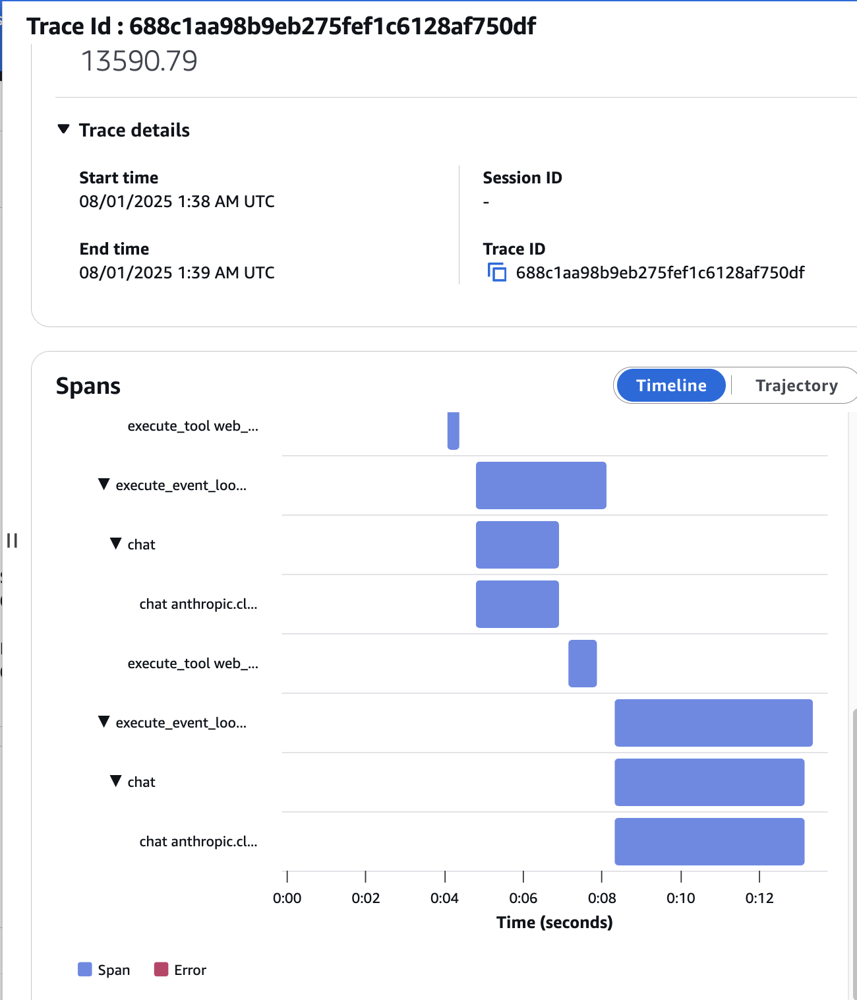<figcaption></figcaption></figure>



<figure>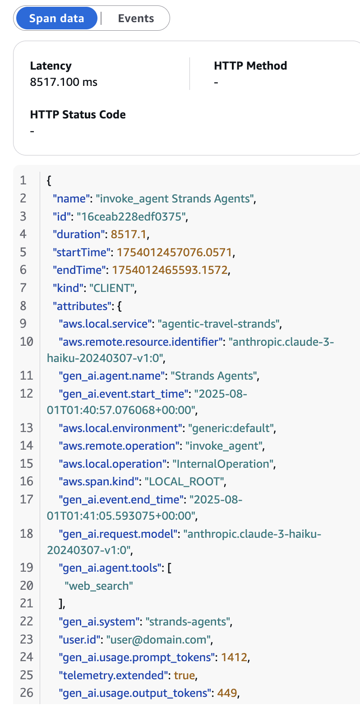<figcaption></figcaption></figure>



## 3. 결론

***

Amazon Bedrock AgentCore Observability는 AI 에이전트의 성능, 사용량 및 동작을 모니터링하고 분석하기 위한 포괄적인 도구 세트를 제공합니다. 이 서비스를 통해 에이전트 운영에 대한 가시성을 높이고, 문제를 신속하게 진단하며, 사용자 경험을 최적화할 수 있습니다.

CloudWatch, X-Ray, S3 등의 AWS 서비스와의 통합을 통해 실시간 모니터링, 상세한 로깅, 추적 및 경고 기능을 제공하여 에이전트의 안정성과 성능을 보장합니다.

다른 AgentCore 서비스(Runtime, Memory, Code Interpreter 등)와 함께 사용하면 에이전트의 전체 수명 주기를 통해 성능과 사용자 경험을 지속적으로 개선할 수 있습니다.
