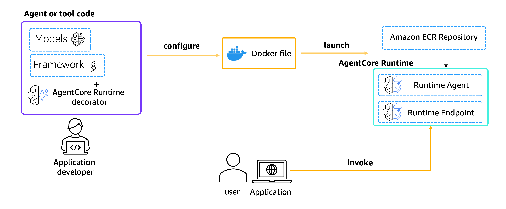
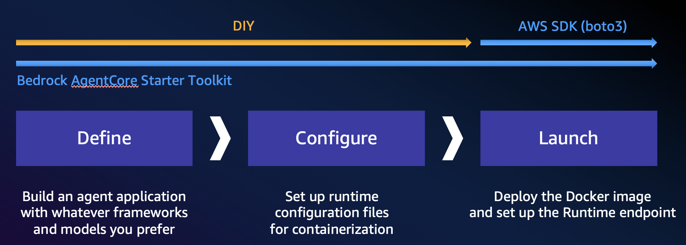
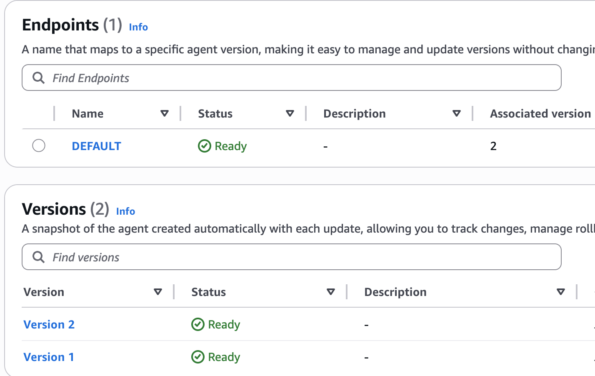
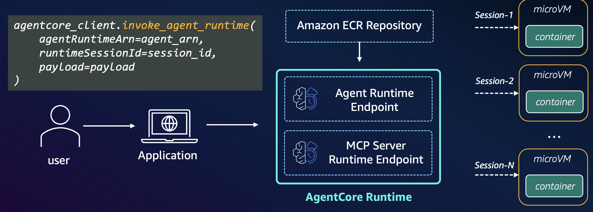
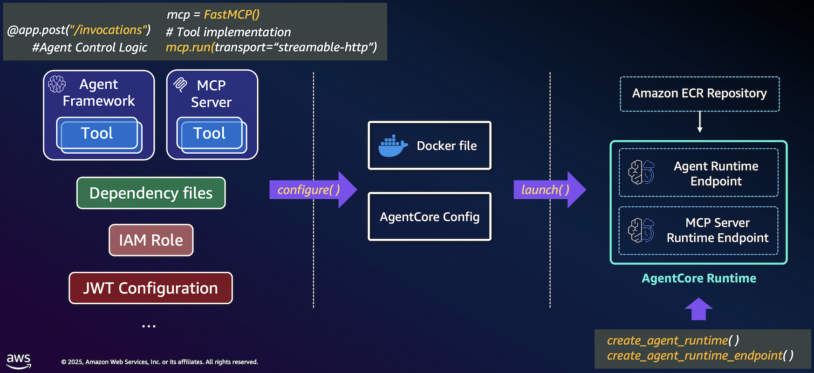
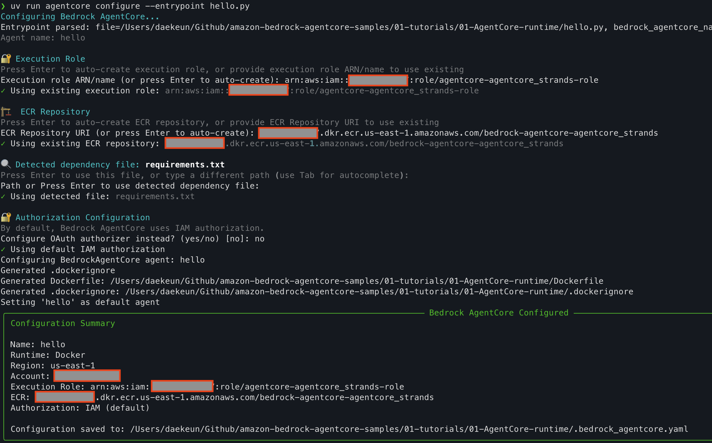
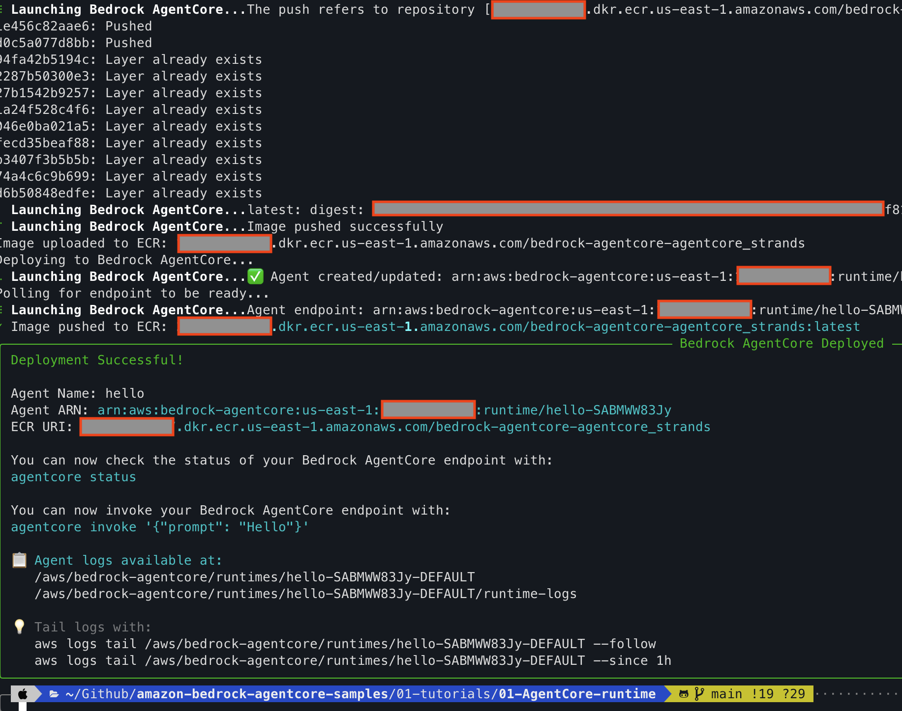
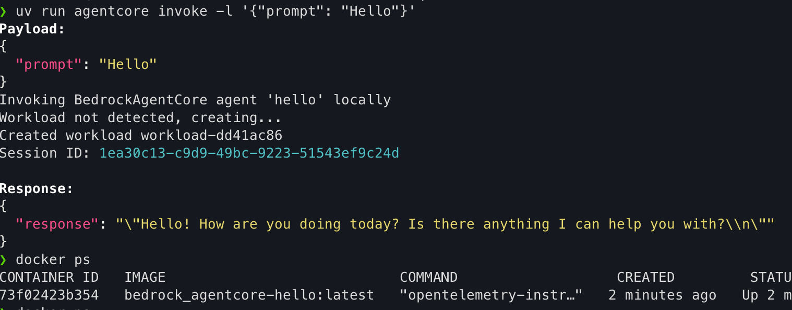
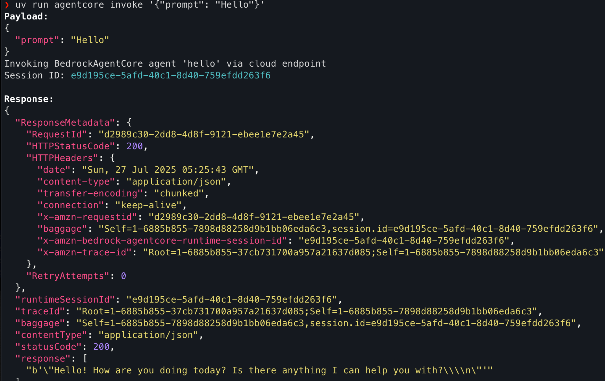
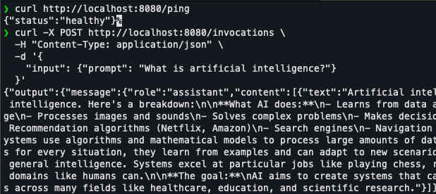

# AgentCore Runtime

## 1. Overview

***

Amazon Bedrock AgentCore Runtime은 동적 AI 에이전트와 도구를 배포하고 확장하기 위해 특별히 설계된 안전한 서버리스 런타임입니다. 어떤 프레임워크, 프로토콜 또는 모델을 사용하더라도 에이전트를 안전하게 배포하고 운영할 수 있도록 해줍니다.

AgentCore Runtime은 업계 최고의 확장 런타임 지원, 빠른 콜드 스타트, 진정한 세션 격리, 내장된 ID 및 멀티모달 페이로드 지원과 함께 에이전트 워크로드를 위해 구축되었습니다. 개발자는 혁신에 집중하는 동안 Amazon Bedrock AgentCore Runtime이 인프라와 보안을 처리하여 시장 출시 시간을 단축합니다.

### AgentCore Runtime의 주요 특징

* 프레임워크 독립적 (Framework agnostic): 기본 프레임워크에 관계없이 몇 줄의 코드로 로컬 에이전트 코드를 클라우드 네이티브 배포로 변환할 수 있습니다. LangGraph, Strands, CrewAI 등 인기 프레임워크와 원활하게 작동합니다.
* 모델 유연성 (Model flexibility): AWS Bedrock, Anthropic Claude, Google Gemini, OpenAI 등 모든 대규모 언어 모델과 함께 작동합니다.
* 프로토콜 지원 (Protocol support): 에이전트가 Model Context Protocol (MCP)를 통해 다른 에이전트 및 도구와 통신할 수 있습니다.
* \[중요] 간편한 배포: Python SDK의 `@app.entrypoint` 데코레이터로 로컬 함수를 HTTP 서비스화할 수 있어, 최소한의 코드 변경으로 프로토타입에서 본격 운영 환경으로 전환이 가능합니다.
* 확장된 실행 시간 (Extended execution time): 실시간 상호작용과 **최대 8시간까지의 장기 실행 워크로드**를 지원합니다. 이를 통해 멀티 에이전트 협업이나 장기간 문제 해결 세션을 포함한 복잡한 에이전트 추론과 비동기 워크로드를 가능하게 합니다.
* 향상된 페이로드 처리 (Enhanced payload handling): **100MB 페이로드를 처리**할 수 있어 텍스트, 이미지, 오디오, 비디오와 같은 여러 모달리티의 원활한 처리를 가능하게 합니다.
* 세션 격리 (Session isolation): 각 사용자 세션은 격리된 CPU, 메모리 및 파일 시스템 리소스가 있는 전용 microVM에서 실행됩니다. 이를 통해 사용자 세션 간의 완전한 분리가 보장되어 상태가 있는 에이전트 추론 프로세스를 보호하고 세션 간 데이터 오염을 방지합니다.
* 소비 기반 가격 모델 (Consumption-based pricing model): 실제로 소비된 리소스에 대해서만 과금하는 소비 기반 가격 책정을 구현합니다. 리소스를 미리 선택해야 하는 할당 기반 모델과 달리, Runtime은 필요한 것을 동적으로 프로비저닝합니다.
* 내장된 인증 (Built-in authentication): Amazon Bedrock AgentCore Identity에서 제공하는 Runtime은 AI 에이전트에 고유한 ID를 할당하고 Okta, Microsoft Entra ID, Amazon Cognito와 같은 기업 ID 제공자와 원활하게 통합되어 사용자가 액세스 권한이 있는 에이전트에만 인증할 수 있습니다.
* 통합된 에이전트 특화 기능 세트 (Unified set of agent-specific capabilities): Memory, Tools, Gateway를 포함한 전체 Amazon Bedrock AgentCore 기능에 대한 간소화된 액세스를 제공하는 단일한 포괄적 SDK를 통해 제공됩니다.

### AgentCore Runtime 요구 사항

에이전트 애플리케이션이 Amazon Bedrock 에이전트 호스팅 인프라와 통합하기 위해 구현해야 하는 표준화된 통신 프로토콜을 정의합니다. 이는 사용자 정의 에이전트 코드와 AWS의 관리형 호스팅 환경 간의 원활한 통신을 보장합니다.

#### 지원되는 프로토콜

AgentCore Runtime 서비스 계약은 두 가지 통신 프로토콜을 지원합니다:

* **HTTP 프로토콜**: 전통적인 요청/응답 패턴을 위한 직접적인 REST API 엔드포인트
* **MCP 프로토콜**: 도구 및 에이전트 서버를 위한 Model Context Protocol

#### 컨테이너 요구사항

에이전트는 다음 사양을 충족하는 컨테이너화된 애플리케이션으로 배포되어야 합니다:

* 호스트: **`0.0.0.0`**
* 포트: HTTP 프로토콜의 경우 8080, MCP 프로토콜의 경우 8000 → **`0.0.0.0:8000/mcp`**

#### HTTP 프로토콜: 기존 요청/응답 REST API 엔드포인트

HTTP 프로토콜을 사용하는 에이전트는 다음 엔드포인트를 구현해야 합니다:

* **`/invocations`** (POST): 주요 에이전트 상호작용 엔드포인트로 JSON 입력과 JSON/SSE 출력을 지원합니다. 사용자나 애플리케이션에서 들어오는 요청을 받아 에이전트의 비즈니스 로직을 통해 처리합니다.
* **`/ping`** (GET): 에이전트가 작동 중이고 요청을 처리할 준비가 되었는지 확인합니다. 서비스 모니터링과 AWS의 관리형 인프라를 통한 자동 복구를 위해 사용됩니다.

#### MCP 프로토콜: 도구 및 에이전트 서버를 위한 모델 컨텍스트 프로토콜

MCP 프로토콜을 사용하는 에이전트는 다음 요구사항을 구현해야 합니다:

* 트랜스포트: 상태 리스 streamable-http만 지원 - AWS의 세션 관리 및 로드 밸런싱과의 호환성 보장
* 세션 관리: 플랫폼은 세션 격리를 위해 자동으로 Mcp-Session-Id 헤더를 추가하며, 서버는 플랫폼에서 생성한 Mcp-Session-Id 헤더를 거부하지 않도록 상태 리스 작동을 지원해야 합니다.
* **`/mcp`** (POST): MCP RPC 메시지를 받아 에이전트의 도구 기능을 통해 처리합니다. 표준 MCP RPC 메시지가 포함된 InvokeAgentRuntime API 페이로드의 완전한 통과를 제공합니다.

## 2. 개발 단계

***

### 아키텍처

<figure><figcaption></figcaption></figure>

<figure><figcaption></figcaption></figure>

### Step 1. Implement Your Own Agent

* 에이전트를 AgentCore Runtime에 배포하기 전에, 실험 목적으로 로컬에서 개발하고 실행. 자유롭게 에이전트 프레임워크 선택 가능 (Strands, LangGraph 등)

### Step 2. Define

* `from bedrock_agentcore.runtime import BedrockAgentCoreApp` 명령어를 사용하여 런타임 앱 가져오기
* `app = BedrockAgentCoreApp()` 명령어를 사용하여 코드에서 앱을 초기화
* 에이전트의 호출 함수에 `@app.entrypoint` 데코레이터를 붙여 런타임의 진입점으로 설정
* `app.run()` 명령어를 사용하여 AgentCoreRuntime이 에이전트 실행을 제어하게 함

### Step 3. Configure and Launch

* `requirements.txt` 생성 (agentcore, 스타터킷 패키지 등)
* AgentCore Runtime 초기화
* **AgentCore Config**: AgentCore Runtime에 배포하기 위한 설정 파일 (`Dockerfile`, `.bedrock_agentcore.yml` 생성). ECR과 Inbound identity(IAM role or JWT; JSON Web Tokens)을 명시하거나 자동으로 생성할 수 있습니다.&#x20;
  * For AgentCore Identity: 기본적으로는 인증에 IAM을 사용하나, OAuth를 사용할 수도 있습니다. OAuth를 사용하는 경우 AgentCore 런타임 리소스 또는 AgentCore 게이트웨이 엔드포인트를 구성할 때 다음을 지정해야 합니다.
    * OAuth 검색 서버 URL — OpenID Connect 검색 URL의 ^.+/\\.well-known/openid-configuration$ 패턴과 일치해야 하는 문자열
      * 허용된 대상 — JWT 토큰에 허용되는 대상 목록
      * 허용된 클라이언트 — 허용되는 클라이언트 식별자 목록

```python
from bedrock_agentcore_starter_toolkit import Runtime
from boto3.session import Session
boto_session = Session()
region = boto_session.region_name
agentcore_runtime = Runtime()

response = agentcore_runtime.configure(
    entrypoint="strands_claude.py",
    execution_role=agentcore_iam_role['Role']['Arn'],
    auto_create_ecr=True,
    requirements_file="requirements.txt",
    region=region,
    agent_name=agent_name,
    
    # For AgentCore Identity
    authorizer_configuration={
        "customJWTAuthorizer": {
            "discoveryUrl": discovery_url,
            "allowedClients": [client_id]
        }
    }    
)
```

* **AgentCore Launch**: 에이전트를 AgentCore Runtime으로 호스팅할 때 SDK는 자동으로 다음을 수행합니다.
  * 포트 `8080`에서 에이전트를 호스팅합니다.
  * 두 가지 주요 엔드포인트를 제공합니다.
    * `/invocations`: 주요 에이전트 상호작용(JSON 입력 → JSON/SSE 출력)
    * `/ping`: 모니터링을 위한 상태 확인
* **Versioning**: Agent 런타임을 생성하면 버전 1(V1)이 자동으로 생성됩니다. 컨테이너 이미지, 프로토콜 설정, 네트워크 설정 등 구성이 업데이트될 때마다 새 버전이 생성됩니다. → 배포 내역 및 롤백 기능 제공

<figure><figcaption></figcaption></figure>

### Step 4. Invoke

<figure><figcaption></figcaption></figure>

```python
invoke_response = agentcore_runtime.invoke({"prompt": "How is the weather now?"})
```

* 2025.09 기준으로 파이썬, 타입스크립트, 자바스크립트 코드 스니펫 제공

## 3. Getting Started (AWS CLI w/ Starter Toolkit)

***


파이썬 샘플 코드를 돌려보기 전에 CLI를 통해 돌려 보면 동작 원리를 더 쉽게 이해할 수 있습니다.


<figure><figcaption></figcaption></figure>

### **Step 1. 준비**

패키지 설치

```bash
uv add bedrock-agentcore bedrock-agentcore-starter-toolkit
or
pip install bedrock-agentcore bedrock-agentcore-starter-toolkit
```

다음 구조로 프로젝트 폴더 생성

```bash
## 프로젝트 폴더 구조
your_project_directory/
├─ hello.py # 주요 에이전트 코드
├─ requirements.txt # 에이전트의 종속성
└─ __init__.py # 디렉토리를 Python 패키지로 만듬
```

`hello.py`

* 기존 구현에 `@app.entrpoint` 데코레이터만 추가

```python
from bedrock_agentcore.runtime import BedrockAgentCoreApp
from strands import Agent
agent = Agent()
app = BedrockAgentCoreApp()

# Define entrypoint
@app.entrypoint
def invoke(payload):
    """Process user input and return a response"""
    user_message = payload.get("prompt", "Hello")
    response = agent(user_message)
    return str(response)
    
if __name__ == "__main__":
    app.run()
```

`requirements.txt` 예시

```
strands-agents
strands-agents-tools
uv
boto3
bedrock-agentcore
bedrock-agentcore-starter-toolkit
```

에이전트를 설정하기 위한 구성 명령 실행

```bash
agentcore configure --entrypoint agent_example.py -er <YOUR_IAM_ROLE_ARN> --region us-east-1

# 이 명령은 다음을 수행합니다:
## Dockerfile과 .dockerignore 생성
## .bedrock_agentcore.yaml 구성 파일 생성

agentgcore configure --help
│ --entrypoint         -e        TEXT  Python file with BedrockAgentCoreApp [default: None]                                                                                                                                                  │
│ --name               -n        TEXT  [default: None]                                                                                                                                                                                       │
│ --execution-role     -er       TEXT  [default: None]                                                                                                                                                                                       │
│ --ecr                -ecr      TEXT  [default: None]                                                                                                                                                                                       │
│ --container-runtime  -ctr      TEXT  [default: None]                                                                                                                                                                                       │
│ --requirements-file  -rf       TEXT  Path to requirements file [default: None]                                                                                                                                                             │
│ --disable-otel       -do             Disable OpenTelemetry                                                                                                                                                                                 │
│ --authorizer-config  -ac       TEXT  OAuth authorizer configuration as JSON string [default: None]                                                                                                                                         │
│ --verbose            -v              Enable verbose output                                                                                                                                                                                 │
│ --region             -r        TEXT  [default: None]                                                                                                                                                                                       │
│ --protocol           -p        TEXT  Server protocol (HTTP or MCP) [default: None]                                                                                                                                                         │
│ --help                               Show this message and exit.
```

<figure><figcaption></figcaption></figure>

`Dockerfile` (자동으로 생성되며, `.dockerignore`도 같이 생성됨)

```docker
FROM public.ecr.aws/docker/library/python:3.12-slim
WORKDIR /app

COPY requirements.txt requirements.txt
# Install from requirements file
RUN pip install -r requirements.txt

RUN pip install aws-opentelemetry-distro>=0.10.0

# Set AWS region environment variable
ENV AWS_REGION=us-east-1
ENV AWS_DEFAULT_REGION=us-east-1

# Signal that this is running in Docker for host binding logic
ENV DOCKER_CONTAINER=1

# Create non-root user
RUN useradd -m -u 1000 bedrock_agentcore
USER bedrock_agentcore

EXPOSE 8080
EXPOSE 8000

# Copy entire project (respecting .dockerignore)
COPY . .

# Use the full module path 
# CMD ["opentelemetry-instrument", "python", "-m", "hello"]

# --disable-otel 옵션 활성화 시 (로컬 모드 테스트 시 권장)
CMD ["python", "-m", "hello"] 
```

`.bedrock_agentcore.yml` (자동으로 생성됨)

```yaml
default_agent: hello
agents:
  hello:
    name: hello
    entrypoint: hello.py
    platform: linux/arm64
    container_runtime: docker
    aws:
      execution_role: arn:aws:iam::xxxxxxxxxxx:role/AmazonBedrockAgentCoreSDKRuntime-us-east-1-2cf24dba5f
      execution_role_auto_create: false
      account: 'xxxxxxxxxxx'
      region: us-east-1
      ecr_repository: xxxxxxxxxxxx.dkr.ecr.us-east-1.amazonaws.com/bedrock-agentcore-agentcore_strands
      ecr_auto_create: false
      network_configuration:
        network_mode: PUBLIC
      protocol_configuration:
        server_protocol: HTTP
      observability:
        enabled: true
    bedrock_agentcore:
      agent_id: hello-SABMWW83Jy
      agent_arn: arn:aws:bedrock-agentcore:us-east-1:xxxxxxxxxxxx:runtime/hello-SABMWW83Jy
      agent_session_id: xxxxxxxxxxxx
    codebuild:
      project_name: null
      execution_role: null
      source_bucket: null
    authorizer_configuration: null
    oauth_configuration:
      workload_name: workload-xxxxxxxx

```

### **Step 2: 에이전트 테스트 및 배포**

Note: `-l` 옵션을 붙이면 컨테이너를 로컬에서 실행하여 테스트할 수 있습니다. (추천 테스트 단계: 로컬 개발 → 로컬 배포 → AWS 배포)

```bash
### 단계 2: 에이전트를 클라우드에 시작

## 로컬 테스팅: 개발 및 테스트를 위해 로컬에 agentcore를 배포하여 에이전트를 실행할 수 있습니다
agentcore launch -l

## 이는 다음을 수행합니다:
### Docker 이미지 빌드
### 로컬에서 컨테이너 실행
### http://localhost:8080에서 서버 시작

# AWS에 에이전트 배포:
agentcore launch

# 이 명령은 다음을 수행합니다:
### 에이전트 코드로 Docker 이미지 빌드
### Amazon ECR에 이미지 푸시
### Bedrock AgentCore 런타임 생성
### 클라우드에 에이전트 배포
```

로컬 모드 배포

```bash
❯ uv run agentcore launch -l
Launching Bedrock AgentCore (local mode)...

Launching Bedrock AgentCore agent 'hello' locally
⠙ Launching Bedrock AgentCore...Docker image built: bedrock_agentcore-hello:latest
✓ Docker image built: bedrock_agentcore-hello:latest
✓ Ready to run locally
Starting server at <http://localhost:8080>
```

AWS 배포

<figure><figcaption></figcaption></figure>

### **Step 3: 에이전트 테스트**

```bash
# 로컬 배포 이후
agentcore invoke -l '{"prompt": "Hello"}'

# 클라우드 배포 이후
agentcore invoke '{"prompt": "Hello"}'
```



<figure><figcaption></figcaption></figure>



<figure><figcaption></figcaption></figure>



`agentcore launch`의 출력에서 에이전트의 ARN을 기록해 두세요. `InvokeAgentRuntime` 작업으로 에이전트를 호출할 때 필요합니다.

* HTTP Request도 가능함 - 예시: [`https://bedrock-agentcore.us-east-1.amazonaws.com/runtimes/{URL_ENCODED_ARN}/invocations?qualifier=DEFAULT`](https://bedrock-agentcore.us-east-1.amazonaws.com/runtimes/%7BURL_ENCODED_ARN%7D/invocations?qualifier=DEFAULT)

**Session Lifecycle**

* Fast start: 200ms
* 5 mins: Session suspended (애플리케이션 상태, 파일시스템, 환경 변수는 유지됨)
* 15 mins: Session timeout
* 8 hour: Max session duration

추가 핸즈온:

[https://github.com/awslabs/amazon-bedrock-agentcore-samples/blob/main/01-tutorials/01-AgentCore-runtime/README.md](https://github.com/awslabs/amazon-bedrock-agentcore-samples/blob/main/01-tutorials/01-AgentCore-runtime/README.md)

## 4. Getting Started without Starter Toolkit

***

Starter Toolkit 없이도 AgentCore Runtime agent를 생성하고 배포할 수 있습니다. AWS의 공식 가이드는 FastAPI 기반의 /invocations POST 엔드포인트와 /ping GET 엔드포인트를 구현하는 방법을 소개하고 있습니다.

* [https://docs.aws.amazon.com/bedrock-agentcore/latest/devguide/getting-started-custom.html](https://docs.aws.amazon.com/bedrock-agentcore/latest/devguide/getting-started-custom.html)

FastAPI 코드 예시

```python
from fastapi import FastAPI, HTTPException
from pydantic import BaseModel
from typing import Dict, Any
from datetime import datetime
from strands import Agent

app = FastAPI(title="Strands Agent Server", version="1.0.0")

# Initialize Strands agent
strands_agent = Agent()

class InvocationRequest(BaseModel):
    input: Dict[str, Any]

class InvocationResponse(BaseModel):
    output: Dict[str, Any]

@app.post("/invocations", response_model=InvocationResponse)
async def invoke_agent(request: InvocationRequest):
    try:
        user_message = request.input.get("prompt", "")
        if not user_message:
            raise HTTPException(
                status_code=400, 
                detail="No prompt found in input. Please provide a 'prompt' key in the input."
            )

        result = strands_agent(user_message)
        response = {
            "message": result.message,
            "timestamp": datetime.utcnow().isoformat(),
            "model": "strands-agent",
        }

        return InvocationResponse(output=response)

    except Exception as e:
        raise HTTPException(status_code=500, detail=f"Agent processing failed: {str(e)}")

@app.get("/ping")
async def ping():
    return {"status": "healthy"}

if __name__ == "__main__":
    import uvicorn
    uvicorn.run(app, host="0.0.0.0", port=8080)
```

FastAPI 로컬 테스트

```python
uv run uvicorn agent:app --host 0.0.0.0 --port 8080
```

`/ping` 엔드포인트 및 `/invocations` 엔드포인트 테스트

```python
curl <http://localhost:8080/ping>
```

```python
curl -X POST <http://localhost:8080/invocations> \\
  -H "Content-Type: application/json" \\
  -d '{
    "input": {"prompt": "What is artificial intelligence?"}
  }'  
```

<figure><figcaption></figcaption></figure>

`Dockerfile` 생성

```docker
# Use uv's ARM64 Python base image
FROM --platform=linux/arm64 ghcr.io/astral-sh/uv:python3.11-bookworm-slim

WORKDIR /app

# Copy uv files
COPY pyproject.toml uv.lock ./

# Install dependencies (including strands-agents)
RUN uv sync --frozen --no-cache

# Copy agent file
COPY agent.py ./

# Expose port
EXPOSE 8080

# Run application
CMD ["uv", "run", "uvicorn", "agent:app", "--host", "0.0.0.0", "--port", "8080"]
```

Docker build

```python
docker buildx build --platform linux/arm64 -t my-agent:arm64 --load .
```

Docker Test locally

```python
docker run --platform linux/arm64 -p 8080:8080 \\
  -e AWS_ACCESS_KEY_ID="$AWS_ACCESS_KEY_ID" \\
  -e AWS_SECRET_ACCESS_KEY="$AWS_SECRET_ACCESS_KEY" \\
  -e AWS_SESSION_TOKEN="$AWS_SESSION_TOKEN" \\
  -e AWS_REGION="$AWS_REGION" \\
  my-agent:arm64
```

이후에는 위와 동일한 과정으로 ECR에 push하고 AgentCore에 배포하면 됨.

## 5. AgentCore Runtime MCP 서버

***

AgentCore Runtime은 Model Context Protocol (MCP) 서버를 안전하고 확장 가능하게 호스팅할 수 있는 환경도 제공합니다.

* 로컬 테스트: 인증 없이 [http://localhost:8000/mcp로](http://localhost:8000/mcp%EB%A1%9C) 직접 접근 가능
* AgentCore Runtime MCP 서버 배포: 반드시 Bearer 토큰과 함께 AWS 엔드포인트를 통해 접근해야 함

#### 특장점

* 세션 격리 (Session Isolation): Mcp-Session-Id 헤더를 통해 각 세션을 자동으로 격리하여 다른 세션 간 데이터 누출을 방지
* Stateless 서버 아키텍처: 서버가 상태를 유지하지 않는 무상태 방식으로 동작하여 세션 하이재킹이나 상태 기반 공격 위험을 최소화
* 표준화된 HTTP 프로토콜: AgentCore가 표준화된 HTTP 프로토콜 계약을 통해 통신하여 예측 가능하고 검증된 보안 패턴 적용
* AWS 관리형 런타임: AWS의 관리형 서비스로 제공되어 인프라 수준의 보안 패치, 모니터링, 접근 제어가 자동으로 적용

#### 전체 플로우

1. Cognito 설정 (OAuth 서버 역할 - OAuth는 인증받는 프로토콜을 의미함)
   * User Pool ID: **MCP 서버 사용자들의 집합**
     * 이 서버를 사용할 수 있는 사람들의 명단
     * 전체적인 보안 정책 적용
   * Client ID: **MCP 클라이언트 앱의 식별자**
     * 각각의 MCP 클라이언트마다 다른 ID
     * 클라이언트별로 다른 접근 권한 설정 가능
2. 사용자 인증 → Bearer Token 발급 (Bearer Token은 "이미 인증받았다는 증명서"의 의미)
3. MCP 클라이언트가 Bearer Token으로 서버 접근
4. AgentCore가 토큰 검증 후 요청 처리

#### 코드 예시

`Agent configure`

```python
from bedrock_agentcore_starter_toolkit import Runtime
from boto3.session import Session

boto_session = Session()
region = boto_session.region_name
required_files = ['mcp_server.py', 'requirements.txt']
for file in required_files:
    if not os.path.exists(file):
        raise FileNotFoundError(f"Required file {file} not found")
print("All required files found ✓")

agentcore_runtime = Runtime()

auth_config = {
    "customJWTAuthorizer": {
        "allowedClients": [
            cognito_config['client_id']
        ],
        "discoveryUrl": cognito_config['discovery_url'],
    }
}

print("Configuring AgentCore Runtime...")
response = agentcore_runtime.configure(
    entrypoint="mcp_server.py",
    auto_create_execution_role=True,
    auto_create_ecr=True,
    requirements_file="requirements.txt",
    region=region,
    authorizer_configuration=auth_config, # Add Auth
    protocol="MCP", # Add MCP protocol
    agent_name="[YOUR-AGENT-NAME]"
)
```

```python
# 1. Cognito에서 OAuth 인증
response = cognito_client.initiate_auth(
    ClientId='your-client-id',
    AuthFlow='USER_PASSWORD_AUTH',
    AuthParameters={
        'USERNAME': 'testuser',
        'PASSWORD': 'password'
    }
)

# 2. Bearer Token 추출
bearer_token = response['AuthenticationResult']['AccessToken']

# 3. Bearer Token으로 MCP 서버 접근
headers = {
    "authorization": f"Bearer {bearer_token}",
    "Content-Type": "application/json"
}

mcp_url = f"<https://bedrock-agentcore.us-west-2.amazonaws.com/runtimes/{encoded_arn}/invocations>"

# 4. 인증된 요청 보내기
async with streamablehttp_client(mcp_url, headers) as session:
    # MCP 서버와 통신
```

## 6. 결론

***

Amazon Bedrock AgentCore Runtime은 어떤 프레임워크와 모델을 사용하더라도 안전하게 확장 가능한 방식으로 효과적인 에이전트를 배포하고 운영할 수 있는 강력한 서비스입니다. 에이전트 개발자는 인프라 관리에 신경 쓰지 않고 핵심 에이전트 기능에 집중할 수 있으며, 엔터프라이즈급 보안, 확장성 및 관찰 기능을 활용할 수 있습니다.

AgentCore Runtime은 에이전트 애플리케이션을 위한 표준화된 서비스 계약을 제공하여 에이전트가 AWS 호스팅 인프라와 원활하게 통합되도록 합니다. 이를 통해 개발자는 에이전트를 쉽게 구축하고 배포하며, 엔터프라이즈급 요구사항을 충족하는 안전하고 확장 가능한 에이전트 애플리케이션을 빠르게 구축할 수 있습니다.

이러한 기능을 통해 AgentCore Runtime은 에이전트 개발자가 혁신에 집중하면서 인프라와 보안을 AWS에 맡길 수 있도록 하여 시장 출시 시간을 단축하고 에이전트 기반 애플리케이션의 개발을 가속화합니다.
