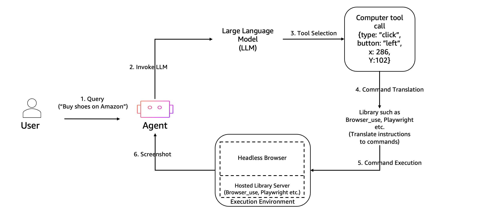
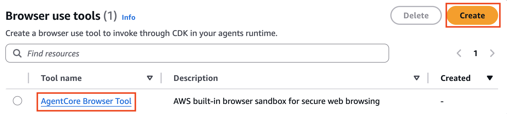
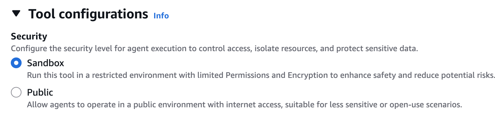
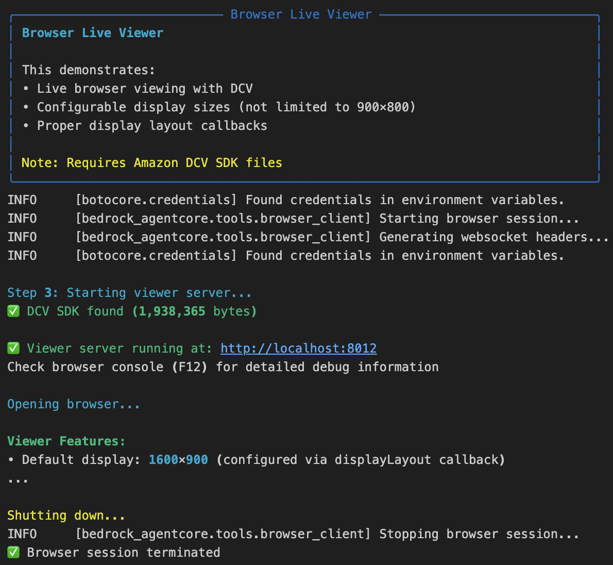
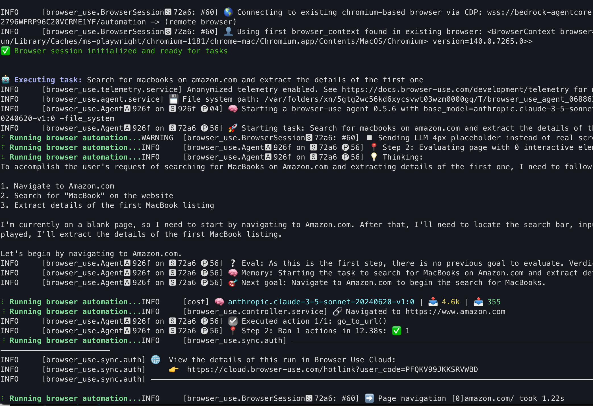
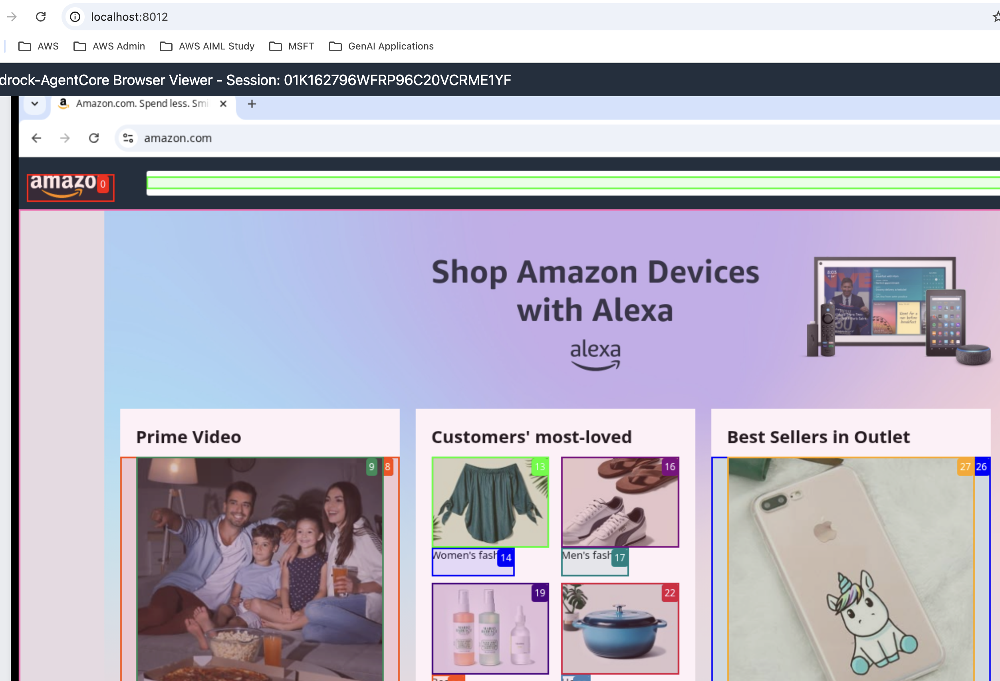
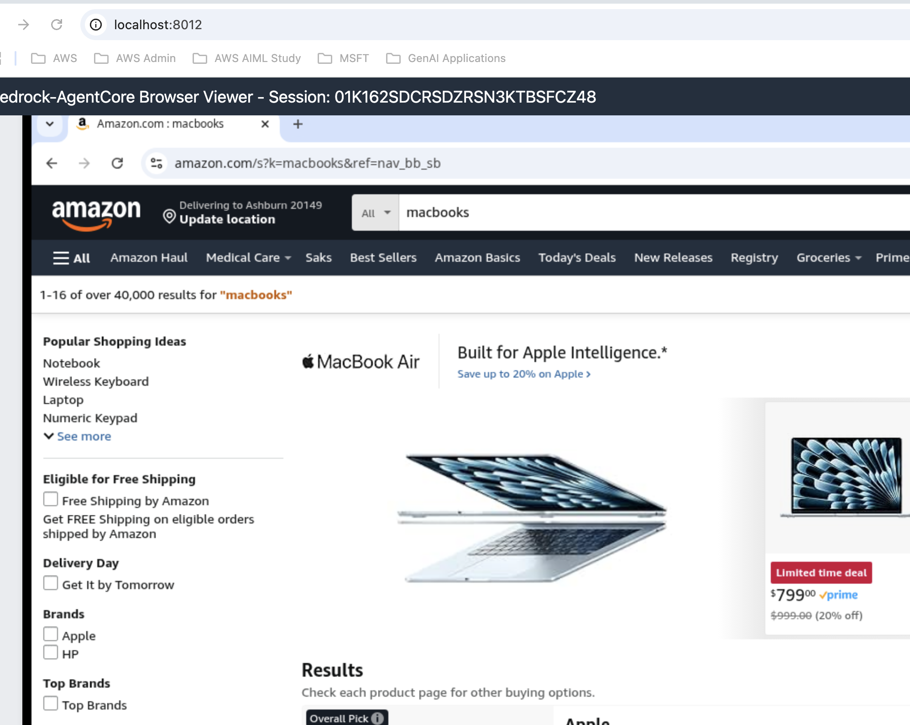
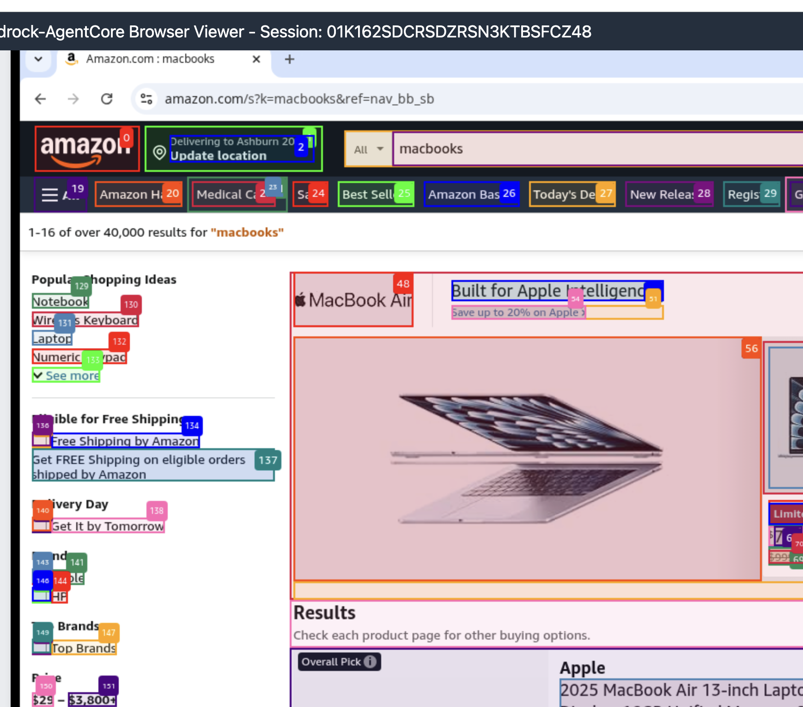

# AgentCore Browser

## 1. Overview

***

Amazon Bedrock AgentCore Browser는 AI 에이전트가 웹을 탐색하고 웹 콘텐츠에 접근할 수 있도록 하는 서비스입니다. 이 서비스를 통해 에이전트는 웹사이트를 방문하고, 콘텐츠를 검색하고, 웹 페이지에서 정보를 추출하여 사용자에게 가치 있는 정보를 제공할 수 있습니다. 사용자 세션과 브라우저 세션 간 1:1 매핑을 통해 VM 수준의 격리를 제공하며, 엔터프라이즈급 보안을 보장합니다. 각 브라우저 세션은 격리된 샌드박스 환경에서 실행되어 엔터프라이즈 보안 요구 사항을 충족합니다

### 주요 기능

* 복잡한 웹 작업 수행 능력: 사용자의 질의에 따라 에이전트가 웹사이트 탐색, 양식 작성, 버튼 클릭, 동적 콘텐츠 파싱이 가능합니다.
* 콘텐츠 추출: 웹 페이지에서 텍스트, 이미지, 링크 등의 콘텐츠를 추출할 수 있습니다.
* 안전한 탐색: 보안 제한을 준수하면서 웹 탐색을 안전하게 수행합니다.
* 정보 요약: 방대한 웹 콘텐츠에서 핵심 정보를 추출하고 요약할 수 있습니다.
* 스크린샷 캡처: Live View를 통한 실시간 가시성을 제공하며 웹 페이지의 스크린샷을 캡처하여 시각적 정보를 추출할 수 있습니다.
* 모델 비종속적 통합: 다양한 AI 모델과 프레임워크를 지원하며, interact(), parse(), discover() 같은 도구를 통해 브라우저 동작에 대한 자연어 추상화를 제공하여 엔터프라이즈 환경에 특히 적합합니다. 이 도구는 어떤 라이브러리에서든 브라우저 명령을 실행할 수 있고 Playwright, Puppeteer 같은 다양한 자동화 프레임워크를 지원합니다.

### 아키텍처 및 작동 방식

브라우저 도구 샌드박스는 AI 에이전트가 웹 브라우저와 안전하게 상호작용할 수 있도록 하는 안전한 실행 환경입니다. 사용자가 요청하면 LLM(Large Language Model)이 적절한 도구를 선택하고 명령을 번역합니다. 이러한 명령은 헤드리스 브라우저와 Playwright와 같은 도구를 사용하는 호스팅 라이브러리 서버가 포함된 제어된 샌드박스 환경에서 실행됩니다. 샌드박스는 제한된 공간 내에서 웹 상호작용을 제한하여 무단 시스템 접근을 방지함으로써 격리 및 보안을 제공합니다. 에이전트는 스크린샷을 통해 피드백을 받고 시스템 보안을 유지하면서 자동화된 작업을 수행할 수 있습니다. 이러한 설정은 AI 에이전트의 안전한 웹 자동화를 가능하게 합니다.

<figure><figcaption></figcaption></figure>

AgentCore Browser는 다음과 같은 방식으로 작동합니다:

1. 사용자가 에이전트에게 웹사이트에서 정보를 찾는 질문을 합니다.
2. 에이전트는 질문을 분석하고 어떤 웹사이트를 방문해야 하는지 결정합니다.
3. Browser 서비스는 해당 URL을 방문하고 페이지를 로드합니다.
4. 페이지 콘텐츠가 추출되고 분석됩니다.
5. 필요한 경우 추가 링크를 탐색하거나 검색을 수행합니다.
6. 추출된 정보를 기반으로 사용자의 질문에 대한 응답을 생성합니다.
7. 사용자에게 응답과 함께 출처 정보를 제공합니다.

#### **보안, 네트워크 및 리소스 설정**

빌트인 Browser Tool을 제공하며, 커스텀 Browser Too 생성 시 두 가지 네트워크 모드를 선택할 수 있습니다.

<figure><figcaption></figcaption></figure>

* Sandbox - 외부 네트워크 액세스가 없는 격리된 환경 (가장 안전한 모드)
* Public network - 공용 인터넷 리소스에 대한 액세스 허용

<figure><figcaption></figcaption></figure>

## 2. Getting Started

***

### Amazon Nova Act

Amazon Nova Act는 웹 브라우저 내에서 작업을 수행하도록 훈련된 새로운 AI 모델입니다. 개발자가 웹 브라우저에서 작업을 완료할 수 있는 에이전트를 구축할 수 있도록 하는 Amazon Nova Act SDK의 Research Preview를 출시했습니다. (현재 웹에서 API key 발급 불가)

**1. 하이브리드 접근법**

* 자연어 지시와 코드 모두를 사용한 브라우저 작업 자동화 명령 구축
* Python 스크립팅과 Playwright 자동화를 단일 인터페이스에서 결합

**2. Playwright 통합**

* Microsoft에서 개발한 오픈소스 브라우저 자동화 프레임워크인 Playwright와 통합
* 비밀번호나 신용카드 세부정보 등 민감한 작업 처리에 특히 유용

**3. 병렬 처리 지원**

* 여러 브라우저 세션으로 병렬 처리 지원하여 대기 시간을 제거하고 인간 역량을 넘어서는 반복 작업 가속화

### Browser Use (파이썬 3.11 이상 요구)

#### Install

* [https://github.com/browser-use/browser-use](https://github.com/browser-use/browser-use)

```
> pip install browser-use

> playwright install chromium --with-deps --no-shell
```

#### Minimum example

```python
import asyncio
from dotenv import load_dotenv
load_dotenv()
from browser_use import Agent
from browser_use.llm import ChatAWSBedrock

# Create ChatBedrockConverse once
llm = ChatAWSBedrock(
    model="anthropic.claude-3-5-sonnet-20240620-v1:0",
)

async def main():
    agent = Agent(
        task="Compare the price of Nova Pro and Claude Sonnet 4",
        llm=llm,
    )
    await agent.run()

asyncio.run(main())
```

#### **Browser tool usage with Browser-Use SDK**

Browser 샌드박스 클라이언트 초기화

```python
from bedrock_agentcore.tools.browser_client import BrowserClient
from browser_use import Agent, BrowserSession
from browser_use.browser import BrowserProfile

from browser_use.llm import ChatAWSBedrock
from rich.console import Console
from contextlib import suppress
import asyncio
from boto3.session import Session

console = Console()

boto_session = Session()
region = boto_session.region_name

client = BrowserClient(region)
client.start()

# Extract ws_url and headers
ws_url, headers = client.generate_ws_headers()
```

헬퍼 함수

```python
async def run_browser_task(browser_session: BrowserSession, bedrock_chat: ChatAWSBedrock, task: str) -> None:
    """
    Run a browser automation task using browser_use
    
    Args:
        browser_session: Existing browser session to reuse
        bedrock_chat: Bedrock chat model instance
        task: Natural language task for the agent
    """
    try:
        # Show task execution
        console.print(f"\\n[bold blue]🤖 Executing task:[/bold blue] {task}")
        
        # Create and run the agent
        agent = Agent(
            task=task,
            llm=bedrock_chat,
            browser_session=browser_session
        )
        
        # Run with progress indicator
        with console.status("[bold green]Running browser automation...[/bold green]", spinner="dots"):
            await agent.run()
        
        console.print("[bold green]✅ Task completed successfully![/bold green]")
        
    except Exception as e:
        console.print(f"[bold red]❌ Error during task execution:[/bold red] {str(e)}")
        import traceback
        if console.is_terminal:
            traceback.print_exc()
```

Invoke

```python
# Create persistent browser session and model
browser_session = None
bedrock_chat = None

try:
    # Create browser profile with headers
    browser_profile = BrowserProfile(
        headers=headers,
        timeout=1500000,  # 150 seconds timeout
    )
    
    # Create a browser session with CDP URL and keep_alive=True for persistence
    browser_session = BrowserSession(
        cdp_url=ws_url,
        browser_profile=browser_profile,
        keep_alive=True  # Keep browser alive between tasks
    )
    
    # Initialize the browser session
    console.print("[cyan]🔄 Initializing browser session...[/cyan]")
    await browser_session.start()
    
    # Create ChatBedrockConverse once
    bedrock_chat = ChatAWSBedrock(
        model="anthropic.claude-3-5-sonnet-20240620-v1:0",
    )
    
    console.print("[green]✅ Browser session initialized and ready for tasks[/green]\\n")

    task = "Search for a coffee maker on amazon.com and extract details of the first one" ## Modify the task to run other tasks
    #task = "naver.com에서 센터필드 국밥 맛집 3군데를 찾아서 정리해 주세요."
    await run_browser_task(browser_session, bedrock_chat, task)

finally:
    # Close the browser session
    if browser_session:
        console.print("\\n[yellow]🔌 Closing browser session...[/yellow]")
        with suppress(Exception):
            await browser_session.close()
        console.print("[green]✅ Browser session closed[/green]")
```

#### **Live-view browser tool with Browser-Use SDK**

`live_view_with_browser_use.py`

```python
from browser_use import Agent, BrowserSession
#from browser_use.browser.session import BrowserSession
from bedrock_agentcore.tools.browser_client import BrowserClient
from browser_use.browser import BrowserProfile
from browser_use.llm import ChatAWSBedrock
from rich.console import Console
from rich.panel import Panel
from contextlib import suppress
import argparse
import sys
sys.path.append("../interactive_tools")
from browser_viewer import BrowserViewerServer
import asyncio
from boto3.session import Session

console = Console()

boto_session = Session()
region = boto_session.region_name

async def run_browser_task(
    browser_session: BrowserSession, bedrock_chat: ChatAWSBedrock, task: str
) -> None:
    """
    Run a browser automation task using browser_use

    Args:
        browser_session: Existing browser session to reuse
        bedrock_chat: Bedrock chat model instance
        task: Natural language task for the agent
    """
    try:
        # Show task execution
        console.print(f"\\n[bold blue]🤖 Executing task:[/bold blue] {task}")

        # Create and run the agent
        agent = Agent(task=task, llm=bedrock_chat, browser_session=browser_session)

        # Run with progress indicator
        with console.status(
            "[bold green]Running browser automation...[/bold green]", spinner="dots"
        ):
            await agent.run()

        console.print("[bold green]✅ Task completed successfully![/bold green]")

    except Exception as e:
        console.print(f"[bold red]❌ Error during task execution:[/bold red] {str(e)}")
        import traceback

        if console.is_terminal:
            traceback.print_exc()

async def live_view_with_browser_use(prompt, region="us-west-2"):
    """
    Main function that demonstrates live browser viewing with Agent automation.

    Workflow:
    1. Creates Amazon Bedrock AgentCore browser client in us-west-2 region
    2. Waits for browser initialization (10-second required delay)
    3. Starts DCV-based live viewer server on port 8000 with browser control
    4. Configures multiple display size options (720p to 1440p)
    5. Establishes browser session for AI agent automation via CDP WebSocket
    6. Executes AI-driven tasks using Claude 3.5 Sonnet model
    7. Properly closes all sessions and stops browser client

    Features:
    - Real-time browser viewing through web interface
    - Manual take/release control functionality
    - AI automation with browser-use library
    - Configurable display layouts and sizes
    """
    console.print(
        Panel(
            "[bold cyan]Browser Live Viewer[/bold cyan]\\n\\n"
            "This demonstrates:\\n"
            "• Live browser viewing with DCV\\n"
            "• Configurable display sizes (not limited to 900×800)\\n"
            "• Proper display layout callbacks\\n\\n"
            "[yellow]Note: Requires Amazon DCV SDK files[/yellow]",
            title="Browser Live Viewer",
            border_style="blue",
        )
    )

    try:
        # Step 1: Create browser session
        client = BrowserClient(region)
        client.start()

        ws_url, headers = client.generate_ws_headers()

        # Step 2: Start viewer server
        console.print("\\n[cyan]Step 3: Starting viewer server...[/cyan]")
        viewer = BrowserViewerServer(client, port=8012)
        viewer_url = viewer.start(open_browser=True)

        # Step 3: Show features
        console.print("\\n[bold green]Viewer Features:[/bold green]")
        console.print(
            "• Default display: 1600×900 (configured via displayLayout callback)"
        )
        console.print("• Size options: 720p, 900p, 1080p, 1440p")
        console.print("• Real-time display updates")
        console.print("• Take/Release control functionality")

        console.print("\\n[yellow]Press Ctrl+C to stop[/yellow]")

        # Step 4: Use browser-use to interact with browser
        # Create persistent browser session and model
        browser_session = None
        bedrock_chat = None

        try:
            # Create browser profile with headers
            browser_profile = BrowserProfile(
                headers=headers,
                timeout=1500000,  # 150 seconds timeout
            )

            # Create a browser session with CDP URL and keep_alive=True for persistence
            browser_session = BrowserSession(
                cdp_url=ws_url,
                browser_profile=browser_profile,
                keep_alive=True,  # Keep browser alive between tasks
            )

            # Initialize the browser session
            console.print("[cyan]🔄 Initializing browser session...[/cyan]")
            await browser_session.start()

            # Create ChatBedrockConverse once
            bedrock_chat = ChatAWSBedrock(
                model="anthropic.claude-3-5-sonnet-20240620-v1:0",
            )

            console.print(
                "[green]✅ Browser session initialized and ready for tasks[/green]\\n"
            )

            task = prompt

            await run_browser_task(browser_session, bedrock_chat, task)

        finally:
            # Close the browser session
            if browser_session:
                console.print("\\n[yellow]🔌 Closing browser session...[/yellow]")
                with suppress(Exception):
                    await browser_session.close()
                console.print("[green]✅ Browser session closed[/green]")

    except Exception as e:
        console.print(f"\\n[red]Error: {e}[/red]")
        import traceback
        traceback.print_exc()
    finally:
        console.print("\\n\\n[yellow]Shutting down...[/yellow]")
        if "client" in locals():
            client.stop()
            console.print("✅ Browser session terminated")

if __name__ == "__main__":
    parser = argparse.ArgumentParser()
    parser.add_argument("--prompt", required=True, help="Browser Search instruction")
    parser.add_argument("--region", default="us-east-1", help="AWS region")
    args = parser.parse_args()

    asyncio.run(live_view_with_browser_use(
        args.prompt, args.region
    ))

```

코드 실행

```python
uv run python live_view_with_browser_use.py --prompt "Search for macbooks on amazon.com and extract the details of the first one" 
```

<figure><figcaption></figcaption></figure>



<figure><figcaption></figcaption></figure>



```python
I need to analyze the current situation and plan my next steps:

1. Evaluating previous actions:
- In steps 1-3, I attempted to navigate to amazon.com but encountered "Too many requests" errors (HTTP 429).
- This suggests there may be rate limiting or temporary access issues with Amazon's website.

2. Analyzing current state:
- We are now successfully on the Amazon.com homepage (<https://www.amazon.com/>).
- The page shows various product categories and promotional sections, but no direct macbook results yet.

3. Planning next steps:
- To fulfill the user request, I need to search for "macbooks" using the search bar.
- The search bar is visible with index [2] for text input and [3] for submission.

4. Considering efficiency:
- I can combine the input_text and click actions to perform the search in one step.

5. Tracking progress:
- This will be our first concrete step towards finding macbook results.

Based on this analysis, I will proceed with searching for "macbooks" using the search functionality.
⠴ Running browser automation...INFO     [browser_use.Agent🅰 1377 on 🆂 7ac4 🅟 64] 👍 Eval: Successfully navigated to amazon.com after previous errors. Verdict: Success.
INFO     [browser_use.Agent🅰 1377 on 🆂 7ac4 🅟 64] 🧠 Memory: On Amazon.com homepage. Encountered and overcame rate limiting issues. Preparing to search for macbooks to extract details of the first result.
INFO     [browser_use.Agent🅰 1377 on 🆂 7ac4 🅟 64] 🎯 Next goal: Search for "macbooks" using the Amazon search bar to find relevant product listings.

INFO     [cost] 🧠 anthropic.claude-3-5-sonnet-20240620-v1:0 | 📥 7.1k | 📤 480
Error polling for token:
⠇ Running browser automation...INFO     [browser_use.controller.service] ⌨️  Input macbooks into index 2
INFO     [browser_use.Agent🅰 1377 on 🆂 7ac4 🅟 64] ☑️ Executed action 1/2: input_text()
⠦ Running browser automation...INFO     [browser_use.BrowserSession🆂 7ac4: #84] ➡️ Page navigation [0]amazon.com/ took 0.52s
⠏ Running browser automation...INFO     [browser_use.controller.service] 🖱️ Clicked button with index 3:
INFO     [browser_use.Agent🅰 1377 on 🆂 7ac4 🅟 64] ☑️ Executed action 2/2: click_element_by_index()
INFO     [browser_use.Agent🅰 1377 on 🆂 7ac4 🅟 64] 📍 Step 3: Ran 2 actions in 56.31s: ✅ 2
⠋ Running browser automation...INFO     [browser_use.BrowserSession🆂 7ac4: #84] ➡️ Page navigation [0]amazon.com/s?k=macbooks&ref=nav_bb_sb took 4.84s
⠇ Running browser automation...INFO     [browser_use.Agent🅰 1377 on 🆂 7ac4 🅟 64] 📍 Step 4: Evaluating page with 173 interactive elements on: <https://www.amazon.com/s?k=macbooks&ref=nav_bb_sb>
```



<figure><figcaption></figcaption></figure>



<figure><figcaption></figcaption></figure>



<figure><figcaption></figcaption></figure>



## 3. 결론

***

Amazon Bedrock AgentCore Browser는 AI 에이전트가 웹을 탐색하고 웹 콘텐츠에 접근할 수 있도록 하는 강력한 서비스입니다. 이 서비스를 통해 에이전트는 웹사이트를 방문하고, 콘텐츠를 검색하고, 웹 페이지에서 정보를 추출하여 사용자에게 가치 있는 정보를 제공할 수 있습니다.

안전한 탐색 기능과 다양한 보안 제한을 통해 에이전트가 웹을 안전하게 탐색할 수 있도록 보장하며, 인터랙티브 탐색과 정보 요약 기능을 통해 사용자의 질문에 대한 정확한 답변을 제공할 수 있습니다.

다른 AgentCore 서비스(Runtime, Memory, Code Interpreter, Gateway, Observability 등)와 함께 사용하면 에이전트의 기능을 크게 확장하여 더 지능적이고 유용한 에이전트를 구축할 수 있습니다.
