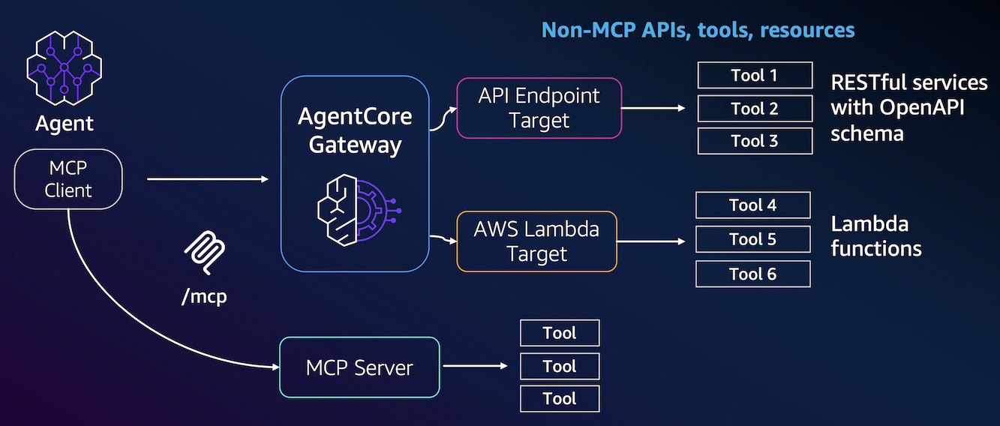
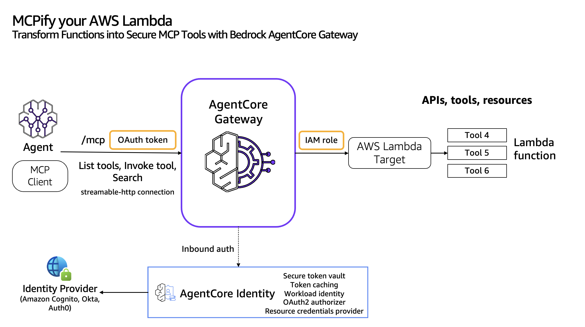
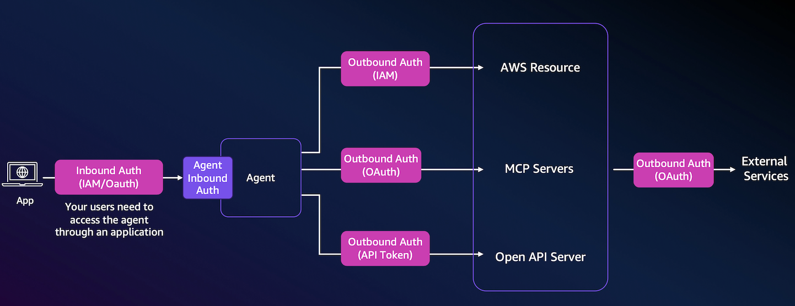
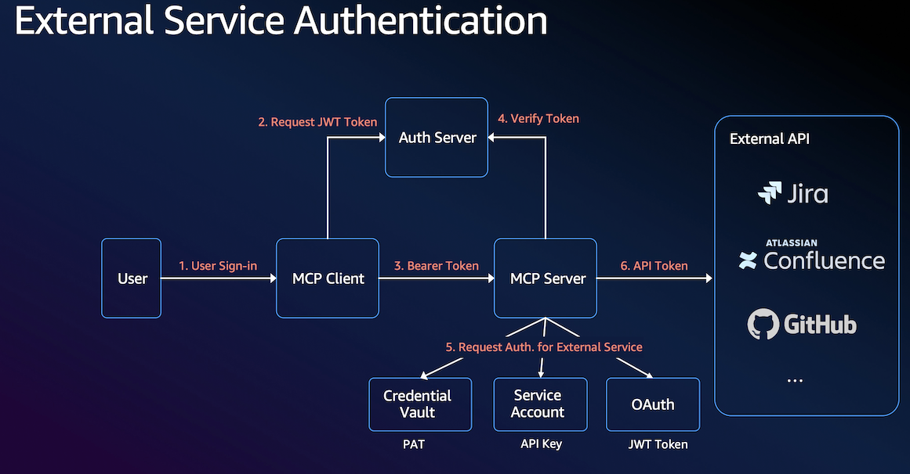
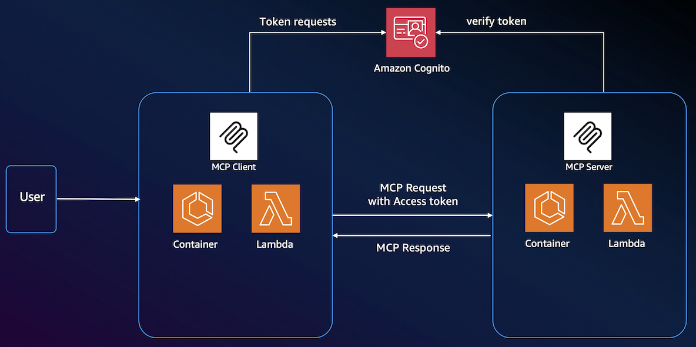
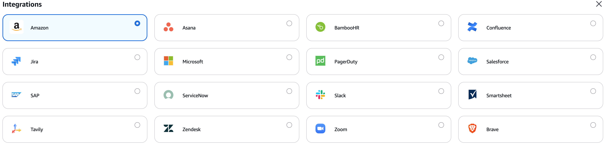
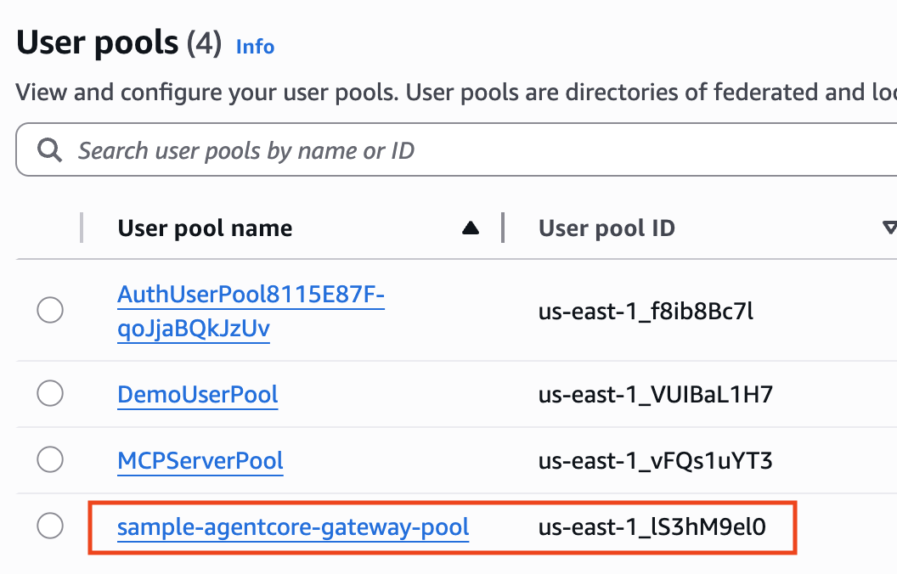
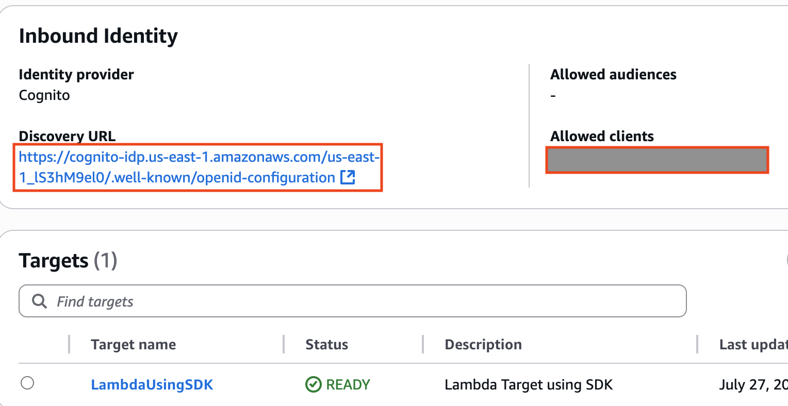

# AgentCore Gateway

## 1. Overview

***

Amazon Bedrock AgentCore Gateway는 AI 에이전트와 외부 시스템 및 서비스 간의 안전한 통신을 관리하는 서비스입니다. AI 에이전트와 실제 외부 서비스 사이의 **번역기(Translator)** 역할을 수행하며, 개발자가 코드를 작성하거나 정의한 API 스펙(OpenAPI 등)이나 Lambda 함수를 AgentCore Gateway에 등록하면, Gateway가 이를 에이전트가 이해하고 호출할 수 있는 MCP 기반의 '도구(tool)'로 바꿔주는 역할을 합니다.

* **REST API:** OpenAPI/Smithy 스펙으로 정의된 REST API
* **AWS Lambda 함수:** 특정 기능을 수행하는 AWS Lambda 함수

또한, Gateway는 수신 요청과 대상 리소스에 대한 아웃바운드 연결 모두에 대해 안전한 접근 제어를 보장하기 위해 이중 인증 모델을 사용합니다.

* 인바운드 인증(Inbound Auth): 게이트웨이 대상에 접근하려는 사용자를 검증하고 권한을 부여
* 아웃바운드 인증(Outbound Auth): 인증된 사용자를 대신하여 백엔드 리소스에 안전하게 연결

AgentCore Gateway는 개발자가 개별 API 연동의 복잡성에 집중하는 대신, **에이전트의 핵심 로직과 기능 구현에만 집중**할 수 있도록 하는 강력한 추상화 및 자동화 계층을 지원합니다. AgentCore Gateway와 같은 서비스가 없다면, AI 에이전트 개발자들은 외부 도구와 연동하기 위해 훨씬 복잡하고 수동적인 과정을 거쳐야 합니다.

#### As-Is (Without AgentCore Gateway)

1. **수동적인 API 연동 로직 구현:**
   * 에이전트가 외부 서비스(API)를 사용하려면, 개발자가 에이전트의 코드 내부에 직접 API 호출 로직을 구현해야 했습니다.
   * API의 엔드포인트, 입력 매개변수, 인증 방식(API 키, OAuth 등), 응답 형식 등을 모두 수동으로 코딩해야 했습니다.
   * 새로운 API를 추가하거나 기존 API가 변경되면, 에이전트 코드를 직접 수정하고 재배포해야 하는 번거로움이 있었습니다.
2. **프로토콜/형식 변환의 부담:**
   * 에이전트가 사용하는 내부 데이터 형식과 외부 API의 JSON/XML 형식 간의 변환 로직을 모두 직접 구현해야 했습니다.
   * 에이전트의 요청을 HTTP 요청으로 바꾸고, HTTP 응답을 다시 에이전트가 이해하는 형태로 파싱하는 번거로운 작업이 필수적이었습니다.
3. **일관성 없는 도구 관리:**
   * 각각의 도구(API, 함수)를 개별적으로 관리해야 했기 때문에, 일관된 방식으로 도구들을 정의하거나 목록화하기 어려웠습니다.
   * 대규모의 도구를 관리할 경우, 복잡도가 기하급수적으로 증가했습니다.
4. **보안 및 인증 관리의 어려움:**
   * 에이전트가 여러 API에 접근해야 할 경우, 각 API에 대한 인증 자격 증명(credentials)을 에이전트 코드 내부에 직접 관리하거나 별도의 보안 계층을 구축해야 했습니다.

#### **To-be (With AgentCore Gateway)**

1. **표준화된 도구 정의 및 등록:**
   * 개발자는 코드를 수정하는 대신, OpenAPI/Smithy 스펙을 사용해 API의 명세(설계도)만 Gateway에 등록합니다.
   * Gateway는 이 명세를 읽어 **MCP 도구 스펙으로 자동으로 변환**합니다.
2.  **자동화된 프로토콜 변환:**

    * 에이전트는 MCP라는 표준 프로토콜로 Gateway에 요청을 보냅니다.
    * Gateway가 에이전트의 MCP 요청을 실제 API/Lambda 호출로 번역하고, API의 응답을 다시 MCP 형식으로 재변환해서 에이전트가 이해할 수 있는 형식으로 전달하는 모든 과정을 자동으로 처리합니다. 개발자는 이 변환 로직을 코딩할 필요가 없습니다.

    **Step 1: 도구 등록 시 번역**

    ```python
    # 개발자가 제공하는 OpenAPI 스펙
    openapi_spec = {
        "paths": {
            "/users/{userId}": {
                "get": {
                    "operationId": "getUser",
                    "parameters": [{"name": "userId", "in": "path"}]
                }
            }
        }
    }

    # Gateway가 자동으로 MCP 도구 스펙으로 번역
    mcp_tool_spec = {
        "name": "getUser",
        "description": "Get user information",
        "inputSchema": {
            "type": "object",
            "properties": {
                "userId": {"type": "string"}
            }
        }
    }
    ```

    **Step 2: 런타임 호출 시 번역**

    ```python
    # 에이전트의 MCP 호출
    mcp_request = {
        "method": "tools/call",
        "params": {
            "name": "getUser",
            "arguments": {"userId": "12345"}
        }
    }

    # Gateway가 HTTP 요청으로 번역
    http_request = {
        "method": "GET",
        "url": "https://api.example.com/users/12345",
        "headers": {"Authorization": "Bearer token"}
    }

    # 서비스 응답 결과
    service_response = {
        "status": 200,
        "body": {"id": "12345", "name": "John Doe"}
    }

    # Gateway가 응답을 MCP 응답으로 번역
    mcp_response = {
        "content": [
            {
                "type": "text",
                "text": '{"id": "12345", "name": "John Doe"}'
            }
        ]
    }
    ```
3. **통합된 도구 접근 및 관리:**
   * 모든 도구(API, Lambda 등)가 Gateway라는 단일 창구로 통합됩니다. 에이전트는 하나의 Gateway 엔드포인트만 알고 있으면 모든 도구에 접근할 수 있습니다.
   * 도구 변경이 발생해도 Gateway 설정만 업데이트하면 되므로, 에이전트 코드를 수정할 필요가 거의 없습니다.

#### 특장점

* 일괄 인증: 인바운드 인증(에이전트 신원 확인)과 아웃바운드 인증(도구 연결)을 일원 관리
* 도구 자동 변환
  * AI 에이전트는 MCP로 소통, 외부 서비스는 REST API, Lambda 등 각자의 언어로 소통 → Gateway가 → Gateway가 Open API/Smithy, Lambda 함수를 몇 줄의 코드로 MCP 도구 스펙으로 자동 변환합니다.
* 통합 접근(Gateway Endpoint): 등록된 도구들을 통합하여 에이전트가 접근할 수 있는 단일한 **MCP 엔드포인트**를 생성합니다. 이 엔드포인트는 MCP 프로토콜을 사용하여 에이전트의 요청을 받게 됩니다.
* **Semantic Search**: `x_amz_bedrock_agentcore_search`라는 기본 제공 MCP 툴을 통해 자연어로 도구를 검색하는 기능이 내장되어 있습니다. MCP 서버에서 수백 개의 도구 전체를 제공하는 것보다 지연 시간을 최대 3배까지 단축합니다.

<figure><figcaption><p>Overview</p></figcaption></figure>

<figure><figcaption><p>Lambda를 MCP tool로 변환하는 예시</p></figcaption></figure>

### 사전 지식

<figure><figcaption></figcaption></figure>

#### 인바운드 인증(Inbound Auth)

* MCP 서버가 클라이언트(예: Claude Desktop, IDE 등)로부터 받는 요청을 검증하는 방식
* "**누가 우리의 에이전트나 도구를 사용할 수 있는가?**"에 관한 것임. - 비유: 누가 내 집에 들어올 수 있는가?"를 결정하는 현관문의 잠금장치
* 서버 입장에서 "이 클라이언트가 정말 신뢰할 수 있는 클라이언트인가?"를 확인
* 주로 API 키, 토큰, 또는 인증서를 통해 클라이언트 신원 확인
* 인바운드 인증의 주요 방식:
  1. AWS IAM(SigV4) - AWS 자격 증명을 사용한 인증
  2. OAuth 2.0 - Amazon Cognito, Okta, Microsoft Entra ID와 같은 외부 ID 제공업체와 연동
  3. 사용자가 ID 제공업체로 로그인 → 인증 토큰 발급 → 이 토큰으로 에이전트 호출

#### 아웃바운드 인증(Outbound Auth)

* MCP 서버가 외부 API나 서비스(GitHub, Slack, 데이터베이스 등)에 접근할 때 사용하는 인증
* "**에이전트가 다른 서비스에 접근할 때 어떻게 인증하는가?**"에 관한 것입니다. - 비유: "내 집에 있는 로봇이 외부 서비스(은행, 쇼핑몰 등)에 접근할 때 어떻게 인증할 것인가?"
* OAuth 토큰, API 키, 사용자 자격증명 등을 사용
* 아웃바운드 인증의 특징:
  1. 에이전트가 사용자를 대신하여 다른 서비스에 접근
  2. 안전한 토큰 관리를 통해 자격 증명 보호
  3. 사용자 동의 기반 접근 - 사용자가 처음 에이전트에게 자신을 대신하여 행동할 수 있는 권한을 부여하면, 에이전트는 해당 도구에서 발급한 사용자의 토큰을 안전하게 저장

### 예시

사용자가 MCP를 통해 GitHub이나 Jira 같은 외부 서비스를 사용하고 싶어함

<figure><figcaption></figcaption></figure>

#### 1단계: 사용자 로그인

* 사용자가 MCP Client에 로그인

#### 2-4단계: 사용자 인증 (Inbound)

* **2단계**: MCP Client가 Auth Server에 JWT 토큰 요청
  * JWT (JSON Web Token): JSON 형태의 정보를 안전하게 전송하기 위한 토큰 표준
  * 구조: 헤더.페이로드.서명 (점으로 구분된 3부분) → 서명으로 위변조 방지
  * 서버에서 별도 저장 없이도 토큰만으로 사용자 확인 가능
* **3단계**: Auth Server가 MCP Server에 Bearer Token 전달
* **4단계**: Auth Server가 토큰 검증

#### 5-6단계: 외부 서비스 인증 (Outbound)

* **5단계**: MCP Server가 외부 서비스 인증 방법 선택:
  * Credential Vault: PAT(Personal Access Token) 저장소
  * Service Account: 서비스 전용 계정의 API Key
  * OAuth: 사용자 대신 접근하는 JWT Token (위임장 역할)
* **6단계**: 선택된 인증 방법으로 외부 API 호출

### OAuth Authorization Flow on MCP

* Amazon Cognito를 사용하면 복잡한 인증 시스템을 직접 구축할 필요 없이, 안전하고 확장 가능한 MCP 인증 시스템을 빠르게 구현할 수 있습니다.
  * 확장성: 사용자 수 증가에 따른 자동 스케일링 / 통합: 다른 AWS 서비스들과 쉬운 연동 / 규정 준수: SOC, PCI DSS 등 보안 인증 획득
* User → MCP Client → Cognito(Auth Server) → MCP Server
  * 위 다이어그램의 **Auth Server** 부분을 Cognito가 담당
  * 사용자 로그인, JWT 토큰 발급/검증 처리

<figure><figcaption></figcaption></figure>

## 2. 개발 단계

***

### Step 1. Create Gateway

* 게이트웨이 생성 전에 인바운드 인증을 구성해야 합니다. (**customJWTAuthorizer)**

```python
# Gateway 클라이언트 초기화
# CreateGateway with Cognito authorizer without CMK. Use the Cognito user pool created in the previous step
gateway_client = boto3.client('bedrock-agentcore-control', region_name = os.environ['AWS_DEFAULT_REGION'])
auth_config = {
    "**customJWTAuthorizer**": { 
        "allowedClients": [client_id],  # Client MUST match with the ClientId configured in Cognito. Example: 7rfbikfsm51j2fpaggacgng84g
        "discoveryUrl": cognito_discovery_url
    }
}
create_response = gateway_client.**create_gateway**(
    name='TestGWforLambda',
    roleArn = agentcore_gateway_iam_role['Role']['Arn'], # The IAM Role must have permissions to create/list/get/delete Gateway 
    protocolType='MCP',
    authorizerType='CUSTOM_JWT',
    authorizerConfiguration=auth_config, 
    description='AgentCore Gateway with AWS Lambda target type'
)
```

### Step 2. Create Gateway Target


AgentCore Gateway에서 '타겟(Target)'은 게이트웨이가 에이전트에게 도구로 제공할 **실제 서비스 또는 자원**을 정의하는 것을 의미합니다. Gateway는 여러 타겟을 가질 수 있으며, 각 타겟은 서로 다른 도구나 도구 세트를 나타냅니다.

쉽게 말해, 타겟은 **게이트웨이가 에이전트에게 제공하는 도구의 출처**라고 생각할 수 있습니다. 에이전트가 `tools/call`과 같은 MCP 요청을 보내면, 게이트웨이는 해당 요청을 적절한 타겟(API, Lambda 함수 등)으로 라우팅하여 작업을 처리합니다.


Target 설정을 통해 여기서 Gateway와 Tool의 연동을 진행합니다. 3가지 유형의 Target type 지원을 지원합니다

* **Lambda 타겟:** AWS Lambda 함수를 도구로 연결하여 맞춤형 비즈니스 로직을 에이전트가 실행할 수 있게 합니다.
* **OpenAPI/Smithy 타겟:** 기존의 REST API를 OpenAPI나 Smithy 스펙을 통해 MCP 호환 도구로 변환합니다.
* **통합 타겟(Integration Target):** Amazon, Tavily, Salesforce, Jira 등 자주 사용되는 엔터프라이즈 도구들에 대한 사전 구성된 커넥터를 제공합니다.

<figure><figcaption></figcaption></figure>

Lambda ARN target 배포 코드 스니펫

* 스키마 설정은 인라인으로 작성하는 방법과 S3 파일을 참조하는 방법이 있습니다.

```python
# Replace the AWS Lambda function ARN below
lambda_target_config = {
    "mcp": {
        "lambda": {
            "lambdaArn": lambda_resp['lambda_function_arn'], # Replace this with your AWS Lambda function ARN
            "toolSchema": {
                "inlinePayload": [
                    {
                        "name": "get_order_tool",
                        "description": "tool to get the order",
                        "inputSchema": {
                            "type": "object",
                            "properties": {
                                "orderId": {
                                    "type": "string"
                                }
                            },
                            "required": ["orderId"]
                        }
                    },                    
                    {
                        "name": "update_order_tool",
                        "description": "tool to update the orderId",
                        "inputSchema": {
                            "type": "object",
                            "properties": {
                                "orderId": {
                                    "type": "string"
                                }
                            },
                            "required": ["orderId"]
                        }
                    }
                ]
            }
        }
    }
}

credential_config = [ 
    {
        "credentialProviderType" : "GATEWAY_IAM_ROLE"
    }
]

# Optional: Gateway 설정 구성
gateway_config = {
    "connectors": [
        {
            "name": "WeatherAPIConnector",
            "type": "REST",
            "endpoint": "https://api.weather.com",
            "authentication": {
                "type": "API_KEY",
                "apiKeyName": "x-api-key",
                "apiKeyValue": "${AWS_SECRET_MANAGER_SECRET_ARN}"
            },
            "rateLimit": {
                "requestsPerSecond": 5
            },
            "logging": {
                "level": "INFO",
                "includeHeaders": False,
                "includeBody": True
            }
        }
    ],
    "security": {
        "allowedDomains": ["api.weather.com", "api.maps.com"],
        "allowedMethods": ["GET", "POST"],
        "maxRequestSize": 1024 * 1024  # 1MB
    }
}

**targetname='LambdaUsingSDK'**
response = gateway_client.**create_gateway_target**(
    gatewayIdentifier=gatewayID,
    name=**targetname**,
    description='Lambda Target using SDK',
    targetConfiguration=lambda_target_config,
    credentialProviderConfigurations=credential_config)
```

Lambda 함수 예시

```python
import json

def lambda_handler(event, context):
    # event: The event schema should match whatever inputSchema you define for the target.
    # context: Sample event
    # ClientContext([custom={'bedrockAgentCoreGatewayId': 'Y02ERAYBHB', 'bedrockAgentCoreTargetId': 'RQHDN3J002', 'bedrockAgentCoreMessageVersion': '1.0', 'bedrockAgentCoreToolName': 'weather_tool', 'bedrockAgentCoreSessionId': ''},env=None,client=None])
    toolName = context.client_context.custom['bedrockAgentCoreToolName']
    print(context.client_context)
    print(event)
    print(f"Original toolName: , {toolName}")
    delimiter = "___"
    if delimiter in toolName:
        toolName = toolName[toolName.index(delimiter) + len(delimiter):]
    print(f"Converted toolName: , {toolName}")
    if toolName == 'get_order_tool':
        return {'statusCode': 200, 'body': "Order Id 123 is in shipped status"}
    else:
        return {'statusCode': 200, 'body': "Updated the order details successfully"}

```

#### Strands Agents와 연동

Gateway는 MCP 호환 사양으로 만들어지기 때문에, MCP의 도구와 동일하게 그대로 사용할 수 있습니다. 다만 Gateway 생성 시 설정한 대로, Cognito를 이용한 Bearer 토큰 인증을 접근 시에 수행할 필요가 있습니다.



<figure><figcaption></figcaption></figure>



<figure><figcaption></figcaption></figure>



GatewayURL 설정 (콘솔에서도 확인 가능)

* 처리 흐름으로는 먼저 환경 변수에서 앞서 기록한 Cognito의 각종 인증 정보를 가져오고, 이를 바탕으로 액세스 토큰을 획득한 후, 그 액세스 토큰을 이용해 Gateway에 Bearer 인증으로 접근하는 방식입니다.

```python
from strands.models import BedrockModel
from mcp.client.streamable_http import streamablehttp_client 
from strands.tools.mcp.mcp_client import MCPClient
from strands import Agent

# create_response: gateway_client.create_gateway(..)의 리턴값
gatewayID = create_response["gatewayId"]
gatewayURL = create_response["gatewayUrl"]

# token은 Amazon Cognito에서 인바운드 승인을 위한 액세스 토큰을 의미함
def create_streamable_http_transport():
    return streamablehttp_client(
	    gatewayURL,
	    headers={"Authorization": f"Bearer {token}"}
	  )

client = MCPClient(create_streamable_http_transport)

## The IAM credentials configured in ~/.aws/credentials should have access to Bedrock model
yourmodel = BedrockModel(
    model_id="us.amazon.nova-pro-v1:0",
    temperature=0.7,
)
```

Invoke (AgentCore Runtime을 반드시 실행할 필요가 없습니다.)

```python
from strands import Agent

with client:
    # Call the listTools 
    tools = client.list_tools_sync()
    
    # Create an Agent with the model and tools
    agent = Agent(model=yourmodel,tools=tools) ## you can replace with any model you like
    print(f"Tools loaded in the agent are {agent.tool_names}")
    
    # Invoke the agent with the sample prompt. This will only invoke  MCP listTools and retrieve the list of tools the LLM has access to. The below does not actually call any tool.
    agent("Hi, can you list all tools available to you")
    
    # Invoke the agent with sample prompt, invoke the tool and display the response
    agent("Check the order status for order id 123 and show me the exact response from the tool")
    
    # Call the MCP tool explicitly. The MCP Tool name and arguments must match with your AWS Lambda function or the OpenAPI/Smithy API
    result = client.call_tool_sync(
        tool_use_id="get-order-id-123-call-1", # You can replace this with unique identifier. 
        name=targetname+"___get_order_tool", # This is the tool name based on AWS Lambda target types. This will change based on the target name
        arguments={"orderId": "123"}
    )
    
    # Print the MCP Tool response
    print(f"Tool Call result: {result['content'][0]['text']}")

```

## 3. Semantic Search

***

Amazon Bedrock AgentCore의 Semantic Search는 AI 에이전트가 수천 개의 도구 중에서 특정 컨텍스트에 가장 적합한 도구를 찾을 수 있도록 지원하는 기능입니다. 이를 통해 프롬프트 크기를 최소화하고 지연 시간을 줄이면서 에이전트가 효과적으로 도구를 활용할 수 있습니다.

### **핵심 기능 및 특징**

#### 1. **Semantic Tool Selection**

* AI 에이전트가 특정 컨텍스트에 가장 적합한 도구를 찾기 위해 사용 가능한 도구들 전체를 검색할 수 있는 기능
* 작업 컨텍스트를 기반으로 동적 도구 매칭 수행
* 수천 개의 도구 중에서도 효율적인 선택 가능

#### 2. **컨텍스트 인식 검색**

* 내장된 시맨틱 검색 기능이 작업 컨텍스트를 기반으로 에이전트가 사용 가능한 도구를 효과적으로 활용할 수 있도록 지원
* 에이전트 성능 향상 및 대규모 개발 복잡성 감소

#### 3. **프롬프트 최적화**

* 프롬프트 크기 최소화를 통한 효율성 향상
* 지연 시간(latency) 감소
* 더 정확한 도구 선택을 통한 전반적인 성능 개선

### Code snippet

```python
def get_search_tool(client):
    mcp_tool = MCPTool(
        name="x_amz_bedrock_agentcore_search",
        description="A special tool that returns a trimmed down list of tools given a context. Use this tool only when there are many tools available and you want to get a subset that matches the provided context.",
        inputSchema={
            "type": "object",
            "properties": {
                "query": {
                    "type": "string",
                    "description": "search query to use for finding tools",
                }
            },
            "required": ["query"],
        },
    )
    return MCPAgentTool(mcp_tool, client)
    
    
def search_using_strands(client, query):
    simple_agent = Agent(
        model=bedrockmodel,
        tools=[get_search_tool(client)],
        callback_handler=null_callback_handler,
    )

    direct_result = simple_agent.tool.x_amz_bedrock_agentcore_search(query=query)

    resp_json = json.loads(direct_result["content"][0]["text"])
    search_results = resp_json["tools"]
    # print(json.dumps(search_results, indent=4))
    return search_results    
```

## 4. 결론

***

Amazon Bedrock AgentCore Gateway는 AI 에이전트와 외부 서비스 및 시스템 간의 안전한 통신을 관리하는 핵심 서비스입니다. 이 서비스를 통해 에이전트는 다양한 외부 API, 데이터베이스, 웹 서비스 등과 안전하게 통신할 수 있습니다.

Gateway는 인증, 권한 관리, 요청 제한, 로깅 및 모니터링 기능을 제공하여 에이전트의 외부 통신을 안전하게 관리합니다. 다양한 커넥터와 인증 방식을 지원하여 여러 유형의 외부 서비스와 통합할 수 있습니다.

다른 AgentCore 서비스(Runtime, Memory, Code Interpreter, Observability 등)와 함께 사용하면 에이전트의 기능을 크게 확장하여 더 지능적이고 유용한 에이전트를 구축할 수 있습니다.
