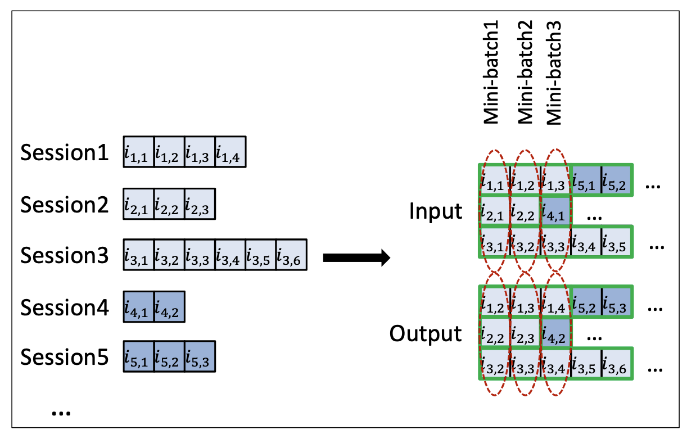
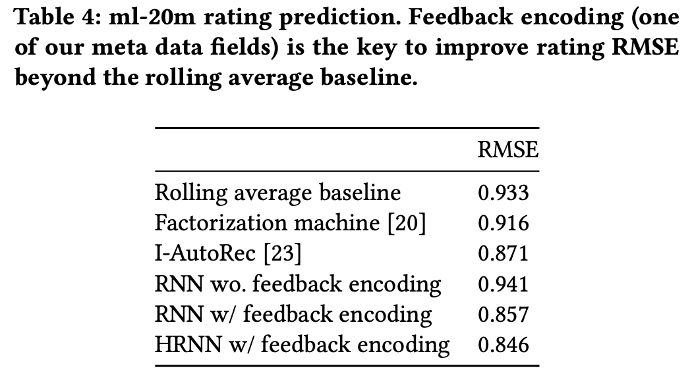
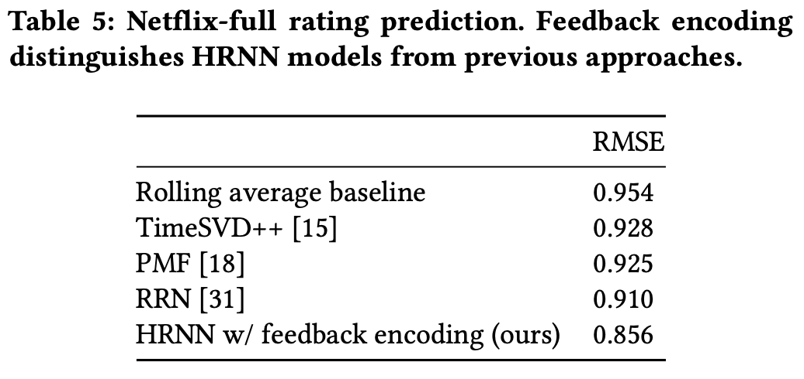

# Amazon Personalize - User Personalization Algorithm Deep Dive

> 본 페이지는 AWS의 완전 관리형 추천 AI 서비스인 Amazon Personalize의 User-Personalization 레시피\([https://docs.aws.amazon.com/personalize/latest/dg/native-recipe-new-item-USER\_PERSONALIZATION.html\)에](https://docs.aws.amazon.com/personalize/latest/dg/native-recipe-new-item-USER_PERSONALIZATION.html%29에) 대한 심도 있는 이해가 필요한 경우 논문과 함께 참조하시면 좋습니다.

## 1. Background

실시간 개인화 추천\(Real-time user personalization\)은 현재 user의 세션에서 발생하는 이벤트를 캡쳐하여user 메타데이터와 item 메타데이터 정보를 결합하는 형태를 많이 활용하고 있습니다. 이를 달성하기 위한 6가지 주요 난제들은 아래와 같습니다.

* **Real-time**: 실시간으로 들어오는 사용자의 피드백을 어떻게 추천 결과에 빠르게 반영할 것인지?
* **Long-term**: 특정 사용자의 긴 히스토리를 \(long-tail\) 어떻게 효율적으로 반영할 것인지?; 히스토리 내에 발생하는 수많은 이벤트
* **Scalability**: 수백만 개의 item을 어떻게 훈련할 것인지?
* **Negative feedback**: 피드백이 없는 \(클릭 x, 비구매\) 데이터를 어떻게 반영할 것인지?
* **Contextual information**: 직접적인 피드백 외에 관련 메타데이터 정보들을 잘 반영하는 방법은?
* **Cold-start**: cold start item/cold start user를 부트스트랩하기 위한 context 정보를 어떻게 모델에 반영할 것인지?

KDD 2020 컨퍼런스에 AWS AI Labs에서 발표한 "Temporal Contextual Recommendation in Real Time" 논문은 각 난제에 대한 key concept을 아래와 같이 적용하여 Applied Data Science Track에서 best paper로 선정되었고, Amazon Personalize의 핵심 알고리즘으로 채택되었습니다.

## 2. Algorithm


논문에선 HRNN-meta로 명명하고 있지만, 내용 상 User-Personalization이 더 적합합니다.


### Formulation

어떤 특정 User history를 $$x_{1:k} = [x_1, x_2, ..., x_k]$$\($$x_k =$$ \(item\_id, value, time\) $$= (a_k, v_k, t_k)$$의 튜플로 정의하고, $$a_k$$ 는 item\_id 원-핫 인코딩 벡터; $$a_k = (0, ... 0, 1, 0, ... ,0)^T$$\)로 표현했을 때 바로 다음 시점\($$t_{k+1}$$\)의 추천 item은 아래와 같이 정의할 수 있습니다.

> 좀 더 정확하게는 user $$i$$에 대한 $$k$$ 시점의 user history를 $$x_{ik} = (a_{ik}, v_{ik}, t_{ik})$$로 정의하지만, 논문에서는 편의상 $$i$$ 인덱스를 제외하고 $$x_k = (a_k, v_k, t_k)$$로 정의하고 있습니다.

$$
a_{k+1} \sim p(A_{k+1} | x_{1:k}) = \text{softmax}(\bm{\phi}(\bm{h}(x_1, ..., x_k)))
$$

여기에서 $$h$$는 특정 유저 히스토리의 learned \(hidden state\) representation이고, $$\phi$$는 $$m$$개의 item에 대한 scoring vector function입니다.

### Recall: HRNN \(Hierarchical RNN\)

상기 Formulation은 직관적으로 RNN을 사용하여 모델링할 수 있습니다. 하지만, 세션이 끊기고 새로운 세션이 시작되는 경우 이를 어떻게 대처할 수 있을까요? 그리고 먼 과거 시점의 세션 정보를 어떻게 반영할 수 있을까요?

장기 기억 정보인 user 정보와 단기 기억 정보인 session을 디커플링하여 두 개의 RNN\(RNN, Hierarchical RNN\)으로 표현하여 모델링하는 기법들이 과거에 소개되었고, session-parallel mini-batches 기법으로 훈련 효율성을 높이는 기법도 이미 소개되었습니다.

* HRNN \(user-level\): long-term RNN \(BPTT for each session level & user-level RNNs\)
* RNN \(session-level\): short-term RNN \(BTTT for all user events concurrently in a mini-batch of multiples users\)

하지만, RNN은 이전 time-step에 의존적으로 CNN 같은 병렬화가 불가능하기에, 만약 미니배치 사이즈가 session의 평균 길이보다 크다면 여러 RNN 레이어들을 사용해야 하므로 학습 속도가 느려질 수밖에 없습니다. 이를 아래 Time Delta Control 기법으로 완화합니다.

### Time Delta Controls

Session control signal 역할을 하는 $$c_k$$변수를 추가하여 long user history를 short activity interval로 변환하는 time-delta control을 수행하도록 함으로써, 학습 속도 개선이 가능합니다. \(아래 그림 참조\)   
앞에서 정의했던 input feature $$x_k$$의 구성 요소에 $$c_k$$가 포함되면서 session control signal도 같이 인코딩됩니다.

$$
x_k= (a_k, v_k, t_k, {\color{red}c_k})
$$

### Feedback Encoding

과거 추천 시스템은 explicit feedback을 가정하였지만 실제로는 implicit dataset의 volume이 explicit dataset을 압도하는 경우가 많기 때문에, 최근에는 implicit feedback 데이터에 대한 모델링을 많이 연구하고 있습니다.

* Implicit Feedback: 클릭, 노출, 구매 이벤트로 추정할 수 있는 사용자의 선호도
* Explicit Feedback: 영화 평점, 점수 등으로 명시적으로 알 수 있는 피드백

HRNN은 implicit feedback에 최적화되어 있는 모델이지만, implicit feedback도 positive feedback과 negative feedback으로 구별할 수 있고 주로 positive feedback에 중점을 두고 있습니다.

* Positive Feedback 예시: 클릭, 구매
* Negative Feedback 예시: 클릭 없이 새로고침, 짧은 체류 시간

이를 위해 $$x_k$$외에 추가 user feedback 정보들\(contextual features\)을 concatenate하여 입력 피쳐로 활용합니다

* user features \(예: age\)
* user dynamic features \(예: devive, language of request\)
* feedback events \(예: rating, purchases, costs, view duration\)

실험 결과, 이는 negative feedback에 대한 추천 성능이 개선되었다고 합니다.

### Field-aware FM

본 논문은 다양한 User feedback 정보들을 효과적으로 concatenate하기 위해 Field-aware FM의 기법을 활용하고 있습니다.

Factorization Machine\(이하 FM\)은 closed form이며 시간 복잡도가 선형이기 때문에, 다수의 user & item과 메타데이터들이 많은 추천 문제에 적합합니다. 또한, 학습 데이터셋에서는 존재하는 쌍\(pair\)이지만, 테스트 데이터셋에서는 찾을 수 없는 쌍들에 대한 대처를 할 수 있습니다.

하지만, FM은 각 field간의 잠재 효과까지 반영하지 않습니다. 예를 들어 Publisher와 Advertiser 간의 \(P X A\) latent effect는 Publisher와 Gender 간의 \(P X G\) latent effect와 다를 수 있습니다. 이를 Field-aware FM\(FFM\)에서 반영합니다.

FM \(각 필드는 하나의 latent feature만 존재합니다\):

$$
\phi(\pmb{w}, \pmb{x}) = w_{0} + \sum_{i=1}^{d} w_i x_i + \sum_{i=1}^d\sum_{j=i+1}^d x_{i} x_{j} \langle\textbf{v}_i, \textbf{v}_j\rangle
$$

FFM \(각 필드는 여러 latent feature들이 존재합니다\):

$$
\phi(\pmb{w}, \pmb{x}) = w_{0} + \sum_{i=1}^{d} w_i x_i + \sum_{i=1}^d\sum_{j=i+1}^d x_{i} x_{j} \langle\textbf{v}_{i, F(j)} \cdot \textbf{v}_{j, F(i)}\rangle
$$

### Item Feature Decoding

Vanilla RNN은 j번째 item의 추천 score를 아래와 같이 계산합니다. \($$\bm{f}_j$$ = $$j$$번째 item에 대한 feature vector\)

$$
\begin{aligned} \phi_j(\bm{h}_k) &= (\bm{w}_j^T \bm{h}_k + b_j) \\ &=(\bm{w}_j(\bm{f}_j)^T \bm{h}_k + b_j(\bm{f}_j)) \end{aligned}
$$

본 논문에서는 신규 아이템이 추가되거나 old 아이템의 추천 빈도를 높이고자 할 때는 MAB 기법을 적용하여 랜덤 확률로 전체 item dataset에서 item을 추천합니다. \(가장 기본적인 기법으로 일정 확률로 랜덤하게 추천하는 epsilon greedy와 사용자의 피드백에 따른 확률 분포를 업데이트하 thompson sampling이 유명합니다.\)

본 논문에서는 추천 score를 계산하는 모델을 $$(\bm{w}_j, b_j)$$ 파라메터와 $$\bm{h}_k$$ 파라메터 사이의 2nd order interaction model로 정의합니다.

$$
\begin{aligned} \hat{\phi}(\bm{h}_k) &= (1-\lambda)\phi_j(\bm{h}_k) + \lambda \phi^{\prime}(\bm{h}_k, \bm{f}_j), \text{where} \\ \phi_j(\bm{h}_k) &= (\bm{w}_j^T \bm{h}_k + b_j) \text{ and } \phi^{\prime}(\bm{h}_k, \bm{f}_j) = (\bm{w}(\bm{f}_j)^T \bm{h}_k + b(\bm{f}_j)) \end{aligned}
$$

수식이 복잡해 보이지만, 우측 항은 모든 item을 고려하는 exploration 항으로 $$\bm{w}, b$$에 $$j$$ 첨자가 빠져 있는 부분만 파악하면 쉽게 이해할 수 있습니다.

$$0 \leq \lambda \leq 1$$로 exploration 빈도를 조절할 수 있으며, 훈련 시에는 random하게 설정되며, 추론 시 $$\lambda = 1$$로 설정하면 cold-start 추론을 수행합니다.

### Loss

강화 학습의 policy optimization을 적용하여 reward를 최대화하는 목적 함수를 정의합니다. 이 때, saturation을 방지하기 위해 log-softmax cross entropy loss를 사용합니다.

\_\_$$t_{k+1}$$ __시점의 true reward\(예: 클릭\)를 $$\bm{r}(t{k+1}) \in [0,1]^m$$ 으로 정의할 때, log-softmax cross-entropy loss를 아래와 같이 정의합니다.

$$
\text{argmax}_\bm{\phi} \bm{r}^T[\bm{\phi} - \log \sum_j (e^{\phi_j}) \bm{1}] \implies \bm{\phi}^* = \log \bm{r} + \text{Const.}
$$

* $$\bm{\phi}$$: 디코더에서 산출된 score, $$\bm{\phi}^*$$ : optimal 디코더에서 산출된 score

#### Log softmax

일반적으로 classification task에서는 cross-entropy loss를 많이 적용합니다. 하지만, exp\(.\)항이 포함되어 있기 때문에 분모 또는 분자가 inf가 될 위험이 존재합니다. 이를 해결하기 위해 아래와 같이 log값을 취할 수 있습니다.

$$
\begin{aligned} \log{(\hat y_j)} & = \log\left( \frac{e^{\phi_j}}{\sum_{i=1}^{n} e^{\phi_i}}\right) \\ & = \log{(e^{\phi_j})}-\text{log}{\left( \sum_{i=1}^{n} e^{\phi_i} \right)} \\ & = \phi_j -\log{\left( \sum_{i=1}^{n} e^{\phi_i} \right)} \end{aligned}
$$

하지만, item 개수가 10만 개를 넘어가면 계산복잡도가 너무 높겠죠? 모든 item에 대한 score에 log softmax를 적용해 예측치를 계산 후, 이를 정답과 비교해 backprogation을 수행하는 것은 직관적으로도 매우 계산량이 많을 수밖에 없습니다. 이를 negative sampling과 importance sampling으로 개선합니다.

### Negative Sampling

Word2Vec에서 널리 알려진 Negative Sampling 기법은 수십만~수백만 개 이상의 item들을 대상으로 하는 추천 문제에도 적합합니다. 실제 논문에서도 item의 총 개수가 10만개 이상일 때 훈련 효율이 저하된다고 서술하고 있으며, Amazon Personalize의 경우에도 훈련 시 item 개수 75만개의 리밋이 존재합니다.

Negative Sampling은 모든 item의 가중치를 업데이트하는 것과 몇 개의 item 샘플링해서 업데이트하는 것은 큰 차이가 없을 거라는 가정에서 출발합니다. item에 대한 positive sample $$a_j$$와 negative sample $$a_{j\prime}$$ 피드백들을 균등하게 샘플링하여 loss를 아래와 같이 근사합니다.

$$
\dfrac{r_j}{r_j + r_{j\prime}} = \text{sigmoid}(\phi^*_j - \phi^*_{j\prime})
$$

하지만, true item의 커버리지가 낮다면 균등 샘플링은 low-hit rates를 유발하기 때문에 Importance sampling 기법을 적용해 이미 사전에 알고 있는 $$q$$ 분포로부터 subset을 샘플링하여 loss를 근사할 수 있습니다.

$$
\sum_J [r_J 1_{\{J=j\}}] = \sum_J q_J [\dfrac{r_J}{q_J} 1_{\{J=j\}}]
$$

$$q_j$$는 user가 item에 얼마나 피드백했는지의 빈도이기 때문에 쉽게 산출 가능하며, 예측된 score로부터 $$\log q$$만 빼면 됩니다.

$$
\dfrac{r_j/q_j}{r_j/q_j + r_{j\prime}/q_{j\prime}} = \text{sigmoid}((\phi^*_j - \log q_j) - (\phi^*_{j\prime} - \log q_{j\prime}))
$$

### Item Trend Decomposition

item trend의 변동 속도가 빠르기에 bias가 발생하기 쉽고, 이를 debias하기 위한 다양한 기법들이 연구되고 있습니다.

Exposure bias를 제거하기 위해 아래 수식과 같이 decompsition을 통해 item Click-Through Rate\(CTR\)와 item Exposure Rate를 분리합니다. Item CTR은 이전 시점까지의 global CTR로 전반적인 popularity를 표현하며, item Exposure Rate는 시간에 따라 계속 변동되기에\($$t_{k+1}$$에 의존적이므로\) 안정적이지 않은 데이터로 item exposure bias를 제거하기 위해 $$\log(q_{k+1})$$ bias term을 가산합니다.

$$
a_{k+1} \sim p(A_{k+1} | \bm{h}_k t_{k+1}) \propto p(A_{k+1} | \bm{h}_k)q(A_{k+1}|t_{k+1})
$$

## 3. Experiments

저자들은 다양한 실험들을 통해 HRNN-meta의 퍼포먼스를 보여주고 있습니다. 실험에서 주로 사용된 데이터셋은 MovieLens 데이터셋입니다.

### Adding Meta-data

Table 1은 메타 데이터 추가 시 성능 향상 폭을 잘 보여주고 있습니다. 참고로 표의 행에서 적용된 네트워크는 각각 MLP, Item Feature Decoding, RNN, HRNN-meta입니다. 맨 우측 컬럼의 수치는 perplexity로 HRNN-meta가 410으로 가장 우수하며, Item Feature Decoding만 적용해도 MLP보다 성능이 우수함\(2228 vs. 1342\)을 보여주고 있습니다.

### Long-term dependency

이번 실험은 RNN의 고질적인 이슈인 long-term sequence의 vanishing gradient에 얼마나 강건한지 보여주고 있으며, 실제 프로젝트에 적용 시에도 매우 유용한 인사이트를 보여주고 있습니다.

* Consistent recommendation: 추천된 영화의 장르가 오랜 시간이 지나도 비슷하게 유지됩니다.
* Time-delta gaps: 최종 interaction과 추천 사이의 시간 차이\(time-delta gaps\)에 따라 추천 결과가 달라집니다.
  * Small delta: 최종 interaction의 item과 유사한 추천 item을 보여줍니다.
  * Large delta: 좀 더 다양한 item들을 추천해 줍니다. \(diminishing personalization effects\).  주로 Global한 피드백을 참조하므로 popularity가 높은 item의 추천 빈도가 늘어납니다.

### Hierarchy is useful?

Reddit Dataset에서 실험 결과, HRNN이 다른 모델들보다 퍼포먼스\(hit@5\)가 우수합니다.

### Feedback Encoding

Table 4는 MovieLens-20M 데이터셋에서의 RMSE이고 Table 5는 Netflix 데이터셋에서의 RMSE입니다. HRNN에 Feedback encoding 미적용 시의 RMSE는 baseline보다 높은 것을 볼 수 있지만, feedback encoding 적용 시에는 가장 작은 RMSE를 보여주고 있습니다.











### Cold-start Scenario

MovieLens-1M 데이터셋에서 Random choice baseline과 비교 결과, MRR\(Mean Reciprocal Recall\), Precision, NDCG\(Normalized Discounted Cumulative Gain\)에서 모두 baseline보다 우수합니다.

### Retraining w/ Item Trend Corrections

Outbrain news 추천 데이터셋에서 테스트 결과\(처음 70%는 훈련 데이터셋, 나머지 30%는 테스트셋\), offline\_hrnn은 MRR 일정 시점 이후의 retraining\_step에서 MRR이 점차 감소하고 baseline과의 격차가 커짐을 볼 수 있습니다. 하지만, online\_hrnn은 recent\_pop의 추세를 잘 반영하고 있음을 볼 수 있습니다.

* online\_hrnn: HRNN w/ Item Trend Corrections
* recent\_pop: Recent popular 모델로 1시간 간격으로 popularity 계산
* offline\_hrnn: HRNN without Item Trend Corrections

### Importance Sampling

IS 모델의 복잡도가 Dense 모델보다 현저히 낮고 throughput\(\#items/sec, 초당 처리할 수 있는 item 개수\)도 더욱 높음을 볼 수 있습니다.

## References

* [https://assets.amazon.science/08/81/0b48c33a423ead4e50f1235feb12/personalizing-natural-language-understanding-using-multi-armed-bandits-and-implicit-feedback.pdf](https://assets.amazon.science/08/81/0b48c33a423ead4e50f1235feb12/personalizing-natural-language-understanding-using-multi-armed-bandits-and-implicit-feedback.pdf)
* [https://www.amazon.science/blog/amazon-researchers-win-best-paper-award-at-kdd](https://www.amazon.science/blog/amazon-researchers-win-best-paper-award-at-kdd)

