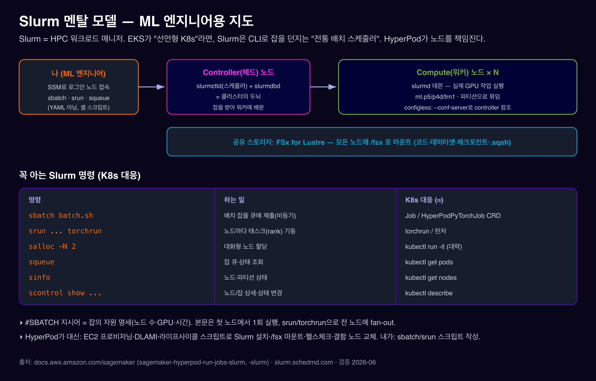

# 01. Slurm 기초 — ML 엔지니어를 위한 최소 지식

***

### 0. 왜 이걸 알아야 하나 (3문장 요약)

1. SageMaker HyperPod를 Slurm으로 쓰면, 여러분의 클러스터는 본질이 **Slurm(HPC 워크로드 매니저)으로 도는 GPU 클러스터**입니다. 잡 제출·모니터링이 전부 Slurm 명령 위에서 돕니다.
2. EKS 모드가 "선언형(YAML/CRD를 던지면 시스템이 맞춰감)"이라면, Slurm 모드는 **"명령형 배치 스케줄러"** — SSH로 들어가 `sbatch`/`srun`으로 잡을 직접 던집니다.
3. 다행히 HyperPod가 어려운 부분(노드 프로비저닝·Slurm 설치·헬스체크·복구)을 **대신**합니다. 여러분이 쓸 표면은 Slurm 명령 몇 개 + sbatch 스크립트입니다.

> EKS를 써보셨다면: Slurm은 "CRD·kubectl이 없는 세계"입니다. `kubectl apply -f job.yaml` 대신 `sbatch train.sbatch`, `kubectl get pods` 대신 `squeue`. 그리고 **`hyp` CLI는 Slurm에 없습니다**(EKS 전용).

***

### 1. 한 장 멘탈 모델 — 컨트롤러(두뇌) vs 워커(일꾼)

<figure><figcaption></figcaption></figure>

Slurm 클러스터는 역할이 나뉜 노드들로 구성됩니다.

| 노드 역할                 | 정체                                               | ML 비유                              | HyperPod에서                                   |
| --------------------- | ------------------------------------------------ | ---------------------------------- | -------------------------------------------- |
| **Controller(헤드) 노드** | `slurmctld`(스케줄러) + `slurmdbd`(어카운팅 DB)가 도는 "두뇌" | EKS의 제어 평면에 해당하지만 **내 클러스터 안에** 있음 | `SlurmConfig.NodeType=Controller`. **삭제 불가** |
| **Login 노드** (선택)     | 사용자가 접속해 잡을 던지는 "현관"                             | 배스천/점프박스                           | `NodeType=Login`. slurmd 뜨지만 잡 안 돎           |
| **Compute(워커) 노드**    | `slurmd`가 실제 GPU 작업을 실행                          | 계산 노드                              | `NodeType=Compute`. 파티션으로 묶임                 |

* **slurmctld**: 컨트롤러에서 도는 스케줄러 데몬. 잡 큐를 관리하고 어느 워커에 배분할지 결정. (EKS의 kube-scheduler + API Server 역할이 한 노드 안에)
* **slurmd**: 각 워커 노드의 에이전트. 컨트롤러 지시를 받아 실제로 프로세스를 띄움. (EKS의 kubelet에 해당)
* **configless Slurm**: 워커의 slurmd는 `--conf-server <controller>`로 설정을 컨트롤러에서 받아옵니다 — 설정 파일을 노드마다 복사할 필요가 없음.

> **핵심 차이 (vs EKS)**: EKS는 AWS가 관리하는 **별도** 제어 평면에 1:1로 붙지만, Slurm은 **내 클러스터 안의 controller 노드**가 곧 스케줄러입니다. 그래서 "별도 K8s 제어 평면"이 없습니다.

출처: [HyperPod Slurm 개요](https://docs.aws.amazon.com/sagemaker/latest/dg/sagemaker-hyperpod-slurm.html) · [멀티헤드 Slurm](https://docs.aws.amazon.com/sagemaker/latest/dg/sagemaker-hyperpod-multihead-slurm.html)

***

### 2. 꼭 아는 Slurm 명령 7개 (K8s 대응 사전)

Slurm은 CLI-first입니다. 아래만 알면 HyperPod-Slurm 문서를 읽을 수 있습니다.

| Slurm 명령                     | 하는 일                                        | ML 비유 / K8s 대응 (≈)                      |
| ---------------------------- | ------------------------------------------- | --------------------------------------- |
| **`sbatch batch.sh`**        | 배치 스크립트를 큐에 제출(비동기)                         | K8s `Job`/`HyperPodPyTorchJob` CRD 제출   |
| **`srun ...`**               | 노드마다 태스크(rank)를 **지금** 실행                   | `torchrun` / 런처 (보통 srun이 torchrun을 띄움) |
| **`salloc -N 2`**            | 노드를 대화형으로 할당                                | `kubectl run -it` (대략)                  |
| **`squeue`**                 | 잡 큐·상태 조회                                   | `kubectl get pods`                      |
| **`sinfo`**                  | 노드·파티션 상태(idle/mix/drain/down — 각 상태 뜻은 §3) | `kubectl get nodes`                     |
| **`scontrol show job/node`** | 잡/노드 상세, 상태 변경                              | `kubectl describe`                      |
| **`scancel <jobid>`**        | 잡 취소                                        | `kubectl delete job`                    |

추가로 알아두면 좋은 것:

* **`sacct`**: 완료된 잡의 어카운팅(자원 사용·과금) 조회. HyperPod는 controller에 MariaDB(또는 RDS)로 Slurm 어카운팅을 자동 구성.
* **파티션(partition)**: 워커 노드를 묶는 큐 단위(예: `dev`, `train`). `sinfo -p dev`. (≈ K8s 노드풀/네임스페이스)

출처: [Slurm 잡 스케줄링](https://docs.aws.amazon.com/sagemaker/latest/dg/sagemaker-hyperpod-run-jobs-slurm.html) · [Slurm 공식](https://slurm.schedmd.com/quickstart.html)

***

### 3. 노드 상태 읽기 — `sinfo`가 보여주는 상태값들

`sinfo`를 치면 노드마다 상태값이 하나씩 붙어 나옵니다(`idle`, `mix`, `drain`, `down` 등). 이 값들이 뭘 뜻하는지 몰라도 명령은 외울 수 있지만, **문제가 생겼을 때 뭘 봐야 하는지**는 이 값들을 알아야 보입니다.

| 상태                            | 뜻                                                                                    | 쉬운 비유                                          |
| ----------------------------- | ------------------------------------------------------------------------------------ | ---------------------------------------------- |
| **`idle`**                    | 아무 잡도 안 돌고 있고, 새 잡을 받을 수 있음                                                          | 빈 테이블 — 손님 받을 준비 됨                             |
| **`alloc`(allocated)**        | 잡이 배정돼 꽉 차 있음                                                                        | 손님이 가득 앉은 테이블                                  |
| **`mix`(mixed)**              | 일부 자원(CPU/GPU)만 배정되고 나머지는 비어 있음                                                      | 테이블에 자리가 일부만 찬 상태                              |
| **`drain`(draining→drained)** | **새 잡은 안 받지만, 지금 도는 잡은 안 건드림.** 도는 잡이 끝나면 완전히 빈 상태(`drained`)로 넘어감                   | "이 테이블 예약 그만 받으세요" — 앉아 있는 손님은 그대로, 새 손님만 안 받음 |
| **`down`**                    | 이 노드 자체를 못 쓰는 상태. 보통 도는 잡도 함께 끊김                                                     | "이 방 문 잠금" — 안에 있던 손님도 내보냄                     |
| **`fail`(failing→fail)**      | "곧 문제가 생길 것 같다"고 관리자/시스템이 표시해둔 상태. \*\*잡이 도는 중이면 `failing`, 잡이 끝나고 나면 `fail`\*\*로 바뀜 | "이 직원은 곧 그만둘 예정" — 하던 일은 마치게 하고, 그 후엔 새 일을 안 줌 |

> ⚠️ **`drain`과 `down`을 헷갈리지 마세요.** 핵심 차이는 **"지금 도는 잡을 죽이느냐"** 입니다.
>
> * **`drain`** = "새 잡 배정만 금지" — 부드러운 격리. 도는 잡은 끝날 때까지 살려둡니다.
> * **`down`** = "이 노드 자체를 못 씀" — 강한 배제. 보통 도는 잡도 함께 끊깁니다.
>
> 그래서 어떤 잡을 **강제 종료(kill)하지 못하는 상황**(예: 파일시스템이 응답을 멈춰서 그 잡이 꼼짝 못하는 경우)에서는, Slurm이 잡을 못 죽이니 `down`으로 못 가고 **`drain`에 머무릅니다.** 이런 이유로 노드 여러 대가 한꺼번에 `drain`에 몰려 있는 걸 보게 되는 경우가 있는데, 이 시나리오를 실제 사례로 다루는 문서가 11. 트러블슈팅 — 파일시스템 스톨발 대량 drain입니다.

#### 3.1 `drain`을 좀 더 깊게 — 누가, 왜, 어떻게 거나

`drain`은 노드 상태 중에서도 유독 자주 마주치고, 원인이 다양한 상태입니다. 조금 더 뜯어보겠습니다.

**① 걸리는 경로가 두 가지입니다 — 사람이 걸거나, Slurm이 스스로 걸거나.**

*   **사람이 의도적으로 건다**: 패치나 점검 전에 관리자가 미리 걸어둡니다. "이 테이블은 오늘 영업 끝나고 청소할 거니 예약 그만 받으세요"에 해당합니다. 명령은:

    ```bash
    scontrol update NodeName=<노드명> State=DRAIN Reason="점검 예정"
    ```

    꼭 사람이 SSH로 들어가서 칠 필요는 없습니다 — HyperPod에서는 이런 "의도적으로 빼놓기"가 노드 교체·패치 흐름 안에서 자동으로 실행되기도 합니다.
* **Slurm이 스스로 건다**: 관리자가 아무것도 안 눌러도, Slurm이 노드에서 이상 신호를 감지하면 스스로 이 상태로 바꿉니다. 대표적인 경우가 **잡을 죽이려고 했는데 정해진 시간 안에 못 죽였을 때**(`UnkillableStepTimeout` 초과)입니다 — Slurm 공식 문서는 이 경우 \*"노드가 drain된다"\*고 명시합니다. 헬스체크 실패 등 다른 이상 신호도 마찬가지로 자동 drain을 유발할 수 있습니다. **이번 경우는 사람이 누른 게 아니라 시스템이 "이 노드 뭔가 이상하다"고 스스로 판단해서 빼놓은 것**이라는 점이 중요합니다 — 그래서 원인을 사람이 따로 찾아 나서야 합니다(11번 문서가 이 경우를 다룹니다).

**② 왜 drain됐는지는 `Reason` 필드에 남습니다.**

관리자가 걸 때든 Slurm이 스스로 걸 때든, **이유(reason)가 함께 기록됩니다.** 이 이유를 한눈에 모아 보는 명령이 있습니다:

```bash
sinfo -R
```

`down`/`drain`/`fail` 상태인 노드들을 **이유(reason) · 누가 걸었는지(user) · 언제 걸렸는지(timestamp) · 노드 목록** 순서로 보여줍니다. 노드 하나만 자세히 보고 싶으면:

```bash
scontrol show node=<노드명>
```

`State=`와 `Reason=` 줄에서 정확한 상태와 이유 문구를 확인할 수 있습니다. **문제를 진단할 때 가장 먼저 쳐야 할 명령이 바로 이 둘입니다** — "drain됐다"는 사실만으론 부족하고, "왜 drain됐다고 적혀 있나"를 봐야 다음 조치가 결정됩니다.

**③ `drain`을 풀려면 — `resume`.**

원인을 해결했다면(예: 재부팅으로 문제가 사라졌다면), 노드를 다시 잡 배정 가능한 상태로 되돌립니다:

```bash
scontrol update NodeName=<노드명> State=RESUME
```

`DRAIN`/`DRAINING`/`DOWN` 상태였던 노드를 `IDLE`(새 잡을 받을 수 있는 상태)로 돌려놓습니다. ⚠️ 원인을 확인하지 않고 그냥 `resume`만 시키면, 같은 문제가 있는 노드에 잡이 다시 배정돼 똑같은 상황이 반복될 수 있습니다 — **먼저 `Reason`을 확인하고, 원인이 실제로 해소됐는지 확인한 뒤에** resume하세요.

출처: [Slurm sinfo — NODE STATE CODES, `-R` 옵션](https://slurm.schedmd.com/sinfo.html) · [Slurm scontrol — `State=` 옵션](https://slurm.schedmd.com/scontrol.html) · [Slurm slurm.conf — `UnkillableStepTimeout`](https://slurm.schedmd.com/slurm.conf.html)

***

### 4. sbatch 스크립트 해부 — `#SBATCH` 지시어

Slurm 잡의 "자원 명세 + 실행 명령"은 하나의 셸 스크립트에 담깁니다. EKS의 YAML 매니페스트에 해당하는 것이 이 `.sbatch` 파일입니다.

```bash
#!/bin/bash
#SBATCH --nodes=4              # 노드 4개 요청 (K8s replicas와 유사)
#SBATCH --job-name=llama-fsdp # 잡 이름
#SBATCH --exclusive           # 노드를 독점(다른 잡과 공유 안 함)
#SBATCH --output=logs/%x_%j.out  # %x=잡이름, %j=잡ID
set -ex
GPUS_PER_NODE=8
srun torchrun --nnodes=$SLURM_JOB_NUM_NODES --nproc_per_node=$GPUS_PER_NODE train.py
```

핵심 규칙:

* **`#SBATCH` 줄은 bash에겐 주석, Slurm에겐 지시어**입니다. 자원 요청(노드 수·GPU·시간 한도)을 여기 적습니다.
* **스크립트 본문은 첫 노드에서 1회만** 실행됩니다. 여러 노드로 퍼뜨리려면 본문 안에서 `srun`(또는 srun→torchrun)을 호출해 fan-out합니다.
* **유용한 환경변수**(Slurm이 주입): `$SLURM_JOB_NUM_NODES`(노드 수), `$SLURM_JOB_ID`(잡 ID), `$SLURM_JOB_NODELIST`(노드 목록), `$SLURM_NNODES`. 이 값들이 `torchrun`의 `--nnodes`/rendezvous 설정에 들어갑니다.

> ⚠️ **auto-resume 주의**: HyperPod 복구를 쓸 땐 `$SLURM_JOB_NODELIST`를 **믿으면 안 됩니다**(노드 교체 후 값이 낡음). `scontrol`로 노드 목록을 다시 구해야 합니다 — 자세한 건 05. 복원력.

출처: [auto-resume(sbatch 예제)](https://docs.aws.amazon.com/sagemaker/latest/dg/sagemaker-hyperpod-resiliency-slurm-auto-resume.html)

***

### 5. 분산 학습은 어떻게 fan-out되나 — srun + torchrun

분산 PyTorch 학습의 전형적 체인입니다 (EKS의 `HyperPodPyTorchJob` CRD가 하던 일을 여기선 셸이 직접 합니다):

```
sbatch → slurmctld가 노드 할당 → srun이 노드마다 torchrun 1개 기동 → torchrun이 GPU당 rank 프로세스 → NCCL over EFA
```

* **`srun`은 "노드마다 한 번"** 명령을 실행합니다. 그래서 `srun torchrun ...`이면 **각 노드에서 torchrun이 하나씩** 떠서, 그 안에서 `--nproc_per_node` 개의 rank를 만듭니다.
* **멀티노드 rendezvous**: torchrun이 서로를 찾게 하려면 마스터 주소가 필요합니다. aws-samples 패턴은 `--rdzv_backend=c10d --rdzv_endpoint=$(hostname)`(헤드 워커가 rendezvous 역할). 또는 `scontrol`로 `MASTER_ADDR`를 구합니다.

출처: [FSDP Slurm 예제](https://github.com/awslabs/awsome-distributed-ai/blob/main/3.test_cases/pytorch/FSDP/slurm/llama2_7b-training.sbatch)

***

### 6. 컨테이너는 선택 — Enroot + Pyxis

EKS는 **항상** 컨테이너(Pod)지만, Slurm에서는 컨테이너가 **선택**입니다. 두 가지 방식:

1. **베어메탈/conda**: `/fsx`의 conda 환경에서 직접 실행 (가장 단순).
2. **컨테이너**: **Enroot**(Docker 이미지를 Slurm에서 돌 수 있는 `.sqsh`로 변환) + **Pyxis**(srun 플래그를 가로채는 SPANK 플러그인).

```bash
docker build -t fsdp:pt2.7 .
enroot import -o fsdp.sqsh dockerd://fsdp:pt2.7    # Docker → squashfs
srun --container-image fsdp.sqsh --container-mounts $(pwd):/fsx torchrun ...
```

* HyperPod 라이프사이클 스크립트가 `config.py`의 `enable_docker_enroot_pyxis=True`(기본값)로 Docker+Enroot+Pyxis를 자동 설치합니다.
* Enroot 데이터는 로컬 NVMe `/opt/dlami/nvme`에 둡니다(빠르지만 휘발성).

출처: [Slurm 컨테이너(Enroot/Pyxis)](https://docs.aws.amazon.com/sagemaker/latest/dg/sagemaker-hyperpod-run-jobs-slurm-docker.html)

***

### 7. HyperPod는 Slurm에 뭘 더해주나 (다음 문서로 가는 다리)

순수 Slurm-on-EC2를 직접 운영하는 것과 비교해 HyperPod가 더하는 것:

* **노드 프로비저닝 + DLAMI**: GPU 드라이버·EFA·Slurm·Enroot가 깔린 AMI로 EC2를 띄워줌.
* **라이프사이클 스크립트**: 부팅 시 Slurm 설치·`/fsx` 마운트·파티션 구성 자동화 (03 문서).
* **복원력**: HMA(헬스 에이전트)·deep health check·**결함 노드 자동 교체**·`srun --auto-resume=1` (05 문서).
* **영속 클러스터**: 잡이 끝나도 클러스터 유지, 다음 실험 즉시 시작.

→ 구체적 아키텍처는 02. HyperPod-Slurm 아키텍처에서.

***

### 부록 A. EKS ↔ Slurm 용어 대응표

| 개념       | HyperPod-EKS                      | HyperPod-Slurm               |
| -------- | --------------------------------- | ---------------------------- |
| 스케줄러     | Kubernetes (kube-scheduler)       | Slurm (`slurmctld`)          |
| 제어 평면 위치 | AWS 관리 EKS (별도, 1:1)              | 내 클러스터 안 controller 노드       |
| 잡 정의     | `HyperPodPyTorchJob` CRD (YAML)   | `.sbatch` 셸 스크립트             |
| 잡 제출     | `kubectl apply` / `hyp` CLI / SDK | `sbatch` / `srun` / `salloc` |
| 런처       | `hyperpodrun` (elastic agent)     | `srun` → `torchrun`          |
| 잡 조회     | `kubectl get pods`                | `squeue`                     |
| 노드 조회    | `kubectl get nodes`               | `sinfo`                      |
| 상세/상태변경  | `kubectl describe`                | `scontrol show`              |
| 컨테이너     | 항상 Pod (containerd)               | Enroot+Pyxis (선택)            |
| 잡 복구     | Training Operator + 어노테이션         | `srun --auto-resume=1`       |
| 거버넌스     | Task Governance (Kueue)           | 파티션·QOS·`sacct`              |
| 공유 FS    | FSx via CSI/PVC                   | FSx `/fsx`(하드코딩 마운트)         |
| 클러스터 CLI | `hyp` CLI + kubectl               | `aws sagemaker` (boto3)      |

***

### 부록 B. 자주 헷갈리는 5가지

1. **controller 노드는 삭제 불가** — `NODE_ID_IN_USE` 에러. 최소 클러스터 = controller 1 + compute 1.
2. **`srun`은 노드마다 1회** — `srun torchrun`이면 노드별 torchrun 1개, 그 안에서 GPU당 rank.
3. **컨테이너는 선택** — Enroot/Pyxis를 안 써도 conda로 돌릴 수 있음(EKS는 항상 컨테이너).
4. **auto-resume에서 `$SLURM_JOB_NODELIST` 금지** — 교체 후 낡음. `scontrol`로 재계산.
5. **`hyp` CLI·MIG·Task Governance·Managed Tiered Checkpointing은 Slurm에 없음** — 전부 EKS 전용 (08).
6. **`drain` ≠ `down`** — `drain`은 새 잡만 안 받고 도는 잡은 살려두는 부드러운 격리, `down`은 노드 자체를 못 쓰는 강한 배제입니다 (§3).

***

### References

| 주제                       | URL                                                                                                  |
| ------------------------ | ---------------------------------------------------------------------------------------------------- |
| HyperPod Slurm 개요        | https://docs.aws.amazon.com/sagemaker/latest/dg/sagemaker-hyperpod-slurm.html                        |
| Slurm CLI 시작하기           | https://docs.aws.amazon.com/sagemaker/latest/dg/smcluster-getting-started-slurm-cli.html             |
| Slurm 잡 실행               | https://docs.aws.amazon.com/sagemaker/latest/dg/sagemaker-hyperpod-run-jobs-slurm.html               |
| Slurm 컨테이너(Enroot/Pyxis) | https://docs.aws.amazon.com/sagemaker/latest/dg/sagemaker-hyperpod-run-jobs-slurm-docker.html        |
| auto-resume              | https://docs.aws.amazon.com/sagemaker/latest/dg/sagemaker-hyperpod-resiliency-slurm-auto-resume.html |
| 멀티헤드 Slurm               | https://docs.aws.amazon.com/sagemaker/latest/dg/sagemaker-hyperpod-multihead-slurm.html              |
| FSDP Slurm 예제            | https://github.com/awslabs/awsome-distributed-ai/tree/main/3.test\_cases/pytorch/FSDP/slurm          |
| Slurm 공식 Quick Start     | https://slurm.schedmd.com/quickstart.html                                                            |
