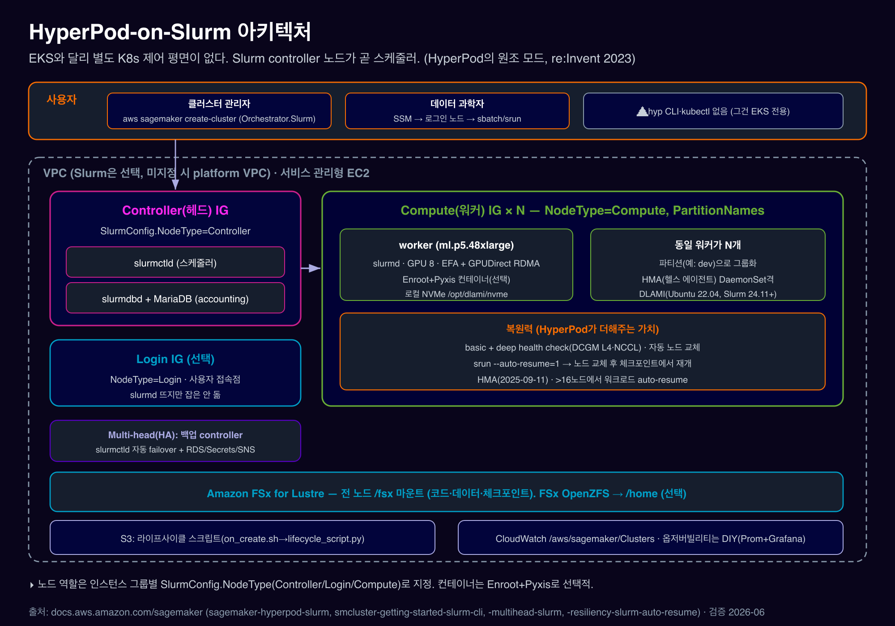

# 02. HyperPod-on-Slurm 아키텍처

***

### 0. TL;DR

1. **HyperPod = 영속·복원력 GPU/Trainium 클러스터 매니지드 서비스.** Slurm은 **원조 오케스트레이터**(re:Invent 2023, 2023-11-29 GA). EKS는 나중(2024-09-10) 추가.
2. **Slurm 모드엔 별도 K8s 제어 평면이 없습니다.** 클러스터 안의 **controller 노드(`slurmctld`)가 곧 스케줄러**. 인스턴스 그룹을 controller / login / compute 역할로 나눕니다.
3. **인스턴스는 서비스 관리형 EC2**(EKS와 동일) — EC2 콘솔엔 안 보이고 SSM으로 접속. 단, **VPC는 Slurm에선 선택**(EKS는 필수).
4. **HyperPod가 순수 Slurm에 더하는 것**: DLAMI·라이프사이클 스크립트로 Slurm 자동 설치, `/fsx` 공유, HMA·deep health check·**자동 노드 교체**, `srun --auto-resume=1`, multi-head HA controller.

***

### 1. 전체 아키텍처

<figure><figcaption></figcaption></figure>

핵심:

* **노드 역할은 인스턴스 그룹별 `SlurmConfig.NodeType`** (Controller / Login / Compute)로 지정.
* **`Orchestrator.Slurm`** 으로 Slurm 모드 선택(EKS는 `Orchestrator.Eks.ClusterArn`). `Orchestrator`는 Eks와 Slurm 중 **정확히 하나**만, 또는 생략(레거시 기본 Slurm).
* controller/login/compute 모두 같은 VPC. **VPC는 선택**이지만, FSx for Lustre를 붙이려면 직접 VPC를 줘야 함.

출처: [HyperPod Slurm 개요](https://docs.aws.amazon.com/sagemaker/latest/dg/sagemaker-hyperpod-slurm.html) · [CreateCluster API](https://docs.aws.amazon.com/sagemaker/latest/APIReference/API_CreateCluster.html)

***

### 2. 노드 역할 (Instance Group)

| 역할                 | NodeType     | Daemon                   | 비고                                                                                                                            |
| ------------------ | ------------ | ------------------------ | ----------------------------------------------------------------------------------------------------------------------------- |
| **Controller(헤드)** | `Controller` | `slurmctld` + `slurmdbd` | 스케줄러 + 어카운팅. 어카운팅 DB는 **단일 헤드=컨트롤러 로컬 MariaDB**, **멀티헤드 HA=외부 RDS for MariaDB**(§아래). **삭제 불가**(`NODE_ID_IN_USE`). 클러스터당 최소 1 |
| **Login** (선택)     | `Login`      | `slurmd`(잡 미실행)          | 사용자 접속 전용. slurm.conf에 없어 잡이 안 돎                                                                                              |
| **Compute(워커)**    | `Compute`    | `slurmd --conf-server`   | 실제 GPU 잡 실행. `PartitionNames`로 파티션 지정                                                                                         |

* 최소 클러스터 = **controller 1 + compute 1**. `CreateCluster`의 `InstanceGroups`는 최대 100개.
* **Multi-head HA**: controller를 primary + backup으로 둬 `slurmctld` 자동 failover. RDS for MariaDB(어카운팅)·Secrets Manager(DB 자격증명)·FSx(slurm.conf·상태)·SNS(controller ON/OFF 알림)가 받쳐줍니다 — 단일 controller SPOF 제거.

출처: [Slurm CLI 시작하기](https://docs.aws.amazon.com/sagemaker/latest/dg/smcluster-getting-started-slurm-cli.html) · [멀티헤드](https://docs.aws.amazon.com/sagemaker/latest/dg/sagemaker-hyperpod-multihead-slurm.html)

***

### 3. 노드 위에 뭐가 깔리나 — DLAMI

* **HyperPod Slurm DLAMI**: AWS Deep Learning Base GPU AMI(현재 **Ubuntu 22.04 LTS**, 2025-05-13\~) 기반. GPU 드라이버·EFA·AWS OFI NCCL·Slurm이 내장.
* **Slurm 버전 이력**: v23.02.3(2023 GA) → 23.11.x(2024) → **24.11**(2025-02) → **25.11**(2026-05). slurmrestd(REST/JSON/JWT) 동봉.
* **Enroot + Pyxis + Docker**: 라이프사이클 `config.py`의 `enable_docker_enroot_pyxis=True`(기본)로 자동 설치(Enroot 3.4.1 / Pyxis v0.19.0 핀).

> ⚠️ Slurm 25.11 AMI(2026-05-27)에는 auto-resume가 교체 노드에서 재개되지 않고 requeue될 수 있는 **알려진 이슈**가 있습니다 — 프로덕션 전 현행 릴리스 노트 확인.

출처: [Slurm AMI 릴리스 노트](https://docs.aws.amazon.com/sagemaker/latest/dg/sagemaker-hyperpod-release-ami-slurm.html)

***

### 4. 복원력(Resiliency) 개요

순수 Slurm 대비 HyperPod의 가장 큰 가치입니다. 세 겹으로 작동(상세는 05. 복원력):

1. **Health Monitoring Agent (HMA)** — 모든 GPU/Trainium 노드에서 상시 감시(nvidia-smi/DCGM·Neuron sysfs·EFA). **EKS와 동일한 에이전트**. Slurm 지원은 **2025-09-11**부터(`UpdateClusterSoftware` 필요).
2. **Deep health check** — 신규/교체 노드에 DCGM L4 + EFA loopback + 멀티노드 NCCL. Slurm에선 노드를 `hyperpod-deep-health-check` 예약 / `hyperpod-system-maintenance` 파티션으로 격리. worker 노드만(controller/login 제외).
3. **자동 노드 복구 + auto-resume** — 클러스터 레벨 `NodeRecovery=Automatic`(권장)이 결함 노드를 재부팅/교체. 잡 레벨 `srun --auto-resume=1`이 교체 후 체크포인트에서 재개. (auto-resume 사용 시 노드는 **항상 교체**, 재부팅 안 함)

> 워크로드 auto-resume(체크포인트 재개 보장)은 **>16노드** 클러스터에서.

출처: [복원력 개요](https://docs.aws.amazon.com/sagemaker/latest/dg/sagemaker-hyperpod-resiliency-slurm.html) · [auto-resume](https://docs.aws.amazon.com/sagemaker/latest/dg/sagemaker-hyperpod-resiliency-slurm-auto-resume.html)

***

### 5. HyperPod가 순수 Slurm-on-EC2에 더하는 것 (요약)

| 기능            | 직접 Slurm-on-EC2        | HyperPod-on-Slurm              |
| ------------- | ---------------------- | ------------------------------ |
| 노드 프로비저닝      | 내가 EC2·드라이버·EFA 직접     | **DLAMI + 라이프사이클 스크립트**        |
| Slurm 설치/설정   | 내가 slurmctld/slurmd 구성 | **라이프사이클이 자동** (configless)    |
| 하드웨어 헬스체크     | 직접 구축                  | **HMA + deep health check 내장** |
| 결함 노드 교체      | 수동                     | **자동 (NodeRecovery)**          |
| 잡 복구          | 직접 requeue 스크립트        | **`srun --auto-resume=1`**     |
| HA controller | 직접 구성                  | **multi-head 매니지드**            |
| 공유 FS         | 직접 마운트                 | **`/fsx` 자동 마운트**              |

> 한 줄: **"내 GPU 클러스터 위, HPC 친숙한 Slurm을, 슈퍼컴퓨터급 복원력을 매니지드로."**

***

### 6. 최근(2025–2026) 아키텍처 관련 기능

| 기능                              | 날짜         | 비고                                |
| ------------------------------- | ---------- | --------------------------------- |
| Ubuntu 22.04 LTS Slurm AMI      | 2025-05-13 | EFA-on-FSx 지원                     |
| Slurm HMA                       | 2025-09-11 | `UpdateClusterSoftware` 필요        |
| Continuous Provisioning (Slurm) | 2026-03    | `NodeProvisioningMode=Continuous` |
| 온디맨드 deep health check          | 2026-04    | EKS+Slurm 공통                      |
| Slurm v25.11 AMI                | 2026-05-27 | ⚠️ auto-resume 알려진 이슈             |

→ 전체 타임라인은 09. 최근 기능 타임라인 참고.

***

### References

| 주제                               | URL                                                                                                  |
| -------------------------------- | ---------------------------------------------------------------------------------------------------- |
| HyperPod Slurm 개요                | https://docs.aws.amazon.com/sagemaker/latest/dg/sagemaker-hyperpod-slurm.html                        |
| CreateCluster API (Orchestrator) | https://docs.aws.amazon.com/sagemaker/latest/APIReference/API\_CreateCluster.html                    |
| Slurm CLI 시작하기                   | https://docs.aws.amazon.com/sagemaker/latest/dg/smcluster-getting-started-slurm-cli.html             |
| 멀티헤드 Slurm                       | https://docs.aws.amazon.com/sagemaker/latest/dg/sagemaker-hyperpod-multihead-slurm.html              |
| Slurm AMI 릴리스 노트                 | https://docs.aws.amazon.com/sagemaker/latest/dg/sagemaker-hyperpod-release-ami-slurm.html            |
| 복원력 개요                           | https://docs.aws.amazon.com/sagemaker/latest/dg/sagemaker-hyperpod-resiliency-slurm.html             |
| auto-resume                      | https://docs.aws.amazon.com/sagemaker/latest/dg/sagemaker-hyperpod-resiliency-slurm-auto-resume.html |
| 릴리스 노트                           | https://docs.aws.amazon.com/sagemaker/latest/dg/sagemaker-hyperpod-release-notes.html                |
