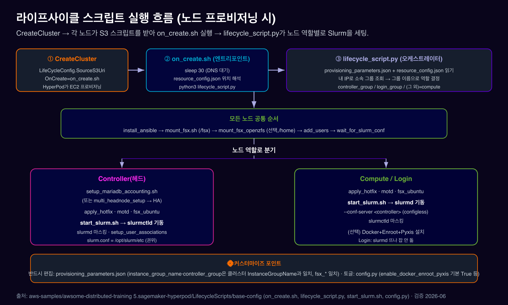

# 03. 클러스터 구축 & 라이프사이클 스크립트

***

### 0. TL;DR

1. Slurm 클러스터도 EKS와 **같은 `sagemaker:CreateCluster` API**로 만들되, `Orchestrator`를 **`Slurm`** 으로(또는 생략=레거시 기본 Slurm). EKS는 `Orchestrator.Eks.ClusterArn`.
2. **VPC는 Slurm에선 선택**(미지정 시 platform VPC). 단 **FSx for Lustre를 붙이려면 직접 VPC**를 줘야 함.
3. 클러스터 모양 = **InstanceGroups**(controller / login / worker). 각 그룹의 `LifeCycleConfig.SourceS3Uri`(s3://**sagemaker-**\*)와 `OnCreate=on_create.sh`.
4. **라이프사이클 스크립트**(`on_create.sh → lifecycle_script.py`)가 노드 부팅 시 `/fsx` 마운트·Slurm 설치·Enroot/Pyxis·파티션 구성을 자동화. 반드시 편집할 파일은 **`provisioning_parameters.json`** 하나.
5. Day-2: `UpdateCluster`(스케일)·`UpdateClusterSoftware`(AMI 패치, 루트 볼륨 교체).

***

### 1. 전제조건 체크리스트

| 항목                 | Slurm 요구사항                                                                                                   |
| ------------------ | ------------------------------------------------------------------------------------------------------------ |
| **VPC**            | **선택**(미지정 시 platform VPC). FSx Lustre 쓰려면 프라이빗 서브넷 필요. CIDR은 생성 후 변경 불가 — P5당 \~32 IP로 사이징                  |
| **FSx for Lustre** | 권장 공유 FS. `/fsx`에 마운트. 같은 AZ 권장(cross-AZ 트래픽 회피)                                                             |
| **S3 버킷**          | 라이프사이클 스크립트 보관. **이름이 `sagemaker-`로 시작해야 함**(실행 역할 정책이 `arn:aws:s3:::sagemaker-*`로 제한)                       |
| **IAM 실행 역할**      | trust principal `sagemaker.amazonaws.com` + S3(sagemaker-\*)·CloudWatch Logs·`ssmmessages:*`(SSM)·EC2 ENI 권한 |
| **컨트롤러 인스턴스**      | 작은 CPU 인스턴스로 충분(예: ml.c5.xlarge / ml.m5.4xlarge)                                                             |

> EKS와 차이: EKS는 VPC 필수 + EKS 클러스터/애드온/Helm이 전제. Slurm은 그게 없고 대신 **라이프사이클 스크립트**가 그 역할을 합니다.

출처: [전제조건](https://docs.aws.amazon.com/sagemaker/latest/dg/sagemaker-hyperpod-prerequisites.html) · [실행 역할 정책](https://github.com/awslabs/awsome-distributed-ai/blob/main/1.architectures/5.sagemaker-hyperpod/1.AmazonSageMakerClustersExecutionRolePolicy.json)

***

### 2. 클러스터 생성 (CLI)

#### 2.1 가장 쉬운 경로 — awsome-distributed-ai 레퍼런스 스택

```bash
git clone https://github.com/awslabs/awsome-distributed-ai/
cd awsome-distributed-ai/1.architectures/5.sagemaker-hyperpod
# 1) CloudFormation으로 VPC/서브넷/FSx/IAM 역할/S3 버킷 생성 (콘솔 또는 CLI)
# 2) 스택 출력으로부터 env 변수 추출
bash create_config.sh && source env_vars
# 3) 라이프사이클 스크립트를 S3에 업로드 (버킷명은 sagemaker-*)
aws s3 cp --recursive LifecycleScripts/base-config s3://${BUCKET}/LifecycleScripts/base-config
# 4) 클러스터 생성
aws sagemaker create-cluster \
  --cluster-name ml-cluster \
  --instance-groups file://cluster-config.json \
  --vpc-config file://vpc-config.json \
  --region us-west-2
```

`create_config.sh`는 CloudFormation 출력(VPC, PrimaryPrivateSubnet, FSxLustreFilesystemId/Mountname, SecurityGroup, ExecutionRoleArn, S3BucketName)을 `env_vars`로 써줍니다.

#### 2.2 `cluster-config.json` (인스턴스 그룹)

```json
[
  {
    "InstanceGroupName": "controller-machine",
    "InstanceType": "ml.c5.xlarge",
    "InstanceCount": 1,
    "LifeCycleConfig": { "SourceS3Uri": "s3://sagemaker-<bucket>/LifecycleScripts/base-config/", "OnCreate": "on_create.sh" },
    "ExecutionRole": "arn:aws:iam::111122223333:role/HyperPodExecutionRole",
    "ThreadsPerCore": 1
  },
  {
    "InstanceGroupName": "login-group",
    "InstanceType": "ml.m5.4xlarge",
    "InstanceCount": 1,
    "LifeCycleConfig": { "SourceS3Uri": "s3://sagemaker-<bucket>/LifecycleScripts/base-config/", "OnCreate": "on_create.sh" },
    "ExecutionRole": "arn:aws:iam::111122223333:role/HyperPodExecutionRole",
    "ThreadsPerCore": 1
  },
  {
    "InstanceGroupName": "compute-nodes",
    "InstanceType": "ml.p5.48xlarge",
    "InstanceCount": 4,
    "LifeCycleConfig": { "SourceS3Uri": "s3://sagemaker-<bucket>/LifecycleScripts/base-config/", "OnCreate": "on_create.sh" },
    "ExecutionRole": "arn:aws:iam::111122223333:role/HyperPodExecutionRole",
    "ThreadsPerCore": 1,
    "OnStartDeepHealthChecks": ["InstanceStress", "InstanceConnectivity"]
  }
]
```

> 단일 파일 형태(`--cli-input-json file://create_cluster.json`)도 가능 — 최상위 `ClusterName` + `InstanceGroups` + `Orchestrator` + `VpcConfig`. **API-driven Slurm 토폴로지**(권장)는 인스턴스 그룹에 `SlurmConfig: {NodeType, PartitionNames}`를 넣고 클러스터 레벨 `Orchestrator: {"Slurm": {"SlurmConfigStrategy": "Managed"}}`를 줍니다 — 이러면 `provisioning_parameters.json` 없이도 됩니다.

출처: [awsome-distributed-ai 5.sagemaker-hyperpod](https://github.com/awslabs/awsome-distributed-ai/tree/main/1.architectures/5.sagemaker-hyperpod) · [Slurm CLI 시작하기](https://docs.aws.amazon.com/sagemaker/latest/dg/smcluster-getting-started-slurm-cli.html)

***

### 3. 라이프사이클 스크립트 심화

<figure><figcaption></figcaption></figure>

EKS의 Helm 차트에 해당하는 것이 Slurm의 **라이프사이클 스크립트**입니다. 노드가 부팅될 때 HyperPod가 S3 스크립트를 받아 실행하며, 이게 Slurm을 설치·설정합니다.

#### 3.1 실행 흐름

```
CreateCluster → 각 노드가 SourceS3Uri를 /tmp/<bucket>/로 다운로드 → on_create.sh(엔트리포인트) 실행
   on_create.sh: sleep 30(DNS) → SAGEMAKER_RESOURCE_CONFIG_PATH 해석 → python3 lifecycle_script.py
   lifecycle_script.py:
     ① provisioning_parameters.json + resource_config.json 읽기
     ② 내 IP로 소속 인스턴스 그룹 조회 → 그룹 이름으로 역할 결정(controller_group/login_group/그 외=compute)
     ③ 공통: install_ansible → mount_fsx.sh(/fsx) → add_users → wait_for_slurm_conf
     ④ 역할 분기:
        controller → setup_mariadb_accounting.sh(또는 multi_headnode_setup) → start_slurm.sh(slurmctld 기동)
        compute/login → start_slurm.sh(slurmd --conf-server <controller>, configless)
     ⑤ 선택: Docker+Enroot+Pyxis · 옵저버빌리티 · SSSD 등
```

* **`resource_config.json`**: HyperPod가 자동 생성(`/opt/ml/config/resource_config.json`, env `SAGEMAKER_RESOURCE_CONFIG_PATH`). ClusterArn·인스턴스 타입·**노드별 IP**를 담습니다. **내가 만들면 안 됩니다.**
* 노드 역할은 `resource_config.json`에서 내 IP가 속한 그룹의 **이름**을 `provisioning_parameters.json`의 `controller_group`/`login_group`과 비교해 결정됩니다.
* `/fsx`는 **하드코딩**: `mount_fsx.sh`를 `("/fsx")` 인자로 호출. (`mount_fsx.sh` 자체는 마운트 지점을 인자로 받지만, 호출하는 쪽이 `/fsx`로 고정)
* `slurm.conf`는 `/opt/slurm/etc/slurm.conf`. controller가 권위본을 만들고, compute는 `--conf-server`로 받아옵니다(configless).

#### 3.2 반드시 편집할 파일 — `provisioning_parameters.json`

이 파일은 레포에 **커밋돼 있지 않습니다**. README 템플릿에서 만들어 S3에 같이 올립니다.

```json
{
  "version": "1.0.0",
  "workload_manager": "slurm",
  "controller_group": "controller-machine",
  "login_group": "my-login-group",
  "worker_groups": [
    { "instance_group_name": "compute-nodes", "partition_name": "dev" }
  ],
  "fsx_dns_name": "fs-12345678a90b01cde.fsx.us-west-2.amazonaws.com",
  "fsx_mountname": "1abcdefg"
}
```

> ⚠️ **반드시 일치시킬 것**: `controller_group`과 `worker_groups[].instance_group_name`은 `cluster-config.json`의 `InstanceGroupName`과 **글자 그대로 일치**해야 합니다. `fsx_dns_name`/`fsx_mountname`은 실제 FSx Lustre와 일치. `login_group`은 선택(필수 아님). 위 키 셋은 **레포 README 템플릿(레거시 Option B)** 기준입니다 — `validate-config.py`의 필수 키는 `version, workload_manager, controller_group, worker_groups, fsx_dns_name, fsx_mountname`. (참고: 최신 `lifecycle_script.py` 파서는 `slurm_configurations`로 파티션을 받는 경로도 있어, **API-driven Option A**를 쓰면 이 파일 자체가 불필요합니다 — §2.2.)

#### 3.3 커스터마이즈 — `config.py` 토글

```python
# LifecycleScripts/base-config/config.py (기본값)
enable_docker_enroot_pyxis = True   # Docker+Enroot+Pyxis 설치 (컨테이너 잡)
enable_observability       = False  # Prometheus/Grafana exporter (DIY 옵저버빌리티)
enable_sssd                = False  # LDAP/AD 통합
enable_fsx_openzfs         = False  # FSx OpenZFS를 /home에
enable_mount_s3            = False  # Mountpoint-S3
enable_slurm_log_rotation  = True
```

추가 커스터마이즈는 `utils/`에 스크립트를 두고 `lifecycle_script.py`에서 `ExecuteBashScript("./utils/yourscript.sh").run()`로 호출(README가 Miniconda 설치를 예로 듦).

출처: [라이프사이클 모범사례](https://docs.aws.amazon.com/sagemaker/latest/dg/sagemaker-hyperpod-lifecycle-best-practices-slurm.html) · [base-config(GitHub)](https://github.com/awslabs/awsome-distributed-ai/tree/main/1.architectures/5.sagemaker-hyperpod/LifecycleScripts/base-config)

***

### 4. 접속 & 검증

```bash
# SSM으로 로그인(또는 controller) 노드 접속 — SSH 아님
aws sagemaker list-cluster-nodes --cluster-name ml-cluster
aws ssm start-session --target sagemaker-cluster:<cluster-id>_login-group-<instance-id> --region us-west-2
# (레포의 헬퍼) ./easy-ssh.sh ml-cluster

# 노드에서 Slurm 토폴로지 확인
sinfo                       # 파티션(dev 등) + 노드 상태
sinfo -p dev
srun -p dev --nodes=1 hostname
ls /fsx                     # 공유 FS 마운트 확인
```

InService까지 보통 10–15분. 각 CreateCluster 실행은 CloudWatch 로그 스트림(`<cluster-name>-<timestamp>`)에 라이프사이클 stdout/stderr를 남깁니다.

출처: [Slurm CLI 시작하기](https://docs.aws.amazon.com/sagemaker/latest/dg/smcluster-getting-started-slurm-cli.html)

***

### 5. 용량 옵션 & Day-2 운영

#### 5.1 용량

* **On-Demand**(기본) / **Flexible Training Plans**(예약 블록, 2024-12-04 GA).
* **Continuous Provisioning**(Slurm, **2026-03**): `NodeProvisioningMode=Continuous` — all-or-nothing 롤백 대신 가용 노드부터 InService, 나머지는 백그라운드 비동기로 채움. `MinInstanceCount`(3h 롤백). **API-driven SlurmConfig 필요**(레거시 `provisioning_parameters.json` 비호환), 온디맨드 deep health check 미지원.

> ⚠️ `NodeProvisioningMode=Continuous`는 한때 EKS 전용이었으나 2026-03부터 Slurm 지원. CreateCluster API 레퍼런스 문구가 아직 "EKS only"로 남아있을 수 있으니(stale) What's New 기준으로 판단.

#### 5.2 스케일 & 패치

```bash
# 인스턴스 그룹 스케일(추가/축소). controller는 삭제 불가(NODE_ID_IN_USE)
aws sagemaker update-cluster --cli-input-json file://update_cluster.json

# AMI/보안 패치 — 루트 볼륨을 교체하고 라이프사이클 재실행. 백업 먼저!
aws sagemaker update-cluster-software --cluster-name ml-cluster
```

> ⚠️ `update-cluster-software`는 **루트 볼륨을 교체·초기화**합니다(`/fsx`는 별도 FS라 생존). controller의 `/var/spool/slurmctld`·MariaDB 등은 미리 백업(레포의 `patching-backup.sh`). DeploymentConfig로 롤링 배치 크기·알람 기반 자동 롤백·대상 인스턴스 그룹 지정 가능. **API/CLI 전용**(콘솔 없음). HMA·deep health check를 쓰려면 이 패치로 최신 AMI 적용이 전제.

출처: [Slurm 스케일링/continuous](https://docs.aws.amazon.com/sagemaker/latest/dg/sagemaker-hyperpod-scaling-slurm.html) · [UpdateClusterSoftware](https://docs.aws.amazon.com/sagemaker/latest/APIReference/API_UpdateClusterSoftware.html) · [Slurm 운영 CLI](https://docs.aws.amazon.com/sagemaker/latest/dg/sagemaker-hyperpod-operate-slurm-cli-command.html)

***

### 6. 출처 정리 (라이브 검증 2026-06)

| 주제                                     | URL                                                                                                                          |
| -------------------------------------- | ---------------------------------------------------------------------------------------------------------------------------- |
| 전제조건                                   | https://docs.aws.amazon.com/sagemaker/latest/dg/sagemaker-hyperpod-prerequisites.html                                        |
| CreateCluster API (Orchestrator.Slurm) | https://docs.aws.amazon.com/sagemaker/latest/APIReference/API\_CreateCluster.html                                            |
| Slurm CLI 시작하기                         | https://docs.aws.amazon.com/sagemaker/latest/dg/smcluster-getting-started-slurm-cli.html                                     |
| 라이프사이클 모범사례                            | https://docs.aws.amazon.com/sagemaker/latest/dg/sagemaker-hyperpod-lifecycle-best-practices-slurm.html                       |
| Slurm 스케일링/continuous provisioning     | https://docs.aws.amazon.com/sagemaker/latest/dg/sagemaker-hyperpod-scaling-slurm.html                                        |
| UpdateClusterSoftware                  | https://docs.aws.amazon.com/sagemaker/latest/APIReference/API\_UpdateClusterSoftware.html                                    |
| Slurm 운영 CLI                           | https://docs.aws.amazon.com/sagemaker/latest/dg/sagemaker-hyperpod-operate-slurm-cli-command.html                            |
| base-config 라이프사이클 (GitHub)            | https://github.com/awslabs/awsome-distributed-ai/tree/main/1.architectures/5.sagemaker-hyperpod/LifecycleScripts/base-config |
