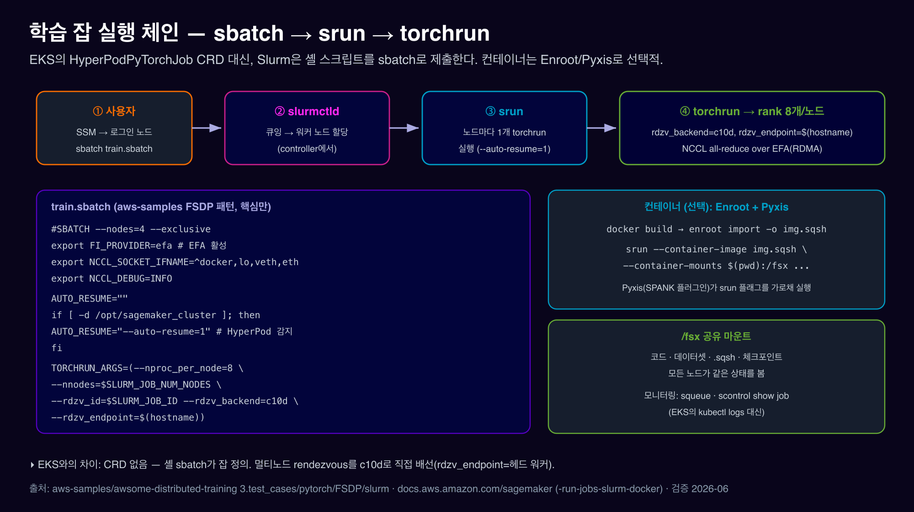

# 04. Training on HyperPod-Slurm

***

### 0. TL;DR

1. **EKS와 가장 큰 차이 — CRD가 없습니다.** `HyperPodPyTorchJob`/kubectl/`hyp` 대신, SSH로 로그인 노드에 들어가 **`.sbatch` 셸 스크립트**를 `sbatch`로 제출합니다.
2. 체인: **`sbatch` → `slurmctld`가 노드 할당 → `srun`이 노드마다 `torchrun` 기동 → torchrun이 GPU당 rank → NCCL over EFA**.
3. **컨테이너는 선택**: Enroot로 Docker 이미지를 `.sqsh`로 변환, Pyxis가 `srun --container-image` 플래그를 가로채 실행. 안 쓰면 `/fsx`의 conda로.
4. **복원력**은 `srun`에 **`--auto-resume=1`** 한 플래그(배타 할당 안에서). 자세한 건 05. 복원력.
5. **Recipes**: 같은 레시피를 `cluster_type=slurm`으로 헤드 노드에서 실행. 단 **Slurm은 LLMFT 레시피만**(VERL은 EKS/SMTJ 전용).

***

### 1. 그냥 Slurm과 뭐가 다른가? (직관적으로)

"이미 Slurm으로 분산 학습을 돌릴 수 있는데, HyperPod가 **뭘 더 해주지?**"

순수 Slurm-on-EC2로 복원력 있는 대규모 학습을 하려면 직접 해야 하는 것:

* EC2 프로비저닝·GPU 드라이버·EFA·NCCL 플러그인 설치, slurmctld/slurmd 구성, slurm.conf 작성
* GPU/EFA deep 헬스체크, 결함 노드 감지·교체 로직, 잡 requeue 스크립트, 어카운팅 DB

HyperPod-Slurm은 이를 **DLAMI + 라이프사이클 스크립트 + 복원력 레이어**로 흡수합니다. 여러분이 쓰는 것은 거의 **표준 Slurm 그대로** — 단지 `srun`에 `--auto-resume=1`을 더하고, 결함 노드가 알아서 교체됩니다.

|             | **순수 Slurm-on-EC2** | **HyperPod-on-Slurm**      | **(참고) HyperPod-on-EKS**   |
| ----------- | ------------------- | -------------------------- | -------------------------- |
| 잡 정의        | `.sbatch` (직접)      | **`.sbatch` (동일, 친숙)**     | `HyperPodPyTorchJob` CRD   |
| 노드/Slurm 구성 | 직접                  | **라이프사이클 자동**              | (해당 없음)                    |
| 실패 복구       | 직접 requeue          | **`srun --auto-resume=1`** | Training Operator(프로세스 단위) |
| 노드 교체       | 수동                  | **자동(NodeRecovery)**       | 자동                         |
| 적합          | 완전 제어               | **기존 Slurm 자산 + 매니지드 복원력** | 클라우드 네이티브·멀티팀              |

> 한 줄: **HyperPod-Slurm = "HPC 팀에게 친숙한 Slurm 인터페이스를 그대로, 복원력만 매니지드로."** 기존 sbatch 스크립트를 거의 그대로 lift-and-shift 할 수 있는 게 큰 장점입니다.

출처: [전제조건(Slurm vs EKS)](https://docs.aws.amazon.com/sagemaker/latest/dg/sagemaker-hyperpod-prerequisites.html) · [복원력](https://docs.aws.amazon.com/sagemaker/latest/dg/sagemaker-hyperpod-resiliency-slurm-auto-resume.html)

***

### 2. 학습 잡 실행 체인

<figure><figcaption></figcaption></figure>

핵심: **`srun`은 노드마다 1회** 실행됩니다. 그래서 `srun torchrun`이면 각 노드에서 torchrun이 하나씩 떠서, 그 안에서 `--nproc_per_node`(=GPU 수) 개의 rank를 만듭니다. 멀티노드 rendezvous는 `torchrun --rdzv_backend=c10d --rdzv_endpoint=$(hostname)`(헤드 워커가 rendezvous) 또는 `scontrol`로 MASTER\_ADDR를 구해 배선합니다.

***

### 3. 메인 경로 — sbatch + srun + torchrun (FSDP 예제)

aws-samples FSDP Slurm 예제의 검증된 패턴입니다. `sbatch train.sbatch`로 제출.

```bash
#!/bin/bash
#SBATCH --nodes=4                       # 노드 4개
#SBATCH --job-name=llama-fsdp
#SBATCH --output=logs/%x_%j.out         # %x=잡이름 %j=잡ID
#SBATCH --exclusive                     # 노드 독점 (auto-resume에도 필요)
set -ex
GPUS_PER_NODE=8

# ── EFA / NCCL (검증된 현행 FSDP 스크립트 기준) ──
export FI_PROVIDER=efa                   # EFA libfabric 선택 (GPUDirect RDMA)
export FI_EFA_USE_HUGE_PAGE=0
export FI_EFA_SET_CUDA_SYNC_MEMOPS=0
export NCCL_SOCKET_IFNAME=^docker,lo,veth,eth
export NCCL_DEBUG=INFO
export DATA_PATH=/fsx                    # 공유 FSx
export FSX_MOUNT=$(pwd):$DATA_PATH

# ── (선택) Enroot/Pyxis 컨테이너 ──
declare -a ARGS=()
if [ ! -z "$CONTAINER_IMAGE" ]; then
  ARGS=(--container-image $CONTAINER_IMAGE --container-mounts $FSX_MOUNT)
fi

# ── HyperPod auto-resume 자동 감지 ──
AUTO_RESUME=""
if [ -d "/opt/sagemaker_cluster" ]; then AUTO_RESUME="--auto-resume=1"; fi

# ── torchrun 인자: nnodes/rdzv를 Slurm 환경변수에서 ──
declare -a TORCHRUN_ARGS=(
  --nproc_per_node=$GPUS_PER_NODE
  --nnodes=$SLURM_JOB_NUM_NODES
  --rdzv_id=$SLURM_JOB_ID
  --rdzv_backend=c10d
  --rdzv_endpoint=$(hostname))

srun ${AUTO_RESUME} -l "${ARGS[@]}" torchrun "${TORCHRUN_ARGS[@]}" train.py
```

**각 부분이 왜 필요한가:**

* **`#SBATCH --exclusive`** — 노드 독점. `--auto-resume`은 배타 할당 안에서만 동작.
* **`FI_PROVIDER=efa`** — 멀티노드 NCCL을 EFA(RDMA)로. 빠지면 느린 TCP로 폴백 → 학습 속도 급락. (참고: 현행 FSDP 스크립트는 `FI_EFA_USE_DEVICE_RDMA=1`을 **명시하지 않습니다** — P5/H100 + 최신 aws-ofi-nccl에선 자동 활성화. P4d 세대에서만 필요했던 레거시 노브.)
* **`NCCL_SOCKET_IFNAME=^docker,lo,veth,eth`** — NCCL이 엉뚱한 인터페이스를 안 쓰게 제외.
* **`srun ... torchrun`** — srun이 노드마다 torchrun 1개를 띄움(노드당 8 rank).
* **`AUTO_RESUME`** — HyperPod 클러스터면 `/opt/sagemaker_cluster`가 존재 → `--auto-resume=1` 자동 추가.
* **`/fsx`** — 데이터·체크포인트를 전 노드가 공유.

#### 제출·모니터링

```bash
sbatch train.sbatch              # 제출
squeue                           # 큐·상태 (kubectl get pods 격)
squeue -j <jobid>
scontrol show job <jobid>        # 잡 상세 (kubectl describe 격)
sinfo                            # 노드/파티션 상태
tail -f logs/llama-fsdp_<jobid>.out
scancel <jobid>                  # 취소
```

출처: [FSDP Slurm sbatch](https://github.com/awslabs/awsome-distributed-ai/blob/main/3.test_cases/pytorch/FSDP/slurm/llama2_7b-training.sbatch) · [Slurm 잡 실행](https://docs.aws.amazon.com/sagemaker/latest/dg/sagemaker-hyperpod-run-jobs-slurm.html)

***

### 4. 컨테이너 — Enroot + Pyxis

EKS는 항상 컨테이너지만 Slurm은 선택입니다. 쓰려면 Docker 이미지를 Enroot squashfs로 변환:

```bash
docker build -f Dockerfile -t fsdp:pt2.7 .
enroot import -o pytorch-fsdp.sqsh dockerd://fsdp:pt2.7     # Docker → .sqsh
# sbatch 안에서:
export CONTAINER_IMAGE=$(pwd)/pytorch-fsdp.sqsh
# srun이 Pyxis 플래그를 받음:
srun --container-image $CONTAINER_IMAGE --container-mounts $(pwd):/fsx torchrun ...
```

* **Pyxis**(SPANK 플러그인)가 `--container-image`/`--container-mounts`를 가로채 Enroot로 컨테이너를 띄웁니다.
* 라이프사이클 `config.py`의 `enable_docker_enroot_pyxis=True`(기본)로 자동 설치. Enroot 데이터는 로컬 NVMe `/opt/dlami/nvme`.
* **Megatron-LM**도 동일 패턴(`enroot import` → `srun --container-image ... python -m torch.distributed.run`). 추가 env: `NCCL_ASYNC_ERROR_HANDLING=1`, `CUDA_DEVICE_MAX_CONNECTIONS=1`.

출처: [Slurm 컨테이너(Enroot/Pyxis)](https://docs.aws.amazon.com/sagemaker/latest/dg/sagemaker-hyperpod-run-jobs-slurm-docker.html) · [FSDP README](https://github.com/awslabs/awsome-distributed-ai/blob/main/3.test_cases/pytorch/FSDP/slurm/README.md)

***

### 5. Recipes — 검증된 학습 스택 (Slurm)

**HyperPod Recipes**(`aws/sagemaker-hyperpod-recipes`)는 인기 OSS 모델의 검증된 학습 설정+런처입니다. 같은 레시피를 EKS/Slurm/SMTJ에서 실행할 수 있습니다.

```bash
# 1) 헤드 노드에서 레포 클론 (공유 /fsx 권장)
git clone --recursive https://github.com/aws/sagemaker-hyperpod-recipes.git
cd sagemaker-hyperpod-recipes && pip3 install -r requirements.txt

# 2) recipes_collection/config.yaml 에서 Slurm 선택
#    cluster_type: slurm        # bcm, bcp, k8s, sm_jobs 중
#    cluster: slurm
#    container: <ECR 이미지>      # LLMFT 컨테이너

# 3) 런처 스크립트 실행 (sbatch를 내부 생성)
bash launcher_scripts/llama/run_llmft_llama3_1_8b_instruct_seq4k_gpu_sft_lora.sh

# 4) 모니터링
squeue
scontrol show job <jobid>
```

* **`cluster_type=slurm`** 이 Slurm을 선택(EKS는 `k8s`, SageMaker training job은 `sm_jobs`).
* ⚠️ **Slurm은 LLMFT 레시피만 지원**(SFT/DPO LoRA 등). **VERL(GRPO/RLVR) 레시피는 Slurm 미지원** — EKS/SMTJ에서만. LLMFT 컨테이너 예: `327873000638.dkr.ecr.us-east-1.amazonaws.com/hyperpod-recipes:llmft-v1.0.0`.
* 어댑터는 NVIDIA NeMo(GPU) + Neuronx Distributed Training(Trainium) 기반.

출처: [Recipes 개요](https://docs.aws.amazon.com/sagemaker/latest/dg/sagemaker-hyperpod-recipes.html) · [recipes config.yaml](https://github.com/aws/sagemaker-hyperpod-recipes/blob/main/recipes_collection/config.yaml) · [recipes repo](https://github.com/aws/sagemaker-hyperpod-recipes)

***

### 6. 체크포인트는? (요약 + 링크)

노드 교체에서 살아남으려면 **체크포인트를 `/fsx`(또는 S3)에** 써야 합니다(로컬 NVMe는 휘발). ⚠️ EKS의 **Managed Tiered Checkpointing은 Slurm에 없습니다** — Slurm에선 직접 구현(`/fsx`에 async DCP + S3 주기 복사, FSx↔S3 DRA로 자동화). 상세: 06. 체크포인트 & 스토리지.

***

### 7. 출처 정리 (라이브 검증 2026-06)

| 주제                       | URL                                                                                                  |
| ------------------------ | ---------------------------------------------------------------------------------------------------- |
| Slurm 잡 실행               | https://docs.aws.amazon.com/sagemaker/latest/dg/sagemaker-hyperpod-run-jobs-slurm.html               |
| Slurm 컨테이너(Enroot/Pyxis) | https://docs.aws.amazon.com/sagemaker/latest/dg/sagemaker-hyperpod-run-jobs-slurm-docker.html        |
| auto-resume              | https://docs.aws.amazon.com/sagemaker/latest/dg/sagemaker-hyperpod-resiliency-slurm-auto-resume.html |
| Recipes 개요               | https://docs.aws.amazon.com/sagemaker/latest/dg/sagemaker-hyperpod-recipes.html                      |
| FSDP Slurm 예제            | https://github.com/awslabs/awsome-distributed-ai/tree/main/3.test\_cases/pytorch/FSDP/slurm          |
| Megatron-LM Slurm 예제     | https://github.com/awslabs/awsome-distributed-ai/tree/main/3.test\_cases/megatron/megatron-lm/slurm  |
| recipes config.yaml      | https://github.com/aws/sagemaker-hyperpod-recipes/blob/main/recipes\_collection/config.yaml          |
