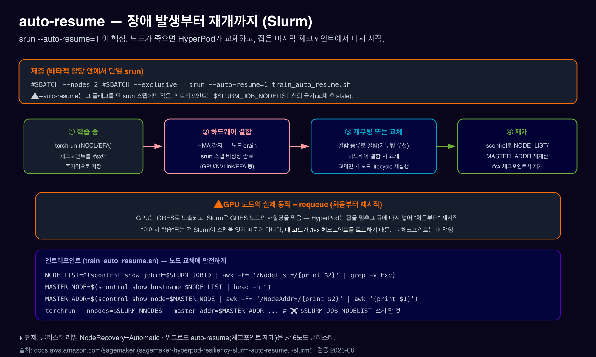

# 05. 복원력 & auto-resume

***

### 0. TL;DR

1. **왜 필요한가**: 수천 GPU를 수 주간 돌리면 하드웨어는 반드시 고장 납니다. 직접 운영하면 "노드 죽었나?"를 사람이 감시·교체하느라 가동률이 무너집니다.
2. HyperPod 복원력은 **세 겹**: ① **HMA**(상시 감시) ② **deep health check**(신규/교체 노드 정밀 검사) ③ **자동 노드 교체 + `srun --auto-resume=1`**(잡 재개).
3. **핵심 한 플래그**: 배타 할당 안의 srun에 **`--auto-resume=1`**. 노드가 죽으면 HyperPod가 교체하고, 그 srun 스텝을 **마지막 체크포인트에서** 다시 실행.
4. ⚠️ **GPU 노드의 실제 동작은 requeue(처음부터 재시작)** — GPU가 GRES로 노출되기 때문. "이어서 학습"되는 건 **내 코드가 `/fsx` 체크포인트를 로드**하기 때문. 체크포인트는 내 책임.
5. **EKS와 다른 점**: EKS는 Training Operator + 잡 어노테이션, Slurm은 **srun 플래그 + scontrol 노드 상태**. HMA·deep health check·자동 노드 복구는 **양쪽 동일**.

***

### 1. auto-resume 시퀀스 — 장애부터 재개까지

<figure><figcaption></figcaption></figure>

```
학습 중(/fsx에 체크포인트) → HMA가 결함 감지 → 노드 drain, srun 스텝 비정상 종료
   → (NodeRecovery=Automatic) 결함 노드 재부팅 또는 교체(결함 종류로 갈림, §2.3) → 노드 복귀/재프로비저닝
   → 엔트리포인트가 scontrol로 NODE_LIST/MASTER_ADDR 재계산 → /fsx 체크포인트에서 재개
```

전제: 클러스터 레벨 **`NodeRecovery=Automatic`**(기본·권장) + 워크로드 auto-resume(체크포인트 재개)은 **>16노드** 클러스터.

***

### 2. 세 겹 복원력

HyperPod 헬스 체크는 사실 **3종류**입니다(흔히 앞 둘을 "그냥 health check"로 뭉뚱그림). 비유: **Basic = 입학 신체검사, HMA = 매일 체온 체크, Deep = 종합 정밀검진.**

|        | **Basic health check**                                                        | **HMA (상시 감시)**                                 | **Deep health check**                             |
| ------ | ----------------------------------------------------------------------------- | ----------------------------------------------- | ------------------------------------------------- |
| **언제** | 노드 프로비저닝 시 1회                                                                 | **24/7 상시 백그라운드**                               | 노드 추가/교체 시 + 온디맨드                                 |
| **무엇** | DCGM 정책·nvidia-smi·**XID**·Neuron sysfs·EFA 연결 + **DCGM L2**·Linux stress(부하) | DCGM 정책·nvidia-smi·**XID**·GPU 개수·Neuron·EC2 로그 | **DCGM L4**(메모리 부하)+EFA loopback+**NCCL 노드간 대역폭** |
| **부하** | 안 검 (가벼움)                                                                     | 안 검 (passive 읽기)                                | **실제 풀로드 (무거움, \~45–90분)**                        |
| **목적** | "기본은 되나?"                                                                     | "돌다가 고장났나?"                                     | "풀로드·통신까지 정상인가?"                                  |
| **활성** | 항상                                                                            | 항상(Slurm 2025-09\~)                             | **opt-in**(`OnStartDeepHealthChecks`)             |
| 문서     | (§2.3 트리거)                                                                    | §2.1                                            | §2.2                                              |

> **핵심 차이 — "부하를 거느냐"**: Basic·HMA는 부하 없이 "있나/개수 맞나/에러났나"를 **가볍게**, Deep은 GPU·고속망에 **실제 부하를 걸어** 멀쩡해 보여도 고부하에서만 터지는 숨은 결함(ECC 메모리 오류·대역폭 저하)을 잡습니다. **셋 다 자동 노드 복구(§2.3)의 트리거**입니다 — 어느 하나라도 결함을 잡으면 노드를 재부팅/교체.

#### 2.1 Health Monitoring Agent (HMA) — 상시 감시

* 모든 GPU/Trainium 노드에서 백그라운드로 계속 동작. **EKS와 동일한 에이전트**.
* **NVIDIA**: DCGM 정책 위반·nvidia-smi 오류·**XID 에러**(NVIDIA GPU 에러 코드)·EC2 플랫폼 로그·GPU 개수 불일치 → 재부팅/교체. **Trainium**: Neuron 모니터/NPD·`neuron-ls` 개수 불일치.
* 이벤트는 CloudWatch 로그 그룹 `/aws/sagemaker/Clusters/`의 `SagemakerHealthMonitoringAgent` 스트림으로.
* ⚠️ **Slurm HMA 지원은 2025-09-11부터** — `aws sagemaker update-cluster-software`로 최신 AMI 적용이 전제.

#### 2.2 Deep health check — 정밀 검사

HMA가 "체온·맥박" 같은 가벼운 상시 체크라면, deep health check는 **"종합 정밀검진"** 입니다. GPU·고속망에 **실제로 부하를 걸어** 돌려보고, 합격한 노드만 잡을 받게 합니다. 멀쩡해 보여도 **고부하에서만 드러나는 결함**(ECC 메모리 에러·NVLink/EFA 대역폭 저하)을 잡 시작 전에 거르는 게 목적입니다.

**(1) 검사 종류 2가지**

| 종류                         | 무엇을 검사                                                                                                                     | 범위                         | 소요                                          |
| -------------------------- | -------------------------------------------------------------------------------------------------------------------------- | -------------------------- | ------------------------------------------- |
| **`InstanceStress`**       | stress-ng(CPU/메모리/디스크) + GPU/PCI 개수(`HARDWARE_CHECK`, \~1–2분) → **DCGM 진단 레벨 4**(GPU 메모리 테스트 포함) → **EFA loopback** 대역폭/지연 | 노드 1개씩                     | **DCGM L4 \~45–90분**(GPU 수 따라) · EFA \~2–5분 |
| **`InstanceConnectivity`** | 노드 간 **NCCL all\_reduce** 대역폭                                                                                              | 멀티노드(멀티노드 GPU 통신 가능 인스턴스만) | \~5–15분                                     |

> **🔤 약어 풀이 (처음 보면 헷갈리는 3개)**
>
> * **DCGM** (Data Center GPU Manager): NVIDIA의 **GPU 진단·모니터링 도구** = "GPU 전용 건강검진 장비". 진단 모드에 레벨 1\~4가 있고, 숫자가 클수록 깊고 오래 검사. **레벨 4 = 가장 깊음**(GPU 메모리까지 풀 스트레스, \~45–90분) → 풀로드에서만 터지는 ECC 메모리 오류 등 숨은 결함을 학습 시작 전에 잡음.
> * **EFA loopback** (Elastic Fabric Adapter = AWS 초고속 네트워크 카드): 데이터를 EFA로 내보냈다 **자기 자신에게 되돌려 받아** 대역폭/지연 측정 = "내 번호로 전화 걸어 통화 품질 확인"(상대 없이 혼자). → 이 노드의 고속망 카드 자체가 정상 속도인가.
> * **NCCL all\_reduce** (NVIDIA Collective Communications Library): 여러 GPU가 gradient를 **모아 합쳐 다시 나눠주는** 분산 학습의 핵심 통신. 이걸 여러 노드로 돌려 **노드 간 통신이 충분히 빠른가** 측정.
>
> **왜 둘로 나누나**: 분산 학습이 죽는 원인은 ① **GPU 자체 결함** 또는 ② **노드 간 통신 병목**. `InstanceStress`(DCGM L4·EFA loopback)가 ①을 노드별로, `InstanceConnectivity`(NCCL all\_reduce)가 ②를 노드 묶어서 잡아냅니다. **EFA loopback = 노드 혼자 점검 vs NCCL = 노드들이 함께 점검** 이 핵심 차이.

* **DCGM 레벨 4** = NVIDIA 최심 진단(메모리까지 스트레스). 실패 로그 예: `dcgmCheckLevel:4`, `replacementRequired`/`rebootRequired` 플래그.
* `InstanceConnectivity` 실패 예(실제 로그): `Expected minimum threshold: 80, NCCL Test output Bw: 30` → 대역폭 미달 노드 자동 교체.
* **worker 노드만** 검사(controller/login 제외). 콘솔 지원 패밀리 g5/p4/p5, 비가속 인스턴스 skip.
* 검사 중 Slurm 격리: **`hyperpod-deep-health-check` 예약 + `hyperpod-system-maintenance` 파티션**(feature `SageMakerDeepHealthCheck:InProgress`). 합격 → 원 파티션 복귀, 실패 → 자동 교체 후 교체 노드 재검사.
* 로그: 노드 `/var/log/aws/clusters/sagemaker-deep-health-check.log` + CloudWatch `/aws/sagemaker/Clusters/<name>/<id>`. ⚠️ 최신 AMI 필요(`update-cluster-software`).

**(2) 실행 트리거 2가지 — On-start vs On-demand**

|         | **On-start** (기존)                                                             | **On-demand** ⭐ **2026-04 추가**                                                                               |
| ------- | ----------------------------------------------------------------------------- | ------------------------------------------------------------------------------------------------------------ |
| 언제      | 노드가 **새로 추가될 때 자동** (클러스터 생성/업데이트/**결함 교체** 시점)                               | **내가 원할 때 언제든**, 이미 돌고 있는 **기존 노드에**                                                                         |
| 설정/발동   | 인스턴스 그룹에 `OnStartDeepHealthChecks: ["InstanceStress","InstanceConnectivity"]` | API **`StartClusterHealthCheck`** / `aws sagemaker start-cluster-health-check` (콘솔 "Run deep health checks") |
| 성격      | 수동적·이벤트 기반                                                                    | **선제적**(잡 전/중 health 사전 점검)                                                                                  |
| 오케스트레이터 | EKS + Slurm                                                                   | **EKS + Slurm**                                                                                              |

**왜 on-demand가 추가됐나**: on-start는 "노드가 새로 뜰 때만" 검사합니다. 그래서 예전엔 _살아있는_ 노드를 검진하려면 일부러 교체(재프로비저닝)해야 했습니다. On-demand는 **교체 없이** ① 큰 잡 직전 사전 점검 ② 느려진 의심 노드 정밀검진 ③ 장기 가동 클러스터 주기 점검을 가능하게 합니다.

```bash
# On-demand 발동 (교체 없이 기존 노드 검진)
aws sagemaker start-cluster-health-check --cluster-name ml-cluster \
  --deep-health-check-configurations '[{"InstanceGroupName":"compute-nodes","DeepHealthChecks":["InstanceStress","InstanceConnectivity"]}]'

# 컨트롤러에서(SSM 접속) 검사 상태 확인
sinfo -a -N -l
scontrol show reservations          # hyperpod-deep-health-check
squeue -a
```

> **On-demand 운영 규칙**: 실행 중 잡을 **중단하지 않음**(잡 종료를 최대 10분 대기, 안 끝나면 그 노드 skip) · 클러스터당 **동시 요청 1개** · ⚠️ **`NodeProvisioningMode=Continuous`에서 미지원**. 📅 On-demand 정확 What's New 날짜(\~2026-04-17)는 미확인 — 기능은 dev guide에서 확인됨. 고객 공유 시 현행 What's New로 재확인.

> 💡 **auto-resume과의 상호작용**: deep health check가 켜져 있어도, auto-resume된 잡은 교체 노드의 검진(\~90분)을 기다릴 필요 없이 **다른 가용 노드로 즉시 스케줄**됩니다(빈 노드 없을 때만 대기). 안전성과 빠른 복구를 동시에.

#### 2.3 자동 노드 복구

* 클러스터 레벨 `NodeRecovery`: **`Automatic`(권장)** vs `None`.
* `Automatic`이면 HMA·basic·deep health check 신호에 따라 **재부팅 또는 교체**. `None`이면 라벨만.
*   **재부팅 vs 교체는 "결함 종류(심각도)"로 갈립니다.** 일시적·소프트 문제(드라이버 행·메모리 누수·일부 DCGM 위반 등)는 **재부팅**(빠르고 쌈, 같은 호스트 복귀), 하드웨어 영구 결함은 **교체**(새 인스턴스). HyperPod는 **가능하면 재부팅을 먼저** 시도합니다. (수동 조작도 `reason="Action:Reboot"` vs `"Action:Replace"`로 구분 — §4)

    > **🔬 검증된 예 (XID 코드로 갈림)**: awslabs 테스트 가이드의 fault 주입 예시가 이 분기를 명확히 보여줍니다 — **XID 73**(덜 심각) 주입 → **재부팅**, **XID 74**(NVLink fatal) 주입 → **교체**. (XID = NVIDIA GPU 에러 코드. §5 테스트 참고)
*   ⚠️ **"auto-resume이면 항상 교체"는 정확히는&#x20;**_**하드웨어 결함일 때**_ 입니다. 검증된 원문: _"If you use auto-resume, the nodes are always replaced (no reboots) **when hardware failures are detected**."_ 즉 **재부팅으로 회복 가능한 결함이면 auto-resume을 켜도 재부팅**합니다.

    > 💡 핸즈온에서 DCGM 에러를 주입해 노드를 죽였더니 (auto-resume을 켰는데도) **교체가 아니라 재부팅**되는 걸 본다면 정상입니다 — 그 결함이 "재부팅으로 복구 가능"(예: XID 73급)으로 분류됐기 때문입니다. 영구 하드웨어 결함(예: XID 74)이라야 교체로 갑니다.

#### 2.4 예비 노드가 없을 때 — 실패하면 무슨 일이? (예: 50노드 사서 50노드 다 사용)

자주 받는 질문: **"Training Plan으로 50노드 사서 50노드를 전부 worker로 띄우면 예비가 0인데, health check 실패하면?"** 단계별로:

1. **잡은 죽지 않습니다 — 멈췄다 이어집니다.** 결함 노드는 `NodeRecovery=Automatic`이 **재부팅 또는 교체**(§2.3 — 결함 종류로 갈림)하고, `srun --auto-resume=1` 잡은 노드가 다시 준비되면 **마지막 `/fsx` 체크포인트에서 재개**합니다.
2. **회복 속도는 "재부팅이냐 교체냐"가 가릅니다 (예비 0일 때 특히):**
   * **재부팅** 경로(일시·소프트 결함, 예: 주입한 DCGM 에러) → 같은 노드가 **수 분 내** 돌아옴 → 예비가 없어도 비교적 빨리 재개.
   * **교체** 경로(하드웨어 영구 결함) → 새 인스턴스 프로비저닝 시간 필요 → 예비가 0이면 죽은 1노드를 대신할 빈 자리가 없어 **교체 노드가 `InService`될 때까지 잡 대기(pending)**. 예비 1\~2노드(예: 50 사서 48 잡+2 예비)면 즉시 갈아끼워 대기 ≈ 0.
3. **deep health check가 켜져 있으면&#x20;**_**교체**_**&#x20;경로가 더 길어집니다.** 교체 노드는 deep check(\~45–90분)를 통과해야 Schedulable이 되는데, 빈 노드가 없으니 우회도 못 하고 그만큼 더 대기. (재부팅 경로는 보통 deep check 재실행 없이 복귀)
4. (참고) 교체 인스턴스는 그 클러스터의 용량 범위에서 재프로비저닝되며, 일시적으로 용량을 못 받으면 재시도하며 더 대기할 수 있습니다 — 정 급하면 `batch-reboot-cluster-nodes`/`batch-replace-cluster-nodes` 수동 조작 또는 잡 규모를 줄여(예: 48노드) 재개.

> ✅ **그래서 50/50, 예비 0 케이스의 권장**:
>
> * **deep health check를 "생성 시 1회 → 이후 off"** (위 표의 "풀가동·예비 없음" 전략) → **교체** 경로일 때 교체 노드가 \~90분 검진을 안 기다리고 빨리 합류 → 멈춤 최소화. (재부팅 경로엔 영향 적음)
> * 가능하면 **예비 1\~2노드 확보**(50 잡 → 48 잡 + 2 예비). 대규모·장기 잡은 결함이 _자주_ 나므로 실가동률(goodput) 면에서 거의 항상 유리.
> * **체크포인트를 자주 `/fsx`에** — 예비가 없으면 "멈췄다 이어가기"가 유일한 회복이라, 체크포인트 간격 = 손실 시간.
> * `--auto-resume=1` 필수(50 > 16노드라 워크로드 auto-resume 조건 충족).

출처: [복원력 개요](https://docs.aws.amazon.com/sagemaker/latest/dg/sagemaker-hyperpod-resiliency-slurm.html) · [deep health check(교체 노드 검진·구성 전략)](https://docs.aws.amazon.com/sagemaker/latest/dg/sagemaker-hyperpod-resiliency-slurm-deep-health-checks.html) · [HMA](https://docs.aws.amazon.com/sagemaker/latest/dg/sagemaker-hyperpod-resiliency-slurm-cluster-health-check.html)

***

### 3. `srun --auto-resume=1` — 잡 레벨 복구

#### 3.1 켜는 법

배타 할당(`sbatch`/`salloc`) 안에서 **단일 srun**에 플래그를 답니다.

```bash
#!/bin/bash
#SBATCH --nodes 2
#SBATCH --exclusive
srun --auto-resume=1 train_auto_resume.sh
# 제출:  sbatch batch.sh
# 대화형:  salloc -N 2 --exclusive ;  srun --auto-resume=1 train_auto_resume.sh
```

규칙:

* `--auto-resume`은 **그 플래그를 단 srun 스텝에만** 적용(같은 할당의 다른 srun엔 무관).
* **배타 할당 필수**(`--exclusive`).
* 모든 환경 설정을 **단일 srun 안에서** 하면 교체 노드도 동일하게 구성됨.

#### 3.2 ⚠️ 노드 교체에 안전한 엔트리포인트

교체 후 `$SLURM_JOB_NODELIST`는 **낡을 수 있습니다**. `scontrol`로 노드 목록·마스터 주소를 다시 계산하세요.

```bash
#!/bin/bash
# train_auto_resume.sh
NODE_LIST=$(scontrol show jobid=$SLURM_JOBID | awk -F= '/NodeList=/{print $2}' | grep -v Exc)
MASTER_NODE=$(scontrol show hostname $NODE_LIST | head -n 1)
MASTER_ADDR=$(scontrol show node=$MASTER_NODE | awk -F= '/NodeAddr=/{print $2}' | awk '{print $1}')

torchrun --nnodes=$SLURM_NNODES --nproc_per_node=8 \
         --master-addr=$MASTER_ADDR --master_port=1234 \
         your_training_script.py        # ← 반드시 /fsx 체크포인트에서 재개하도록 작성
```

> 위는 dev guide의 최소 템플릿(문서 예제는 `--nproc_per_node=1`·`--node_rank=$SLURM_NODE`를 씀 — `$SLURM_NODE`는 표준 `$SLURM_NODEID`/`$SLURM_PROCID`와 다른 문서 표기이니 실제 환경에서 확인). 멀티 GPU면 `--nproc_per_node=8`.

#### 3.3 ⚠️ GPU 노드의 실제 동작 = requeue

* GPU는 **GRES(Generic RESource)** 로 노출되고, Slurm은 GRES 노드의 재할당을 막습니다.
* 그래서 HyperPod auto-resume은 GPU 잡을 **멈추고 큐에 다시 넣어 "처음부터" 재시작(requeue)** 합니다 — srun 스텝을 중간부터 잇는 게 아닙니다.
* "이어서 학습"되는 건 Slurm이 스텝을 잇기 때문이 아니라, **내 코드가 `/fsx` 체크포인트를 로드**하기 때문. → **체크포인트는 내 책임**이고, 반드시 `/fsx`(또는 S3)에 써야 합니다(06).

출처: [auto-resume](https://docs.aws.amazon.com/sagemaker/latest/dg/sagemaker-hyperpod-resiliency-slurm-auto-resume.html)

***

### 4. 수동 노드 조작

auto-resume로 복구 안 되거나 직접 손봐야 할 때:

```bash
# 권장 — 크로스 오케스트레이터 Batch API (컨트롤러 접속 불필요)
aws sagemaker batch-reboot-cluster-nodes  --cluster-name <arn> --node-ids i-0123... i-0456...
aws sagemaker batch-replace-cluster-nodes --cluster-name <arn> --node-ids i-0123...

# 레거시 — 컨트롤러(SSM)에서 scontrol (특수 reason 문자열)
scontrol update node=<ip> state=fail reason="Action:Reboot"     # 소프트/일시 문제
scontrol update node=<ip> state=fail reason="Action:Replace"    # 하드웨어 문제(같은 호스트명 복구)
scontrol update node=<ip> state=down reason="Action:Replace"    # 최후수단(모든 잡 강제 종료)
```

> ⚠️ 교체 진행 중 노드 상태를 또 바꾸거나 Slurm 컨트롤러를 재시작하지 마세요.

출처: [수동 교체/재부팅](https://docs.aws.amazon.com/sagemaker/latest/dg/sagemaker-hyperpod-resiliency-slurm-replace-faulty-instance.html)

***

### 5. 복원력 직접 테스트하기 (fault injection)

복원력이 실제로 도는지 검증하려면 일부러 결함을 주입해 봅니다. awslabs 공식 테스트 가이드의 검증된 방법(Slurm):

**① DCGM로 GPU ECC 에러 주입** (노드에서, SSM 접속 후):

```bash
# field 319 = ECC 에러, GPU 0에 주입 → HMA가 감지
dcgmi test --inject --gpuid 0 -f 319 -v 4
```

**② 학습 프로세스 직접 죽이기** (auto-resume 재개 확인용):

```bash
ps -aux | grep python
kill -9 <PID>
```

**③ scontrol로 강제 교체** (앞 §4):

```bash
scontrol update node=ip-10-1-57-141 state=down reason="Action:Replace"
```

**관찰**: `sinfo`/`squeue`로 노드가 `failg`(running 중 fail) → `fail`(종료 후) → 교체 프로비저닝으로 전이하는 걸 확인. `srun --auto-resume=1`을 켰고 `/fsx`에 체크포인트가 있으면, 정상 노드가 준비되는 대로 잡이 **마지막 체크포인트에서 자동 재개**됩니다.

> **🔬 재부팅 vs 교체를 코드로 확인** (§2.3): kernel 로그에 XID를 주입하면 분기를 직접 봅니다 — **XID 73 → 재부팅**, **XID 74(NVLink fatal) → 교체**. (EKS 가이드의 fault-injection 예시와 동일 메커니즘.) 즉 "어떤 결함이냐"가 reboot/replace를 정하지, 예비 노드 유무가 정하는 게 아닙니다.

출처: [awslabs — HyperPod Slurm 복원력 테스트](https://awslabs.github.io/ai-on-sagemaker-hyperpod/docs/slurm-orchestration/validation-and-testing/resiliency/slurm-resiliency) · [복원력 개요(공통)](https://awslabs.github.io/ai-on-sagemaker-hyperpod/docs/common/validation-and-testing/resiliency/overview)

***

### 6. EKS vs Slurm 복원력 대조

|                      | **Slurm**                                                                         | **EKS**                                           |
| -------------------- | --------------------------------------------------------------------------------- | ------------------------------------------------- |
| 잡 복구 트리거             | `srun --auto-resume=1` (플래그)                                                      | Training Operator + 잡 어노테이션                       |
| 노드 상태 신호             | Slurm `fail`/`down` + `scontrol ... reason=Action:Replace`                        | K8s 라벨(`node-health-status`) + `NoSchedule` taint |
| deep health check 격리 | Slurm 예약(`hyperpod-deep-health-check`)/파티션                                        | 노드 taint + 라벨(`deep-health-check-status`)         |
| GPU 잡 복구 단위          | **requeue(처음부터)** + 내 체크포인트 재개                                                    | 프로세스/Pod 재시작                                      |
| **공통**               | HMA · deep health check · 자동 노드 복구 · Batch Reboot/Replace API는 **동일/크로스 오케스트레이터** | ←                                                 |

출처: [EKS 노드 라벨(대조)](https://docs.aws.amazon.com/sagemaker/latest/dg/sagemaker-hyperpod-eks-resiliency-node-labels.html)

***

### References

| 주제                                      | URL                                                                                                                            |
| --------------------------------------- | ------------------------------------------------------------------------------------------------------------------------------ |
| 복원력 개요(Slurm)                           | https://docs.aws.amazon.com/sagemaker/latest/dg/sagemaker-hyperpod-resiliency-slurm.html                                       |
| auto-resume                             | https://docs.aws.amazon.com/sagemaker/latest/dg/sagemaker-hyperpod-resiliency-slurm-auto-resume.html                           |
| deep health check                       | https://docs.aws.amazon.com/sagemaker/latest/dg/sagemaker-hyperpod-resiliency-slurm-deep-health-checks.html                    |
| HMA(Slurm)                              | https://docs.aws.amazon.com/sagemaker/latest/dg/sagemaker-hyperpod-resiliency-slurm-cluster-health-check.html                  |
| 수동 교체/재부팅                               | https://docs.aws.amazon.com/sagemaker/latest/dg/sagemaker-hyperpod-resiliency-slurm-replace-faulty-instance.html               |
| HMS/HMA 상세(EKS+Slurm 공통)                | https://docs.aws.amazon.com/sagemaker/latest/dg/sagemaker-hyperpod-eks-resiliency-health-monitoring-agent.html                 |
| awslabs 복원력 개요(공통)                      | https://awslabs.github.io/ai-on-sagemaker-hyperpod/docs/common/validation-and-testing/resiliency/overview                      |
| awslabs 복원력 테스트(Slurm, fault injection) | https://awslabs.github.io/ai-on-sagemaker-hyperpod/docs/slurm-orchestration/validation-and-testing/resiliency/slurm-resiliency |
