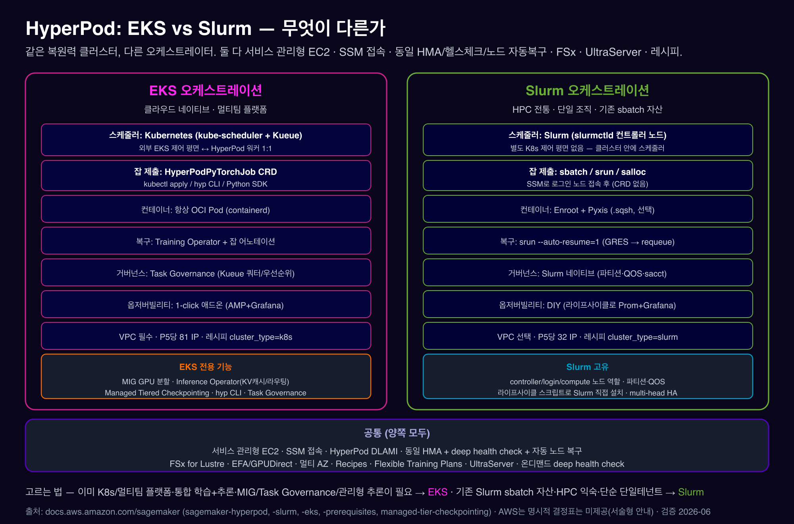

# 08. EKS vs Slurm — 오케스트레이터 결정 가이드

***

### 0. TL;DR

1. **같은 복원력 클러스터, 다른 오케스트레이터.** 둘 다 서비스 관리형 EC2·SSM 접속·동일 HMA/deep health check/자동 노드 복구·FSx·Recipes·UltraServer·Flexible Training Plans를 공유합니다.
2. **EKS** = 쿠버네티스 스케줄러, CRD/kubectl, 클라우드 네이티브·멀티팀 플랫폼, 통합 학습+추론. **Slurm** = HPC 전통 스케줄러, sbatch/srun, 단일 조직·기존 sbatch 자산.
3. **EKS 전용 기능이 결정적**일 때가 많음: **MIG · Inference Operator(KV캐시/라우팅) · Managed Tiered Checkpointing · Task Governance · `hyp` CLI · flexible instance groups** — 이게 필요하면 EKS.
4. **Recipes는 양쪽** 지원(`cluster_type` 전환)이라 레시피 학습 자체는 결정 요인이 아님(단 Slurm은 LLMFT만).

***

### 1. 한눈에 비교

<figure><figcaption></figcaption></figure>

| 축        | **EKS**                                          | **Slurm**                             |
| -------- | ------------------------------------------------ | ------------------------------------- |
| 스케줄러     | Kubernetes (kube-scheduler + Kueue)              | Slurm (`slurmctld` 컨트롤러 노드)           |
| 제어 평면    | 외부 EKS(AWS 관리) ↔ HyperPod 워커 1:1                 | 클러스터 안 controller 노드가 곧 스케줄러          |
| 노드 역할    | 워커 노드만                                           | Controller / Login / Compute          |
| 잡 제출     | `HyperPodPyTorchJob` CRD · kubectl · `hyp` · SDK | `sbatch`/`srun`/`salloc` (SSM 접속 후)   |
| 클러스터 CLI | `hyp` + kubectl + CloudFormation                 | `aws sagemaker`(boto3)                |
| 컨테이너     | 항상 OCI Pod (containerd)                          | Enroot+Pyxis (.sqsh, **선택**)          |
| 잡 복구     | Training Operator + 어노테이션 (프로세스 단위)              | `srun --auto-resume=1` (GRES→requeue) |
| 거버넌스     | **Task Governance**(Kueue: 쿼터·우선순위·대여)           | Slurm 네이티브(파티션·QOS·`sacct`)           |
| 옵저버빌리티   | **1-click 애드온**(AMP+Grafana)                     | **DIY**(라이프사이클로 Prom+Grafana)         |
| 체크포인트 가속 | **Managed Tiered Checkpointing**                 | 직접 구현(`/fsx` + S3 DRA)                |
| VPC      | 필수                                               | 선택                                    |
| IP/P5    | \~81                                             | \~32                                  |
| Recipes  | `cluster_type=k8s` (전체)                          | `cluster_type=slurm` (**LLMFT만**)     |
| 공유 FS    | FSx via CSI/PVC                                  | FSx `/fsx`(하드코딩)                      |

***

### 2. EKS 전용 기능 매트릭스 (가장 중요)

> 이게 결정의 핵심입니다. 아래는 **EKS에만** 있고 Slurm엔 **없습니다**(2026-06 검증):

| EKS 전용 기능                        | 무엇                                                                      | Slurm 대안                                            |
| -------------------------------- | ----------------------------------------------------------------------- | --------------------------------------------------- |
| **NVIDIA MIG GPU 분할**            | GPU 1장을 격리 조각으로(추론·인터랙티브 밀집)                                            | 없음                                                  |
| **Inference Operator**           | JumpStart/S3/FSx 서빙·KEDA+Karpenter·**2단 KV캐시·지능형 라우팅**·멀티 인스턴스 failover | 없음(서빙은 별도 구성)                                       |
| **Managed Tiered Checkpointing** | CPU-RAM tier + peer 복제 + S3 (DCP)                                       | 직접 구현(06)                                           |
| **Task Governance (Kueue)**      | 팀별 쿼터·우선순위·유휴 대여·선점·대시보드                                                | Slurm 파티션·QOS·fair-share                            |
| **`hyp` CLI / Python SDK**       | 통합 CLI·CRD 제출·cluster-stack                                             | `aws sagemaker`(boto3) + Slurm 명령                   |
| **Flexible instance groups**     | `InstanceRequirements` 우선순위 타입 목록                                       | (Slurm은 continuous provisioning + MinInstanceCount) |

**양쪽 공통**(어느 쪽을 골라도 받음): 복원력 클러스터·HMA·deep health check·자동 노드 복구·온디맨드 deep health check·FSx·EFA/GPUDirect·멀티 AZ·**Recipes**·UltraServer·Flexible Training Plans·CloudFormation/Terraform·SSM 접속·DLAMI.

출처: [MIG(EKS 전용)](https://docs.aws.amazon.com/sagemaker/latest/dg/sagemaker-hyperpod-eks-gpu-partitioning.html) · [모델 배포(Inference Operator, EKS)](https://docs.aws.amazon.com/sagemaker/latest/dg/sagemaker-hyperpod-model-deployment.html) · [Managed Tiered Checkpointing(EKS)](https://docs.aws.amazon.com/sagemaker/latest/dg/managed-tier-checkpointing.html) · [Task Governance(EKS)](https://docs.aws.amazon.com/sagemaker/latest/dg/sagemaker-hyperpod-eks-operate-console-ui-governance.html)

***

### 3. 누가 무엇을 골라야 하나 (의사결정)

**EKS를 고르세요 — 다음에 해당하면**

* 이미 **쿠버네티스/EKS를 운영**하거나 **멀티팀 공유 플랫폼**(GitOps/Helm, ML 외 워크로드와 클러스터 공유)을 원함.
* **학습 + 추론을 한 클러스터에** 통합하고 싶음(Inference Operator·KV캐시·지능형 라우팅).
* **MIG GPU 분할**, **Task Governance**(팀 쿼터·선점), **Managed Tiered Checkpointing** 중 하나라도 필요.
* `hyp`/kubectl/CRD 기반의 선언형·자동화 워크플로 선호.

**Slurm을 고르세요 — 다음에 해당하면**

* **기존 Slurm sbatch 자산**이 있고 그대로 lift-and-shift 하고 싶음.
* 팀이 **HPC/배치 스케줄러에 익숙**(srun/sbatch/sacct).
* **단일 테넌트**의 단순한 대규모 학습 — 쿠버네티스를 운영하고 싶지 않음.
* 위 EKS 전용 기능이 필요 없음.

> **Recipes는 결정 요인이 아님**: 같은 레시피를 `cluster_type` 전환으로 양쪽에서 실행. (단 Slurm은 LLMFT만, VERL/GRPO는 EKS/SMTJ.)

***

### 4. 마이그레이션 관점

* 오케스트레이터는 클러스터 생성 시 `Orchestrator`로 정해지며 **한 클러스터에서 바꿀 수 없습니다**(EKS↔Slurm 전환 = 새 클러스터).
* 그러나 **Recipes·데이터(`/fsx`/S3)·컨테이너 이미지는 재사용** 가능해, 레시피 기반이면 이전 비용이 낮습니다.
* 자매 가이드 HyperPod on EKS에 EKS 쪽 전체 문서가 있습니다.

***

### 5. 출처 정리 (라이브 검증 2026-06)

| 주제                                 | URL                                                                                                       |
| ---------------------------------- | --------------------------------------------------------------------------------------------------------- |
| HyperPod 개요(오케스트레이터 옵션)            | https://docs.aws.amazon.com/sagemaker/latest/dg/sagemaker-hyperpod.html                                   |
| Slurm 오케스트레이션                      | https://docs.aws.amazon.com/sagemaker/latest/dg/sagemaker-hyperpod-slurm.html                             |
| EKS 오케스트레이션                        | https://docs.aws.amazon.com/sagemaker/latest/dg/sagemaker-hyperpod-eks.html                               |
| 전제조건(Slurm vs EKS)                 | https://docs.aws.amazon.com/sagemaker/latest/dg/sagemaker-hyperpod-prerequisites.html                     |
| MIG (EKS 전용)                       | https://docs.aws.amazon.com/sagemaker/latest/dg/sagemaker-hyperpod-eks-gpu-partitioning.html              |
| 모델 배포/Inference Operator (EKS)     | https://docs.aws.amazon.com/sagemaker/latest/dg/sagemaker-hyperpod-model-deployment.html                  |
| Managed Tiered Checkpointing (EKS) | https://docs.aws.amazon.com/sagemaker/latest/dg/managed-tier-checkpointing.html                           |
| Task Governance (EKS)              | https://docs.aws.amazon.com/sagemaker/latest/dg/sagemaker-hyperpod-eks-operate-console-ui-governance.html |
