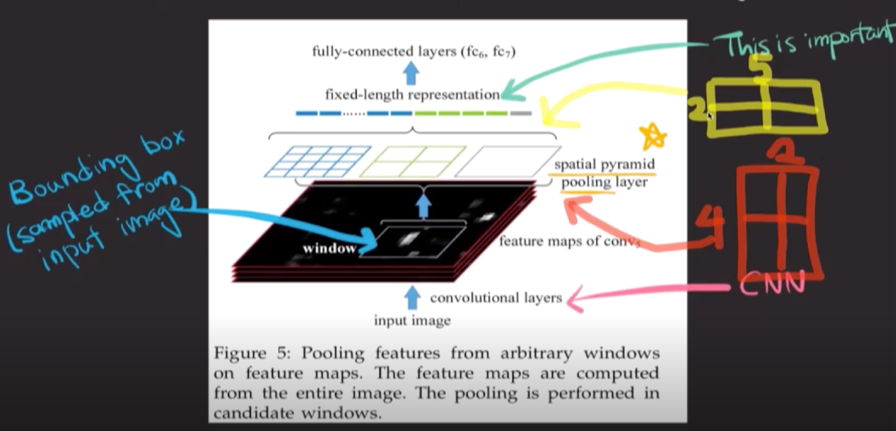
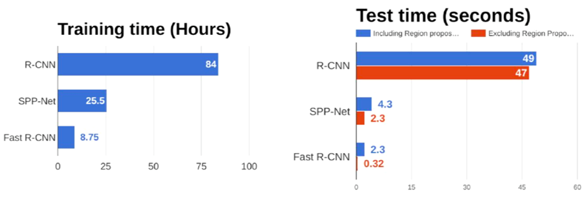
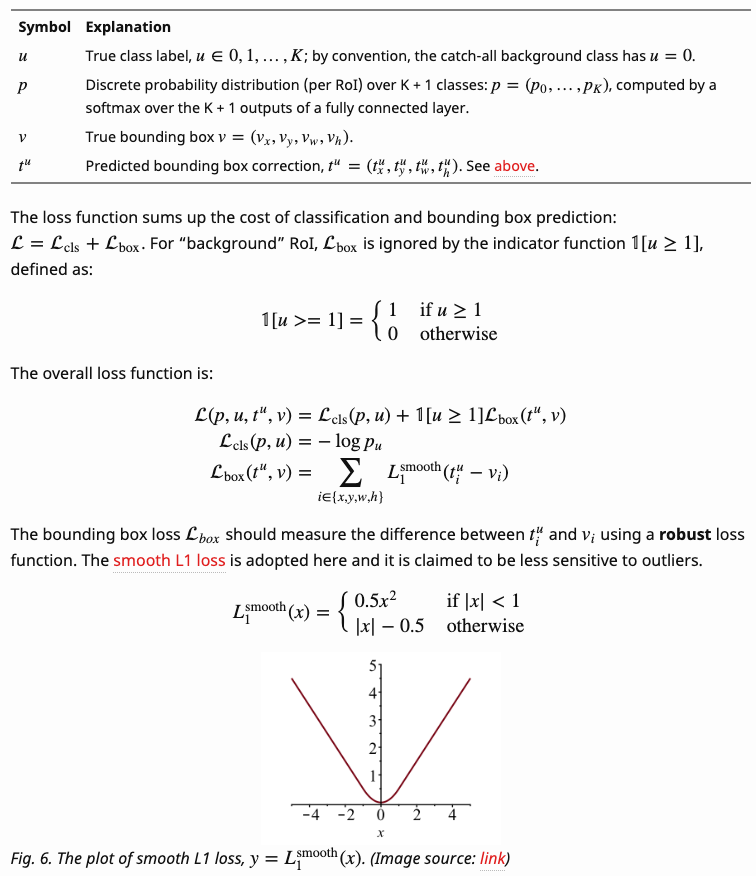

# Fast R-CNN

## 1. SPP\(Spatial Pyramid Pooling\) Net

* CNN을 이미지에 2천번 돌리는 대신 한 번만 돌림. Bounding Box는 기존과 동일한 방법\(Selective Search\)으로 검출
  * Convolutional Feature Map에서 각 bounding box를 매핑하여 feature vector 생성
  * CNN은 input size가 동일해야 하는데\(fixed input size\) 어떻게?
  * SPP로 Fixed-length representation을 찾을 수 있음; 즉, 리전의 사이즈와 상관없이 동일한 크기의 vector를 얻을 수 있음.

* 논문 발표 당시는 AlexNet과 ZFNet이 대세였기 때문에 논문에서 제시된 네트워크 구조는 이를 기반으로 하고 있음

### Disadvantages

* 모델 성능이 상대적으로 떨어짐
* mis-alignment 발생으로 정보 손실 \(예: 2x5 feature map을 2x2 bin으로 나누려면?\)

## 2. Fast R-CNN

SPPNet과 거의 유사하나 Spatial Pyramid Pooling 대신 ROI Pooling을 사용하고, Multi-task Loss를 기반으로 동시에 두 가지 task 학습

### Algorithm

* 피라미드 대신 미리 정해준 ROI\(Regions of Interest\) feature size만 사용: SPP의 special case \(i.e. single-level SPP\)

* Fixed-length representation vector를 FCN에 넣고 2개의 문제에 대한 output을 예측
  * k+1 class 스코어 + Bounding Box 위치 → Log loss + smooth L1 loss \(multi-task loss\)
* R-CNN보다 약 160배 빠름 → real-time까지는 아니지만 VGA급 영상 기준으로 2~3frame/sec 까지 개선

### Loss Function

* Smooth L1: L1과 동일하지만, error의 값이 충분히 작을 경우 거의 맞는 것으로 판단하기에 outlier에 덜 민감하고 loss값은 더 빠른 속도로 줄어듦

Source: [https://lilianweng.github.io/lil-log/2017/12/31/object-recognition-for-dummies-part-3.html](https://lilianweng.github.io/lil-log/2017/12/31/object-recognition-for-dummies-part-3.html)

### Disadvantages

* 여전히 Region Proposal을 CNN이 아닌 Selective Search로 수행하기에 병목 발생

## References

* Paper
  * [https://arxiv.org/abs/1504.08083](https://arxiv.org/abs/1504.08083)
* Blog
  * [https://blog.naver.com/laonple/220731472214](https://blog.naver.com/laonple/220731472214)
  * [https://blog.naver.com/laonple/220776743537](https://blog.naver.com/laonple/220776743537)
  * [https://blog.athelas.com/a-brief-history-of-cnns-in-image-segmentation-from-r-cnn-to-mask-r-cnn-34ea83205de4?gi=df6cb954eb28](https://blog.athelas.com/a-brief-history-of-cnns-in-image-segmentation-from-r-cnn-to-mask-r-cnn-34ea83205de4?gi=df6cb954eb28)
  * [https://lilianweng.github.io/lil-log/2017/12/31/object-recognition-for-dummies-part-3.html](https://lilianweng.github.io/lil-log/2017/12/31/object-recognition-for-dummies-part-3.html)
  * [https://jhui.github.io/2017/03/15/Fast-R-CNN-and-Faster-R-CNN/](https://jhui.github.io/2017/03/15/Fast-R-CNN-and-Faster-R-CNN/)
* Video Clip
  * [https://www.edwith.org/deeplearningchoi/lecture/15568/](https://www.edwith.org/deeplearningchoi/lecture/15568/)

