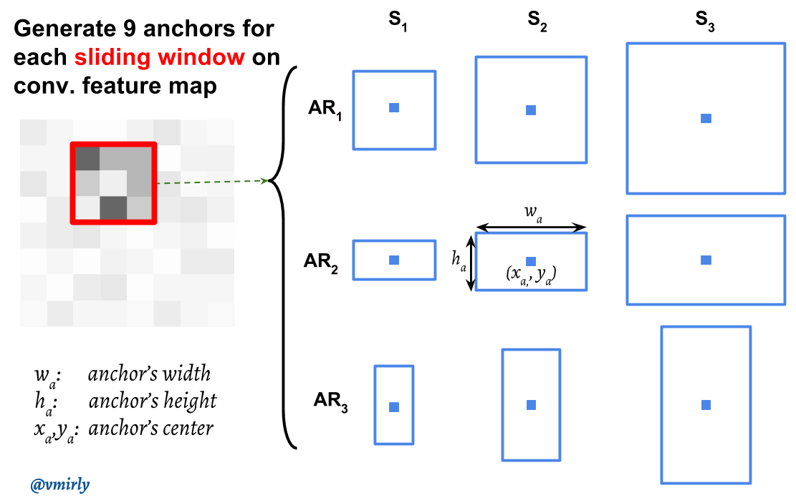
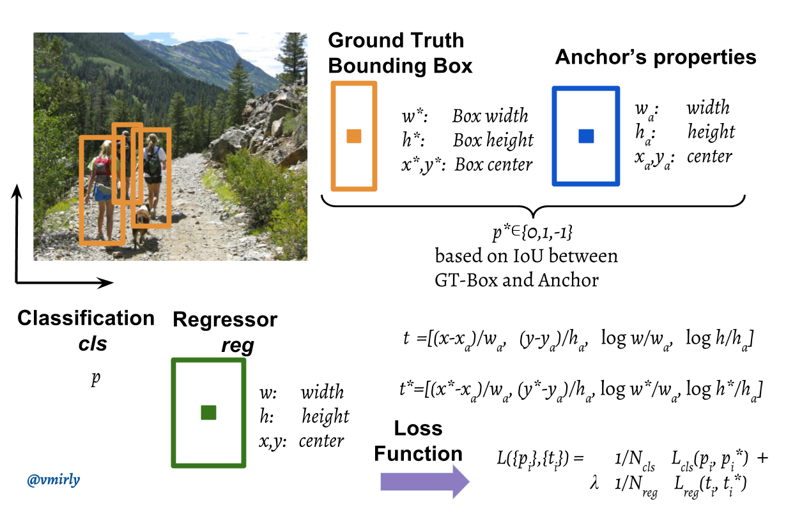
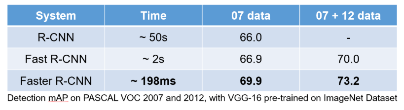

# Faster R-CNN

## 1. Region Proposal Network\(RPN\)

### Idea

* 피라미드를 이미지에 대해서 적용하는 대신 필터에 대해서 적용해 보면 어떨까? \(pyramids of filters\)
* 필터 개수가 너무 많으니 몇 개의 pre-defined Bounding Box를 필터로 적용해 보면 어떨까? \(pyramid of anchors\)
* 대충 Bounding Box가 특정 모양이라고 가정하고 이 Bounding Box를 어떻게 조절해야 ground truth  Bounding Box로 바꿀 수 있는지 offset을 바꾸면 어떨까?

## 2. Algorithm

### Training

* Window를 Conv feature map 위에서 sliding 시키면서, 각 sliding window의 중심에서 여러 영역\(anchor\)들을 동시 예측; 각 anchor당 score 2개 및 bounding box offset 4개 출력
  * Score: 해당 위치에 bounding box가 있는지
  * Bounding Box offset
* 예: Conv feature map이 32x32x512 채널이라 가정 \(VGG16 적용 기준\)

* 3x3 conv를 256/512 채널로 수행 → intermediate layer
* 1024\(32x32\)개의 pixel들에 대해 각 pixel을 center 기준으로 하여 총 _k_개의 anchor box 결정
  * Anchor box는 1:1, 2:1, 1:2의 종횡비\(aspect ratio\)와 3개의 box area\(128^2, 256^2, 512^2\)의 조합으로 9개가 default
  * Anchor box가 9개라면 1024x9 = 9216개의 Bounding Box

* Classification과 Bounding Box Regression을 위해 1x1 conv 수행
* Output dim은 1개의 픽셀에 대해 18\(2x9\) + 36\(4x9\) = 54
  * 6 = 2+4 \(2는 box class; _cls_ layer, 4는 box 위치; _reg_ layer\)
  * 9 = _k_ = anchor 개수
* Classification을 통해 얻은 object일 확률 값을 정렬한 다음, 높은 순으로 K개의 anchor만 선택
* K개의 anchor들에 각각 Bounding box regression 적용 후 Non-Maximum-Suppression을 적용하여 ROI 산출

### Non-Maximum Suppression

* 상기 과정대로 학습 후 그대로 예측하면 너무 많은 bounding box가 잡히므로 ROI 점수가 가장 높은 proposal과 다른 proposal의 overlapping을 비교하여 IoU가 threshold\(0.6~0.9\)보다 높은 proposal들을 제거

### Loss Function

#### Classifier of Background and Foreground

* 2가지 경우에 대해 positive class\(+1\) 부여
  1. 가장 높은 IoU를 가지고 있는 anchor \(아주 드물게 object를 잡아내지 못하는 경우가 있음\)
  2. Ground Truth Bounding Box와 IoU 가 0.7 이상인 모든 anchor
* IoU가 0.3보다 작은 anchor에 대해 negative class\(-1\) 부여
* 그 외에는 모두 0 부여

$$
p^* = \begin{cases} 1 & \text{if } IoU \gt 0.7 \\ -1 & \text{if } IoU \lt 0.3 \\ 0 & \text{if otherwise} \end{cases}
$$

#### Bounding Box Regression

* Predicted coordinates
* Ground truth coordinates

$$
t_x = (x - x_a) / w_a \\ t_y = (y - y_a) / h_a \\ t_w = \log(w/w_a) \\ t_h = \log(h/h_a)
$$

$$
t^*_x = (x^* - x_a) / w_a \\ t^*_y = (y^* - y_a) / h_a \\ t^*_w = \log(w^*/w_a) \\ t^*_h = \log(h^*/h_a)
$$

* $$x,y,w,h$$: predicted box

  $$x_a, y_a, w_a, h_a$$:  anchor box

  $$x^∗, y^∗, w^∗, h^∗$$: ground-truth box

#### Summary

* Smooth L1은 $$p^*_i = 1$$일 때만 적용됨.
* 하나의 input image에서 랜덤으로 256개\(mini-batch size\)의 anchor 샘플링
  * 샘플링 시 positive anchors\(객체\)와 negative anchors\(배경\)의 비율은 1:1
  * 1:1 비율 유지가 어려운 경우가 많을 때는 zero-padding

$$
L(\{p_i\}, \{t_i\}) = \frac{1}{N_{cls}} \sum_i L_{cls} (p_i, p^*_i) + \lambda \frac{1}{N_{reg}} \sum_i p^*_i L_{reg} (t_i, t^*_i)
$$

### Advantages

* Prediction 수행 시 R-CNN 대비 약 10배 빠름

## References

* Paper
  * [https://arxiv.org/abs/1506.01497](https://arxiv.org/abs/1506.01497)
* Blog
  * [https://blog.naver.com/laonple/220782324594](https://blog.naver.com/laonple/220782324594)
  * [https://blog.athelas.com/a-brief-history-of-cnns-in-image-segmentation-from-r-cnn-to-mask-r-cnn-34ea83205de4?gi=df6cb954eb28](https://blog.athelas.com/a-brief-history-of-cnns-in-image-segmentation-from-r-cnn-to-mask-r-cnn-34ea83205de4?gi=df6cb954eb28)
  * [https://lilianweng.github.io/lil-log/2017/12/31/object-recognition-for-dummies-part-3.html](https://lilianweng.github.io/lil-log/2017/12/31/object-recognition-for-dummies-part-3.html)
  * [https://www.quora.com/How-does-the-region-proposal-network-RPN-in-Faster-R-CNN-work/answer/Vahid-Mirjalili-1?share=c6257906](https://www.quora.com/How-does-the-region-proposal-network-RPN-in-Faster-R-CNN-work/answer/Vahid-Mirjalili-1?share=c6257906)
  * [https://jhui.github.io/2017/03/15/Fast-R-CNN-and-Faster-R-CNN/](https://jhui.github.io/2017/03/15/Fast-R-CNN-and-Faster-R-CNN/)
* Video Clip
  * [https://www.edwith.org/deeplearningchoi/lecture/15568/](https://www.edwith.org/deeplearningchoi/lecture/15568/)

