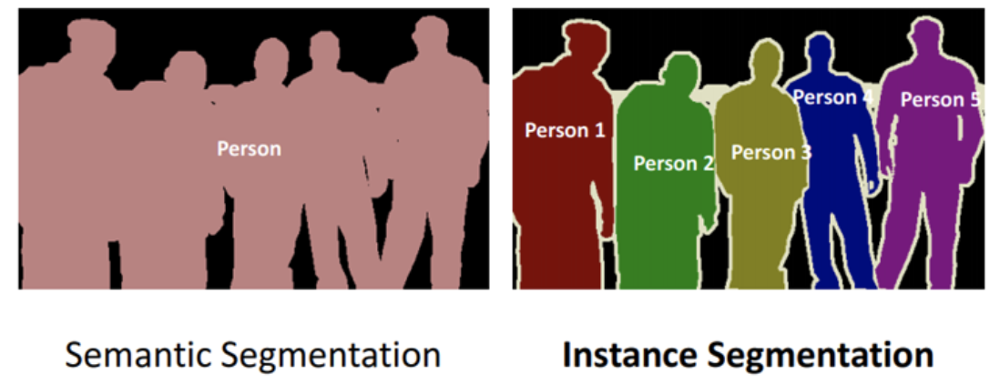
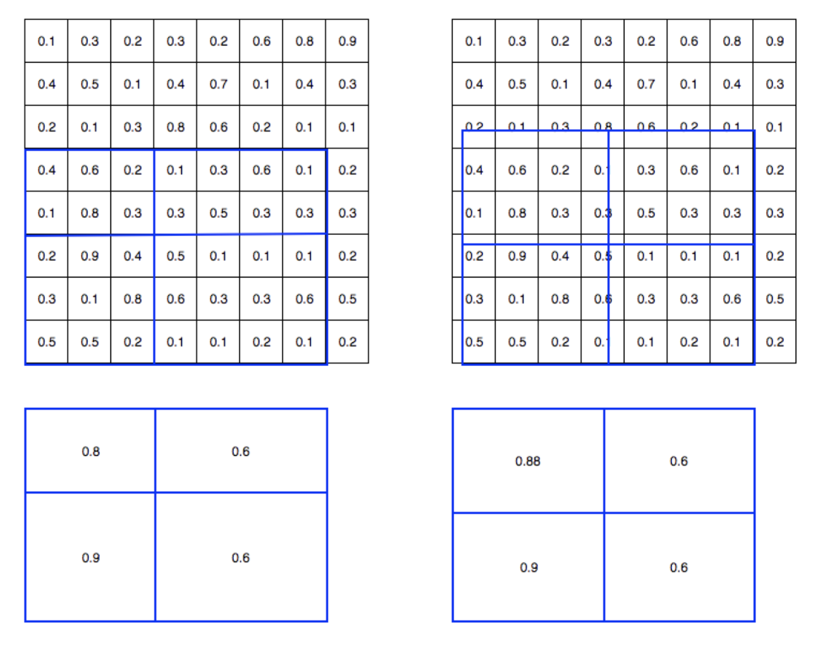
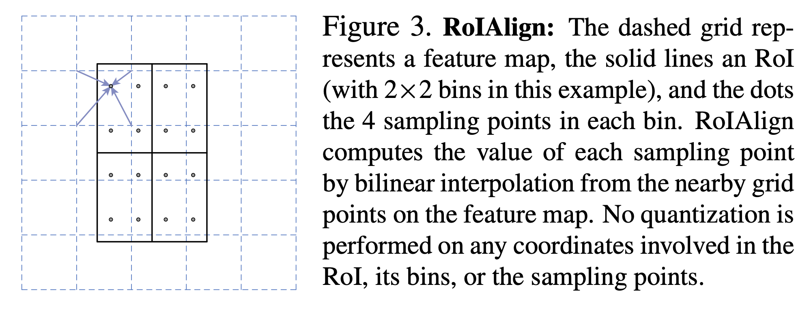
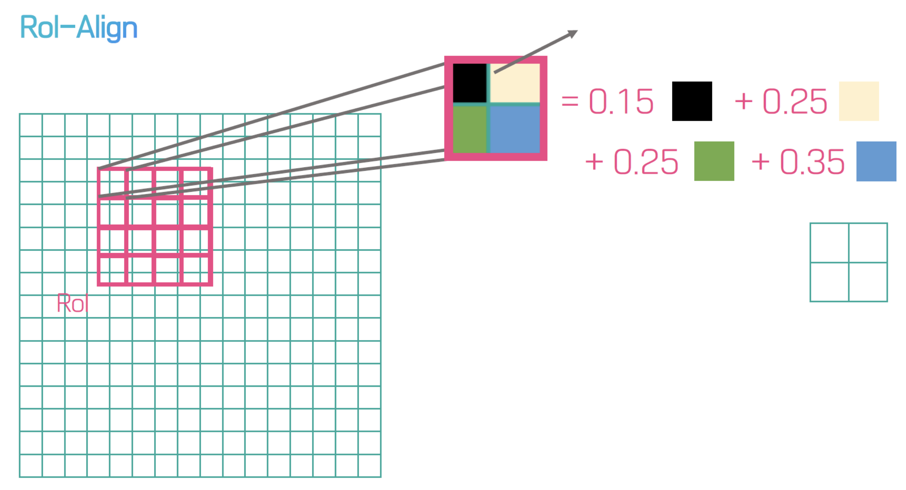
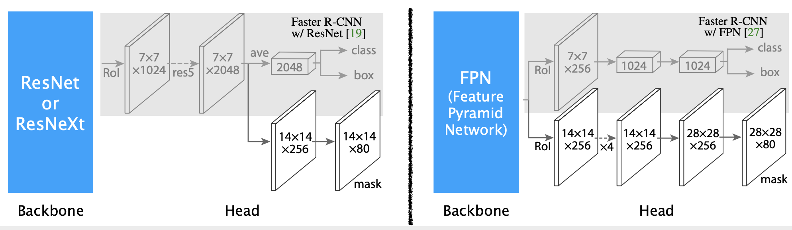
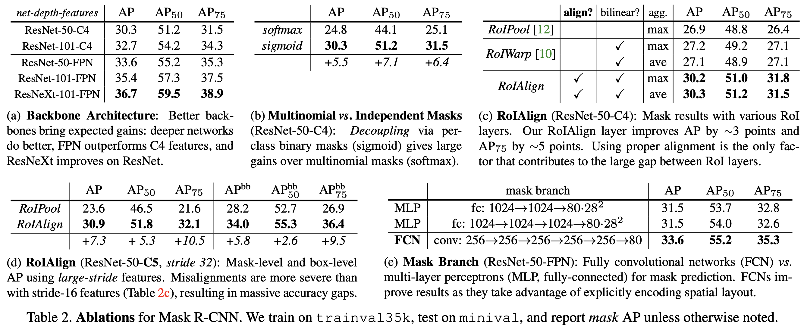

# Mask R-CNN

## 1. Overview

### Contribution

* COCO 2016에서 우승, Instance Segmentation의 baseline
* FC layer를 사용하지 않고 Fully Convolutional Network만 사용하기 때문에 input image size의 제약이 없고 translation-equivariant가 유지됨. 또한, RoIAlign을 사용하여 정확한 spatial location을 유지하므로 misalignment가 없음

### Instance Segmentation

* semantic segmentation은 각각의 클래스만 bounding box 대신 pixel 단위로 구별하는 것이고, instance segmentation은 각 클래스 내에서 검출된 여러 개의 instnace를 구분함 \(예: Person 1, ..., Person 5\)

* Object detection 뿐 아니라 각 클래스별로 segmentation까지 해 보겠다는 것이 목표
* Main idea: Classification 및 Bounding Box regression은 Faster R-CNN에게 맡기고 각 bounding box에 mask만 씌워 주면 instance segmentation이 가능함 → Faster R-CNN + FCN

### FCN과의 차이

* FCN은 pixel-level classification이지만, classification은 Faster R-CNN이 대신 해줌
* FCN은 모든 픽셀에 대한 softmax \(per-pixel softmax\)  및 multinomial cross entropy loss 필요 → classification과 segmentation이 decoupling되지 않음. 즉, 다른 클래스를 고려하면서 mask도 훈련해야 함
* Mask R-CNN은 per-pixel sigmoid과 binary loss로 대체 가능 → classification과 segmentation이 decoupling됨 → 다른 클래스 고려 없이 binary mask만 예측하면 되므로 성능이 향상됨
* Multi-task loss로 간단히 정의 가능; $$L = L_{cls} + L_{box} + L_{mask}$$
  * 실제로는 정답인 클래스의 마스크만 학습에 훈련에 사용하므로 $$L_{mask}$$ 텀이 훈련에 큰 짐이 되지 않음
  * 예: $$L_{mask} = L_{사람} + L_{자동차} + L_{고양이}$$일 때, 자동차 데이터 적용 시에는 $$L_{mask} = L_{자동차}$$만 사용하면 됨

## 2. Network

### RoIAlign

* 기존 RoIPool은 floating 값을 양자화하기 때문에 정보 손실 발생 → classification에는 이러한 misalignment 이 큰 영향을 주지 않으나, pixel 단위로 정확한 mask를 예측하는 데는 좋지 못함
* \[As-Is\] 각 ROI로부터 7x7 small feature map 생성을 위해 stride=16으로 \[x/16\]으로  \(\[.\]: 반올림\) 양자화 수행
* \[To-Be\] x/16으로 그대로 계산하고 각 ROI 영역에 대한 4개의 sample point에 대해 bilinear interpolation 수행
* 왼쪽: RoIPool, 오른쪽 RoIAlign

* RoI에서 얻어내고자 하는 정보는 박스 안의 동그라미 점\(sample point\)으로  각 bin에 4개의 sampling point 존재
* 각 point는 아래 그림의 화살표로 표현된 방법, 즉 bilinear interpolation을 통해 산출

### Architecture

* ResNet-50/101, FPN\(Feature Pyramid Network\), ResNeXt-50/101 을 backbone 아키텍처로 사용

## 3. Experiments

* Dataset: MS COCO \(80 classes, 80K 훈련 데이터셋, 3K 검증 데이터셋, 5K 테스트 데이터셋\)
* Metric: AP\(Average Precision\), AP at IOU 0.5, 0.75
* 이미지 사이즈는 width, height 중 더 작은 쪽을 800 pixel로 resize
* 8 GPUS for 160k iterations w/ 16 minibatches
  * ResNet-50-FPN 적용 시 훈련에 약 32시간 소요 \(0.72s per 16 image mini batch\)
  * ResNet-101-FPN 적용 시 훈련에 약 44시간 소요
* Learning rate: 0.02, 120k iteration에서 10%씩 감소
* Weight decay 0.0001, Momentum: 0.9

* \(a\): Backbone 네트워크 깊이가 깊을 수록 더 좋음
* \(b\): softmax+multinomial loss보다 sigmoid+binary loss가 더 좋음
* \(c\): RoIAlign이 좋음
* \(d\): misalignment로 인한 AP 차이를 상세 비교 \(RoIPool vs. RoIAlign\)
* \(e\): MLP\(or FC\) 보다 FCN으로 네트워크를 쌓는 것이 더 좋음

## References

* Paper
  * [https://arxiv.org/pdf/1703.06870.pdf](https://arxiv.org/pdf/1703.06870.pdf)
* Blog
  * [https://medium.com/@tibastar/mask-r-cnn-d69aa596761f](https://medium.com/@tibastar/mask-r-cnn-d69aa596761f)
  * [https://medium.com/@alittlepain833/simple-understanding-of-mask-rcnn-134b5b330e95](https://medium.com/@alittlepain833/simple-understanding-of-mask-rcnn-134b5b330e95)
  * [https://medium.com/@jonathan\_hui/image-segmentation-with-mask-r-cnn-ebe6d793272](https://medium.com/@jonathan_hui/image-segmentation-with-mask-r-cnn-ebe6d793272)
  * [https://arclab.tistory.com/220](https://arclab.tistory.com/220)

