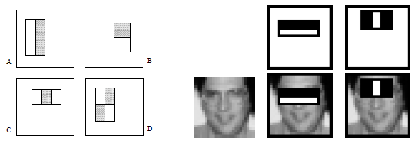
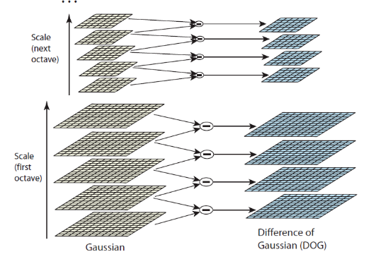
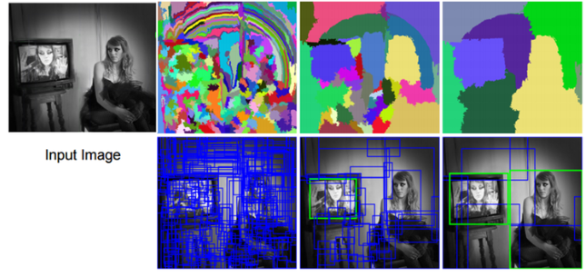
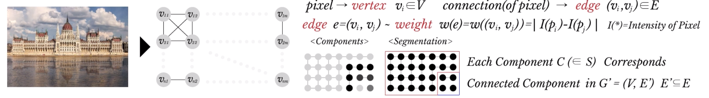
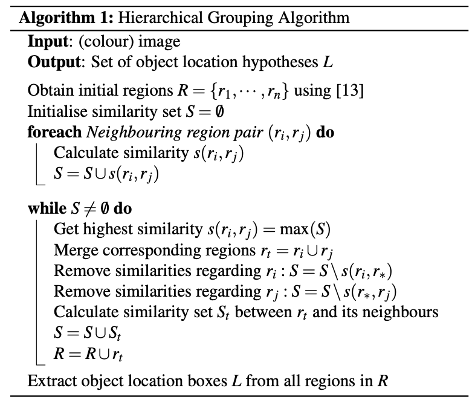
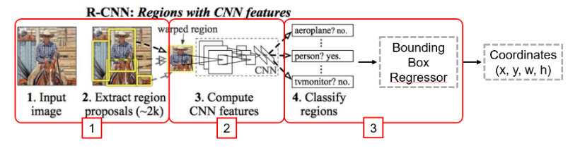

# R-CNN\(Regions with Convolutional Neuron Networks\)

## 1. Background

### Object Detection의 전설적인 논문

* Rapid Object Detection using a Boosted Cascade of Simple Features: [https://www.cs.cmu.edu/~efros/courses/LBMV07/Papers/viola-cvpr-01.pdf](https://www.cs.cmu.edu/~efros/courses/LBMV07/Papers/viola-cvpr-01.pdf)
* Distinctive Image Features from Scale-Invariant Keypoints: [https://www.cs.ubc.ca/~lowe/papers/ijcv04.pdf](https://www.cs.ubc.ca/~lowe/papers/ijcv04.pdf)

### Rapid Object Detection using a Boosted Cascade of Simple Features: 

* Haar-like features: Integral image로 수많은 Haar-like feature를 window size에 관계 없이 O\(1\)로 계산

* Adaboost: 여러 개의 Haar-like feature들 중 분별력이 높은 feature를 약분류기로 지정 후 이들을 조합하여 강분류기 생성\(상대적으로 간단한 강분류기와 복잡한 강분류기들로 나누어짐\)
* Cascade: 강분류기들을 sliding 시키면서 Object일 것 같은 영역에는 더 복잡한 강분류기를 통과시키고 Object가 아닐 확률이 높은 영역에는 skip

### SIFT\(Scale-Invariant Feature Transform\)

#### Scale invariance

* DoG\(Difference of Gaussian: Pyramid 이미지\(i.e., Scale space\)를 생성 후 각 scale에 DoG을 계산
* [https://www.youtube.com/watch?v=-MQHlnk5GOU&pbjreload=10](https://www.youtube.com/watch?v=-MQHlnk5GOU&pbjreload=10)
* Keypoint localization: 현재 scale 기준 DoG에서 전/후 scale DoG를 참조해 극소값/극대값으로 초기 keypoint 계산 후 gradient가 일정 값보다 작은 keypoint 제거

#### Rotation invariance

* Orientation Assignment: 각 keypoint에 방향 할당
* Keypoint Descriptor: keypoint 주변의 변화에 대한 경향을 파악하기 위해 keypoint 주변의 영상 패리를 4x4 block으로 분할 후, 16x16 sub-block\(i.e., cell\) 내 픽셀들의 gradient의 방향\(orientation\)과 크기\(magnitude\)에 대한 히스토그램을 계산 후 이를 128차원 벡터로 변환

### HOG\(Histogram of Oriented Gradient\)

* 64x128 윈도우를 슬라이딩하면서 입력 영상을 block과 cell로 분할
* 각 cell내 픽셀들의 gradient 방향\(orientation\)을 계산 후, 이를 기반으로 Local 히스토그램\(x축: 0~180도 degree\) 생성
* 히스토그램을 이어붙여 최종 HOG Feature 생성

## 2. Selective Search

### Overview

* Felzenszwalb가 제안한 Graph-based Image segmentation으로 작은 크기의 초기 영역들을 설정하고, Hierarchical Grouping Algorithm으로 작은 영역을 큰 영역으로 병합

### Graph-Based Image Segmentation

* 두 영역 C1과 C2가 있을 때, 영역 병합 여부를 아래와 같이 판단

* 입력 영상에 대해 초기 segmentation 수행 후 인접하는 모든 영역들 간의 유사도 계산
* Greedy 알고리즘으로 비슷한 영역을 반복적으로 후보 영역들 통합
  * 가장 높은 유사도를 갖는 2개의 영역 병합
  * 병합된 영역에 대해 다시 유사도를 구하고 새롭게 구해진 영역은 리스트에 추가 \(color, texture, size, fill 등 4가지 척도로 유사도 계산\)

### Hierarchical Grouping Algorithm

* 모든 영역에 대해 유사도를 계산하여 유사도 셋 S\(similarity set\) 생성
* S가 공집합이 아닐 때까지 아래 과정들을 반복
  * S에서 가장 큰 유사도 값을 가진 영역 ri, rj 병합
  * ri, rj의 유사도 값은 S로부터 제거
  * 통합된 새로운 영역\(rt\)과 인접한 영역들에 대해 유사도\(St\) 계산
  * S와 R에 유사도\(St\)와 통합된 새로운 영역\(rt\) 추가

## 3. Algorithm

### Overview

* Sliding window 방식의 비효율성을 개선하기 위해서, 입력 영상에서 ‘**물체가 있을 법한**’ 영역을 빠른 속도로 찾아내는 기법
* Region proposal을 활용하면, sliding window 방식에 비해 search space가 확연하게 줄어들기 때문에 훨씬 빠른 속도로 object detection 수행 가능 
  * 1. 입력 이미지로부터 Selective Search를 활용하여 약 2000개 가량의 region proposal을 추출함 \(i.e. Bounding Box\) 
  * 2. 각 region proposal 영역을 이미지로부터 잘라내고\(cropping\) 동일한 크기로 만든 후\(warping\), CNN을 활용해 feature 추출 
  * 3. 각 region proposal feature에 대한 classification을 SVM\(Support Vector Machine\)으로 수행
    * SVM은 이후 softmax로 대체됨 
  * 4. 사전에 준비한 정답 Bounding Box의 IoU\(Intersection over Union\) 계산
  * 5. IoU가 특정 값 이상\(≥0.5\)이 되도록 Bounding Box 크기 조정
    * CNN은 positional invariance로 인해 어느 정도 box가 어긋나도 높은 classification score를 산출하므로, object의 정확한 위치를 잡아내려면 이를 미세 조정\(fine-tuning\)해 주어야 함

### Disadvantages

* R-CNN은 이미지 1장 당 region proposal의 개수만큼 CNN 연산 필요 \(2천개의 CNN를 모두 돌림 → real-time 불가\)
  * PASCAL VOC07 학습 데이터 **5천장**에 Tesla K40으로 약 **84시간** 소요, 모델 크기도 수백 기가에 달함
  * Prediction 시는 1장의 영상에 수십 초 소요
* 3개의 모델을 학습하므로 pipeline이 복잡함 \(Selective Search, CNN 2천여번, SVM, Regression\)

## References

* Paper
  * [http://www.huppelen.nl/publications/selectiveSearchDraft.pdf](http://www.huppelen.nl/publications/selectiveSearchDraft.pdf)
  * [https://arxiv.org/abs/1311.2524](https://arxiv.org/abs/1311.2524)
* Blog
  * [https://blog.naver.com/laonple/220731472214](https://blog.naver.com/laonple/220731472214)
  * [https://blog.athelas.com/a-brief-history-of-cnns-in-image-segmentation-from-r-cnn-to-mask-r-cnn-34ea83205de4?gi=df6cb954eb28](https://blog.athelas.com/a-brief-history-of-cnns-in-image-segmentation-from-r-cnn-to-mask-r-cnn-34ea83205de4?gi=df6cb954eb28)
* Video Clip
  * [https://www.edwith.org/deeplearningchoi/lecture/15568/](https://www.edwith.org/deeplearningchoi/lecture/15568/)

