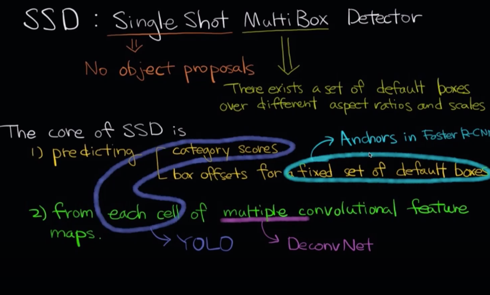
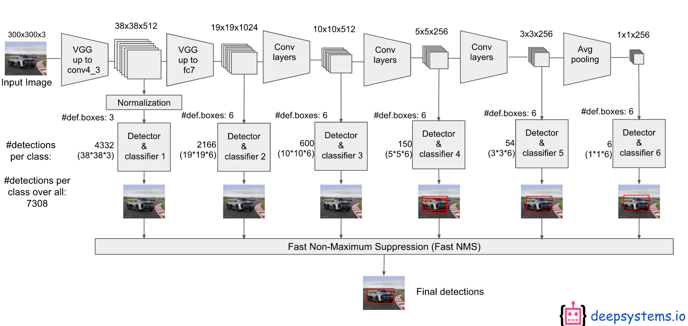
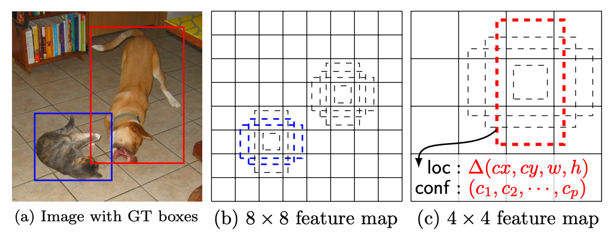

# SSD \(Single Shot Multibox Detector\)

## 1. Background

* Low Recall → Bounding box가 너무 적고 1개의 grid cell은 1개의 bounding만 포함한다는 강력한 가정으로 인해 object 검출을 많이 하지 못함
* Localization 부정확
* YOLO와 Faster R-CNN의 개념을 잘 활용하여 빠른 속도와 high recall을 달성하면서 작은 object의 검출율을 높이는 방법 보완

## 2. Algorithm

### Model Output

* VGG로 pre-trained된 네트워크를 통과하여 38x38x512 feature map 추출
* feature map을 conv로 그 다음 layer로 넘겨주는 동시에 object detection 수행 \(Spatial Pyramid!\) → 6개의 scale에 대한 총 6개의 classifier을 얻음
  * 각 classifier는 38x38, 19x19, 10x10, 5x5, 3x3, 1x1 feature map에서 계산
  * 큰 feature map에서는 작은 object를 검출하고, 작은 feature map에서는 큰 object 검출
  * 이는 YOLO와의 가장 큰 차이점! \(Recall: YOLO는 7x7 grid 하나만 사용\)
  * 추가로, Class score 계산 시, 배경 유무를 판별하는 정보를 같이 넣기 때문에 YOLO의 20개 파라메터가 아닌 21개의 파라메터임
* 각 classifier마다 grid cell을 나누고, 각각의 cell에서 bounding box와 class score를 n개 예측 \(보통 4개나 6개\) → class당, 총 8732개의 bounding box 예측
  * 38384 + 19196 + 10106 + 556 + 334  + 114 = 8732
* Output과 연결된 feature map은 3 x 3 x p 필터로 conv 연산하기에, FCN으로 계산하는 YOLO보다 계산 복잡도가 낮음
* Output은 class 및 category 점수와, default box에 대응되는 offset 예측

### Default Boxes

* Faster R-CNN의 anchor box와 비슷하지만, pre-defined box가 아니라 box 크기와 aspect ratio를 feature map의 scale에 따라 계산
* Default box의 크기\(scale\)를 계산하는 수식

$$
s_k = s_{min} + \frac{s_{max} – s_{min}}{m – 1} (k – 1),\;\; k \in \big[ 1, m \big]
$$

* m: feature map들의 개수
* s\_min = 0.2, s\_max = 0.9
* 각 scale s\_k에 대한 종횡비\(aspect ratio\) 계산 수식
  * w: 가로 크기, h: 세로 크기
  * 5개의 box와 aspect ratio가 1일 경우 1개를 추가해 6개의 default box 생성
  * 집합에서 3, 1/3을 제외하여 4개의 default box만 사용하기도 함

$$
a_r \in \{ 1, 2, 3, \frac{1}{2}, \frac{1}{3} \}, \;\; w^a_k = s_k \sqrt{a_r}, \;\; h^a_k = s_k / \sqrt{a_r} \\ \text{For the aspect ratio of 1, }\;s’_k = \sqrt{s_k s_{k+1}}
$$

### Hard Negative Mining

* Class imbalance: 매칭 단계에서 대부분의 default box들이 object가 아님
* 모든 샘플을 사용하는 대신 각 디폴트 박스에 대하여 confidence loss를 기준으로 정렬 후, negative와 positive의 비율이 3:1이 되도록 가장 좋은 것들 선택.

### Loss Function

* Multibox loss = Confidence Loss + alpha\*Localization loss
  * alpha: Localization loss의 비율 조정
  * N: 매칭된 default box의 수
  * cx, cy, w, h: default box의 offset 및 크기

$$
L(x, c, l, g) = \frac{1}{N} (L_{conf} (x, c) + \alpha L_{loc}(x, l, g))
$$

$$
L_{loc} (x, l, g) = \sum_{i \in Pos}^n \sum_{m \in \{ cx, cy, w h \}} x_{ij}^k \text{smooth}_{\text{L1}} (l_i^m – \hat{g}_j^m) \\ \hat{g}_j^{cx} = (g_j^{cx} – d_i^{cx}) / d_i^w, \hat{g}_j^{cy} = (g_j^{cy} – d_i^{cy}) / d_i^h \\ \hat{g}_j^{w} = \log(\frac{g_j^{w}}{d_i^{w}}),\hat{g}_j^{h} = \log(\frac{g_j^{h}}{d_i^{h}})
$$

$$
L_{conf}(x, c) = – \sum_{i \in Pos}^{N} x_{ij}^p \log(\hat{c}_i^p) – \sum_{i \in Neg} \log(\hat{c}_i^0) \text{ where } \hat{c}^p_i = \frac{\exp(c_i^p)}{\sum_p \exp(c_i^p)}
$$

### Data Augmentation

* 다양한 object size와 ratio에 robust하기 위하여 각각의 image는 random하게 샘플링
  * original image
  * 단순 random sampling
  * 최소 IoU가 0.1, 0.3, 0.5, 0.7, 0.9 인 patch 샘플링
* Random sampling
  * size는 원본에 대해 \[1/10, 2\] 사이의 비율 적용
  * ratio는 {1/2, 2}에서 결정
  * 1/2의 확률로 horizontal flip
  * Sampling된 image는 고정된 size로 변환되어 input으로 사용

### Advantage

* 논문 발표 당시 빠른 속도와 성확한 성능
  * SSD : 72.1% mAP @ 58FPS
  * Faster R-CNN : 73.2% mAP @ 7FPS
  * YOLO : 63.4% mAP @ 45FPS

### Disadvantage

* Default ratio에서 벗어나는 object는 예측이 어려움

## References

* Paper
  * [https://arxiv.org/abs/1512.02325](https://arxiv.org/abs/1512.02325)
* Slide
  * [deepsystems.io](http://deepsystems.io) [https://docs.google.com/presentation/d/1aeRvtKG21KHdD5lg6Hgyhx5rPq\_ZOsGjG5rJ1HP7BbA/pub?start=false&loop=false&delayms=3000&slide=id.p](https://docs.google.com/presentation/d/1rtfeV_VmdGdZD5ObVVpPDPIODSDxKnFSU0bsN_rgZXc/pub?start=false&loop=false&delayms=3000&slide=id.g179f601b72_0_14)
* Blog
  * [https://taeu.github.io/paper/deeplearning-paper-ssd/](https://taeu.github.io/paper/deeplearning-paper-ssd/)
  * [http://www.navisphere.net/4167/ssd-single-shot-multibox-detector/](http://www.navisphere.net/4167/ssd-single-shot-multibox-detector/)
* Video Clip
  * [https://www.edwith.org/deeplearningchoi/lecture/15579/](https://www.edwith.org/deeplearningchoi/lecture/15579/)
  * [https://www.youtube.com/watch?v=8DjIJc7xH5U](https://www.youtube.com/watch?v=8DjIJc7xH5U)

