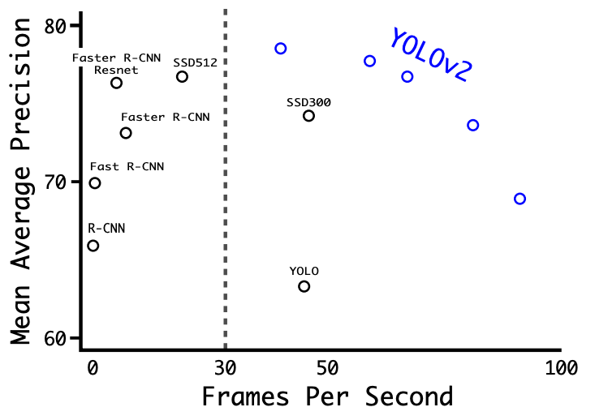
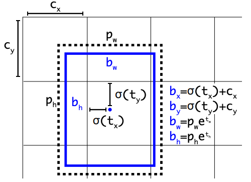
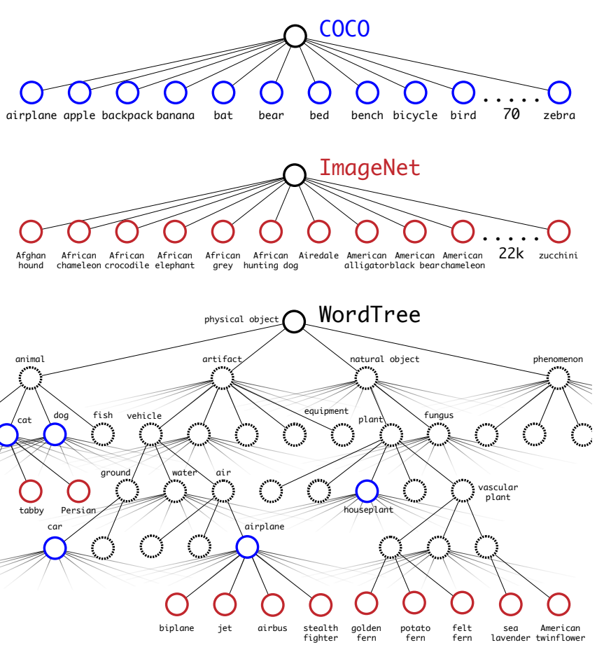

# YOLO v2\(YOLO 9000\) Better, Faster, Stronger

## 1. Background

* YOLO에서 real-time이 가능함을 보여주었지만, recall이 너무 낮고 localization error로 bounding box가 정확하지 않았음. 게다가 속도도 SSD보다 떨어짐.
* 따라서, 성능, 속도 두 마리 토끼를 다 잡아 보는 것이 목표; High FPS\(Frames Per Second\) & mAP\(Mean Average Precision\) → 노가다의 결과
* ImageNet classifcation은 클래스가 1000개이지만, object detection은 클래스가 매우 적음 \(예: 20개\) → 이런 gap을 줄이고 많은 object category를 검출하는 것도 목표

## 2. Algorithm

### Better

* **Batch Normalization**: 모든 conv 레이어에 batch norm 추가 → 2% mAP 향상
* **Convolutional with Anchor Boxes**
  * FCN을 conv으로 대체하고 Feature extractor를 좀 더 좋은 걸로 대체 → Darknet-19
  * 448x448 image에서 416x416으로 조정\(마지막 layer가 홀수 grid를 가지게 하기 위해\)
  * Feature map에서부터 offset을 추정
* **High Resolution Classifier**: ImageNet으로 Pre-training 후, 224x224 대신 448x448 해상도로 10 epoch동안 fine-tuning 수행 → 4% mAP 향상
* **Multi-scale training**: 학습데이터의 크기를 320x320, 352x352, ..., 608x608 로 resize 하면서 다양한 스케일로 학습. 이 때 anchor size는 동일

* **Dimension Clusters**
  * 실제 ground box들의 정보를 k-means로 클러스터링하여 최적의 anchor box 크기\(bounding box의 너비와 높이\)를 찾음
    * 단, distance metric을 euclidian distance를 쓰지 않고 자체 metric 사용

      $$d(box, centroid) = 1 - IoU(box, centroid)$$
  * 또한, anchor box를 9개에서 5개로 줄임
  * 각 Grid cell에서 bounding box를 예측할 때, 각 anchor box의 scale을 얼마나 조정할 것인지 예측
* **Direct location prediction**:  5% mAP 향상
  * Region Proposal 계열 네트워크는 t\_x, t\_y로 box를 이동\(shifting\) → 어느 쪽이나 이동이 가능하기에, 안정적인 offset 학습이 어려움
  * 따라서, bounding box 중심의 절대 좌표를 예측하는 대신, grid cell에 대한 상대 좌표를 예측; \(0,0\) 셀의 왼쪽 위 ~\(1,1\) 셀의 오른쪽 아래 범위까지
  * Bounding box offset 범위를 sigmoid activation으로 0~1 사이가 되도록 제한을 주고, grid cell의 좌측 상단 좌표를 기준으로 bounding box 계산
    * $$b_x, b_y$$: ground truth box의 grid cell 상단 좌표 \(+shifting\)
    * $$b_w, b_h$$: ground truth box의 size
    * $$c_x, c_y$$: grid cell의 상단 좌표
    * $$p_w, p_h$$: anchor box의 너비 및 높이
    * $$b_x = \sigma(t_x) + c_x \\ b_y = \sigma(t_y) + c_y \\ b_w = p_w \ e^{t_w} \\ b_h = p_h \ e^{t_h}$$ 

* **Fine-Grained Feature**
  * 최종 feature map의 크기를 7x7에서 13x13으로 확대
  * 26x26x512크기의 중간 feature map을 13x13x2048 layer로 매핑 후 skip connection으로 concatenate → 1% 퍼포먼스 증가
* Multi-scale training: input data 크기를 320x320, 352x352, ..., 608x608 로 resize 하면서 다양한 스케일로 학습; 10 epoch마다 input data 크기 변경

### Faster

* 속도 개선을 위해 VGGNet 대신 GoogleNet에 기반한 Darknet-19 고안
  * 큰 size의 kernel이 여러 개의 3x3 filter들로 대체할 수 있는 사실을 이용
  * 19개의 conv-layer와 5개의 pooling layer
  * 최종 layer에서 FCN 대신 Global Average pooling 사용

### Stronger

* ImageNet의 레이블은 WordNet의 구조에 따라 정의되어 있다는 점을 이용 → Hierarchical 트리 구조를 이용해 label을 공통적으로 묶음
  * WordNet은 directed graph로 이루어져 있으며 tree가 아니기에 tree 구조로 전환 필요
  * Tree 중간에 중복되는 label이 생기고 포괄하는 상위 label이 있기에, 개수가 1000개에서 1369개로 증가
  * 예: 포유류 → 개과 → 개 → 사냥개 → 테리어 → 노포크 테리어
* 특정 노드 예측 시에는 조건부 확률로 계산

* ImageNet dataset과 COCO dataset을 혼합
  * 학습 시 classification과 detection data를 섞어서 씀
  * Detection data가 들어오면 원래 loss function을 활용해 계산
  * Classification data가 들어오면 loss function에서 classification loss만 활용해 계산

### Advantage

* 성능과 속도를 다 잡았음; 당시 SOTA로 class도 9000개로 늘림

## References

* Paper
  * [https://arxiv.org/abs/1612.08242](https://arxiv.org/abs/1612.08242)
* Blog
  * [https://taeu.github.io/paper/deeplearning-paper-ssd/](https://taeu.github.io/paper/deeplearning-paper-ssd/)
* Video Clip
  * [https://www.edwith.org/deeplearningchoi/lecture/15579/](https://www.edwith.org/deeplearningchoi/lecture/15579/)

