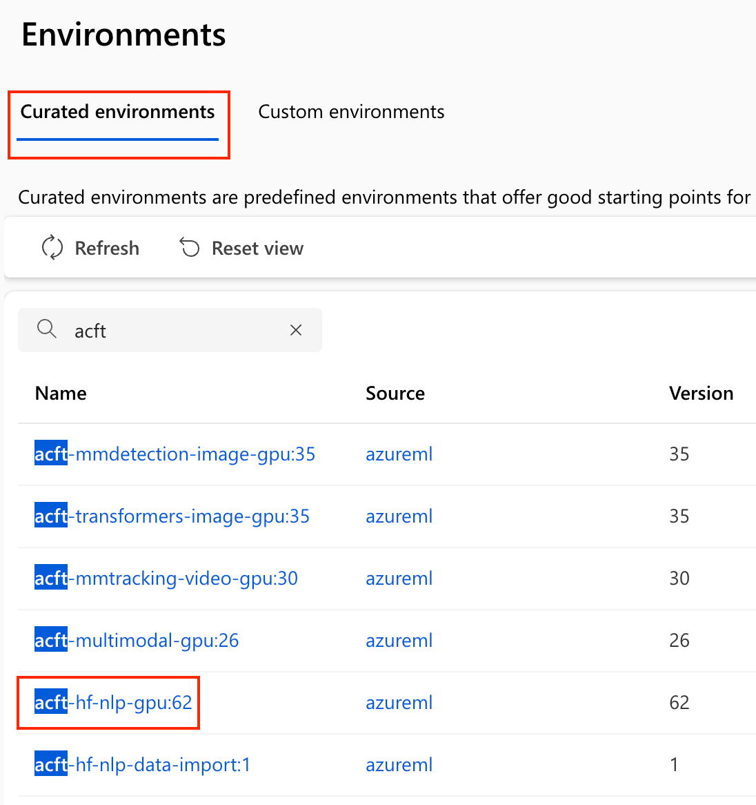
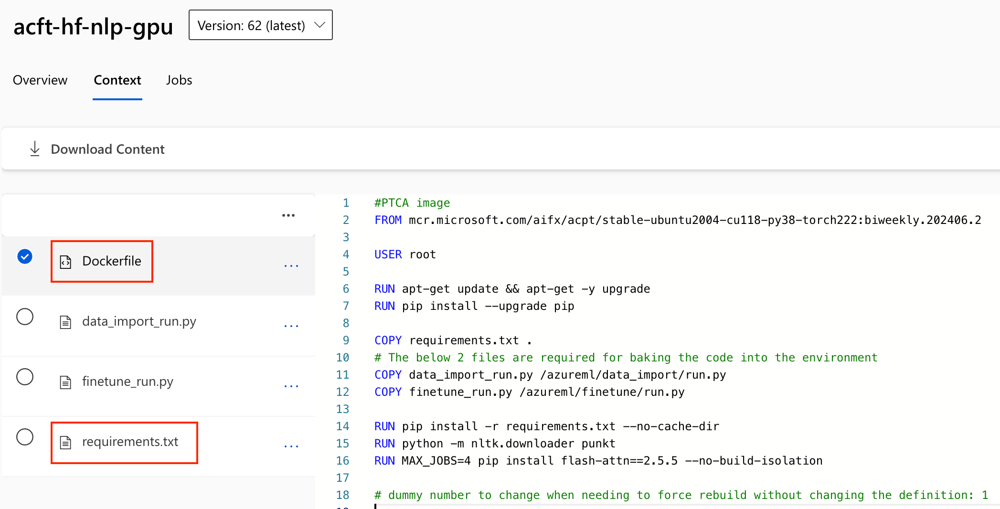
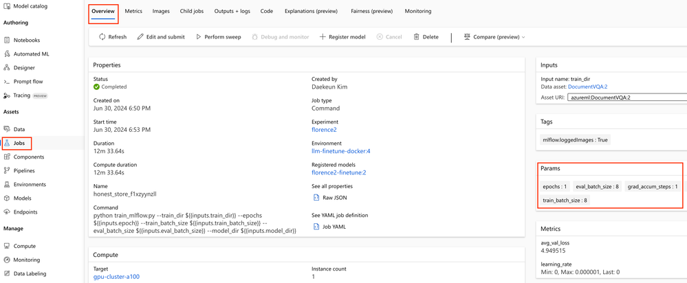
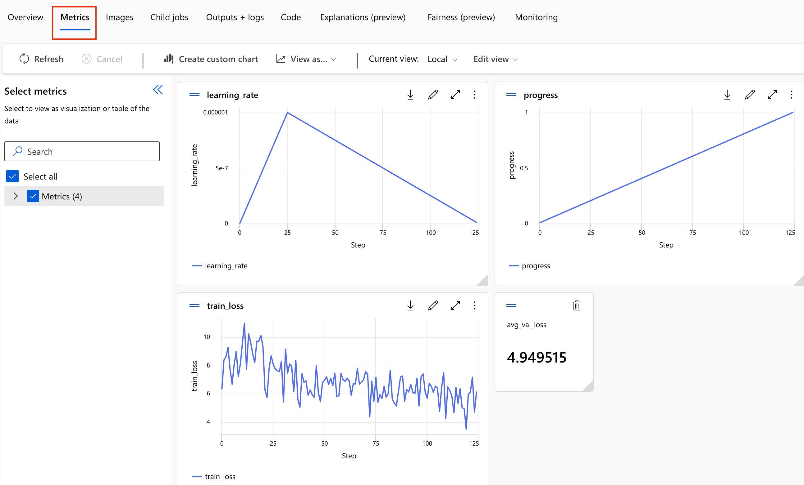
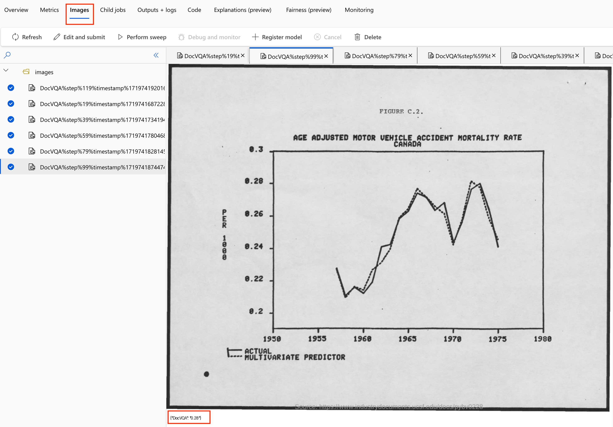
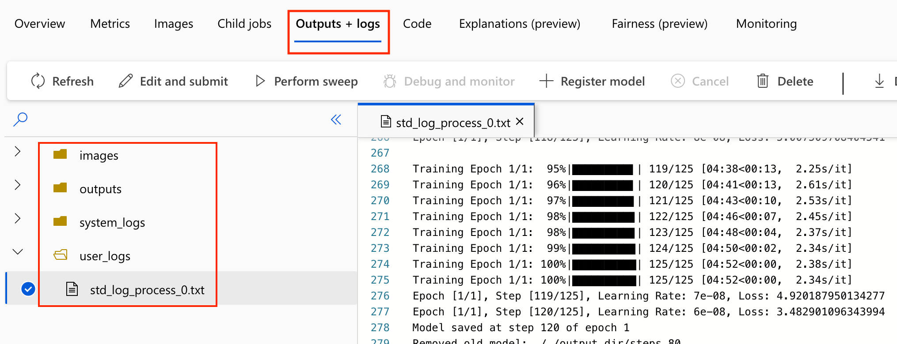

# Fine-tuning Florence-2 for VQA (Visual Question Answering) using the Azure ML Python SDK and MLflow

> _이 글은 저자가 마이크로소프트 머신 러닝 블로그에 기고한_ [_Fine-tuning Florence-2 for VQA (Visual Question Answering) using the Azure ML Python SDK and MLflow_](https://techcommunity.microsoft.com/blog/azure-ai-foundry-blog/fine-tuning-florence-2-for-vqa-visual-question-answering-using-the-azure-ml-pyth/4181123) _을 직접 한국어로 번역 및 편집하였습니다._

2024년 6월 중순 Microsoft에서 MIT 라이선스로 출시한 Florence-2는 1B 미만의 크기(베이스 모델 0.23B, 라지 모델 0.77B)로 비전 및 비전-언어 작업(OCR, 캡셔닝, 객체 감지, 인스턴스 분할 등)에 효율적입니다.

Florence-2의 모든 가중치는 공개적으로 사용 가능하므로 빠르고 쉽게 파인튜닝할 수 있습니다. 하지만 많은 사람들이 Azure ML 스튜디오에서 Florence-2를 포함한 최신 SLM/멀티모달 모델을 파인튜닝하는 데 어려움을 겪고 있습니다. 따라서 Azure ML에서 엔드투엔드로 빠르고 쉽게 훈련하고 서빙하는 방법에 대한 단계별 가이드를 제공하고자 합니다.

## 1. Training preparation <a href="#community-4181123-toc-hid-1244552293" id="community-4181123-toc-hid-1244552293"></a>

***

### 1.1. Preliminaries: Azure ML Python SDK v2 <a href="#community-4181123-toc-hid-1944025118" id="community-4181123-toc-hid-1944025118"></a>

Azure ML Python SDK v2는 익숙해지면 사용하기 쉽습니다. AzureML을 조작하기 위해 `MLClient` 인스턴스가 생성되면, 자산에 해당하는 작업이 `create_or_update` 함수를 통해 비동기적으로 실행됩니다. 아래 코드 스니펫을 참조하세요.

```python
ml_client = MLClient.from_config(credential)

### 1. Training phase
# Create an environment asset
ml_client.environments.create_or_update(env_docker_image)

# Create a data asset
ml_client.data.create_or_update(data)

# Create a compute cluster
ml_client.compute.begin_create_or_update(compute)

# Start a training job
ml_client.jobs.create_or_update(job)

### 2. Serving phase
# Create a model asset
ml_client.models.create_or_update(run_model)

# Create an endpoint
ml_client.begin_create_or_update(endpoint)

# Create a deployment
ml_client.online_endpoints.begin_create_or_update(endpoint)  
```

### 1.2. Data asset <a href="#community-4181123-toc-hid-136570655" id="community-4181123-toc-hid-136570655"></a>

모델 훈련/검증 데이터셋은 로컬에서 직접 업로드하거나 Azure ML 워크스페이스 데이터 자산으로 등록할 수 있습니다. 데이터 자산은 데이터의 버전 관리를 가능하게 하여 데이터셋의 변경 사항을 추적하고 필요할 때 이전 버전으로 되돌릴 수 있습니다. 이는 데이터 품질을 유지하고 데이터 분석의 재현성을 보장합니다.

데이터 자산은 데이터스토어에 저장된 데이터 파일이나 디렉토리를 참조하여 생성됩니다. 데이터스토어는 외부 데이터를 저장하는 위치를 나타내며 Azure Blob Storage, Azure File Share, Azure Data Lake Storage, OneLake 등 다양한 Azure 데이터 저장 서비스에 연결할 수 있습니다. Azure ML 워크스페이스를 생성하면 기본적으로 4개의 데이터스토어(`workspaceworkingdirectory`, `workspaceartifactstore`, `workspacefilestore`, `workspaceblobstore`)가 자동으로 생성됩니다. 이 중 `workspaceblobstore`는 Azure Blob Storage로, 모델 훈련 데이터나 대용량 파일을 저장할 때 기본적으로 사용됩니다.

### 1.3. Environment asset <a href="#community-4181123-toc-hid-126067551" id="community-4181123-toc-hid-126067551"></a>

Azure ML은 코드가 실행될 환경 자산을 정의합니다. 내장 환경을 사용하거나 Conda 사양 또는 Docker 이미지를 사용하여 사용자 정의 환경을 구축할 수 있습니다. Conda와 Docker의 장단점은 다음과 같습니다.

**Conda 환경**

* 장점
  * 간단한 환경 설정: Conda 환경 파일(`conda.yml`)은 주로 Python 패키지와 Conda 패키지를 지정하는 데 사용됩니다. 파일 형식이 간단하고 이해하기 쉬우며, 패키지와 버전 정보를 지정하는 데 적합합니다.
  * 빠른 설정: Conda 환경은 종속성을 자동으로 관리하고 충돌을 해결하므로 설정이 상대적으로 빠르고 쉽습니다.
  * 경량 환경: Conda 환경은 특정 패키지만 설치하므로 Docker 이미지보다 가벼울 수 있습니다.
* 단점
  * 제한된 유연성: Conda 환경은 Python 패키지와 Conda 패키지에 중점을 두므로 더 복잡한 시스템 수준 종속성을 처리하기 어렵습니다.
  * 이식성 제한: Conda 환경은 주로 Python과 Conda 패키지로 구성되어 다른 언어나 더 복잡한 시스템 구성 요소를 포함하기 어렵습니다.

**Docker 환경**

* 장점
  * 높은 유연성: Docker를 사용하면 운영 체제 수준에서 시작하여 필요한 모든 패키지와 도구를 포함한 완전한 환경을 정의할 수 있습니다. 시스템 종속성, 사용자 정의 설정, 비Python 패키지 등을 포함할 수 있습니다.
  * 이식성: Docker 이미지는 어디서나 동일하게 실행되어 환경 일관성을 보장합니다. 이는 재현성과 이식성을 크게 향상시킵니다.
  * 복잡한 환경 설정: Docker를 사용하면 복잡한 애플리케이션이나 여러 서비스를 포함하는 환경을 설정할 수 있습니다.
* 단점
  * 복잡한 설정: Docker 이미지를 구축하고 관리하는 것은 Conda 환경을 설정하는 것보다 더 복잡할 수 있습니다. `Dockerfile`을 작성하고 필요한 모든 종속성을 포함해야 합니다.
  * 빌드 시간: Docker 이미지를 처음 빌드하는 데는 오랜 시간이 걸릴 수 있으며, 특히 종속성 설치 과정이 복잡한 경우 더욱 그렇습니다.

Azure ML에서는 프로젝트의 요구 사항에 따라 적절한 방법을 선택하는 것이 중요합니다. 간단한 Python 프로젝트의 경우 Conda 환경으로 충분할 수 있지만, 복잡한 시스템 종속성이 필요한 경우 Docker 환경이 더 적합할 수 있습니다. 사용자 정의 Docker 이미지를 만드는 가장 쉽고 빠른 방법은 큐레이트된 환경을 약간 수정하는 것입니다. 아래는 예시입니다.

큐레이트된 환경 탭에서 `acft-hf-nlp-gpu`를 선택하세요. (물론 다른 환경을 선택할 수도 있습니다.)

<figure><figcaption></figcaption></figure>

`Dockerfile`과 `requirements.txt`를 복사하고 필요에 따라 수정하세요.

<figure><figcaption></figcaption></figure>

아래 코드 스니펫은 `Dockerfile`을 수정한 결과입니다.

```docker
FROM mcr.microsoft.com/aifx/acpt/stable-ubuntu2004-cu118-py38-torch222:biweekly.202406.2

USER root

RUN apt-get update && apt-get -y upgrade
RUN pip install --upgrade pip

COPY requirements.txt .
RUN pip install -r requirements.txt --no-cache-dir

RUN python -m nltk.downloader punkt
RUN MAX_JOBS=4 pip install flash-attn==2.5.9.post1 --no-build-isolation
```

## 2. Training <a href="#community-4181123-toc-hid-795622817" id="community-4181123-toc-hid-795622817"></a>

***

### 2.1. MLflow를 사용한 훈련 스크립트 <a href="#community-4181123-toc-hid-310767068" id="community-4181123-toc-hid-310767068"></a>

일부 사람들은 기존 훈련 스크립트를 크게 변경해야 하거나 MLflow 툴킷이 필수라고 생각할 수 있지만, 그렇지 않습니다. 기존 훈련 환경에 만족한다면 MLflow를 채택할 필요가 없습니다. 그럼에도 불구하고 MLflow는 Azure ML에서 모델 훈련과 배포를 매우 편리하게 만드는 툴킷이므로 이 포스트에서 간략히 설명하겠습니다.

훈련 스크립트에서 `mlflow.start_run()`을 사용하여 MLflow에서 실험을 시작하고, 완료되면 `mlflow.end_run()`으로 실험을 종료합니다. `with` 구문으로 감싸면 명시적으로 end\_run()을 호출할 필요가 없습니다. MLflow 블록 내에서 MLflow 로깅을 수행할 수 있으며, 우리 훈련 스크립트는 `mlflow.log_params()`, `mlflow.log_metric()`, `mlflow.log_image()`를 사용합니다. 자세한 정보는 [여기](https://learn.microsoft.com/azure/machine-learning/how-to-log-view-metrics)를 참조하세요.

```python
import mlflow
...
with mlflow.start_run() as run:
  mlflow.log_params({
    "epochs": epochs,
    "train_batch_size": args.train_batch_size,
    "eval_batch_size": args.eval_batch_size,
    "seed": args.seed,
    "lr_scheduler_type": args.lr_scheduler_type,        
    "grad_accum_steps": grad_accum_steps, 
    "num_training_steps": num_training_steps,
    "num_warmup_steps": num_warmup_steps,
  })    
    
  # 훈련 코드
  for epoch in range(epochs):     
    train_loss = 0.0
    optimizer.zero_grad()

    for step, (inputs, answers) in enumerate(tqdm(train_loader, desc=f"Training Epoch {epoch + 1}/{epochs}")):    
      ...
      mlflow.log_metric("train_loss", train_loss)
      mlflow.log_metric("learning_rate", learning_rate)
      mlflow.log_metric("progress", progress)
      ...
      if (step + 1) % save_steps == 0:
        # 이미지 로깅
        idx = random.randrange(len(val_dataset))
        val_img = val_dataset[idx][-1]
        result = run_example("DocVQA", 'What do you see in this image?', val_dataset[idx][-1])
        val_img_result = create_image_with_text(val_img, json.dumps(result))
        mlflow.log_image(val_img_result, key="DocVQA", step=step)     
```

> **\[주의]** Florence-2는 최근 출시된 모델로 이 글을 작성하는 2024년 7월 2일 현재 mlflow.transformers.log\_model()을 지원하지 않습니다! 따라서 기존의 `save_pretrained()`로 모델을 저장해야 합니다.
>
> 현재 `save_pretrained()`로 저장할 때 모델 추론에 필요한 추가 종속성 코드가 함께 저장되지 않습니다. 따라서 강제로 저장해야 합니다. 이 두 가지 주의사항을 반영한 코드 스니펫은 아래를 참조하세요.

```python
model.save_pretrained(model_dir)
processor.save_pretrained(model_dir)

## Should include configuration_florence2.py, modeling_florence2.py, and processing_florence2.py
dependencies_dir = "dependencies"
shutil.copytree(dependencies_dir, model_dir, dirs_exist_ok=True)
```

### 2.2. Create a Compute Cluster and Training Job <a href="#community-4181123-toc-hid-2118221531" id="community-4181123-toc-hid-2118221531"></a>

훈련 스크립트 작성과 디버깅을 완료했다면 훈련 작업을 생성할 수 있습니다. 기준으로 NVIDIA A100 GPU 하나가 있는 `Standard_NC24ads_A100_v4`를 사용할 수 있습니다. LowPriority VM을 프로비저닝하면 2024년 7월 미국 동부 지역에서 시간당 $0.74만 소요됩니다.

`command()` 함수는 훈련 작업을 정의하고 실행하는 데 사용되는 Azure ML의 주요 함수 중 하나입니다. 이 함수는 훈련 스크립트와 필요한 환경 설정을 지정하고, Azure ML의 컴퓨팅 리소스에서 작업을 실행할 수 있게 합니다.

```python
from azure.ai.ml import command
from azure.ai.ml import Input
from azure.ai.ml.entities import ResourceConfiguration

job = command(
    inputs=dict(
        #train_dir=Input(type="uri_folder", path=DATA_DIR), # 로컬 경로에서 데이터 가져오기
        train_dir=Input(path=f"{AZURE_DATA_NAME}@latest"),  # 데이터 자산에서 데이터 가져오기
        epoch=d['train']['epoch'],
        train_batch_size=d['train']['train_batch_size'],
        eval_batch_size=d['train']['eval_batch_size'],  
        model_dir=d['train']['model_dir']
    ),
    code="./src_train",  # 코드가 저장된 로컬 경로
    compute=azure_compute_cluster_name,
    command="python train_mlflow.py --train_dir ${{inputs.train_dir}} --epochs ${{inputs.epoch}} --train_batch_size ${{inputs.train_batch_size}} --eval_batch_size ${{inputs.eval_batch_size}} --model_dir ${{inputs.model_dir}}",
    #environment="azureml://registries/azureml/environments/acft-hf-nlp-gpu/versions/61", # 내장 환경 자산 사용
    environment=f"{azure_env_name}@latest",
    distribution={
        "type": "PyTorch",
        "process_count_per_instance": 1, # 멀티 GPU 훈련의 경우 1보다 큰 정수 값으로 설정
    },
)
returned_job = ml_client.jobs.create_or_update(job)
ml_client.jobs.stream(returned_job.name)
```

### 2.3. Check your Training job <a href="#community-4181123-toc-hid-369291302" id="community-4181123-toc-hid-369291302"></a>

Jobs 자산을 통해 모델 훈련이 정상적으로 진행되고 있는지 확인하세요.

**Overview** 탭에서는 전체 훈련 기록을 볼 수 있습니다. Params는 훈련 스크립트에서 `mlflow.log_params()`로 등록한 매개변수입니다.

<figure><figcaption></figcaption></figure>

**Metrics** 탭에서는 `mlflow.log_metric()`으로 등록한 메트릭을 한눈에 볼 수 있습니다.

<figure><figcaption></figcaption></figure>

**Images** 탭에서는 `mlflow.log_image()`로 저장한 이미지를 볼 수 있습니다. 모델 훈련이 잘 진행되고 있는지 확인하기 위해 추론 결과를 이미지로 저장하는 것을 권장합니다.

<figure><figcaption></figcaption></figure>

**Outputs + logs** 탭에서는 모델 훈련 인프라, 컨테이너, 코드의 문제를 확인하고 모니터링합니다.

`system_logs` 폴더는 훈련 클러스터, 데이터 자산, 호스팅 도구 등과 관련된 모든 주요 활동과 이벤트를 기록합니다.

`user_logs` 폴더는 주로 훈련 스크립트 내에서 사용자가 생성한 로그와 기타 파일을 저장하는 중요한 역할을 하며, 훈련 과정의 투명성을 높이고 디버깅과 모니터링을 용이하게 합니다. 이를 통해 사용자는 훈련 과정의 상세한 기록을 볼 수 있고 필요할 때 문제를 식별하고 해결할 수 있습니다.

<figure><figcaption></figcaption></figure>

## 3. Serving <a href="#community-4181123-toc-hid-1903475218" id="community-4181123-toc-hid-1903475218"></a>

***

모델 훈련이 완료되면 호스팅 서버에 배포해보겠습니다. MLflow `log_model()`로 저장했다면 MLflow로 직접 배포할 수 있지만, 현재 transformer와 MLflow 버전에서는 기존 방식으로 모델을 저장했으므로 사용자 정의 옵션으로 배포해야 합니다.

### 3.1. Inference script <a href="#community-4181123-toc-hid-354186193" id="community-4181123-toc-hid-354186193"></a>

`init()`과 `run()` 두 함수만 정의하면 되며, 자유롭게 작성할 수 있습니다. `init()` 함수에 직접 인수를 전달할 수는 없지만, 환경 변수나 구성 파일을 통해 초기화 중에 필요한 정보를 전달할 수 있습니다.

```python
import os
import re
import json
import torch
import base64
import logging

from io import BytesIO
from PIL import Image
from transformers import AutoTokenizer, AutoProcessor, BitsAndBytesConfig, get_scheduler
from transformers import AutoModelForCausalLM, AutoProcessor
from PIL import Image, ImageDraw, ImageFont

device = torch.device("cuda" if torch.cuda.is_available() else "cpu")

def run_example_base64(task_prompt, text_input, base64_image, params):

    max_new_tokens = params["max_new_tokens"]
    num_beams = params["num_beams"]
    
    image = Image.open(BytesIO(base64.b64decode(base64_image)))
    prompt = task_prompt + text_input

    # Ensure the image is in RGB mode
    if image.mode != "RGB":
        image = image.convert("RGB")

    inputs = processor(text=prompt, images=image, return_tensors="pt").to(device)
    generated_ids = model.generate(
        input_ids=inputs["input_ids"],
        pixel_values=inputs["pixel_values"],
        max_new_tokens=max_new_tokens,
        num_beams=num_beams
    )
    generated_text = processor.batch_decode(generated_ids, skip_special_tokens=False)[0]
    parsed_answer = processor.post_process_generation(generated_text, task=task_prompt, image_size=(image.width, image.height))
    return parsed_answer

def init():
    """
    This function is called when the container is initialized/started, typically after create/update of the deployment.
    You can write the logic here to perform init operations like caching the model in memory
    """
    global model
    global processor
    # AZUREML_MODEL_DIR is an environment variable created during deployment.
    # It is the path to the model folder (./azureml-models/$MODEL_NAME/$VERSION)
    # Please provide your model's folder name if there is one
    model_name_or_path = os.path.join(
        os.getenv("AZUREML_MODEL_DIR"), "outputs"
    )
    
    model_kwargs = dict(
        trust_remote_code=True,
        revision="refs/pr/6",        
        device_map=device
    )
    
    processor_kwargs = dict(
        trust_remote_code=True,
        revision="refs/pr/6"
    )
    
    model = AutoModelForCausalLM.from_pretrained(model_name_or_path, **model_kwargs)
    processor = AutoProcessor.from_pretrained(model_name_or_path, **processor_kwargs)    

    logging.info("Loaded model.")

def run(json_data: str):
    logging.info("Request received")
    data = json.loads(json_data)
    task_prompt = data["task_prompt"]
    text_input = data["text_input"]
    base64_image = data["image_input"]
    params = data['params']

    generated_text = run_example_base64(task_prompt, text_input, base64_image, params)
    json_result = {"result": str(generated_text)}
    
    return json_result    
```

### 3.2. Register Model <a href="#community-4181123-toc-hid-1453268270" id="community-4181123-toc-hid-1453268270"></a>

`azure.ai.ml.entities`의 `Model` 클래스로 등록합니다. 등록할 때 모델의 경로와 이름을 입력하고 `ml_client.models.create_or_update()`와 함께 사용합니다.

```python
def get_or_create_model_asset(ml_client, model_name, job_name, model_dir="outputs", model_type="custom_model", update=False):
    
    try:
        latest_model_version = max([int(m.version) for m in ml_client.models.list(name=model_name)])
        if update:
            raise ResourceExistsError('Found Model asset, but will update the Model.')
        else:
            model_asset = ml_client.models.get(name=model_name, version=latest_model_version)
            print(f"Found Model asset: {model_name}. Will not create again")
    except (ResourceNotFoundError, ResourceExistsError) as e:
        print(f"Exception: {e}")        
        model_path = f"azureml://jobs/{job_name}/outputs/artifacts/paths/{model_dir}/"    
        run_model = Model(
            name=model_name,        
            path=model_path,
            description="Model created from run.",
            type=model_type # mlflow_model, custom_model, triton_model
        )
        model_asset = ml_client.models.create_or_update(run_model)
        print(f"Created Model asset: {model_name}")

    return model_asset
```

### 3.3. Environment asset <a href="#community-4181123-toc-hid-1034244563" id="community-4181123-toc-hid-1034244563"></a>

이는 이전 섹션에서 소개한 환경 자산과 동일합니다. 하지만 모델 서빙에는 웹 호스팅을 위한 추가 설정이 필요하므로 아래 코드 스니펫을 참조하세요.

```docker
FROM mcr.microsoft.com/aifx/acpt/stable-ubuntu2004-cu118-py38-torch222:biweekly.202406.2

# Install pip dependencies
COPY requirements.txt .
RUN pip install -r requirements.txt --no-cache-dir

RUN MAX_JOBS=4 pip install flash-attn==2.5.9.post1 --no-build-isolation

# Inference requirements
COPY --from=mcr.microsoft.com/azureml/o16n-base/python-assets:20230419.v1 /artifacts /var/
RUN /var/requirements/install_system_requirements.sh && \\
    cp /var/configuration/rsyslog.conf /etc/rsyslog.conf && \\
    cp /var/configuration/nginx.conf /etc/nginx/sites-available/app && \\
    ln -sf /etc/nginx/sites-available/app /etc/nginx/sites-enabled/app && \\
    rm -f /etc/nginx/sites-enabled/default
ENV SVDIR=/var/runit
ENV WORKER_TIMEOUT=400
EXPOSE 5001 8883 8888

# support Deepspeed launcher requirement of passwordless ssh login
RUN apt-get update
RUN apt-get install -y openssh-server openssh-client
```

### 3.4. Create an Endpoint <a href="#community-4181123-toc-hid-773209900" id="community-4181123-toc-hid-773209900"></a>

엔드포인트는 모델을 외부에서 접근할 수 있게 하는 HTTP(S) URL을 의미합니다. 엔드포인트는 여러 배포를 가질 수 있어 여러 배포에 걸쳐 트래픽을 분산할 수 있습니다. 엔드포인트는 다음과 같은 역할을 합니다:

1. **API 인터페이스 제공**: 엔드포인트는 RESTful API를 통해 모델 예측 요청을 받을 수 있는 URL을 제공합니다.
2. **트래픽 라우팅**: 엔드포인트는 여러 배포에 걸쳐 트래픽을 분산합니다. 이를 통해 A/B 테스트나 카나리 배포 전략을 구현할 수 있습니다.
3. **확장성**: 엔드포인트는 여러 배포에 걸친 확장을 지원하며 트래픽이 증가함에 따라 추가 배포에 걸쳐 로드 밸런싱할 수 있습니다.
4. **보안 관리**: 엔드포인트는 인증과 권한 부여를 통해 모델을 보호합니다. API 키나 Microsoft Entra ID를 사용하여 액세스를 제어할 수 있습니다.

코드 스니펫은 아래와 같습니다. 이 과정에서는 아직 컴퓨팅 클러스터를 프로비저닝하지 않는다는 점에 유의하세요.

```python
from azure.ai.ml.entities import (
    ManagedOnlineEndpoint,
    IdentityConfiguration,
    ManagedIdentityConfiguration,
)

# Check if the endpoint already exists in the workspace
try:
    endpoint = ml_client.online_endpoints.get(azure_endpoint_name)
    print("---Endpoint already exists---")
except:
    # Create an online endpoint if it doesn't exist
    endpoint = ManagedOnlineEndpoint(
        name=azure_endpoint_name,
        description=f"Test endpoint for {model.name}",
    )

# Trigger the endpoint creation
try:
    ml_client.begin_create_or_update(endpoint).wait()
    print("\\n---Endpoint created successfully---\\n")
except Exception as err:
    raise RuntimeError(
        f"Endpoint creation failed. Detailed Response:\\n{err}"
    ) from err
```

### 3.5. Create a Deployment <a href="#community-4181123-toc-hid-1714302933" id="community-4181123-toc-hid-1714302933"></a>

배포는 실제로 모델을 실행하는 인스턴스입니다. 여러 배포를 엔드포인트에 연결할 수 있으며, 각 배포에는 모델, 환경, 컴퓨팅 리소스, 인프라 설정 등이 포함됩니다. 배포는 다음과 같은 역할을 합니다:

1. **리소스 관리**: 배포는 모델을 실행하는 데 필요한 컴퓨팅 리소스를 관리합니다. CPU, GPU, 메모리 등의 리소스를 설정할 수 있습니다.
2. **버전 관리**: 배포는 모델의 다양한 버전을 관리할 수 있습니다. 이를 통해 이전 버전으로 쉽게 롤백하거나 새 버전을 배포할 수 있습니다.
3. **모니터링 및 로깅**: 실행 중인 모델의 로그와 성능을 모니터링할 수 있습니다. 이는 문제를 감지하고 해결하는 데 도움이 됩니다.

코드 스니펫은 아래와 같습니다. GPU 클러스터를 프로비저닝하고 서빙 환경을 구축해야 하므로 시간이 많이 걸린다는 점에 유의하세요.

```python
from azure.ai.ml.entities import (    
    OnlineRequestSettings,
    CodeConfiguration,
    ManagedOnlineDeployment,
    ProbeSettings,
    Environment
)

deployment = ManagedOnlineDeployment(
    name=azure_deployment_name,
    endpoint_name=azure_endpoint_name,
    model=model,
    instance_type=azure_serving_cluster_size,
    instance_count=1,
    #code_configuration=code_configuration,
    environment = env,
    scoring_script="score.py",
    code_path="./src_serve",
    #environment_variables=deployment_env_vars,
    request_settings=OnlineRequestSettings(max_concurrent_requests_per_instance=3,
                                           request_timeout_ms=90000, max_queue_wait_ms=60000),
    liveness_probe=ProbeSettings(
        failure_threshold=30,
        success_threshold=1,
        period=100,
        initial_delay=500,
    ),
    readiness_probe=ProbeSettings(
        failure_threshold=30,
        success_threshold=1,
        period=100,
        initial_delay=500,
    ),
)

# Trigger the deployment creation
try:
    ml_client.begin_create_or_update(deployment).wait()
    print("\\n---Deployment created successfully---\\n")
except Exception as err:
    raise RuntimeError(
        f"Deployment creation failed. Detailed Response:\\n{err}"
    ) from err
    
endpoint.traffic = {azure_deployment_name: 100}
endpoint_poller = ml_client.online_endpoints.begin_create_or_update(endpoint)   
```

> **\[Tip]** 모델 배포 컨테이너가 정상적으로 실행되고 있는지 확인하기 위해 liveness probe 설정을 직접 지정하여 배포하세요. 디버깅할 때는 높은 initial\_delay와 높은 failure\_threshold, 높은 period를 설정하여 오류 로그 분석을 위한 시간을 확보하는 것을 권장합니다. 위 코드의 `ProbeSettings()`를 확인하세요.

## 4. Invocation <a href="#community-4181123-toc-hid-351316968" id="community-4181123-toc-hid-351316968"></a>

***

마침내 Florence-2 모델 서빙에 성공했습니다. 아래 코드를 사용하여 모델 추론을 수행해보세요.

```python
import os
import json
import base64

with open('./DocumentVQA_Test_01.jpg', 'rb') as img:
    base64_img = base64.b64encode(img.read()).decode('utf-8')
    
sample = {
    "task_prompt": "DocVQA",
    "image_input": base64_img,
    "text_input": "What do you see in this image", 
    "params": {
        "max_new_tokens": 512,
        "num_beams": 3
    }
}

test_src_dir = "./inference-test"
os.makedirs(test_src_dir, exist_ok=True)
print(f"test script directory: {test_src_dir}")
sample_data_path = os.path.join(test_src_dir, "sample-request.json")

with open(sample_data_path, "w") as f:
    json.dump(sample, f)
result = ml_client.online_endpoints.invoke(
    endpoint_name=azure_endpoint_name,
    deployment_name=azure_deployment_name,
    request_file=sample_data_path,
)

result_json = json.loads(result)
print(result_json['result'])
```

모델을 본격적으로 배포하기 전에 LLM 지연시간/처리량 벤치마킹을 수행하는 것이 좋은 전략입니다. 기준으로 다음 메트릭을 벤치마킹하세요.

```python
metrics = {
    'threads': num_threads,
    'duration': duration,
    'throughput': throughput,
    'avg_sec': avg_latency,
    'std_sec': time_std_sec,        
    'p95_sec': time_p95_sec,
    'p99_sec': time_p99_sec    
}
```

이 포스트를 엔드투엔드로 수행할 수 있는 코드를 [https://github.com/Azure/azure-llm-fine-tuning/tree/main/florence2-VQA](https://github.com/Azure/azure-llm-fine-tuning/tree/main/florence2-VQA)에 게시했습니다.

이 튜토리얼이 Azure ML Studio에서 Florence-2 모델을 포함한 최신 모델을 파인튜닝하고 배포하는 데 도움이 되기를 바랍니다.

## References <a href="#community-4181123-toc-hid-2136195865" id="community-4181123-toc-hid-2136195865"></a>

* [Hugging Face blog - Fine-tuning Florence-2](https://huggingface.co/blog/finetune-florence2)
* [Fine-tune SLM Phi-3 using Azure ML](https://techcommunity.microsoft.com/t5/ai-machine-learning-blog/finetune-small-language-model-slm-phi-3-using-azure-machine/ba-p/4130399)
* [Hands-on labs - LLM Fine-tuning/serving with Azure ML](https://github.com/Azure/azure-llm-fine-tuning) &#x20;
