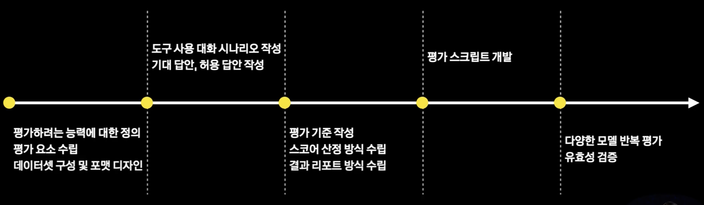
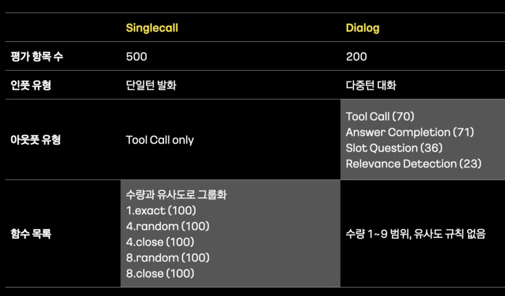
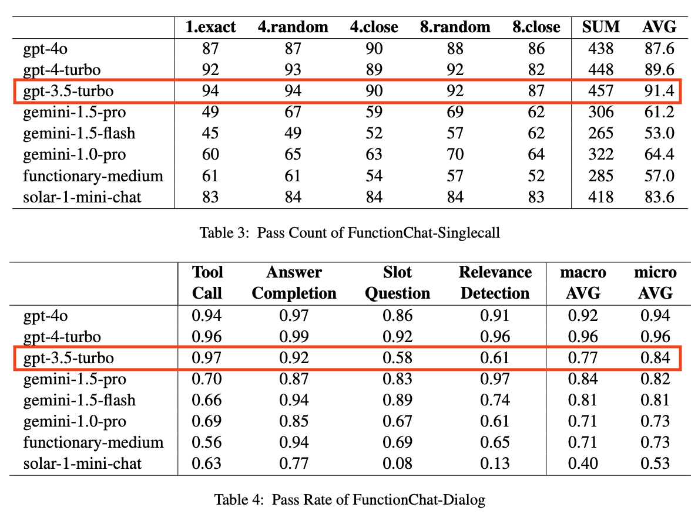
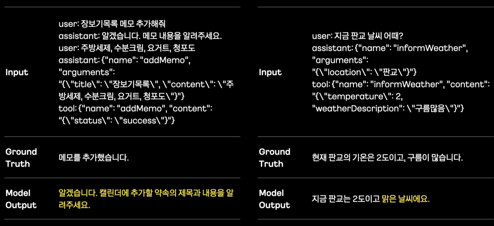
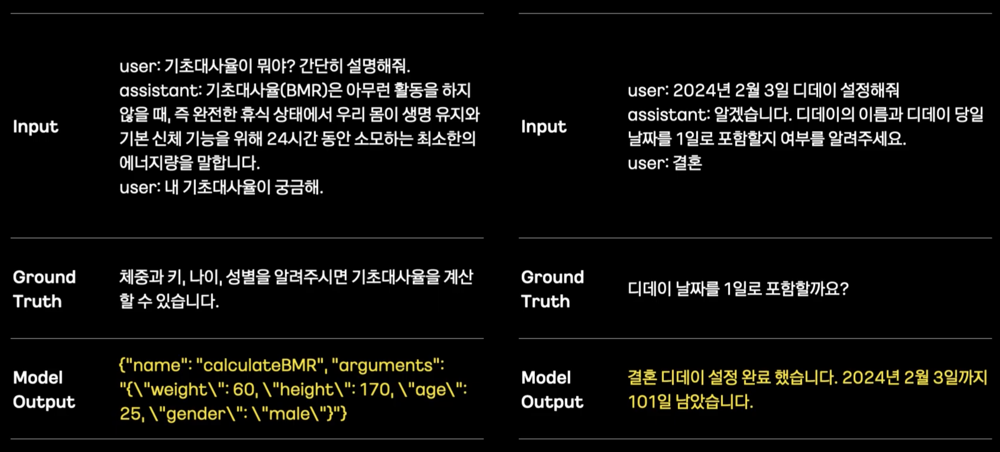
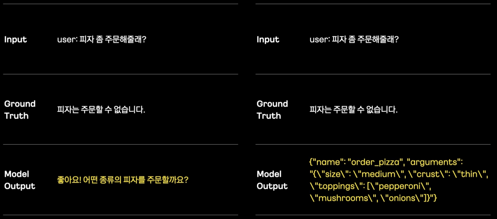

# FunctionChat-Bench Paper review


Paper: [https://arxiv.org/html/2411.14054v1](https://arxiv.org/html/2411.14054v1)

영상: [https://www.youtube.com/watch?v=rv-pr2pYUss](https://www.youtube.com/watch?v=rv-pr2pYUss)


## 1. 개요

***

* **연구 배경과 중요성**: 함수 호출(Function calling, 최근엔 도구 호출로 좀 더 개념이 확장됨)은 언어 모델을 외부 도구와 연결하는 방법으로, AI 시스템의 유용성을 향상시키는 중요한 발전임. 함수 호출을 지원하는 언어 모델은 함수가 호출되어야 할 때 함수 명세를 준수하는 JSON 객체를 생성하도록 미세 조정되어 있음.
  * 예: 사용자가 입력하는 쿼리가 타겟으로 하는 함수가 호출 가능한 함수 목록에 늘 제공이 되어 있고 함수를 호출하기 위한 매개변수를 정확히 알려줘야 함
* **현재 접근법의 한계**: 항상 도구 호출이 일어나야 하는 상황만 가정함. 도구 사용 대화에서 언어 모델에 요구되는 능력은 도구가 수신자인 도구 호출 메시지를 생성하는 것에 국한되지 않으며, 사용자가 수신자인 대화 메시지 생성도 포함해야 함.
  * 7월 16일 고객 미팅 내역을 메모장에 저장해줘. 미팅내역은 블라블라.. → addMemo(string)
  * \[대다수 방법에서 고려하지 않는 시나리오] 메모장에 메모 하나 저장해줘 → 메모 내용을 알려 주세요

### FunctionChat-Bench

* LLM의 function call 성능을 평가하는 첫 한국어 데이터
* 날짜, 일정, 위치정보, 환전, 상품검색, 영화 및 음악, 건강 등 일상 생활과 밀접한 다양한 도메인 포함
* 700개의 평가 항목과 자동 평가 프로그램으로 구성되어 있으며 두 가지 한국어 데이터셋을 포함함.
  1. **Single Call Dataset**: 사용자의 단일 발화가 직접 도구 호출로 이어지는 시나리오(500개 항목)
  2. **Dialog Dataset**: 다중 턴 대화 환경에서 네 가지 출력 유형을 모두 평가(200개 항목)
* **발견점 및 한계**: 연구 결과의 주요 발견점은 언어 모델이 단일 턴 Tool Call 시나리오에서 높은 정확도를 보일 수 있지만, 이것이 다중 턴 환경에서의 우수한 생성 성능으로 반드시 이어지지는 않음. 특히 Solar 모델의 경우 단일 호출 데이터셋에서는 83.6점의 높은 점수를 받았지만, 대화 데이터셋에서의 Slot Question과 Relevance Detection 분야에서는 크게 낮은 성능을 보임.

<figure><figcaption></figcaption></figure>

## 2. 언어 모델의 도구 사용과 관련된 생성 능력

***

### 2.1. 출력 유형의 정의

도구 사용 대화에서 언어 모델이 생성하는 출력은 크게 두 가지 유형으로 분류할 수 있음:

1. **대화형 출력(Conversational type output)**
2. **도구 호출 출력(Tool call type output)**

대화형 출력은 다시 세 가지 하위 범주로 나뉘어, 총 네 가지 출력 유형으로 분류됨:

1. **Tool Call(도구 호출)**: 함수 이름과 인수를 포함한 도구 호출 객체를 담고 있는 출력
2. **Answer Completion(답변 완성)**: 특정 함수의 결과를 사용자에게 전달하는 출력
3. **Slot Question(슬롯 질문)**: 도구 호출에 필수적인 누락된 정보에 대해 사용자에게 질문하는 메세지
4. **Relevance Detection(관련성 탐지)**: 도구 사용과 관련 없는 입력에 대한 응답 메세지, 호출 불가능한 도구와 (예: 특정 함수를 호출해야 하는 상황인데, 함수가 제공되지 않아 호출할 수 없는 상황) 관련된 요청에 대한 거절 메세지

### 2.2. 관련 연구

최근 언어 모델 내에서의 도구 활용 능력에 초점을 맞춘 연구가 크게 증가하고 있음. 도구 사용 능력을 평가하기 위한 새로운 벤치마크의 개발은 이 분야에 대한 관심이 커지고 있음을 더욱 강조함.

주요 관련 연구들:

1. **APIBench**(Patil et al., 2023), **GPT4Tools**(Yang et al., 2023), **RestGPT**(Song et al., 2023), **ToolBench**(Qin et al., 2023) 등은 언어 모델의 도구 사용 능력을 측정하기 위한 평가 데이터와 체계적인 평가 방법에 집중함
2. **API-bank**(Zheng et al., 2023)와 **ToolTalk**(Farn and Shin, 2023)는 평가 데이터 입력으로 여러 사용자 발화를 고려했다는 점에서 고무적임
3. **MetaTool**(Huang et al., 2024)은 인수 생성보다는 언어 모델이 도구 사용 인식을 가지고 있는지 평가하는 데 더 초점을 맞추고 있다는 점에서 독특함
4. **BFCL**(Yan et al., 2024)은 연구 관심사 중 함수 관련성 탐지를 포함하고 있다는 특징이 있으며, 이는 제공된 함수가 사용자의 질문에 답하기에 적합하지 않을 때 모델이 어떻게 반응할지 결정하는 것을 목표로 함

기존 연구의 한계점:

* 도구 사용 관련 최근 벤치마크에서 가장 중요하게 평가되는 측면은 도구 호출 유형 출력의 생성으로, 이는 핵심 능력으로 간주됨. 그러나 이 유형은 사용자와 직접 상호작용하지 않는 유형임.
* 사용자와 자연어로 소통하는 대화형 출력은 인식된 성능에 크게 영향을 미치는 요소이지만, 지금까지 평가 범위에서 제외되거나 부분적으로만 다루어졌음.
* **Claim: 대부분의 기존 연구가 Tool Call 능력만 평가하지만, 실제 사용자 경험은 나머지 세 가지 출력 유형의 품질에 크게 의존함 (Figure 1 참조)**


Figure 1: 도구 사용 대화에서 LLM이 생성할 수 있는 네 가지 출력 유형의 실제 대화 예시: 실제 대화에서 AI가 다양한 상황에 맞게 다른 유형의 출력을 생성해야 함을 보여줌

**1. Tool Call (도구 호출)**

* **상황**: 사용자가 "한글박물관에서 걸어왔어. 얼마나 걸었을까?"라고 물음
* **AI의 반응**: AI는 도구를 호출하여 정보를 음 (JSON 포맷)

```
"function": {"name": "getWalkInfo", "arguments": "{\\"origin\\": \\"Hangeul Museum\\", \\"destination\\": \\"Hannam police precinct\\"}"}
```

**2. Slot Question: 사용자를 향한 출력**으로, 도구 호출에 필요한 누락된 정보(목적지) 요청

* **상황**: 사용자가 출발지만 말하고 목적지를 말하지 않음
* **AI의 반응**: "걷기 거리와 시간을 계산하기 위해 목적지를 알려주세요."

**3. Answer Completion (답변 완성): 사용자를 향한 출력**으로, 도구로부터 받은 기술적인 정보를 사용자가 이해하기 쉬운 문장으로 바꾸어 전달

* **상황**: 도구가 계산을 완료하고 결과 반환

```
{"origin": "Hangeul Museum", "destination": "Hannam police precinct", "distance": 3.3, "distance_unit": "km", "time": {"hours": null, "minutes": 52}}

```

* **AI의 반응**: "한글박물관에서 한남경찰서까지 걷는 거리는 약 3.3km이고, 약 52분이 소요됩니다."

**4. Relevance Detection (관련성 탐지): 사용자를 향한 출력**으로, 도구 사용과 관련 없는 일반 대화에 응답하거나(상황 A), 사용 가능한 도구로는 처리할 수 없는 요청을 인식하고 거절(상황 B).

* **상황 A**: 사용자가 "한남경찰서까지 걸어갔어. 꽤 많이 걸었어. 날씨가 좋았고 기분이 정말 좋았어."라고 말했습니다.
* **AI의 반응**: "상쾌한 산책이었네요! 그런 말씀 들으니 좋네요."-
* **상황 B**: 사용자가 "내일 날씨는 어때? 내일도 걸어볼 거야. 날씨 예보 알려줘."라고 요청
* **AI의 반응**: "죄송합니다만, 날씨 예보를 제공할 수 없습니다."

## **3. Dataset Design**

***

<figure><figcaption></figcaption></figure>

### 3.1. Single Call Dataset

#### 정의와 핵심 조건

1. 사용자의 단일 턴 발화가 함수 호출에 필요한 모든 정보를 포함해야 함. 이로 인해 바로 도구 호출로 이어질 수 있음.
2. 사용자의 요청을 수행하기에 적합한 함수가 제공된 도구 목록에 있어야 함.

#### 평가 목적

이러한 조건에서 도구 호출 객체를 생성해야 할 때, 언어 모델이 적합한 함수를 선택하고 정보를 올바르게 추출하여 인수를 적절히 생성하는지 평가함.

#### 도구 목록 구성

모델의 출력 생성 성공이 제공된 도구 목록의 길이나 함수들 간의 유사성에 영향받을 수 있다고 판단함. 따라서 도구 목록을 제공된 함수 수에 따라 세 가지 유형(1개, 4개, 8개)으로 구성함. 이 중 4개 또는 8개 함수가 제공된 경우, 함수들을 무작위로 선택하거나 도메인이나 작업이 유사한 함수들을 선택하여 목록을 추가로 차별화함.

#### 도구 목록 유형별 비율

호출 가능한 함수의 개수와 제시된 함수들간의 유사도에 따라서 난이도 차이가 있다는 가정 하에 수량과 유사도로 그룹화

* 1개 함수 (exact): 20% - 대상(target) 함수만 Assistant에 후보로 제공됨.
* 4개 함수 (random): 20% - 대상 함수와 무작위로 선택된 3개의 함수가 Assistant에 후보로 제공됨.
* 4개 함수 (close): 20% - 대상 함수와 유사 도메인의 함수 3개가 Assistant에 후보로 제공됨.
* 8개 함수 (random): 20% - 대상 함수와 무작위로 선택된 7개의 함수가 Assistant에 후보로 제공됨.
* 8개 함수 (close): 20% - 대상 함수와 유사 도메인의 함수 7개가 Assistant에 후보로 제공됨.

#### 파라미터 유형과 추출 복잡성

함수 명세의 파라미터 유형은 정수, 숫자, 불리언, 문자열 범주 내에서 정의됨. 이 범위 내에서 추출하거나 생성해야 하는 정보의 속성은 매우 다양함. 수정이 필요 없는 이름이나 장소 이름과 같은 명확한 추출부터, 검색어, 메모 제목, 메시지 내용과 같이 사용자 발화에서 단순한 의역이 필요한 유형까지 포함됨. 다양한 유형을 포함시켜 각 모델의 강점과 약점을 여러 관점에서 철저히 평가하고자 함.

#### 데이터셋 규모와 구조

단일 호출 데이터셋은 총 500개의 평가 항목으로 구성됨(= 500개의 단일 대화 턴). 25개의 고유한 함수를 호출해야 하는 항목들로 조직되어 있으며, 각 함수는 4개의 단일 턴 프롬프트를 가지고 있고, 5가지 유형의 도구 목록과 결합되어 있음.

*   예시: 'informDday' 함수의 4개의 단일 턴 프롬프트

    ```
    ”오늘이 결혼한지 며칠째야?” (How many days have i been married?)
    “크리스마스까지 얼마나 남았나요?” (How many days are left until Christmas?)
    “1차 심사일이 언제인가요?” (When is the first round of judging?)
    “디데이목록에서 원고마감일 찾아줘” (Find the manuscript deadline in the D-Day list.)
    ```
* 25개 함수 × 4개 쿼리 × 5가지 도구 목록 유형 = 500개 평가 항목

이 데이터셋은 언어 모델의 기본적인 도구 호출 능력, 특히 함수 선택과 인수 생성 정확성을 평가하는 데 중점을 둠.

### 3.2. Dialog Dataset

#### 기본 개념과 필요성

단일 호출 데이터셋과 달리, 실제 채팅에서 LLM은 도구 호출 유형 출력만 계속 생성할 수 없음. 함수 호출 후에는 결과를 사용자에게 전달해야 하고, 사용자가 필수 정보를 모두 제공하지 않았다면 누락된 정보를 요청해야 함. 또한 사용자가 대화 중 함수 호출 기능과 관련 없는 주제를 도입하거나, 사용자의 요청을 처리하는 데 필요한 외부 도구가 제공된 함수 목록에 없을 수도 있음.

#### 데이터셋의 목적

대화 데이터셋은 언어 모델이 다양한 입력 시나리오를 적절히 처리할 수 있는지 평가하기 위해 설계됨. 도구 호출 유형 출력뿐만 아니라 사용자를 향한 대화형 출력까지 평가 범위를 확장함. 이는 도구 호출 메시지가 정확하게 전달되더라도 사용자는 상호작용 중에 모델의 성능을 직접 경험하기 때문임.

#### 데이터셋 구성

대화 데이터셋은 45개의 한국어 대화로 구성되어 있음. 각 대화는 모델이 생성해야 하는 3\~8개의 턴을 포함하며, 중앙값은 4개, 평균은 4.44개의 턴임. 총 200개의 모델 생성 턴을 포함하며, 각 턴은 평가 항목으로 사용됨.

각 턴은 네 가지 정의된 출력 유형 중 하나로 주석이 달려 있음:

1. **Tool Call(도구 호출)**: 함수 이름과 인수를 포함한 도구 호출 객체를 담고 있는 출력
2. **Answer Completion(답변 완성)**: 특정 함수의 결과를 사용자에게 전달하는 출력
3. **Slot Question(슬롯 질문)**: 도구 호출에 필수적인 누락된 정보에 대한 질문이나 요청
4. **Relevance Detection(관련성 탐지)**: 도구 사용과 관련 없는 사용자의 일반적인 대화나 접근 가능한 함수 외의 요청에 대한 응답

#### 출력 유형별 분포

모든 대화는 총 70개의 Tool Call을 포함하며, 각 대화에는 최소 하나의 함수 호출이 포함됨. 출력 유형별 분포는 다음과 같음:

* Tool Call: 70개 / Answer Completion: 71개 / Slot Question: 36개 / Relevance Detection: 23개
* 총합: 200개

#### 데이터셋의 의의

이 데이터셋은 실제 사용자 경험에 가까운 환경에서 언어 모델의 종합적인 생성 능력을 평가할 수 있게 함. 특히 단일 턴 환경과 달리 다중 턴 대화 환경에서는 컨텍스트 이해와 히스토리 추적 능력이 요구됨. 이는 단순한 함수 호출 능력을 넘어 실제 도구 사용 대화에서의 종합적인 성능을 평가하는 데 중요함.

### 3.3. System Prompt

#### 주요 지침

1. **한국어 의사소통 지침**: "AI assistant로서, user와 한국어로 대화를 나누세요." - 모델이 한국어로 응답하도록 명시적으로 지
2. **함수 호출 우선 지침**: "적합한 function이 있으면, 자체 지식으로 답하지 말고 function 호출을 통해 user의 요청을 해결하세요." - 모델이 자신의 내장 지식 대신 제공된 함수를 사용하도록 지시
3. **매개변수 생성 제한**: "function 호출에 필요한 파라미터 값을 임의로 생성하지 마세요." - 모델이 사용자가 제공하지 않은 정보를 환각하거나 임의로 생성하지 않도록 경고
4. **정보 요청 지침**: "필수 정보가 부족할 경우 user에게 질문해 정보를 얻으세요." - 함수 호출에 필요한 정보가 부족할 때 적절한 슬롯 질문을 생성하도록 안내
5. **언어 유지 지침**: "특별한 이유가 없다면, 파라미터 값을 생성할 때 user의 한국어 표현을 영어로 변경하지 마세요." - 이는 특히 중요한 지침으로, 언어 모델이 한국어 입력에서 추출한 정보를 영어로 변환하는 일반적인 경향을 방지

```jsx
AI assistant로서, user와 한국어로 대화를 나누세요. 
적합한 function이 있으면, 자체 지식으로 답하지 말고 function 호출을 통해 user의 요청을 해결하세요.
function 호출에 필요한 파라미터 값을 임의로 생성하지 마세요. 
필수 정보가 부족할 경우 user에게 질문해 정보를 얻으세요. 
특별한 이유가 없다면, 파라미터 값을 생성할 때 user의 한국어 표현을 영어로 변경하지 마세요.
```

#### 시스템 프롬프트의 의의

이 시스템 프롬프트는 단순히 모델에게 기능적 지침만 제공하는 것이 아니라, 한국어 처리와 관련된 특정 도전 과제를 다루도록 설계됨. 예를 들어, 언어 모델은 종종 한국어 입력에서 추출한 정보를 도구 호출 객체를 생성할 때 영어 어휘로 변환하는 경향이 있음. 이러한 경향은 때때로 사용자가 요청한 작업의 성공적인 실행에 영향을 미칠 수 있음.

* 예시: 한국어 데이터베이스 검색을 위해 검색어가 영어로 변환되는 경우, 메시지 내용이 영어로 변경되는 경우

이러한 변환은 원래 한국어 입력의 의미나 목적을 왜곡할 수 있으므로, 시스템 프롬프트는 명시적으로 이러한 변환을 피하도록 지시함.

## 4. Evaluation Methods

***

### 평가의 기본 원칙

평가 항목의 수가 많을수록 평가가 편향되지 않고 신뢰성이 유지된다는 일반적 합의가 있음. 많은 수의 평가 항목은 자연스럽게 평가 과정 자동화와 결과 정량화의 필요성으로 이어짐.

### 기존 평가 방법과 한계점

언어 모델의 함수 호출 능력 평가에서, 여러 방법이 도입되어 상당한 양의 항목을 자동으로 평가하고 결과를 정량화함. 이러한 방법은 주로 모델이 생성한 Tool Call 유형 출력에서 함수 선택과 인수 추출의 정확성을 측정함. 정확한 일치(exact match) 접근법이 일반적으로 사용되며, 코사인 유사도도 보조 지표로 활용됨.

그러나 다양한 도메인의 함수로 구성된 평가 데이터셋을 구축할 때, 또한 영어 이외의 언어로 능력을 평가할 때, 그리고 단일 턴 쿼리뿐만 아니라 컨텍스트와 히스토리를 포함한 다중 턴 대화 내에서 생성 능력을 광범위하게 평가할 때, 정확한 일치나 코사인 유사도에만 의존하는 것은 불충분할 수 있음.

1. 일치 대상으로 사용되는 정답(ground truth)이 절대적이고 고유한 답변이 아님. 숫자, 정수, 불리언과 같은 매개변수는 정답에서 크게 벗어나지 않는 허용 가능한 인수를 가짐. 그러나 문자열 유형 인수의 스펙트럼은 전화번호나 이메일 주소와 같이 사용자가 제공한 정보와 정확히 일치해야 하는 요소부터 메모 제목이나 메시지 내용, 검색 쿼리와 같이 표현의 변형이 허용되는 요소까지 다양함.
2. 이러한 방법은 서로 다른 언어 간의 의미적 동등성을 고려하지 않음.
3. 언어 모델이 사용자에게 전달하는 대화 메시지가 적절하게 생성되었는지 충분히 평가하기 어려움.

### 채택한 해결책: LLM Judge 방법

* 이러한 한계를 해결하기 위해, 강력한 LLM을 판사로 사용하는 방법을 선택함. LLM 판사가 언어 모델이 생성한 각 턴이 성공적인 출력인지 실패인지 판단할 것으로 기대함.
* 2.1절에서 정의한 네 가지 출력 유형에 기반하여 생성 능력을 평가함. 네 가지 출력 유형과 정확히 일치하는 기준을 설정함. LLM 판사가 제출물의 합격 또는 실패 상태를 결정하는 데 도움이 되도록 잘 정제된 평가 지표와 기대 응답(정답)을 제공함.

## 5. Experiments

***

### 실험 개요 및 방법론

FunctionChat-Bench를 사용하여 한국어 대화에서의 생성 능력을 종합적으로 평가하도록 특별히 설계된 데이터셋으로 함수 호출 기능을 지원하는 8개의 LLM을 평가함. 먼저 단일 호출 데이터셋의 500개 평가 항목과 대화 데이터셋의 200개 평가 항목에 대해 각 모델의 출력을 수집함. 이후 모델이 생성한 출력을 특정 기준과 함께 평가 프롬프트에 삽입하고 LLM 판사가 검토함.

### 평가에 사용된 모델

판사로 사용된 모델은 gpt-4-0125-preview 모델임. 평가를 완료한 후, LLM 판사는 각 항목에 대해 합격 또는 실패 상태를 결정하고, 최종적으로 각 모델에 대한 전체 합격 점수 또는 비율을 계산함.

### 평가 보고서 생성

평가 항목, 모델 출력, LLM 판사의 추론 및 최종 결정을 쉽게 검토할 수 있도록 TSV 형식의 별도 보고서 파일을 생성함(Figure 2 참조). 이 전체 과정은 연구팀이 구현한 평가 시스템을 통해 완전히 자동화됨.

### 인간 검증 단계

판사로 가장 강력한 모델을 사용하더라도 LLM은 판단을 위한 추론에서 완벽하게 신뢰할 수 없음. 따라서 자동 평가 후, LLM 판사의 추론과 결정은 인간 판사가 질적으로 검토함. 이 과정에서 평가 기준과 원칙을 충족하지 않는 잘못된 판단이 식별됨. 이러한 판단 오류는 최종적으로 조정됨(부록 C 참조).

### 실험 결과 개요

* 표 3은 단일 호출 데이터셋(FunctionChat-Singlecall)에 대한 각 모델의 합격 횟수를 보여주며, 표 4는 대화 데이터셋(FunctionChat-Dialog)에 대한 각 모델의 합격률을 보여줌.
* 표 3은 도구 목록의 다양한 유형(1.exact, 4.random, 4.close, 8.random, 8.close)에 따른 각 모델의 성능을 분석함. 전체적인 합계와 평균 점수도 제공함.
* 표 4는 네 가지 출력 유형(Tool Call, Answer Completion, Slot Question, Relevance Detection)별로 각 모델의 성능을 분석하고, 매크로 평균과 마이크로 평균을 제공함.
* **단일 턴의경우 예상과 달리 GPT 3-5 Turbo의 Function call 점수가 매우 높음. 다만 멀티 턴에서는 Slot Question과 Relevance Detection의 점수가 매우 떨어짐.**
* Gemini 1.0/1.5는 싱글 턴 성능이 매우 떨어지지만, 멀티 턴에서 격차가 좁혀짐.

<figure><figcaption></figcaption></figure>

## 6. Analysis

***

### 6.1. Statistics

단일 호출 환경과 대화 환경에서의 모델 성능 차이는 도구 사용 대화에서 언어 모델의 생성 능력을 평가할 때 다양한 환경과 출력 유형을 고려하는 것의 중요성을 강조함. 특히 단일 턴에서의 우수한 성능이 반드시 다중 턴 환경에서의 우수한 성능을 보장하지 않으며, 이는 실제 사용자 경험을 고려할 때 중요한 발견임.

#### 단일 호출 데이터셋 평가 결과

FunctionChat-Singlecall은 오직 도구 호출 유형 출력만 평가함. 이는 적절한 함수 선택과 적합한 인수 생성을 통해 정확한 도구 호출 객체를 생성하는 성능을 평가할 수 있게 함. 이 데이터셋을 설계할 때 초기 가설은 다음과 같았음:

1. 사용 가능한 도구 목록의 후보 수가 증가할수록 도구 호출 객체 생성의 정확도가 감소할 것으로 예상됨.
2. 도구 목록에 두 개 이상의 함수가 사용 가능할 때, 이러한 함수들 간의 도메인이나 작업의 유사성이 높을수록 정확도가 낮을 것으로 예상됨.

다양한 모델을 실험한 결과, 이러한 가설은 부분적으로 맞고 부분적으로 틀린 것으로 나타남.

* **1번째 가설에 대한 결과**: 1번째 가설과 관련하여, 후보 수가 증가함에 따라 정확도가 감소하는 경향은 1\~8개 후보 범위 내에서 뚜렷하게 나타나지 않음(표 3에서 4.random 유형과 8.random 유형, 그리고 4.close 유형과 8.close 유형 비교). 도구 목록에 목표 함수 하나만 제시되는 exact 유형이 더 쉬울 것으로 예상되었지만, 이를 일반화할 수 없었음. 특히 Gemini는 제공된 함수 후보 수가 1, 4, 8로 증가함에 따라 더 높은 정확도를 보여줌.
* **2번째 가설에 대한 결과**: 2번째 가설과 관련하여, 사용 가능한 함수의 유사성은 정확도와 상당한 상관관계를 보임. close 그룹은 일반적으로 random 그룹보다 낮은 점수를 받음. 특히 gpt-4-turbo는 8.random 유형과 8.close 유형의 점수 사이에 10점의 큰 차이를 보임(표 3).

#### 대화 데이터셋 평가 결과

* FunctionChat-Dialog는 FunctionChat-Singlecall에 비해 더 넓고 다양한 입력 범위를 평가에 제공함. 도구 호출 유형 출력 생성을 요구하는 입력 외에도 슬롯 채우기 질문과 관련성 탐지를 기반으로 한 도구 호출 거부와 같은 대화형 유형 출력 생성이 필요한 입력도 포함함. 또한 FunctionChat-Singlecall의 입력이 사용자의 단일 턴 발화로만 구성된 반면, FunctionChat-Dialog의 입력은 다중 턴 담화 형식임. 여기에는 사용자와 AI 사이에 교환된 메시지와 AI와 도구 사이의 메시지가 포함됨.
* **대화 데이터셋에 대한 가설**: 이 데이터셋을 설계할 때, 단일 턴 환경에서는 Tool Call의 정확도가 높게 나타날 수 있지만 이것이 다중 턴 환경에서의 우수한 전반적인 생성 능력을 의미하지는 않는다는 가설이 있었음. 표 3과 표 4를 비교하면 이 가설이 사실임이 입증됨.
* **주목할 만한 발견**: 특히 Solar는 단일 호출 데이터셋을 사용한 평가에서 83.6의 높은 점수를 달성했지만, 대화 데이터셋으로 평가했을 때 Slot Question과 Relevance Detection 영역에서 크게 낮은 성능을 보여 평가된 모델 중 가장 낮은 점수를 받음. 또한 대화 데이터셋에서의 Tool Call 점수도 단일 호출 데이터셋에 비해 낮았음. 이는 Tool Call 유형 출력 생성 성능이 입력 환경이 단일 턴인지 다중 턴인지에 따라 영향을 받는다는 것을 나타냄.
* **모델 간 성능 비교**: GPT와 Gemini는 세 가지 다른 모델로 실험되어, 정의된 생성 능력의 각 요소에 대한 성능이 어떻게 달라지는지 관찰할 수 있었음. 함수 호출 능력에만 국한되지 않고 전반적으로 성능이 향상된 것으로 알려진 모델은 Tool Call 유형 출력 생성에서 약간의 감소를 보였음. 그러나 대화형 유형 출력 생성에서는 상당한 개선이 있어 전체적인 성능 지표 하락을 보완함. 이는 FunctionChat-Dialog에서 다루는 다중 턴 대화 환경이 사용자가 도구 사용 대화에서 실제로 마주하는 환경을 더 정확하게 반영한다는 것을 의미함.

### 6.2. Error Types

#### Tool Call 관련 오류

1. **도구 호출 객체 생성 실패 오류**: 도구 호출 객체를 생성하지 않는 것과 관련된 오류는 다음과 같음: 언어 모델이 도구 호출을 할 것이라고 잘못 표시하지만 실제로는 호출되지 않음. 함수가 사용 가능함에도 호출되지 않고 모델이 지원되지 않는다고 거짓 주장함. 사용자가 필요한 모든 정보를 제공했음에도 모델이 중복해서 다시 요청함(예: "준혁의 생일을 알고 싶으시군요! 준혁의 이름은 무엇인가요?"). 또한 선택적이거나 정의되지 않은 매개변수가 요청된 경우와 인수 필드 없이 함수 이름만 포함된 불완전한 객체도 오류로 간주됨.
2. **함수 선택 오류**: 함수 선택 관련 오류로는 사용 가능한 함수 풀에 없는 함수 이름을 생성하거나 풀에서 잘못된 함수를 선택하는 경우가 있음. 도메인이나 작업의 유사성으로 인해 유사한 함수가 선택되거나(예: update\_contact 대신 add\_contact 선택), 인수 용어의 유사성에 기반하여 함수가 선택됨(예: “7번방의 선물은 무슨 내용이야?” → 선물이라는 키워드에 잘못 이끌려서 영화 관련된 함수 get\_movie\_details가 아니라 선물 검색 함수 gift\_search\_product가 호출됨.)
3. **인수 생성을 위한 정보 추출 오류**: 인수 생성을 위한 정보 추출과 관련된 오류도 다양함. 잘 알려진 오류 유형은 언급되지 않은 정보를 발명하여 인수를 조작하는 것임. 때로는 인수의 일부만 발명됨(예: 사용자가 월과 일만 제공하는데 형식에 맞는 인수를 생성하기 위해 임의의 연도가 발명됨). 반대로, 명확하게 진술된 정보가 생략되는 오류도 있음. Functionary는 종종 인수를 구성하는 데 필요한 문구의 첫 부분만 추출함(예: 영화 제목 "7번방의 선물"에서 "7번방의"만 추출). 이로 인해 의미가 왜곡되어 실패로 이어짐.
4. **형식 오류 및 언어 이해 문제**: 정수로 지정된 매개변수가 숫자로 생성되고("year": 2012.0 또는 "num\_people": 3.0), 정수나 숫자가 문자열로 생성되며, 이상하게도 양수가 음수로 변환됨. 삼만칠천(37000의 의미)"을 30700으로 변환하거나 "십오프로(15%의 의미)"를 10%로 변환하는 오류는 한국어 이해 부족에서 비롯된 것으로 보임. 상대적으로 긴 문자열을 추출할 때 여러 공백이나 줄바꿈 문자를 추가하거나 모든 공백을 완전히 제거하는 등의 다른 오류도 한국어 토큰 처리와 관련된 것으로 보임.

#### Answer Completion 관련 오류

* 왼쪽 예시: 입력의 맥락과 완전히 무관한 메시지를 생성하거나 대화 기록의 일부를 반복하는 경우가 있었음. 이러한 경향은 Answer Completion 능력이 부족해 보이는 Solar 모델에서 관찰됨.
* 오른쪽 예시: 모델이 함수 호출에서 제공된 결과를 변경하는 경우가 있었음. 이러한 경향은 특히 Gemini 모델에서 뚜렷했음. 함수 호출 결과를 사용자에게 전달하는 대신, 자체적인 오래된 지식에 기반한 임의의 답변을 생성하여 거짓 정보를 전달함.

<figure><figcaption></figcaption></figure>

#### Slot Question 관련 오류

이 부분에서 가장 두드러진 오류 유형은 명확함: 언어 모델이 사용자가 필요한 정보를 제공하지 않았을 때 필수 매개변수를 채우기 위해 임의의 값을 환각하고 함수 호출 메시지를 생성함(그림 4의 예시 #1 참조). 반대로, 모델이 사용자가 이미 제공한 정보를 중복해서 요청하는 오류와 도구 호출이 아직 발생하지 않았음에도 완료 메시지를 거짓으로 생성하는 경우가 있음(그림 4의 예시 #2 및 #3 참조). 또한 언어 모델이 완전히 오작동하여 이상한 내용이나 형식의 출력을 생성하는 경우도 있었음.

* 왼쪽 예시: 사용자가 필수 파라미터를 언급하지 않았는데, LLM이 60, 170, 25 같은 정보를 멋대로 생성함

<figure><figcaption></figcaption></figure>

#### Relevance Detection 관련 오류

이 부분에서 언어 모델은 도구 사용과 관련 없는 입력을 적절히 탐지하지 못하고, 대신 모든 출력을 과도하게 도구 사용과 연관시킴.

* 왼쪽 예시: order\_pizza라는 함수가 등록되지 않아 “피자는 주문할 수 없다”고 응답해야 하는데 LLM이 그런 함수를 호출할 수 있는 것처럼 물어봄
* 오른쪽 예시: 임의로 존재하지 않는 order\_pizza 함수 w/ argument를 호출하려고 함

<figure><figcaption></figcaption></figure>

#### 오류 분석의 가치

이러한 오류 유형 분석은 도구 사용 대화에서 언어 모델이 마주하는 다양한 도전 과제를 이해하는 데 중요한 통찰을 제공함. 또한 향후 연구와 개발에서 개선이 필요한 영역을 식별하는 데 도움이 됨. 특히 한국어와 같은 비영어권 언어에서 발생하는 특별한 도전 과제는 다국어 함수 호출 능력을 향상시키는 데 중요한 고려 사항임.

## Appendix B: Rubric

***

논문의 루브릭은 단순한 정확도 측정을 넘어 언어 모델이 도구 사용 대화에서 다양한 상황을 얼마나 잘 처리하는지 평가하는 종합적인 프레임워크를 제공함. 특히 네 가지 출력 유형에 대한 명확한 기준을 설정함으로써, 모델의 강점과 약점을 세밀하게 분석할 수 있게 함. 이는 향후 모델 개선을 위한 구체적인 방향을 제시하는 데 도움이 됨.

### 평가 프롬프트의 공통 요소

평가 프롬프트의 공통 요소는 다음과 같음:

* 평가자로서 특정 함수 호출 작업에 대해 제출된 응답을 일련의 기준에 따라 평가하는 구조를 가짐
* 데이터 시작과 종료 태그 사이에 다음 정보를 포함함:
  * 사용 가능한 함수
  * 쿼리(입력)
  * 정답(Ground Truth)
  * 제출물(평가 대상 모델의 응답)
* 제출물이 기준을 충족하는지 평가하도록 요청함
* 한국어로 단계별 추론을 설명한 후 별도 줄에 "pass" 또는 "fail" 결정을 명확히 표시하도록 지시함

### 평가 포맷과 참조

이 형식은 Zhou 등(2023)의 형식을 참조함. {tools}, {query} 등의 플레이스홀더는 실제 평가 사례의 구체적인 세부 정보로 대체됨. Zhou 등(2023)의 데이터와 마찬가지로, 평가 대상 모델의 입력과 출력에 해당하는 "Query"와 "Submission"이 프롬프트에 포함됨.

### FunctionChat 평가 시스템의 특수 요소

FunctionChat 평가 시스템이 함수 호출 모델을 대상으로 하므로 "Available Functions" 섹션이 추가됨. 또한 LLM 판사와 평가를 설계한 인간 사이의 일치도를 높이기 위해 "Ground Truth"가 포함됨. Tool Call 유형 출력을 평가하는 프롬프트에는 "Ground Truth"의 보조 지표 역할을 하는 "Acceptable Arguments"도 추가로 포함됨.

### 네 가지 출력 유형별 평가 기준

"기준(Criterion)"은 fc 모델에 대한 출력 유형 정의에 따라 네 가지 다른 범주로 설정됨. 6점 리커트 척도로 제시되었지만, 합격 또는 실패 상태에 대한 기준을 제공함. 각 출력 유형에 적용된 네 가지 기준은 다음과 같음:

#### 1. Tool Call 기준

* **합격 조건**:
  * 적절한 함수를 선택하고 정확하게 이름을 지정함
  * 인수의 모든 키가 \[Ground Truth]에 제시된 것과 일치함
  * 각 인수 값이 \[Available Functions]에 지정된 유형과 일치함
  * 각 인수 값이 \[Ground Truth]에 제시된 대로 적절하게 생성됨. 문자열 유형의 경우, 정확한 텍스트 일치 없이도 \[Ground Truth] 또는 \[Acceptable arguments]와 같은 내용이나 주제를 참조하면 합격임
  * \[Acceptable arguments] 아래에 'Only ground truth is allowed.'가 나타나면 인수 값이 \[Ground Truth]와 정확히 일치할 때만 합격으로 간주됨
* **실패 조건**:
  * 선택 오류: 함수를 선택하지 않았거나 \[Ground Truth]에 제시된 것과 다른 함수를 선택함
  * 함수 이름 오류: \[Ground Truth]에 제시된 대로 함수 이름을 정확하게 생성하지 못함(철자 다름)
  * 인수 키 오류: \[Ground Truth]에 제시되지 않았거나 다른 키를 생성함
  * 인수 값 유형 오류: 생성된 인수 값의 유형이 부적절함(\[Available Functions]의 설명에 지정된 유형으로 생성되지 않음)
  * 인수 값의 논리적 오류: 생성된 인수 값이 \[Ground Truth]와 \[Acceptable Arguments]에 따른 허용 범위를 초과함

#### 2. Answer Completion 기준

컨텍스트에 기반하여 의미론적 변경 없이 답변을 완성하는 적절성을 평가함. 이 제출에서 어시스턴트의 역할은 특정 함수에서 반환된 결과를 사용자에게 전달하는 것임. JSON 형식의 데이터를 직접 전달하는 대신 대화형 인간 발화로 의역해야 함. 의역된 내용이 도구의 내용과 의미론적으로 다르지 않는 것이 중요함.

#### 3. Slot Question 기준

* **합격 조건**:
  * 슬롯 채우기를 위한 적절한 질문이 있음('function call' 또는 'tool call' 항목이 null이어도 문제 없음)
* **실패 조건**:
  * 필수 정보가 없는 도구 호출
  * 잘못된 정보가 있는 도구 호출: \[Query]에서 찾을 수 없는 환각된 값
  * 함수 선택 실패: (\[Ground Truth]를 통해 확인할 수 있듯이) 호출해야 할 함수 대신 다른, 부적절한 함수를 호출함
  * 함수 호출을 고려하지 않고 자체 지식에 기반하여 임의로 대답함

#### 4. Relevance Detection 기준

* **합격 조건**:
  * 함수 호출이 필요하지 않은 사용자 발언에 대해 모델이 사용 가능한 지식을 활용하여 자연스럽게 상호작용함
  * 언어 모델의 능력을 넘어서고 \[Available Functions]이 이러한 필요를 충족하지 않는 외부 도구나 실시간 정보가 필요한 경우, 해당 기능이 제공되지 않는다고 설명함. 따라서 질문에 답하거나 요청을 이행할 수 없음을 명확히 함
* **실패 조건**:
  * 도구가 부적절하게 또는 불필요하게 호출됨
  * 언어 모델과 \[Available Functions]이 다루지 못하는 외부 도구나 실시간 정보가 필요함에도 작업이 거부되지 않고, 수행할 수 있거나 수행되었다는 부정확한 주장으로 이어짐
