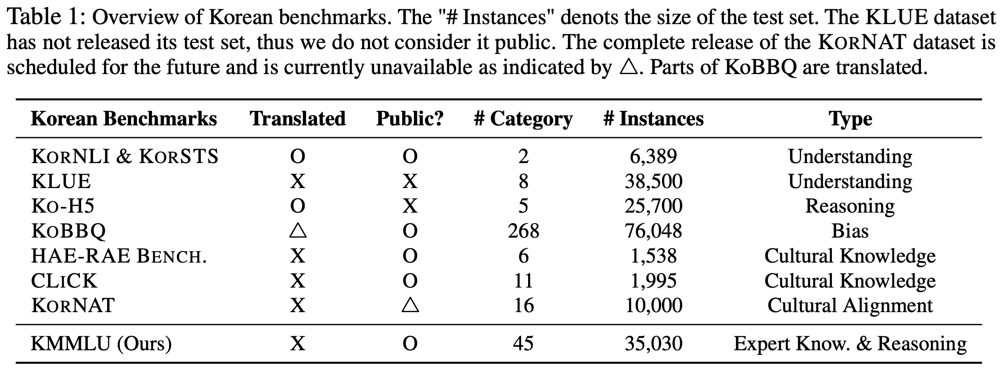
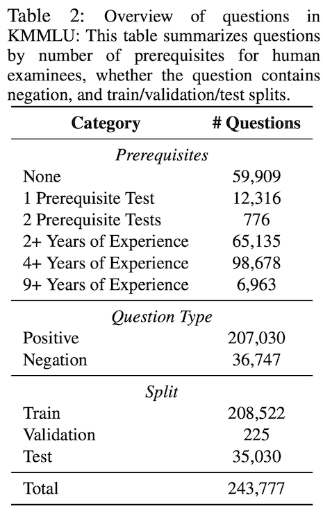
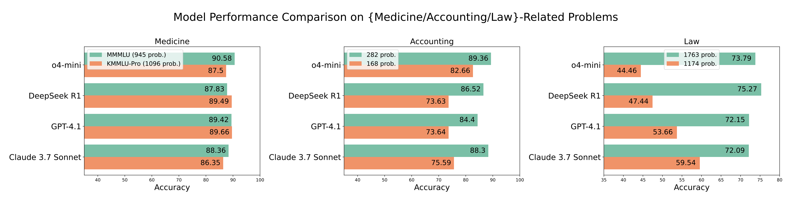

# KMMLU/KMMLU-Redux/KMMLU-Pro Dataset

## **1. KMMLU**

***

### **1.1. 데이터셋 개요 및 개발 배경**

<figure><figcaption></figcaption></figure>

* KMMLU는 한국어로 된 전문가 수준의 다중 선택형 문제 (multiple-choice questions) 벤치마크로, 총 35,030개의 질문을 포함하며 45개 과목(인문/사회, STEM, 응용과학, 기타)에 걸쳐 있음
* 기존의 한국어 벤치마크들이 주로 영어 기반 벤치마크(MMLU 등)를 번역한 것이었고, 번역 시 문장 자연성 저하, 문화적/제도적 문맥 미반영, 번역 오류 가능성 등의 한계가 존재한다는 점이 동기
* 따라서 본 연구에서는 원문 한국어 시험(예: 공무원 PSAT, 한국 면허시험(Korean License Tests), 대학수학능력시험(CSAT) 등)에서 직접 수집하여, 한국어 고유의 언어적·문화적 맥락을 반영하고 번역 기반 편향을 피하고자 함.
* 또한, 공개된 평가 코드(evaluation harness)를 EleutherAI의 [LM-Eval-Harness](https://app.gitbook.com/u/A81uOOpezEhPlFs0xy0rsEctTSP2)와 연동하여 공개함으로써 reproducibility 확보

### **1.2. 데이터셋 구성**

* **총 35,030개의 테스트 질문**, 전체 데이터 수는 약 243,777개 (train + validation + test)
* 분야별 구성은 45과목: STEM (자연과학/기술/공학/수학), 응용과학 (예: 항공공학, 가스 기술 공학, 지적제도 등 산업관련 과목), HUMSS (인문·사회 관련 과목: 역사, 심리, 회계, 정치사회 등), 기타 과목 (문화, 식품가공, 농업과학, 건강 등)
* human accuracy data (실제 응시자 성적)도 확보 가능한 시험들(전체의 약 90%)로부터 수집하였으며, 평균 인간 정확도는 약 62.6%이다.
* 통상 면허시험(pass 기준 80% 이상), PSAT 평균 합격자 점수 약 83.7% 등을 참조하여, KMMLU 상에서 80% 이상 성적을 내는 것은 인간 전문가 수준에 근접한 성능으로 간주할 수 있다.
* 데이터 분할은 **train (208,522), validation (225, few-shot exemplar용), test (35,030)**
* few-shot exemplars: 각 subject마다 5문제씩 CoT (chain-of-thought) reasoning exemplar 확보 (총 225 exemplars)

### **1.3. 데이터셋 구축 방법**

<figure><figcaption></figcaption></figure>

* 출처: 533개의 다양한 시험 출처 (PSAT, Korean License Tests, CSAT)에서 자동 크롤링을 통해 초기 371,002문항 수집.
* 후처리 필터링 및 정제:
  * parsing 오류, 중복 질문 제거, 비정상 옵션 개수(4개 미만 혹은 4개 초과) 조정, stopwords/regex, model-based classifier 등을 활용한 필터링 적용 → 약 34% 감소 (371,002 → 243,777)
  * 중복성 높은 문제(예: 계절별 반복 출제되는 문제 등) 제거
  * 인간 응시자 성과 데이터 확보 가능한 시험 중심으로 선별; 응답 분포, 난이도 고려
* 저작권 검토 및 내용 교정:
  * Test 및 Validation 세트에 대해 manual review 수행하여 저작권 문제가 있는 문항 제거 (147문제 대체) 및 오류 발견된 741문제 수정 (커뮤니티 피드백 기반)
* 데이터 누수(leakage) 가능성 검토: Xu et al.(2024) 방식; Alpaca-Eval ([https://github.com/tatsu-lab/alpaca\_eval](https://github.com/tatsu-lab/alpaca_eval)) 에 따라 benchmark leakage 분석 수행 → open/proprietary 모델 모두 KMMLU 질문을 recall하지 못함 → 데이터 누수 가능성 낮음 판단됨
* CoT exemplars 생성:
  * GPT-4, HyperCLOVA X 두 LLM, zero-shot CoT 및 browsing-augmented CoT prompt 방식 적용
  * 각 input에 대해 4 × 10가지 reasoning path (2 LLM × 2 prompting 방식 × oversample 10) 생성 → self-consistency로 majority vote → 상위 4개 rationales 선별 → 저자 manually 검토 → 각 문항마다 2명의 검토자 배치, 약 87% 일치율 후 반복 검증하여 최종 선정
* HARD subset (KMMLU-HARD):
  * GPT-3.5 TURBO, GEMINI PRO, HYPERCLOVA X, GPT-4 중 적어도 한 개 이상의 모델이 틀린 문항을 대상으로, 각 과목당 최소 23\~100문항씩 균등 분배하여 총 4,104문항 구성

### **1.4. 실험 결과 요약**

* 평가 방식: 5-shot few-shot setting, Direct prompting (greedy decoding) vs CoT prompting (chain-of-thought) 비교
* 평가 모델: 총 27개 모델 (다국어 사전학습 모델, 다국어 챗 모델, 한국어 사전/계속 학습 모델, 상업용 LLM 포함)
* 주요 성능 결과 (Direct, 5-shot):
  * 다국어 pretrained 모델 예시: LLAMA-2-70B 40.28%, Qwen-72B 약 50.83%
  * 한국어 pretrained 모델: POLYGLOT-KO-12.8B 29.26% 수준 (기본 수준, 랜덤 추측 25% 대비 약간 우위)
  * Continual pretrained 모델: YI-KO-34B 약 50.46% 수준
  * 상업용/프로프라이어터리 모델: GPT-4 최고 59.95%, HYPERCLOVA X 약 53.40% 등
* CoT prompting의 효과:
  * 일부 모델 (특히 HYPERCLOVA X)는 CoT 사용 시 성능 향상 (예: KMMLU-HARD subset 에서 Direct 대비 CoT 평균 17.06% → 27.11%)
  * 다만, 모든 모델에서 CoT가 일관되게 개선을 보이는 것은 아니며, 일부에서는 오히려 성능 하락 (예: Qwen-72B-Chat 등)도 관찰됨
* 규모/컴퓨팅과 성능 상관관계:
  * 더 큰 파라미터 모델, 많은 compute/training tokens을 사용한 모델이 대체로 더 높은 성능을 보여줌 (scaling effect)
* 한국어-특화 모델 대비 다국어 모델의 상대적 우위:
  * POLYGLOT-KO 등의 한국어 특화 모델이 기대만큼 성능이 높지 않은 반면, 영어/중국어 중심으로 학습된 큰 다국어 모델(LLAMA-2, YI, Qwen 등)이 오히려 우수한 성능을 보여주는 경향 있음. 이는 학습 데이터량/compute 예산의 차이가 크기 때문이라고 분석됨
* 분석 결과:
  * KMMLU의 문제는 86.1%가 자연스러운 한국어 표현(natural phrasing), 20.4%가 한국 고유의 문화/제도/법률 지식(korean-specific knowledge)을 요구하며, 번역된 MMLU 대비 더 문화적으로 적합하다는 평가됨
  * KMMLU-HARD subset에서 CoT prompting의 효과를 별도로 분석, HYPERCLOVA X는 CoT가 명확한 성능 향상을 보인 반면 다른 모델은 과목에 따라 성능 편차가 있음

## **2. KMMLU-Redux & KMMLU-Pro**

***

### **2.1. 데이터셋 개요 및 개발 배경**

* 기존 KMMLU가 꽤 규모가 크고 초등학교부터 대학 수준까지의 일반 지식을 평가함으로써 다양한 분야를 포괄하지만, 신뢰성 문제와 데이터 데이터 누수 리스트와 같은 한계가 존재함.
  1. 일부 문항에서 누설된 답변(leaked answers), 불분명한 문제 정의, 잘못된 표기/notation 오류 등 품질 문제 존재
  2. KMMLU의 여러 문항이 학습용 대규모 코퍼스 또는 웹에 이미 유포된 가능성 — 데이터 누수(contamination) 리스크 존재
  3. KMMLU는 학문/산업 관련 시험 등을 다양하게 포함하지만, “실제 산업 응용(professional/industrial)” 수준의 전문 자격시험(professional licensure exams)문항은 충분히 반영하지 못함 (특히 매우 전문화된 라이선스 시험 분야)
* 따라서 이 논문에서는 다음 두 가지 벤치마크를 제안
  * **KMMLU-Redux**: 기존 KMMLU에서 문제점을 식별하여 정제(cleaned)하고 난이도를 조정한 축소판 버전
  * **KMMLU-Pro**: 한국의 국가 전문 면허시험(Korean National Professional Licensure, KNPL) 기반으로, 법률, 회계, 의학 등 14개 전문 분야의 고급 지식을 반영하여 보다 실무적인 전문분야 시험문항들을 포함하는 신규 벤치마크
* 두 벤치마크 모두 **산업/전문성 기반 문제의 적합성을 높이고, 한국어 LLM의 실제 활용 가능성을 평가**할 수 있도록 설계됨

### **2.2. 각 평가 데이터셋 설명**

#### **KMMLU-Redux**

* 기존 KMMLU에서 기술 자격시험(Korean National Technical Qualification, KNTQ) 출제문항 중 문제점을 제거하고 정제한 subset로 **총 2,587문항** 포함
* 다루는 분야는 산업/공학 중심으로, 예: 농림어업, 건축, 전기전자, 환경에너지, 기계, 정보통신, 재료, 안전관리, 광업자원 등 총 13개 이상 (실제 리스트: 농림어업 185, 건축 71, 화학 140, 건설 333, 문화예술디자인방송 119, 전기전자 114, 환경에너지 377, 식품가공 78, 정보통신 185, 기계 270, 경영/회계/사무 34, 재료 262, 광업자원 19, 안전관리 400)
* KNTQ 시험 응시자는 보통 학사학위 소지자 또는 최소 9년 산업 경력자를 요구하므로 난이도가 높고 전문성을 요구한다.
* KMMLU-Redux는 특히 “쉬운 문제”(multiple small LLM들이 정답을 맞춘 문제)를 배제하여 더 어려운/도전적인 문항 중심으로 구성됨. 구체적으로, 7개의 소형 LLM (예: Llama 3.2 3B, Qwen 2.5 3B, Gemma 3 4B IT, Kanana Nano 2.1B Instruct, EXAONE 3.5 2.4B, DeepSeek-R1-Distill-Qwen-1.5B, Ko-R1-7B-v2.1) 중 4개 이상이 맞춘 문제는 제외

#### **KMMLU-Pro**

* 한국의 국가 전문 면허시험(Korean National Professional Licensure, KNPL)에서 실제로 시행된 최신 연도 시험문항 중 다지선택형(MCQA, multiple-choice) 문항을 직접 수집한 벤치마크로 **총 2,822문항** 포함
* 포함된 면허 종류는 총 14개이며, 분야는 법률, 회계/세무, 감정평가/손해사정, 의약 계열(한의사, 의사, 치과의사, 약사, 한약사), 관세사 등이다. (파일럿 리스트: 법무사, 변호사, 공인노무사, 변리사, 공인회계사, 세무사, 관세사, 손해사정사, 감정평가사, 한의사, 치과의사, 약사, 한약사, 의사)
* 문항은 모두 최근 연도 시험 출처이며, 향후 연간 갱신을 통해 최신 시험문항으로 유지될 계획임.
* 텍스트 기반 MCQA만 포함 (이미지를 포함한 문항은 제외)
* 실제 면허 시험 기준(pass 기준: 각 과목 최소 40%, 전체 평균 60% 이상, 일부 면허는 상대평가 기준) 등을 평가 기준으로 반영하여 “LLM이 몇 개 자격시험(pass 기준 충족 가능)” 인지를 측정할 수 있음.

### **2.3. 데이터셋 구축 방법 (KMMLU-Redux & KMMLU-Pro)**

#### **KMMLU-Redux 구축 과정**

1. 기존 KMMLU 데이터셋의 KNTQ 출제문항 전체에서 시작
2. 문제점 진단: 누설된 정답(leaked), 비정확한 notation/표기 오류, 불명확한 문항 정의, 참조 오류(실제 존재하지 않는 자료 참조) 등 식별 및 목록화
3. manual review: 저자들이 직접 모든 후보 문항을 검토하여 문제점 문항 제거 또는 수정, 애매한 문항은 제외
4. 소형 LLM 기반 난이도 필터링: 앞서 언급한 7개 소형 LLM들을 사용해, 4개 이상 모델이 맞춘 문항은 “너무 쉬운” 문항으로 간주하고 제외함 → 난이도 상향 조정
5. 문항 메타데이터 정제 및 표준화: 선택지(option) 개수 4개로 통일, 텍스트 형식 오류 수정, 한글 표현 오류·오탈자 교정 등 수행
6. 데이터 분할: 전체 2,587문항을 MCQA 형태로 구성, 평가용 prompt 및 exemplar 제공

#### **KMMLU-Pro 구축 과정**

1. 대상 면허시험 선정: 한국의 KNPL 시험 중 최근 연도 시행된 면허들 중 multiple-choice 문항이 존재하는 시험들 (14개 면허) 선정
2. 공식 시험 출처로부터 문항 직접 수집: 각 면허 시험의 공식 기관 웹사이트/배포 자료 또는 공개 출제문서에서 MCQA 형태 문항 확보 (공신력/정확성 확보)
3. manual review: 수집된 문항에 대해 저자들이 직접 검토하여 오타/표기 오류, 애매한 문항, 잘못된 참조, 이미지 포함 문제 등을 제거. 특히 이미지 기반 문항이나 descriptive/주관식 문항은 제외됨.
4. pass 기준 반영: 각 면허시험의 공식 기준 (예: 각 과목 최소 점수, 전체 평균 점수 기준, 상대평가 기준 등) 을 수집하여, 각 문항별로 LLM 성능 비교시 해당 기준을 맞추었는지 판단할 수 있도록 구성.
5. 연간 갱신 계획: 향후 시험연도에 따라 주기적으로 문항을 갱신하여 최신성을 유지하고 dataset contamination (이미 유포된 문항 포함 가능성) 리스크를 낮춤.

### **2.4. 실험 결과 요약**

#### **평가 방식**

* KMMLU-Redux 및 KMMLU-Pro 모두 few-shot (5-shot) setting에서 English/Korean prompt 사용
* Direct 방식 (그리디 decoding)과 “Thinking”(chain-of-thought 혹은 reasoning-enhanced prompt, prompt 내 “thinking” 등)을 비교
* 평가 지표: 단순 정확도(accuracy), 그리고 KMMLU-Pro의 경우 LLM이 pass 조건(각 면허시험의 기준) 충족 여부, pass 할 수 있는 면허시험 개수 (# of passed KNPLs) 등을 함께 보고함

#### **주요 성능 결과 (Table 2 참조)**

* KMMLU-Redux: 모델별 정확도
  * 예: o1(OpenAI 모델) 약 81.14% 정확도, Llama-4-Maverick-17B-128E-Instruct 77.58% 등 상위권 모델 존재
  * Spearman 순위 상관계수 ρ ≈ 0.995로, KMMLU와 KMMLU-Redux 성능 분포는 매우 유사하지만 Redux 쪽이 다소 낮은 편 (정제 후 난이도 상승 결과)
* KMMLU-Pro:
  * 정확도(평균 micro-accuracy) 및 pass 개수 기준
  * 예: o1 모델 정확도 약 78.09% (KMMLU-Pro), Claude 3.7 (Thinking 포함) 은 12/14 면허시험 pass, GPT-4.1 등 일부 모델은 최대 10/14 pass 성능 보임
  * 정확도가 높더라도 pass 개수 면에서는 균형 있게 과목별 기준을 충족하지 못해 pass하지 못하는 경우도 있음 (예: 일부 모델은 특정 과목 성적 부족)
* 모델별 비교:
  * 소형 모델(<10B)에서는 KMMLU-Redux 및 KMMLU-Pro 모두 성능이 낮은 편이고, reasoning-enhanced prompt (“thinking”) 사용 시 성능 개선 경향 있음
  * 대형 모델 (>70B)에서는 정확도도 높고 pass 개수도 상대적으로 많음. 예: Qwen3-235B-A22B (w/ thinking) 약 74.49% 정확도, 6/14 면허시험 pass 가능
  * Spearman 상관관계 분석 등을 통해, KMMLU-Redux 성능이 높았던 모델들이 동일한 순위로 KMMLU-Pro에서도 비교적 높은 성능을 보이는 경향 있음 (즉, benchmark 간 rank-consistency 존재)

#### **분야별 분석**

* KMMLU-Redux: 산업·공학 분야 전반적으로 모델 성능이 비교적 양호하나, 광업자원(Mining & Resources), 건축(Architecture) 등 일부 분야에서는 성능 저하가 두드러짐. 이는 해당 분야에 대한 사전 학습 데이터 부족 및 전문용어/제도적 맥락 부족이 원인으로 분석됨.
* KMMLU-Pro:
  * 의학/약학 계열 면허시험(한의사, 치과의사, 약사 등)은 many LLM들이 pass 기준 (각 과목 최소 40%, 전체평균 60%)을 충족하는 경향이 있음
  * 반면, 법률 관련 면허시험 (법무사, 변호사, 공인노무사 등) 및 세무/회계 관련 시험에서는 전반적으로 매우 낮은 성능을 보이며, pass하기 어려운 경우 많음. 이는 한국 법률/세무 체계에 특화된 지식 부족 때문이라는 분석임.
* reasoning budget (추론 시도 횟수 등) 증가 → 전체 정확도 상승 경향 존재 (예: Qwen3, Claude 등) 하지만 일부 면허에서는 reasoning budget 증가에도 의미 있는 성능 향상 없음 (예: Judicial Scrivener, Herb Pharmacist 면허 등)

#### **추가 분석**

* KMMLU-Redux가 KMMLU 대비 정제된 데이터셋이므로, 일부 모델의 성능은 하락했지만 (난이도 상향), 모델 간 순위(rank correlation)에는 큰 변화가 없다는 점이 드러남 (ρ ≈ 0.995)
* KMMLU-Pro vs 번역 기반 벤치마크 비교:
  * 예를 들어 한국어 번역된 MMLU(Korean subset of MMMLU) 대비 KMMLU-Pro에서 성능 격차가 큰 분야는 법률/회계 관련 분야임. 반면 의학/약학 분야는 비교적 도메인 지식이 국제적으로 유사한 영역이기 때문에 격차가 작다는 분석 있음.
* prompt 설계 (“Korean prompt”: “정답을 고르세요 … 당신의 최종 정답은 ABCD 중 하나이고, “정답:” 뒤에 와야 합니다. 차근차근 생각하고 추론하세요.”) 등이 모든 평가에서 동일하게 적용됨, 이를 통해 모델별 비교가 공정하게 이루어짐.

## 3. **KMMLU vs KMMLU-Redux vs KMMLU-Pro 비교 요약**

***


* KMMLU는 첫 한국어 대규모 벤치마크
* KMMLU-Redux는 정제·난이도 강화 버전
* KMMLU-Pro는 전문 면허시험 기반 실무 평가용 벤치마크


<table><thead><tr><th width="100.515625">구분</th><th>KMMLU</th><th>KMMLU-Redux</th><th>KMMLU-Pro</th></tr></thead><tbody><tr><td><strong>개발 배경</strong></td><td>번역 기반 벤치마크의 한계(언어 자연성·문화적 맥락 부족) 극복</td><td>KMMLU 품질 문제(누설, 오류, 쉬운 문항) 보완</td><td>실제 전문 면허시험 기반으로 실무/산업 응용 평가</td></tr><tr><td><strong>데이터 규모</strong></td><td>35,030 test 문항 (총 243k 문항 포함)</td><td>2,587문항</td><td>2,822문항</td></tr><tr><td><strong>출처</strong></td><td>PSAT, 한국 면허시험(KNTQ), CSAT 등 533개 출처</td><td>KMMLU 중 KNTQ 관련 문항 정제</td><td>한국 국가 전문 면허시험(KNPL, 변호사·의사·약사 등 14종)</td></tr><tr><td><strong>분야</strong></td><td>45과목 (STEM, 인문·사회, 응용과학, 기타)</td><td>산업·공학 중심 (농림어업, 전기전자, 기계, 환경에너지 등)</td><td>법률, 회계·세무, 감정평가, 손해사정, 의약 계열 등</td></tr><tr><td><strong>특징</strong></td><td>한국어 원문 시험 기반, 인간 점수 참조, HARD subset 제공</td><td>쉬운 문항 제거 (소형 LLM 7개 중 4개 이상 맞춘 문항 제외), 정제/난이도 상향</td><td>최신 연도 시험문항, pass 기준 반영, 연간 갱신 계획</td></tr><tr><td><strong>구축 방법</strong></td><td>37만→24만 필터링, parsing/중복 제거, human 성적 확보, CoT exemplar 제작, 저작권/오류 수정</td><td>KMMLU 문항 manual review + 소형 LLM 난이도 필터링 + 정제</td><td>KNPL 시험 MCQA 직접 수집, manual review, 이미지 문항 제외, pass 기준 반영</td></tr><tr><td><strong>평가 방식</strong></td><td>5-shot, Direct vs CoT</td><td>5-shot, Direct vs Thinking</td><td>5-shot, Direct vs Thinking, pass 개수 측정</td></tr><tr><td><strong>주요 결과</strong></td><td>GPT-4 약 60%, HyperCLOVA X ~53%, Llama-2 70B ~40%</td><td>상위 모델 정확도 ~77–81%, 기존 KMMLU 대비 다소 낮음(난이도↑)</td><td>상위 모델 정확도 74–78%, 일부 모델은 1012개 면허시험 pass 가능</td></tr><tr><td><strong>의의</strong></td><td>한국어 고유 벤치마크 제시, 다국어 모델 > 한국어 특화 모델 현상 발견</td><td>품질 문제 제거·난이도 조정으로 신뢰성↑</td><td>실무 전문성 평가, LLM의 실제 자격시험 통과 가능성 측정</td></tr></tbody></table>

## 4. Korean Benchmark Results

***

* KMMLU는 5-shot Direct, Redux/Pro는 논문 기본 세팅(대체로 zero-shot CoT, 일부 영어 프롬프트 전환) 기준
* KMMLU(학술·산업 전반)에선 GPT-4 ≈ 60%, HyperCLOVA X ≈ 53%, Qwen-72B ≈ 51%로 **여지 존재**
* Redux와 Pro에선 o1/Claude/GPT-4.1급이 상위권이며, Claude 3.7(Thinking)이 12/14 면허 합격으로 최다
* SLM은 의료 계열에서 일부 합격 사례가 있으나, 법·세무 계열은 전반적으로 난항.

### Accuracy Summary

#### **LLM**

| Model                     | KMMLU     | KMMLU-Redux | KMMLU-Pro | Pro 합격 면허 수         |
| ------------------------- | --------- | ----------- | --------- | ------------------- |
| **GPT-4**                 | **59.95** | —           | —         | —                   |
| **GPT-4.1**               | —         | **75.86**   | **72.99** | **10 / 14**         |
| **o1**                    | —         | **81.14**   | **78.09** | **10 / 14**         |
| **o3**                    | —         | **79.92**   | **73.60** | **9 / 14**          |
| **o4-mini**               | —         | **75.80**   | **69.65** | **6 / 14**          |
| **Claude 3.7 Sonnet**     | —         | **76.88**   | **74.52** | **10 / 14**         |
| **Claude 3.7 (Thinking)** | —         | **79.36**   | **77.70** | **12 / 14** ← 최다 합격 |
| **Grok-3**                | —         | **72.90**   | —         | —                   |
| **Grok-3-mini**           | —         | **71.47**   | —         | —                   |
| **HyperCLOVA X**          | **53.40** | —           | —         | —                   |
| **Gemini Pro**            | **50.18** | —           | —         | —                   |
| **Qwen-72B**              | **50.83** | —           | —         | —                   |
| **Llama-2-70B**           | **40.28** | —           | —         | —                   |

출처: KMMLU 본문 Table 3(평균 정확도)  , KMMLU-Redux/Pro 본문 Table 2(정확도·합격 수)&#x20;

#### **SLM**

| Model                     | KMMLU-Redux | KMMLU-Pro | Pro 합격 면허 수 |
| ------------------------- | ----------- | --------- | ----------- |
| **Qwen3-8B (Thinking)**   | **58.79**   | **55.27** | **3 / 14**  |
| **Qwen3-8B**              | **49.25**   | **46.92** | **1 / 14**  |
| **Gemma 3 12B IT**        | **46.70**   | **45.82** | **2 / 14**  |
| **Phi-4 (14B)**           | **49.75**   | **45.32** | **1 / 14**  |
| **Llama 3.1 8B Instruct** | **31.89**   | **33.81** | **0 / 14**  |
| **Gemma 3 4B IT**         | **25.09**   | **32.86** | **0 / 14**  |
| **Llama 3.2 3B Instruct** | **17.59**   | **25.53** | **0 / 14**  |
| **Ko-R1-7B-v2.1**         | **41.94**   | **38.70** | **1 / 14**  |

참고: Redux↔Pro 성적/순위 상관 높음(ρ≈0.995)

### 4.2. 도메인별 성능 경향

<figure><figcaption></figcaption></figure>

* **의학·약학 계열:** 최신 대형 LLM들은 pass 기준 충족 → 실제 실무 활용 가능성 ↑
* **법률·세무·회계 계열:** 여전히 낮은 성능으로 난공불락 → 한국 특화 법령·제도 지식 부족
* **Redux(산업기술):** 난이도 강화 → 광업/건축/안전관리 분야에서 성능 격차 확대
* **SLM:** 일부 의약 분야 제외, pass 성적 거의 불가능

#### KMMLU

* **STEM (수학·물리·공학 등)**
  * GPT-4: 평균 59.7% (수학/화학은 상대적으로 낮고, 생물/지구과학은 비교적 양호)
  * LLaMA-2-70B: 약 40%
  * 한국어 특화 Polyglot-Ko: 29% (STEM 전체 난항)
* **인문·사회 (역사, 정치, 경제 등)**
  * GPT-4: 62\~65% (한국사 등 한국 특화 과목은 여전히 낮음)
  * HyperCLOVA X: 약 53%
  * Gemini Pro: 50% 전후
* **응용과학 (법률·회계·의학 관련 자격시험 과목)**
  * GPT-4: 55% 내외 (법률·세무 낮음, 보건계열 상대적으로 높음)
  * 한국어 특화 모델: 여전히 낮음 (랜덤 추측보다 약간 높음 수준)

#### **KMMLU-Redu**

* **전기전자 / 기계 / 건설 / 환경에너지**
  * 대형 모델(o1, Claude 3.7, GPT-4.1): **70\~80%대 정확도**
  * 중소형 모델(Qwen-8B, Gemma-12B): **40\~55%대**
  * 초소형 모델(Llama-3.2 3B): 20% 이하
* **광업자원 / 건축 / 안전관리**
  * 전체적으로 성능 저하 두드러짐
  * 예: Claude 3.7 Sonnet도 60% 미만, 소형 모델은 30% 이하
* **식품가공 / 농림어업**
  * 상위 모델(o1, GPT-4.1)은 75% 이상
  * SLM은 40% 전후

#### **KMMLU-Pro**

* **의약 계열 (의사·치과·한의사·약사·한약사)**
  * Claude 3.7 (Thinking): **합격 가능 (pass 기준 충족)**
  * GPT-4.1, o1: 대체로 70% 이상, pass 가능
  * 일부 SLM(Qwen-8B, Gemma-12B): **약사·한약사에서 제한적으로 pass**
* **법률 계열 (변호사·법무사·공인노무사·변리사)**
  * 대부분의 모델이 **낮은 성적 (40\~55%)**
  * pass 기준(과목별 40% 이상, 전체 평균 60%) 충족 어려움
  * o1, Claude 3.7도 **법률 계열 합격은 거의 실패**
* **회계/세무/관세/감정평가·손해사정**
  * 대형 모델도 **55\~65%대** → 합격 기준 충족 어려움
  * 세무사/회계사 시험은 거의 모든 모델이 실패
* **관세사/손해사정사/감정평가사**
  * GPT-4.1, Claude 3.7은 일부 시험 합격 가능성
  * SLM은 거의 전부 탈락

## References

* KMMLU: [https://arxiv.org/pdf/2402.11548](https://arxiv.org/pdf/2402.11548)
* KMMLU-Redux & KMMLU-Pro: [https://arxiv.org/pdf/2507.08924](https://arxiv.org/pdf/2507.08924)&#x20;

