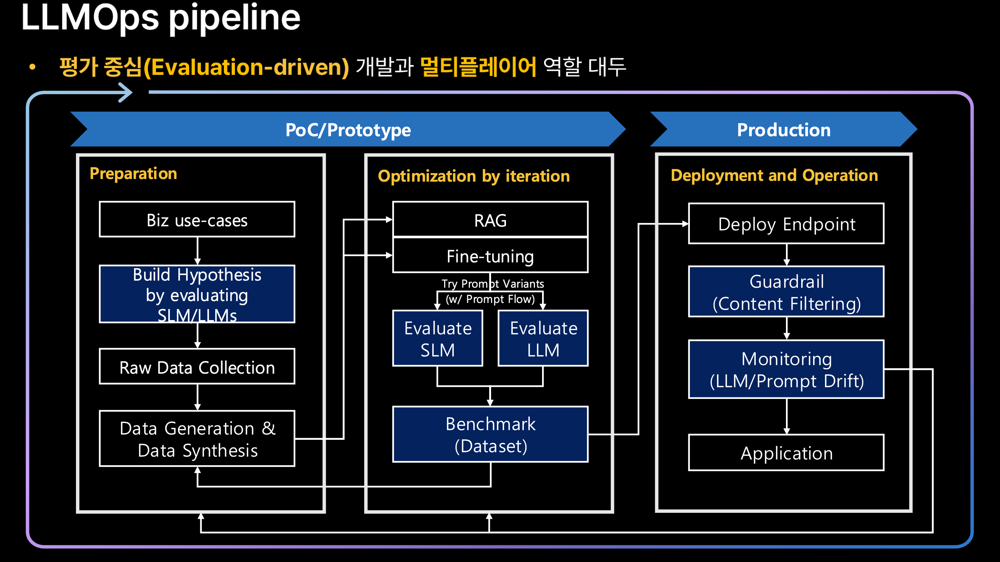

# Overview


[https://wandb.ai/onlineinference/genai-research/reports/LLM-evaluation-Metrics-frameworks-and-best-practices--VmlldzoxMTMxNjQ4NA#w\&b-weave-in-llm-evaluation](https://wandb.ai/onlineinference/genai-research/reports/LLM-evaluation-Metrics-frameworks-and-best-practices--VmlldzoxMTMxNjQ4NA#w\&b-weave-in-llm-evaluation) 의 내용을 기반으로 LLM 평가 개요 작성


## 0. Background: 평가의 중요성

***

### Road to Production: Evaluation-driven LLMOps

<figure><figcaption></figcaption></figure>

### 평가 방법과 의의

* 보통 LLM을 벤치마크 데이터셋의 모든 예제에 대해 **제로샷** 또는 **퓨샷**으로 실행하고, 정확도나 F1 점수 등 지표를 계산함.
* 자동화된 벤치마크는 **표준화되고 객관적**이며, 여러 모델을 직접 비교할 수 있음.
* 시간이 지남에 따라 모델 성능 향상을 추적할 수 있고, 기초적인 언어 이해 능력 여부를 판단하는 데 필수

### 루브릭(Rubric)

* 루브릭은 평가를 위한 가이드라인/기준표로 각 항목별로 무엇이 좋은 성과이고, 무엇이 부족한 성과인지 명확하게 정의함. 학교에서 선생님이 학생들의 과제를 채점할 때 사용하는 채점표로 비유할 수 있음
* 예: 초등학교에서 '내가 좋아하는 동물' 발표를 할 때 선생님은 다음과 같은 루브릭을 만들 수 있음.
* **발표 내용** (30점)
  * 우수(30점): 동물에 대한 사실이 5개 이상, 모두 정확함
  * 보통(20점): 동물에 대한 사실이 3-4개, 대부분 정확함
  * 미흡(10점): 동물에 대한 사실이 2개 이하, 부정확한 정보 포함
* **발표 태도** (20점)
  * 우수(20점): 목소리가 크고 명확하며, 청중과 눈 맞춤 유지
  * 보통(10점): 목소리는 들리지만 가끔 작아짐, 일부 눈 맞춤
  * 미흡(5점): 목소리가 너무 작고, 눈 맞춤 거의 없음
* LLM 평가에서의 루브릭은 AI 모델이 사용자와 대화할 때 생성하는 응답을 평가하기 위한 기준표로 쉽게 말해서, "이 AI의 대답이 합격인지 불합격인지 어떻게 판단할까?"에 대한 명확한 기준을 정해둔 것임.
* 예를 들어 "Tool Call" 루브릭에서는:
  * AI가 올바른 기능을 선택했는가?
  * 필요한 정보를 정확히 추출했는가?
  * 사용자가 말하지 않은 정보를 마음대로 만들어내지는 않았는가?
* 루브릭이 중요한 이유:
  1. **객관성**: 여러 평가자가 동일한 기준으로 평가할 수 있음
  2. **일관성**: 모든 AI 모델을 같은 기준으로 평가할 수 있음
  3. **명확성**: 어떤 부분이 잘했고, 어떤 부분이 개선이 필요한지 정확히 알 수 있음
  4. **피드백**: AI 개발자들에게 구체적인 개선 방향을 제시할 수 있음
* **과적합 문제**: 공개된 벤치마크 데이터가 학습 데이터에 포함되면 점수가 부풀려질 수 있음.
* **현실 세계 성능과의 괴리**: 벤치마크에서 높은 점수를 받아도 실제 대화나 응용에서 실수를 할 수 있음.
* **굿하트 법칙(Goodhart's Law)**: 벤치마크가 목표가 되면 모델이 벤치마크 특성에 맞춰 최적화되어 진정한 능력과는 다를 수 있음.
* 따라서 **새롭고 다양한 평가 방법**을 지속적으로 개발할 필요가 있음.

## 1. Key metrics for LLM evaluation

***

### 1.1. Traditional Statistical Metrics

* Accuracy/Precision/Recall/F1/Exact Match – did the model get the correct answer or complete the task?
* Perplexity – how well does the model predict text?
* N-gram overlap metrics (bleu, rouge, etc.) – how much does output match a reference text?

<table><thead><tr><th width="149.140625">지표명</th><th width="362.48828125">설명</th><th>특징 및 한계</th></tr></thead><tbody><tr><td><strong>Perplexity</strong></td><td>언어 모델이 주어진 데이터를 얼마나 잘 예측하는지 평가하는 지표로, 테스트 데이터의 평균 음의 로그 가능도의 지수값. 값이 낮을수록 모델이 데이터를 덜 ‘놀랍게’ 여겨 더 좋은 적합도를 의미미함. 예를 들어, perplexity가 20이면 평균적으로 단어를 20가지 중 하나를 고르는 것만큼 불확실하다는 뚯임.</td><td>- 학습 중이나 모델 간 비교에 주로 사용 - 낮을수록 좋음 - 문법적/의미적 정확성 평가 불가 - 실제 유용성 판단 불가</td></tr><tr><td><strong>BLEU (Bilingual Evaluation Understudy)</strong></td><td>기계 번역 평가에 개발된 정밀도 기반 지표로, 생성 문장과 하나 이상의 기준 문서 간 n-그램(연속된 n개의 단어) 겹침 정도를 측정. BLEU 점수가 높으면 기준 문장과 유사한 구문을 많이 포함한 것으로 간주함.</td><td>- 특정 기준 문장과 비교에 효과적 - 창의적 재구성이나 다양한 표현에 불리 - 단일 정답이 없는 자유 생성에는 적합하지 않음</td></tr><tr><td><strong>ROUGE (Recall-Oriented Understudy for Gisting Evaluation)</strong></td><td>주로 요약 평가에 사용되는 지표로, 기준 문서의 n-그램 중 생성 문장에 포함된 비율(재현율) 측정. ROUGE-L은 가장 긴 공통 부분수열(Longest Common Subsequence)을 통해 문장 구조 유사성 평가</td><td>- 요약에서 정보 포착 정도 평가에 적합 - 계산이 간단하고 기준 문서 필요 - 문맥 일관성, 사실 정확성 평가 불가</td></tr><tr><td><strong>METEOR (Metric for Evaluation of Translation with Explicit ORdering)</strong></td><td>BLEU의 한계를 보완하기 위해 고안된 지표로, 어간(stem)과 동의어(synonym)를 포함해 유연하게 단어를 매칭함. 정밀도와 재현율을 모두 고려하며, 단어 순서 차이에 페널티를 부과함.</td><td>- BLEU보다 인간 평가와 상관관계가 높음 - 0~1(또는 0~100%) 점수로 표현 - 다양한 표현 인정</td></tr></tbody></table>

한계점

* **기준 문서 필요성:** 대부분 참조 답안(ground truth)이 있어야 평가 가능. 자유로운 대화나 창의적 생성에는 적용 어려움
* **표면적 유사성 평가:** 의미는 같지만 다른 표현은 낮게 평가하거나, 기준 문장을 그대로 복붙해도 높은 점수 획득 가능
* **사실성·논리성 미반영:** 문법은 맞아도 사실이 틀리면 점수가 높을 수 있음
* **과최적화 위험:** 지표에 맞추기 위한 ‘게임’ 학습 유도 가능

### 1.2. Model-based Evaluation metrics

기존의 단순한 overlap 기반 평가 지표(예: BLEU, ROUGE)는 텍스트의 의미를 충분히 반영하지 못하는 한계가 있음. 이를 극복하기 위해, LLM 기반 평가를 활용해 출력 결과의 품질을 더 정교하게 판단함.

<table><thead><tr><th width="161.01953125">평가 지표</th><th width="226.16015625">설명</th><th>특징 및 장점</th></tr></thead><tbody><tr><td><strong>BERTScore</strong></td><td>BERT의 사전학습된 임베딩을 활용해 후보 문장과 기준(reference) 문장 간 의미적 유사성을 평가</td><td>단어 간 벡터 유사도 기반 정밀도, 재현율, F1 점수 산출. 의미 기반 평가로 BLEU/ROUGE보다 인간 평가와 상관관계가 높음</td></tr><tr><td><strong>COMET</strong></td><td>Unbabel에서 개발한 기계번역(MT) 평가용 신경망 모델</td><td>원문, 번역, 기준 번역을 입력받아 인간 평가와 유사한 품질 점수를 예측. 오역 등 단순 겹침 지표가 놓치는 오류 포착 가능</td></tr><tr><td><strong>BLEURT, PRISM, BARTScore</strong></td><td>다양한 사전학습 모델을 활용한 학습 기반 평가 지표들</td><td>BLEURT는 BERT 미세조정, PRISM은 다국어 모델, BARTScore는 BART 기반 재구성 확률 이용. 모두 의미적 평가 강화</td></tr><tr><td><strong>GPT Score / LLM 기반 평가</strong></td><td>GPT-3, GPT-4 같은 대형 언어 모델을 직접 평가자로 활용</td><td>GPT-4에 평가 기준과 체인 오브 사고(chain-of-thought) 설명을 포함한 프롬프트를 줘 점수 및 이유를 산출. 인간 평가와 높은 일치율</td></tr></tbody></table>

* **BERTScore**는 단어의 정확한 일치가 아니라 의미적으로 유사한 단어를 찾아 점수 부여. 예를 들어, "자동차"와 "차"는 다르지만 비슷한 의미이므로 높은 점수를 받을 수 있음.
* **COMET**은 기계번역 품질 평가를 위해 인간 평가 데이터를 학습해, 단순 겹침이 아닌 문맥과 번역 오류까지 평가
* **BLEURT, PRISM, BARTScore** 등은 다양한 사전학습 모델을 활용해 텍스트 품질을 평가하며, 각기 다른 방법론으로 의미적 적합성, 문법, 유창성 등을 반영.
* **GPT Score / LLM 기반 평가**는 GPT-4 같은 강력한 언어 모델을 평가자로 사용하여, 문장 논리성, 명확성, 적합성 등을 사람이 직접 평가하듯 판단함.

장점 및 한계

| 장점                                                                                                      | 한계                                                                                                                          |
| ------------------------------------------------------------------------------------------------------- | --------------------------------------------------------------------------------------------------------------------------- |
| <ul><li>의미적 적합성, 유창성, 문맥 이해 반영 가능</li></ul><ul><li>인간 평가와 높은 상관관계</li><li>단순 키워드 겹침을 넘는 평가 가능</li></ul> | 

<ul><li>모델 자체의 편향(bias) 반영 가능</li><li>평가 프롬프트 설계에 민감</li><li>평가 모델에 최적화된 답변 생성 위험</li><li>반드시 인간 평가와 병행 필요</li></ul> |

모델 기반 평가 지표들은 기존 BLEU, ROUGE 같은 단순 겹침 지표보다 문장 의미, 문맥, 오류 유형을 더 잘 반영하여 자연어 생성(NLG) 품질을 평가하는 데 유용함. 특히 GPT-4와 같은 LLM을 활용한 평가 방식은 평가 근거를 설명할 수 있어 신뢰도가 높아지고 있음. 다만, 평가 모델의 한계와 편향을 고려해 신중하게 사용해야 하며, 최종 검증은 항상 인간 평가가 필요함.

### 1.3. Human-Evaluated Methods

***

자동 평가 지표의 한계로 인해, LLM 평가에서 인간 평가가 매우 중요. 인간 평가를 통해 **도움됨(helpfulness), 진실성(truthfulness), 자연스러움(naturalness), 선호도(preference), 창의성, 윤리성 평가** 같은 자동화 지표로 측정하기 어려운 품질을 직접 판단할 수 있음. 평가자 간 편차 및 편향, 비용 및 시간 등의 난제가 있지만 장점이 많기에 인간 평가를 통해 자동 지표를 보정하는 것이 좋음.

#### 주요 인간 평가 방법

<table><thead><tr><th width="162.76953125">평가 방법</th><th>설명</th><th>장점</th><th>예시 및 활용</th></tr></thead><tbody><tr><td><strong>선호도 테스트 (Preference Tests, Pairwise Comparison)</strong></td><td>두 모델의 출력(또는 모델과 기준 답변)을 비교해 어느 쪽이 더 좋은지 선택</td><td>평가자가 절대 점수보다 상대적 선호를 판단하기 쉬움, 모델 간 성능 비교에 효과적</td><td>OpenAI, DeepMind 등에서 RLHF(인간 피드백 강화학습)에 활용. GPT-4가 GPT-3.5보다 선호되는지 평가할 때 사용</td></tr><tr><td><strong>라이커트 척도 평가 (Likert Scale Ratings)</strong></td><td>1~5 또는 1~7 등 고정 척도로 여러 기준(품질, 유익성, 해로움 등) 평가</td><td>세밀한 다차원 평가 가능, 평균과 분포로 모델 상태 파악 가능</td><td>챗봇 평가에서 만족도, 정확성, 공손함 등 다중 지표 평가에 사용</td></tr><tr><td><strong>스칼라 또는 순위 점수 (Scalar or Ranked Outputs)</strong></td><td>0~10, 0~100 등 점수 부여 또는 여러 출력 순위 매김</td><td>라이커트 척도보다 자유로운 점수 부여 가능</td><td>긴 요약문 가독성 평가 등에서 활용</td></tr><tr><td><strong>A/B 테스트 (A/B Testing with End Users)</strong></td><td>실제 사용자에게 두 모델을 배포해 클릭률, 만족도 등 실사용 데이터로 평가</td><td>대규모 실사용 평가 가능, 현실적 성공 기준 측정</td><td>검색 질의 응답 모델 신구 버전 비교, 사용자 행동 기반 평가</td></tr></tbody></table>

#### 평가 대상 주요 항목

* **정확성(Accuracy/Correctness):** 사실 오류 여부
* **관련성(Relevance):** 질문과 주제 적합성
* **유창성(Fluency/Naturalness):** 문법, 자연스러운 문장 구성
* **일관성(Coherence):** 논리적 흐름, 이야기 전개
* **유용성(Usefulness):** 답변의 실질적 도움 여부
* **해로움/유해성(Harmfulness/Toxicity):** 공격적, 부적절한 내용 포함 여부
* **공정성(Fairness):** 편향, 고정관념 포함 여부

#### 인간 평가의 한계 및 과제

* **비용과 시간:** 대량 평가가 어렵고 비용이 많이 듦
* **평가자 간 편차:** 주관적 차이 존재, 다수 의견 수렴 및 통계적 분석 필요
* **평가자 편향:** 선호도, 엄격성 차이 등 편향 문제, 다양한 평가자 활용 권장
* **스케일 문제:** 반복적 모델 업데이트 시 대규모 평가가 비효율적

### 1.4. Custom task-specific metrics

LLM(대형 언어 모델)을 특정 용도에 맞게 평가하기 위해, 일반적인 평가 지표로는 다루기 어려운 특수한 목표를 반영한 맞춤형 지표를 개발하는 경우가 많음.

<table><thead><tr><th width="153.60546875">구분</th><th width="440.7265625">설명</th><th>예시 및 참고 링크</th></tr></thead><tbody><tr><td><strong>사실 정확도(Factual Accuracy)</strong></td><td>모델 출력이 실제 사실과 얼마나 일치하는지를 평가하여 허위 정보(환각)를 잡아냄. 단답형 질문의 정답 일치율부터, 지식 그래프 기반 정밀도/재현율, 요약문과 원문 간 사실 일관성 검사(FactCC, Q²) 등이 있음.</td><td>- <a href="https://arxiv.org/abs/1906.01749">FactCC 논문</a> - <a href="https://arxiv.org/abs/2109.07958">TruthfulQA 소개</a></td></tr><tr><td><strong>일관성 및 응집력(Coherence and Consistency)</strong></td><td>긴 텍스트의 논리적 연결성(응집성)과 모순 여부(일관성)를 평가합니다. 예를 들어 이야기 내 캐릭터 묘사가 앞뒤로 달라지는지, 대화 중 답변이 서로 모순되는지 검사</td><td>- <a href="https://cohmetrix.com/">Coh-Metrix 소개</a> - <a href="https://www.aclweb.org/anthology/P07-1015/">Entity Grid 모델</a></td></tr><tr><td><strong>특이성 및 관련성(Specificity / Relevance)</strong></td><td>대화 응답이 질문에 구체적이고 적절한지 확인. USR(Unsupervised and Reference-free evaluation) 지표는 참조 없이도 답변의 특이성과 관련성을 평가하며 임베딩 유사도 비교도 활용함.</td><td>- <a href="https://arxiv.org/abs/2005.00468">USR 평가법</a></td></tr><tr><td><strong>길이 기반 평가(Length-based Metrics)</strong></td><td>답변이나 생성물이 요구하는 길이 조건(간결성 또는 상세함)에 부합하는지 평가. 예: 요약의 압축률, 코드 생성 시 올바른 코드 라인 수 등</td><td></td></tr><tr><td><strong>사용자 참여도(User Engagement)</strong></td><td>대화형 시스템에서 실제 사용자 행동을 통한 간접 지표입니다. 예: 챗봇이 사람 개입 없이 문제를 해결한 비율(Containment rate), 해결 시간, 사용자 만족도 등</td><td>- <a href="https://dl.acm.org/doi/10.1145/3395035">챗봇 평가 방법</a></td></tr><tr><td><strong>안전성(Safety Metrics)</strong></td><td>유해하거나 편향된 출력 비율 측정. 예: 독성 탐지기 사용, 민감한 질문에 대한 편향 분석 등</td><td>- <a href="https://arxiv.org/abs/1903.04561">독성 탐지 연구</a> - <a href="https://arxiv.org/abs/1906.02537">편향 평가</a></td></tr><tr><td><strong>코드 특화 평가(Code-specific Metrics)</strong></td><td>코드 생성 모델 평가에 사용. 단위 테스트 통과율, 프로그래밍 문제 해결률(LeetCode, Codeforces) 등이 대표적임.</td><td>- <a href="https://leetcode.com/">LeetCode</a> - <a href="https://codeforces.com/">Codeforces</a></td></tr></tbody></table>

맞춤형 지표의 중요성

* **목표 정렬성**: 일반 지표(BLEU, ROUGE 등)는 문법이나 표면적 유사성 중심이지만, 맞춤형 지표는 실제 시스템 목표(논리적 일관성, 사실성 등)를 직접 측정
* **도메인 지식 활용**: 특정 분야나 작업에 특화된 평가가 가능하며, 추가 도구(분류기, 테스트 하니스 등)를 구축해야 할 수도 있음.
* **검증 필요성**: 맞춤형 지표는 표준 지표만큼 엄격하게 검증되지 않은 경우가 많아, 샘플 출력에 대한 수동 검토가 병행됨.
* **종합 평가**: 일반 지표와 맞춤형 지표를 함께 쓰면 평가의 신뢰성과 포괄성이 높아짐.

## 2. LLM Benchmark Dataset

***

### 2.1. 벤치마크 유형

| 벤치마크 유형                            | 목적                        | 평가 항목                | 평가 방법          | 대표 벤치마크셋                                   |
| ---------------------------------- | ------------------------- | -------------------- | -------------- | ------------------------------------------ |
| 핵심 지식 벤치마크 (Core-knowledge)        | LLM의 기본 지식 및 문제 해결 능력 평가  | 짧은 정답, 선택형 문제        | 정답 매칭 및 자동 검증  | MMLU, HellaSwag, ARC, GSM8K, AGIEval 등     |
| 지시 이행 벤치마크 (Instruction-following) | 다양한 지시 사항 이행 능력 평가        | 지시사항 준수, 응답 다양성      | 지시 기반 응답 평가    | Flan, Self-instruct, NaturalInstructions 등 |
| 대화형 벤치마크 (Conversational)          | 멀티턴 대화에서의 상호작용 및 대화 흐름 평가 | 대화 자연스러움, 유용성, 문맥 유지 | 대화 기록 및 사용자 평가 | CoQA, MMDialog, OpenAssistant, G-Eval 등    |

출처: [https://arxiv.org/pdf/2306.05685](https://arxiv.org/pdf/2306.05685)

### 2.2. 벤치마크 데이터셋

**1. 일반 언어 이해 및 추론 벤치마크**

<table><thead><tr><th width="140.3984375">벤치마크명</th><th>설명</th><th width="140.88671875">주요 평가 대상</th><th>특징 및 활용</th></tr></thead><tbody><tr><td><a href="https://super.gluebenchmark.com/">GLUE / SuperGLUE</a></td><td>자연어 이해의 기초 능력을 평가하기 위한 벤치마크. SuperGLUE는 GLUE보다 어려운 문제를 포함하여 모델의 심화 이해력을 점검함.</td><td>감성 분석, 질문 응답, 문장 유사도 등</td><td>GPT-3 이상의 모델은 인간 수준의 성능을 달성하며, 기초 능력 점검 및 연구 개발에 유용함.</td></tr><tr><td><a href="https://crfm.stanford.edu/helm/latest/">HELM (Holistic Evaluation of Language Models)</a></td><td>모델의 정확도, 강건성, 공정성, 편향, 독성, 효율성 등 다차원 평가 프레임워크 제공.</td><td>다각적 평가 (정확도, 안정성, 윤리적 측면 등)</td><td>모델의 전반적 품질을 포괄적으로 평가하기 위해 연구와 실제 응용 사이의 갭을 메우는데 활용됨.</td></tr><tr><td><a href="https://rajpurkar.github.io/SQuAD-explorer/">SQuAD (Stanford Question Answering Dataset)</a></td><td>위키피디아 기반의 문서에서 주어진 질문에 대해 정확한 답을 도출하는지 평가.</td><td>문서 이해 및 정확한 답 생성</td><td>자연어 질의응답 시스템의 성능 평가에 널리 사용됨.</td></tr><tr><td><a href="http://www.statmt.org/wmt25/">WMT (Workshop on Machine Translation)</a></td><td>기계 번역 품질 평가를 위한 국제 공모전 및 벤치마크 데이터셋.</td><td>번역 정확도, 자연스러움 및 유창성</td><td>기계 번역 연구의 표준 벤치마크로, 번역 시스템 평가 및 개선에 활용됨.</td></tr></tbody></table>

**2. 다중 선택 및 전문/추론 능력 평가 벤치마크**

<table><thead><tr><th width="149.015625">벤치마크명</th><th>설명</th><th width="151.42578125">주요 평가 대상</th><th>특징 및 활용</th></tr></thead><tbody><tr><td><a href="https://github.com/hendrycks/test">MMLU (Massive Multitask Language Understanding)</a></td><td>57개 다양한 주제의 다중 선택 문제를 통해 광범위한 상식, 전문 지식 및 추론 능력 평가.</td><td>역사, 문학, 수학, 생물학 등</td><td>GPT-4의 높은 점수가 모델의 광범위한 지식 및 추론 능력을 증명하는 지표로 활용됨.</td></tr><tr><td><a href="https://arxiv.org/abs/2406.01574">MMLU Pro</a></td><td>MMLU를 기반으로 전문 분야 및 실무 중심 문제를 추가하여 평가.</td><td>전문 지식 및 실무 적용 능력</td><td>실무 및 전문 분야 문제를 포함하여 모델의 실제 업무 활용 가능성을 평가하는 데 유용함.</td></tr><tr><td><a href="https://rowanzellers.com/hellaswag/">HellaSwag</a> / <a href="https://leaderboard.allenai.org/winogrande">WinoGrande</a></td><td>상식 및 논리 추론 문제를 통해 일상적 추론 및 문맥 해석 능력 평가.</td><td>이야기 이어가기, 물리 상식, 대명사 해석 등</td><td>특히 대형 모델에서 성능이 점차 개선되는 추세이며, 상식 추론 테스트로 자주 활용됨.</td></tr><tr><td><a href="https://github.com/google/BIG-bench">BIG-bench (Beyond the Imitation Game)</a></td><td>200여 개의 창의적, 도전적 과제를 포함한 매우 다양한 평가 항목 제공.</td><td>수학, 논리, 고대 언어 번역 등</td><td>기존 벤치마크로 평가하기 어려운 다채로운 능력(창의성, 추론 등)을 탐색하는 데 적합함.</td></tr><tr><td><a href="https://github.com/suzgunmirac/BIG-Bench-Hard">BBH (Big-Bench Hard)</a></td><td>BIG-bench 내 어려운 문제들을 선별하여, 고난도 추론 및 다단계 문제 해결 능력 평가.</td><td>복잡한 추론, 다단계 문제</td><td>MMLU보다 더 어려운 문제들을 포함, 고난도 추론 능력 평가에 특화됨.</td></tr><tr><td><a href="https://arxiv.org/abs/1903.00161">DROP (Discrete Reasoning Over Paragraphs)</a></td><td>긴 지문에서 숫자, 논리 및 복합적 관계를 파악해 수리적 추론을 요구하는 문제들 제공.</td><td>텍스트 내 수리적 추론 및 계산 문제</td><td>숫자 추출과 계산, 논리적 사고를 동시에 평가할 수 있어 복합 추론 능력 측정에 유용함.</td></tr><tr><td><a href="https://github.com/openai/grade-school-math">GSM8K (Grade School Math 8K)</a></td><td>초등학교 수준의 8,000개 수학 문제를 통해 단계별 풀이 및 추론 과정을 평가함.</td><td>수학 문제 해결, 논리적 추론</td><td>단계별 풀이 요구를 통해 모델의 수학적 추론 및 계산 능력을 정밀하게 평가할 수 있음.</td></tr><tr><td><a href="https://arxiv.org/abs/2109.07958">TruthfulQA</a></td><td>모델이 사실과 허위 정보를 구분하고 진실성 있는 답변을 생성하는지 평가.</td><td>사실 정확성, 편향 및 오류 탐지</td><td>모델이 허위 정보를 피하고, 진실에 기반한 답변을 내놓는지 평가하는 데 중점을 둠.</td></tr></tbody></table>

**3. 코드 생성 및 프로그래밍 능력 평가 벤치마크**

<table><thead><tr><th width="169.3203125">벤치마크명</th><th>설명</th><th width="137.2265625">주요 평가 대상</th><th>특징 및 활용</th></tr></thead><tbody><tr><td><a href="https://github.com/openai/human-eval">HumanEval: LLM Benchmark for Code Generation</a></td><td>자연어 설명을 기반으로 코드를 생성하고, 테스트 케이스를 통과하는지 평가.</td><td>코드 생성, 디버깅 및 최적화</td><td>오픈AI의 평가 지표로, 코드 생성 및 이해의 전반적 능력을 비교 평가하는 데 활용됨.</td></tr><tr><td><a href="https://github.com/google-research/google-research/tree/master/mbpp">MBPP (Mostly Basic Python Programming)</a></td><td>주로 기초 수준의 파이썬 프로그래밍 문제 모음을 통해 모델의 기본 코드 작성 능력 평가.</td><td>파이썬 코드 작성, 문제 해결</td><td>기초 문제 중심으로 구성되어 있어, 모델의 기본 프로그래밍 능력을 점검하는 데 적합함.</td></tr></tbody></table>

**4. 지시 이행 벤치마크**

<table><thead><tr><th width="147.29296875">벤치마크명</th><th width="221.01171875">설명</th><th width="154.0546875">주요 평가 대상</th><th>특징 및 활용</th></tr></thead><tbody><tr><td><a href="https://github.com/google-research/FLAN">Flan</a></td><td>모델이 다양한 지시(Instruction)를 정확하게 이행하는 능력을 평가하는 벤치마크.</td><td>지시 이행, 응답의 정확성 및 창의성</td><td>미세조정(fine-tuning) 연구에서 모델의 지시 준수 능력을 점검하는 데 활용됨.</td></tr><tr><td><a href="https://arxiv.org/pdf/2212.10560">Self‑Instruct</a> </td><td>초기 소규모 seed instructions를 바탕으로 GPT 모델이 스스로 추가 지시를 생성하여 만든 데이터셋으로, 모델이 다양한 지시 상황에 대해 스스로 학습할 수 있는 능력을 평가함.</td><td>지시 생성 다양성, 지시 이행 능력, 응답 품질 </td><td>모델이 스스로 데이터셋을 확장하는 방식으로 더 다양한 지시 이행 상황을 반영하며, 연쇄적 자기 개선(self-improvement) 과정을 촉진하여 실제 활용 환경에 가까운 평가 환경을 제공함.</td></tr><tr><td><a href="https://arxiv.org/pdf/2204.07705">Super-NaturalInstructions</a> </td><td>1,600개 이상의 다양한 작업에 대한 지시-응답 쌍을 포함하여 모델의 복잡한 지시 이행 능력을 평가함.</td><td>복잡한 지시 상황, 다도메인 응답 품질</td><td>방대한 데이터셋과 선언적(instructional) 지시를 활용하여, 모델의 일반화 능력과 다양한 분야에서의 응답 생성 및 이해 능력을 정밀하게 평가함.</td></tr></tbody></table>

**5. 대화형 벤치마크**

<table><thead><tr><th width="149.2109375">벤치마크명</th><th width="220.12109375">설명</th><th width="152.24609375">주요 평가 대상</th><th>특징 및 활용</th></tr></thead><tbody><tr><td><a href="https://stanfordnlp.github.io/coqa/">CoQA</a></td><td>다중 턴 대화형 질의응답을 통해 모델의 문맥 이해 및 자연스러운 대화 능력을 평가함.</td><td>대화 흐름, 문맥 유지, 응답 정확도</td><td>자연스러운 대화 평가에 사용되며, 질문-응답 체계의 세밀한 검증이 가능함.</td></tr><tr><td><a href="https://github.com/HLTCHKUST/MMDialog">MMDialog</a></td><td>여러 턴에 걸친 대화 데이터를 기반으로 텍스트와 이미지 등 멀티모달 상호작용을 평가함.</td><td>다중 턴 대화, 멀티모달 상호작용</td><td>텍스트뿐 아니라 시각적 정보도 포함하여 대화형 AI의 포괄적 상호작용 능력을 확인할 수 있음.</td></tr><tr><td><a href="https://github.com/LAION-AI/Open-Assistant">OpenAssistant</a></td><td>오픈 소스 기반의 대화형 에이전트를 평가하기 위한 벤치마크로, 다양한 사용자 인터랙션을 반영함.</td><td>대화 자연스러움, 사용성, 응답 품질</td><td>실제 사용자 데이터 기반 평가로 오픈 소스 에이전트 개발 및 개선에 활용됨.</td></tr><tr><td><a href="https://github.com/lm-sys/FastChat">FastChat</a></td><td>오픈 소스 채팅 평가 플랫폼으로, 다양한 LLM의 멀티턴 대화 성능과 사용자 선호 정렬 정도를 측정함.</td><td>멀티턴 대화, 사용자 선호도, 응답 품질</td><td>대규모 크라우드소싱 및 자동화 평가를 통해 신속하고 확장 가능한 평가를 지원함.</td></tr><tr><td><a href="https://arxiv.org/pdf/2303.16634">G‑Eval</a> </td><td>사전 훈련된 강력한 LLM(예: GPT‑4)을 활용하여, 다중 턴 대화에서 생성되는 응답들의 일관성, 응집력, 문맥 적합성 등을 in‑context meta‑evaluation 방식으로 평가하는 벤치마크.</td><td>다중 턴 대화, 응답 일관성, 문맥 유지 및 상호작용 품질 </td><td>chain‑of‑thought 및 메타 평가 기법을 활용하여, 인간 평가에 근접하면서도 편향을 줄인 자동 평가 방법을 제공하며, 확장성과 비용 효율성을 확보함.</td></tr></tbody></table>

## 3. Human evaluation techniques

***

### 3.1. 인간 평가란?

인간 평가는 모델 출력물에 대해 사람이 직접 평가하는 과정. 자동화된 지표로는 측정하기 어려운 품질, 적합성, 안전성 등을 판단할 때 중요함.

### 3.2. 인간 평가 수행 시기와 방법

* **샘플링**: 모든 출력물을 평가하기 어려우므로, 대표성 있는 샘플(예: 500개 질문-답변 쌍)만 선별해 평가.
* **대표 데이터 사용**: 개발에 사용하지 않은 새로운 데이터(held-out dataset)를 평가하여 편향 없는 결과를 얻음.
* **크라우드소싱**: Amazon Mechanical Turk, Appen, Scale AI 같은 플랫폼에서 다수 평가자를 통해 평가를 받음. 보통 3\~5명이 각 항목을 평가해 다수결 또는 평균 점수 산출.
* **전문가 평가**: 의료, 법률 등 특수 분야는 전문가가 평가해야 하며 비용과 시간이 많이 소요됨.
* **레드팀 평가**: 전문가가 모델의 취약점을 찾아내는 방식으로, 안전성 검증에 쓰임.

### 3.3. 평가 프로토콜

* 명확한 평가 기준(루브릭)을 정해야 함. 예: “더 정확한 답변”, “더 공손한 답변” 등 다차원 평가 가능.
* 블라인드 평가를 통해 평가자의 편향을 줄임. 예: 모델 A, B를 무작위로 섞어 평가.
* 평가 결과는 선호율, 평균 점수, 평가자 간 일치도(Cohen’s kappa, Krippendorff’s alpha 등)로 집계.

### 3.4. 주요 도전 과제

<table><thead><tr><th width="150.74609375">도전 과제</th><th>설명</th></tr></thead><tbody><tr><td>비용 및 확장성</td><td>인간 평가는 비용이 많이 들고 모든 모델 변경 시마다 적용하기 어려워, 주로 주요 비교나 주기적 점검에 사용됨.</td></tr><tr><td>시간 지연</td><td>평가 준비, 실행, 결과 정리까지 수일~수주가 걸려 모델 개선 사이클이 느려질 수 있음.</td></tr><tr><td>품질 관리</td><td>크라우드소싱 시 평가자가 지침을 오해하거나 부실 평가할 수 있어, 테스트 문제로 품질 검증 필요.</td></tr><tr><td>주관성</td><td>창의성 같은 주관적 평가 기준은 평가자 간 의견 차이가 크므로, 객관적 질문이나 대량 샘플로 평균화 필요.</td></tr><tr><td>평가자 편향</td><td>평가자 출신 문화, 언어 등에 따라 평가가 달라질 수 있어, 다양성을 확보하는 것이 바람직함.</td></tr><tr><td>작업 프레이밍</td><td>평가 문구가 평가자 판단에 영향을 줄 수 있으므로 중립적이고 명확한 지침 제공이 중요함.</td></tr></tbody></table>

### 3.5. 실제 활용

* 자동화 지표와 병행하여 사용하며, 자동화 지표는 지속 모니터링, 인간 평가는 주요 마일스톤에서 검증용으로 활용.
* RLHF(인간 피드백을 통한 강화학습)처럼 개발 과정에서도 인간 평가가 직접 모델 개선에 활용됨.
* 윤리적 고려도 필수: 크라우드워커가 유해 콘텐츠에 노출되지 않도록 주의해야 하며, 사전 경고와 선택권 제공 필요.

## 4. LLM-as-a-judge 접근법과 한계

***

**작동 원리**

* 평가자 LLM에 원본 질문과 두 답변(또는 답변 하나와 기준 답변)을 주고 어느 쪽이 더 나은지 선택하거나 점수를 매기도록 요청
* 좋은 프롬프트 설계가 중요하며, 예를 들어 "이상적인 답변은 사실에 근거하고, 간결하며, 공손해야 한다"는 기준 포함 가능.
* 출력은 단순 선택(A 또는 B), 점수(1\~10), 혹은 자세한 설명일 수 있음.
* 특히 **Chain-of-thought prompting**(단계별 추론 유도)이 평가 품질을 높이는 데 효과적임.

**장점**

<table><thead><tr><th width="244.52734375">장점</th><th>설명</th></tr></thead><tbody><tr><td>인간 선호도 근사</td><td>명확한 기준이 있을 때 사람 선호도와 유사한 평가 가능</td></tr><tr><td>일관성</td><td>감정이나 피로 없이 일관된 기준 적용</td></tr><tr><td>속도 및 비용 효율</td><td>한 번 모델이 있으면 수천 쌍도 빠르고 저렴하게 평가 가능</td></tr></tbody></table>

**한계 및 문제점**

<table><thead><tr><th width="243.23046875">한계</th><th>설명</th></tr></thead><tbody><tr><td>불안정성 및 프롬프트 민감도</td><td>평가 프롬프트의 작은 변화에도 결과가 달라질 수 있음</td></tr><tr><td>편향 문제</td><td>훈련 데이터와 사람의 편향을 반영, 형식적이고 장황한 답변 선호 가능</td></tr><tr><td>설명 신뢰성 문제</td><td>LLM이 제시하는 이유가 실제 판단 근거와 다를 수 있음</td></tr><tr><td>점수 매기기 vs 순위 매기기</td><td>절대 점수보다는 두 답변 중 더 나은 쪽을 고르는 쌍별 비교가 더 안정적</td></tr><tr><td>자기 평가 문제</td><td>같은 모델이 자기 출력을 평가하면 관대하거나 오류를 인지 못함</td></tr><tr><td>속임수 위험</td><td>권위적 어조나 가짜 참고문헌 등으로 잘못된 답변이 선호될 수 있음</td></tr></tbody></table>

**대응 방안 및 개선 시도**

* 소수의 인간 평가 예시로 LLM을 보정(few-shot prompting 또는 미세 조정)
* 여러 LLM 평가자의 합의 검증(majority agreement)
* 답변 순서 무작위화 등 위치 편향 감소
* 구조화된 질문으로 평가를 세분화하여 최종 판단에 반영

## 5. Hybrid evaluation methods

***

자동 평가(Automated evaluation)와 인간 평가(Human evaluation)의 장단점을 보완하기 위해 하이브리드 평가 방법이 많이 활용되며, 대부분의 LLM 평가 체계는 어느 정도 하이브리드 방식을 채택하고 있음.

### 5.1. 주요 하이브리드 평가 방식

<table><thead><tr><th width="198.39453125">방식</th><th>설명</th><th>예시 및 효과</th></tr></thead><tbody><tr><td><strong>휴먼-인-루프 + 자동화</strong></td><td>자동화 도구나 LLM 심판이 먼저 결과를 선별·순위 매김 → 인간이 어려운 사례 집중 평가</td><td>예: 1,000개 출력 중 독성 자동검출 → LLM 심판이 coherence 점수 매김 → 하위 100개 + 일부 무작위 샘플을 인간 평가로 검토. 효율성 극대화</td></tr><tr><td><strong>정성적 + 정량적 혼합</strong></td><td>자동 점수(BLEU 등)와 인간 평가 결과를 함께 제시하여 성능을 다각도로 분석</td><td>예: BLEU 점수는 Model Y가 더 높지만 인간 평가는 Model X가 55% 선호. 인간 평가는 사실성 등 질적 요소 반영</td></tr><tr><td><strong>LLM 보조 인간 평가</strong></td><td>긴 텍스트 평가 시 LLM이 요약, 모순 지적 등으로 인간 평가자 지원</td><td>예: 5페이지 스토리에서 LLM이 문제 구간 알려주면 인간이 최종 판단. 평가 속도 향상</td></tr><tr><td><strong>반복 평가 및 개선 사이클</strong></td><td>모델 개발 시 자동 평가 → LLM 비교 → 소규모 인간 평가 → 소규모 사용자 배포 → 실사용 피드백 모니터링 순으로 진행</td><td>단계별 평가를 통해 문제 조기 발견 및 개선 가능</td></tr><tr><td><strong>지속적 피드백 루프</strong></td><td>사용자 평가(예: 답변 유용성 평점)를 자동 분석 → 문제 유형 분류 → 다음 학습/튜닝에 반영</td><td>예: 고객 서비스 챗봇에서 부정적 피드백 자동 집계 및 인간/LLM이 분석하여 개선점 도출</td></tr><tr><td><strong>평가자 앙상블</strong></td><td>여러 자동·인간 평가 기준을 결합하여 종합 평가 수행</td><td>예: 자동 지표 하나라도 개선되고, 인간 평가도 선호하는 모델만 채택. 단일 지표 최적화 위험 회피</td></tr><tr><td><strong>과제 특화 하이브리드 지표</strong></td><td>여러 자동 평가 요소(예: BERTScore, 규칙 위반 감지, 예의 표현 점수)를 조합한 복합 점수</td><td>예: 대화 시스템 평가 시 정확성, 안전성, 예의성 모두 반영하는 점수 산출</td></tr><tr><td><strong>벤치마크 + 인간 창의성 결합</strong></td><td>표준 벤치마크로 약점 진단 → 인간이 새로운 난이도 높은 테스트 케이스 제작</td><td>예: 수학 문제는 잘 풀지만, 인간이 만든 복잡한 퍼즐 문제 추가하여 평가 강화</td></tr></tbody></table>

### 5.2. 구체적 사례: 의료 FAQ 봇 평가

1. 100개 의료 Q\&A 데이터셋에 대해 자동 정확도(F1, Exact Match) 측정
2. BERTScore 같은 의미 유사도 자동 평가
3. 의료 전문가가 50개 답변 직접 검토 (인간 평가)
4. GPT-4 같은 LLM이 전문가 평가 보조 (LLM 심판)
5. 전문가와 LLM 평가 결과 비교, 신뢰도 확인 후 LLM으로 선별 확대
6. 배포 후 사용자 피드백 모니터링 및 문제 답변 재검토
7. 피드백 기반 모델 개선 및 평가 데이터셋 보완 (피드백 루프 완성)

## 6. LLM Evaluation vs. LLM System Evaluation

***


**모델 평가**는 연구 및 모델 개선용, **시스템 평가**는 실제 서비스 품질 확인용.


### 6.1. LLM Standalone Evaluation

* **정의**: 모델 자체의 순수 능력을 평가하는 것. 예를 들어, GPT-3에 질문을 직접 입력하고 답변의 정확도를 측정.
* **특징**:
  * 외부 도구나 추가 구성 요소 없이 모델만 사용.
  * 표준 벤치마크(예: GLUE, MMLU 등)와 동일한 프롬프트 형식으로 평가.
  * 정확도, BLEU 등 직접적인 성능 지표 측정.
* **목적**: 모델 간 성능 비교, 모델의 내재된 언어 이해 및 생성 능력 파악.
* **예시 질문**: "모델 X가 모델 Y보다 추론 능력이 뛰어난가?"
* **중요성**: 연구 단계에서 모델 아키텍처나 학습 방법 개선 효과를 객관적으로 평가할 때 사용.

### 6.2. LLM System Evaluation

* **정의**: 모델뿐만 아니라 프롬프트, 검색 모듈(RAG), 후처리, 에이전트 등 시스템 전체를 포함해 평가. System Evaluation은 RAG evaluation과 Agent evaluation으로 분화하기도 함.
* **시스템 구성요소 예시**:
  * 정교한 프롬프트 설계
  * 검색 기반 생성(Retrieval-Augmented Generation, RAG)
  * 출력 후처리 및 필터링
  * 사용자 인터랙션(대화 기록 유지, 외부 API 호출 등)
* **평가 방식**:
  * 실제 사용자 시나리오 또는 시뮬레이션 환경에서 평가.
  * 프롬프트도 시스템의 일부로 간주하여 최적화된 프롬프트 사용.
  * 검색 성능(Recall@K 등), 최종 답변의 정확도, 출처 인용 여부 등 복합 지표 사용.
  * 대화 시스템의 경우 다중 턴 대화 유지 능력, 응답 속도, 일관성 등 UX 지표 포함.
* **목적**: 전체 시스템이 실제 사용자 문제를 얼마나 효과적으로 해결하는지 평가.
* **예시**: 동일한 모델에 웹 검색 기능을 추가한 QA 시스템이 단독 모델보다 훨씬 높은 정확도를 보임.

#### 6.2.1. RAG Metrics

크게 검색(retrieval) 품질, 최종 답변 품질로 분류. 검색과 답변 두 부분을 별도로 그리고 함께 평가하며 튜닝하는 것이 효과임.

<table><thead><tr><th width="226.69140625">평가 항목</th><th>설명</th></tr></thead><tbody><tr><td><strong>검색 관련성 (Recall@k / Precision@k)</strong></td><td>질문에 답할 수 있는 문서가 있다면, 상위 k개의 검색 결과 안에 그 문서가 포함되었는지 평가.</td></tr><tr><td><strong>컨텍스트 관련성 (Context relevance)</strong></td><td>검색된 문서가 질문과 얼마나 관련 있는지 평가. 관련성이 낮으면 검색이 실패했을 가능성이 높고, 답변 품질도 나빠짐.</td></tr><tr><td><strong>Context completeness</strong></td><td>검색된 문서들이 질문에 필요한 모든 정보를 포함하는지 평가함. 여러 부분으로 된 질문에 대해 일부 정보만 있으면 답변이 불완전할 수 있음.</td></tr><tr><td><strong>답변의 문서 충실도 (Faithfulness)</strong></td><td>답변이 제공된 문서의 사실에 근거했는지 평가. 문서에 없는 정보가 답변에 포함되면 '환각(hallucination)'으로 간주함.</td></tr><tr><td><strong>종합 정확도 (End-to-end accuracy)</strong></td><td>최종 답변이 정확한지 평가함. 검색이 실패해도 모델이 맞출 수 있지만 드물며, 검색 성공 후에도 답변이 틀릴 수 있습니다. 비RAG 모델과 동일하게 정확도, ROUGE, F1 점수 등으로 평가함.</td></tr><tr><td><strong>유스케이스별 지표</strong></td><td>예를 들어 고객지원용 RAG 챗봇은 '해결률(knowledge base로 제대로 답변한 비율)', '회피율(모름을 답한 비율)'을 볼 수 있음. 검색 QA 시스템은 답변 정확도와 함께 컨텍스트에서 사용된 토큰 수를 평가해 모델이 문서를 잘 활용하는지 판단함.</td></tr></tbody></table>

#### 6.2.2. Chatbot and dialogue metrics

챗봇, 특히 ChatGPT 스타일의 오픈 도메인 챗봇은 다중 턴 대화와 사용자 경험이 중요하기 때문에 평가가 복잡함.

<table><thead><tr><th width="229.453125">평가 지표</th><th>설명</th></tr></thead><tbody><tr><td><strong>Conversation Success/ Task completion</strong></td><td>챗봇이 특정 목적(예: 티켓 예약, 문제 해결)을 얼마나 잘 달성하는지 평가함. 성공 기준은 대화 종료 시 사용자가 “감사합니다, 답변이 되었어요” 같은 표현</td></tr><tr><td><strong>턴별 품질 (Turn-level quality)</strong></td><td>각 응답의 적절성과 주제 일관성을 확인함. 예를 들어, ‘Next Utterance Relevance’는 응답과 대화 맥락 간 임베딩 유사도로 측정해 주제 일관성 확인.</td></tr><tr><td><strong>참여도 (Engagement)</strong></td><td>사용자가 대화에 얼마나 오래 머무르는지, 평균 턴 수로 간접 측정. 만약 사용자가 한두 마디만 하고 떠난다면, 챗봇 응답이 흥미롭지 않거나 참여를 유도하지 못하는 신호일 수 있음.</td></tr><tr><td><strong>Safety in dialogue</strong></td><td>독성 발언, 개인정보 노출, 공격 대응 등 안전성 문제 평가. 특히, 프롬프트 인젝션 같은 공격에 대해 챗봇이 적절히 대응하는지 테스트하며, 자동화된 독성 체크 도구(W&#x26;B Toxicity checker 등)를 활용함.</td></tr><tr><td><strong>Persona &#x26; Consistency</strong></td><td>챗봇이 특정 페르소나나 스타일을 가진 경우, 대화 내내 일관된 톤과 사실을 유지하는지 평가함. 보통 연구에서는 ‘Consistent Persona’라는 지표로 보고 있음.</td></tr><tr><td><strong>Human Evaluation</strong></td><td>실제 사용자가 챗봇 경험을 직접 비교하는 가장 신뢰성 높은 방법으로 사람들이 여러 챗봇과 대화한 후 무작위로 평가하거나 선호도 선택</td></tr></tbody></table>

#### 6.2.3. Code generation metrics

* 사용자 연구에서는 AI가 생성한 코드 이후 사용자가 얼마나 수정을 했는지, 힌트가 얼마나 필요했는지도 측정.
* 문법적으로 완벽해도 논리적으로 틀린 코드를 생성할 수 있으므로, 실행 및 논리 테스트가 핵심. 가능한 경우 **실행 기반 평가**(코드가 실제로 동작하는지 테스트 자동화)를 반드시 사용해야 함.

<table><thead><tr><th width="169.140625">평가 항목</th><th>설명</th><th>상세 내용 및 예시</th></tr></thead><tbody><tr><td><strong>기능적 정확성 (Pass@k)</strong></td><td>생성된 코드가 실제로 작동하는지(컴파일 되는지, 테스트를 통과하는지)를 평가함. Pass@k는 k개의 샘플 중 적어도 하나가 맞을 확률을 의미함.</td><td>- Pass@1: 첫 시도 코드가 맞는지 - Pass@5: 5개 시도 중 하나라도 맞으면 성공비결정성(랜덤성)이 있는 경우 유용함.</td></tr><tr><td><strong>오류율 (Error Rate)</strong></td><td>사용자가 코드를 얼마나 많이 수정해야 했는지, 모델이 몇 번 재시도했는지를 측정. 낮은 오류율은 처음부터 정확한 코드를 의미함.</td><td>- 편집 거리(Edit distance)를 사용해 모델 출력과 수정된 코드 간 차이를 측정 - 인터랙티브 환경에서 중요함.</td></tr><tr><td><strong>코드 품질 및 스타일</strong></td><td>코드가 깔끔하고 구조적으로 올바른지 평가. 주관적이지만, 린터(linter)나 포매터(formatter)를 사용해 대략적인 평가가 가능함.</td><td>- 예: 파이썬 PEP8 스타일 검사 - 복잡도 측정: 코드 라인 수, 사이클로매틱 복잡도 등으로 과도한 복잡성 평가</td></tr><tr><td><strong>주석 및 문서화</strong></td><td>문서화 작업이 포함된 경우, 주석 밀도나 docstring 완성도 평가. 설명의 정확성도 텍스트 평가 지표로 확인할 수 있음.</td><td>- 코드와 함께 설명을 생성하는 과제에서 중요 - 자연어 처리 평가 지표 활용 가능(ex. 정확성, 완전성)</td></tr><tr><td><strong>보안 및 안전성</strong></td><td>실제 시스템에 적용할 코드라면 보안 취약점 여부를 평가합니다. 정적 분석 도구(static analysis)를 사용해 AI 생성 코드의 문제점을 탐지.</td><td>- 취약점 탐지 연구 진행 중 - 코드 실행 전 보안 점검 필수</td></tr></tbody></table>

### 6.3. 주요 차이점 정리

<table><thead><tr><th width="163.7734375">구분</th><th>LLM 평가</th><th>LLM 시스템 평가</th></tr></thead><tbody><tr><td>평가 대상</td><td>기본 LLM 모델 단독</td><td>모델 + 프롬프트 + 검색 + 후처리 등 시스템 전체</td></tr><tr><td>평가 환경</td><td>통제된 표준 벤치마크 및 프롬프트</td><td>실제 사용자 시나리오, 인터랙티브 환경</td></tr><tr><td>프롬프트 사용</td><td>동일한 프롬프트 일괄 적용</td><td>각 시스템에 최적화된 프롬프트 사용</td></tr><tr><td>성능 지표</td><td>정확도, BLEU 등 모델 출력 중심</td><td>검색 정확도, 답변 정확도, 출처 인용, UX 지표 등 복합적</td></tr><tr><td>평가 목적</td><td>모델 내재 능력 비교 및 개선</td><td>사용자 문제 해결 능력 및 시스템 품질 평가</td></tr><tr><td>평가 방식</td><td>모델 단독 입력 → 출력 평가</td><td>입력부터 최종 출력까지 전체 파이프라인 평가</td></tr></tbody></table>

## 7. 온라인 평가 vs 오프라인 평가

***


* **오프라인 평가**: 통제된 환경에서, 실제 사용자 없이 고정된 데이터셋이나 시뮬레이션으로 진행하는 방식
* **온라인 평가**: 실제 라이브 환경에서, 실제 사용자와의 상호작용을 통해 이루어지는 평가 방식&#x20;


### 7.1. 오프라인 평가 (사전 릴리스, 통제된 테스트)

#### 특징

* 과거 데이터나 특별히 준비된 데이터셋 사용
* 환경이 통제됨 (입력과 평가 기준이 미리 정해짐)
* 사용자와의 실시간 상호작용 없음 (입력 → 출력 관찰 → 정답과 비교)

#### 장점

<table><thead><tr><th width="197.75390625">장점</th><th>설명</th></tr></thead><tbody><tr><td>안전성 및 위험 완화</td><td>미검증 모델이 실사용자에게 피해를 주는 것을 방지 (예: 부적절한 답변 차단)</td></tr><tr><td>재현성</td><td>동일 데이터셋으로 반복 평가 가능, 공정한 비교와 통계 분석 용이</td></tr><tr><td>심층 분석 가능</td><td>희귀 사례, 긴 입력 등 다양한 시나리오를 포함해 모델을 철저히 시험 가능</td></tr><tr><td>커버리지 확보</td><td>중요하지만 드문 입력 유형도 포함해 테스트 가능 (예: 의료 상담 질문)</td></tr><tr><td>반복적 개발 지원</td><td>여러 모델 변형을 동시에 빠르게 시험해 최적 모델 선별 가능</td></tr></tbody></table>

#### 한계 및 단점

<table><thead><tr><th width="197.87109375">단점</th><th>설명</th></tr></thead><tbody><tr><td>현실 반영 부족</td><td>실제 사용자 쿼리의 다양성과 분포를 완벽히 반영하지 못함 (예: 속어 미포함)</td></tr><tr><td>정적 평가</td><td>상호작용 및 대화 흐름 재구성 불가능, 단방향 평가에 한정</td></tr><tr><td>평가용 과적합 위험</td><td>평가 데이터셋에 맞춰 튜닝하면 실제 성능 저하 가능성 존재</td></tr><tr><td>사용자 판단 반영 부족</td><td>정확도는 높아도 사용자 선호나 만족도 반영 어려움</td></tr></tbody></table>

#### 예시

* XSum 요약 데이터셋에 모델 적용 후 ROUGE 점수 계산
* 1,000개 선정된 프롬프트로 내부 평가팀의 인간 평가 비교
* 고의적으로 문제를 일으키는 질문 목록으로 적대적 테스트 수행
* EleutherAI, HuggingFace 평가 도구를 활용한 벤치마크 테스트

### 7.2. 온라인 평가 (실시간 배포 및 사용자 피드백)

#### 특징

* 실제 사용자 또는 라이브 데이터 스트림에서 진행
* 사용자 행동 및 피드백(클릭, 평점, 전환율 등)을 평가 기준으로 사용
* 지속적으로 평가 데이터 수집 가능

#### 장점

<table><thead><tr><th width="172.953125">장점</th><th>설명</th></tr></thead><tbody><tr><td>실제 환경 검증</td><td>실제 사용자의 쿼리 분포와 맥락을 반영해 모델이 사용자 경험을 개선하는지 확인</td></tr><tr><td>미처 몰랐던 문제 발견</td><td>예상치 못한 입력 유형이나 실패 사례를 실시간으로 탐지 가능</td></tr><tr><td>비즈니스 지표 측정</td><td>사용자 유지율, 고객 만족도, 매출 등 실질적 성과와 연계 가능</td></tr><tr><td>지속적 개선</td><td>사용자 로그를 활용해 모델을 정기적으로 재학습 및 개선 가능</td></tr></tbody></table>

#### 단점 및 어려움

<table><thead><tr><th width="172.07421875">단점</th><th>설명</th></tr></thead><tbody><tr><td>위험 부담</td><td>미검증 모델 배포 시 부적절 답변 등 사용자 피해 가능성 존재</td></tr><tr><td>노이즈 및 변동성</td><td>외부 요인으로 인한 사용자 행동 변화가 결과 해석을 어렵게 함</td></tr><tr><td>피드백 지연 및 암묵적</td><td>명확한 평가 점수 대신 간접 신호(재질문, 이탈 등) 해석 필요</td></tr><tr><td>분포 변화 지속</td><td>사용자 쿼리 특성 변화에 따라 모델 성능 저하 가능, 지속 모니터링 필수</td></tr><tr><td>개인정보 및 윤리 문제</td><td>사용자 데이터 활용 시 프라이버시 보호 및 윤리적 고려 필요</td></tr></tbody></table>

#### 주요 방법

* **A/B 테스트**: 사용자 그룹을 무작위 분할해 모델 A, B 버전을 비교
* **연속 모니터링**: 응답 길이, 재질문 비율, 사용자 평점, 자동 필터링 빈도 등 지표 실시간 감시
* **단계적 배포**: 소규모 사용자부터 점진 확대, 문제 발생 시 즉시 롤백 가능
* **쉐도우 모드**: 새 모델을 백그라운드에서 실행해 결과만 기록, 사용자에 영향 없이 평가

### 7.3. 오프라인 vs 온라인 평가의 상호보완적 관계

<table><thead><tr><th width="136.52734375">평가 유형</th><th>장점</th><th>단점</th></tr></thead><tbody><tr><td>오프라인</td><td>안전, 빠른 반복, 비용 저렴</td><td>현실 반영 한계, 사용자 피드백 부족</td></tr><tr><td>온라인</td><td>실제 사용자 반영, 비즈니스 성과 측정</td><td>위험, 복잡성, 결과 도출 지연</td></tr></tbody></table>

**이상적인 평가 전략**은 오프라인에서 충분히 검증 후, 온라인에서 실사용자 반응 확인 및 추가 문제 발견 → 개선 반복

## 8. Summary and Future trends

### 8.1. 언제 어떤 지표를 사용할까: 적절한 평가 지표 선택하기

모델 평가에는 다양한 지표가 있지만, 실제로는 **3\~5개 정도의 핵심 지표**를 선택해 사용하는 것을 권장함.

<table><thead><tr><th width="163.0390625">작업 유형</th><th>추천 지표</th><th>설명 및 참고 사항</th></tr></thead><tbody><tr><td><strong>정보 제공형 (QA, 어시스턴트)</strong></td><td>정확성 / 사실성 + 도움이 되는 정도 + 안전성 지표</td><td>답변의 정확성(accuracy)과 사실성(factuality)을 측정하고, 사용자 평가를 통해 도움 정도를 확인합니다. 자동화된 독성(Toxicity)이나 개인정보 식별(PII) 탐지 같은 안전성 지표도 필수입니다.</td></tr><tr><td><strong>창의적 작업 (스토리 생성, 자유 대화)</strong></td><td>품질 지표(일관성, 유창성) + 분포 지표(MAUVE) 또는 인간 선호도</td><td>텍스트의 일관성과 자연스러움을 평가하고, MAUVE 같은 분포 기반 지표나 인간 평가를 통해 어느 모델이 더 매력적인지 판단합니다. 공공용이라면 안전성 지표도 중요합니다.</td></tr><tr><td><strong>변환 작업 (번역, 요약)</strong></td><td>참조 기반 지표(BLEU, ROUGE, BERTScore) + 인간 평가 + 사실성 점검</td><td>BLEU, ROUGE 등 자동 지표로 빠르게 확인하되, 인간 평가를 통해 의미 전달(adequacy)과 유창성(fluency)을 보완합니다. 요약의 경우 사실성(faithfulness) 검증도 필요하며, 자동화된 사실성 평가기를 사용할 수 있습니다.</td></tr><tr><td><strong>코드 관련 작업</strong></td><td>기능 테스트 + 편집 거리(edit distance) + pass@k</td><td>코드가 제대로 작동하는지 기능 테스트를 최우선으로 하며, 정답과의 편집 거리도 측정합니다. 여러 출력이 가능할 경우 pass@k 지표를 사용합니다.</td></tr><tr><td><strong>RAG(검색 기반 생성) 시스템</strong></td><td>검색 품질 + 최종 답변 품질(정확성, 사실성, 충실성)</td><td>검색 단계와 생성 단계를 별도로 평가합니다. W&#x26;B의 Faithfulness scorer 같은 도구로 답변의 사실성을 측정해 병목 구간을 파악할 수 있습니다.</td></tr><tr><td><strong>공통 사항</strong></td><td>안전성 지표(독성, 편향, PII)</td><td>모델 배포 전 반드시 안전성 지표를 확인해야 힘. 관리형 "가드레일(guardrail)" 서비스도 런칭되어 있음.</td></tr></tbody></table>

### 8.2. Future Trends

<table><thead><tr><th width="175.43359375">주요 방향</th><th>설명</th></tr></thead><tbody><tr><td><strong>세밀하고 동적인 평가</strong></td><td>단일 점수 같은 거친 평가 대신, 모델의 강점과 약점을 여러 차원에서 자동으로 분석하는 '능력 보고서' 생성. 예: 구글의 Eval++ 프로젝트. 모델끼리 테스트 문제를 만들어내 평가 데이터를 확장하는 방식도 연구 중. 평가가 모델 능력에 맞춰 난이도를 조절하는 동적 평가도 기대됨.</td></tr><tr><td><strong>AI 보조 평가 및 해석 가능성</strong></td><td>LLM을 평가자로 활용, 단순 점수뿐 아니라 논리적 오류, 편향 탐지까지 가능하도록 연구 중. ‘범용 평가자 모델’ 개발로 인간 전문가와 유사한 상세 평가 가능성.</td></tr><tr><td><strong>연속적·실시간 평가</strong></td><td>모델 업데이트가 잦아짐에 따라 실시간으로 성능을 모니터링하는 평가 시스템 필요. 예: 챗봇 대화 중 만족도 점수 실시간 갱신, 이상치 탐지로 문제 조기 경고. MLOps와 연계.</td></tr><tr><td><strong>사용자 중심·상황별 평가</strong></td><td>사용자 그룹별 맞춤 평가, 긴 문맥 처리 능력, 톤 조절 적응력 등 실제 사용 맥락 반영 평가 필요.</td></tr><tr><td><strong>벤치마크 진화 및 메타 평가</strong></td><td>수학, 추론, 상식, 멀티모달 이해 등 다양한 벤치마크 개발과 동시에 평가 방법 자체의 신뢰도(인간 평가와의 상관관계) 연구. Dynabench, HuggingFace Eval Harnesses 같은 커뮤니티 기반 플랫폼 활성화.</td></tr><tr><td><strong>해석 가능 평가 및 모델 이해</strong></td><td>모델 내부 상태(활성화, 임베딩 등)를 통한 오류 예측, 추론 경로 일관성 평가 등 해석 도구 활용. 안전성 평가에 중요.</td></tr><tr><td><strong>강인성 및 적대적 테스트</strong></td><td>적대적 공격을 통해 모델의 취약점 평가. Anthropic의 적대적 훈련, CLOUDS 프레임워크 등이 예.</td></tr><tr><td><strong>윤리 및 규제 평가</strong></td><td>개인정보 노출, 편향성, 공정성 평가가 법적 요구사항으로 자리잡음. 의료 AI의 FDA 승인과 유사한 평가 절차 예상. 평가 결과의 투명성 강화.</td></tr><tr><td><strong>인간-AI 협업 평가</strong></td><td>AI가 인간과 협력할 때 팀 성과 평가. 예: 의료진과 LLM 협업 시 정확도, 속도, 오해 가능성 평가. HCI(인간-컴퓨터 상호작용) 연구와 연계.</td></tr><tr><td><strong>합성 데이터 활용 평가</strong></td><td>LLM이 직접 평가용 테스트 데이터를 생성해 데이터 부족 문제 완화. 편향과 오류 주의 필요하며, 인간 검토 또는 다른 모델 필터링 병행.</td></tr><tr><td><strong>멀티모달 및 임베디드 평가</strong></td><td>이미지, 영상, 로봇 등 다양한 모달리티 결합 모델 평가. 예: 시각질문응답(VQA), 가상환경 내 AI 에이전트 평가.</td></tr><tr><td><strong>벤치마크 피로도 및 새로운 평가 패러다임</strong></td><td>기존 벤치마크 한계 극복 위해 대화형, 확률적 평가 도입. 예: 모델 답변에 따라 질문이 달라지는 인터랙티브 평가, 출력 다양성 및 실패 확률 측정.</td></tr><tr><td><strong>커뮤니티 및 크라우드소싱 평가</strong></td><td>사용자들이 모델을 시험해 실패 사례를 수집, 벤치마크에 반영하는 동적 평가.</td></tr><tr><td><strong>설명 가능성 평가</strong></td><td>모델 답변뿐 아니라 답변 근거 설명의 질도 평가. 논리적 일관성, 유용성 등 측정.</td></tr></tbody></table>

## References

* [https://arize.com/llm-evaluationpre-production-llm-evaluation/](https://arize.com/llm-evaluationpre-production-llm-evaluation/)
* [https://wandb.ai/ayush-thakur/llm-eval-sweep/reports/How-to-Evaluate-Compare-and-Optimize-LLM-Systems--Vmlldzo0NzgyMTQz](https://wandb.ai/ayush-thakur/llm-eval-sweep/reports/How-to-Evaluate-Compare-and-Optimize-LLM-Systems--Vmlldzo0NzgyMTQz)
* [LLM Evaluations: Metrics, Frameworks, and Best Practices](https://wandb.ai/onlineinference/genai-research/reports/LLM-evaluations-Metrics-frameworks-and-best-practices--VmlldzoxMTMxNjQ4NA)
* [AI Guardrails](https://wandb.ai/site/articles/ai-guardrails/)
* [METEOR: An Automatic Metric for MT Evaluation with Improved Correlation with Human Judgments](https://aclanthology.org/W05-0909/)
* [Self-BLEU: Measuring Diversity in Text Generation](https://arxiv.org/abs/1804.09691)
* [FactCC: A Neural Approach for Factual Consistency Checking](https://arxiv.org/abs/2006.13052)
* [Codex: Evaluating Code Generation by Large Language Models](https://arxiv.org/abs/2107.03374)
* [Learning to Summarize with Human Feedback](https://arxiv.org/abs/2009.01325)
