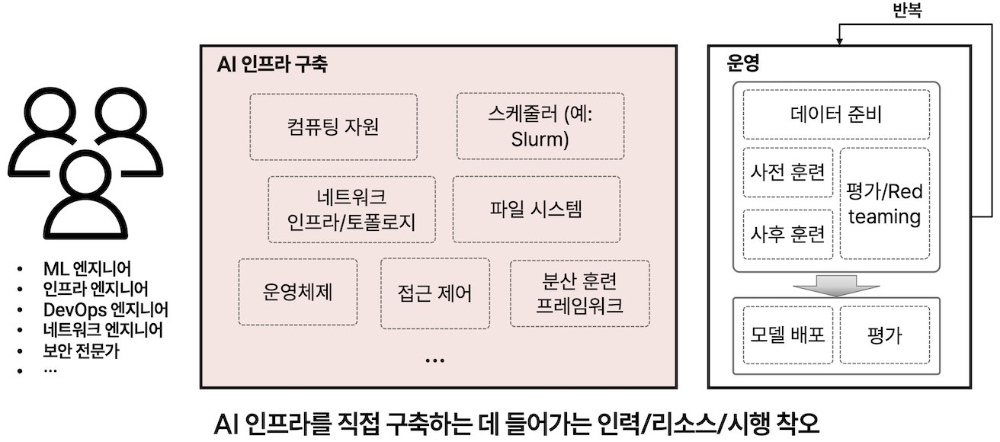
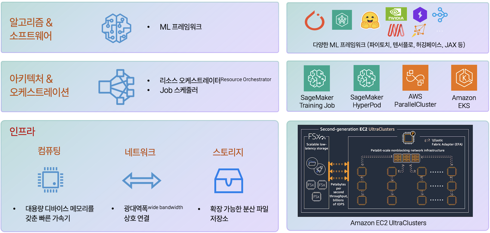
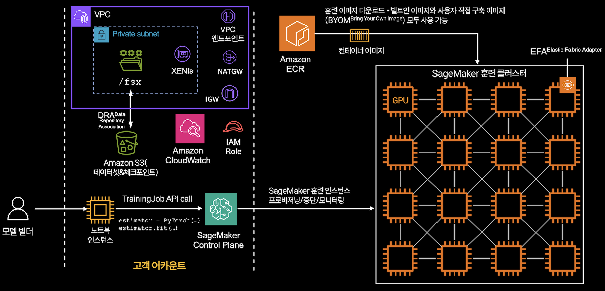
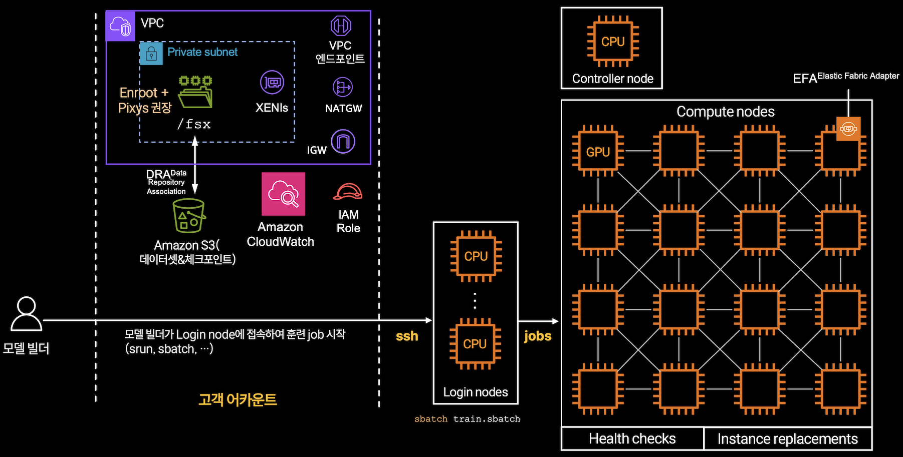

# AWS에서 MoE 모델을 효율적으로 훈련하기

MoE 모델을 실제로 훈련하기 위해서는 다양한 병렬화 기법, 통신 효율화, 그리고 클러스터 운영 자동화까지 아우르는 복잡한 인프라 구성이 필요합니다. 특히 멀티 노드 환경에서는 노드 간 통신 병목, GPU 자원 활용률 저하, 체크포인트 복구 전략 등 실질적인 엔지니어링 이슈가 빈번하게 발생합니다.

<figure><figcaption></figcaption></figure>

AWS는 이러한 대규모 분산 훈련의 복잡성을 완화하기 위해, 완전 관리형<sup>fully managed</sup> 훈련 환경인 Amazon SageMaker Training Job, 부분 관리형<sup>semi-managed</sup> 클러스터형 환경인 SageMaker HyperPod (Slurm / EKS), 그리고 EC2 기반 직접 구축형 서비스인 ParallelCluster까지 다양한 선택지를 제공합니다. 이하에서는 각 방식의 구조와 장단점을 중심으로, MoE 모델을 효율적으로 훈련하기 위한 구체적인 전략을 살펴보겠습니다.


## **1. AWS AI/ML 인프라 스택**

***

AWS의 AI/ML 인프라는 하드웨어 레이어부터 완전 관리형 서비스까지 수직적으로 통합된 스택으로 구성됩니다. 이 스택을 이해하는 것은 MoE 모델 훈련을 위한 최적의 아키텍처를 설계하는 데 필수적입니다. AWS의 AI/ML 인프라는 컴퓨팅·스토리지·네트워킹 계층에서부터 ML 오케스트레이션 계층, 그리고 알고리즘 및 ML 프레임워크 계층에 이르기까지 전 주기를 아우르는 구조로 설계되어 있습니다.

<figure><figcaption><p>AWS AI/ML 인프라 스택</p></figcaption></figure>

### 1.1. 인프라 레이어

#### **컴퓨팅**

가장 하단의 컴퓨팅 레이어에는 AWS의 가속기 인스턴스들이 위치합니다. P5en.48xlarge 인스턴스는 NVIDIA H200 GPU 8개를 탑재하며, GPU 당 141GB HBM3 메모리를 제공합니다. P4de.24xlarge 인스턴스는 A100 GPU(GPU 당 80GB GPU 메모리)를 사용하며 상대적으로 낮은 비용으로 대규모 훈련을 수행할 수 있습니다. AWS의 자체 설계 칩인 Trainium도 주목할 만한 선택지입니다. Trn2.48xlarge 인스턴스는 16개의 Trainium2칩을 제공하며(가속기 당 96GB 가속기 메모리), NeuronCore라 불리는 컴퓨팅 유닛에서 행렬 연산을 최적화합니다.&#x20;

특히 주목할 점은 P5en.48xlarge과 Trn2.48xlarge의 3,200Gbps의 EFA<sup>Elastic Fabric Adapter</sup>네트워크 대역폭입니다. MoE 모델 훈련에서는 전문가 간 통신이 빈번하게 발생하므로, 이러한 고대역폭 네트워크는 All-to-All 통신의 병목을 완화하는 데 결정적입니다.

#### **네트워킹**

네트워킹 레이어는 분산 훈련의 효율성을 결정하는 핵심 요소입니다. EFA는 OS 바이패스 기능을 제공하여 커널 오버헤드 없이 직접 네트워크 인터페이스와 통신할 수 있게 합니다. 이는 NCCL이나 AWS OFI NCCL 플러그인과 결합되어 GPU 간 집단 통신을 최적화합니다.

MoE 모델에서는 전문가 그룹 간 All-to-All 통신이 전체 훈련 시간의 상당 부분을 차지할 수 있는데, EFA의 저지연 특성은 이러한 오버헤드를 최소화합니다. AWS는 가용 영역<sup>Availability Zone</sup> 내에서 non-blocking 네트워크 토폴로지를 보장하므로, 노드 간 통신 경로가 일관된 성능을 보입니다. EFA는 AWS의 독점적인 SRD<sup>Scalable Reliable Datagram</sup> 프로토콜을 기반으로 하여, 표준 RDMA 솔루션과는 다르게 클라우드 환경에 최적화되어 있습니다. 자세한 내용은 『[분산 훈련에서의 네트워킹: EFA](efa.md)』를 참조하기 바랍니다.

#### **스토리지**&#x20;

스토리지 레이어는 대규모 훈련 데이터셋을 효율적으로 제공하기 위한 인프라입니다. Amazon S3는 사실상 무제한의 확장성을 제공하지만, 수백 개의 GPU가 동시에 데이터를 읽을 때는 처리량이 제한될 수 있습니다. FSx for Lustre는 이러한 문제를 해결하기 위해 S3와 통합되면서도 수백 GB/s의 처리량을 제공합니다.

MoE 훈련에서는 체크포인트 저장이 특히 중요한데, 수조 개의 파라미터를 가진 모델의 체크포인트는 수 TB에 달할 수 있습니다. FSx for Lustre의 병렬 쓰기 성능은 이러한 대용량 체크포인트를 빠르게 저장하고 복원하는 데 필수적입니다. Data Repository Association(DRA) 기능을 통해 S3와 FSx 간의 자동 동기화도 가능합니다.

### 1.2. 아키텍처 및 오케스트레이션 (미들웨어/플랫폼 레이어)

아키텍처 및 오케스트레이션 레이어에서는 리소스 관리와 작업 스케줄링이 이루어집니다. SageMaker Training Job은 완전 관리형으로 인프라 프로비저닝부터 종료까지 자동화합니다. SageMaker HyperPod은 Slurm 기반 또는 EKS 기반 클러스터를 제공하여 더 세밀한 제어가 가능합니다. AWS ParallelCluster는 HPC 워크로드를 위한 클러스터 관리 도구이며, Amazon EKS는 쿠버네티스 기반의 컨테이너 오케스트레이션을 제공합니다.

### 1.3. 알고리즘 및 ML 프레임워크 (사용자 레이어)

최상위 레이어에는 실제 AI 애플리케이션들이 위치합니다. Megatron-LM, PyTorch, DeepSpeed, FSDP, Torchtitan 같은 ML/분산 훈련 프레임워크들이 이 레이어에서 동작하며, 하위 레이어들이 제공하는 통신 프리미티브를 활용하여 효율적인 분산 훈련을 구현합니다. 또한 ML/분산 훈련 프레임워크들은 AWS Deep Learning Container를 통해 사전 구성된 환경으로 제공되어 빠른 시작이 가능합니다.

이러한 계층적 구조 덕분에 ML 엔지니어는 복잡한 네트워크 통신 로직을 직접 구현할 필요 없이, PyTorch의 DistributedDataParallel이나 FSDP 같은 고수준 API를 사용하여 분산 훈련을 구현할 수 있습니다. 물론 성능 최적화가 필요한 경우에는 NCCL이나 libfabric 레벨에서 세밀한 튜닝도 가능합니다.

AWS Neuron SDK는 Trainium 전용 컴파일러와 런타임을 제공하며, XLA(Accelerated Linear Algebra) 기반의 최적화를 통해 커스텀 하드웨어에서 최대 성능을 끌어냅니다. 이러한 프레임워크들은 모두 AWS의 AI/ML 인프라와 긴밀하게 통합되어 있습니다.

이러한 AI/ML 인프라 스택을 기반으로, AWS는 단순한 하드웨어 제공을 넘어 **모델 수준의 병렬화 효율성, 자동화된 인프라 관리, 장애 복구 및 스케일링**까지 지원합니다.


## **2. Amazon SageMaker Training Job 기반 분산 훈련**

***

SageMaker Training Job은 AWS에서 가장 손쉽게 사용할 수 있는 분산 훈련 환경입니다. 사용자가 인프라 프로비저닝, 클러스터 구성, 장애 처리 등의 운영 부담 없이 훈련 스크립트에만 집중할 수 있고 `estimator.fit()` 호출 한 번으로 훈련 클러스터를 자동 생성한다는 점이 가장 큰 장점입니다.

<figure><figcaption></figcaption></figure>

### 2.1. 아키텍처 개요

SageMaker Training Job의 아키텍처는 크게 고객 어카운트 영역과 SageMaker 관리 영역으로 나뉩니다. 모델 빌더는 노트북 인스턴스나 로컬 환경에서 PyTorch Estimator를 생성하고 estimator.fit() 메서드를 호출하여 훈련을 시작합니다. 이 API 호출은 SageMaker Control Plane으로 전달되며, Control Plane은 VPC 내에 SageMaker 훈련 클러스터를 프로비저닝합니다.

훈련 클러스터는 Private subnet 내에 구성되며, VPC 엔드포인트를 통해 Amazon ECR에서 컨테이너 이미지를 다운로드합니다. 훈련 데이터는 Amazon S3에서 직접 읽거나 FSx for Lustre를 통해 캐싱할 수 있습니다. MoE 모델 훈련에서는 보통 수백 GB에서 수 TB에 이르는 대규모 텍스트 데이터셋을 사용하므로, FSx를 사용하는 것이 더 효율적입니다. S3와 FSx를 연결할 때 lazy loading 모드를 사용하면, 실제로 필요한 파일만 온디맨드로 FSx에 캐시되어 초기 지연을 줄일 수 있습니다. FSx for Lustre는 Data Repository Association(DRA)을 통해 S3와 자동으로 동기화됩니다. 훈련 인스턴스들은 EFA를 통해 고속 통신을 수행하며, 각 GPU는 NVSwitch를 통해 노드 내 통신을 최적화합니다.

데이터 로더는 여러 워커 프로세스를 사용하여 I/O와 전처리를 병렬화해야 하며, 특히 토큰화와 같은 CPU 집약적 작업을 미리 수행한 전처리된 데이터셋을 사용하는 것이 GPU 활용률을 높입니다. 예컨대 PyTorch DataLoader의 num\_workers 파라미터를 적절히 설정하고, prefetch\_factor를 조정하여 데이터 준비 파이프라인을 최적화할 수 있습니다.

SageMaker Training Job은 빌트인 이미지와 사용자 직접 구축 이미지(BYOC, Bring Your Own Container)를 모두 지원합니다. AWS Deep Learning Containers를 기본 이미지로 사용하면 PyTorch, CUDA, NCCL, EFA 라이브러리가 이미 설치되어 있어 빠르게 시작할 수 있습니다. MoE 특화 기능이 필요한 경우 DeepSpeed나 Megatron-LM을 추가로 설치한 커스텀 이미지를 Amazon ECR에 푸시하여 사용할 수 있습니다.

#### **주요 특성**

* **완전 관리형**: 클러스터 구성, 스케줄링, 모니터링, 로깅, IAM 권한 관리 등 인프라 설정을 자동으로 처리합니다.
* **유연한 프레임워크 지원**: PyTorch, TensorFlow, Hugging Face, JAX 등 대부분의 프레임워크가 기본 지원됩니다.
* **고속 네트워크 연동**: EFA와 NCCL 통신을 활용하여 GPU 간 저지연 통신을 보장합니다.
* **비용 효율성**: 학습이 진행되는 시간 동안만 비용이 발생합니다.

### **2.2. 한계점 및 MoE 모델 적용 시 고려사항**

SageMaker Training Job은 10B\~100B 규모의 모델까지 비교적 쉽게 처리할 수 있으나, 대규모 MoE 모델 훈련에는 한계가 있습니다. 단일 훈련 작업의 최대 지속 시간이 28일로 제한되므로, 매우 긴 훈련이 필요한 경우 체크포인트로부터 재시작하는 로직을 구현해야 합니다. 또한 노드 장애가 발생하면 전체 작업이 실패하므로, 장애 복구를 위한 자동 재시작 메커니즘을 직접 구현해야 합니다.&#x20;

이러한 제약 때문에 더 긴 훈련 워크로드나 더 세밀한 제어가 필요한 경우에는 SageMaker HyperPod을 고려하는 것이 좋습니다. 하지만 상대적으로 짧은 기간의 훈련이나 프로토타이핑, 실험 단계에서는 SageMaker Training Job의 완전 관리형 특성이 큰 장점으로 작용합니다.


## **3. SageMaker HyperPod 기반 분산 훈련 - Slurm**

***

SageMaker HyperPod는 대규모 모델 훈련, 특히 수십억\~수조 파라미터 규모의 파운데이션/MoE 모델을 위한 서비스입니다. **부분 관리형(Partially Managed) 환경으로, AWS가 인스턴스 관리·네트워킹·복구를 담당하고, 사용자는 클러스터 수준의 제어권을 가집니다.**

HyperPod는 두 가지 모드(Slurm, EKS)를 지원하는데, Slurm은 전통적인 HPC 스타일의 배치 기반 워크로드에, EKS는 컨테이너 오케스트레이션 기반의 유연한 클러스터 관리에 적합합니다.

<figure><figcaption></figcaption></figure>

### 3.1. 아키텍처 개요

HyperPod Slurm 클러스터는 영구적인 인프라로 프로비저닝됩니다. 클러스터를 한 번 생성하면 여러 훈련 작업을 순차적 또는 동시에 실행할 수 있으며, 노드 장애 시 자동으로 대체 노드가 프로비저닝됩니다. 이러한 resilience는 수주에 걸친 MoE 모델 훈련에서 특히 중요합니다.

클러스터는 크게 세 가지 노드 타입으로 구성됩니다. Controller node는 Slurm의 중앙 관리 노드로, 작업 스케줄링과 리소스 할당을 담당합니다. Login nodes는 사용자가 SSH로 접속하여 작업을 제출하고 모니터링하는 진입점입니다. (Login node 없이 Controller node에서 사용자가 접근할 수도 있습니다.) Compute nodes는 실제 훈련이 실행되는 GPU 또는 Trainium 인스턴스들입니다. 모든 노드는 Private subnet에 위치하며, VPC 엔드포인트를 통해 AWS 서비스에 접근합니다.

클러스터 구성 시 인스턴스 타입, 노드 수, EFA 활성화 여부 등을 지정하며, FSx for Lustre 파일 시스템을 미리 연결하여 모든 노드가 공유 스토리지에 접근할 수 있게 합니다. Enroot와 Pyxis를 사용하면 Slurm에서 컨테이너 기반 작업을 쉽게 실행할 수 있어 권장됩니다.

Slurm을 통한 작업 제출은 익숙한 `sbatch` 명령을 사용합니다. MoE 모델 훈련을 위한 Slurm 스크립트는 요청할 노드 수, GPU 수, 예상 실행 시간 등을 명시합니다. 중요한 것은 멀티노드 훈련을 위한 적절한 환경 변수 설정입니다. Slurm은 각 프로세스에 `SLURM_PROCID`, `SLURM_LOCALID`, `SLURM_NODEID` 등의 변수를 제공하며, 이를 통해 분산 훈련 프레임워크가 각 프로세스의 역할을 인식할 수 있습니다.

#### **주요 특성**

* **자동 복구 및 재시작 기능**: Slurm health check를 통해 비정상 노드가 감지되면 자동으로 교체 및 재시작됩니다.
* **Slurm 명령 친화성**: sbatch, srun, squeue 등 기존 HPC 워크플로우와 동일한 방식으로 사용 가능하며 사용자 정의 라이프사이클 스크립트를 통해 환경 초기화, 라이브러리 설치 등을 수행할 수 있습니다.
* **HyperPod CLI/SDK 연동**: 클러스터 생성·확장·노드 교체 작업을 코드로 자동화할 수 있습니다.
* **FSx for Lustre 및 S3 연동**: 대규모 체크포인트 및 데이터셋의 고속 입출력을 지원합니다.
* **SageMaker 분산 훈련 라이브러리(SMDDP, SMP)와 통합**: HyperPod 클러스터 내에서는 SMDDP, SMP 라이브러리를 그대로 사용할 수 있습니다.&#x20;

### 3.2. 활용 팁

#### 리소스 스케줄링

Slurm의 장점 중 하나는 정교한 리소스 스케줄링입니다. QoS(Quality of Service) 정책을 사용하여 우선순위를 관리하고, 페어셰어 스케줄링을 통해 여러 팀이 클러스터를 공유할 수 있습니다. 긴급한 실험을 위해 일부 노드를 프리엠션 가능한 작업으로 실행하고, 중요한 훈련 작업에는 더 높은 우선순위를 부여하는 것도 가능합니다.

노드 특성 기반 스케줄링을 사용하여, 특정 작업을 EFA가 활성화된 노드에만 할당하거나 특정 인스턴스 타입을 요청할 수 있습니다. 예를 들어, `--constraint=efa` 옵션을 사용하여 EFA가 활성화된 노드만 요청하거나, `--constraint=p5` 옵션으로 P5 인스턴스만 요청할 수 있습니다.

```bash
#SBATCH --constraint=efa
#SBATCH --partition=gpu-p5
```

#### 체크포인트와 장애 복구

체크포인트와 장애 복구는 HyperPod Slurm의 핵심 기능입니다. 노드 장애가 감지되면 Health Check 메커니즘이 작동하여 해당 노드를 자동으로 교체하고, Instance Replacement 프로세스가 시작됩니다. Slurm은 작업을 자동으로 큐로 되돌리고 건강한 노드에서 재시작할 수 있습니다.

MoE 훈련 스크립트는 최신 체크포인트를 감지하고 자동으로 로드하는 로직을 포함해야 합니다. 체크포인트는 FSx for Lustre의 공유 디렉토리에 저장되므로 모든 노드에서 접근 가능합니다. 또한 주기적으로 체크포인트를 S3로 백업하여 장기 보관과 클러스터 외부 접근을 가능하게 하는 것이 좋습니다.


```python
import os
import torch

def save_checkpoint(model, optimizer, epoch, checkpoint_dir):
    checkpoint_path = os.path.join(checkpoint_dir, f"checkpoint_epoch_{epoch}.pt")
    torch.save({
        'epoch': epoch,
        'model_state_dict': model.state_dict(),
        'optimizer_state_dict': optimizer.state_dict(),
    }, checkpoint_path)

    # S3로 백업 (비동기)
    os.system(f"aws s3 cp {checkpoint_path} s3://my-bucket/checkpoints/ &")

def load_latest_checkpoint(model, optimizer, checkpoint_dir):
    checkpoints = [f for f in os.listdir(checkpoint_dir) if f.startswith("checkpoint_")]
    if not checkpoints:
        return 0

    latest = max(checkpoints, key=lambda x: int(x.split("_")[-1].split(".")[0]))
    checkpoint_path = os.path.join(checkpoint_dir, latest)

    checkpoint = torch.load(checkpoint_path)
    model.load_state_dict(checkpoint['model_state_dict'])
    optimizer.load_state_dict(checkpoint['optimizer_state_dict'])

    return checkpoint['epoch']
```


#### 모니터링과 프로파일링

모니터링과 프로파일링은 MoE 훈련의 효율성을 최적화하는 데 필수적입니다. Slurm은 sstat와 sacct 명령을 통해 작업의 리소스 사용량을 추적할 수 있습니다. GPU 활용률, 네트워크 처리량, 메모리 사용량 등을 모니터링하여 병목 지점을 식별해야 합니다.

```bash
# 실행 중인 작업의 상태 확인
sstat -j <job_id> --format=JobID,MaxRSS,AveCPU

# 완료된 작업의 통계 확인
sacct -j <job_id> --format=JobID,Elapsed,MaxRSS,MaxVMSize
```

MoE 모델에서는 전문가 간 로드 불균형이 흔한 문제이므로, 각 전문가가 처리하는 토큰 수를 로깅하고 라우터의 load balancing loss를 모니터링하는 것이 중요합니다. NVIDIA의 Nsight Systems나 PyTorch Profiler를 사용하여 상세한 타임라인을 분석하면, All-to-All 통신이 전체 훈련 시간에서 차지하는 비율을 정량화할 수 있습니다.


## **4. SageMaker HyperPod 기반 분산 훈련 - EKS**

***

SageMaker HyperPod의 EKS(Elastic Kubernetes Service) 기반 옵션은 쿠버네티스 생태계의 유연성과 확장성을 활용하고자 하는 팀을 위한 선택지입니다. 컨테이너 기반 워크플로우, GitOps, 서비스 메시 등 클라우드 네이티브 패턴을 선호하는 조직에 적합하며, ML 파이프라인의 다른 구성 요소들과 일관된 오케스트레이션을 제공합니다.

### 4.1. 아키텍처 개요

HyperPod EKS 클러스터는 GPU 노드 그룹을 포함하는 표준 쿠버네티스 클러스터로 구성됩니다. GPU 인스턴스로 구성된 노드 그룹은 EFA를 지원하도록 설정되며, NVIDIA GPU Operator를 통해 GPU 리소스가 스케줄링 가능한 상태가 됩니다. EFA를 사용하려면 호스트 네트워크 모드로 Pod를 실행해야 하며, EFA 디바이스 플러그인이 각 노드에서 실행되어 EFA 인터페이스를 컨테이너에 노출합니다.

클러스터에는 여러 관리 컴포넌트가 설치됩니다. HyperPod Inference Operator는 모델 배포를 관리하고, HyperPod Task Governance Operator는 훈련 작업의 라이프사이클을 관리합니다. ALB Controller는 Application Load Balancer를 자동으로 프로비저닝하여 외부 트래픽을 라우팅하고, Karpenter는 쿠버네티스 네이티브 오토스케일링을 제공합니다. AWS Certificate Manager(ACM)는 SSL/TLS 인증서를 관리합니다.

모니터링을 위해 Managed Prometheus와 Managed Grafana가 통합되어 있으며, CloudWatch Metrics로도 데이터가 전송됩니다. FSx for Lustre는 CSI 드라이버를 통해 PersistentVolume으로 마운트되어 모든 Pod가 공유 파일 시스템에 접근할 수 있습니다.

#### **주요 특성**

* **쿠버네티스 네이티브 워크플로우**: EKS 클러스터에서 SageMaker Operator를 통해 훈련 Job을 제출할 수 있으며, Helm 차트나 Argo Workflows와 연계하여 복잡한 학습 파이프라인을 자동화할 수 있습니다.
* **자동 확장 및 자가치유(Auto-Healing)**: 쿠버네티스의 HPA(Horizontal Pod Autoscaler) 및 Karpenter를 활용해 GPU 노드를 동적으로 증감할 수 있습니다.
* **통합 모니터링**: CloudWatch, Prometheus, Grafana를 통한 실시간 자원 모니터링 및 지표 기반 스케일링이 가능합니다.
* **네트워크 최적화**: EFA를 CNI 플러그인 형태로 통합하여, Pod 간 RDMA 통신을 지원합니다.
* **하이브리드 오케스트레이션**: 필요 시 Slurm HyperPod 클러스터와 EKS HyperPod 클러스터를 상호 연결하여, Slurm 기반 훈련 – EKS 기반 서빙으로 전환할 수도 있습니다.

### 4.2. 활용 팁

#### MoE 훈련 작업 정의

MoE 훈련 작업은 쿠버네티스의 Job 또는 PyTorchJob (Kubeflow Training Operator 사용 시) 리소스로 정의됩니다. PyTorchJob은 분산 PyTorch 훈련을 위한 편의 기능을 제공하는데, master와 worker 역할을 자동으로 할당하고 `MASTER_ADDR`, `WORLD_SIZE` 같은 환경 변수를 설정합니다. MoE 모델 훈련을 위한 PyTorchJob 매니페스트는 요청할 워커 수, 각 워커의 GPU 수, 컨테이너 이미지, 마운트할 볼륨 등을 명시합니다.&#x20;

```yaml
apiVersion: kubeflow.org/v1
kind: PyTorchJob
metadata:
  name: moe-training
spec:
  pytorchReplicaSpecs:
    Master:
      replicas: 1
      restartPolicy: OnFailure
      template:
        metadata:
          annotations:
            sidecar.istio.io/inject: "false"
        spec:
          hostNetwork: true
          dnsPolicy: ClusterFirstWithHostNet
          containers:
          - name: pytorch
            image: 763104351884.dkr.ecr.us-east-1.amazonaws.com/pytorch-training:2.1.0-gpu-py310
            command:
            - torchrun
            - --nproc_per_node=8
            - --nnodes=16
            - train_moe.py
            resources:
              limits:
                nvidia.com/gpu: 8
                vpc.amazonaws.com/efa: 4
              requests:
                nvidia.com/gpu: 8
                vpc.amazonaws.com/efa: 4
            volumeMounts:
            - name: fsx
              mountPath: /fsx
          volumes:
          - name: fsx
            persistentVolumeClaim:
              claimName: fsx-pvc
    Worker:
      replicas: 15
      restartPolicy: OnFailure
      template:
        spec:
          # Master와 동일한 설정
```

#### 데이터 접근 전략

데이터 접근은 여러 방식으로 구현할 수 있습니다. FSx for Lustre CSI 드라이버를 사용하면 Kubernetes PersistentVolume으로 FSx 파일 시스템을 마운트할 수 있습니다. 모든 워커 Pod가 동일한 FSx 볼륨을 공유하므로, 데이터셋과 체크포인트에 일관된 접근이 가능합니다.

```yaml
apiVersion: v1
kind: PersistentVolume
metadata:
  name: fsx-pv
spec:
  capacity:
    storage: 1200Gi
  volumeMode: Filesystem
  accessModes:
  - ReadWriteMany
  persistentVolumeReclaimPolicy: Retain
  storageClassName: fsx-sc
  csi:
    driver: fsx.csi.aws.com
    volumeHandle: fs-0123456789abcdef0
    volumeAttributes:
      dnsname: fs-0123456789abcdef0.fsx.us-east-1.amazonaws.com
      mountname: /fsx
---
apiVersion: v1
kind: PersistentVolumeClaim
metadata:
  name: fsx-pvc
spec:
  accessModes:
  - ReadWriteMany
  storageClassName: fsx-sc
  resources:
    requests:
      storage: 1200Gi

```

S3 직접 접근을 선호한다면, Mountpoint for Amazon S3를 CSI 드라이버로 사용하거나 애플리케이션 레벨에서 boto3로 접근할 수 있습니다. MoE 훈련에서는 수백 GB의 체크포인트를 빠르게 쓰고 읽어야 하므로, FSx의 높은 I/O 처리량이 일반적으로 더 적합합니다.

#### GitOps와 선언적 관리

Kubernetes의 장점은 선언적 설정과 버전 관리입니다. 훈련 작업의 모든 설정을 YAML 매니페스트로 관리하고, Git 리포지토리에서 버전 관리할 수 있습니다. Helm 차트를 사용하면 환경별(개발, 스테이징, 프로덕션) 설정을 파라미터화하고, 동일한 차트로 다양한 구성을 배포할 수 있습니다.

ArgoCD나 Flux 같은 GitOps 도구를 사용하면, Git 커밋이 자동으로 클러스터에 반영되어 훈련 파이프라인의 재현성과 추적성이 향상됩니다. 예를 들어, 훈련 하이퍼파라미터를 변경하고 Git에 푸시하면, ArgoCD가 자동으로 감지하여 새로운 PyTorchJob을 배포할 수 있습니다.

```yaml
# values.yaml (Helm chart)
replicaCount:
  master: 1
  worker: 15

resources:
  gpu: 8
  efa: 4

image:
  repository: 763104351884.dkr.ecr.us-east-1.amazonaws.com/pytorch-training
  tag: 2.1.0-gpu-py310

training:
  script: train_moe.py
  config: config.yaml
  expertCount: 8
  expertParallelSize: 8
```

#### 장애 처리와 복구

장애 처리는 EKS의 강력한 기능 중 하나입니다. PyTorchJob은 워커 Pod가 실패하면 자동으로 재시작합니다. 그러나 단순 재시작만으로는 충분하지 않으며, 훈련 스크립트가 체크포인트로부터 복구하는 로직을 구현해야 합니다. 또한 일시적인 네트워크 문제나 메모리 부족 에러 등 복구 가능한 장애와 코드 버그 같은 영구적 장애를 구분하여, 무한 재시작 루프를 방지하는 것이 중요합니다.

backoffLimit을 설정하여 최대 재시도 횟수를 제한하고, 실패한 작업의 로그를 CloudWatch나 Elasticsearch로 수집하여 디버깅하는 것을 권장합니다. HyperPod Task Governance Operator는 작업의 헬스 체크와 자동 복구를 지원합니다.

```yaml
spec:
  pytorchReplicaSpecs:
    Master:
      replicas: 1
      restartPolicy: OnFailure
      template:
        spec:
          containers:
          - name: pytorch
            livenessProbe:
              exec:
                command:
                - cat
                - /tmp/healthy
              initialDelaySeconds: 300
              periodSeconds: 60
            readinessProbe:
              exec:
                command:
                - cat
                - /tmp/ready
              initialDelaySeconds: 60
              periodSeconds: 30
  backoffLimit: 3
```

#### 모니터링 및 옵저버빌리티

모니터링은 Prometheus와 Grafana를 사용하는 것이 일반적입니다. DCGM Exporter는 GPU 메트릭을 수집하고, NVIDIA의 GPUDirect Storage 사용량, PCIe 처리량, GPU 온도 등을 모니터링할 수 있습니다. 쿠버네티스 네이티브 메트릭인 Pod CPU/메모리 사용량도 중요하며, 특히 데이터 로딩 워커의 CPU 병목을 식별하는 데 유용합니다.

MoE 특화 메트릭으로는 전문가별 토큰 분포, 라우터 엔트로피, All-to-All 통신 시간 등을 커스텀 메트릭으로 수집하여 Prometheus에 노출할 수 있습니다.


## **5. 요약 및 결론**

***

### **5.1. 방식별 비교 및 권장 시나리오**

<table><thead><tr><th width="117.7578125">항목</th><th>SageMaker Training Job</th><th>HyperPod (Slurm)</th><th>HyperPod (EKS)</th></tr></thead><tbody><tr><td>관리형 수준</td><td>완전 관리형</td><td>부분 관리형</td><td>부분 관리형</td></tr><tr><td>규모</td><td>수십~수백억 파라미터</td><td>수백억~수조 파라미터</td><td>수백억~수조 파라미터</td></tr><tr><td>운영 방식</td><td>API 기반 자동화</td><td>HPC 스타일 수동 제어</td><td>컨테이너 오케스트레이션</td></tr><tr><td>클러스터 제어</td><td>제한적</td><td>Slurm 기반 세밀 제어</td><td>Kubernetes 기반 제어</td></tr><tr><td>비용 모델</td><td>Job 실행 시간 기준 과금</td><td>EC2 예약 또는 On-demand</td><td>EC2 / EKS 노드 단위 과금</td></tr><tr><td>복구/확장</td><td>자동 스케일링</td><td>자동 복구·Resume</td><td>AutoScaler 기반 Pod 확장</td></tr><tr><td>활용 목적</td><td>PoC/프로토타입, 파인튜닝, SLM 및 소규모 MoE 모델 훈련</td><td>대규모 파운데이션 모델 장기 훈련</td><td>대규모 파운데이션 모델 훈련 + 파이프라인/서빙 통합</td></tr><tr><td>주요 장점</td><td>빠른 시작, 관리 편의</td><td>안정성, 자동 복구, HPC 친화성</td><td>유연한 오케스트레이션, 자동 확장</td></tr><tr><td>주요 단점</td><td>구조 제어 한계</td><td>Slurm 운영 부담</td><td>컨테이너 설계 필요</td></tr></tbody></table>

### 5.2. 결론

AWS에서 MoE 모델을 효율적으로 훈련하는 것은 적절한 인프라 선택, 병렬화 전략, 최적화 기법의 조합을 요구합니다. SageMaker Training Job은 빠른 프로토타이핑과 상대적으로 짧은 훈련에 적합하며, 완전 관리형의 편의성을 제공합니다. SageMaker HyperPod Slurm은 HPC 워크플로우에 익숙한 팀에게 세밀한 제어와 resilience를 제공하며, 장기 실행 훈련에 이상적입니다. SageMaker HyperPod EKS는 Kubernetes 생태계의 유연성과 클라우드 네이티브 도구들을 활용할 수 있게 합니다.

MoE 아키텍처는 Dense 모델 대비 독특한 도전 과제를 제시하지만, 올바른 최적화 전략을 적용하면 훨씬 적은 계산으로 동등하거나 더 나은 성능을 달성할 수 있습니다. 라우터 최적화, 통신 오버헤드 감소, 메모리 효율성 향상은 MoE 훈련 성공의 핵심 요소입니다. AWS의 고대역폭 네트워크, 강력한 GPU 인스턴스, 통합된 스토리지 솔루션은 이러한 최적화를 실현하는 견고한 기반을 제공합니다.

실전에서는 기술적 최적화 외에도 비용 관리, 재현성, 디버깅, 협업이 중요합니다. 점진적으로 규모를 확장하고, 지속적으로 프로파일링하며, 실험을 체계적으로 관리하는 것이 장기적으로 성공적인 MoE 훈련 파이프라인을 구축하는 길입니다. AWS의 다양한 도구와 서비스를 활용하여 이러한 모범 사례들을 구현하면, 최첨단 MoE 모델을 효율적이고 안정적으로 훈련할 수 있습니다.


## References

* [AWS Builder Blog – Accelerate Mixtral 8x7B Pretraining on SageMaker](https://aws.amazon.com/blogs/machine-learning/accelerate-mixtral-8x7b-pre-training-with-expert-parallelism-on-amazon-sagemaker/)
* [Introducing Amazon SageMaker HyperPod for Foundation Model Training](https://aws.amazon.com/blogs/machine-learning/introducing-amazon-sagemaker-hyperpod-to-train-foundation-models-at-scale/)
* [AWS OFI NCCL Plugin GitHub](https://github.com/aws/aws-ofi-nccl)
* [AWS EFA Documentation](https://docs.aws.amazon.com/AWSEC2/latest/UserGuide/efa.html)
* [Lancet: Accelerating MoE via Overlapping Computation and Communication](https://github.com/awslabs/Lancet-Accelerating-MoE-Training-via-Whole-Graph-Computation-Communication-Overlapping)
* [AWS ParallelCluster](https://aws.amazon.com/hpc/parallelcluster/)
* [Amazon FSx for Lustre](https://aws.amazon.com/fsx/lustre/)
* [DeepSpeed MoE Documentation](https://www.deepspeed.ai/tutorials/mixture-of-experts/)

