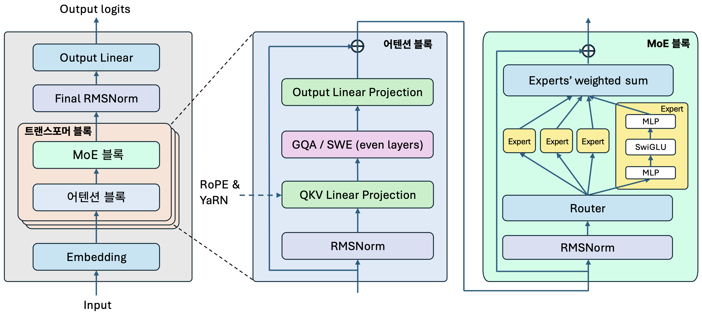
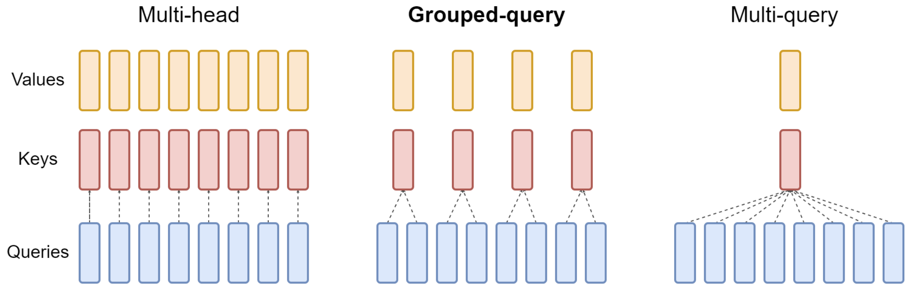
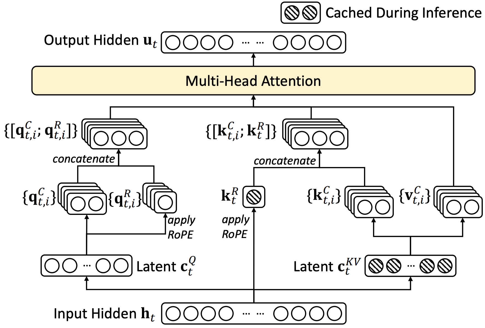
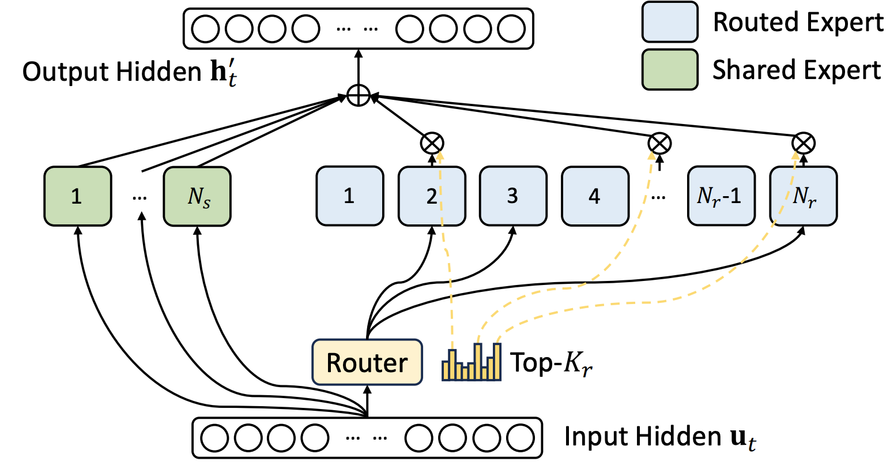
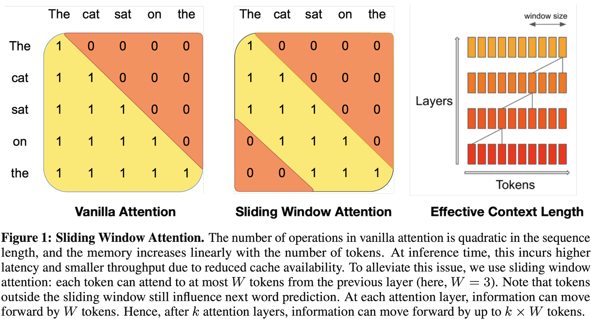

# MoE 모델 비교 및 주요 기법 정리


최신 기술(SoTA)의 오픈소스 MoE 모델은 큰 흐름에서 모두 비슷하지만, 양질의 훈련 데이터 확보, 긴 문맥 처리, 리소스 최적화를 목표로 세부적으로는 약간씩 다르거나 기존 방법에서 개선된 기법들을 적용하고 있습니다. 본 가이드를 통해 최신 MoE 모델의 차이를 빠르게 파악하고 주요 기법을 파악하기 바랍니다.


<figure><figcaption><p>2024-2025년의 오픈소스 MoE 트랜스포머 블록 구조 예시</p></figcaption></figure>

## 1. MoE 모델 비교

***

### **1.1. Transformer / MoE / Attention 구조 비교**

<table data-full-width="true"><thead><tr><th>모델</th><th width="128">총/활성 파라미터</th><th># Layers</th><th>Vocab size</th><th>Hidden dim</th><th># Query heads</th><th># KV heads</th><th>전문가 수 (총 / 활성)</th><th>어텐션 방식</th></tr></thead><tbody><tr><td><strong>DeepSeek-V2</strong></td><td>236B / 21B</td><td>60</td><td>102,400</td><td>5,120</td><td>128</td><td>128 </td><td>162 / 6 (160 routed + 2 shared)</td><td>MLA</td></tr><tr><td><strong>DeepSeek-V3</strong></td><td>671B / 37B</td><td>61</td><td>129,280</td><td>7,168</td><td>128</td><td>128 </td><td>257 / 8 (256 routed + 1 shared)</td><td>MLA</td></tr><tr><td><strong>Qwen3-30B-A3B</strong></td><td>30.5B / 3.3B</td><td>48</td><td>151,669</td><td>2,048</td><td>32</td><td>4</td><td>128 / 8</td><td>GQA</td></tr><tr><td><strong>Qwen3-235B-A22B</strong></td><td>235B / 22B</td><td>94</td><td>151,669</td><td>4,096</td><td>64</td><td>4</td><td>128 / 8</td><td>GQA</td></tr><tr><td><strong>Qwen-Next-80B-A3B</strong></td><td>80B / 3B</td><td>48</td><td>151,669</td><td>2,048</td><td>16</td><td>2</td><td>512 / 10</td><td>GQA</td></tr><tr><td><strong>GPT-OSS-20B</strong></td><td>20.9B / 3.6B</td><td>24</td><td>201,088</td><td>2,880</td><td>64</td><td>8</td><td>32 / 4</td><td>GQA</td></tr><tr><td><strong>GPT-OSS-120B</strong></td><td>116.8B / 5.1B</td><td>36</td><td>201,088</td><td>2,880</td><td>64</td><td>8</td><td>128 / 4</td><td>GQA</td></tr></tbody></table>

#### **GQA (Grouped Query Attention)**

기존의 MHA(Multi-Head Attention)는 모든 Query(Q) 헤드마다 독립적인 Key(K)와 Value(V)를 유지합니다. 이 구조는 계산은 빠르지만, 메모리 사용량이 너무 크다는 단점이 있기에 GQA는 여러 Query 헤드를 하나의 그룹으로 묶어 그 그룹이 공유된 Key/Value를 사용하도록 설계했습니다. 예를 들어, 32개의 Query 헤드가 있다면 이를 4개의 그룹으로 나누고, 각 그룹이 하나의 K/V 세트를 공유합니다 그 결과, 메모리 사용량은 약 1/그룹 크기 수준으로 줄어들고, 연산 효율도 크게 개선됩니다.

다만, GQA는 Query 헤드들이 같은 K/V 정보를 공유하기 때문에 세밀한 표현력이 다소 떨어질 수 있습니다. 즉, 효율성은 좋아졌지만, 표현력의 손실이 생기는 구조적 한계를 갖습니다.

<figure><figcaption><p>Grouped Query Attention (출처: <a href="https://arxiv.org/abs/2309.00071">GQA: Training Generalized Multi-Query Transformer Models from Multi-Head Checkpoints</a>)</p></figcaption></figure>

#### **MLA (**&#x4D;ulti-head Latent Attention)

DeepSeek에서 적용한 MLA(Multi-head Latent Attention)는 모델이 어텐션을 계산할 때 헤드를 그룹화하는 대신, Key/Value를 저차원 잠재 공간<sup>latent space</sup>으로 압축하여 저장합니다. MLA 과정은 아래와 같습니다,

1. 입력 벡터 $$h_t$$가 들어오면, 쿼리(Q)와 키/값(K/V) 방향으로 각각 선형 변환을 거칩니다.
2. K/V는 원래의 차원보다 훨씬 작은 latent 차원으로 압축합니다.
3. 이 latent 표현을 캐시에 저장하고, 이후 어텐션 연산 시, 쿼리와 latent된 K/V를 필요할 때 복원 또는 상호작용해서 어텐션 score를 계산합니다.

이렇게 하면 메모리 사용량이 획기적으로 줄어들고, 동시에 Query마다 세밀한 표현을 유지할 수 있습니다.

<figure><figcaption><p>Multi-head Latent Attention (출처: <a href="https://arxiv.org/abs/2412.19437">DeepSeek-v3 Technical Report</a>)</p></figcaption></figure>

#### **GQA vs. MLA 요약**


한줄요약: GQA가 “여러 쿼리가 같은 K/V를 본다”는 개념이라면, MLA는 “모든 쿼리가 저차원 잠재 표현을 통해 K/V를 본다”는 철학입니다.


<table><thead><tr><th width="161.0703125">구분</th><th>GQA (Grouped Query Attention)</th><th>MLA (Multi-head Latent Attention)</th></tr></thead><tbody><tr><td><strong>핵심 아이디어</strong></td><td>여러 Query 헤드들이 <strong>소수의 KV 그룹</strong>을 공유 (예: 32 Q 헤드가 4 KV 그룹)</td><td>K/V를 저차원 latent로 압축하여 저장</td></tr><tr><td><strong>KV 캐시 절감 방식</strong></td><td>헤드 그룹화 (헤드 수 축소)</td><td>차원 축소 (latent 공간 활용)</td></tr><tr><td><strong>표현력</strong></td><td>다소 제한적 (공유로 인한 손실)</td><td>압축복원 구조 + up-projection 가능 → 더 높은 표현력 유지 가능</td></tr><tr><td><strong>적용 모델</strong></td><td>LLaMA, Qwen 등</td><td>DeepSeek-V2 / V3</td></tr><tr><td><strong>범용성 / 변환 가능성</strong></td><td>기존 모델들과 연결성 좋음</td><td>GQA를 포함하는 일반화된 구조로 GQA는 MLA로 변환 가능</td></tr><tr><td><strong>계산 비용 / 대역폭 절감</strong></td><td>절감되지만 제한적</td><td>더 큰 절감 가능, 특히 inference 단계에서 유리</td></tr></tbody></table>

### 1.2. MoE 설정 비교

| 모델                                    | 전문가 구성 (총／활성)  | 토큰 당 활성 전문가 수                | 라우팅 제한 / 디바이스 제약     | 라우팅 균형 방식              |
| ------------------------------------- | -------------- | ---------------------------- | -------------------- | ---------------------- |
| **DeepSeek-V2**                       | 160 + 2 shared | top-6 routed (＋shared)       | 디바이스 제한 (최대 3 노드 통신) | 보조 손실(auxiliary) 기반 균형 |
| **DeepSeek-V3**                       | 256 + 1 shared | top-8 routed (＋shared 항상 포함) | 노드 제한 (최대 4 노드)      | 보조 손실 없이 편향만 조정        |
| **Qwen-3-30B-A3B / Qwen-3-235B-A22B** | 128            | top-8                        | 일반 MoE (제한 없음 명시 없음) | 글로벌 배치 기반 균형           |
| **Qwen-Next (80B-A3B)**               | 512 + 1 shared | top-10 routed + shared       | 하드웨어/통신 제약 고려된 설계    | 안정성 중심 균형 최적화 전략       |
| **GPT-OSS-20B**                       | 32             | top-4                        | —                    | 표준 MoE routing         |
| **GPT-OSS-120B**                      | 128            | top-4                        | —                    | 표준 MoE routing         |

* DeepSeek 시리즈는 shared 전문가를 도입해 “공통 지식/표현”을 전문가 간 중복 없이 공유하게 유도합니다.
* DeepSeek-V3는 균형을 맞추기 위해 보조 손실<sup>auxiliary loss</sup> 없이 편향<sup>bias</sup>만 조정하는 방식으로 로드밸런싱을 처리합니다.
* Qwen-Next는 더 높은 희소 정도(512 전문가) + shared 조합 + 하이브리드 어텐션 설계 등 복합 전략을 취하고 있습니다.

<figure><figcaption><p>Shared Experts 적용 예시 (출처: <a href="https://arxiv.org/abs/2412.19437">DeepSeek-v3 Technical Report</a>)</p></figcaption></figure>

### 1.3. 훈련 전략 및 효율성 최적화 비교

<table><thead><tr><th width="127.8359375">모델</th><th>훈련 데이터 / 스테이지</th><th width="135.87109375">훈련 정밀도 / 추론 양자화 </th><th>파이프라인 / 통신 최적화</th><th>기타 훈련 안정성 전략</th></tr></thead><tbody><tr><td><strong>DeepSeek-V2</strong></td><td>8.1T 토큰 + SFT/RL 추가</td><td>BF16 / FP8</td><td>통신/계산 겹치기, 전문가 재배치 전략</td><td>전문가 과부하 제어, auxiliary loss 보정</td></tr><tr><td><strong>DeepSeek-V3</strong></td><td>14.8T 토큰 + MTP + SFT</td><td>BF16&#x26;FP8 hybrid / FP8</td><td>통신·파이프라인 중첩 병렬화, 전문가-GPU 재배치</td><td>bias 기반 균형, spike 안정화 기법</td></tr><tr><td><strong>Qwen-3-30B-A3B / Qwen-3-235B-A22B</strong></td><td>36T 토큰 (119 언어), 3단계 학습 (일반 → 지식집약 → 긴 문맥)</td><td>BF16</td><td>배치 RNG 기반 균형, 글로벌 배치 중심</td><td>Thinking/Non-thinking 모드 병합, 안정화 조절</td></tr><tr><td><strong>Qwen-Next</strong></td><td>비공개 세부 (Qwen3 데이터 계승 + 추가 장문 데이터)</td><td>BF16</td><td>파이프라인/스케줄 최적화, 통신 비용 최소화</td><td>안정성 중심 균형 기법, routing stability 최적화</td></tr><tr><td><strong>GPT-OSS-20B</strong></td><td>세부 공개 거의 없음</td><td>BF16&#x26;MXFP4 hybrid / MXFP4</td><td>라우팅 경로 최적화, cache 메모리 절감 중심</td><td>MoE routing overhead 제어, 배치 안정화</td></tr><tr><td><strong>GPT-OSS-120B</strong></td><td>세부 공개 거의 없음</td><td>BF16&#x26;MXFP4 hybrid / MXFP4</td><td>통신 최적화, 추론 최적화 중심</td><td>모델 카드 수준 안정성 가이드 제공</td></tr></tbody></table>

#### DeepSeek-v2

* **총 GPU 시간**: 1,396K H800 GPU hours (8.1T 토큰 pretraining 기준: 172.8K GPU hours/T(Trillion) tokens × 8.1T = 약 1,400K hours)
* **클러스터**: H800 GPUs, NVLink/NVSwitch (노드 내), InfiniBand (노드 간)
* **병렬화**: 16-way pipeline parallelism, 8-way expert parallelism, ZeRO-1 SDP

#### DeekSeek-v3

* **총 GPU 시간**: 2,788K H800 GPU hours
  * Pre-training: 2,664K hours (14.8T tokens)
  * Context extension: 119K hours
  * Post-training: 5K hours
* **클러스터**: 2,048 NVIDIA H800 GPUs, NVLink/NVSwitch (노드 내), InfiniBand (노드 간)
* **병렬화**: 16-way pipeline parallelism (DualPipe), 64-way expert parallelism (8 nodes), ZeRO-1 SDP
* **FP8 Mixed Precision Training**
  * Fine-grained quantization: 1x128 tile (activation), 128x128 block (weight)
  * E4M3 format (mantissa over exponents)

#### **Qwen-3-MoE**

* **다국어**: Qwen2.5 대비 29 → 119 언어로 확장
* **Four-Stage Post-Training**
  * Stage 1-2: Reasoning (long CoT finetuning + RL for math/code)
  * Stage 3-4: Unified training (both modes) + general RL

#### **Qwen-Next** (Qwen3-Next-80B-A3B)

* **GPU 시간**: Qwen3-32B-Base 대비 10% 훈련 비용
* **Hybrid Attention**
  * Gated DeltaNet + Gated Attention 결합
  * Ultra-long context modeling 효율화

#### GPT-OSS

* **MXFP4 Quantization**
  * 120B 모델은 80GB GPU (H100/MI300X)에서 실행 가능
  * MoE 가중치를 4.25 bits per parameter로 양자화
* **Harmony Response Format & Configurable Reasoning Effort**
  * 전용 response format 필수 (Instruction Hierarchy: system > developer > user)
  * Low/Medium/High reasoning 레벨 시스템 프롬프트로 설정 가능


## 2. 최신 MoE 주요 기법

***

### 2.1. SWA (Sliding Window Attention)

Transformer 모델이 긴 문서를 처리할 때 겪는 가장 큰 문제 중 하나는 self-attention의 계산 복잡도가 $$O(n²)$$이라는 점입니다. 4K 토큰 처리가 가능하던 모델이 128K 토큰을 처리하려면 이론적으로 1,024배의 계산량이 필요하며, 어텐션 행렬만 32GB의 메모리가 필요합니다.

| 시퀀스 길이 | Attention Matrix 크기 | 메모리 (FP16 기준) | 계산량 배수 |
| ------ | ------------------- | ------------- | ------ |
| 4K     | 4K × 4K             | 32MB          | 1x     |
| 32K    | 32K × 32K           | 2GB           | 64x    |
| 128K   | 128K × 128K         | 32GB          | 1,024x |

또한, 스트리밍 음성 인식, 대화 로그 분석, 로그/코드 긴 파일 요약 등은 최근 주변 맥락만 중요한 경우가 많습니다. 이럴 때 전구간 어텐션은 낭비입니다.

SWA<sup>Sliding Window Attention</sup>는 모델이 모든 토큰을 동시에 보는 대신, 토큰 $$i$$를 중심으로 양쪽으로 $$w/2$$개씩, 총 $$w$$개 토큰만 본다”는 로컬 어텐션 패턴 ($$w(i) = [\max(0, \frac{i-w}{2}), \min(n-1, \frac{i+w}{2})]$$) 으로 각 토큰이 자신의 주변 일정 범위(window) 내의 토큰만 attention하도록 제한합니다. 이렇게 하면 계산 복잡도가 $$O(n \times w)$$로 선형적으로 개선됩니다. ($$w$$: window size)

<figure><figcaption><p>Sliding Window Attention (출처: <a href="https://arxiv.org/abs/2310.06825">Mistral 7B</a> 논문)</p></figcaption></figure>

**Self-Attention 복잡도**

```python
complexity = O(n² × d)
memory = O(n²)

# n=128K, d=4096일 때
operations = 128K × 128K × 4K ≈ 67B operations
memory = 128K × 128K × 2 bytes = 32GB

# 표준 KV cache
kv_cache = {
    'keys': [k_0, k_1, k_2, ..., k_{t-1}],     # 모든 과거
    'values': [v_0, v_1, v_2, ..., v_{t-1}],   # 메모리: O(t × d)
}

# t=128K일 때, 메모리 사용량 = 128K × d × 2

```

**SWA 복잡도**

```python
complexity = O(n × w × d)
memory = O(n × w)

# n=128K, w=4K, d=4096일 때
operations = 128K × 4K × 4K ≈ 2B operations (32배 감소)
memory = 128K × 4K × 2 bytes = 1GB (32배 감소)

# SWA KV cache (rolling buffer)
kv_cache = {
    'keys': RollingBuffer(maxlen=window_size),
    'values': RollingBuffer(maxlen=window_size),
}

# w=4K일 때, 메모리 사용량은 4K × d × 2로 고정

```

**메모리 절감 효과**

| 생성 토큰 수 | 표준 Cache | SWA Cache (w=4K) | 절감  |
| ------- | -------- | ---------------- | --- |
| 4K      | 4K × d   | 4K × d           | 1x  |
| 32K     | 32K × d  | 4K × d           | 8x  |
| 128K    | 128K × d | 4K × d           | 32x |

다만 SWA만 적용 시에는 종래 fully dense 어텐션 레이어의 이점인 멀리 떨어진 토큰 간의 장거리 상호 작용을 캡처한다는 이점이 사라지기에, 최근 연구들은 전역과 지역 정보를 병합하는 하이브리드 어텐션 패턴을 더욱 세밀하게 조정하는 방향으로 나아가고 있습니다. 이에 대해 다음 절에서 알아봅니다.

### **2.2. 하이브리드 어텐션 (Hybrid Attention)**

#### **하이브리드 어텐션의 필요성**

전 층을 SWA로만 구성하면 장거리 의존성 회수에 깊이 의존해야 해 수렴·품질 리스크가 있기에, 최근 연구들은 **전역과 지역 정보를 병합하는 하이브리드 어텐션 패턴을 더욱 세밀하게 조정하는 방향**으로 나아가고 있습니다.

[Longformer 계열 모델](https://huggingface.co/docs/transformers/model_doc/longformer)은 로컬 윈도우와 글로벌 토큰(+ 랜덤/스트라이드 등)을 조합해 전역 의존성을 확보하는 대표적 하이브리드 패턴을 설계했습니다. 2025년 투고된 [Sparse 어텐션 트레이드오프 분석 논문](https://arxiv.org/pdf/2504.17768)에서는 레이어별로 패턴을 다르게 두면 창 크기·어텐션 교대 주기·전역 토큰 비율 등을 바꿔 지연시간↔정확도를 상황에 맞게 조절할 수 있다고 기술합니다. Qwen 계열과 GPT-OSS 계열은 로컬(SWA)과 글로벌(dense) 어텐션을 교대로 사용하는 하이브리드 패턴을 적용하고 있습니다.

#### **Dense 어텐션↔SWA 교대 적층**

GPT-OSS의 공식 모델 카드에는 다음과 같은 문장이 있습니다.

> “The models use alternating dense and locally banded sparse attention patterns.”


```python
class OAIAttention(nn.Module):
...    
    # Only apply sliding window to every other layer
    sliding_window = config.sliding_window if self.layer_idx % 2 == 0 else None
    self.attn = Attention(
        self.num_local_attention_heads,
        self.head_dim,
        self.scaling,
        num_kv_heads=self.num_local_key_value_heads,
        cache_config=cache_config,
        quant_config=quant_config,
        per_layer_sliding_window=sliding_window,
        attn_type=AttentionType.DECODER,
        prefix=f"{prefix}.attn",
        sinks=self.sinks,
    )
```


Qwen2 또한 슬라이딩 윈도우와 풀 어텐션을 혼합(a mix of sliding window and full attention)했다고 [허깅페이스 공식 문서에 명시](https://huggingface.co/docs/transformers/en/model_doc/qwen2)하고 있습니다.

즉, 한 층은 완전한 전역 어텐션(Dense) 으로 모든 토큰 간 관계를 계산하고, 다음 층은 Sliding Window Attention(SWA)을 사용하여 주변 일정 범위의 토큰만 집중적으로 처리하는 구조를 반복합니다. 이 교대 구조는 전역 정보와 지역 정보의 균형을 잡으면서, 전체 계산량을 크게 줄이는 전략입니다.

<table><thead><tr><th width="191.7265625">패턴</th><th width="249.85546875">장점</th><th>단점</th></tr></thead><tbody><tr><td><strong>Dense 전층</strong></td><td>전역 문맥 완전 보존</td><td>계산·메모리 비용 과다</td></tr><tr><td><strong>SWA 전층</strong></td><td>효율적, 확장성 높음</td><td>전역 의존성 약화, 정보 전파 지연</td></tr><tr><td><strong>Dense↔SWA 교대</strong></td><td>전역 보강 + 효율적 연산</td><td>설계 복잡도 증가, 주기/윈도우 튜닝 필요</td></tr></tbody></table>

### 2.3. Attention sink

일반 트랜스포머의 어텐션 점수는 다음과 같습니다.

$$
\alpha_i = \frac{e^{z_i}}{\sum_j e^{z_j}}, \quad z_i = \frac{q^\top k_i}{\sqrt{d}}
$$

모든 토큰의 $$z_i$$ (유사도)가 softmax로 정규화되어, 어떤 토큰에도 집중하지 않더라도 합이 1이 되도록 강제됩니다. 따라서 모델은 항상 “어딘가”에 어텐션을 분배해야 하는데, 긴 시퀀스에서는 첫 토큰, 공백·구두점에 어텐션이 쏠리는 어텐션 싱크<sup>attention sink</sup>현상이 발생합니다. 이는 긴 컨텍스트/스트리밍에서 분포가 불안정해지는 원인이 되기도 합니다. 이를 개선하기 위해 아래와 같은 방식을 적용할 수 있습니다.

* **Sink 토큰 방식**: 시퀀스 앞(혹은 특수 위치)에 몇 개의 sink 토큰을 두어 그쪽으로 잉여 확률을 흡수합니다.
* **Off-by-one 방식**: 소프트맥스 분모에 상수 1을 더해 널 슬롯을 하나 더 둠으로써 헤드가 어느 토큰에도 어텐션을 주지 않는 선택이 가능해져, 불필요한 ‘강제 분배’를 피할 수 있게 됩니다. 이를 off-by-one 어텐션이나 quiet 어텐션으로도 불리고 [2023년 Evan Miller의 블로그 글 Attention Is Off By One](https://www.evanmiller.org/attention-is-off-by-one.html)에서 대중화되었습니다.&#x20;

GPT-OSS는 후자의 방식을 기반으로 소프트맥스 분모에 상수 1을 더하는 대신, 레이어의 각 헤드에 소프트맥스 분모 편향(소프트맥스 분모에 훈련 가능한 헤드별 Null 로짓<sup>logit</sup>)을 덧붙여 필요할 땐 아무 토큰에도 어텐션을 주지 않도록 한 안정화 트릭을 적용했습니다.

$$
\alpha_j=\frac{e^{z_j}}{\sum_i e^{z_i} + e^{b_h}}
$$

여기서 $$b_h$$는 헤드별 훈련 파라미터로 $$e^{b_h}$$ 값이 커지면 “이번 헤드는 아무 토큰도 보지 않음”이라는 선택을 하게 됩니다.

vLLM이 FlashAttention-3 커널과 함께 attention sinks 지원을 허깅페이스에 통합하여 쉽게 적용할 수 있습니다. (참고: [https://huggingface.co/kernels-community/vllm-flash-attn3](https://huggingface.co/kernels-community/vllm-flash-attn3))

```python
from transformers import AutoModelForCausalLM, AutoTokenizer

model_id = "<your model id on the Hub>"

tokenizer = AutoTokenizer.from_pretrained(model_id)
model = AutoModelForCausalLM.from_pretrained(
    model_id,
    device_map="auto",
    torch_dtype="auto",
+    # Flash Attention with Sinks
+    attn_implementation="kernels-community/vllm-flash-attn3”,
)
```

### 2.4. YaRN (Yet another RoPE extensioN)

트랜스포머 아키텍처에서 위치 정보<sup>Positional Encoding</sup>는 토큰의 순서를 모델이 이해할 수 있게 하는 핵심 장치입니다. 그중에서도 RoPE<sup>Rotary Positional Embedding</sup>는 GPT, LLaMA, Qwen 등 최신 대형 언어 모델들이 공통적으로 채택하고 있는 구조로, 토큰의 위치를 벡터 회전<sup>rotation</sup>을 통해 부호화합니다.

RoPE는 단순하고 강력하지만, 훈련 시점의 최대 길이(예: 4K, 8K) 를 넘어서면 급격히 성능이 저하되며, 이 한계를 극복하기 위해 등장한 방법이 바로 YaRN(Yet another RoPE extensioN)입니다.

#### RoPE 리마인더 및 한계

RoPE의 핵심 아이디어는 토큰의 위치 정보를 각도 회전으로 표현하는 것입니다. 각 토큰의 쿼리(Q)와 키(K) 벡터는 복소평면에서 서로 다른 각도로 회전하며, 이 각도의 차이가 곧 상대적 위치 정보를 제공합니다. 예를 들어, 100번째 토큰은 99번째 토큰보다 약간 더 회전한 상태로 표현되고, 모델은 이 회전각의 차이로 "누가 앞이고 누가 뒤인지"를 자연스럽게 인식합니다.

수학적으로 표현하면 위치 $$m$$에서의 쿼리·키 벡터는 다음처럼 회전 행렬로 표현됩니다.

$$
\text{RoPE}(x, m) =
\begin{bmatrix}
x_1 \\ x_2
\end{bmatrix}
\mapsto
\begin{bmatrix}
\cos(\theta_m) & -\sin(\theta_m) \\
\sin(\theta_m) & \cos(\theta_m)
\end{bmatrix}
\begin{bmatrix}
x_1 \\ x_2
\end{bmatrix}
$$

$$\theta_{m} = \frac{m}{b^{2i/d}},$$ $$b$$는 base frequency (보통 10,000), $$i$$는 차원, $$d$$는 차원 수입니다.

RoPE는 수식적으로 매우 단순하고, "상대 위치 인식"이라는 트랜스포머의 본질적 요구를 아름답게 해결한 방법이지만, 훈련된 컨텍스트 범위를 벗어나면 (예: 훈련 시 $$m$$이 최대 4K인데, 32K로 확장 시) 위치 정보가 주기적 wrap-around 되면서 어텐션 붕괴<sup>attention collapse</sup> 현상이 발생합니다. 각도가 너무 커져서 고주파 성분이 폭주하여 결과적으로 가까운 토큰들끼리의 상관 관계가 무너지고, 먼 토큰들의 위치 관계는 완전히 뒤섞일 수 있습니다.

#### YaRN 개요

YaRN은 RoPE가 가진 “단일 선형 회전 속도”를 주파수별로 다르게 조정함으로써 이 난제를 개선합니다. 모델의 각 차원은 고유한 주파수를 가지며, 저차원일수록 저주파(느린 회전), 고차원일수록 고주파(빠른 회전)입니다. YaRN은 여기서 고주파 성분은 근거리 정보를 표현하므로 그대로 두고, 저주파 성분(멀리 떨어진 문맥)은 느리게 회전시켜 긴 범위를 다룬다는 발상으로 **차원별로 다른 스케일링을 적용해 회전 속도를 구간별로 보간**<sup>**piecewise**</sup> <sup>**interpolation**</sup>하는 방식을 적용합니다.

RoPE는 모든 차원 $$i$$에 대해 고정된(=동일한) base 주파수 $$b$$를 사용합니다. 모든 차원에서 동일한 $$b$$를 쓰기 때문에 모든 주파수가 동일한 비율로 압축됩니다.

$$
\theta_{m,i} = \frac{m}{b^{2i/d}}
$$

YaRN은 RoPE 공식을 변형하여 저주파 차원은 더 넓게, 고주파는 그대로 두는 식으로 부분적 보간<sup>piecewise interpolation</sup>을 수행하여 긴 문맥에서도 근거리 구조를 보존합니다. 구체적으로 각 차원의 주파수 비율 $$r_i = L/\lambda_i$$에 따라 세 구간을 둡니다.

* $$r_i < \alpha$$: 선형 보간 ($$m \mapsto m/s$$)
* $$r_i > \beta$$: 변경 없음
* $$\alpha < r_i < \beta$$: 선형 혼합 ($$\gamma_i$$ 비율로 보간)

이를 수식으로 표현하면 아래와 같습니다.

$$
\theta’_{m,i} = (1 - \gamma_i) \cdot \frac{m}{b^{2i/d}} + \gamma_i \cdot \frac{m/s}{b^{2i/d}}
$$

DeepSeek-v3은 2-stage 전략으로 pre-training 단계에서 4K 컨텍스트로 훈련하고 1번째 스테이지에서 scale\_factor=8로 32K로 컨텍스트를 확장 후, 2번째 스테이지에서 scale\_factor=4로 128K로 컨텍스트를 확장하였습니다.

RoPE를 단순히 확장하면 또 하나의 문제가 생깁니다. 회전각의 분포가 변하면서 QK 내적의 값이 작아지고, softmax가 지나치게 평탄해지는 현상(=어텐션 스코어 분포가 편탕해지는 현상)입니다. YaRN은 여기에 온도 스케일링<sup>temperature scaling</sup>을 도입하여 어텐 분포가 적절히 집중되도록 보정함으로써, 긴 문맥에서도 집중도<sup>attention sharpness</sup>를 잃지 않게 합니다.

$$
\text{softmax}\!\left(\frac{QK^\top}{t\sqrt{d}}\right)
\quad \text{with} \quad
t = \frac{1}{(0.1\ln s + 1)^2}
$$

<table><thead><tr><th width="144.125">구분</th><th width="256.88671875">RoPE</th><th>YaRN</th></tr></thead><tbody><tr><td>회전각 스케일링</td><td>모든 차원 동일 선형 스케일</td><td>주파수별(차원별) 비율로 구간별 보간</td></tr><tr><td>주파수 처리</td><td>고주파·저주파 모두 동일 비율 압축</td><td>고주파 보존, 저주파 확장</td></tr><tr><td>Attention 온도</td><td>고정</td><td>스케일 s에 따라 <span class="math">1/t \approx 0.1\ln s + 1</span>로 조정</td></tr><tr><td>학습 필요 여부</td><td>X (기본 훈련 시 RoPE 고정)</td><td>약 400~600 step 소량 파인 튜닝(0.1% 데이터)</td></tr><tr><td>지원 길이</td><td>훈련 길이까지만 안정</td><td>64K~128K까지 확장 가능</td></tr><tr><td>구현</td><td><span class="math">\theta_{m} = \frac{m}{b^{2i/d}}</span> 고정</td><td><span class="math">\theta_m = f(i, m, s, \alpha, \beta</span>) (piecewise NTK-aware 보간)</td></tr><tr><td>대표 모델</td><td>LLaMA 2/3</td><td>DeepSeek, Yi, Qwen-Next, GPT-OSS 등</td></tr></tbody></table>

### 2.5. MXFP4 (Microscaling Formats FP4)

OpenAI가 최근 공개한 GPT-OSS 모델(20B / 120B)은 MoE 계층 가중치에 대해 MXFP4 양자화(native quantization)를 적용하여, 거의 대부분의 가중치를 4비트 표현으로 압축하면서도 모델 성능을 유지합니다.

#### **MXFP4 개요**

MXFP4 포맷은 Microscaling Formats (MX)라는 표준화된 데이터 포맷 계열로 E2M1 (2비트 지수<sup>Expononent</sup>, 1비트 가수<sup>Mantissa</sup> +1비트 부호<sup>Sign</sup>) 구조로 표현하는 방식입니다. 참고로, 지수는 값의 스케일 범위를 조절하고 가수는 정밀도를 보정합니다. 이 포맷의 핵심 특징은 다음과 같습니다

* **블록 단위 공유 스케일링 (microscaling)**: 텐서를 작은 블록(예: 32개의 연속 요소)으로 나누고, 각 블록은 하나의 스케일(지수 계수)을 공유하여 함께 양자화합니다. 즉, 하나의 블록 전체가 같은 지수 배율을 사용합니다.
* **4비트 표현 (E2M1)**: 각 요소는 부호 비트 1, 지수 비트 2, 가수 비트 1의 조합으로 표현됩니다. 이렇게 하면 값의 동적 범위<sup>dynamic range</sup>을 어느 정도 유지하면서도 메모리를 극도로 절약할 수 있습니다.
* **양자화 대상 선택:** GPT-OSS는 MoE 레이어의 가중치<sup>weight</sup>에만 MXFP4을 적용하고, 나머지 가중치는 BF16 정밀도를 유지합니다. 전체 파라미터 중 MoE 레이어 파라미터의 비중이 크기 때문에, 여기를 양자화하는 것만으로도 전체 메모리 절감 효과가 큽니다.

#### FP16 vs. FP8 vs. MXFP4

| 구분     | FP16          | FP8                      | MXFP4                    |
| ------ | ------------- | ------------------------ | ------------------------ |
| 지수/가수  | E5M10         | E4M3 / E5M2              | E2M1                     |
| 스케일 방식 | 없음 (글로벌)      | per-tensor / per-channel | Microscaling (per-block) |
| 주요 활용  | 학습 및 추론       | 학습, 추론                   | 주로 추론용                   |
| 대표 모델  | 대다수 모델        | DeepSeek                 | GPT-OSS                  |
| 메모리 절감 | 50% (vs FP32) | 75%                      | 87.5%+                   |
| 정밀도 유지 | 매우 높음         | 높음                       | 중간\~높음 (MoE 중심)          |

#### MXFP4 장단점

**장점**

* **메모리 절감 효과 큼:** 4비트 표현 덕분에 동일한 가중치를 저장할 때 메모리 사용량이 대폭 줄게 됩니다. OpenAI는 GPT-OSS 모델의 약 90% 가중치에 MXFP4를 적용했다고 밝히고 있고, 덕분에 120B 파라미터 모델이 단일 80GB GPU로 구동 가능하고, 20B 모델이 단일 16GB GPU로 구동 가능합니다.
* **정밀도 손실을 최소화하는 설계:** 단순한 uniform quantization(평균값 스케일 기준)대신, 블록 단위 스케일링 + 지수 기반 표현 덕분에 동적 범위를 더 잘 유지할 수 있습니다.
* **추론을 위한 실용성:** OpenAI는 MXFP4을 “모델이 native MXFP4 정밀도로 훈련되었다”고 설명하며, 훈련 단계부터 이 양자화 형식을 고려했다는 점을 강조합니다.

**단점**

* **하드웨어 제한:** MXFP4은 Hopper (H100) 또는 이후 세대 GPU 아키텍처에서만 제대로 지원된다는 제약이 있습니다. A100도 MXFP4를 지원하지 않기 때문에 사용이 어려울 수 있습니다.
* **부동소수점 오버헤드 + 복원 비용:** 양자화된 값은 복원 과정이 필요하고, 이 복원 과정이 계산 오버헤드가 됩니다. 구현 효율이 낮으면 오히려 속도가 느려질 수도 있습니다.

### 2.6. RMSNorm 및 Pre-Norm

파운데이션 모델은 정규화<sup>normalization</sup> 방식이 모델의 안정성과 효율성을 좌우하며, 초창기의 트랜스포머 모델은 LayerNorm을 주로 채택하였지만 최근 MoE 모델은 RMSNorm이 주류로 자리 잡았습니다. 그렇다면 RMSNorm은 기존 LayerNorm과 어떻게 다르며, 왜 MoE 모델에서 대세가 되었을까요?

#### **LayerNorm의 기본 구조**

Layer Normalization(층 정규화, 이하 LayerNorm)은 입력 벡터의 평균과 분산을 기준으로 정규화를 수행합니다.

각 토큰의 hidden state를 $$x = (x_1, x_2, …, x_d)$$라 하면, LayerNorm은 다음과 같이 계산됩니다.

$$
\mu = \frac{1}{d} \sum_{i=1}^d x_i, \quad \sigma^2 = \frac{1}{d} \sum_{i=1}^d (x_i - \mu)^2, \quad
\hat{x}_i = \frac{x_i - \mu}{\sqrt{\sigma^2 + \varepsilon}}, \quad y_i = \gamma_i \hat{x}_i + \beta_i
$$

여기서 $$\gamma$$, $$\beta$$는 훈련 가능한 스케일과 시프트 파라미터입니다.

이 방식은 각 샘플(토큰)의 피처 전체에 대해 평균을 제거하고, 분산을 일정하게 맞추는 방식으로 훈련 안정성을 높이고, 내부 표현의 분포 변화를 줄이는 효과가 있습니다. 하지만, 평균 제거와 분산 계산 과정은 추가 연산과 메모리 접근이 필요하므로, MoE와 같은 대형 모델에서는 이 오버헤드가 점점 더 부담으로 작용합니다.

#### **RMSNorm의 기본 구조**

RMSNorm은 LayerNorm에서 평균 제거 과정을 생략하고, 입력 벡터의 제곱평균(Root Mean Square, RMS)만으로 정규화를 수행합니다.

$$
\text{RMS}(x) = \sqrt{\frac{1}{d} \sum_{i=1}^d x_i^2}, \quad
\hat{x}_i = \frac{x_i}{\text{RMS}(x) + \varepsilon}, \quad y_i = \gamma_i \hat{x}_i
$$

즉, 평균 중심화<sup>centering</sup>가 사라지고, 단순히 크기<sup>scale</sup>만 조정하는 구조로 바뀐 것입니다. 이때 $$\beta$$ (shift) 항도 보통 생략되며, 스케일 파라미터 $$\gamma$$만 훈련합니다. 대규모 모델에서는 입력 분포의 평균이 0 근처로 자연스럽게 수렴하는 경향이 있기에, 평균 제거를 하지 않아도 안정적인 훈련이 가능합니다.

MoE는 각 토큰이 다른 전문가로 라우팅되므로, LayerNorm의 평균 제거 연산이 전문가별로 독립된 통계를 요구하게 되는데 이는 오히려 통계적 불안정을 초래할 수 있습니다. 반면 RMSNorm은 RMS만 계산하므로, 전문가 간 통계 일관성<sup>consistency</sup>을 유지하기 쉽고, MoE 구조와 자연스럽게 맞물립니다.

이 단순화 덕분에 RMSNorm은 LayerNorm 대비 1) 메모리 접근이 줄어들고 2) 연산량이 감소하여 계산 효율이 크게 개선됩니다. [RMSNorm 논문](https://arxiv.org/abs/1910.07467)에 따르면 다양한 모델에서 7%\~64% 속도 개선이 있습니다.

RMSNorm은 통신량이 적고, 파라미터 업데이트 시에도 평균 관련 동기화<sup>synchronization</sup>가 필요 없기에 분산 훈련 환경에서 훨씬 빠르고 안정적으로 작동합니다. DeepSeek, GPT-OSS 등 최근의 MoE 모델들이 모두 RMSNorm 계열을 채택한 이유이기도 합니다.

#### Pre-Norm

2025년 기준 현대 파운데이션 모델은 각 서브레이어(어텐션, FFN)의 입력에 정규화를 적용하고, residual 연결 이후에는 별도의 정규화를 두지 않는 Pre-Norm을 사용하고 있습니다. Pre-Norm은 초기 학습에서 loss 감소가 더 빠르며, 학습률을 높게 설정해도 안정적입니다. 이는 Pre-Norm이 입력 분포를 미리 정규화하여, 각 블록의 활성값 폭주를 예방하기 때문입니다. Pre-Norm을 사용하는 자세한 이유와 실험 결과에 대해서는 [On Layer Normalization in the Transformer Architecture 논문](https://app.gitbook.com/u/A81uOOpezEhPlFs0xy0rsEctTSP2)을 참조하기 바랍니다.


## References

* [Mistral 7B](https://arxiv.org/abs/2310.06825) (2023)
* [Root Mean Square Layer Normalization](https://arxiv.org/abs/1910.07467) (2019)
* [On Layer Normalization in the Transformer Architecture](https://arxiv.org/abs/2002.04745) (2020)
* [GQA: Training Generalized Multi-Query Transformer Models from Multi-Head Checkpoints](https://arxiv.org/abs/2309.00071) (2023)
* [Attention Is Off By One](https://www.evanmiller.org/attention-is-off-by-one.html) (2023)
* [Efficient Streaming Language Models with Attention Sinks](https://arxiv.org/pdf/2309.17453) (2023)
* [YaRN: Efficient Context Window Extension of Large Language Models](https://arxiv.org/abs/2309.00071) (2023)
* [DeepSeek-V2: A Strong, Economical, and Efficient Mixture-of-Experts Language Model](https://arxiv.org/abs/2405.04434) (2024)
* [DeepSeek-V3 Technical Report](https://arxiv.org/abs/2412.19437) (2024)
* [Qwen3 Technical Report](https://arxiv.org/abs/2505.09388) (2025)
* [Qwen3-Next: Towards Ultimate Training & Inference Efficiency](https://qwen.ai/blog?id=4074cca80393150c248e508aa62983f9cb7d27cd\&from=research.latest-advancements-list) (2025)
* [GPT-OSS-120B & GPT-OSS-20B Model Card](https://app.gitbook.com/u/A81uOOpezEhPlFs0xy0rsEctTSP2) (2025)
* [GPT-OSS-20B: A Comprehensive Deployment-Centric Analysis of OpenAI's Open-Weight Mixture of Experts Model](https://arxiv.org/abs/2508.16700) (2025)
* [The Sparse Frontier: Sparse Attention Trade-offs in Transformer LLMs](https://arxiv.org/pdf/2504.17768) (2025)

