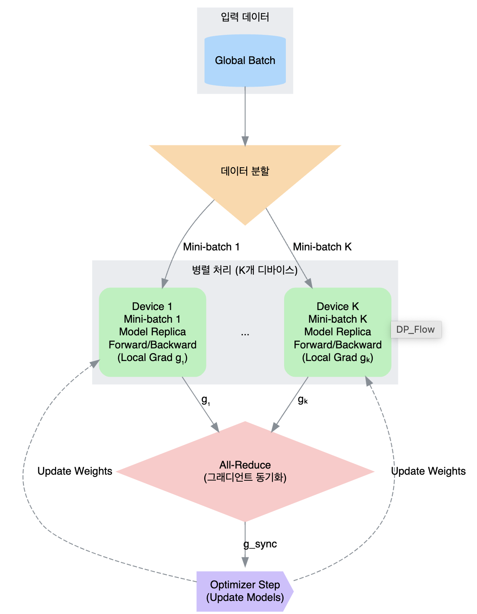
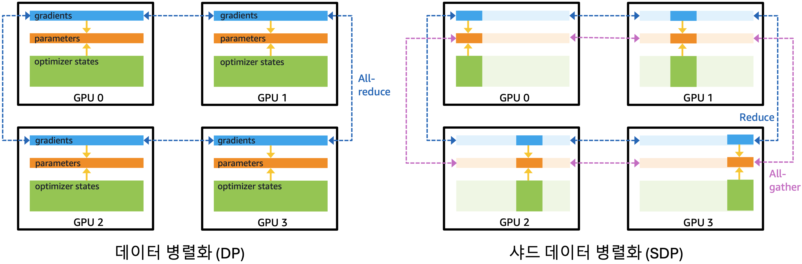
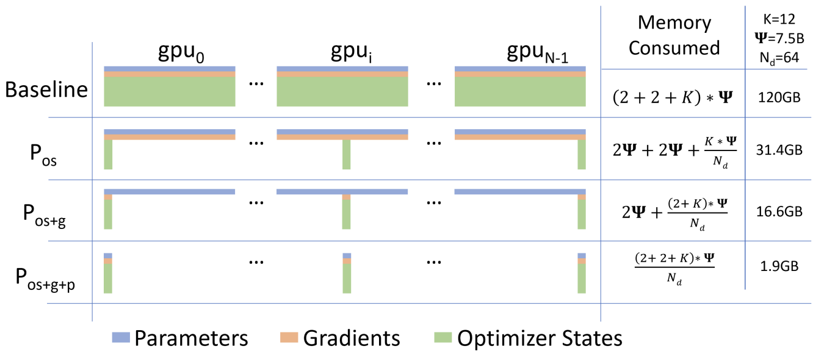
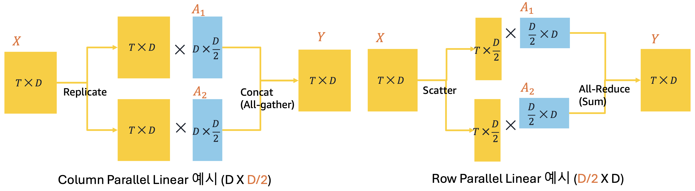
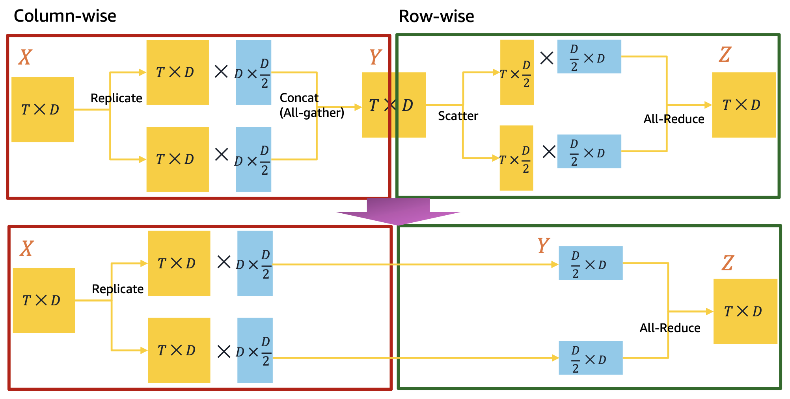
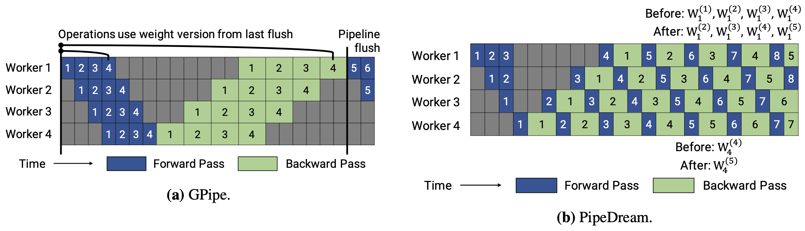

# 분산 훈련 기초 개념

## 1. 분산 훈련의 필요성&#x20;

***

### 1.1. 메모리 제약

1. **모델 파라미터 (Model Parameters)**: FP32가 아닌 FP16 또는 BFloat16(BF16)과 같은 16비트 형식을 사용하더라도 파라미터 저장만으로도 단일 GPU 메모리를 초과할 수 있습니다. 예컨대, FP16이나 BF16(파라미터당 2바이트) 형식의 70B 모델은 140GB의 메모리가 필요합니다.
2. **그래디언트:** 역전파<sup>backpropagation</sup> 동안 각 파라미터에 대한 그래디언트가 계산되는데, 그래디언트는 일반적으로 파라미터 자체와 동일한 차원을 가지며 동일한 정밀도를 필요로 합니다. 따라서 모델 파라미터와 동일한 140GB의 메모리가 필요합니다.
3. **옵티마이저 상태 (Optimizer States):** Adam 또는 AdamW와 같은 옵티마이저는 파라미터당 두 개의 모멘텀<sup>momentum</sup>(그래디언트의 1차 모멘텀과 2차 모멘텀)을 저장합니다. 이러한 상태는 혼합 정밀도 훈련 중에도 안정성을 위해 FP32로 유지되어야 합니다. 이는 추가로 70B x 2 (states) x 4 (bytes) = 560GB가 옵티마이저 상태에 필요하다는 것을 의미합니다.
4. **활성화 (Activations)**: Forward pass 동안, 각 층의 중간 출력(활성화<sup>activation</sup>)은 backward pass 시 그래디언트 계산에 사용하기 위해 저장되어야 합니다. 이러한 활성화의 크기는 배치 크기<sup>batch size</sup>, 시퀀스 길이<sup>sequence length</sup>, 그리고 모델의 은닉 차원<sup>hidden dimensions</sup>에 따라 달라집니다. 대부분의 LLM에서 널리 쓰이는 트랜스포머 아키텍처는 셀프 어텐션<sup>self-attention</sup> 메커니즘이 특히 메모리를 많이 소모하며, 단순 구현에서는 잠재적으로 O(batch\_size x 시퀀스 길이^2 x 은닉 차원 크기의 메모리를 요구합니다. 역전파 도중 activation을 다시 계산하는 activation 체크포인팅과 같은 기법들이 이 메모리 사용량을 줄일 수 있지만, 설정에 따라 여전히 수십 GB에서 수백 GB에 달하는 상당한 activation 메모리가 필요합니다.
5. **워크스페이스 메모리 (Workspace Memory):** GPU 커널(예: cuDNN)이 중간 계산을 위해 필요로 하는 임시 저장 공간입니다.

모델 파라미터, 그래디언트, 옵티마이저 상태만 합쳐도 140 + 140 + 560 = 840GB의 메모리가 필요하며 활성화나 cuDNN과 같은 라이브러리에서 요구하는 워크스페이스 메모리가 반영되면 더욱 많은 메모리가 필요합니다.


활성화를 저장하는 대신 역전파 동안 활성화를 재계산하여 메모리를 절약하는 대가로 계산 시간을 늘리는 활성화 체크포인팅<sup>activation checkpointing</sup> 또는 그래디언트 체크포인팅<sup>gradient checkpointing</sup>과 같은 기법도 종종 사용됩니다.


### 1.2. 계산 제약

LLM을 훈련하는 데 필요한 순수 계산 비용(부동소수점 연산, FLOPs로 측정)은 천문학적입니다. 수십억 매개변수를 가진 모델에 대한 단일 forward pass/backward pass만 하더라도 수조 회의 계산이 필요합니다.

* **FLOPs 요구량:** LLM 훈련은 막대한 데이터셋(수조 토큰)을 여러 에폭<sup>epoch</sup>에 걸쳐 수행하며, 전체 필요한 연산량은 모델 크기와 데이터셋 크기 모두에 따라 크게 증가합니다. 스케일링 법칙은 최적 성능 달성을 위해 상당한 계산 자원이 필요하다는 것을 시사하며, 이는 종종 페타플롭-일(PetaFLOP-days, 1 PetaFLOP = $$10^{15}$$ FLOPs) 단위로 측정됩니다.
* **훈련 시간:** 가장 빠른 단일 가속기라도 초당 수행할 수 있는 FLOPs는 유한합니다. (예: Dense 연산만 해도 수백 테라플롭 수준입니다.) 전체 LLM 사전훈련을 위해 필요한 엑사플롭스(ExaFLOPs, $$10^{18}$$ FLOPs) 이상을 단일 GPU에서 수행하려면 수개월, 수년 또는 수십 년이 걸릴 수 있어 비실용적입니다.
* **어텐션 복잡도:** 트랜스포머의 근본 메커니즘인 셀프어텐션<sup>self-attention</sup>은 계산 복잡도가 O(시퀀스 길이^2 x 은닉 차원)입니다. 모델이 더 긴 컨텍스트 창으로 훈련될수록 어텐션의 기하급수적으로 증가합니다.


## 2. 분산 훈련에서의 통신 프리미티브(Communication Primitives)

***

### 2.1. 개요

분산 훈련은 여러 프로세스가 데이터를 주고받는 집합 통신<sup>collective communication</sup>에 의존하며, LLM 학습에서 가장 일반적으로 통신 프리미티브<sup>communication primitives</sup>는 다음과 같습니다.

1. **Broadcast**: 루트(rank 0) 프로세스가 가진 텐서를 모든 다른 프로세스에 동일하게 복사합니다. 모델 파라미터 초기화 시, rank 0에서 로드한 가중치<sup>weight</sup>를 모든 GPU에 뿌릴 때 사용됩니다.
2. **Reduce**: 모든 프로세스의 데이터를 단일 프로세서로 모아서 특정 연산(합, 평균, 최대값 등)을 수행하는 연산입니다. 데이터 병렬에서 루트 프로세스에서 최종 loss를 집계할 때 사용됩니다.
3. **All-Reduce**: Reduce 연산을 수행한 후 그 결과를 모든 노드에 broadcast하는 연산으로 가장 중요한 프리미티브 중 하나입니다. 데이터 병렬에서 그래디언트를 동기화할 때 광범위하게 사용됩니다.
4. **Scatter**: 루트가 가진 큰 텐서를 조각내어 다른 프로세스에 분배합니다.
5. **Gather**: 모든 프로세스에서 데이터 청크를 수집하여 루트 프로세스가 하나로 모아 이어붙입니다. (concatenate).
6. **All-Gather**: Gather로 완전하게 연결된<sup>concatenated</sup> 데이터를 다시 모든 프로세스에 분배합니다. 텐서 병렬에서 모델 가중치 shard를 모아 full weight로 연산할 때 사용합니다.
7. **Reduce-Scatter**: 모든 프로세스의 데이터를 먼저 Reduce(합/평균 등)한 뒤, 그 결과를 다시 균등하게 분할하여 각 프로세스에 하나씩 배포합니다. All-Reduce를 최적화할 때 (특히 Ring All-Reduce 구현에서), 집계와 분할을 결합해 통신량을 절감할 때 사용합니다.
8. **Point-to-Point, `send` / `recv`**: 한 프로세스가 다른 프로세스로 데이터를 직접 전송하는 개별 통신 연산입니다. 이는 파이프라인 병렬의 주요 메커니즘입니다.
9. **All-to-All:** 각 프로세스가 N개의 조각을 만들어 N개 프로세스 각각에 하나씩 전송하고, 모든 프로세스가 동시에 동일한 작업을 수행합니다. MoE의 전문가 병렬화에서 주로 사용됩니다.

<figure><figcaption><p>통신 프리미티브 도식 (출처: <a href="https://images.nvidia.com/events/sc15/pdfs/NCCL-Woolley.pdf">https://images.nvidia.com/events/sc15/pdfs/NCCL-Woolley.pdf</a>)</p></figcaption></figure>

<table><thead><tr><th width="136.1171875">Primitive</th><th width="169.0703125">Direction</th><th width="249.53515625">주요 용도</th><th>결과 데이터 소유</th></tr></thead><tbody><tr><td><strong>Broadcast</strong></td><td>1 → N</td><td>파라미터 초기화/동기화</td><td>모든 GPU 동일 데이터</td></tr><tr><td><strong>Reduce</strong></td><td>N → 1</td><td>Loss 집계</td><td>루트 GPU만 결과</td></tr><tr><td><strong>All-Reduce</strong></td><td>N → N</td><td>그래디언트 평균, 파라미터 동기화</td><td>모든 GPU 동일 결과</td></tr><tr><td><strong>Scatter</strong></td><td>1 → N (분할)</td><td>배치 분배</td><td>각 GPU 일부만</td></tr><tr><td><strong>Gather</strong></td><td>N → 1 (합침)</td><td>결과 모음</td><td>루트 GPU가 전체 보유</td></tr><tr><td><strong>All-Gather</strong></td><td>N → N (합침)</td><td>파라미터 샤딩, 텐서 병합</td><td>모든 GPU 전체 보유</td></tr><tr><td><strong>Reduce-Scatter</strong></td><td>N → N (집계 후 분할)</td><td>All-Reduce 최적화, 통신량 절감</td><td>각 GPU 집계 결과의 일부</td></tr><tr><td><strong>Point-to-Point</strong></td><td>1 ↔ 1</td><td>stage간 활성화/그래디언트 전달</td><td>지정된 GPU만</td></tr><tr><td><strong>All-to-All</strong></td><td>N ↔ N (맞교환)</td><td>MoE, 샤딩 재배치</td><td>GPU별 맞춤 데이터</td></tr></tbody></table>

### 2.2. 분산 훈련 전략에 따른 통신 비용 비교

* **데이터 병렬화**: 각 훈련 스텝마다 모든 디바이스의 그래디언트를 `all_reduce` 연산으로 동기화합니다. 메시지 크기가 전체 모델 파라미터 크기와 동일하여 대용량이지만, 통신 빈도가 낮아 상대적으로 효율적입니다. 주요 병목은 `all-reduce` 연산 자체의 실행 시간입니다.
* **샤딩 데이터 병렬화**: forward/backward pass마다 필요한 파라미터를 `all_gather`로 수집하고 그래디언트를 `reduce_scatter`로 분산합니다. 메모리 효율성을 얻는 대신 매 연산마다 파라미터 재구성을 위한 통신이 필요하며, 이로 인한 메모리 재구성 오버헤드가 발생합니다.
* **텐서 병렬화**: 각 레이어 연산 시마다 `all_reduce`, `all_gather`, `reduce_scatter` 등 다양한 집합 통신을 수행합니다. 개별 메시지 크기는 작거나 중간 수준이지만, 레이어당 여러 번 통신이 발생하여 전체적으로 높은 통신 오버헤드를 가집니다.&#x20;
* **파이프라인 병렬화**: 인접한 스테이지 간에만 `send`/`recv`로 Point-to-Point 통신을 수행합니다. 스테이지 경계의 활성화와 그래디언트만 전송하므로 통신량이 상대적으로 적지만, 파이프라인 버블과 스테이지 간 동기화 지연이 주요 병목입니다.

<table><thead><tr><th width="107.6328125">분산 훈련 전략</th><th width="141.59375">주요 연산</th><th>메시지 크기</th><th>빈도</th><th>병목 지점</th></tr></thead><tbody><tr><td>데이터 병렬화</td><td><code>all_reduce</code></td><td>모델 그래디언트 (대용량)</td><td>(누적된) 스텝당 1회</td><td>All-Reduce 시간</td></tr><tr><td>샤딩 데이터 병렬화</td><td><code>all_gather</code>, <code>reduce_scatter</code></td><td>파라미터 샤드 (중용량)</td><td>Forward/Backward당 1회</td><td>메모리 재구성 오버헤드</td></tr><tr><td>텐서 병렬화</td><td><code>all_reduce</code>, <code>all_gather</code>, <code>reduce_scatter</code></td><td>레이어 활성화/그래디언트 (소/중용량)</td><td>레이어당 여러 번</td><td>빈번한 집합 통신 호출</td></tr><tr><td>파이프라인 병렬화</td><td><code>send</code> / <code>recv</code></td><td>경계 활성화/그래디언트 (중/대용량)</td><td>마이크로배치/스테이지당 1회</td><td>파이프라인 버블, 스테이지</td></tr></tbody></table>

### 2.3. 통신 소요 시간

통신에 소요되는 시간은 아래과 같은 다양한 요인에 따라 달라집니다.

* **지연** ($$\alpha$$): 크기와 관계없이 모든 통신을 시작하는 데 필요한 고정 시작 시간입니다. 이는 종종 네트워크 프로토콜 오버헤드와 장치 간 물리적 거리/hop 수에 의해 결정됩니다.
* **대역폭** ($$\beta$$): 네트워크 링크를 통해 데이터를 전송할 수 있는 속도이며, 일반적으로 기가비트/초(Gbps) 또는 기가바이트/초(GB/s)로 측정됩니다. 데이터 전송 시간은 대역폭에 반비례합니다.
* **메시지 크기** ($$M$$): 전송되는 데이터의 양입니다. 메시지가 클수록 주로 대역폭의 영향을 받아 더 오래 걸립니다.
* **디바이스 수** ($$P$$): 많은 집단 연산은 참여하는 디바이스 수에 따라 시간 복잡도가 스케일링됩니다. 예를 들어, All-Reduce는 선형적으로 스케일할 수 있지만, Ring All-Reduce와 같은 최적화된 알고리즘은 sub-linear로 스케일할 수 있습니다.
* **네트워크 토폴로지 및 하드웨어**: 네트워크의 물리적 구성과 특정 인터커넥트 기술(예: 이더넷, InfiniBand, NVIDIA NVLink/NVSwitch)은 노드 간 통신에서 달성 가능한 대역폭과 지연에 큰 영향을 미칩니다.
* **집단 알고리즘 (Collective Algorithm)**: 집단 연산을 구현하는 특정 알고리즘(예: All-Reduce용 링, 트리, 버터플라이 알고리즘)은 메시지 크기와 네트워크 토폴로지에 따라 서로 다른 성능 특성을 보입니다. NVIDIA NCCL (Collective Communications Library)과 같은 라이브러리는 NVIDIA GPU용으로 이러한 알고리즘의 매우 최적화된 버전을 구현합니다.

단일 크기 $$M$$의 메시지에 대한 통신 시간 $$T$$의 일반적인 모델은 **알파-베타(alpha-beta) 모델**입니다:

$$
T \approx \alpha + \frac{M}{\beta_{eff}}
$$

$$\alpha$$는 대기 시간(latency) 성분을 나타내며, $$\beta_{eff}$$는 전송에 대해 달성된 유효 대역폭입니다.

### 2.4. 통신 프로파일링

이론적 분석은 직관적이지만, 모델 훈련 과정에서의 실제 통신 오버헤드는 구현 세부사항, 하드웨어, 네트워크 구성 및 소프트웨어 스택(예: PyTorch 버전, NCCL 버전)에 크게 의존하기에 프로파일링이 필수적입니다. 이 때 `torch.profiler`, NVIDIA Nsight Systems (`nsys`) 또는 프레임워크별 로깅과 같은 도구는 서로 다른 통신 연산(`nccl:all_reduce`, `nccl:send` 등)과 계산 커널에서 소비되는 시간을 측정하는 데 도움이 됩니다. 이러한 프로파일을 분석하는 것은 병목 현상을 식별하고 분산 학습 구성을 최적화하는 데 중요합니다.

```python
# torch.profiler를 사용하여 CPU 및 GPU 활동을 캡처하는 예시 - 분산 통신 호출 포함
with torch.profiler.profile(
    activities=[
        torch.profiler.ProfilerActivity.CPU,
        torch.profiler.ProfilerActivity.CUDA
    ],
    record_shapes=True,
    profile_memory=True,
    with_stack=True
) as prof:
    with torch.profiler.record_function("model_training_step"):
        outputs = model(inputs)
        loss = criterion(outputs, targets)
        loss.backward()
        optimizer.step()

# 집계된 통계치 출력
print(prof.key_averages().table(sort_by="cuda_time_total", row_limit=10))
```

각 병렬화 전략에 관련된 기본적인 통신 패턴과 비용을 이해하고, 프로파일링 도구를 사용해 성능을 측정함으로써 LLM 학습 워크로드를 어떻게 분배해야 효율을 극대화하고 학습 시간을 최소화할지에 대해 정보에 기반한 결정을 내릴 수 있습니다.


## 3. 데이터 병렬화/텐서 병렬화/파이프라인 병렬화

***

### 3.1. 데이터 병렬화 (DP)

데이터 병렬화(DP; Data Parallelism)는 동일한 모델을 여러 디바이스에 복제하고, 각 디바이스가 서로 다른 데이터 배치를 처리하는 병렬화 기법으로 딥러닝 모델의 학습 계산 부하를 분산하기 위한 가장 직관적이고 일반적인 기법입니다.

<figure><figcaption></figcaption></figure>

#### 작동 원리

1. **모델 복제**: 각 GPU/디바이스에 동일한 모델 복사본 생성
2. **데이터 분할**: 전체 배치를 여러 미니배치로 분할
3. **병렬 처리**: 각 디바이스가 할당된 미니배치 독립적으로 처리
4. **그래디언트 동기화**: 역전파 후 모든 디바이스의 그래디언트 평균 계산 (All-Reduce 연산 활용)
5. **파라미터 업데이트**: 동기화된 그래디언트로 모든 모델 파라미터 동시 업데이트

#### 장점

* **구현 단순성:** 약간의 훈련 코드 수정만으로도 데이터 병렬을 비교적 간단하게 구현할 수 있으며, PyTorch와 같은 딥러닝 프레임워크는 데이터 병렬을 구현하기 위한 `DistributedDataParallel` 고수준 추상화를 제공합니다.&#x20;
* **처리량 증가:** 데이터를 병렬로 처리함으로써 DP는 학습 스텝당 시간을 크게 줄여 대규모 데이터셋을 더 빠르게 반복하거나 더 큰 유효 배치 크기를 사용할 수 있게 하며, 이는 때때로 모델 수렴 및 일반화 성능을 개선할 수 있습니다.
* **광범위한 적용성:** 데이터 병렬은 모델 아키텍처 자체에 근본적인 변경을 요구하지 않습니다. 대부분의 표준 네트워크 설계에 대해 곧바로 사용할 수 있습니다.

#### 단점

* **메모리 제약:** 주요 단점은 각 디바이스가 모델의 파라미터, 그래디언트 및 옵티마이저 상태뿐만 아니라 미니배치에 대해 forward pass 중 계산된 활성화의 전체 복사본을 반드시 보유해야 한다는 점입니다. 결국 데이터 병렬만으로 학습할 수 있는 최대 모델 크기는 한계가 있습니다.
* **통신 오버헤드:** All-Reduce 연산은 모든 디바이스에 걸쳐 그래디언트를 동기화로 통신해야 합니다. 전송되는 데이터의 양은 모델 파라미터의 크기에 비례합니다. GPU 디바이스/노드가 증가하거나 디바이스 간 인터커넥트 대역폭이 제한되는 경우, 이 동기화 단계는 상당한 병목이 되어 병렬 계산으로 얻는 속도 향상을 감소시킵니다.

### 3.2. 샤드 데이터 병렬화 (SDP)

데이터 병렬이 모델 전체 복제를 전제하는 반면, 샤드 데이터 병렬화(SDP; Sharded Data Parallel)는 파라미터·그라디언트·옵티마이저 상태를 여러 디바이스에 분할<sup>shard</sup> 해서 보관하고, 필요한 순간에만 모아 연산함으로써 메모리 사용량을 줄이는 병렬화 기법입니다. 필요 시 CPU/NVMe 오프로딩<sup>offloading</sup>, 자동 혼합 정밀도(AMP; Automatic Mixed Precision), 체크포인팅과 병행하여 메모리를 더욱 절약할 수 있습니다.&#x20;

<figure><figcaption></figcaption></figure>

#### **DeepSpeed (ZeRO)**

ZeRO(Stage 1/2/3) 로 모델 상태(옵티마이저→그래디언트→파라미터)를 순차적으로 분할해 중복을 제거합니다. ZeRO-Offload(CPU/NVMe), 혼합 정밀·커스텀 옵티마이저, 통신-연산 오버랩, ZeRO++(계층적 파티셔닝/압축) 등 엔진 수준 최적화가 풍부합니다.

<figure><figcaption><p>DeepSpeed ZeRO Stage 1/ZeRO Stage 2/ZeRO Stage 3 (출처: <a href="https://arxiv.org/pdf/1910.02054">https://arxiv.org/pdf/1910.02054</a>)</p></figcaption></figure>

* **ZeRO Stage 1**: **옵티마이저 상태**<sup>**optimizer states**</sup>**를 분할**<sup>**partition**</sup>합니다. 예를 들어 Adam은 모멘텀과 분산 버퍼를 유지하는데, FP32 기준으로 모델 파리미터x2의 크기입니다. ZeRO-1은 이러한 옵티마이저 상태를 데이터 병렬 GPU들에 걸쳐 분할하며, 각 GPU는 자신의 데이터 병렬 랭크에 해당하는 전체 옵티마이저 상태의 일부 슬라이스만 보유합니다. 약 4배의 메모리를 절감합니다.
* **ZeRO Stage 2**: **옵티마이저 상태와 그래디언트를 분할**합니다. 역전파 단계에서는 모든 GPU에서 그래디언트를 합산하기 위해 All-Reduce 연산을 사용하는 대신, Stage 2는 Reduce-Scatter 연산을 사용합니다. 이 연산은 합을 계산한 뒤 결과를 즉시 분산<sup>scatter</sup>하므로 각 GPU는 옵티마이저 상태의 자신의 파티션에 해당하는 그래디언트 파티션만 받습니다. 약 8배의 메모리를 절감하며, 통신 오버헤드는 여전히 DP와 유사합니다.
* **ZeRO Stage 3**: 가장 공격적인 최적화 방법으로, 세 가지 주요 모델 상태인 **옵티마이저 상태, 그래디언트, 모델 파라미터를 모두 분할**합니다. 각 GPU는 주어진 시점에 파라미터의 샤드만 보유합니다. 이것은 더 정교한 관리가 필요한데 순전파 및 역전파 동안 각 GPU는 특정 레이어 계산에 대해 전체 파라미터에 접근할 필요가 있습니다. ZeRO-3는 계산 직전에 다른 GPU들로부터 필요한 파라미터 샤드를 동적으로 모아(gather) 사용하고, 사용 후 즉시 메모리를 확보하기 위해 이를 폐기(discard)함으로써 이를 처리합니다. 메모리 절감이 DP 크기에 선형 비례(예: 64 GPU면 64배)하지만, 순전파 및 역전파 동안 파라미터 샤드를 빈번히 모아야 하므로 Stage 1 및 2에 비해 통신량이 대폭 증가합니다. 따라서, NVLink나 NVSwitch와 같은 고대역폭 인터커넥트를 사용하는 것이 매우 중요합니다. 또한 Stage 3 내에서 ZeRO-Offload변형을 고려할 수 있는데, 이는 더 큰 모델을 위해 파티션을 CPU RAM이나 NVMe 스토리지로 오프로드하는 방식으로 접근 시간이 느려지지만 더욱 큰 GPU 메모리 절감이 가능합니다.

#### **PyTorch FSDP (Fully Sharded Data Parallel)**

파라미터·그래디언트·옵티마이저 상태를 전부 샤딩(FULL\_SHARD)하고 필요 시 shard\_grad\_op 등으로 일부 파라미터만 샤딩합니다. (FSDP FULL\_SHARD ≈ DeepSpeed ZeRO-3, FSDP SHARD\_GRAD\_OP ≈ DeepSpeed ZeRO-2)

#### DeepSpeed vs. **FSDP**

DeepSpeed의 ZeRO와 비교했을 때 FSDP는 PyTorch 네이티브 모듈이라는 점이 큰 특징입니다. ZeRO 역시 단계적으로 모델 상태를 분할해 메모리 사용량을 줄이지만, 별도의 런타임 엔진과 설정(JSON 파일 등)을 요구하고, 다양한 최적화 옵션(커스텀 옵티마이저, NVMe offload, 압축 통신 등)이 포함된 더 포괄적인 학습 엔진으로 동작합니다. 반면 FSDP는 PyTorch의 모듈 래핑 API와 밀접하게 통합되어 있고, 자동 래핑 정책을 사용하면 특정 레이어 단위로 손쉽게 shard를 적용할 수 있어 PyTorch 중심 워크플로우에 자연스럽게 녹아듭니다. 기능 면에서 FSDP의 FULL\_SHARD 모드는 ZeRO-3와 거의 동일한 수준의 분할을 제공하지만, 세부 옵션은 DeepSpeed가 더 풍부하고, 통신 최적화와 오프로딩 전략을 세밀하게 제어할 수 있습니다. 반대로 FSDP는 디버깅과 유지보수가 상대적으로 단순하고, 허깅페이스 Accelerate나 PyTorch Lightning 같은 생태계 도구와 바로 호환되기 때문에 PyTorch 기반 연구 환경에서의 접근성이 좋습니다.

결국 선택은 워크플로우의 맥락에 따라 달라집니다. PyTorch 네이티브 통합과 간결성을 중시한다면 FSDP가 적합하고, 더 공격적인 메모리 절감, 오프로딩, 통신 최적화가 필요하거나 초대형 모델(수십\~수백B 파라미터) 훈련을 계획한다면 DeepSpeed ZeRO가 강력한 선택지가 됩니다. 두 방식 모두 all-gather와 reduce-scatter 통신이 병목이 될 수 있으므로, 네트워크 성능과 통신-연산 오버랩 전략을 함께 고려하는 것이 중요합니다.

#### **장점**

* **대규모 모델 학습 가능**: 동일 GPU 수로 훨씬 큰 모델/배치가 들어감.
* **메모리 효율**: DP의 중복 제거(파라미터·그라드·옵티마이저 상태까지)로 큰 절감.
* **유연한 최적화**: AMP, 체크포인팅, CPU/NVMe 오프로딩 등과 결합해 추가 절감.

**단점**

* **통신량 증가**: 레이어마다 all-gather / reduce-scatter가 추가되어 네트워크 대역 의존도 증가.
* **스케줄링 난이도**: auto-wrap, bucket 크기, prefetch/overlap, 오프로딩 정책 등 튜닝 포인트가 많음.
* **디버깅/수치 안정성**: 부분 정밀도, 재샤딩 타이밍, 큰 모듈의 래핑 경계에서 이슈가 날 수 있음.

### 3.3. 텐서 병렬화 (TP)

텐서 병렬화(TP; Tensor Parallelism)는 특정 연산 내에서 실제 텐서(가중치, 활성화, 그래디언트)를 여러 디바이스에 걸쳐 분할합니다. 이를 통해 이러한 큰 텐서들에 대한 연산을 병렬로 수행할 수 있으며, FFN 및 트랜스포머 레이어의 메모리 풋프린트와 계산 부하를 분산시킬 수 있습니다.

<figure><figcaption><p>열 병렬화와 행 병렬화 예시</p></figcaption></figure>

<figure><figcaption><p>FFN 통신 최적화 예시: 열 병렬화와 행 병렬화를 통해 All-gather와 Scatter 통신 프리미티브 제외 가능</p></figcaption></figure>

#### **열 병렬화 (Column Parallelism)**

가중치 행렬 $$A$$를 수직으로 (열 방향) 여러 디바이스들에 걸쳐 분할합니다. 2개 디바이스의 경우 $$A = [A_1, A_2]$$로 분할합니다. 입력 $$X$$는 일반적으로 브로드캐스트되거나 두 디바이스 모두에서 가능하며, 각 디바이스는 그 다음 출력의 일부를 계산합니다:

* 디바이스 1은 $$Y_1 = X A_1$$를 계산하고 디바이스 2는 $$Y_2 = X A_2$$를 계산. ($$X$$는 입력)
* 결과 $$Y_1$$과 $$Y_2$$는 연결되어 최종 출력 $$Y$$를 형성. $$Y = [Y_1, Y_2]$$

#### **행 병렬화 (Row Parallelism)**

가중치 행렬 $$A$$는 수평으로 (행 방향) 분할됩니다. 2개 디바이스의 경우 $$A = \begin{bmatrix} A_1 \\ A_2 \end{bmatrix}$$로 분할합니다. 이 때 입력 $$X$$도 열을 따라 분할되어 있다고 간주됩니다 (종종 이전의 열 병렬<sup>column-parallel</sup> 계층의 출력이기 때문입니다). 하지만 단순화를 위해 입력 $$X$$가 2개 디바이스 모두에 있다고 가정하겠습니다. 각 디바이스는 자신의 가중치 조각에 기반한 부분 결과를 계산합니다:

* 디바이스 1은 $$Y_1 = X A_1$$를 계산하고 디바이스 2는 $$Y_2 = X A_2$$를 계산. (참고: 이 식은 약간 단순화되어 있습니다. 실제로는 $$X=[X_1, X_2]$$로 분할 후, 디바이스 1은 $$X_1 A_1$$을 계산하며 디바이스 2는 $$X_2 A_2$$를 계산합니다.)
* 최종 출력 $$Y$$는 부분 결과들의 합. $$Y = Y_1 + Y_2$$

#### **FFN 블록**

표준 트랜스포머 2-stage FFN 블록은 $$Y = \sigma(XA)B + X$$ (residual 연결 포함)을 계산합니다.&#x20;

1. **1st Linear Layer** ( $$XA$$ )**:** 행렬 $$A$$에는 열 병렬화<sup>column parallelism</sup>를 사용합니다. ($$A = [A_1, A_2]$$ 로 분할 후 각각의 디바이스에서 $$Z_1 = XA_1$$ 및 $$Z_2 = XA_2$$를 계산합니다. 출력은 $$[Z_1, Z_2]$$입니다. 이 단계는 backward pass에서 그래디언트 계산을 위해 all-reduce를 필요로 하지만, forward pass에서는 $$X$$가 이미 두 디바이스에 존재한다면 통신이 필요하지 않습니다.
2. **Activation:** 분할된 출력에 대해 활성화 함수(예: GeLU, SwiGLU)를 요소별로 적용합니다. $$G_1 = \sigma(Z_1), G_2 = \sigma(Z_2)$$. 이 과정에서는 통신이 필요하지 않습니다.
3. **2nd Linear Layer** ( $$GB$$ )**:** 행렬 $$B$$에는 행 병렬화<sup>row parallelism</sup>를 사용합니다. $$B = \begin{bmatrix} B_1 \ B_2 \end{bmatrix}$$로 분할 후, 디바이스 1은 $$Y_1 = G_1 B_1$$를 계산하고, 디바이스 2는 $$Y_2 = G_2 B_2$$를 계산합니다.
4. **합산:** 선형 변환의 최종 출력은 $$Y = Y_1 + Y_2$$입니다. 이 합산은 forward pass에서 all-reduce 집단 연산을 사용하여 수행됩니다. Backward pass에서는 입력 $$G_1, G_2$$에 대해 all-reduce가 필요하지 않습니다.

#### **어텐션 블록**

1. **Q, K, V 투영:** 입력을 쿼리<sup>query</sup>, 키<sup>key</sup>, 밸류<sup>value</sup>로 투영하는 데 사용되는 가중치 행렬 $$W_Q, W_K, W_V$$는 종종 FFN의 첫번째 선형층과 유사하게 열 병렬화로 분할됩니다. $$Q = XW_Q, K = XW_K, V = XW_V$$는 디바이스 간에 병렬로 계산되어 $$Q = [Q_1, Q_2], K = [K_1, K_2], V = [V_1, V_2]$$로 분할됩니다.
2. **어텐션 점수 계산:** 어텐션 점수 $$S = \text{softmax}\left(\frac{QK^T}{\sqrt{d_k}}\right)$$는 분할된 Q와 K 텐서 간의 행렬 곱을 포함합니다. 이는 전체 어텐션 행렬이나 각 디바이스에서 필요한 부분을 계산하기 위해 신중한 구현과 통신(예: 특정 분할 전략에 따라 all-gather 연산이 필요할 수 있음)을 요구합니다.
3. **Value 집계:** 출력 $$O = SV$$는 어텐션 점수 $$S$$ 와 분할된 밸류 텐서 $$V$$의 곱입니다.
4. **Output 투영:** 어텐션 블록의 최종 선형 계층 $$O W_O$$은 일반적으로 MLP의 두 번째 선형층과 유사하게 행 병렬화를 적용하기에 결과를 결합하기 위해 forward pass에서 all-reduce를 필요로 합니다.

#### 장점&#x20;

* **대규모 모델 훈련:** 레이어 자체가 단일 디바이스의 메모리에 너무 클 때 TP는 필수적입니다.
* **다른 병렬화 전략과 보완적:** TP는 다른 병렬화 기법과 결합하여 하이브리드 병렬화 접근법을 형성할 수 있습니다 (예: 파이프라인 스테이지 내에서 TP를 사용하고 이를 DP로 복제).
* **오버랩 가능성:** 정교한 구현은 통신을 연산과 오버랩시켜 대기 시간을 숨길 수 있습니다.

#### 단점&#x20;

* **통신 빈도**: 각 레이어마다 디바이스 간 통신이 필요하기에 통신 오버헤드가 증가합니다. DP는 일반적으로 학습 단계당 그래디언트에 대해 한 번의 all-reduce를 포함하는 반면, TP는 각 트랜스포머 블록의 forward pass 및 backward pass 내에서 통신을 수행하기 때문입니다.
  * **열 병렬화 (Column Parallelism):** Backward pass 동안 입력 $$X$$에 대한 그래디언트 계산을 위해 all-reduce
  * **행 병렬화 (Row Parallelism):** Forward pass 동안 출력을 합산하기 위해 all-reduce
  * **어텐션 (Attention):** 구현 방식에 따라 all-gather와 같은 추가 통신 수반
* **통신 병목**: 동기 통신으로 인한 대기 시간이 발생합니다. 통신 연산은 TP 그룹에 참여하는 모든 디바이스 간의 동기화 및 데이터 교환이 필요하며, 교환되는 데이터의 양은 통신되는 활성값이나 그래디언트의 크기에 따라 달라집니다. TP 그룹의 디바이스 수에 따라 확장되며, 디바이스 간 인터커넥트 대역폭(예: NVLink, InfiniBand)이 연산 속도에 비해 충분하지 않으면 병목 현상이 발생합니다.
* **구현 복잡성:** 텐서 분할 및 통신 로직이 복잡하기에 신중한 코드 수정이 요구됩니다. NVIDIA의 Megatron-LM이나 Microsoft의 DeepSpeed와 같은 TP에 최적화된 라이브러리를 사용하는 것이 좋습니다.

### 3.4. 파이프라인 병렬화 (PP)

파이프라인 병렬화(PP; Pipeline Parallelism)는 모델을 여러 단계(스테이지)로 분할하고, 각 단계를 서로 다른 디바이스에 배치하여 순차적으로 처리하는 기법입니다. 예를 들어 레이어 1-12를 GPU 0에, 레이어 13-24를 GPU 1에, 레이어 25-36을 GPU 2에 할당하는 식으로 구성합니다. 단일 디바이스에서 실행되는 각 레이어 그룹을 스테이지<sup>stage</sup> 또는 파티션<sup>partition</sup>이라고 합니다.

#### 작동 원리

1. **모델 분할**: 레이어를 여러 스테이지로 그룹화
2. **스테이지 배치**: 각 스테이지를 서로 다른 디바이스에 할당
3. **파이프라인 실행**: 데이터가 스테이지를 순차적으로 통과
4. **마이크로배치**: 배치를 작은 마이크로배치로 분할하여 병렬성 향상

#### 파이프라인 버블 (Pipeline Bubble)

파이프라인 병렬화에서 중요한 문제 중 하나는 파이프라인 버블<sup>pipeline bubble</sup>이라 불리는 유휴 상태입니다. 배치 처리를 시작할 때 처음에는 스테이지 0만 활성화되어 있습니다. 스테이지 1은 스테이지 0이 첫 번째 마이크로배치를 끝낼 때까지 기다려야 하고, 스테이지 2는 스테이지 1을 기다려야 합니다. 역전파 동안에도 초기 단계들은 이후 단계에서 그래디언트가 도착하기를 기다리며 유휴 상태가 됩니다. 이러한 시작 및 종료 기간은 하드웨어의 활용도를 떨어뜨립니다.

버블을 최소화하려면 마이크로배치 개수를 늘려야 합니다. (예: GPipe) 그러나 이를 무분별하게 늘리면 마이크로배치가 작아져 각 GPU의 계산능력을 완전히 활용하지 못할 수 있고, 동시에 진행 중인 모든 마이크로배치에 대한 전체 활성화 메모리 요구량이 증가합니다.

#### 파이프라인 스케줄링 (Pipeline Scheduling)

버블을 완화하기 위해 다양한 스케줄링 전략이 개발되었습니다. 일반적이고 효과적인 전략 중 하나는 PipeDream 같은 프레임워크에서 널리 알려진 **1F1B (one forward, one backward)** 스케줄링입니다.

1F1B 스케줄에서는 각 스테이지가 다가오는 마이크로배치에 대해 forward pass를 수행하는 것과 이미 완료된 마이크로배치에 대해 backward pass를 수행하는 것을 번갈아 가며 진행합니다. 현재 스테이지가 마이크로배치 `i`에 대한 전방 패스를 완료하면, 다음 단계에서 기울기가 사용 가능한 경우 해당 스테이지는 즉시 마이크로배치 `i-k`(여기서 `k`는 Stage 수와 관련됨)에 대한 backward pass를 수행할 수 있습니다.

<figure><figcaption><p>파이프라인 스케줄링 예시 - GPipe및 PipeDream. (출처: <a href="https://arxiv.org/abs/2006.09503">https://arxiv.org/abs/2006.09503</a>)</p></figcaption></figure>

#### **장점**

* **모델 깊이 확장:** 텐서 병렬화만으로는 한 장치의 메모리에 들어가지 않는 매우 깊은 모델을 학습할 수 있게 합니다.
* **메모리 효율성(활성화):** 순수 데이터 병렬화에 비해, 각 장치는 모델의 일부(segment)에 대한 활성화만 보유하기 때문에 경우에 따라 활성화 메모리 측면에서 더 효율적일 수 있습니다. 다만 이 이점은 마이크로배칭 전략에 크게 의존합니다.
* **통신량 감소(잠재적):** 통신은 일반적으로 인접 스테이지 간에만 발생하며 활성화 또는 그래디언트가 주로 교환됩니다. 활성화가 모델 파라미터보다 작은 경우에는 DP의 빈번한 AllReduce 연산이나 TP의 텐서 분할/병합 연산보다 대역폭 소모가 적을 수 있습니다.

#### **단점**

* **파이프라인 버블:** 많은 마이크로배치와 복잡한 스케줄링으로 완화하지 않으면 고유의 유휴 시간이 하드웨어 활용도를 떨어뜨립니다.
* **복잡성:** 효율적인 스케줄링 구현과 마이크로배치 간 상태 관리는 상당한 복잡성을 더합니다.
* **지연 (latency) 이슈:** 스테이지를 순차적으로 거치는 특성 때문에 각 마이크로배치 처리에 지연이 추가됩니다. 또한 스테이지 간 계산 부하 균형에 크게 좌우되기에 스테이지가 불균형하면 병목이 발생합니다.

#### 코드 스니펫

```python
import torch
import torch.nn as nn

# --- 다른 곳에서 정의되었다고 가정 ---
# get_my_stage_id() -> int
# get_num_stages() -> int
# get_device_for_stage(stage_id) -> torch.device
# send_tensor(tensor, to_stage_id)
# recv_tensor(from_stage_id) -> tensor
# global_micro_batch_size = ...
# model_layers = [...] # 모든 모델 레이어의 리스트

class PipelineStage(nn.Module):
    def __init__(self, layers, stage_id):
        super().__init__()
        self.layers = nn.ModuleList(layers)
        self.stage_id = stage_id
        self.device = get_device_for_stage(stage_id)
        self.to(self.device)

    def forward(self, x):
        # 단순화: x가 이전 스테이지에서 받아졌다고 가정
        # stage_id > 0인 경우
        if x is not None:
             x = x.to(self.device)

        for layer in self.layers:
            x = layer(x)
        return x

# --- 모델 분할 (예시) ---
my_stage_id = get_my_stage_id()
num_stages = get_num_stages()
# 단순화된 균형 조정
layers_per_stage = len(model_layers) // num_stages

start_layer = my_stage_id * layers_per_stage
if my_stage_id < num_stages - 1:
    end_layer = (my_stage_id + 1) * layers_per_stage
else:
    end_layer = len(model_layers)
my_layers = model_layers[start_layer:end_layer]

pipeline_module = PipelineStage(my_layers, my_stage_id)

def training_step(micro_batch_data):
    activations = None
    if my_stage_id == 0:
        activations = micro_batch_data # 첫 번째 스테이지의 입력 데이터
    else:
        # 이전 스테이지에서 활성화 값 받기
        activations = recv_tensor(from_stage_id=my_stage_id - 1)

    # 이 스테이지의 레이어들을 통한 순전파
    output_activations = pipeline_module(activations)

    if my_stage_id < num_stages - 1:
        # 다음 스테이지로 활성화 값 전송
        send_tensor(output_activations, to_stage_id=my_stage_id + 1)
        # 역전파를 위해 output_activations를 저장해야 함
        # 1F1B와 같은 스케줄을 사용하는 경우
    else:
        # 마지막 스테이지에서 손실 계산
        loss = compute_loss(output_activations, target_labels)
        loss.backward()
        # 이전 스테이지로 그래디언트 전송
        # 단순화 - 실제 그래디언트는 손실에 대한 입력에 따라 달라짐
        grad_to_send = output_activations.grad
        # send_tensor(grad_to_send, to_stage_id=my_stage_id - 1)

    # ... 중간 스테이지들의 역전파 로직 계속 ...
    # 그래디언트 받기, 로컬 그래디언트 계산, 그래디언트 다시 전송

    return loss # 또는 관련 메트릭
```


## References

* PyTorch Distributed Training Overview: [https://docs.pytorch.org/tutorials/intermediate/ddp\_tutorial.html](https://docs.pytorch.org/tutorials/intermediate/ddp_tutorial.html)
* DeepSpeed: [https://github.com/deepspeedai/DeepSpeed](https://github.com/deepspeedai/DeepSpeed)
* Memory-Efficient Pipeline-Parallel DNN Training: [https://arxiv.org/abs/2006.09503](https://arxiv.org/abs/2006.09503)
* Megatron-LM: Training Multi-Billion Parameter Language Models Using Model Parallelism: [https://arxiv.org/abs/1909.08053](https://arxiv.org/abs/1909.08053)
