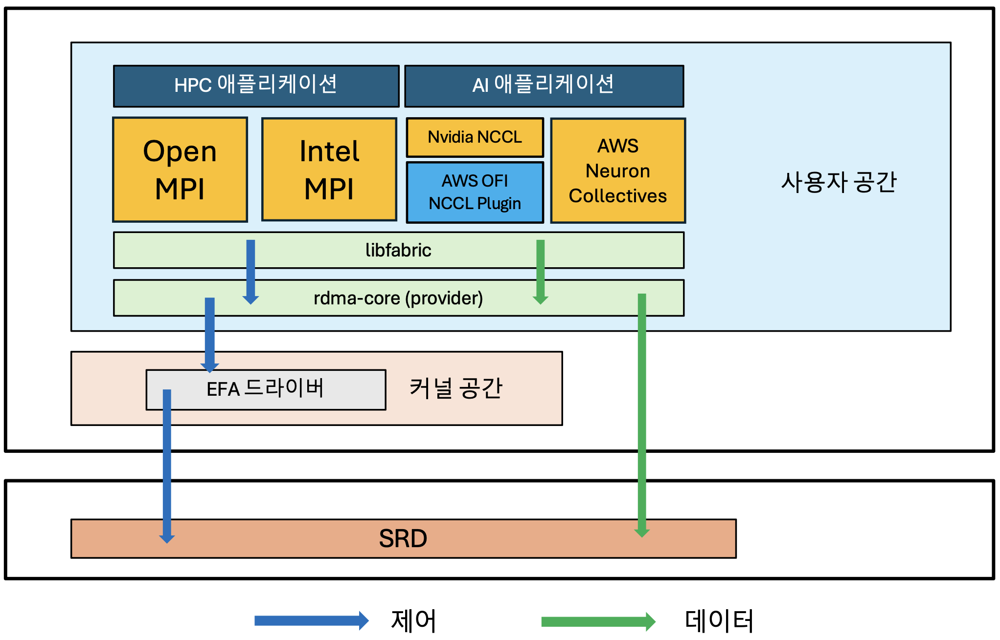

# 분산 훈련에서의 AWS 네트워킹: EFA (Elastic Fabric Adapter)

딥러닝과 HPC<sup>High Performance Computing</sup>는 GPU의 연산력뿐 아니라, **GPU 간 통신 효율에 의해 성능이 좌우**됩니다. 모델이 수백억\~수천억 개의 파라미터를 갖게 되면서, 단일 GPU의 계산 속도보다 “노드 간 얼마나 빠르고 안정적으로 데이터를 주고받을 수 있는가”가 전체 학습 속도를 결정하는 핵심 요인이 되었습니다.

AWS의 EFA<sup>Elastic Fabric Adapter</sup>는 이러한 병목을 해결하기 위해 설계된, 클라우드 환경 전용 RDMA<sup>Remote Direct Memory Access</sup> 기반 네트워킹 기술입니다. AWS 독자 프로토콜인 SRD<sup>Scalable Reliable Datagram</sup> 전송을 사용해 패킷 단위 신뢰성과 다중 경로 분산을 하드웨어로 오프로딩하며, out-of-order 전달을 통해 지연을 줄이고 대규모 클라우드 패브릭에서 확장성을 확보합니다.


SRD(Scalable Reliable Datagram)는 EFA 드라이버 및 Libfabric provider가 내부적으로 사용하는 전송 엔진으로 2절에서 자세히 설명합니다.


## **1. EFA의 기본 개념**

***

EFA는 EC2 인스턴스 간의 네트워크 통신에서 커널을 거치지 않고 사용자 영역에서 직접 데이터를 주고받을 수 있게 하는 장치입니다. 즉, GPU 간 통신 시 **데이터가 CPU 커널을 통과하지 않고 바로 네트워크 어댑터로 전송**됩니다. 이로써 latency가 수 마이크로초 단위로 줄어들고, MPI(MPI\_AllReduce 등)나 NCCL(All-Reduce, All-To-All) 같은 집합 통신의 효율이 극적으로 향상됩니다.

<figure><figcaption><p>EFA 스택</p></figcaption></figure>

```
NCCL / MPI / PyTorch
   ↓
AWS OFI NCCL Plugin
   ↓
Libfabric (provider=efa)
   ↓
EFA Kernel Driver + SRD Transport
   ↓
Nitro Network Card
```

EFA는 전용 드라이버(efa 커널 모듈)와 소프트웨어 스택(aws-ofi-nccl, libfabric, efa-config 등)으로 구성됩니다.

* **AWS OFI NCCL plugin:** NCCL은 GPU 간 All-Reduce, Broadcast, All-To-All 등의 연산을 효율적으로 수행하지만, 기본적으로는 PCIe나 NVLink, 혹은 TCP 기반 통신을 사용합니다. AWS OFI NCCL 플러그인은 NCCL이 네트워크 백엔드로 EFA(libfabric)을 사용할 수 있게 해주는 “브리지” 역할을 하는 플러그입니다. 즉, “NCCL → OFI → EFA”로 이어지는 경로를 SRD로 전송하여 GPU 간 RDMA 기반 통신을 가능하게 만듭니다.
* **libfabric:** OFI (OpenFabrics Interfaces) 프로젝트에서 파생된 고성능 네트워킹을 위한 통합 API 레이어로 EFA, TCP, UDP 등 다양한 네트워크 provider를 추상화합니다. 어떤 네트워크를 쓰든 동일한 방식으로 통신하도록 보장하는 “**표준화된 인터페이스 계층**” 역할을 합니다. libfabric이 내부적으로 RDMA 큐 페어(QP), completion queue, memory region 등을 관리하여 NCCL, MPI 등의 상위 계층 라이브러리들이 RDMA를 직접 구현하지 않아도 되게 합니다.
* **EFA Provider:** AWS에서 만든 전용 provider로 libfabric이 실제 네트워크 카드(EFA)를 제어할 수 있게 하는 드라이버 역할을 합니다. `FI_PROVIDER=efa` 같은 환경 변수를 통해 어떤 provider를 쓸지 강제 지정할 수도 있습니다.

#### libfabric 주요 Provider 비교

<table><thead><tr><th width="128.62890625">Provider 이름</th><th>대상 하드웨어 / 네트워크</th><th>특징</th><th>주요 사용 사례</th></tr></thead><tbody><tr><td><strong>tcp</strong></td><td>표준 TCP/IP 소켓</td><td>가장 범용적, 성능은 낮음</td><td>디버깅, 테스트, 하드웨어 가속 없는 환경</td></tr><tr><td><strong>udp</strong></td><td>UDP/IP</td><td>단순 메시지 전송, 신뢰성 없음</td><td>경량 메시지 통신, 실험용</td></tr><tr><td><strong>sockets</strong></td><td>POSIX 소켓 API</td><td>호환성 목적, 성능 낮음</td><td>레거시 코드 호환</td></tr><tr><td><strong>verbs</strong></td><td>InfiniBand / RoCE (RDMA)</td><td>고성능 RDMA 통신 지원</td><td>HPC 클러스터, Mellanox Infiniband</td></tr><tr><td><strong>efa</strong></td><td>AWS Elastic Fabric Adapter</td><td>AWS 전용, 저지연, RDMA-like, 집합 통신 최적화</td><td>AWS HPC, ML 대규모 분산 학습</td></tr><tr><td><strong>shm</strong></td><td>shared memory (노드 내부)</td><td>노드 내 프로세스 간 IPC 최적화</td><td>멀티프로세스 통신</td></tr><tr><td><strong>ofi_rxd</strong></td><td>소프트웨어 기반 Reliable Datagram</td><td>추상화 계층, 여러 provider 래핑</td><td>테스트, 프로토타입</td></tr></tbody></table>


## **2. SRD (Scalable Reliable Datagram)**

***

EFA는 단순한 RDMA 네트워크가 아닙니다. 그 내부에서는 SRD<sup>Scalable Reliable Datagram</sup>라는 AWS 독자 프로토콜이 동작하며, 이것이 바로 클라우드 환경에서 인피니밴드<sup>Infiniband</sup>에 준하는 성능을 구현하게 만드는 핵심입니다.

### **2.1. RDMA 전송 방식의 한계와 SRD의 등장 배경**

기존 RDMA는 크게 두 가지 전송 모델을 사용합니다.

* **RC (Reliable Connection)**: 1:1 연결형, 매우 낮은 지연시간 / 높은 오버헤드
* **UD (Unreliable Datagram)**: 비연결형, 확장성 우수 / 신뢰성 보장 없음

Infiniband의 RDMA는 주로 RC를 사용하여 신뢰성과 순서를 보장하지만, 이 방식은 각 연결당 상태<sup>state</sup> 정보를 NIC과 커널에 저장해야 합니다. 노드 수가 수천 대로 커지면, 이 연결 상태 정보만으로도 메모리와 CPU 부하가 폭증합니다.

AWS는 EC2 환경에서 RDMA를 확장하기 위해 SRD라는 완전히 새로운 전송 계층 프로토콜을 EFA 전용으로 설계했습니다. SRD는 이름 그대로, “확장 가능하면서도 신뢰성을 유지하는 데이터그램 방식”으로, RC의 reliability(신뢰성)과 UD의 scalability(확장성)를 결합한 프로토콜입니다. 이 프로토콜은 RDMA 모델을 유지하면서도 기존 Infiniband의 전송 방식이 가진 한계를 극복하도록 만들어졌습니다. 요약하면 SRD는 다음 세 가지 목표로 설계되었습니다.

1. **Reliable Delivery**: 대규모 클라우드 네트워크에서의 안정적 신뢰성 보장
2. **Scalability**: 수천 개 노드 간 통신에서도 병목 없는 확장성 확보
3. **Elastic Load Balancing**: 데이터 경로 재전송 및 부하 분산을 하드웨어 수준에서 자동 처리

즉, SRD는 전통적인 TCP나 Infiniband RC(Reliable Connection)이 확장성에 취약한 점을 AWS 내부 네트워크 아키텍처에 맞게 재설계한 형태의 “클라우드형 RDMA 전송 프로토콜”입니다.

### **2.2. SRD의 메커니즘 및 장점**

SRD의 설계 철학은 단순하지만 강력합니다.

> “연결 상태를 중앙에서 관리하지 말고, 패킷 단위에서 동적으로 복구하라.”

이를 위해 SRD는 다음과 같은 핵심 메커니즘을 사용합니다.

#### **1. Connectionless RDMA (비연결형 전송)**

SRD는 Infiniband RC처럼 모든 피어 간 연결 상태를 유지하지 않습니다. 즉, 각 노드 쌍마다 연결(QP pair)을 생성하지 않고, 공통된 “SRD 엔드포인트”만으로 통신합니다. 이 덕분에 수천 노드 규모에서도 커넥션 오버헤드가 발생하지 않습니다.

#### **2. Packet-Level Reliability (패킷 단위 신뢰성)**

TCP처럼 스트림 단위로 ack/nack을 관리하는 대신, SRD는 각 데이터그램(패킷)에 대한 개별적인 ACK 및 재전송 메커니즘을 사용합니다. 패킷이 유실되면 SRD 하드웨어가 즉시 재전송을 수행합니다. 즉, 신뢰성을 “연결 단위”가 아닌 “패킷 단위”로 관리합니다.

#### **3. Multipath + Load Balancing (다중 경로 부하 분산)**

SRD는 AWS 내부 네트워크의 다중 경로<sup>multipath</sup> 토폴로지를 인식합니다. 하나의 RDMA 스트림이 여러 경로로 동시에 분할되어 전송될 수 있으며, 경로 중 일부에서 패킷 손실이 발생하더라도 다른 경로로 즉시 재전송됩니다. 이 기능이 Scalable Reliable 이라는 이름의 핵심입니다.

#### **4. Hardware Offload**

이 모든 동작은 AWS의 Nitro 카드(Nitro NIC) 내에서 오프로딩<sup>offload</sup>됩니다. 즉, CPU나 OS 커널의 개입 없이 네트워크 하드웨어 수준에서 처리됩니다. 이 때문에 SRD는 높은 처리량을 유지하면서도 지연시간을 µs 수준으로 억제할 수 있습니다.

#### 장점

* **Multipath Routing:** 패킷을 네트워크 여러 경로로 흩뿌림으로써 혼잡을 분산하고 손실 발생 시 자동 재전송
* **순서 재정렬 엔진:** out-of-order 패킷도 수신 측에서 재정렬함으로써 높은 효율 달성
* **Massive Scalability:** 연결<sup>Connection</sup>이 아니라 datagram 기반으로 수만 노드까지 확장 가능
* **Collective 최적화:** NCCL + AWS OFI NCCL Plugin이 SRD 위에서 ring/tree 토폴로지를 구성 → 수천 GPU에서 안정적 스케일링

## 3. EFA vs. Infiniband

***

EFA는 종종 “AWS의 Infiniband 대체재”로 불리지만, 실제로는 설계 철학이 다릅니다.

Infiniband는 HPC 환경에서 매우 낮은 지연시간을 제공하는 고정형 네트워크입니다. 노드 간 연결은 전용 스위치와 HCA(Host Channel Adapter)로 구성되며, 전용 케이블과 패브릭 토폴로지를 기반으로 합니다. 이 구조는 뛰어난 성능을 제공하지만, 확장성 면에서는 제약이 있습니다. 노드가 수백 대를 넘어서면 물리적 토폴로지 구성과 관리 비용이 급격히 증가합니다.

반면, **EFA는 Infiniband의 RDMA 기능을 VPC 기반 가상 네트워크 위에서 구현**했습니다. 즉, 하드웨어는 AWS의 Nitro 시스템이 담당하고, 사용자는 EC2 인스턴스를 생성할 때 `--network-interface-type efa`만 지정하면자동으로 RDMA-capable 환경이 구성됩니다. 이 구조 덕분에 사용자는 물리 네트워크에 직접 접근할 필요가 없으며, 기존의 인피니밴드처럼 별도의 패브릭 관리자가 없어도 됩니다. 또한 EFA는 클라우드의 소프트웨어 정의 네트워킹(SDN)과 통합되어 있기 때문에, Auto Scaling, VPC 보안 그룹, Subnet 격리 정책 등과도 자연스럽게 연동됩니다. 결과적으로 EFA는 Infiniband의 성능을 유지하면서도, 클라우드 환경에서 요구되는 유연성과 확장성을 모두 확보한 셈입니다.

다만 EFA 성능을 극대화하려면 몇 가지 환경 변수 조정이 중요합니다. (EC2에서 직접 설정 시)

* `FI_PROVIDER=efa` : EFA provider 명시
* `FI_EFA_USE_DEVICE_RDMA=1` : GPU Direct RDMA 경로 활성화
* `NCCL_BUFFSIZE`, `NCCL_P2P_NET_CHUNKSIZE` : 버퍼 메모리 크기 최적화

AWS는 이러한 튜닝을 대부분 SageMaker HyperPod이나 DLAMI 내에서 자동으로 설정해 줍니다. 따라서 사용자는 복잡한 저수준 네트워크 설정 없이도 Infiniband 수준의 분산 학습 성능을 얻을 수 있습니다.

### **SRD vs Infiniband**

* Infiniband: 고정된 물리 패브릭에서 최적화된 저지연 RDMA
* SRD: 가상화된 클라우드 네트워크 위에서 확장 가능한 RDMA

<table><thead><tr><th width="144.81640625">항목</th><th>Infiniband RC</th><th>SRD (EFA)</th></tr></thead><tbody><tr><td>전송 방식</td><td>Connection-oriented</td><td>Connectionless</td></tr><tr><td>신뢰성 보장</td><td>연결 단위 (stateful)</td><td>패킷 단위 (stateless)</td></tr><tr><td>부하 분산</td><td>제한적</td><td>Multipath + ECMP 기반</td></tr><tr><td>재전송 처리</td><td>소프트웨어 주도</td><td>하드웨어 오프로딩</td></tr></tbody></table>


## **3. EFA 최적화 가이드**

***

EFA를 제대로 활용하려면 단순히 “EFA를 켜면 된다”는 수준을 넘어, 여러 설정과 구성 요소를 세밀하게 조정해야 합니다. 이 최적화 작업이 잘 되어 있어야 EFA가 기대하는 저지연·고대역폭 성능을 실현할 수 있습니다. 아래 가이드는 AWS 공식 문서를 바탕으로 한 권장 최적화 전략입니다.

### **3.1. 네트워크 인터페이스 구성 및 대역폭 최대화**

*   P5나 P6와 같이 네트워크 카드가 다수인 인스턴스의 경우, EFA를 여러 네트워크 카드에 걸쳐 분산 설정하는 것이 중요합니다.

    AWS 문서에서는 기본 네트워크 카드(index 0)에 EFA + ENA를 붙이고, 이후 카드에도 추가 EFA 또는 EFA-only 인터페이스를 붙이는 구성을 권장합니다. (출처: [https://docs.aws.amazon.com/AWSEC2/latest/UserGuide/efa-acc-inst-types.html](https://docs.aws.amazon.com/AWSEC2/latest/UserGuide/efa-acc-inst-types.html))
* 특히 P5 인스턴스에서는 다중 NIC / EFA 인터페이스 병렬 사용을 통해 전체 네트워크 대역폭을 극대화할 수 있으므로, 인스턴스를 시작할 때 `--network-interfaces` 옵션으로 각 네트워크 카드의 인덱스와 EFA 인터페이스를 명시하는 것이 좋습니다. (출처: [https://docs.aws.amazon.com/AWSEC2/latest/UserGuide/efa-acc-inst-types.html](https://docs.aws.amazon.com/AWSEC2/latest/UserGuide/efa-acc-inst-types.html))

### **3.2. 보안 그룹 및 VPC 설정**

* EFA 트래픽은 OS-bypass 경로로 동작하기 때문에, 보안 그룹이 스스로(자기 자신)로부터의 모든 인바운드/아웃바운드 트래픽 허용 규칙을 가져야 합니다. 즉, EFA가 속한 보안 그룹 간의 자유로운 통신이 허용되지 않으면, EFA가 제대로 작동하지 않거나 대체 경로로 TCP에 fallback될 수 있습니다. (출처: [https://kb.brightcomputing.com/knowledge-base/optimizing-hpc-performance-using-elastic-fabric-adapter-for-cloud-nodes](https://kb.brightcomputing.com/knowledge-base/optimizing-hpc-performance-using-elastic-fabric-adapter-for-cloud-nodes))
* EFA OS-bypass 통신은 서브넷 간 라우팅을 지원하지 않으므로, 동일 서브넷 내에서 통신이 가능하도록 VPC 및 서브넷 구성을 맞추는 것이 필수적입니다.

### **3.3. 소프트웨어 / Libfabric / NCCL 설정**

**EFA 및 NCCL 주요 환경 변수 (출처:** [**AWS EFA Cheatsheet**](https://app.gitbook.com/u/A81uOOpezEhPlFs0xy0rsEctTSP2)**)**

<table><thead><tr><th width="270.4765625">설정</th><th>설명</th></tr></thead><tbody><tr><td><code>NCCL_DEBUG=info</code></td><td>NCCL에서 디버그 정보를 얻기 위해 설정합니다. 이를 통해 NCCL이 EFA를 사용하고 있는지와 어떤 버전을 사용하고 있는지 확인할 수 있습니다. 다만, 많은 디버그 정보를 출력하므로 NCCL 문제가 의심되지 않는 한 끄는 것을 권장합니다. 자세한 내용은 <a href="https://docs.nvidia.com/deeplearning/nccl/user-guide/docs/env.html#nccl-debug">NCCL_DEBUG</a> 를 참조하세요.</td></tr><tr><td><code>FI_EFA_USE_HUGE_PAGE=0</code></td><td><code>os.fork()</code>가 <code>OSError: Cannot allocate memory</code>를 발생시킬 때 0으로 설정합니다. 일반적으로 다중 프로세스 PyTorch 데이터 로더에서 발생합니다. 거대 페이지를 비활성화하면 약간의 성능 저하가 있지만, 운영 체제의 거대 페이지 부족으로 인한 fork 실패를 방지하는 데 필요합니다.</td></tr><tr><td><code>FI_EFA_FORK_SAFE=1</code></td><td><code>kernel>=5.15</code>에서는 필요하지 않습니다. [<a href="https://github.com/ofiwg/libfabric/pull/9112">참조</a>]</td></tr><tr><td><code>FI_EFA_USE_DEVICE_RDMA=1</code></td><td><code>libfabric>=1.18.0</code> 및 <code>aws-ofi-nccl>=1.7.0</code>에서는 설정할 필요가 없습니다.</td></tr><tr><td><code>FI_EFA_SET_CUDA_SYNC_MEMOPS=0</code></td><td><code>efa-installer&#x3C;1.29.1</code> 및 <code>nccl>=2.19.0</code>에서 NCCL 오류 register_rail_mr_buffer:617 NCCL WARN NET/OFI Unable to register memory (type = 2) for device 4. RC: -22, Error: Invalid argument를 방지하기 위해 설정합니다.</td></tr><tr><td><code>FI_EFA_ENABLE_SHM_TRANSFER=1</code></td><td>필요하지 않습니다. 실제로는 <code>no-op</code>이며, 기본값이 이미 SHMEM을 활성화합니다.</td></tr><tr><td><code>FI_PROVIDER=efa</code></td><td><code>aws-ofi-nccl&#x3C;=1.5.0</code> 및 p4/p5 인스턴스에서 사용합니다.</td></tr><tr><td><code>NCCL_PROTO=simple</code></td><td>GPU 간 통신을 어떤 방식으로 데이터를 주고받을지 (latency 중심? bandwidth 중심?)을 정합니다. LL(Low Latency)은 작은 메시지에 최적화되어 있고, LL128은 중간 크기 메세지용, Simple은 큰 메시지 크기에 설정합니다. <code>aws-ofi-nccl&#x3C;=1.5.0</code> 및 p4/p5 인스턴스에서 사용합니다.</td></tr><tr><td><code>NCCL_SOCKET_NTHREADS</code></td><td>EFA에는 적용되지 않습니다.</td></tr><tr><td><code>NCCL_SOCKET_IFNAME</code></td><td><code>p5.48xlarge</code>와 <code>p4d(e).24xlarge</code> 에서 모두 <code>en</code>으로 설정합니다. 다른 인스턴스의 경우 <code>ifconfig</code>를 확인하여 활성 네트워크 인터페이스를 확인하세요.</td></tr><tr><td><code>NCCL_NSOCKS_PERTHREAD</code></td><td>EFA에는 적용되지 않습니다.</td></tr><tr><td><code>NCCL_MIN_CHANNELS=xxx</code></td><td>기본값을 사용하도록 설정하지 않는 것을 권장합니다. 예를 들어, p4d/p4de에서 채널 수는 8이어야 하며, 이는 4-NIC 플랫폼의 최소값입니다. 감소 메시지는 작업의 GPU 수로 나누어진 다음 채널 수로 나누어지므로, 필요 이상의 채널을 가지면 더 작은 메시지가 발생하여 EFA가 데이터 부족 상태가 됩니다.</td></tr><tr><td><code>NCCL_BUFFSIZE=xxx</code></td><td>GPU 쌍 간 통신에 NCCL이 내부적으로 잡는 버퍼의 크기를 바이트 단위로 지정합니다. 기본값은 4MB(4,194,304)로 처음에는 튜닝하지 마세요.</td></tr><tr><td><code>NCCL_P2P_NET_CHUNKSIZE=xxx</code></td><td>P2P 네트워크 경로에서 송신되는 메시지 조각(청크) 크기를 바이트 단위로 지정합니다. 기본값은 128KB(131,072)로 처음에는 튜닝하지 마세요.</td></tr><tr><td><code>RDMAV_FORK_SAFE=1</code></td><td>사용하지 마세요. 이는 RDMA-core 환경 변수로 신규 커널에서 문제를 일으킬 수 있습니다.</td></tr><tr><td><code>NCCL_SHM_USE_CUDA_MEMCPY=1</code></td><td>g5/g6에서 NCCL을 실행할 때 설정합니다. 기본 memcpy에 비해 2배의 성능을 제공합니다.</td></tr><tr><td><code>RDMAV_*</code></td><td>사용하지 마세요.</td></tr><tr><td>NCCL 버전</td><td>안정적인 릴리스 중 하나를 권장합니다.</td></tr><tr><td><code>NCCL_TUNER_PLUGIN</code></td><td>특정 NCCL 튜너 플러그인을 로드하도록 설정합니다. <code>aws-ofi-ofi>=1.16.3</code>부터는 이 설정이 더 이상 필요하지 않습니다.</td></tr></tbody></table>

```bash
export FI_EFA_USE_HUGE_PAGE=0   # 기본 세팅

# libfabric/EFA 선택 
# export FI_PROVIDER=efa

# GPU↔EFA 디바이스 RDMA(가능 시) 사용
# export FI_EFA_USE_DEVICE_RDMA=1

# NCCL가 aws-ofi-nccl을 경유하도록 LD_LIBRARY_PATH 확인
# (플러그인은 자동 로드; 최신 AMI/빌드 기준)

export NCCL_DEBUG=INFO         # 디버그 시 사용
export NCCL_IB_GID_INDEX=3     # VPC/서브넷에 따라 조정
export NCCL_NET_GDR_LEVEL=PHB  # 안정성 이슈가 보이면 PHB → PXB → PIX로 단계적으로 보수화

# 버퍼 크기/P2P 청크 크기/알고리즘/프로토콜은 기본 Auto 권장. 병목 시 실험:
# export NCCL_BUFFSIZE=8388608            # 8MB (8*1024*1024)
# export NCCL_P2P_NET_CHUNKSIZE=262144    # 256KB (256*1024)
# export NCCL_ALGO=Tree|Ring
# export NCCL_PROTO=Simple|LL|LL128
```

### **3.4. 성능 점검 & 검증 방법**

* `fi_info -p efa` 커맨드로 EFA provider가 인식되고 FI\_EP\_RDM 타입이 나오는지 확인합니다.
* nccl-tests 같은 벤치마크 도구를 통해 AllReduce / AllToAll / Broadcast 실험을 수행하고, 로그에서 **프로토콜 선택(LL / LL128 / Simple)** 과 **BusBW, Latency** 수치를 확인합니다. AWS 공식 EFA 문서도 “Maximize network bandwidth” 섹션을 통해 인스턴스별 NIC 설정 방안을 제시합니다. (출처: [https://docs.aws.amazon.com/AWSEC2/latest/UserGuide/efa.html](https://docs.aws.amazon.com/AWSEC2/latest/UserGuide/efa.html))
* `ethtool -S` 또는 `ethtool -i` 명령어로 NIC 드라이버, 인터페이스 통계(에러/드롭 등)를 확인하여 패킷 손실/에러 유무를 점검합니다. 한 테크 블로그에서는 EFA가 튜닝되지 않으면 fallback되어 소켓 또는 ENA 기반 경로가 사용되는 사례가 보고되기도 합니다. (출처: [https://swsmith.cc/posts/efa-best-practices.html](https://swsmith.cc/posts/efa-best-practices.html))


## References

* [Elastic Fabric Adapter for AI/ML and HPC workloads on Amazon EC2](https://docs.aws.amazon.com/AWSEC2/latest/UserGuide/efa.html)
* [Maximize network bandwidth on Amazon EC2 instances with multiple network cards](https://docs.aws.amazon.com/AWSEC2/latest/UserGuide/efa-acc-inst-types.html)
* [AWS EFA Cheatsheet](https://app.gitbook.com/u/A81uOOpezEhPlFs0xy0rsEctTSP2)
