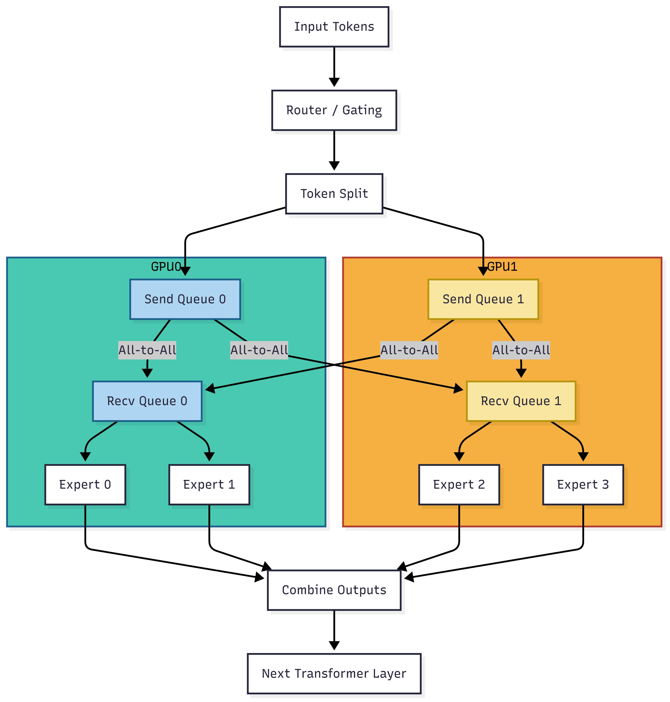
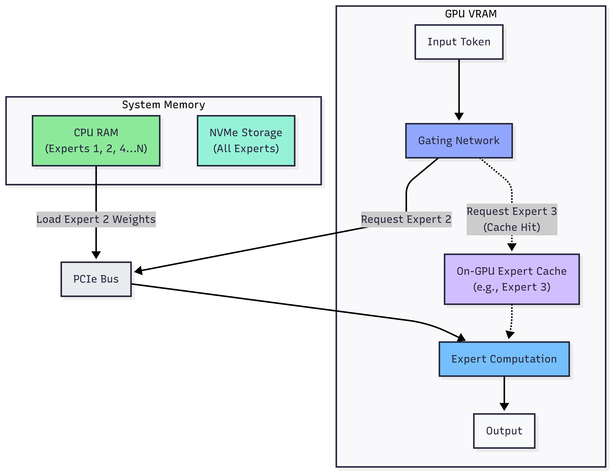

# 전문가 병렬화 (Expert Parallelism)

## 1. 개요

***

전문가 병렬화<sup>Expert Parallelism</sup>(EP)는 MoE 모델에서 전문가들을 여러 작업자나 디바이스에 분산시켜 처리하는 병렬화 유형으로, 텐서 병렬화가 밀집<sup>dense</sup> 모델 레이어를 분할할 수 있는 것과 유사합니다. 이는 LLM 모델의 훈련 효율성을 혁신적으로 개선하는 핵심 기술입니다.

<figure><figcaption></figcaption></figure>

### 1.1. All-to-All 통신의 필요성과 특징

All-to-All 통신은 전문가 병렬화에서 필수적인 통신 패턴입니다. All-to-All 통신이 필요한 주된 이유는 토큰들이 서로 다른 전문가로 라우팅되기 때문입니다. EP 방식에서는 각 토큰이 특정 전문가에게 라우팅되는데, 이 과정에서 다음과 같은 특징이 있습니다.

1. 각 GPU/디바이스는 일부 전문가만 호스팅합니다.
2. 각 디바이스의 입력 토큰들은 다른 디바이스에 있는 전문가들로 보내져야 합니다.
3. 각 전문가의 계산이 완료된 후, 출력은 원래 디바이스로 다시 모여야 합니다.

이러한 과정에서 All-to-All 통신 패턴이 필수적입니다. 이 통신을 통해 1) 토큰들이 적절한 전문가로 분배되며 (토큰 분배<sup>Token Dispatch</sup>), 2) 계산 후 결과가 다시 원래 위치로 모입니다. (결과 집계<sup>Result Aggregation</sup>)

```python
### 단일 디바이스의 전문가 병렬화(EP) forward pass 수행 예시

# Non-MoE 레이어는 평소와 같이 처리됩니다.
x = self_attention(input_tokens)

# 게이팅 네트워크는 모든 디바이스에 복제됩니다.
gate_logits = gating_network(x)
local_assignments = top_k_router(gate_logits)

# 첫 번째 All-to-All: 토큰을 대상 expert를 소유한 디바이스로 셔플합니다.
# 프레임워크가 저수준 통신을 처리합니다.
# 각 디바이스는 로컬 expert를 위한 토큰 배치를 받습니다.
shuffled_tokens = all_to_all_dispatch(x, local_assignments)

# 로컬 expert 서브셋을 사용하여 받은 토큰을 처리합니다.
processed_shuffled_tokens = local_experts(shuffled_tokens)

# 두 번째 All-to-All: 처리된 토큰을 원래 디바이스로 다시 셔플합니다.
output_tokens = all_to_all_combine(processed_shuffled_tokens, local_assignments)

# ... 모델의 나머지 부분이 진행됩니다.
```

MoE 모델은 높은 메모리 요구사항을 가지는데, 각 입력에 대해 일부만 사용되더라도 모든 전문가 매개변수를 메모리에 로드해야 하기 때문입니다. 전문가 병렬화는 이 문제를 해결하기 위해 각 디바이스가 담당하는 전문가들에 대한 계산을 처리하면서, 훈련 중에 다양한 데이터가 적절한 디바이스로 라우팅되는 방식으로 작동합니다.

### 1.2. All-to-All의 난제

All-to-All 통신은 대역폭을 매우 많이 사용하기에 토큰당 연산량은 적은데 통신 빈도는 높은 MoE 모델의 분산 훈련에서 주요 병목이 됩니다. All-to-All은 일반적으로 로컬 배치 데이터의 상당 부분을 다른 노드로 전송하므로 총 통신량이 디바이스 수에 대해 거의 선형적으로 확장되기 때문입니다. 실제 연구 결과에 따르면, 세 가지 주요 MoE 모델의 훈련 과정을 일반적으로 사용되는 GPU 클러스터에서 평가한 결과, All-to-All 통신 비율이 평균 45% 정도를 차지한다는 것이 발견되었습니다 \[1]. 이는 훈련 효율성에 상당한 영향을 미치는 수치입니다.

#### 성능 병목 관점

1. **통신 오버헤드**: 모든 디바이스가 모든 다른 디바이스와 통신해야 하므로, 디바이스 수가 증가함에 따라 통신 비용이 기하급수적으로 증가합니다.
2. **메모리**: All-to-All 통신은 전송해야 할 데이터를 버퍼링하고 수신된 데이터를 저장하기 위해 상당한 메모리가 필요합니다. 또한 라우터 파라미터(병렬화 전략에 따라 여러 디바이스에 복제가 필요합니다.)와 옵티마이저 상태(예: Adam의 모멘텀과 분산)를 저장하는 데에도 많은 메모리가 필요합니다.
3. **불균형 부하**: 전문가들에게 토큰이 불균형하게 분배될 수 있어 일부 전문가는 과부하되고 다른 전문가들은 유휴 상태가 될 수 있습니다.
4. **동기화 병목(Synchronized Bottleneck)**: 모든 디바이스가 All-to-All 통신을 완료해야 다음 계산 단계로 진행할 수 있어, 가장 느린 디바이스나 가장 혼잡한 연결이 전체 성능을 제한합니다.

#### 기술적 관점

1. **효율적인 라우팅 알고리즘**: 토큰을 전문가에게 효율적으로 라우팅하는 알고리즘 설계가 어렵습니다. 라우팅은 계산 균형과 통신 비용 사이의 균형을 찾아야 합니다.
2. **토폴로지 인식**: 하드웨어 토폴로지(노드 내 통신 vs 노드 간 통신)를 고려한 최적화가 필요하지만 이는 복잡한 작업입니다.
3. **부하 균형**: 전문가 간의 부하 불균형 문제를 해결하기 위한 효과적인 메커니즘이 필요합니다.
4. **확장성**: 시스템 규모가 커질수록 All-to-All 통신의 효율성이 급격히 감소합니다. 수천 개의 GPU를 사용하는 대규모 시스템에서의 확장성 문제는 특히 심각합니다.
5. **결함 내성**: 분산 시스템에서는 디바이스 실패가 발생할 수 있으며, All-to-All 통신 중 이러한 실패를 처리하는 메커니즘이 필요합니다.


## **2. 멀티 노드 환경에서의 Expert Parallelism**

***

### 2.1. **멀티 노드 환경에서의 Expert Parallelism** **난제**

EP의 진정한 가치는 수십\~수백 개의 전문가를 여러 GPU와 노드에 분산하여 거대한 파운데이션 모델을 훈련할 때 발휘됩니다. 하지만 이렇게 멀티 노드로 확장하면, 단일 노드에서 경험하지 못한 통신 및 시스템적인 난관에 부딪히게 됩니다. 모든 노드가 모든 다른 노드와 통신해야 하므로 노드 수가 $$N$$일 때 통신 복잡도가 $$O(N^2)$$로 증가하는데, 하나의 느린 노드나 네트워크 연결이 전체 시스템 성능을 저하시키고 이를 적시에 디버깅하고 복구하는 것도 쉽지 않기 때문입니다.

* **노드 간 통신 병목**: 노드 내에서는 NVLink 또는 NVSwitch와 같은 GPU 전용 고속 인터커넥트가 있어 GPU간 통신이 매우 빠르지만, 노드 간 통신은 RDMA(Remote Direct Memory Access) 기반 인터커넥트에 의존하며 이는 상대적으로 NVLink/NVSwitch보다 훨씬 낮은 대역폭(100-400Gb/s)을 제공합니다. 이러한 통신 계층 간의 큰 성능 격차가 Expert Parallelism의 핵심 병목으로 작용합니다. All-to-All 통신에서 토큰이 노드 경계를 넘어갈 때마다 대역폭이 10배 이상 감소하여 심각한 성능 저하가 발생합니다
* **통신-컴퓨팅 비율 불균형**: EP에서는 전문가 계산 대비 통신 오버헤드 비율이 매우 높습니다. 노드 내에서는 NVLink의 높은 대역폭으로 이 문제가 완화되지만, RDMA를 통한 노드 간 통신에서는 통신 시간이 계산 시간을 크게 초과할 수 있습니다. 이로 인해 GPU가 많은 시간을 유휴 상태로 대기하게 되어 전체 시스템 활용도가 크게 감소합니다.
* **RDMA 확장성과 혼잡 제어 문제**: 노드 간 통신에서는 RDMA가 중요한 역할을 하지만, 대규모 클러스터에서 RDMA의 혼잡 제어 메커니즘이 All-to-All 통신 패턴에서 최적으로 작동하지 않습니다. 특히 많은 노드가 동시에 통신할 때 네트워크 혼잡이 발생하고 패킷 손실률이 증가하여 재전송이 필요해지며, 이는 지연 시간을 크게 증가시킵니다. RDMA의 대역폭 활용도 또한 소규모 메시지가 많은 EP 워크로드에서 최적화하기 어렵습니다.
* **하드웨어 토폴로지 복잡성**: 대규모 클러스터의 복잡한 네트워크 토폴로지로 인해 최적의 데이터 라우팅이 어려워집니다. 같은 랙에 있는 노드와 멀리 떨어진 노드 사이의 통신 비용 차이가 크기에 이상적으로는 라우팅 결정이 하드웨어 토폴로지(GPU 간의 NVLink 연결 패턴, 노드 간의 RDMA 네트워크 구조)를 고려해야 하지만, 현재의 소프트웨어 스택은 이러한 세밀한 최적화를 지원하지 않는 경우가 많습니다.
* **PCIe 병목**: 일부 시스템에서는 GPU와 네트워크 인터페이스 카드(NIC) 사이의 통신이 PCIe 버스를 통과해야 하며, 이는 NVLink나 최신 RDMA보다 훨씬 낮은 대역폭(32-64GB/s)을 제공합니다. 이 추가적인 병목은 노드 간 통신의 효율성을 더욱 저하시킵니다. 특히 NVIDIA GPUDirect RDMA 기술이 제대로 구성되지 않은 시스템에서는 GPU 메모리와 NIC 사이의 데이터 전송에 CPU 메모리가 중간 버퍼로 사용되어 추가 지연이 발생합니다.
* **CPU/NVMe로의 전문가 오프로딩(Offloading)**: 토큰당 1개나 2개의 전문가만 활성화된다는 특성을 활용하여 비활성 전문가 파라미터 대부분을 시스템 RAM이나 NVMe 같은 더 크고 경제적인 메모리 풀에 저장하는 오프로딩 기법을 적용할 수 있습니다. 하지만 오프로드는 공짜 점심이 아니기에 VRAM 용량 문제를 해결하는 대신 데이터 전송 지연이 발생합니다. CPU RAM이나 NVMe에서 GPU로 기가바이트 단위의 전문가 가중치를 이동하는 데는 시간이 걸리며, 이는 GPU의 고대역폭 메모리(HBM) 내 데이터를 접근하는 것보다 훨씬 느린 작업입니다.

<figure><figcaption><p>전문가 오프로딩 트레이드오프 예시: 필요한 전문가가 온-GPU 캐시(on-GPU cache)에 없을 경우, 해당 가중치는 시스템 메모리에서 PCIe 버스를 통해 전송되어야 하며, 이로 인해 지연이 발생합니다.</p></figcaption></figure>

* **디버깅 및 모니터링의 어려움**: 수백 개의 GPU에 분산된 전문가들이 동시에 작동하는 상황에서 성능 병목이나 오류의 근본 원인을 식별하기가 매우 어렵습니다. 특히 문제가 되는 부분은 다음과 같습니다.
  * 분산 통신 패턴의 시각화 도구 부족으로 All-to-All 통신의 병목 지점을 식별하기 어렵습니다.
  * 노드 간 타이밍 불일치로 인한 문제는 재현이 어렵고 간헐적으로 발생하여 디버깅이 매우 복잡합니다.
  * 라우팅 결정과 부하 불균형을 실시간으로 모니터링할 수 있는 도구가 제한적이어서, 전문가 활용률의 불균형이 발생해도 이를 즉시 감지하기 어렵습니다.
  * 시스템 규모가 커질수록 로그와 성능 데이터의 양이 방대해져, 이를 효과적으로 분석하고 문제를 진단하는 것이 기술적 도전과제가 됩니다.
* **내결함성 및 복구 메커니즘의 어려움**: 대규모 멀티 노드 환경에서는 하드웨어 실패가 불가피하며, EP에서 이러한 실패를 처리하는 것이 복잡합니다.
  * 전문가 손실 문제: 특정 노드가 실패하면 해당 노드에 있던 전문가들이 손실되어, 시스템이 일부 입력에 대해 적절한 처리를 할 수 없게 됩니다.
  * 상태 복구의 복잡성: 전문가들이 노드 간에 분산되어 있어, 실패 후 일관된 상태로 복구하는 것이 어렵습니다. 전문가마다 서로 다른 훈련 이력을 가질 수 있어 체크포인트와 복구가 복잡해집니다.
  * 부분 실패 처리: 일부 노드나 GPU만 실패했을 때 전체 작업을 재시작하지 않고 부분적으로 복구하는 메커니즘이 필요하지만, 전문가들 간의 복잡한 상호의존성으로 인해 구현이 어렵습니다.
  * 내결함성과 성능 간의 균형: 체크포인트 빈도를 높이면 복구 가능성은 향상되지만 훈련 성능이 저하되는 트레이드오프가 있어, 최적의 균형점을 찾는 것이 어렵습니다.

### 2.2. 비동기 처리와 GPU Direct RDMA를 통한 난제 해결 방안

EP의 멀티 노드 환경에서 발생하는 주요 난제들을 해결하기 위해 최신 연구와 구현에서는 All-to-All 네트워크 전송이 진행되는 동안 독립적인 계산 작업을 수행하는 비동기 처리 기법과 네트워크 카드(NIC<sup>Network Interface Card</sup>)가 CPU 개입 없이 GPU 메모리에서 다른 노드의 GPU 메모리로 직접 데이터를 전송하는 GPU Direct RDMA 기술을 적극 활용하고 있습니다. 최신 하드웨어와 분산 프레임워크는 비동기 작업을 지원하므로, 통신 작업을 시작한 후 그 통신 결과에 의존하지 않는 계산을 독립적으로 진행할 수 있기에 네트워크 대기 시간을 효과적으로 가릴 수 있습니다. 이러한 접근 방식은 DeepEP와 같은 프레임워크에서 구현되어 성능을 크게 향상시키고 있습니다.


비동기 All-to-All 통신 중에 수행할 수 있는 계산 예시는 아래와 같습니다.

* 파이프라인 병렬 처리 시 모델의 후속 레이어 계산
* 네트워크의 병렬 레이어나 분기(branch)에서의 계산
* 역전파 과정에서 MoE 레이어 통신 단계 이전에 처리된 레이어의 그래디언트 계산
* 통신과 계산을 신중히 교차하여 수행할 수 있다면 전문가 계산의 일부 수행&#x20;


#### 1. 비동기 처리를 통한 통신-계산 중첩

EP의 효율성을 높이기 위해 비동기 통신 기법이 적극 활용됩니다.

* **후크 기반 통신-계산 중첩(Overlap)**: DeepEP는 후크 기반의 통신-계산 중첩 방식을 도입하여 SM(Streaming Multiprocessor) 자원을 점유하지 않고도 우수한 병렬 효율성을 달성합니다. 이는 GPU 컴퓨팅 자원을 최대한 활용하면서 통신을 동시에 처리할 수 있게 해줍니다.
* **마이크로 배치 이중화(Two-batch Overlap)**: 단일 배치를 두 개의 마이크로 배치로 분할하여 계산과 통신을 중첩시키는 방식으로, 전체 지연 시간을 줄이고 최대 메모리 사용량도 절반으로 감소시킵니다.
* **비동기 디스패치(Dispatch)/컴바인(Combine) 작업**: EP 구현에서는 비동기 통신을 위한 CUDA 이벤트와 스트림을 활용하여 통신과 계산이 병렬로 진행될 수 있게 합니다. CUDA 이벤트를 통해 이전 작업과의 의존성을 관리하면서 비동기적으로 작업을 완료할수 있습니다.
* **GPU Direct Async**: CUDA 8.0에서 도입된 기술로 GPU가 직접 네트워크 디바이스(예: NIC<sup>Network Interface Card</sup>)에 접근해 통신을 CPU 개입 없이 비동기로 수행합니다. DeepEP는 IBGDA(InfiniBand GPUDirect Async)를 지원하며 GPU 간 통신을 위해 NVSHMEM을 활용합니다. 다만 특정 GPU 아키텍처(예: NVIDIA A100 이상)와 특정 NIC에서만 GPUDirect Async를 지원하기 때문에 면밀한 검토가 필요합니다.&#x20;


**NVSHMEM**: 여러 GPU를 “하나의 큰 공유 메모리”처럼 보이게 해주는 통신 라이브러리로 엔비디아가 GPU 환경에 맞게 OpenSHMEM을 확장하였습니다. 이를 통해 CPU 개입 없이 GPU 간 직접 메모리 접근(RDMA) 을 가능하게 만들어, AI·HPC 통신 병목을 줄입니다. 개발자가 직접 통신 로직을 저수준으로 제어하므로 복잡하지만 세밀한 제어가 가능합니다. (참조: [https://developer.nvidia.com/nvshmem](https://developer.nvidia.com/nvshmem))


#### 2. GPU Direct RDMA를 통한 통신 병목 해소

GPU Direct RDMA 기술은 EP의 가장 큰 병목인 노드 간 통신 오버헤드를 크게 줄여줍니다:

* **CPU 우회 통신**: GPU Direct RDMA는 GPU 메모리에서 다른 노드의 GPU 메모리로 직접 데이터를 전송하여 CPU 메모리 경유를 제거합니다. 이 기술은 NIC가 CPU 관여 없이 GPU 메모리에서 직접 읽고 쓸 수 있게 하여 데이터 교환 효율성을 크게 높입니다.
* **전용 통신 커널**: DeepEP와 같은 라이브러리는 EP를 위한 최적화된 All-to-All 통신 커널을 제공합니다. 이러한 커널은 MoE의 dispatch와 combine 작업에 특화되어 있으며, 노드 간 통신을 위한 순수 RDMA 기술을 기반으로 하여 지연 시간을 최소화합니다.


GPUDirect RDMA는 NIC가 원격 GPU/메모리와 직접 데이터 전송을 수행할 수 있게 해주지만 데이터 전송 명령을 NIC에 등록하는 역할(initiating)은 여전히 CPU가 담당합니다. GPUDirect Async는 GPUDirect RDMA와 달리, 통신 제어 자체를 GPU가 할 수 있도록 확장한 기술입니다. 두 기술은 상호 보완 관계로 실제 HPC/딥러닝 통신 스택(NCCL, NVSHMEM 등)에서는 RDMA(빠른 통로) + Async(GPU 직접 제어)를 함께 활용하여 통신 효율을 극대화합니다.


#### 3. 최신 소프트웨어 추상화 및 구현

* **DeepEP**: MoE / Expert Parallelism (EP) 특화 통신 병목 해소를 목표로 설계된 라이브러리로, MoE 모델의 dispatch/combine 연산에 최적화된 GPU 커널과 IBGDA 기능을 제공합니다. 통신 라이브러리로서 다른 MoE 시스템에 연결하여 쓸 수 있는 모듈로 설계되었습니다.
* **Megatron-Core**: Megatron-LM에서 핵심 기능만 떼어낸 모듈화된 라이브러리로 다양한 병렬화 기법(예: 전문가 병렬화, 데이터 병렬화, 텐서 병렬화, 파이프라인 병렬화)을 통합하는 포괄적인 병렬화 전략을 제공합니다. 이를 통해 Mixtral 8X7B BF16 훈련에서 468 TFLOPS의 주목할 만한 성능을 달성했습니다. DeepEP에서 제공하는 GPUDirect Async 수준의 GPU 직접 NIC 제어를 직접적으로 지원하지는 않지만 통신-계산 중첩(overlap) 옵션(`--tp-comm-overlap`)을 제공하고 있으며, 최신 버전에서는 DeepEP 통합 기능을 지원하기 시작했습니다.
* **Tutel**: Microsoft에서 개발한 분산 환경 내에서 MoE 레이어 최적화에 특화된 라이브러리입니다. DeepSpeed가 시스템 레벨 통합을 제공하는 반면, Tutel은 MoE 계산과 통신 자체의 성능 극대화에 집중합니다. MoE 레이어 내의 연산들(예: 게이팅 계산, 데이터 분배, 전문가 계산, 데이터 결합)을 하나로 합친 맞춤형 CUDA 퓨즈드 커널<sup>Fused Kernel</sup>이 포함되어 있으며, adaptive parallelism switching (iteration 단위로 병렬화 전략을 바꾸기) 기능이 핵심 설계 요소 중 하나입니다.

<table><thead><tr><th width="92.7578125">구분</th><th>DeepEP</th><th>Megatron Core</th><th>Tutel</th></tr></thead><tbody><tr><td><strong>주요 성격</strong></td><td>MoE 전용 통신 라이브러리 (저수준 GPU 커널 최적화)</td><td>범용 대규모 언어모델 프레임워크 (병렬화 엔진, MoE 지원 포함)</td><td>MoE 전용 시스템 최적화 프레임워크 (adaptive 전략 + 통신 최적화)</td></tr><tr><td><strong>핵심 목적</strong></td><td>MoE 전문가 간 dispatch/combine 통신 병목 해소</td><td>다양한 병렬화(TP, PP, DP, EP) 통합, 대규모 학습 지원</td><td>Adaptive MoE 학습 최적화, All-to-All 통신 효율화</td></tr><tr><td><strong>통신 기술</strong></td><td><ul><li>저지연 pure RDMA 커널 지원</li><li>NVLink↔RDMA forwarding</li><li>Hook 기반 연산–통신 overlap</li></ul></td><td><ul><li>기본은 NCCL 기반 통</li><li>통신–계산 overlap 옵션 제공</li><li>최신 버전에 DeepEP 통합 지원(Experimental)</li></ul></td><td><ul><li>2D/계층적 All-to-All 최적화</li><li>Adaptive routing, CPU<br>–GPU binding 최적</li><li>NCCL + RDMA/SHARP plugin 활용</li></ul></td></tr><tr><td><strong>GPUDirect RDMA</strong></td><td>명시적으로 지원 (low-latency RDMA 커널)</td><td>직접적으로 지원하지 않음. 주로 NCCL 백엔드 의존(단, DeepEP 연동 시 RDMA 이점 활용 가능)</td><td>자체 커널에서 직접 RDMA 제어는 아님하부 통신 스택(NCCL+RDMA plugin) 활용</td></tr><tr><td><strong>GPUDirect Async</strong></td><td>GPU initiated 통신 제어 가능성을 열어둔 구조 (문서에 hook 기반 overlap 강조)</td><td>Async 직접 제어는 없음</td><td>Async 직접 제어는 없음, 대신 All-to-All 스케줄링/라우팅 최적화에 집중</td></tr><tr><td><strong>강점</strong></td><td>MoE 통신 특화, RDMA 경로 적극 활용</td><td>다양한 병렬화 전략 통합, DeepEP와 연동 가능</td><td>Adaptive parallelism switching, All-to-All 통신 최적화 강점</td></tr></tbody></table>

이러한 최신 기술과 접근 방식을 통해 대규모 분산 환경에서 EP의 주요 난제인 통신 병목, 확장성 한계, 토폴로지 복잡성, 부하 불균형 문제 등을 효과적으로 해결하고 있습니다.&#x20;

### 2.3. NVLink-RDMA 영역 분할 기술을 활용한 Expert Parallelism 최적화

전문가 통신을 GPU 니어-피어(NVLink) 영역과 RDMA 영역으로 분할해 각 영역의 특성을 최대한 활용하는 고성능 커널 기술이 꾸준히 연구되고 있으며, 주로 DeepEP 라이브러리에 구현되어 있습니다. 이 접근 방식은 대규모 MoE 모델의 분산 학습과 추론 성능을 크게 향상시킵니다.

#### 비대칭 도메인 대역폭 포워딩 기술

DeepEP 라이브러리는 NVLink와 RDMA 간의 이기종 통신 도메인을 효율적으로 활용하기 위한 특수한 커널을 제공합니다. DeepEP는 NVLink와 RDMA/InfiniBand 도메인 간의 전송과 같은 비대칭 도메인 대역폭 포워딩을 위한 특수 커널을 포함하며, 양쪽 모두를 포화시키는 데 단지 20개의 스트리밍 멀티프로세서(SM)만 필요합니다. 토큰은 먼저 IB를 통해 노드 내 일치하는 인덱스를 가진 GPU로 전송된 다음, NVLink를 통해 대상 전문가에게 전달되며, 두 통신 경로가 완전히 중첩됩니다. 이 접근 방식의 핵심은 각 통신 도메인의 특성을 최대한 활용하는 것입니다:

* NVLink: 노드 내 GPU 간 고속 통신(\~900GB/s)에 활용
* RDMA: 노드 간 통신(\~400Gb/s)에만 필요할 때 사용

#### 통신 경로 최적화 전략

통신 경로를 최적화하여 불필요한 RDMA 사용을 줄이고 가능한 한 NVLink를 활용합니다:

* **토큰 라우팅 최적화**: 먼저 RDMA를 통해 각 노드의 동일한 위치에 있는 GPU로 토큰을 전송합니다. 예를 들어 노드 A의 GPU 0에서 노드 B의 GPU 0으로 먼저 전송합니다.
* **노드 내 전파**: 토큰이 대상 노드에 도착한 후, 노드 내에서는 NVLink를 통해 최종 대상 GPU로 토큰을 전파합니다. 이는 RDMA보다 훨씬 빠른 NVLink 대역폭을 최대한 활용합니다.
* **통신 중첩**: 두 통신 경로(RDMA와 NVLink)가 동시에 진행되도록 하여 전체 통신 시간을 줄입니다.

#### 기술적 구현 세부사항

* **NVSHMEM 기반 통신**: NVSHMEM을 활용하여 GPU 간 원사이드<sup>one-sided</sup> 통신을 지원하며, 호스트 개입 없이 낮은 지연 시간으로 데이터 이동이 가능합니다.
* **토폴로지 인식 라우팅**: 시스템의 물리적 토폴로지(어떤 GPU가 NVLink로 연결되어 있고 어떤 것이 RDMA를 통해 연결되어 있는지)를 고려하여 최적의 통신 경로를 결정합니다.
* **SM 사용 최적화**: 커널이 제한된 수의 SM만 사용하도록 하여 계산과 통신이 효율적으로 중첩될 수 있게 합니다.
* **후크(hook) 기반 중첩**: 통신-계산 중첩을 위한 후크 기반 메커니즘을 제공하여 SM 자원을 점유하지 않고도 통신과 계산을 동시 진행하는 기능을 지원합니다 .

NVLink-RDMA 영역 분할 기술은 현재 대규모 MoE 모델의 학습 및 추론에 필수적인 최적화 기법으로 자리잡고 있으며, DeepEP 라이브러리를 통해 실제 프로덕션 환경에서 활용되고 있습니다.

## References

* \[1] LSH-MoE: Communication-efficient MoE Training via Locality-Sensitive Hashing: [https://arxiv.org/abs/2411.08446](https://arxiv.org/abs/2411.08446)
* \[2] DeepEP: [https://github.com/deepseek-ai/DeepEP](https://github.com/deepseek-ai/DeepEP)
* \[3] MoE Parallel Folding: Heterogeneous Parallelism Mappings for Efficient Large-Scale MoE Model Training with Megatron Core: [https://arxiv.org/abs/2504.14960](https://arxiv.org/abs/2504.14960)
* \[4] Megatron Core: [https://github.com/NVIDIA/Megatron-LM/tree/main/megatron/core](https://github.com/NVIDIA/Megatron-LM/tree/main/megatron/core)
