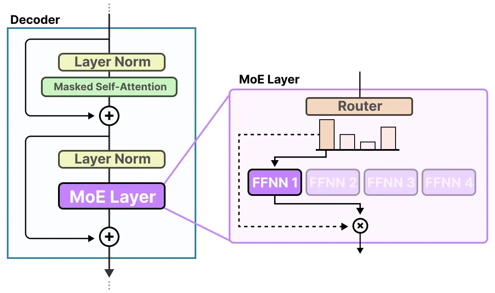
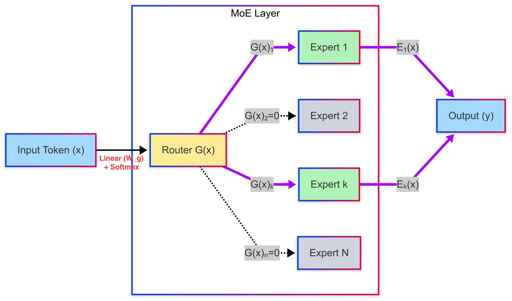
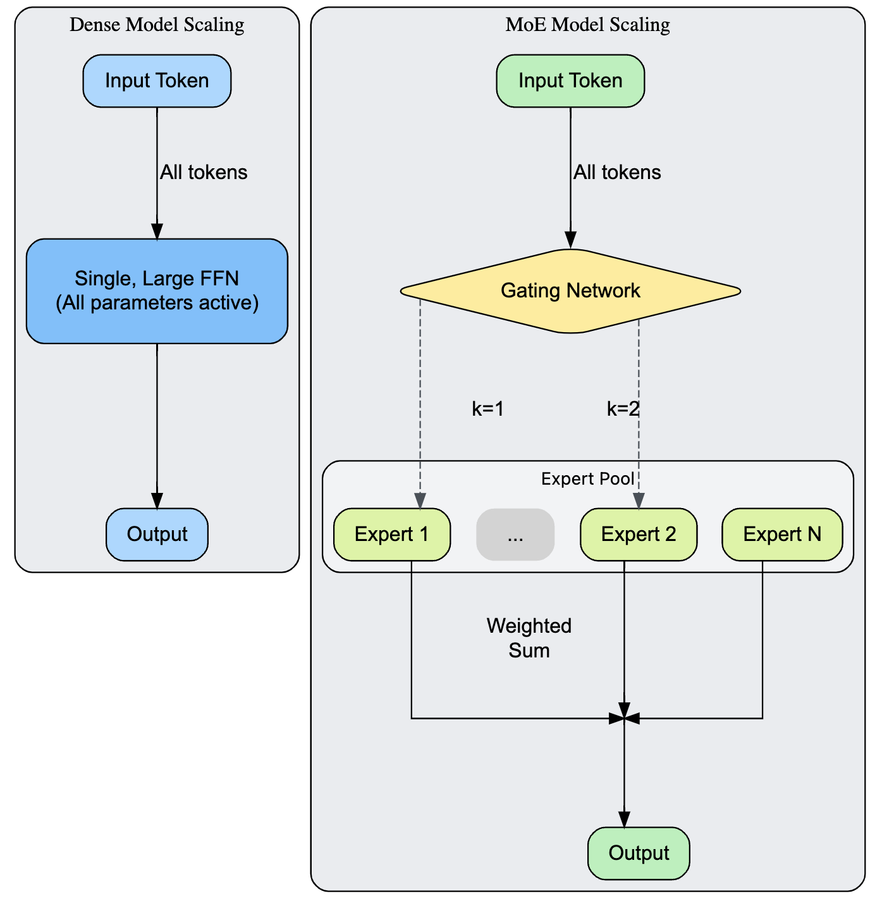
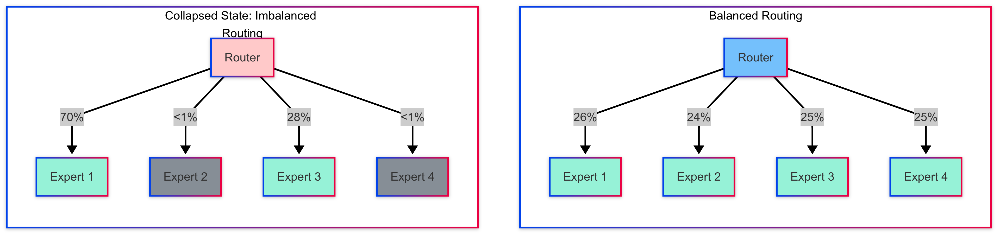
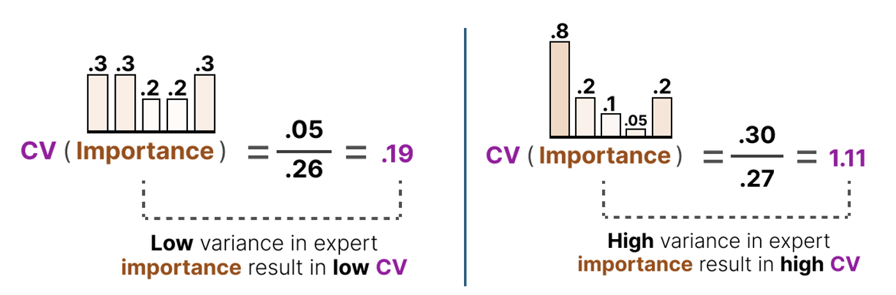
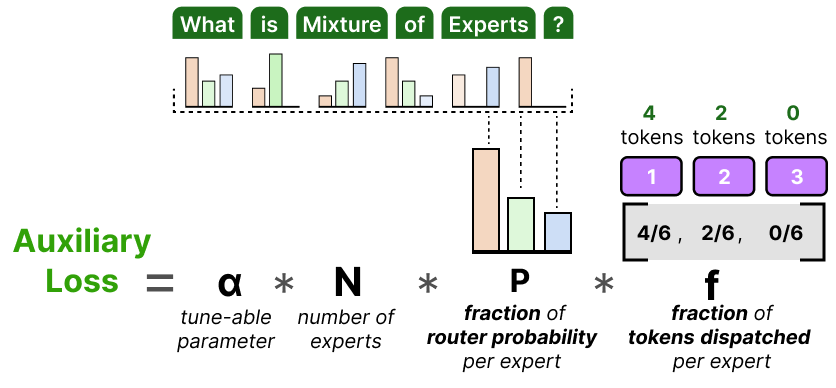

# MoE Overview

## 1. MoE (Mixture-of-Expert) 란?

***

### 1.1. 개요

MoE (Mixture-of-Experts) 모델은 거대한 매개변수(파라미터)를 효율적으로 활용하기 위해 등장한 희소sparse 모델 아키텍처입니다. 다수의 하위 신경망을 “전문가Expert”로 두고, 라우터Router 네트워크(또는 Gating network)가 입력 토큰별로 소수의 전문가만 선택하여 활성화합니다. 이를 통해 Forward pass에 필요한 계산량이 대폭 감소하는 스케일링 이점을 얻게 됩니다. 이를 간단히 요약하면 아래와 같습니다.

1. **용량 증가:** 모델이 훨씬 더 많은 수의 파라미터를 포함하게 되어, 토큰 당 계산 비용이 크게 증가하지 않으면서도 더 다양하고 전문화된 기능을 학습합니다.
2. **상대적 일정한 계산량:** 전체 모델 크기는 커지더라도, 활성화된 전문가 수 $$k$$를 고정함으로써 단일 토큰을 처리하는 데 필요한 계산 비용(FLOPs)은 대략 일정하게 유지되거나 훨씬 느리게 증가하게 됩니다.

아래 그림은 MoE 모델의 레이어 예시로, 라우터가 입력 토큰을 2개의 전문가 FFN에 라우팅하고 해당 전문가의 출력을 취합하는 Top-2 라우팅 방식을 보여줍니다. 이를 통해 한 레이어에서 다중 전문가 FFN들이 동시에 작동하면서도, **각 토큰은 소수 전문가의 출력만 활용**하게 됩니다. Router는 간단한 피드포워드 네트워크(FFN; Feed Forward Network)로, 일반적으로 토큰의 입력 임베딩에 적용되는 단일 선형 레이어와 그 뒤에 오는 소프트맥스 함수로 구성됩니다. 이에 대해서는 아래에 자세히 설명하겠습니다.

<figure><figcaption>
MoE 레이어 (출처: A Visual Guide to Mixture of Experts)
</figcaption></figure>

<figure><figcaption>
Top-2 라우팅 예시
</figcaption></figure>

### 1.2. 수학적 정의

$$d$$ 가 모델의 은닉hidden 차원인 벡터 $$x \in \mathbb{R}^d$$로 표현되는 단일 입력 토큰을 고려해 보겠습니다. Router 자체는 간단한 선형 레이어로, $$N$$이 총 전문가 수인 훈련 가능한 가중치 행렬 $$W_g \in \mathbb{R}^{d \times N}$$으로 정의합니다. 이 레이어는 입력 토큰을 차원 $$N$$의 공간으로 투영(project)하여 각 전문가에 대한 로짓(logit)을 생성합니다.

$$
\text{logits }  H(x) = x \cdot W_g
$$

* $$N$$: 레이어의 총 전문가 수로 각 전문는 일반적으로 독립적인 FFN입니다. (가중치를 공유하지 않습니다.)
* $$W_g$$: 라우터의 학습 가능한 가중치 행렬

결과로 나온 벡터는 어떤 전문가들이 선택될지를 결정하는 점수들을 포함합니다. 희소성을 강제하기 위해, 이 벡터에 top-k 함수가 적용됩니다. 예를 들어, $$k=2$$인 경우 가장 높은 점수를 가진 두 명의 전문가만 선택됩니다. 나머지 전문가들의 점수는 모두 0으로 설정되어 현재 토큰에 대해 비활성화됩니다.

$$H(x)$$는 어떤 전문가들이 선택될지를 결정하는 $$N$$개 전문가의 raw score를 포함합니다. 이러한 점수를 확률 분포로 변환하기 위해 각 전문가에 대해 소프트맥스를 적용하여 확률 분포 $$G(x)$$로 변환합니다.

$$
G(x) = \text{softmax}(H) = \frac{\exp(H)}{\sum_{j=1}^{N} \exp(H_j)}
$$

출력 $$G(x)$$는 밀집dense $$N$$차원 벡터로, 각 요소 $$G(x)_i$$는 토큰을 전문가 $$i$$에 할당하는 라우터의 신뢰도를 나타냅니다. 소프트맥스 함수이기 때문에 $$G(x)$$의 모든 요소의 합은 1입니다.

이제 이러한 단계들을 결합하여 MoE 레이어의 최종 출력 $$y(x)$$를 정의할 수 있습니다. 라우터 $$G(x)$$는 입력 표현 $$x$$ (보통 트랜스포머의 셀프 어텐션 계층 출력)를 검사하여 어떤 전문가가 이 입력을 처리할지 나타내는 확률 또는 가중치를 생성합니다. 선택된 전문가들의 출력 $$E_i(x)$$는 라우터의 점수로 가중합되어 결합됩니다.

$$
y(x) = \sum_{i=1}^{N} G(x)_i \cdot E_i(x)
$$

각 전문가 $$E_i$$는 자체 매개변수 집합을 가집니다. 표준 2-layer FFN 전문가는 다음과 같이 표현 가능합니다.

$$
E_i(x) = \text{ReLU}(x \cdot W_{1,i}) \cdot W_{2,i}
$$

여기서 $$W_{1,i}$$ 와 $$W_{2,i}$$는 각각 전문가 $$i$$의 첫 번째와 두 번째 선형 레이어의 가중치 행렬입니다.

### 1.3. Sparse MoE (Top-k 라우팅)

위에서 산출한 밀집dense 확률 벡터인 $$G(x)$$ 벡터는 모든 전문가가 출력에 기여한다는 것을 의미하며, 이는 MoE의 계산 효율성이 높지 않다는 것을 의미합니다. 희소성Sparse을 강제하기 위해 **top-k 선택** 메커니즘을 적용함으로써, 주어진 토큰에 대해 전문가의 일부만 활성화할 수 있습니다. 이는 모든 $$N$$개의 전문가를 사용하는 대신 로짓 벡터 $$H$$에서 가장 높은 점수를 가진 $$k$$개의 전문가를 선택하는 것입니다. $$k$$의 값은 대개 1 또는 2로 설정됩니다. (예컨대, $$k=2$$ 인 경우, 라우터는 가장 높은 로짓을 가진 두 전문가를 식별합니다.) 다른 모든 전문가는 이 특정 토큰에 대해 무시되어, 계산 비용이 총 전문가 수 $$N$$이 아닌 $$k$$에 비례합니다.

과정은 다음과 같이 진행됩니다:

1. **점수 계산:** $$G(x)$$를 계산합니다.
2. **Top-k 선택:** $$G$$에서 가장 큰 값 $$k$$개에 해당하는 인덱스 $$\text{TopK}(H) = {i_1, i_2, ..., i_k}$$를 식별합니다.
3. **점수 재정규화 및 가중합 계산:** 선택된 $$k$$명의 전문가에 대해서만 소프트맥스를 적용하여 점수(확률)를 재정규화합니다. 최종 출력은 (재정규화된) 게이팅 확률을 가중치로 사용하여 선택된 전문가들의 출력의 가중 합입니다.

$$
y(x) = \sum_{i \in \text{TopK}(H)} \frac{\exp(H_i)}{\sum_{j \in \text{TopK}(H)} \exp(H_j)} \cdot E_i(x)
$$

Sparse MoE 접근법은 모델 크기(매개변수 수)와 계산 비용(토큰당 FLOPs)을 분리하는 강력한 메커니즘을 제시합니다. 이를 통해 수조 개의 매개변수를 가진 초거대 모델을 구축하면서도 훈련과 추론 시 계산 용량을 관리 가능한 수준으로 유지할 수 있습니다.

### 1.4. Dense 모델과 Sparse MoE 모델의 계산 비용 (FLOPs) 비교

<figure><figcaption>
Dense 모델 vs. Sparse MoE 모델
</figcaption></figure>

#### **Dense 모델**

밀집dense 모델에서는 주어진 층의 모든 입력 토큰이 모든 파라미터에 의해 처리기에 토큰당 FLOPs는 밀집 계층 파라미터의 크기에 비례합니다. 입력/출력 차원이 $$d_{\text{model}}$$이고 중간 차원이 $$d_{\text{ffn}}$$인 FFN의 경우, 단일 토큰에 필요한 파라미터 수와 계산량은 모델의 차원, 특히 $$d_{\text{model}}$$과 $$d_{\text{ffn}}$$에 정비례합니다.

$$
\text{FLOPs}_{\text{dense}} \approx 2 \times \text{batch_size} \times \text{seq_len} \times d_{\text{model}} \times d_{\text{ffn}}
$$

이 식은 $$d_{\text{ffn}}$$을 증가시켜 모델을 더 똑똑하게 만들려면 방대한 계산 비용을 지불해야 한다는 것을 보여줍니다.

**Sparse MoE 모델**

Sparse MoE 모델의 경우 많은 전문가들에 걸쳐 방대한 수의 총 파라미터를 포함하고 있을지라도, 주어진 토큰에 대해 활성화되는 파라미터는 그 중 일부에 불과합니다. 예컨대 전문가를 16명에서 64명으로 늘려도 토큰당 FLOPs는 증가하지 않습니다.&#x20;

MoE 레이어의 총 파라미터 수는 모든 전문가들의 합입니다.

$$
\text{Parameters}_{\text{MoE}} = N_{\text{experts}} \times \text{Parameters}_{\text{expert}}
$$

하지만 FLOPs는 활성화된 전문가 수 $$k$$에만 비례합니다.

$$
\text{FLOPs}_{\text{MoE}} \approx k \times (2 \times \text{batch\_size} \times \text{seq\_len} \times d_{\text{model}} \times d_{\text{expert}})
$$

이것이 MoE 아키텍처의 핵심 장점입니다. 전문가 수 $$N_{\text{experts}}$$를 늘려 모델의 용량capacity(총 파라미터 수)을 극적으로 증가시키면서도, 토큰당 계산 비용은 $$k$$를 고정함으로써 일정하게 유지할 수 있습니다. 이는 밀집 모델보다 훨씬 작은 계산 예산으로도 수조 개의 파라미터를 가진 모델을 훈련할 수 있게 합니다.

## 2. Router 네트워크 훈련

***

직관적으로 특정 유형의 토큰을 특정 전문가에게 라우팅하는 것이 지속적으로 모델의 loss를 줄일 수 있게, 오류역전파를 통해 $$W_g$$ 를 업데이트하여 미래에 특정 전문가 할당의 확률을 증가시키는 피드백 루프를 수행합니다. 그러나 이 과정에서 큰 난제가 발생하는데 게이팅 네트워크가 소수의 전문가들만 선호하여 다른 전문가들을 훈련되지 않은 상태로 남겨두는 불균형 라우팅 문제(또는 전문가 붕괴Expert collapse)가 발생한다는 것입니다. 이를 완화하기 위해 보조 손실Auxiliary Loss (또는 로드 밸런싱 소실), 전문가 용량Capacity Factor, 라우터 노이즈 기법을 적용합니다.

1. **보조 손실(Auxiliary Loss):** 로드 밸런싱 손실에 보조 손실을 추가함으로써 전문가의 분포를 균등하게 합니다.
2. **라우터 노이즈:** top-k 전문가를 선택하기 전에 게이팅 네트워크의 로짓에 소량의 무작위 노이즈를 추가하여 선택될 확률이 낮은 전문가도 가끔 탐색하도록 강제합니다.
3. **전문가 용량 (Capacity Factor):** 전문가가 수용할 수 있는 토큰 수에 대한 버퍼 크기를 조정하는 것은 라우터의 행동과 드롭된 토큰 수에 영향을 미칩니다.

### 2.1. 전문가 붕괴 (Expert Collapse)

전문가 붕괴는 라우터가 대부분의 토큰을 작고 선호되는 전문가 부분집합으로 라우팅하는 것을 학습하는 반면, 나머지 전문가들은 적거나 아예 토큰을 받지 못할 때 발생합니다. 이러한 활용도가 낮은 전문가들은 의미 있는 전문화를 학습하지 못하고, 효과적으로 "죽은" 매개변수가 됩니다.

MoE 모델 훈련 중에는 전문가 붕괴Expert Collapse 현상이 자연스럽게 발생하는 경우가 많습니다:

* **초기화:** 게이팅 네트워크의 초기 무작위 가중치가 특정 전문가들을 본질적으로 선호할 수 있습니다.
* **초기 훈련 역학****Dynamics****:** 초기 그래디언트가 초기에 설정된 라우팅 패턴을 강화하여, 약간 더 잘 수행하는 일부 전문가들이 점점 더 많은 토큰을 받는 피드백 루프를 만들 수 있습니다.
* **데이터 분포:** 특정 특징이나 패턴이 훈련 데이터에 더 많이 존재할 수 있어, 최적화가 잘 된 게이팅 네트워크가 이를 특정 전문가에게 라우팅하게 되고, 해당 패턴이 흔할 경우 전문가들이 과부하될 수 있습니다.
* **명시적 메커니즘 부족:** 부하 균형을 장려하는 메커니즘이 없으면 부하를 고르게 분배할 동기가 없습니다.

전문가 붕괴 문제를 해결하는 것은 단순한 최적화 세부사항이 아니라, 크고 성능 좋은 MoE 모델을 성공적으로 훈련하기 위한 필수 절차입니다.

<figure><figcaption>
전문가 붕괴 라우팅 (좌측 도식) 및 균형 라우팅 (우측 도식) 
</figcaption></figure>

전문가 붕괴를 식별하려면 훈련 과정 전반에 걸쳐 라우터 행동을 모니터링해야 합니다. 단순히 총 손실을 관찰하는 것만으로는 불충분하며, 근본적인 불균형을 드러내지 못할 수 있습니다. 진단을 위해 아래의 주요 지표를 활용합니다.

* **전문가 활용도(Expert Utilization):** 설정된 훈련 단계 수에 걸쳐 각 전문가에게 전달된 토큰 수를 추적합니다. 전문가당 토큰 수의 히스토그램이 심하게 치우쳐 있다면 전문과 붕괴임을 의미합니다.
* **로드 밸런싱 손실:(Load Balancing Loss)**: 높은 값은 라우터가 로드 균형을 맞추는 데 어려움을 겪고 있음을 시사합니다. 그러나 낮은 값이 항상 좋은 결과를 보장하는 것은 아닙니다. 라우터가 토큰을 드롭하여 낮은 손실을 달성할 수 있기 때문입니다.
* **변동 계수(CV; Coefficient Variation):** 전문가당 토큰 분포의 변동 계수로 표준편차를 평균으로 나눈 값으로 정의됩니다. 0에 가까운 CV는 완벽한 균형을 나타내고, 높은 CV는 상당한 불균형을 나타냅니다. 쉽게 말해, 각 전문가의 중요도 점수가 많이 다르면 CV가 높고 모든 전문가의 중요도 점수가 비슷하면 CV가 낮아집니다.

$$
\text{CV} = \frac{\sqrt{\frac{1}{N} \sum_{i=1}^{N} (L_i - \bar{L})^2}}{\bar{L}}
$$

* $$N$$: 전문가 수, $$L_i$$: 훈련 단계에서 전문가 $$i$$의 로드(토큰 수), $$\bar{L}$$: 평균 로드

<figure><figcaption>
낮은 CV와 높은 CV (출처: A Visual Guide to Mixture of Experts)
</figcaption></figure>

### 2.2. 보조 손실 (Auxiliary Loss)

보조 손실의 목표는 라우터의 불균형에 대해 페널티를 주는 손실 항을 만드는 것입니다. 원래 Sparsely-Gated MoE 논문에서 도입된 가장 일반적인 접근법은 배치에서 토큰과 라우터 확률 분포를 기반으로 값을 계산하는 것입니다.

$$N$$이 총 전문가 수인 토큰 배치에 대해 두 가지 벡터를 정의해보겠습니다.

1. **전문가당 토큰 비율** ($$f_i$$)**:** 전문가 $$i$$로 보내지는 토큰의 수를 측정합니다. 배치에 $$B$$개의 토큰이 있고 top-1 게이팅을 사용한다면, 이는 단순히 전문가 $$i$$로 라우팅된 토큰 수를 $$B$$로 나눈 것입니다.
2. **전문가당 평균 라우터 확률** ($$P_i$$): 배치의 모든 토큰에 걸쳐 라우터가 전문가 $$i$$에 할당하는 평균 확률(또는 게이팅 점수)입니다. 이는 궁극적으로 선택되었는지 여부와 관계없이 라우터가 전문가 i에게 부여하는 "중도"을 나타냅니다.

#### 보조 손실 함수

보조 손실 $$L_{aux}$$는 이 두 벡터의 내적으로 계산되며, 전문가 수 $$N$$으로 스케일됩니다:

$$
L_{aux} = N \cdot \sum_{i=1}^{N} f_i \cdot P_i
$$

이 손실을 최소화하기 위해, 모델은 단일 전문가 $$i$$가 높은 토큰 비율 $$f_i$$와 높은 평균 확률 $$P_i$$를 동시에 갖는 것을 방지해야 합니다. 손실은 곱 $$f_i \cdot P_i$$가 작고 고르게 분포될 때 가장 낮으며, 이는 모든 전문가에 걸쳐 로드가 균형을 이룰 때 발생합니다.

<figure><figcaption>
보조 손실 쉽게 이해하기 (출처: A Visual Guide to Mixture of Experts)
</figcaption></figure>

#### 최종 손실 함수

보조 손실은 작업 손실(예: $$L_{\text{task}} = \text{CrossEntropy}(y_{\text{pred}}, y_{\text{true}})$$)과 결합되어 역전파에 사용되는 최종 손실 함수를 형성합니다:

$$
L_{total} = L_{task} + \alpha \cdot L_{aux}
$$

하이퍼파라미터 $$\alpha$$는 종종 `load_balance_loss_coef`라고 불리며, 균형 인센티브의 강도를 제어하는 작은 스칼라 값입니다.

* $$\alpha$$가 너무 작으면, 균형 힘이 너무 약해서 전문가 붕괴를 방지할 수 없습니다.
* $$\alpha$$가 너무 크면, 모델이 주요 작업의 성능을 희생하면서 완벽한 로드 밸런싱을 우선시하여 전체적인 정확도가 떨어질 수 있습니다.

$$\alpha$$에 적합한 값을 찾는 것은 MoE 모델의 하이퍼파라미터 튜닝 과정이며, 일반적인 시작점은 `0.01` 정도의 값입니다. 이 간단하지만 효과적인 메커니즘은 거의 모든 MoE 훈련 파이프라인의 베이스라인입니다.

### **2.3. 전문가 용량 (Expert Capacity)**

전문가 용량 (C)는 중요한 하이퍼파라미터로 용량이 초과된 토큰(overflow)은 계산에서 제외되고, 잔차 연결(residual connection)을 통해 다음 레이어로 바로 전달됩니다. 라우팅 과정에 내재된 합리적인 정도의 불균형을 수용할 만큼 충분히 커야 하지만, 전문가가 충분히 활용되지 않을 때 과도한 계산 낭비(패딩)를 초래할 정도로 너무 커서도 안 됩니다.

용량은 일반적으로 전문가당 이상적인 균일 부하를 기준으로 capacity\_factor $$C$$ 값을 조정하여 설정합니다. 여기서 $$N$$은 처리되는 토큰 수(예: 전문가 병렬 처리 시 디바이스당 토큰 수)이고, $$E$$는 로컬에서 사용 가능한 전문가 수일 때, 이상적인 부하는 $$N/E$$입니다. 따라서, 전문가 용량은 다음과 같이 설정됩니다:

$$
C = \lceil \text{capacity\_factor} \times \frac{N}{E} \rceil
$$

$$C$$의 일반적인 값 범위는 1.0에서 2.0 사이입니다.

* 1.0에 가까운 값(예: 1.1, 1.25)은 계산 오버헤드를 최소화하지만, 부하가 약간만 불균형해도 토큰이 손실될 위험이 증가합니다.
* 더 큰 값(예: 1.5, 2.0)은 토큰 손실 가능성을 줄이지만, 전문가가 종종 $$C$$개의 토큰보다 적게 처리할 수 있기 때문에 필요 이상으로 계산 자원이 할당될 수 있습니다.

### 2.4. 라우터 노이즈 (Noisy Top-k Gating)

전문가 로드 밸런싱의 또다른 기법은 라우터 노이즈입니다. 원시 게이팅 로짓raw gating logits만을 기반으로 상위 $$k$$명의 전문가를 선택하는 대신, 선택 과정 전에 노이즈를 추가합니다. 일반적인 방법으로는 가우시안 노이즈를 추가합니다.

$$
\text{noisy\_logits} = \text{logits} + \mathcal{N}(0, \sigma^2)
$$

$$\mathcal{N}(0, \sigma^2)$$는 분산이 $$\sigma^2$$, 평균이 0인 가우시안 분포에서 추출된 샘플을 의미합니다. 그런 다음 이 `noisy_logits`에 대해 TopK 선택이 수행됩니다. 노이즈 분산 $$\sigma^2$$는 종종 훈련 가능한 파라미터로 구현되거나 훈련 스케줄링에 의해 조절됩니다.

조금 더 수학적으로 표현해 보겠습니다. 만약 $$W_g$$가 게이팅 가중치 행렬이고 $$x$$가 입력 토큰 표현이라면, 표준 로짓은 $$\text{logits} = x \cdot W_g$$ 입니다. Noisy top-k의 경우, 다음과 같이 계산합니다.

$$
\text{noisy_scores} = x \cdot W_g+ \epsilon \cdot \text{softplus}(x \cdot W_{noise})
$$

$$\epsilon \sim \mathcal{N}(0, 1)$$는 토큰별로 샘플링된 표준 가우시안 노이즈이며, $$W_{noise}$$는 입력에 기반해 노이즈를 곱셈적으로 스케일링하는 또 다른 훈련 가능한 가중치 행렬입니다. softplus 함수는 노이즈 스케일링 인자가 양수가 되도록 보장합니다.

이렇게 추가된 잡음은 라우팅 결정에 확률성을 도입합니다. 이는 점수가 낮은 전문가들도 선택될 기회를 제공하여 탐색을 촉진하고, 라우터가 너무 일찍 최적이 아닌 할당 패턴에 고착되는 것을 방지할 수 있습니다.

## 3. MoE 최적화 베이스라인

***


아래 베이스라인을 기반으로 특정 애플리케이션과 하드웨어 환경에 맞게 성능, 전문화, 계산 가능성의 균형을 맞춘 MoE 아키텍처를 도출하는 것을 권장합니다.


### 3.1. 전문가 수 결정

전체 전문가 수 $$N$$은 주요 아키텍처 선택 사항입니다. 이 값을 늘리면 다음과 같은 장점이 있습니다:

* **더 많은 파라미터 수:** MoE 계층은 모델 크기를 효율적으로 확장합니다. 전문가를 추가하면 전체 파라미터 수가 크게 증가하지만, 각 토큰이 라우팅되는 전문가 수 $$k$$가 작게 유지된다면 계산 비용(FLOPs per token)은 적당히만 증가합니다.
* **더 세밀한 전문화:** 더 많은 전문가는 모델이 다양한 입력 유형이나 문맥에 대해 더 구별되고 특화된 기능을 학습할 수 있게 합니다.
* **하드웨어 매핑:** 전문가 병렬 처리Expert Parallelism를 사용하는 분산 환경에서는 $$N$$이 보통 사용 가능한 처리 장치(GPU 등)의 수에 따라 결정되며, 각 장치에 하나 이상의 전문가가 할당됩니다. 대형 모델에서 흔히 사용되는 $$N$$ 값은 8, 16, 64, 128 또는 그 이상입니다.

하지만 $$N$$을 늘리면 다음과 같은 문제도 발생합니다:

* **통신 오버헤드:** 전문가 병렬 처리에서는 All-to-All 통신이 필요하여 장치 간 토큰을 섞어야 합니다. 전문가 수가 많아질수록 통신 오버헤드가 커져 병목 현상이 발생합니다.
* **부하 균형의 어려움:** 더 많은 전문가가 모두 효과적으로 활용되도록 라우터와 보조 손실 함수를 설계하는 것이 더 어려워집니다.
* **이득 감소:** 데이터가 자연스럽게 그렇게 많은 구별된 전문 분야로 분해되지 않거나, 라우터가 토큰을 효과적으로 할당하지 못하면 전문가를 더 추가해도 모델 품질이 크게 향상되지 않을 수 있습니다.

### 3.2. Top-k 라우팅과의 상호작용

대부분의 최신 MoE 구현에서는 **top-k 라우팅**을 사용하며, 일반적으로 $$k=1$$ 또는 $$k=2$$를 선택합니다.

* **k=1:** 각 토큰은 단일 전문가에게 라우팅됩니다. 배치/그룹 전체의 토큰 할당 수는 $$T$$입니다. 총 가용 용량은 $$N \times C$$입니다. 부하 분산은 $$T$$개의 할당을 $$N$$명의 전문가들 사이에 대략 균등하게 분배하는 것을 목표로 합니다.
* **k=2:** 각 토큰은 두 명의 전문가에게 라우팅됩니다. 토큰 할당 수는 총 $$2T$$가 됩니다. 총 가용 용량은 여전히 $$N \times C$$입니다. 이는 시스템에 훨씬 더 큰 부담을 줍니다. 과도한 토큰 손실을 피하기 위해서는 다음이 필요할 수 있습니다:
  * 더 높은 용량 계수 (Capacity Factor, CF)
  * 보조 손실 (auxiliary loss) 을 통한 더 효과적인 부하 분산
  * 토큰 배치 크기($$T$$)에 비해 더 많은 전문가 수($$N$$)

$$k=2$$를 사용하는 것은 토큰이 여러 전문화된 기능의 혜택을 받을 수 있게 하여 모델 품질을 향상시키는 경우도 있지만, 토큰당 두 명의 전문가를 활성화함으로써 계산량 증가와 잠재적으로 더 높은 통신 및 용량 요구 사항이라는 비용이 따르기 때문에 신중히 검토해야 합니다.

### 3.3. 보조 손실 균형 계수 (alpha) 조정

$$\alpha$$의 적절한 값은 보통 경험적으로heuristic 찾습니다. 일반적인 방법은 다음과 같습니다:

1. **추천 범위**: 값은 보통 $$10^{-2}$$ 또는 $$10^{-3}$$처럼 작지만, 최적 값은 모델 아키텍처, 작업, 전문가 수, 선택한 보조 손실 공식에 크게 의존합니다. 지나치게 큰 $$\alpha$$는 로드 밸런싱을 우선시하여 전체적인 정확도가 떨어질 수 있고 지나치게 작은 $$\alpha$$는 라우터 불균형을 개선하지 않다는 점을 기억해 주세요.
2. **모니터링**: 훈련 중에는 아래와 같은 중요한 지표들을 관찰하세요. 모니터링은 Weights & Biases나 텐서보드 같은 툴킷이 매우 유용합니다.&#x20;
   1. 전문가 활용도: 각 배치 또는 여러 단계에 걸쳐 각 전문가가 처리한 토큰의 수나 비율을 추적합니다. 이상적으로는 전문가들이 대략 비슷한 활용도를 가져야 하지만, 완벽한 균일성이 항상 필요하거나 최적은 아닙니다.&#x20;
   2. 보조 손실 $$L_{aux}$$ 크기: 보조 손실 값 자체를 관찰합니다. 일반적으로 훈련이 진행되고 균형이 개선됨에 따라 감소해야 합니다. $$L_{aux}$$가 $$L_{task}$$에 비해 어느 정도인지도 모니터링합니다.
   3. **작업 손실 및 검증 성능:** $$\alpha$$를 증가시킬 때 모델이 주 작업을 학습하는 능력이 지나치게 손상되지 않도록 합니다. $$L_{task}$$와 관련된 검증 지표(예: 정확도, BLEU 등)를 추적하세요.
3. **트레이드-오프**Trade-off **분석을 통한** **반복 조정**: 작은 $$\alpha$$로 시작합니다. 만약 심각한 불균형(예: 일부 전문가는 평균보다 훨씬 적은 토큰을 계속 받는 경우)이 관찰되면 $$\alpha$$를 점진적으로 증가시킵니다. $$\alpha$$를 키울 때 주 작업 성능(검증 손실/정확도)이 크게 떨어지지 않도록 주의합니다.
4. **스케줄링**: 일부 실무자는 훈련 중 $$\alpha$$를 조절합니다. 초반에는 균형 강제를 위해 약간 높은 값으로 시작하고, 훈련이 진행되어 전문가들이 자연스럽게 특화되기 시작하면 점차 값을 줄이는 방식입니다.

### 3.4. 실용적 지침 및 모니터링

MoE 모델 개발 및 훈련 중에 추적해야 할 중요한 지표는 다음과 같습니다:

1. **드롭된 토큰 비율:** 용량이 충분한지 여부를 나타내는 주요 지표입니다. 높은 값(1-2% 이상)은 문제가 발생했음을 의미합니다.
2. **전문가 활용도 / 부하 균형:** 각 전문가에 할당된 토큰 수의 변동 계수(CV)나 전문가 할당 시각화와 같은 지표를 모니터링합니다. 이는 라우터 문제를 진단하고 부하 균형 손실을 조정하는 데 도움이 됩니다.
3. **계산 비용(FLOPs) 및 훈련 처리량:** 다양한 구성의 실제 성능 영향을 측정합니다.
4. **전체 모델 성능:** LLM의 BLEU/ROUGE나 다운스트림 작업의 정확도와 같은 표준 지표를 추적합니다. 아키텍처 선택이 최종 성능 향상으로 이어지는지 확인합니다.
5. **메모리 사용량:** 특히 분산 환경에서 중요하며, 선택한 구성이 장치 메모리 제약 내에 맞는지 확인합니다.

### 3.5. 옵티마이저 및 하이퍼파라미터

MoE 훈련을 위한 최적의 옵티마이저 설정과 하이퍼파라미터 조합을 찾는 것은 일반적으로 경험적인 과정이만, 아래의 베이스라인부터 시작해보는 것을 권장합니다.

1. **기본값으로 시작하기**: 표준 AdamW 설정$$\beta_1=0.9, \beta_2=0.999$$, 잘 알려진 학습률 스케줄(warmup + decay), 그리고 적당한 가중치 decay(예: 0.01 또는 0.1)부터 시작하세요.
2. **학습률****learning rate****과 보조 손실 계수를 함께 조정하기**: 학습률과 보조 손실 계수 $$\alpha$$는 보통 가장 민감한 파라미터입니다. 두 값을 함께 변화시키면서 작업 손실과 부하 균형 지표를 모니터링하는 실험을 수행하세요.
3. **Gradient Clipping**: 그래디언트 폭주exploding gradients를 방지하기 위해 gradient norm clipping을 안전장치로 적용합니다.
4. **Longer Warmup**: 초기 안정성에 문제가 있다면 warmup 단계를 연장해 보세요.

## References

* [Outrageously Large Neural Networks: The Sparsely-Gated Mixture-of-Experts Layer](https://arxiv.org/abs/1701.06538) (2017)
* [Switch Transformers: Scaling to Trillion Parameter Models with Simple and Efficient Sparsity](https://arxiv.org/abs/2101.03961) (2022)
* [GShard: Scaling Giant Models with Conditional Computation and Automatic Sharding](https://arxiv.org/abs/2006.16668) (2020)
* [MegaBlocks: Efficient Sparse Training with Mixture-of-Experts](https://arxiv.org/abs/2211.15841) (2023)
* [ST-MoE: Designing Stable and Transferable Sparse Expert Models](https://arxiv.org/abs/2202.08906) (2022)
