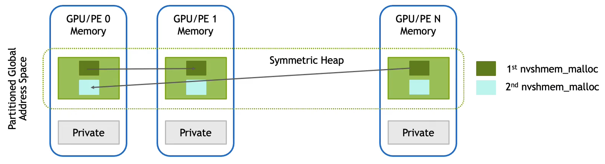

# \[Optional] NVSHMEM (NVIDIA Shared Memory)


NCCL은 여전히 딥러닝 프레임워크의 기본 통신 백엔드로 쓰이지만, NCCL이 최적화하지 못하는 영역(All-to-All, MoE 통신)을 NVSHMEM 기반 커널로 보완하는 DeepEP와 같은 라이브러리들이 등장하고 있습니다. 따라서, 본 문서는 NVSHMEM에 대한 컨셉을 이해하는 용도로 참조하기 바랍니다.&#x20;


## 1. NVSHMEM 개요

***

### 1.1. NVSHMEM이란?

NVSHMEM(NVIDIA Shared Memory)은 GPU 클러스터에서 여러 프로세스가 GPU 메모리를 직접 공유하고 통신할 수 있게 해주는 통신 라이브러리입니다. 기존 OpenSHMEM의 개념을 GPU 환경으로 확장한 것으로, CUDA 커널 내부에서 직접 원격 GPU의 메모리에 접근할 수 있는 혁신적인 기능을 제공합니다.

가장 중요한 특징은 **CPU의 개입 없이 GPU가 스스로 다른 GPU와 통신**할 수 있다는 점입니다. 전통적인 방식에서는 GPU가 데이터를 보내려면 먼저 CPU에게 알리고, CPU가 네트워크 작업을 시작해야 했습니다. NVSHMEM은 이러한 병목을 제거하여 GPU 간 통신의 지연 시간을 획기적으로 줄입니다.

#### SPMD(Single Program Multiple Data) 실행 모델

NVSHMEM 작업은 여러 운영체제 프로세스로 구성되며, 각 프로세스를 Processing Element(PE)라고 부릅니다. 모든 PE는 동일한 실행 파일의 복사본을 실행하는 SPMD(Single Program, Multiple Data) 패러다임을 따릅니다. SPMD는 마치 같은 레시피를 가진 여러 요리사가 각자 다른 재료로 요리하는 것과 같습니다. 모든 PE가 동일한 코드(레시피)를 실행하지만, 각 PE는 자신의 고유 ID를 통해 서로 다른 데이터(재료)를 처리하고, 필요에 따라 조건문으로 다른 작업을 수행할 수 있습니다. 예를 들어 "`if (my_id == 0)`"으로 0번 PE만 특정 작업을 하게 하거나, "`process_chunk(data[my_id])`"로 각 PE가 자신에게 할당된 데이터 부분을 처리하게 만들 수 있습니다.

각 PE에는 0부터 시작하는 고유한 정수 식별자(PE ID)가 할당됩니다. 이 ID는 통신 작업에서 소스나 목적지를 지정하는 데 사용되며, 개발자가 특정 PE에 작업을 할당할 때도 활용됩니다. 예를 들어 8개의 GPU로 작업을 실행한다면, PE ID는 0부터 7까지 할당됩니다.

프로그램 시작 시 모든 PE는 반드시 동시에, 즉 집합적으로(collectively) NVSHMEM 초기화 루틴을 호출해야 합니다. 마찬가지로 프로그램 종료 전에도 모든 PE가 함께 종료 함수를 호출해야 합니다. 초기화가 완료되면 PE는 자신의 ID와 전체 PE 개수를 조회할 수 있습니다.

<figure><figcaption></figcaption></figure>

#### Symmetric Memory

NVSHMEM의 핵심은 대칭 메모리<sup>symmetric memory</sup> 개념입니다. 이는 모든 PE에 동일한 크기와 레이아웃으로 할당되는 GPU 메모리 영역을 의미합니다. 각 PE는 자신의 GPU 메모리에 symmetric heap이라는 특별한 영역을 가지고 있으며, NVSHMEM API를 통해 이 힙에서 메모리를 할당받습니다.

대칭 메모리 할당은 집합 연산<sup>collective operation</sup>입니다. 모든 PE는 동일한 크기 인자를 전달하여 할당 함수를 호출해야 하며, 그 결과 각 PE의 대칭 힙<sup>symmetric heap</sup>에서 지정된 크기의 메모리가 할당됩니다. 이렇게 할당된 메모리는 대칭적이라는 특별한 속성을 가집니다. PE ID와 대칭 주소의 조합을 사용하면 다른 PE에서도 이 메모리에 접근할 수 있습니다.

중요한 점은 NVSHMEM API를 통하지 않고 할당된 메모리는 해당 PE의 private memory로 간주되어 다른 PE가 접근할 수 없다는 것입니다. 오직 `nvshmem_malloc` 같은 NVSHMEM 할당 함수를 통해 얻은 메모리만이 다른 PE와 공유 가능한 대칭 메모리<sup>symmetric memory</sup>가 됩니다.

#### PGAS(Partitioned Global Address Space) 모델: 전역 주소 공간의 파티션

모든 PE의 대칭 메모리 세그먼트를 합친 것을 Partitioned Global Address Space(PGAS, 파티션된 전역 주소 공간)라고 부릅니다. 이는 분산 메모리 시스템을 마치 하나의 거대한 전역 메모리처럼 다룰 수 있게 해주는 추상화입니다.

PGAS 모델에서 데이터의 위치는 주소 지정 모델의 본질적인 부분입니다. NVSHMEM 연산은 `<symmetric_address, destination_PE>` 튜플로 symmetric 객체에 접근합니다. symmetric address는 NVSHMEM 할당 함수가 반환한 주소에 포인터 연산을 수행하여 생성할 수 있습니다. 예를 들어 `&X[10]`이나 `&ptr->x` 같은 표현식을 사용할 수 있습니다.

주의할 점은 symmetric address는 할당을 받은 PE에서만 유효하다는 것입니다. 다른 PE와 이 주소 값을 공유할 수 없습니다. NVSHMEM 런타임은 내부적으로 symmetric address를 실제 원격 주소로 변환하며, 고급 CUDA 메모리 매핑 기법을 사용하여 이 변환 오버헤드를 최소화합니다.

#### 통신 모델: Put, Get, 그리고 AMO

NVSHMEM은 symmetric 객체로 데이터를 복사하는 put API와 symmetric 객체로부터 데이터를 가져오는 get API를 제공합니다. 대량 전송, 스칼라 전송, 그리고 인터리브 버전의 API들이 모두 제공됩니다. 또한 Atomic Memory Operations(AMO)도 제공되어 symmetric 변수에 대한 원자적 업데이트를 수행할 수 있습니다.

이러한 API들을 통해 NVSHMEM은 CUDA 커널로부터 PGAS에 저장된 데이터에 대한 세밀하고 낮은 오버헤드의 접근을 제공합니다. 커널 내부에서 통신을 수행함으로써, NVSHMEM은 GPU 워프 스케줄링 하드웨어의 본질적인 지연 은닉 기능의 이점을 활용할 수 있습니다.

put, get, AMO 라이브러리 루틴 외에도, 애플리케이션은 `nvshmem_ptr` 루틴을 사용하여 다른 PE의 PGAS 파티션에 위치한 데이터에 대한 직접 포인터를 조회할 수 있습니다. 지정된 PE의 메모리가 직접 접근 가능한 경우, 이 함수는 유효한 포인터를 반환합니다. 그렇지 않으면 null 포인터를 반환합니다. 이를 통해 애플리케이션은 전역 메모리에 직접 로드와 스토어를 발행할 수 있습니다.

NVSHMEM API와 하드웨어가 허용하는 경우의 로드/스토어는 로컬 및 원격 데이터에 접근하는 데 사용될 수 있어, 하나의 코드 경로로 로컬과 원격 데이터를 모두 처리할 수 있습니다. 또한 Hopper 아키텍처의 멀티캐스트 기능을 지원하는 플랫폼에서는 `nvshmemx_mc_ptr` 루틴을 사용하여 팀의 PGAS 파티션에 있는 데이터에 대한 직접 멀티캐스트 포인터를 조회할 수 있습니다.

#### OpenSHMEM과의 차이점

NVSHMEM은 OpenSHMEM의 GPU 확장이지만 몇 가지 중요한 차이가 있습니다. 첫째, NVSHMEM 할당 API를 사용하여 할당된 모든 symmetric 메모리는 핀된(pinned) GPU 디바이스 메모리입니다. 둘째, NVSHMEM은 GPU 측과 CPU 측 통신 및 동기화 API를 모두 지원하며, 관련 메모리가 NVSHMEM에 의해 할당된 GPU 디바이스 메모리이기만 하면 됩니다. 다른 OpenSHMEM 구현에서는 이러한 API를 CPU에서만 호출할 수 있습니다.

NVSHMEM은 상태를 가진<sup>stateful</sup> 라이브러리입니다. PE가 NVSHMEM 초기화 루틴을 호출하면, 어떤 GPU를 사용하고 있는지 감지하고 이 정보를 런타임에 저장합니다. PE가 수행하는 모든 symmetric 할당 호출은 선택된 GPU의 디바이스 메모리를 반환합니다. PE가 수행하는 모든 NVSHMEM 호출은 선택된 GPU에 대해 또는 이 GPU에서 실행된 커널 내부에서 이루어진 것으로 가정됩니다.

#### NVSHMEM의 장점과 유스케이스

NVSHMEM은 GPU 가속 애플리케이션에서 통신 오버헤드를 극적으로 줄입니다. CPU 개입 없이 GPU가 직접 통신을 제어하므로, 지연 시간이 마이크로초 단위로 줄어들고 CPU 자원을 절약할 수 있습니다. 특히 작은 메시지를 빈번하게 주고받아야 하는 애플리케이션에서 그 효과가 두드러집니다.

강한 스케일링이 필요한 HPC 애플리케이션에서 NVSHMEM은 필수적입니다. GPU 수가 늘어날수록 각 GPU가 처리하는 작업 크기가 줄어들고, 따라서 통신 메시지 크기도 작아집니다. 이러한 환경에서 NVSHMEM의 저지연 특성은 전체 시스템의 확장성을 크게 향상시킵니다.

그래프 알고리즘, 희소 행렬 연산, 분자 동역학 시뮬레이션과 같이 불규칙하고 동적인 통신 패턴을 가진 애플리케이션도 NVSHMEM의 주요 사용 사례입니다. 이러한 애플리케이션은 실행 중에 어떤 데이터를 어느 PE로부터 가져와야 하는지가 동적으로 결정되는데, NVSHMEM의 one-sided 통신 모델이 이를 자연스럽게 표현할 수 있게 해줍니다.

MoE<sup>Mixture-of-Experts</sup> 모델처럼 토큰마다 다른 전문가로 라우팅되는 현대적인 AI 아키텍처에서도 NVSHMEM은 핵심적인 역할을 합니다. DeepEP 같은 MoE 특화 통신 라이브러리가 NVSHMEM을 기반으로 구축된 것은 우연이 아닙니다. GPU 커널 내에서 즉시 통신 결정을 내리고 실행할 수 있는 NVSHMEM의 능력이 MoE의 동적이고 불규칙한 통신 패턴을 효율적으로 처리하는 데 이상적이기 때문입니다.

#### InfiniBand GPUDirect Async 전송

NVSHMEM은 InfiniBand 네트워크 통신의 제어 플레인과 데이터 플레인을 모두 GPU에서 완전히 구현하는 것을 지원합니다. 이는 디바이스가 시작한 통신을 역방향 프록시할 필요를 제거합니다. 이 기능은 InfiniBand GPUDirect Async(IBGDA) 원격 전송으로 노출됩니다.

IBGDA 전송을 사용하기 위한 전제 조건이 있습니다. Mellanox HCA와 NIC만 지원되며, Mellanox OFED 5.0 이상이 필요합니다. 또한 nvidia.ko 드라이버는 510.40.3 이상이어야 하고, nvidia\_peermem 510.40.3 이상 또는 nv\_peer\_mem 1.3 이상이 필요합니다. 이러한 요구사항이 충족되면 GPU가 CPU 없이 직접 InfiniBand 네트워크 어댑터를 제어할 수 있게 됩니다.

### 1.2. 실제 사용 예제

#### 링 통신 패턴

간단한 예제를 통해 NVSHMEM의 사용법을 살펴보겠습니다. 다음은 PE들이 링 구조로 통신하는 프로그램입니다.

```c
__global__ void simple_shift(int *destination) {
    int mype = nvshmem_my_pe();
    int npes = nvshmem_n_pes();
    int peer = (mype + 1) % npes;
    
    nvshmem_int_p(destination, mype, peer);
}

int main(void) {
    int mype_node, msg;
    cudaStream_t stream;
    
    // NVSHMEM 초기화
    nvshmem_init();
    
    // 노드 내 PE ID 조회 및 디바이스 설정
    mype_node = nvshmem_team_my_pe(NVSHMEMX_TEAM_NODE);
    cudaSetDevice(mype_node);
    cudaStreamCreate(&stream);
    
    // Symmetric 메모리 할당
    int *destination = (int *) nvshmem_malloc(sizeof(int));
    
    // 커널 실행
    simple_shift<<<1, 1, 0, stream>>>(destination);
    
    // 모든 PE의 업데이트 완료 대기
    nvshmemx_barrier_all_on_stream(stream);
    
    // 결과를 호스트로 복사
    cudaMemcpyAsync(&msg, destination, sizeof(int), 
                    cudaMemcpyDeviceToHost, stream);
    cudaStreamSynchronize(stream);
    
    printf("%d: received message %d\n", nvshmem_my_pe(), msg);
    
    // 정리
    nvshmem_free(destination);
    nvshmem_finalize();
    return 0;
}
```

이 프로그램의 동작을 단계별로 살펴보겠습니다. main 함수는 먼저 `nvshmem_init()`으로 NVSHMEM 라이브러리를 초기화합니다. 그 다음 노드 내 팀에서의 PE ID를 조회하여 CUDA 디바이스를 설정합니다. 디바이스 설정은 메모리 할당이나 커널 실행 전에 반드시 수행되어야 합니다.

`nvshmem_malloc`을 통해 모든 PE에 symmetric integer 변수 `destination`을 할당합니다. 그리고 `simple_shift` 커널을 하나의 스레드로 실행하는데, 이 커널의 인자로 symmetric 객체의 포인터를 전달합니다.

커널 내부에서는 전역 PE ID와 실행 중인 PE의 총 개수를 조회합니다. 그런 다음 `nvshmem_int_p` 함수를 사용하여 단일 정수 put 연산을 수행합니다. 이 연산은 자신의 PE ID를 다음 번호의 PE(또는 마지막 PE의 경우 0번 PE)의 `destination`에 씁니다. 8개의 PE로 실행하면 PE 0은 PE 7로부터 메시지를 받고, PE 1은 PE 0으로부터 받는 식으로 링 패턴이 형성됩니다.

커널이 비동기적으로 실행된 후, `nvshmemx_barrier_all_on_stream`으로 스트림 상에서 배리어를 수행하여 모든 업데이트가 완료되었는지 확인합니다. 그 다음 업데이트된 `destination` 값을 비동기적으로 호스트로 복사하고, 스트림을 동기화한 후 결과를 출력합니다. 마지막으로 할당한 버퍼를 해제하고 NVSHMEM 라이브러리를 종료합니다.

#### MPI와의 통합: 점진적 마이그레이션

기존 MPI 애플리케이션을 NVSHMEM으로 점진적으로 포팅하려는 경우, 두 라이브러리를 함께 사용할 수 있습니다. 다음 예제는 MPI 프로그램에서 NVSHMEM을 초기화하는 방법을 보여줍니다.

```c
#include <mpi.h>
#include <nvshmem.h>
#include <nvshmemx.h>

int main(int argc, char *argv[]) {
    int rank, ndevices;
    nvshmemx_init_attr_t attr;
    MPI_Comm comm = MPI_COMM_WORLD;
    
    attr.mpi_comm = &comm;
    
    MPI_Init(&argc, &argv);
    MPI_Comm_rank(MPI_COMM_WORLD, &rank);
    
    cudaGetDeviceCount(&ndevices);
    cudaSetDevice(rank % ndevices);
    
    nvshmemx_init_attr(NVSHMEMX_INIT_WITH_MPI_COMM, &attr);
    
    // ... NVSHMEM 작업 ...
    
    nvshmem_finalize();
    MPI_Finalize();
    return 0;
}
```

이 예제에서 MPI 라이브러리를 먼저 초기화하고, MPI 랭크를 조회하여 CUDA 디바이스를 설정합니다. `nvshmemx_init_attr_t` 구조체를 생성하고 `mpi_comm` 필드에 MPI 커뮤니케이터 핸들의 참조를 할당합니다. MPI 호환 모드를 활성화하기 위해 `nvshmem_init` 대신 `nvshmemx_init_attr` 연산을 사용합니다. 이렇게 하면 각 MPI 프로세스가 동시에 NVSHMEM PE가 되어, MPI 랭크와 NVSHMEM 랭크를 모두 가지게 됩니다.

#### 컴파일과 실행

NVSHMEM 애플리케이션은 `nvcc`로 컴파일하고 링크할 수 있습니다. NVSHMEM은 두 개의 라이브러리로 빌드됩니다. 공유 라이브러리 `libnvshmem_host.so`와 정적 라이브러리 `libnvshmem_device.a`입니다. 애플리케이션은 호스트 API만 사용하거나 디바이스 API만 사용하더라도 두 라이브러리를 모두 링크해야 합니다.

컴파일 예제는 다음과 같습니다:

```bash
nvcc -rdc=true -ccbin g++ -gencode=$NVCC_GENCODE \
     -I $NVSHMEM_HOME/include nvshmem_hello.cu \
     -o nvshmem_hello.out \
     -L $NVSHMEM_HOME/lib -lnvshmem_host -lnvshmem_device
```

NVSHMEM 애플리케이션은 `mpirun` 런처로 직접 실행할 수 있습니다. NVSHMEM 특정 옵션이나 구성 파일이 필요하지 않습니다. 예를 들어:

```bash
mpirun -n 4 -ppn 2 -hosts hostname1,hostname2 /path/to/nvshmem/app/binary
```

또한 `srun`으로도 추가 구성 없이 직접 실행할 수 있습니다. 기본적으로 NVSHMEM 애플리케이션은 PMI-1을 사용하여 통신하려고 시도하지만, `NVSHMEM_BOOTSTRAP_PMI` 환경 변수를 설정하여 런타임에 사용되는 PMI 인터페이스를 수정할 수 있습니다.

NVSHMEM은 독립적인 애플리케이션 개발을 가능하게 하기 위해 Hydra Process Manager 설치 스크립트를 `scripts/install_hydra.sh`에 패키징합니다. 이는 외부 MPI 설치 없이도 NVSHMEM을 사용할 수 있게 합니다. 설치된 Hydra 런처는 `nvshmrun.hydra`로 불리며, 쉬운 접근을 위해 `nvshmrun` 심볼릭 링크가 생성됩니다.

### 1.3. 성능 최적화 및 디버깅

#### 성능 최적화

NVSHMEM의 성능을 최대화하기 위해서는 CUDA 프로그래밍 모범 사례를 따라야 합니다. 특히 데이터 병합<sup>data coalescing</sup>을 촉진하는 메모리 접근 패턴을 사용하는 것이 중요합니다. GPU 하드웨어의 데이터 병합 기능에 의존하여 네트워크 상에서 효율성을 달성하기 때문입니다.

워프 내의 스레드들이 연속된 메모리 주소에 접근하도록 코드를 구성하면, NVSHMEM이 이러한 접근을 하나의 효율적인 네트워크 전송으로 병합할 수 있습니다. 반대로 무작위적이거나 스트라이드가 큰 접근 패턴은 여러 개의 작은 네트워크 전송을 발생시켜 성능을 저하시킵니다.

대칭 메모리 할당 크기도 신중하게 선택해야 합니다. 너무 작은 할당은 관리 오버헤드를 증가시키고, 너무 큰 할당은 메모리를 낭비합니다. 애플리케이션의 통신 패턴을 분석하여 적절한 할당 단위를 결정하는 것이 좋습니다.

fence와 quiet 연산은 성능에 영향을 줄 수 있으므로 필요한 경우에만 사용해야 합니다. fence는 특정 PE에 대한 순서만 보장하므로 quiet보다 가벼우며, 점대점 통신 순서만 필요한 경우에는 fence를 사용하는 것이 효율적입니다. quiet는 모든 PE에 대한 전역 순서를 보장하므로 더 무거운 연산입니다.

#### 디버깅

NVSHMEM 애플리케이션을 디버깅할 때는 몇 가지 일반적인 함정을 피해야 합니다. 가장 흔한 문제는 대칭 주소<sup>symmetric address</sup>를 다른 PE와 공유하려고 시도하는 것입니다. 대칭 주소는 할당받은 PE에서만 유효하며, 다른 PE에게 이 주소 값을 전달해도 의미가 없습니다. 대신 데이터 자체를 전송하거나, 모든 PE가 동일한 인덱스를 사용하여 symmetric 배열에 접근하도록 코드를 구성해야 합니다.

초기화와 종료 순서도 중요합니다. `nvshmem_init()`은 모든 NVSHMEM 연산보다 먼저 호출되어야 하며, `nvshmem_finalize()`는 모든 PE가 NVSHMEM 사용을 완료한 후에만 호출되어야 합니다. 이러한 호출들은 집합 연산이므로 모든 PE가 동시에 수행해야 합니다. 일부 PE만 초기화하거나 종료하면 프로그램이 멈추게 됩니다.

동기화 API를 사용하는 커널에서 데드락이 발생한다면, 집합 커널 실행 API를 사용하고 있는지 확인해야 합니다. 또한 모든 PE가 동일한 동기화 지점에 도달하는지, GPU 오버서브스크립션이 발생하지 않는지 점검해야 합니다. 환경 변수 `NVSHMEM_DEBUG`를 설정하면 더 자세한 디버그 정보를 얻을 수 있습니다.


## 2. NVSHMEM과 NCCL: 근본적으로 다른 두 가지 철학

***

### 2.1. NVSHMEM vs. NCCL

<table><thead><tr><th width="141.90625">특징</th><th>NVSHMEM</th><th>NCCL</th></tr></thead><tbody><tr><td><strong>제어</strong></td><td>GPU 커널에서 직접</td><td>CPU가 명령</td></tr><tr><td><strong>방식</strong></td><td>One-sided (put/get)</td><td>Two-sided (집합 연산)</td></tr><tr><td><strong>크기</strong></td><td>작은 메시지 최적화</td><td>대량 데이터 최적화</td></tr><tr><td><strong>용도</strong></td><td>비정형, 즉각 통신</td><td>표준 집합 통신</td></tr><tr><td><strong>레벨</strong></td><td>저수준, 세밀한 제어</td><td>고수준, 사용 편리</td></tr></tbody></table>

#### 통신의 주체

NVSHMEM과 NCCL의 가장 근본적인 차이는 통신을 누가 시작하고 제어하느냐입니다. NVSHMEM은 GPU가 직접 통신을 주도하는 저수준 API입니다. CUDA 커널 안에서 실행되는 GPU 스레드가 "나는 지금 3번 GPU의 메모리에서 이 데이터를 읽어올 것"이라고 결정하고 즉시 실행합니다. CPU는 이 과정에 전혀 관여하지 않으며, GPU가 완전히 자율적으로 통신을 수행합니다.

반면 NCCL은 CPU가 통신을 지휘하는 고수준 API입니다. 호스트 코드에서 실행되는 CPU가 "모든 GPU들이여, 지금부터 AllReduce 연산을 수행하라"고 명령을 내리면, GPU들이 이에 응답하여 집합 통신을 수행합니다. 통신의 시작과 조율은 여전히 CPU의 영역에 남아있는 것입니다.

#### One-sided vs Two-sided: 통신 모델의 차이

NVSHMEM은 **one-sided 통신 모델**을 사용합니다. 이는 한쪽이 일방적으로 통신을 시작할 수 있다는 의미입니다. `nvshmem_put` 연산을 사용하면 "내가 너한테 이 데이터를 줄게"라고 일방적으로 상대방 메모리에 데이터를 쓸 수 있고, `nvshmem_get` 연산으로는 "내가 너한테서 이 데이터를 가져올게"라고 상대방 메모리를 읽을 수 있습니다. 중요한 점은 받는 쪽이나 주는 쪽이 이 통신이 일어나는 것을 명시적으로 알 필요가 없다는 것입니다. 마치 공유 사물함에 물건을 넣거나 꺼내는 것처럼 작동합니다.

NCCL은 **two-sided 통신 모델**을 기반으로 합니다. AllReduce, Broadcast, AllGather와 같은 집합 통신 연산에서는 모든 참여자가 "우리는 지금 함께 이 작업을 수행할 것이다"라는 것을 알고 있어야 합니다. 모든 GPU가 동시에 통신에 참여하며, 서로 협력하여 대량의 데이터를 교환합니다. 이는 회의실에 모두 모여서 정보를 공유하는 것과 유사한 개념입니다.

#### 데이터 크기와 최적화 영역

NVSHMEM은 작은 메시지 전송에 특히 강점을 보입니다. 몇 바이트에서 수 킬로바이트 범위의 데이터를 빈번하게 주고받는 상황에서 뛰어난 성능을 발휘합니다. GPU 커널이 실행되는 도중에 필요한 작은 데이터를 즉시 가져오거나 보낼 수 있기 때문에, 지연 시간이 매우 중요한 작업에 이상적입니다. 강한 스케일링(strong scaling)이 필요한 애플리케이션에서 GPU 수가 늘어날수록 메시지 크기가 작아지는 경향이 있는데, 이러한 시나리오에서 NVSHMEM의 장점이 극대화됩니다.

NCCL은 대량 데이터 전송에 최적화되어 있습니다. 수 기가바이트에 달하는 텐서를 여러 GPU 간에 동기화해야 하는 상황에서 탁월한 성능을 보여줍니다. 분산 학습에서 모델 가중치나 그래디언트를 모든 GPU에 걸쳐 집계하고 분산하는 작업은 NCCL의 전형적인 사용 사례입니다. 집합 통신 패턴이 미리 정해져 있고, 모든 참여자가 동시에 대량의 데이터를 처리해야 하는 상황에서 NCCL의 효율성이 빛을 발합니다.

#### API 레벨과 사용 방식

NVSHMEM은 저수준 API로서 매우 세밀한 제어가 가능합니다. CUDA 커널 코드 안에서 직접 호출되며, GPU 프로그래머가 메모리 접근 패턴을 정확하게 제어할 수 있습니다. 예를 들어 `__global__ void my_kernel()` 함수 안에서 `int data = nvshmem_int_g(&remote_data, target_pe);`와 같이 원격 GPU의 메모리를 마치 로컬 메모리처럼 읽을 수 있습니다. 이러한 저수준 접근은 복잡한 통신 패턴을 구현할 수 있는 유연성을 제공하지만, 동시에 프로그래머가 더 많은 세부 사항을 관리해야 한다는 것을 의미합니다.

```cpp
// CUDA 커널 안에서 직접 제어
__global__ void my_kernel() {
    int data = nvshmem_int_g(&remote_data, target_pe);
    // GPU가 직접 원격 메모리 읽기
}
```

NCCL은 고수준 API로서 사용이 간편합니다. CPU 호스트 코드에서 `ncclAllReduce(sendbuff, recvbuff, count, ncclFloat, ncclSum, comm, stream);`와 같이 함수를 호출하면, 복잡한 집합 통신이 자동으로 최적화되어 실행됩니다. 내부적으로 링 알고리즘이나 트리 알고리즘 같은 최적화된 통신 패턴이 적용되지만, 사용자는 이러한 세부 사항을 신경 쓸 필요가 없습니다. 이러한 추상화 덕분에 분산 학습 코드를 빠르게 작성하고 유지보수할 수 있습니다.

```cpp
// CPU 호스트 코드에서
ncclAllReduce(sendbuff, recvbuff, count, 
              ncclFloat, ncclSum, comm, stream);
// CPU가 집합 통신 시작
```

### 2.2. 유스케이스별 선택 가이드

#### NVSHMEM이 적합한 경우

작고 빈번한 통신이 필요한 애플리케이션에서 NVSHMEM이 빛을 발합니다. GPU 커널 내에서 즉시 통신 결정이 내려지고 실행되어야 하는 경우, 예를 들어 수렴 조건을 체크하거나 작은 상태 플래그를 교환하는 작업에 이상적입니다. 그래프 알고리즘이나 희소 행렬 연산처럼 통신 패턴이 비정형적이고 동적으로 변하는 경우에도 NVSHMEM의 유연성이 필수적입니다. MoE 모델의 토큰 라우팅처럼 각 토큰이 동적으로 다른 전문가로 보내져야 하는 상황에서도 NVSHMEM의 저수준 제어가 중요한 역할을 합니다.

#### NCCL이 적합한 경우

대량 데이터의 집합 통신이 필요한 경우 NCCL이 최선의 선택입니다. 분산 데이터 병렬 학습에서 모든 GPU의 그래디언트를 합치는 AllReduce 연산이 대표적입니다. 모든 GPU가 동시에 참여하여 협력해야 하는 표준적인 통신 패턴에서 NCCL의 고수준 API는 구현을 크게 단순화합니다. 수 기가바이트에 달하는 모델 가중치를 여러 GPU에 브로드캐스트하거나, 전체 배치의 통계를 모으는 작업처럼 대량 데이터 이동이 주된 병목인 경우 NCCL의 최적화된 집합 통신 알고리즘이 탁월한 성능을 제공합니다.

GPU 간 통신은 더 이상 단순한 데이터 이동의 문제가 아닙니다. NVSHMEM과 NCCL은 각각 다른 철학과 사용 사례를 가지고 있으며, 현대의 복잡한 AI 시스템에서는 두 가지 접근 방식을 적절히 조합하는 것이 중요합니다. Megatron-Core는 포괄적인 학습 프레임워크로서 다양한 병렬화 전략을 제공하며, DeepEP는 MoE 특유의 통신 패턴을 위해 NVSHMEM과 GPUDirect Async를 활용한 전문화된 솔루션을 제시합니다.


## References

* NVIDIA NVSHMEM Documentation: [https://docs.nvidia.com/nvshmem/api/using.html](https://docs.nvidia.com/nvshmem/api/using.html)
* NVSHMEM: GPU-Integrated Communication for NVIDIA GPU Clusters: [https://www.nvidia.com/en-us/on-demand/session/gtcspring21-s32515](https://www.nvidia.com/en-us/on-demand/session/gtcspring21-s32515/)
* NCCL and NVSHMEM: [https://www.youtube.com/watch?v=zxGVvMN6WaM](https://www.youtube.com/watch?v=zxGVvMN6WaM)
