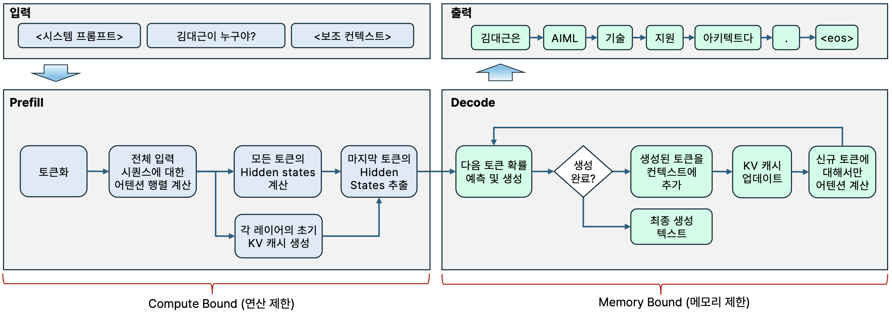
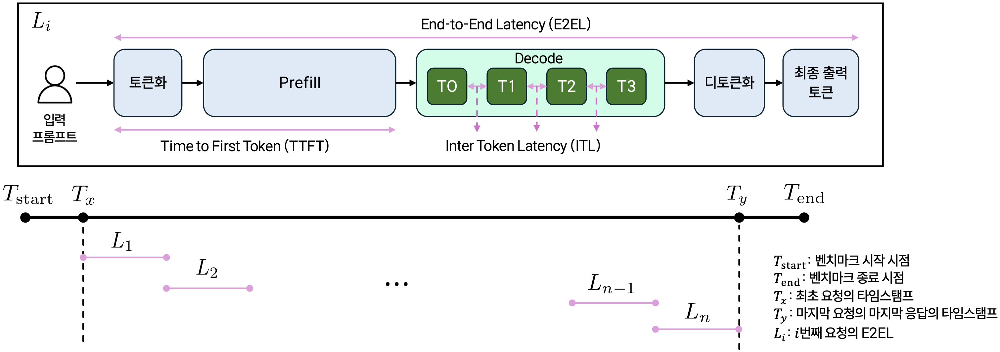
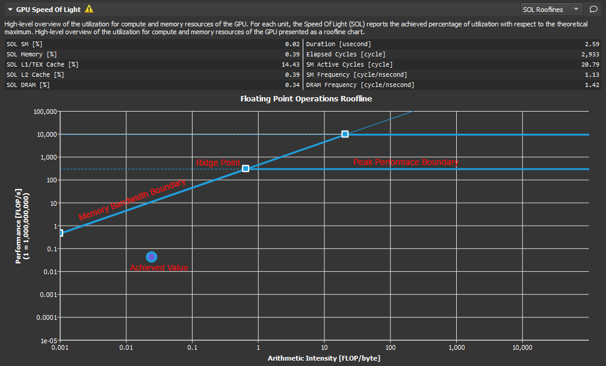
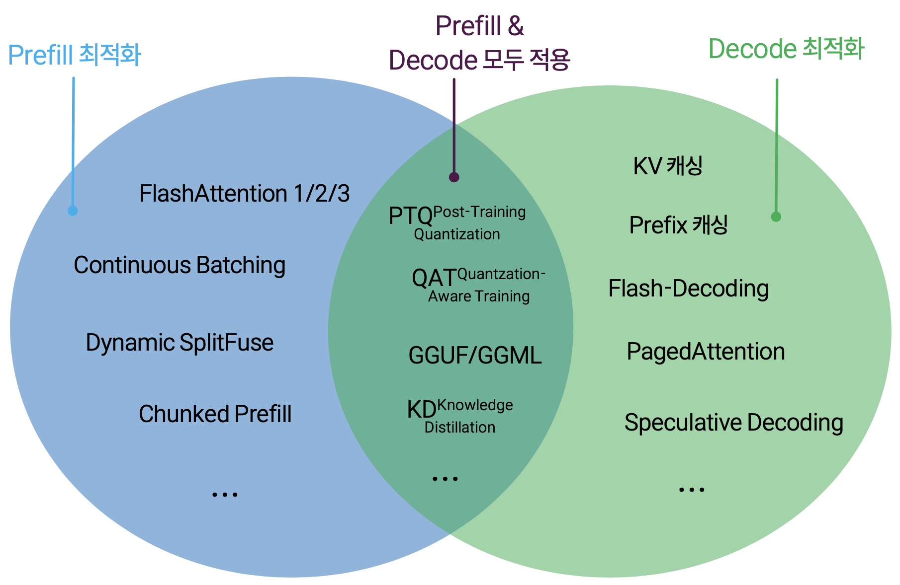
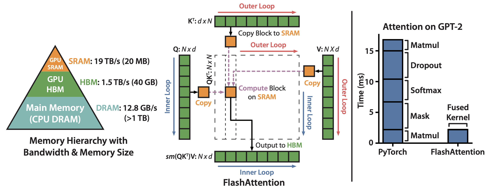
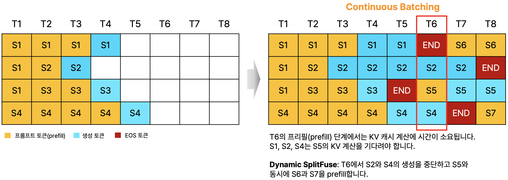
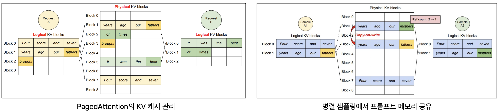
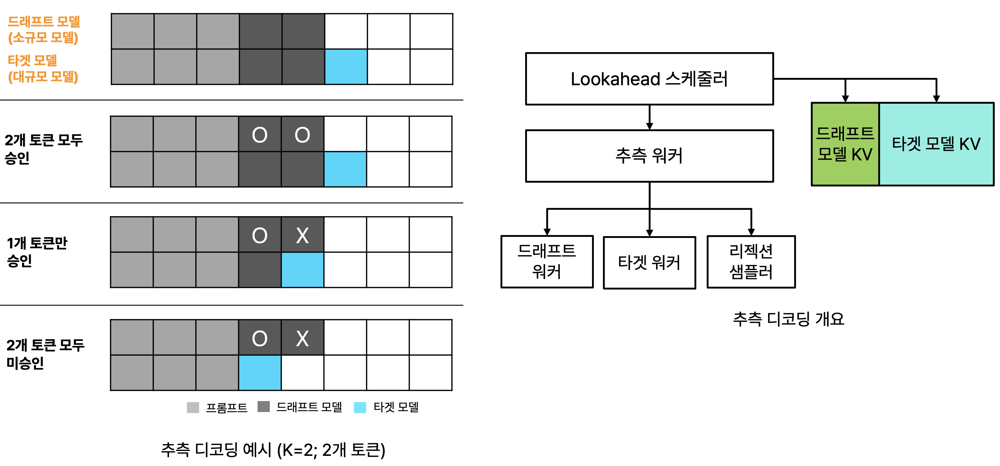
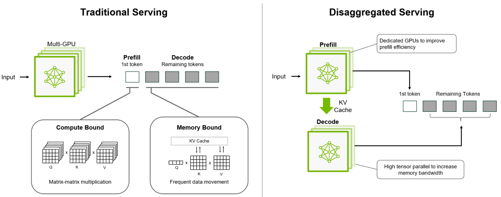
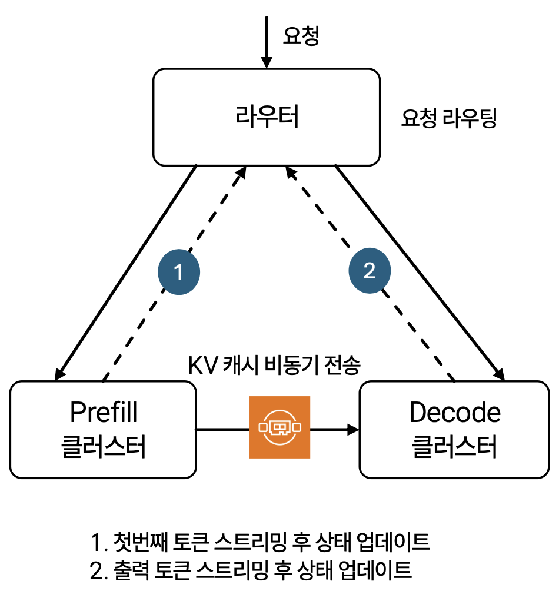

# 추론 최적화 개요 (Prefill과 Decoding에 따른 주요 기법 정리)


이미 기본적인 LLM 추론 최적화에 대해 파악하고 계신 분들은 본 문서를 스킵해도 됩니다. MoE 모델 분산 서빙을 이해하기 위해서 필요한 선수 지식입니다.


트랜스포머 디코딩 기반 모델(주로 LLM/VLM)의 추론 과정은 본질적으로 두 개의 상이한 연산 특성을 가진 단계로 구성됩니다. Prefill 단계는 입력 프롬프트의 모든 토큰을 병렬로 처리하며 compute-bound 특성을 보이는 반면, decoding 단계는 토큰을 순차적으로 생성하면서 memory-bandwidth-bound (이하 memory-bound) 특성을 나타냅니다. Prefill은 행렬-행렬 연산으로 GPU의 계산 능력을 포화시키는 반면, decode는 행렬-벡터 연산으로 GPU 계산 유닛을 충분히 활용하지 못하고 메모리 대역폭에 의해 제한됩니다.


직관적인 이해를 위해 일부 용어는 번역하지 않고 원문 용어를 그대로 사용합니다. 물론 compute-bound를 연산 제한, memory-bandwidth-bound를 메모리 (대역폭) 제한이라 번역하기도 하지만 경험적으로 많은 엔터프라이즈 고객들이 이해하는 데 어려움을 겪었습니다.&#x20;


<figure><figcaption>
LLM의 Prefill 단계와 Decode 단계
</figcaption></figure>

#### 주요 추론 성능 지표

<figure><figcaption>
레이턴시 및 벤치마크 타임스탬프 
</figcaption></figure>

**레이턴시 (Latency)**

* **Time to First Token (TTFT)**: 요청을 보낸 후 첫 토큰을 생성하는 데 걸리는 시간입니다. 모델이 응답을 시작하는 속도를 반영합니다.
* **Time per Output Token (TPOT)**: 각 후속 토큰(보통 첫 토큰은 제외)을 생성하는 평균 시간 간격입니다. TPOT가 낮을수록 모델이 토큰을 더 빨리 생성할 수 있어 초당 토큰 수가 증가합니다.&#x20;

$$
\text{TPOT} = \frac{\text{E2EL – TTFT}}{\text{Total Output Tokens} - 1}
$$

* **Inter-Token Latency (ITL)**: 연속된 두 토큰 사이의 실제 시간 간격입니다. 단일 요청에서는 ITL=TPOT이지만, 여러 요청에 걸쳐서는 평균을 내는 방식이 다릅니다.

$$
\text{단일  요청: Average ITL} = \text{TPOT}
$$

$$
\text{여러 요청: Average ITL} = \frac{\text{Sum of all ITLs across Requests}}{\text{Total Output Tokens across Requests}}
$$

* **End-to-End Latency (E2EL)**: 요청을 보낸 시점부터 사용자 측에서 최종 토큰을 받을 때까지의 시간입니다.&#x20;


TPOT은 request-weighted 방식으로 생성된 토큰 수와 관계 없이 요청별 평균 지연을 확인하는 데 유용하고, ITL은 token-weighted 방식으로 많은 토큰을 생성하는 요청에 가중치를 주므로 스트리밍 품질 평가에 유용합니다.

\
요청 A: T1 ─(100ms)→ T2 ─(100ms)→ T3\
ITL\_A: \[100, 100]\
TPOT\_A = 200 / 2 = 100 ms\
\
요청 B: T1 ─(50ms)→ T2 ─(50ms)→ T3 ─(50ms)→ T4 ─(50ms)→ T5\
ITL\_B: \[50, 50, 50, 50]\
TPOT\_B = 200 / 4 = 50 ms\
\
Average TPOT = (TPOT\_A + TPOT\_B) / 2 = (100 + 50) / 2 = 75 ms\
All ITLs = concat(ITL\_A, ITL\_B) = \[100, 100, 50, 50, 50, 50] # 요청 B가 더 많은 토큰을 생성해서 더 큰 영향을 줌\
Average ITL = (100 + 100 + 50 + 50 + 50 + 50) / 6 = 400 / 6 = 66.67 ms\
\
LLM마다 서로 다른 토크나이저를 사용하기에 다른 LLM간의 토큰 생성 속도를 직접 비교하면 오해의 소지가 생길 수 있습니다.  벤치마킹 시에는 토큰화 방식을 같이 확인하기 바랍니다.&#x20;


**스루풋 (Throughput)**

* **Requests per Second (RPS)**: LLM이 1초 동안 성공적으로 완료할 수 있는 요청 수를 나타냅니다. RPS에 영향을 미치는 요인은 주로 프롬프트의 복잡성 및 길이 / 모델 크기 및 하드웨어 사양 / 최적화 기법 (예: 배칭, 캐싱, 추론 엔진) / 요청당 레이턴시 입니다.
* **Tokens per Second (TPS)**: 추론 워크로드의 성격에 따라 입력 TPS와 출력 TPS을 따로 보기도 합니다. TPS에 영향을 미치는 요인은 주로 배치 크기 / KV 캐시 효율성과 메모리 사용량 /프롬프트 길이 및 생성 길이 / GPU 메모리 대역폭 및 연산 활용률 입니다.

## 1. 루프라인 차트/Prefill/Decode

***

### **1.1. 루프라인 차트 (Roofline chart)**

루프라인 차트Roofline chart는 HPC와 파운데이션 모델 최적화 분야에서 compute-bound와 memory-bound 성능 병목을 시각적으로 분석하기 위해 사용하는 성능 시각화 도구입니다. 이 차트를 활용하여 특정 연산이 compute-bound인지, 아니면 memory-bound인지를 직관적으로 판단합니다.

<figure><figcaption>
루프라인 차트 (출처: <a href="https://docs.nvidia.com/nsight-compute/ProfilingGuide/index.html">https://docs.nvidia.com/nsight-compute/ProfilingGuide/index.html</a>)
</figcaption></figure>

#### 차트 설명

* x축: 연산 집약도Arthmetic(또는 Operational) Intensity (OI)
  * 한 번의 메모리 접근(바이트)당 수행되는 부동소수점 연산(FLOP)의 수로 메모리 접근 1번당 얼마나 많은 계산을 하는가를 나타냅니다.
  * 단위: FLOPs / Byte
* y축: 성능Performance
  * 실제 측정된 또는 이론적 연산 속도
  * 단위: FLOPs/sec (예: TFLOPS)
* Memory Bandwidth Roof (왼쪽 기울어진 선)
  * 경사선 형태로 표시되며, 시스템의 메모리 대역폭(GB/s)에 의해 제한되는 성능 상한선입니다.
  * 이 선은 OI가 낮은 경우 즉, 메모리 접근이 많고 계산량이 적은 상황에서 병목이 되는 영역을 나타냅니다. 이 선보다 아래라면 메모리 접근량이 많고 연산량이 상대적으로 적은 memory-bound 상태입니다.
  * 파운데이션 모델 추론의 Decoding 단계에 해당하며, 성능 향상을 위해서는 메모리 재사용률 증가, 캐시 최적화, 데이터 압축 등이 필요합니다.
* Compute Roof (오른쪽 수평선)
  * 시스템의 최대 연산 성능(FLOPs/sec)으로 표시됩니다.
  * OI가 충분히 높아 메모리 병목을 넘어서면, 이제는 연산 유닛(FPU, Tensor Core 등)의 처리 능력이 한계가 됩니다. 이 선보다 아래라면 연산량이 상대적으로 많은 compute-bound 상태입니다.
  * 파운데이션 모델 추론의 Prefill 단계에 해당하며 성능 향상을 위해서는 벡터화, 병렬화, mixed precision, 커널 퓨전 등 연산 효율 개선이 핵심입니다.
* Ridge point
  * 두 선이 만나는 점을 ridge point(능선점)이라고 하며, 이 점이 메모리 대역폭 병목에서 연산 병목으로 전환되는 경계입니다.
* Achieved Value
  * 분석하려는 연산(예: GEMM, matmul, softmax 등)을 측정하여 해당 연산의 OI(x값)와 성능(FLOPs/sec, y값)을 구한 뒤 그래프 상에 점으로 표시합니다. 이 점과 Memory Bandwidth Roof/Compute Roof의 상대 위치로, 어느 병목이 주요 성능 제약인지 직관적으로 파악할 수 있습니다.

### **1.2. Prefill 단계: Compute-bound 구간**

LLM 추론 과정에서 prefill 단계는 전체 입력 프롬프트를 한 번에 처리하는 초기 구간입니다. 이때 모델은 입력 시퀀스의 모든 토큰에 대해 어텐션과 피드포워드feed-forward 연산을 동시에 수행하므로, 거대한 행렬곱(GEMMGeneral Matrix Multiplication)과 텐서 연산이 집중적으로 발생합니다. GPU의 텐서 코어나 매트릭스 연산 유닛이 거의 포화 상태로 작동하며, 메모리 접근보다는 연산 수행 속도가 전체 처리량을 결정하는 compute-bound 특성을 보입니다.

성능을 향상시키려면 더 많은 연산을 같은 시간에 효율적으로 수행하여 루프라인 차트 수평선에 가깝게 끌어올리는 것으로, 커널 최적화와 연산 효율 증대가 핵심 전략입니다. 대표적인 기법은 큰 어텐션 행렬을 작은 타일로 나누어 빠른 SRAM에서 계산하는 연산 효율을 높이는 FlashAttention, 여러 연산을 하나의 GPU 커널로 통합해 오버헤드를 감소하는 커널 퓨전kernel fusion, 양자화quantization, FP16/BF16 혼합 정밀도mixed precision 등이 있습니다.

### **1.3. Decoding 단계: Memory-bound 구간**

Decoding 단계는 LLM이 응답을 생성할 때 수행되는 반복적인 토큰 생성 구간입니다. 이 단계에서는 매번 하나의 토큰만 처리하기 때문에 행렬곱 연산의 규모는 작지만, 각 토큰마다 과거 모든 토큰의 Key/Value 캐시(KV cache)를 다시 읽어와야 합니다. 즉, 연산량은 상대적으로 적지만 메모리 접근량이 매우 크기 때문에, GP의 연산 유닛이 아니라 메모리 대역폭이 성능을 제한하게 됩니다. 이 때문에 decoding은 전형적인 memory-bound 영역으로 분류됩니다.

성능 향상은 더 많은 연산을 하는 것이 아니라, 같은 대역폭으로 더 많은 데이터를 재사용하거나 더 적은 데이터를 읽는 것을 통해 이뤄집니다. 대표적인 기법은 KV 캐시 압축/양자화, 블록 기반 메모리 관리 기법인 PagedAttention, 중복된 프롬프트를 부분적으로 재사용하는 Prefix Caching, 작은 보조 모델이 여러 토큰을 예측하고, 큰 모델이 한 번에 검증함으로써 디코딩 단계를 줄이는 추측 디코딩speculative decoding이 있습니다.

#### 컴퓨트 바운드 vs 메모리 바운드 비교 요약

| 구분                    | Memory-bound           | Compute-bound            |
| --------------------- | ---------------------- | ------------------------ |
| 특징                    | 메모리 대역폭이 병목            | 연산 장치의 계산력이 병목           |
| Operational Intensity | 낮음 (메모리 접근이 많음)        | 높음 (연산이 집중적임)            |
| 루프라인 차트 상 위치          | 경사선(왼쪽) 아래             | 수평선(오른쪽) 아래              |
| 개선 방향                 | 데이터 재사용, 캐시 최적화, IO 감소 | 병렬화, 커널 퓨전, quantization |
| LLM 예시                | KV-cache 접근, 디코딩 단계    | 프리필 단계의 matmul, FFN 연산   |

## 2. Prefill/Decoding 단계 최적화

***

<figure><figcaption></figcaption></figure>

### 2.1. Prefill 단계 최적화: Compute-Bound 극복

#### 연산 특성과 병목 지점

Prefill 단계에서는 입력 시퀀스의 모든 토큰이 트랜스포머의 각 레이어를 동시에 통과하며, 이 과정에서 self-attention 메커니즘은 $$O(N²)$$ 복잡도의 행렬 곱셈을 수행합니다. 여기서 $$N$$은 시퀀스 길이를 의미하며, 이러한 연산은 본질적으로 계산 집약적입니다. GPU의 텐서 코어Tensor Core와 같은 고성능 연산 유닛을 최대한 활용하는 것이 핵심이지만, 시퀀스 길이가 증가함에 따라 메모리 요구량이 급격히 증가하는 문제가 발생합니다.

#### FlashAttention: IO-Aware 최적화

FlashAttention은 GPU의 메모리 계층 구조를 명시적으로 고려하여 HBMHigh Bandwidth Memory과 SRAM 간의 데이터 이동을 최소화하는 IO-aware 알고리즘입니다. 전통적인 attention 구현은 중간 결과인 어텐션 점수 행렬 $$QK^T$$ ($$N×N$$)을 HBM에 기록하고 다시 읽어오는 과정에서 상당한 오버헤드가 발생합니다. Softmax, dropout, masking과 같은 element-wise 연산들이 행렬 곱셈보다 더 많은 시간을 소비하는 memory-bound 특성을 보입니다.

FlashAttention은 이를 작은 타일tile 단위로 나누고, 온칩 SRAM(shared memory / register 수준) 내부에서 가능한 연산과 축적accumulation을 수행하여, 중간 결과를 HBM에 저장하지 않는 방식으로 메모리 접근을 최소화합니다.

구조적으로는 Q, K, V를 블록 단위로 분할해 작게 읽고 처리하며, softmax 계산에서도 online scaling(누적 최대값 갱신 방식 등)을 사용해 블록 경계를 넘나드는 정규화 문제를 안정적으로 처리합니다.  이 방식 덕분에 FlashAttention은 동일한 정확성을 유지하면서도, 종래 어텐션 구현 대비 2-4배 수준의 실제 속도 개선을 보고했으며, BERT-large (길이 512) 기준 15% 향상, GPT-2 (길이 1,000) 기준 3배, 장문 영역(long-range)에서도 2.4배 개선 효과를 보여 주었습니다.

하지만 FlashAttention V1은 GPU의 스레드 블록 할당 및 warp 간 커뮤니케이션, 공유 메모리 효율, 워프 점유율occupancy 측면에서 최적화 여지가 남아 있었습니다.

<figure><figcaption>
FlashAttention 개요 (출처: <a href="https://arxiv.org/pdf/2205.14135">https://arxiv.org/pdf/2205.14135</a>)
</figcaption></figure>

#### FlashAttention-2

FlashAttention-2는 V1의 한계를 보완하기 위해 워크 분할work partitioning 전략을 개선하고, 커널 내부 병렬화를 세분화한 버전입니다.

구체적으로, V1에서는 단일 헤드나 타일 단위 작업이 하나의 스레드 블록 또는 warp 수준에서만 처리되는 경우가 있어서, GPU의 자원 활용률이 낮아지는 경우가 많았습니다. FlashAttention-2는 스레드 블록 간, warp 간 작업을 재분할하여 병렬도를 더 높이고, 특히 시퀀스 길이 방향(즉, $$N$$차원)에도 분할을 도입하여 단일 어텐션 head나 타일이 여러 블록에 걸쳐 병렬 처리될 수 있게 설계했습니다.

또한, non-matmul 연산 (예: softmax 재조정, scaling 과정 등)을 최소화하거나 커널 내부에서 효율적으로 배치해 텐서 코어 중심의 연산 흐름을 보조하도록 조정하였습니다.  이 결과, FlashAttention-2는 A100 등 GPU에서 이론 최고 성능의 50–73 % 수준까지 접근하는 효율을 보였고, 기존 FlashAttention 대비 약 2배 속도 개선을 입증했습니다.

그럼에도 불구하고, FlashAttention-2는 최신 아키텍처(예: NVIDIA Hopper 계열 GPU)에서 제공하는 비동기 명령 또는 메모리 이동 가속 기능을 충분히 활용하지 못해, 일부 GPU에서는 여전히 GEMM 수준의 효율에는 미치지 못하는 경우가 있었습니다.

#### FlashAttention-3

FlashAttention-3은 특히 Hopper 아키텍처 기반 GPU (예: H100, H800 등)를 타겟으로, V2가 놓친 하드웨어 특성을 적극 활용한 최적화를 추가한 커널로 3가지 핵심 기법이 도입되었습니다.

1. **비동기 오버랩(Asynchrony overlap)**: 텐서 코어 및 TMA(Tensor Memory Accelerator) 같은 하드웨어 유닛을 비동기적으로 동작시키면서 데이터 이동과 연산을 겹치게 스케줄링합니다. 이로써 메모리 이동과 연산이 병목 없이 중첩될 수 있게 설계되었습니다.
2. **Blockwise Matmul-Softmax 중첩**: 블록 수준 행렬곱matmul과 softmax/재스케일 연산을 중첩interleave 수행함으로써 유휴 시간이 적도록 커널 흐름을 최적화합니다.
3. **블록 양자화 (Block Quantization) 및 incoherent 처리**: FP8 같은 저정밀 연산을 활용하되, 양자화 오류를 제어하기 위한 변형 방식incoherent processing을 도입하여 낮은 수치 오류로도 성능을 유지할 수 있게 설계되었습니다.

이런 최적화 덕분에 FlashAttention-3은 FP16 기준으로 A100 대비 1.5–2배 빠른 성능을 보이며, H100에서는 약 740 TFLOPS (약 75% 활용률)까지 도달한 실험 결과를 보고합니다. FP8 모드에서는 1.2 PFLOPS 수준까지 확장 가능한 성능을 보이며, 동일 정밀도 대비 2.6배 낮은 수치 오차numerical error를 기록했다는 결과도 제시합니다.

#### Mixed Precision과 텐서 코어 활용

Prefill이 compute-bound라는 특성을 활용하면 정밀도를 낮추어 처리량을 증가시킬 수 있습니다. FP16 또는 BF16을 사용하면 FP32 대비 약 2배, INT8을 사용하면 4배의 이론적 성능 향상이 가능합니다. 특히 NVIDIA의 텐서 코어는 FP16/BF16 행렬 곱셈에 특화되어 있어, 이를 활용하면 일반 CUDA 코어 대비 약 8배의 처리량을 달성할 수 있습니다.

양자화 기법도 유사한 맥락에서 활용됩니다. Post-training quantization(PTQ)은 추가 학습 없이 가중치를 INT8 또는 INT4로 양자화하여 메모리 사용량과 데이터 이동량을 줄이면서, compute-bound 영역에서는 낮은 정밀도 연산의 높은 처리량을 활용합니다. 양자화에 대한 자세한 내용은 3장을 참조하기 바랍니다.

#### Batch 최적화: Continuous Batching 및 Dynamic SplitFuse

Prefill 단계의 병렬성을 극대화하기 위해 여러 요청의 prefill을 큰 배치로 묶어 처리하는 것이 효과적입니다. Prefill은 대규모 정적 워크로드를 선호하며, 여러 프롬프트를 배치로 처리하여 GPU 활용률을 극대화할 수 있습니다. 이는 행렬 차원을 증가시켜 GPU의 compute 유닛을 더 효율적으로 포화시킵니다.

그러나 서로 다른 길이의 프롬프트를 배치로 묶을 때 padding으로 인한 비효율이 발생할 수 있습니다. 이를 해결하기 위해 dynamic batching 또는 continuous batching 기법이 사용되며, 이는 유사한 길이의 요청들을 동적으로 그룹화하여 padding 오버헤드를 최소화합니다. 다만, continuous batching은 요청별 프롬프트 길이 차이로 인해 배치 내 연산량이 크게 불균형해지는 문제가 있습니다. 긴 프롬프트가 포함된 요청은 다른 요청들의 진행을 지연시키고, 배치 단위로 처리 크기가 달라지면서 GPU 활용 효율이 떨어집니다.&#x20;

DeepSpeed-FastGen에서 제안된 Dynamic SplitFuse는 단순히 요청을 합치는 수준이 아니라 프롬프트 자체를 청크 단위로 분할split하고, 이 청크들을 디코딩 연산과 유연하게 융합fuse하여 배치 크기를 일정하게 유지하도록 설계되었습니다. 즉, continuous batching이 “요청 단위의 동적 배치 구성”이라면, Dynamic SplitFuse는 “요청 내부 구조까지 동적으로 재조합”하는 보다 세밀한 접근입니다. 이로써 긴 프롬프트로 인한 지연 편차를 줄이면서도 GPU의 연산 파이프라인이 꾸준히 채워지도록 유지할 수 있습니다. 구체적으로 Dynamic SplitFuse는 다음 두 축의 동작을 결합합니다:

1. 긴 프롬프트는 그대로 한 번에 처리하는 대신 작은 청크 단위로 분할하여 여러 forward pass에 나눠 넣고, 최종 청크에서만 실제 토큰 생성을 수행합니다. 이렇게 하면 각 forward pass의 크기가 극히 커지지 않아 지연이나 불균형이 커지지 않습니다.&#x20;
2. 프롬프트가 짧아서 전체 배치 목표 크기(target token budget)에 못 미치는 경우, 프롬프트 일부를 “미리 생성 토큰 영역과 섞어서(compose)” 배치 규모를 채우도록 조정합니다. 즉, 프롬프트 + 생성 토큰을 하나의 forward pass로 묶어 크기를 맞추는 방식입니다.&#x20;

이 방식의 주요 이득은 forward pass 크기의 일관성을 유지하면서도 긴 프롬프트 처리에서 발생하는 latency 급증을 완화할 수 있다는 점입니다. 실제 실험에서는 이를 통해 vLLM 대비 최대 2.3배 유효 처리량 증가, 평균 2배 레이턴시 감소, 그리고 토큰 단위 P95 레이턴시에서 최대 3.7배 개선을 보고한 바 있습니다. &#x20;

<figure><figcaption></figcaption></figure>

#### Chunked Prefill과 Decode-Maximal Batching

Chunked prefill은 큰 prefill을 관리 가능한 작은 chunk로 분할하여 decode 요청과 함께 배치 처리할 수 있도록 합니다. 이는 prefill이 decode를 blocking하는 문제를 완화하며, GPU가 항상 유용한 작업을 수행하도록 보장합니다. [Sarathi 논문에서 제안된 decode-maximal batching](https://arxiv.org/abs/2308.16369)은 decode 요청을 우선적으로 스케줄링하고, 남은 계산 예산으로 chunked prefill을 처리하는 전략입니다.

이 기법은 prefill과 decode 간의 균형을 맞추면서도 전체 GPU 활용률을 향상시킵니다. 특히 실시간 서비스 환경에서 사용자가 기다리고 있는 decode 요청의 지연을 최소화하면서도, 새로 들어오는 긴 프롬프트를 효율적으로 처리할 수 있습니다.

### 2.2. Decoding 단계 최적화: Memory-Bound 극복

#### 연산 특성과 병목 지점

Decoding 단계는 auto-regressive하게 한 번에 하나의 토큰을 생성하며, 각 단계에서 모든 이전 토큰의 key와 value 정보에 접근해야 합니다. 이는 행렬-벡터 연산으로, GPU의 계산 능력을 충분히 활용하지 못합니다. 데이터(가중치, key, value, activation)가 메모리에서 GPU로 전송되는 속도가 latency를 지배하며, 실제 계산 속도는 부차적입니다.

작은 배치 크기에서 행렬 곱셈의 한 차원(배치 크기와 시퀀스의 토큰 수로 정의됨)이 작을 때, 연산은 메모리 대역폭에 제약을 받습니다. 이러한 상황에서 GPU의 peak compute 성능보다 peak memory bandwidth가 실제 처리량의 더 나은 예측 지표가 됩니다.

#### KV 캐싱

KV 캐싱은 decode 단계의 가장 기본적이면서도 필수적인 최적화입니다. Self-attention 계산에서 각 생성된 토큰이 모든 이전 토큰의 key와 value 텐서에 의존하므로, 이들을 GPU 메모리에 캐싱하여 재계산을 방지합니다. 일반적으로 모델의 각 레이어마다 별도의 KV 캐시가 유지되며, 이는 중복 계산을 대폭 감소시켜 decoding 과정을 가속화합니다.

하지만 KV 캐시는 메모리 소비의 주요 원인이기도 합니다. 긴 컨텍스트나 큰 배치 크기를 다룰 때 KV 캐시가 가중치보다 더 많은 메모리를 소비할 수 있습니다.

#### PagedAttention: 메모리 단편화 해결

KV 캐시는 종종 최대 입력(지원되는 시퀀스 길이)을 수용하기 위해 정적으로 "과잉 할당"됩니다. 입력 크기를 예측할 수 없기 때문에, 최대 시퀀스 길이가 2048이라면 실제 입력과 생성된 출력의 크기에 관계없이 2048 크기의 메모리가 예약됩니다. 이 공간은 연속적으로 할당되며, 대부분이 사용되지 않아 메모리 낭비와 단편화가 발생합니다.

PagedAttention은 운영체제의 가상 메모리 페이징paging 개념을 LLM 서빙에 적용한 기법입니다. KV 캐시를 관리 가능한 비연속적 메모리 블록으로 분할하여, 운영체제가 메모리 페이지를 관리하듯이 동적으로 할당하고 해제합니다. 각 시퀀스의 KV cache는 여러 블록(페이지)에 걸쳐 저장될 수 있으며, 블록 테이블을 통해 논리적 블록과 물리적 블록을 매핑합니다.

이 접근 방식은 메모리 활용률을 크게 향상시킵니다. 전통적인 연속 할당에서 약 20-40%의 메모리가 단편화로 낭비되는 반면, PagedAttention은 90% 이상의 메모리 활용률을 달성할 수 있습니다. 이는 더 큰 배치 크기를 가능하게 하여 전체 처리량을 향상시킵니다.

<figure><figcaption>
PagedAttention 개요 (출처: <a href="https://arxiv.org/abs/2309.06180">https://arxiv.org/abs/2309.06180</a>)
</figcaption></figure>

#### Speculative Decoding (추측 디코딩): 병렬성 도입

추측 디코딩Speculative decoding은 decoding의 순차적 특성을 극복하기 위해 병렬성을 도입하는 혁신적인 패러다임입니다. LLM의 auto-regressive 디코딩은 순차적 계산을 요구하며, 각 단계가 이전 단계의 출력에 의존합니다. 이는 각 단계마다 전체 모델 파라미터를 HBM에서 가속기의 캐시로 이동해야 하는 병목을 만듭니다.

기본 아이디어는 작고 빠른 드래프트draft 모델을 사용하여 여러 토큰을 투기적으로 생성한 후, 대규모 타겟target 모델로 이들을 병렬로 검증하는 것입니다. 검증된 토큰들은 유지되고, 거부된 첫 토큰 이후는 폐기됩니다. 드래프트 모델이 토큰을 하나씩 제안하고, 타겟 모델은 단일 forward pass에서 이 토큰들을 검증하며, 올바른 토큰은 확인하고 잘못된 토큰은 수정합니다.

이 방법의 핵심 장점은 드래프트 모델의 예측이 틀려도 타겟 모델의 출력 분포는 변하지 않는다는 점입니다. 즉, 품질 저하 없이 속도만 향상됩니다. 실제로 적절한 드래프트 모델과 acceptance rate를 확보하면 수 배의 속도 향상이 가능합니다.

<figure><figcaption></figcaption></figure>

#### Medusa: Self-Speculative Decoding

Medusa는 별도의 draft 모델을 유지해야 하는 복잡성을 제거하고, LLM에 여러 개의 디코딩 head를 추가하여 여러 후속 토큰을 병렬로 예측하는 효율적인 방법입니다. 원본 모델은 그대로 유지되고 새로운 head만 fine-tuning되는 parameter-efficient 방식입니다.

Medusa는 tree-based attention 메커니즘을 사용하여 여러 후보 continuation을 구성하고 각 decoding 단계에서 동시에 검증합니다. 각 head는 지정된 위치에 대해 여러 개의 top prediction을 생성하고, 이 예측들은 후보로 조립되어 tree-based attention 메커니즘을 통해 병렬로 처리됩니다.

Medusa-1은 기존 모델에 head만 추가하여 fine-tuning하며 generation 품질 저하 없이 2.2배 이상의 속도 향상을 달성합니다. Medusa-2는 backbone LLM과 함께 fine-tuning되어 더 나은 예측 정확도와 2.3-3.6배의 속도 향상을 제공하지만, backbone 모델의 능력을 보존하는 특별한 훈련 방법이 필요합니다.

### 2.3. Prefill과 Decode를 물리적으로 분리하는 Disaggregated Serving

최근 가장 주목받는 최적화 기법인 prefill 단계와 decode 단계를 아예 별도의 하드웨어 클러스터에서 처리합니다. 이렇게 하면 두 단계 간의 리소스 간섭interference을 줄이고, 각 단계에 최적화된 하드웨어/설정/병렬화 전략을 독립적으로 적용할 수 있게 됩니다.

<figure><figcaption>
Disaggregated Serving (출처: <a href="https://developer.nvidia.com/blog/introducing-nvidia-dynamo-a-low-latency-distributed-inference-framework-for-scaling-reasoning-ai-models">NVIDIA 블로그</a>)
</figcaption></figure>

<figure><figcaption>
AWS의 Disaggregated Serving
</figcaption></figure>

Disaggregation의 핵심 컨셉은 각 단계의 고유한 병목을 독립적으로 최적화하는 것입니다. Prefill 서버는 프롬프트 배치를 병렬로 처리하고 KV cache를 생성합니다. Decode 서버는 캐싱된 KV state를 사용하여 효율적으로 토큰을 생성하며, 작은 배치 크기에서도 작동합니다. 이를 통해 더 높은 처리량(효율적인 배치와 병렬화), 더 낮은 지연(최적화된 메모리 접근과 전문 하드웨어), 그리고 파이프라인 병렬화(한 요청의 prefill을 다른 요청의 decode와 중첩)가 가능합니다.

### 2.4. Disaggregated Serving의 난제: **KV Transfer와 통신 오버헤드**

Disaggregated serving의 주요 난제는 prefill과 decode 인스턴스 간의 KV 캐시 전송입니다. KV 캐시 크기는 시퀀스 길이, 레이어 수, hidden dimension에 비례하여 상당히 클 수 있습니다. Disaggregated serving은 특히 latency가 중요한 애플리케이션에서 강력하지만, KV캐시의 효율적인 전송을 위해 RDMARemote Direct Memory Access 기반 통신, 압축 기법, 그리고 전송 스케줄링 최적화가 필요합니다. 또한, vLLM과 AWS NeuronX Distributed(NxD)를 비롯한 다수 LLM 서빙 프레임워크가 실험적/제한적 지원 단계이기 때문에 프로덕션 적용을 고려한다면 충분한 테스트가 필요합니다.&#x20;

vLLM의 경우 KV connector 개념을 도입하여, prefill 쪽에서는 KV 블록을 외부 버퍼로 저장하고, decode 쪽에서는 이를 받아 해당 인스턴스의 KV 블록에 주입inject하는 흐름을 구현합니다. 이 전송은 비동기적으로 이루어지며, 모델의 주 연산과 겹치지 않도록 병렬화/스트리밍 방식으로 설계됩니다.

세부 동작은 다음과 같습니다:

*   **Prefill 측면:** 각 어텐 레이어의 계산이 끝나면, 해당 토큰의 K/V 블록을 CPU 메모리(또는 외부 버퍼)로 저장합니다.

    그 저장 작업은 메인 forward 연산과는 별도의 스레드/스트림을 사용하여 병렬로 수행됩니다.

    저장이 완료되면, 즉시 리모드 decode 인스턴스로 스트리밍 전송을 시작합니다.
* **Decode 측면:** 프록시를 통해 해당 요청의 prefill 인스턴스 주소를 알고, KV connector는 스트리밍 채널을 여러 개 열어 KV 캐시를 fetch(가져오기)합니다. 가져온 KV 블록은 임시 GPU 버퍼로 복사된 뒤, 로컬 vLLM의 KV 캐시 블록에 injection됩니다 (별도의 쓰레드/스트림에서). 이 주입이 끝나면 요청이 디코딩 스케줄러에 반환되고, 디코딩이 계속 진행됩니다.

NVIDIA Dynamo는 NIXL(NVIDIA InfiniBand eXtensions for LLMs)을 활용하여 GPU 간 직접 통신을 구현하며, zero-copy transfer로 latency를 최소화합니다. 외부 캐시 서버 역할을 하는 LMCache는 decoupled buffering을 통해 작은 page 크기를 유지하면서도 효율적인 KV 전송을 가능하게 합니다.

## 3. 양자화 (Quantization)

***

양자화는 높은 정밀도의 값(일반적으로 32비트 또는 16비트 부동 소수점)을 더 낮은 비트 표현(예: 8비트, 4비트, 심지어 1비트)으로 변환하는 과정으로 모델의 가중치weights와 활성화 값activations의 정밀도를 낮추어 메모리 사용량을 줄이고  계산 효율성을 향상시킵니다. 양자화는 Prefill 단계(더 긴 컨텍스트의 처리)와 Decode 단계(토큰 생성 속도 향상 및 메모리 대역폭 요구 사항 감소)에 모두 적용 가능합니다.

### 3.1. 양자화의 주요 유형

* **Quantization-Aware Training (QAT)**: 모델 훈련 과정에서 양자화의 영향을 미리 고려하여 양자화된 모델의 성능을 최적화하는 기법입니다. 훈련 중에 가중치와 활성화에 가짜 양자화fake quantization를 적용하여 양자화로 인\
  한 정보 손실을 시뮬레이션하고, 역전파를 통해 모델이 이러한 손실에 적응하도록 학습시킵니다. Post-Training Quantization (PTQ) 대비 높은 정확도를 보이지만 전체 훈련 과정을 다시 수행해야 하므로 계산 비용이 크고, 대규모 언어 모델의 경우 막대한 리소스가 필요하다는 단점이 있어 실제 적용에는 제약이 따릅니다.
* **Post-Training Quantization (PTQ)**: 사전 훈련된 모델의 가중치를 양자화하는 방식으로, 추가 훈련 없이 적용할 수 있어 간단하고 효율적입니다.&#x20;
  *   **Weight-Only Quantization**: 모델의 가중치만을 정수나 저비트 부동소수점으로 양자화하는 가장 기본적이고 널리 쓰이는 PTQ 방법입니다. 훈련이 완료된 모델의 가중치를 일정한 스케일 인자scale factor와 제로포인트zero-point를 사용해 정수 범위(예: INT4, INT8 등)로 근사하고, 활성화activation는 여전히 부동소수점으로 유지한 채 연산 시점에 dequantization을 수행합니다. 이 접근은 재학습이 전혀 필요하지 않고, 메모리 사용량을 즉시 줄이면서도 정확도 손실이 비교적 작기 때문에 LLM, 음성 인식, 이미지 모델 등 다양한 분야에서 활용됩니다.

      대표적인 기법으로는 GPTQ, AWQ, SpQR, SqueezeLLM, 그리고 엔지니어링 구현체인 GGUF/GGML 등이 있습니다. 이들은 공통적으로 “정확도 손실을 최소화하기 위한 보정(reconstruction) 전략”을 취하지만, 계산 비용과 정밀도 보존 정도에서 차이를 보입니다. 예컨대 GPTQ는 Hessian 근사치를 사용해 오차를 최소화하고, AWQ는 활성화 분포 기반으로 민감 채널을 보호하며, GGUF는 하드웨어 효율과 범용성을 우선시합니다.

      Weight-Only 방식의 장점은 간단한 구현과 높은 호환성이지만, 활성화까지 정수화되지 않아 실제 연산의 완전한 INT 연산 가속이 어렵다는 점이 한계로 지적됩니다.
  *   **Weight-Activation Quantization**: 가중치뿐 아니라 추론 시 입력되는 활성화 값까지 함께 양자화하는 방식입니다. 이 접근의 핵심 목표는 모델 전체 연산을 정수 연산(INT 연산)으로 변환해 메모리와 연산량을 동시에 줄이고 하드웨어 가속기(텐서 코어, NPU 등)의 INT 연산을 직접 활용하는 것입니다.

      그러나 활성화는 입력 데이터에 따라 분포가 크게 변하고, 일부 채널에 극단적인 이상치outlier가 존재해 정밀도 손실이 커질 위험이 있습니다. 이를 해결하기 위해 여러 연구에서는 채널별 정규화, 이상치 스무딩, 스케일 재분배(rescaling) 같은 전략을 도입했습니다. 대표적인 기법으로 LLM.int8(), SmoothQuant, RPTQ, OmniQuant 등이 있습니다.

      예를 들어 LLM.int8()은 대부분의 채널은 INT8로 처리하되, 소수의 이상치 채널만 FP16 경로로 분리하여 정확도를 유지합니다. SmoothQuant은 활성화의 이상치를 가중치로 이전시켜 분포를 부드럽게 만들어 양자화 후 오차를 줄입니다. 이러한 방식은 Weight-Only보다 훨씬 높은 효율을 얻을 수 있으나, 구현 난이도가 높고 하드웨어별 튜닝이 필요합니다. 즉, 완전한 정수 연산 파이프라인을 구축할 수 있는 대신, 모델 구조 및 커널 복잡도가 증가하는 방식이라 할 수 있습니다.
  * **KV Cache Quantization**: KV 캐시를 양자화하는 방식으로, 특히 긴 문맥(long-context) 추론이나 대화형 응용(incremental decoding) 에서 중요한 메모리 병목 문제를 해결하기 위해 등장했습니다. 최근 연구에서는 채널별Channel-wise 양자화와 토큰별Token-wise 양자화를 조합해 정밀도 손실을 최소화하는 방법이 제안되고 있습니다. \
    대표적인 예로 KVQuant, KIVI, WKVQuant 등이 있으며, 이들은 Key에는 채널별 양자화를, Value에는 토큰별 양자화를 적용하여 긴 문맥에서도 어텐션 품질을 유지하면서 메모리 효율을 극대화합니다. 이 방식은 Weight-Only 양자화나 Weight-Activation 양자화보다 더 최근에 부상한 영역으로, LLM 추론에서 context window 확장과 latency 개선을 동시에 달성할 수 있는 실용적 방법으로 평가됩니다.

| 분류                    | 주요 대상        | 대표 기법                   | 장점                       | 한계                 |
| --------------------- | ------------ | ----------------------- | ------------------------ | ------------------ |
| **Weight-Only**       | 모델 파라미터(가중치) | GPTQ, AWQ, GGUF         | 구현 간단, 메모리 절감, 정확도 손실 작음 | 완전한 INT 연산 불가      |
| **Weight-Activation** | 가중치 + 활성화    | LLM.int8(), SmoothQuant | 완전한 INT 추론 가능, 속도 향상     | 이상치 처리·커널 복잡도 증가   |
| **KV Cache**          | Key/Value 캐시 | KVQuant, KIVI           | 긴 문맥 지원, 메모리 절감          | 품질 유지 위한 정교한 보정 필요 |

### 3.2. PTQ 주요 양자화 알고리즘

#### GPTQ (Generative Pre-trained Transformer Quantization)

GPTQ는 2023년 Frantar 등에 의해 ICLR 2023에서 발표된 양자화 기법으로, 대규모 언어 모델을 위한 레이어별 일괄One-shot 가중치 양자화 방법입니다. GPTQ는 Optimal Brain Quantizer(OBQ) 방법에서 영감을 받았으며, 가중치를 양자화할 때 발생하는 오류를 최소화하기 위해 2차 정보(second-order information)를 활용합니다. 이 방법은 각 가중치를 양자화한 후 나머지 가중치를 조정하여 양자화 오류를 보정하는 방식으로 작동합니다.

**핵심 원리**

1. **임의 순서 양자화(Arbitrary Order Quantization)**: 가중치를 양자화하는 순서가 큰 영향을 미치지 않는다는 관찰을 바탕으로, 모든 행에 동일한 순서를 적용하여 계산 효율성을 향상시킵니다.
2. **지연 배치 업데이트(Lazy Batch Updates)**: 헤시안Hessian 행렬의 업데이트를 배치 단위로 수행하여 연산 오버헤드를 줄입니다.
3. **콜레스키 리포뮬레이션(Cholesky Reformulation)**: 수치적으로 안정적인 방법으로 헤시안 역행렬을 계산하여 정확도를 향상시킵니다.

**주요 특징**

* 가중치 전용 양자화 기법으로, 활성화 값은 양자화하지 않습니다.
* 2비트, 3비트, 4비트 양자화를 지원하며, 특히 4비트에서 우수한 성능을 보입니다.
* 교정 데이터셋calibration dataset을 사용하여 양자화 품질을 최적화합니다.

**장점**

* 낮은 비트 정밀도(3-4비트)에서도 원본 모델과 거의 동일한 성능을 유지합니다.
* 단일 GPU에서 대규모 모델 실행이 가능해집니다. (예: OPT-175B를 단일 A100 GPU에서 실행)
* 구현이 잘 되어 있어 다양한 플랫폼(Hugging Face, AutoGPTQ 등)에서 사용할 수 있습니다

**단점**

* 교정 데이터셋의 품질에 따라 성능이 크게 달라질 수 있습니다.
* 대용량 모델의 경우 양자화 과정 자체가 상당한 계산 리소스를 필요로 합니다.
* 주로 GPU 추론에 최적화되어 있어 CPU 기반 추론에는 적합하지 않을 수 있습니다.

#### AWQ (Activation-aware Weight Quantization)

AWQ는 2023년 MIT-Han Lab에서 개발한 가중치 양자화 기법으로, 2024년 MLSys에서 Best Paper Award를 수상했습니다. AWQ는 "모든 가중치가 동등하게 중요하지 않다"는 가설에 기반하여 활성화 값의 분포를 고려해 중요한 가중치를 보호하는 방식으로 양자화의 정확도를 향상시킵니다.

**핵심 원리**

1. **중요 가중치 식별**: 활성화 값의 분포를 분석하여 모델 출력에 큰 영향을 미치는 중요한 가중치 채널을 식별합니다.
2. **채널별 스케일링**: 중요한 가중치 채널을 스케일링하여 양자화 과정에서 보호합니다. 이는 혼합 정밀도 양자화 없이도 정확도를 유지할 수 있게 합니다.
3. **스케일링 매개변수 검색**: 양자화 오류를 최소화하는 최적의 스케일링 매개변수를 검색합니다.

**주요 특징**

* 전체 가중치의 약 1%만 보호해도 양자화 오류를 크게 줄일 수 있음을 증명했습니다.
* 가중치 전용 양자화로, 주로 3비트 및 4비트 정밀도를 사용합니다.
* Backpropagation이나 재구성 과정 없이 양자화가 가능하며, 교정 데이터셋에 과적합되지 않고 모델의 일반화 능력을 잘 보존합니다.

**장점:**

* 다양한 도메인과 모달리티에서 우수한 일반화 성능을 보이며, GPTQ보다 빠른 추론 속도를 제공하는 경우가 많습니다.
* 지시 조정instruction-tuned 모델과 다중 모달 모델에 특히 효과적입니다..
* TinyChat과 같은 효율적인 추론 프레임워크와 함께 사용하여 모바일 GPU를 포함한 다양한 디바이스에서 실행 가능합니다.

**단점:**

* GPTQ보다 구현이 복잡하며, 최적의 성능을 위해서는 특별한 커널이 필요합니다.
* 일부 최신 아키텍처(예: Gemma, DeciLM)는 아직 완전히 지원되지 않을 수 있습니다.

#### LLM.int8()

LLM.int8()은 2022년 NeurIPS에서 발표된 8비트 양자화 기법으로, 대규모 언어 모델의 추론 시 메모리 사용량을 절반으로 줄이면서도 성능 저하 없이 실행할 수 있게 하는 혁신적인 방법입니다. 이 기법은 "emergent features"라는 개념을 도입하여 특정 차원에서 발생하는 outlier를 별도로 처리하는 혼합 정밀도 분해 방식을 사용합니다.

**핵심 원리**

1. **Emergent Features 식별**: 모델 크기가 6.7B를 넘어서면서 나타나는 특정 차원의 극값 활성 화를 식별합니다.
2. 혼**합 정밀도 분해**: 행렬 곱셈을 두 부분으로 분해하여 극값 차원은 16비트로, 나머지는 8비트로 처리합니다.
3. **벡터별 양자화**: 각 입력 벡터에 대해 개별적으로 양자화 매개변수를 계산하여 정확도를 향상시킵니다.

**주요 특징**

* 가중치와 활성화 모두를 8비트로 양자화하는 동적 양자화 기법으로 0.1% 미만의 outlier 차원만 16비트로 유지하여 성능을 보존합니다.
* 추론 시에만 적용되며, 사전 교정이나 재훈련이 필요하지 않습니다.

**장점**

* 메모리 사용량을 약 50% 줄이면서도 성능 저하가 거의 없습니다.
* 175B 매개변수 모델을 단일 A100 GPU에서 실행 가능하게 합니다.
* Hugging Face Transformers와 완전히 통합되어 사용이 간편합니다.

**단점**

* 6.7B 매개변수 이하의 소규모 모델에서는 성능 저하가 발생할 수 있습니다.
* 동적 양자화로 인해 추론 속도가 다소 느려질 수 있습니다.
* GPU 메모리는 절약되지만 연산량은 크게 줄어들지 않습니다.

#### **SmoothQuant**

SmoothQuant는 2023년 MIT에서 개발한 기법으로 가중치와 활성화를 모두 8비트로 양자화하면서도 높은 정확도를 유지하는 방법입니다. 이 기법은 LLM에서 활성화 양자화를 어렵게 만드는 “활성화 이상치” 문제를 재스케일링을 통해 가중치 측으로 이관(migrate)하는 방법입니다. 레이어별로 채널 스케일을 도입해 활성화의 범위를 부드럽게 만들고(smoothing), 그만큼 가중치에 역보정 스케일을 곱해 전체 선형변환의 의미를 보존합니다. 결과적으로 W8A8(가중치·활성화 모두 INT8)로의 PTQ를 일반화 가능하게 만들어, 다양한 트랜스포머 아키텍처에서 정확도 손실 없이 메모리 절감과 속도 향상을 동시에 달성했습니다.&#x20;

**핵심 원리**

1. 스무딩Smoothing 변환: 활성화와 가중치 간의 양자화 난이도를 재분배하기 위해 스케일링 변환을 적용합니다.
2. 채널별 스케일링: 각 채널에 대해 개별적으로 스무딩 팩터를 적용하여 활성화의 극값을 완화합니다.
3. 수학적 동등성 보장: 변환 후에도 원본 모델과 수학적으로 동일한 출력을 보장합니다.

**주요 특징**

* W8A8 (가중치 8비트, 활성화 8비트) 양자화를 지원합니다.
* 교정 데이터셋을 사용하여 최적의 스무딩 매개변수를 찾습니다.
* 다양한 모델 아키텍처(OPT, BLOOM, GLM 등)에서 검증되었습니다.

**장점**

* 가중치와 활성화를 모두 양자화하여 최대 메모리 절약 효과를 제공합니다.
* 하드웨어 가속기에서 효율적인 추론이 가능하고 대부분의 Transformer 기반 모델에 적용 가능합니다.

**단점**

* 교정 데이터셋의 품질에 민감하며, 도메인 불일치 시 성능이 저하될 수 있습니다.
* 스무딩 매개변수 튜닝이 필요하여 구현이 복잡합니다.

| 구분                  | GPTQ                                                                                  | AWQ                                                    | LLM.int8()                                             | SmoothQuant                                                   |
| ------------------- | ------------------------------------------------------------------------------------- | ------------------------------------------------------ | ------------------------------------------------------ | ------------------------------------------------------------- |
| **주요 범주**           | Weight-Only PTQ                                                                       | Weight-Only PTQ                                        | Weight + Activation PTQ                                | Weight + Activation PTQ                                       |
| **핵심 아이디어**         | 2차 근사(Hessian 역행렬) 기반의 최소 오차 보정 양자화                                                   | 활성화 분포로부터 가중치 민감도 평가 및 중요 채널 보호                        | 벡터 단위 정규화와 이상치 채널 분리로 INT8 안정화                         | 채널별 스케일 재분배로 활성화 이상치를 가중치 쪽으로 이관                              |
| **주요 단계**           | ① Calibration data로 입력 공분산 추정 → ② Layer-wise block quantization → ③ L2 reconstruction | ① Activation 통계 수집 → ② 민감 채널 스케일 조정 → ③ 나머지 가중치 균일 양자화 | ① Outlier 채널 탐색 → ② 주요 경로 INT8 연산, outlier는 FP16 별도 경로 | ① 채널 스케일링 인자 계산 → ② Activation smoothing → ③ Weight rescaling |
| **이상치(Outlier) 대응** | 블록별 보정으로 간접 완화                                                                        | 활성화 기반 민감도 스케일 조정                                      | 이상치 채널을 별도 FP16 경로로 분리                                 | 이상치를 가중치 재스케일로 평활화                                            |
| **대표 장점**           | 고정밀 유지, 수학적 정당성 높음                                                                    | 구현 단순, 실제 추론 하드웨어 효율 높음                                | 정확도 유지하며 INT8 전체 연산 실현                                 | W8A8 완전 양자화 가능, 범용성 높음                                        |
| **주요 한계**           | 연산량·메모리 요구 높음, 느린 변환                                                                  | 일부 과적합 채널 판단 오차 가능                                     | outlier 분리 경로로 커널 복잡성 증가                               | 채널별 스케일 조정이 하드웨어별로 상이                                         |
| **하드웨어 적합도**        | CPU / GPU (비최적화)                                                                      | GPU / NPU (고효율 커널)                                     | GPU (INT8 TensorCore)                                  | GPU (INT8 TensorCore / FP8 유사)                                |

### 3.3. GGML/GGUF

GGMLGeorgi Gerganov's Machine Learning/GGUFGeorgi Gerganov's Unified Format은 Georgi Gerganov가 개발한 PTQ 기반 엔지니어링 스택으로, 양자화 알고리즘(GPTQ, AWQ 등)과 달리 파일 포맷과 런타임 수준의 최적화 표준에 초점을 맞춘 기술입니다. GGML은 C/C++ 기반의 초경량 텐서 연산 엔진으로, GPU·CPU·모바일 등 다양한 환경에서 메모리 접근 비용과 디바이스 의존성을 최소화하도록 설계되었습니다. 이 엔진은 CUDA, Metal, OpenCL 등의 백엔드를 지원하며, 훈련이 완료된 모델을 재훈련 없이 바로 2\~8비트 정수(blockwise integer) 형태로 변환하고 실행할 수 있습니다. 후속 규격인 GGUF는 GGML 런타임이 읽을 수 있는 통합 모델 저장 포맷으로, 각 텐서 블록의 스케일, 오프셋, 정밀도 등 메타데이터를 함께 기록하여 Q2\_K, Q4\_0, Q5\_K 등 다양한 양자화 형식을 하나의 통합 구조로 관리할 수 있게 합니다. 이처럼 GGUF는 오차 보정보다는 경량화, 호환성, 배포 효율성에 중점을 둔 실용적인 포맷으로, 로컬 PC나 모바일 디바이스에서도 대형 언어 모델을 구동할 수 있도록 하는 핵심 기반 기술로 자리 잡았습니다.


GGUF는 더 구조화된 메타데이터 저장 방식을 제공하고, 양자화 옵션이 다양하며, llama.cpp와 같은 최신 추론 엔진과의 호환성이 더 뛰어납니다. 반면 GGML은 이전 형식으로 메타데이터 지원이 제한적이고 구형 추론 엔진에서만 완전히 지원됩니다. 대부분의 최신 LLM 애플리케이션은 GGUF 포맷을 선호하며, 많은 GGML 모델들이 GGUF로 전환되고 있습니다.


기술적 관점에서 GGUF/GGML은 Weight-Only Quantization 계열에 속하며, 주로 per-block affine quantization(a × x + b) 방식을 사용합니다. 각 블록은 독립적인 스케일링 인자와 최소·최대값을 이용해 정규화되어 저장되고, 추론 시점에는 빠른 dequantization 과정을 통해 float16 수준의 근사 연산을 수행합니다. 활성화(activation)는 부동소수점 상태로 유지되며, 일부 연산은 내부적으로 FP16으로 변환되어 처리됩니다. 이러한 접근은 Hessian 기반의 정밀한 오차 보정이나 채널별 민감도 추정과 같은 고급 알고리즘은 포함하지 않지만, 모델 크기 약 34배 축소, CPU에서도 가능한 4비트 추론, 플랫폼 독립적 배포 가능성이라는 실질적 강점을 제공합니다. 결과적으로 GGUF/GGML은 양자화 알고리즘이라기보다 양자화 모델의 배포·실행을 위한 표준화된 런타임 인프라(Deployment-Level Quantization Runtime)로 발전한 사례이며, 현재 Llama, Mistral, Gemma, Phi 등 주요 오픈소스 모델의 오프라인 추론 환경에서 사실상 산업 표준으로 널리 사용되고 있습니다.

**핵심 원리**

1. **블록 단위 처리**: 가중치를 32개 값의 블록으로 처리하며, 각 블록마다 스케일 팩터(delta)를 계산합니다.
2. **효율적인 메모리 패킹**: 양자화된 가중치를 효율적으로 패킹하여 메모리 사용량을 최소화합니다.
3. **CPU 최적화**: CPU에서의 효율적인 추론을 위한 다양한 최적화 기법을 적용합니다.

**주요 특징**

* 다양한 양자화 수준 지원: Q4\_0, Q4\_1, Q5\_0, Q5\_1, Q8\_0 등 다수 옵션 제공 (숫자는 비트 수)
* CPU에서 LLM을 실행하면서도 일부 레이어를 GPU로 오프로드할 수 있는 유연성을 제공합니다.
* llama.cpp 라이브러리와 통합되어 사용하기 쉬운 인터페이스를 제공합니다.

**장점**

* CPU 기반 추론에 최적화되어 있어 GPU 없이도 LLM을 실행할 수 있습니다.
* Apple Silicon(Mac)을 포함한 다양한 하드웨어에서 작동하고 메모리 효율적이며 추론 속도가 빠릅니다.
* 사용자 친화적인 많은 GUI 도구(Text Generation WebUI, LM Studio 등)와 통합되어 있습니다.

**단점**

* GPU에서 실행할 때 GPTQ나 AWQ보다 느릴 수 있습니다.
* 교차 플랫폼 호환성 문제가 발생할 수 있으며, 최적의 성능을 위해 C/C++ 코드 컴파일이 필요한 경우가 있습니다.

## 4. vLLM V1의 최적화 기법

***

vLLM은 초기부터 PagedAttention 기반의 효율적인 KV 캐시 관리, continuous batching, 다양한 병렬화 지원(텐서, 파이프라인, 데이터, 전문가 병렬) 등을 통해 LLM 추론/서빙 성능을 끌어올리는 서빙 시스템으로 발전해 왔습니다. 그러나 기술 발전 속도가 워낙 빠르다 보니 다음과 같은 난제들이 누적되어 왔습니다.

* 모델 실행 속도가 빨라지면서 CPU 쪽 오버헤드(스케줄러, 입력 전처리/후처리, API 서버)가 전체 지연 및 처리량 병목이 되는 경우가 많아졌음
* 다양한 최적화 기법(prefix 캐싱,  chunked prefill,추측 디코딩 등)이 개별적으로 도입되었으나, 서로 간의 통합 및 유지가 복잡해졌음
* 병렬화 구조(특히 텐서 병렬 + 스케줄러 구조)에서 비대칭 설계가 복잡도를 야기
* 멀티모달 입력, prefix caching 등에서 오버헤드 또는 비호환 문제가 발생하는 경우가 있었음

vLLM V1은 2025년 1월에 알파 버전으로 출시된 서빙 아키텍처로, 이러한 배경 하에 vLLM 팀은 V0 기반 핵심 코드(모델 구현, GPU 커널, 분산 제어 등)를 계승하면서, 스케줄러, KV 캐시 관리자, 워커/샘플러, API 서버 등의 핵심 실행 루프를 새롭게 설계하는 형태로 vLLM V1을 내놓았습니다. vLLM 측에 따르면 V0 대비 1.7배의 스루풋throughput 향상을 달성하면서도 복잡도를 대폭 줄였습니다.

#### 통합 스케줄러

V1의 중앙집중식 스케줄러는 모든 요청에 대한 전역 최적화를 수행합니다. V0의 virtual engine 방식에서는 각 engine이 독립적으로 스케줄링하여 전역 최적화가 불가능했지만, V1은 단일 스케줄러가 전체 요청을 조망하여 최적의 배치를 구성합니다.

vLLM V1은 간단하면서도 유연한 중앙집중식 스케줄러를 도입합니다. 사용자로부터 주어진 프롬프트 토큰과 모델이 생성한 출력 토큰을 균일하게 취급함으로써 전통적인 prefill과 decode 단계의 구분을 제거합니다. 스케줄링 결정은 `{request_id: num_tokens}`와 같은 간단한 딕셔너리로 표현되며, 이는 각 단계에서 각 요청에 대해 처리할 토큰 수를 지정합니다.&#x20;

<figure><figcaption>
vLLM V1 스케줄링 (출처: <a href="https://blog.vllm.ai/2025/01/27/v1-alpha-release.html">https://blog.vllm.ai/2025/01/27/v1-alpha-release.html</a>)
</figcaption></figure>

#### Prefill 최적화: Chunked Prefill

vLLM V1에서는 chunked prefill이 기본적으로 활성화되어 있습니다. 스케줄러는 decode 요청을 우선적으로 배치에 추가한 후, 남은 token budget(`max_num_batched_tokens`)으로 prefill 요청을 처리합니다. 마지막 prefill 요청이 budget을 초과하면 자동으로 chunk로 분할됩니다.

사용자는 `max_num_batched_tokens` 파라미터를 조정하여 워크로드 특성에 맞게 튜닝할 수 있습니다. 작은 값(512-1024)은 ITL을 우선시하고, 큰 값(4096-8192)은 TTFTTime To First Token를 우선시합니다. 이는 prefill과 decode 간의 균형을 유연하게 조정할 수 있게 합니다.

#### Decoding 최적화: Zero-Overhead Prefix Caching

vLLM V1의 가장 혁신적인 기능 중 하나는 zero-overhead prefix caching입니다. V0에서는 prefix를 식별하기 위해 매 요청마다 hash 계산이 필요했으며, 이는 TTFT의 10-20%를 차지했습니다. V1은 radix tree를 사용하여 토큰 시퀀스를 자동으로 추적하므로 hash 계산이 불필요합니다.

Request가 추가될 때 토큰 시퀀스를 tree에서 traverse하면서 매칭되는 토큰 수를 자동으로 계산합니다. 이미 cache된 prefix는 재사용되며, 이 과정의 오버헤드는 0.1ms 미만으로 측정됩니다. 반복적인 시스템 프롬프트를 사용하는 애플리케이션에서 특히 효과적입니다.

#### Continuous Batching

vLLM의 continuous batching은 고정된 batch size를 기다리지 않고 동적으로 요청을 그룹화합니다. 요청이 완료되면 즉시 배치에서 제거되고 새로운 요청이 추가됩니다. 이는 GPU가 항상 유용한 작업을 수행하도록 보장하며, 평균 대기 시간을 크게 줄입니다.

V1의 busy synchronous loop는 이를 더욱 효율화합니다. Scheduler는 매 iteration마다 실행 가능한 작업이 있는지 확인하고, 있다면 즉시 execution을 시작합니다. 이는 scheduling overhead를 최소화하며, V0 대비 약 90%의 overhead 감소를 달성합니다.

#### 여러 형태의 Speculative Decoding 지원

vLLM은 여러 형태의 speculative decoding을 지원합니다. 드래프트 모델 방식에서는 작은 모델을 사용하여 토큰을 제안하고 큰 모델로 검증합니다. N-gram matching 방식은 프롬프트 내의 n-gram을 매칭하여 후보 토큰을 생성합니다. Medusa 방식은 추가 decoding head를 사용하여 여러 토큰을 동시에 예측합니다.

사용자는 `speculative_model` 파라미터로 draft 모델을 지정하고, `num_speculative_tokens`로 예측할 토큰 수를 설정할 수 있습니다. 추측 디코딩은 특히 낮은 QPS(queries per second) 환경에서 상당한 성능 이점을 제공하며, 적절한 드래프트 모델 선택 시 최대 2.8배의 속도 향상이 가능합니다.

#### MoE 특화 전문가 병렬화

vLLM V1은 MoEMixture-of-Experts 모델을 위한 전용 최적화를 제공하며 DeepEP와 PPLX 두 가지 dispatch/combine kernel을 지원합니다. DeepEP는 NVIDIA NVSHMEM을 기반으로 하며 멀티 노드 환경에서 우수한 성능을 보입니다. PPLX는 단일 노드 환경과 chunked prefill 시나리오에서 효과적입니다. Expert Placement with Load Balancing(EPLB)은 토큰 라우팅 편향으로 인한 불균형 로드를 자동으로 해결하며, 과도하게 활성화되는 전문가를 여러 GPU에 복제합니다.

#### 데이터 병렬화와 Disaggregated Prefill

vLLM V1은 데이터 병렬화를 통해 모델을 여러 replica로 복제하여 독립적인 요청 배치를 처리할 수 있습니다. 특히 MoE 모델에서는 어텐션 레이어를 DP로 복제하고 전문가 레이어는 EP로 분산시키는 하이브리드 접근법을 사용합니다. 이는 DeepSeek V2/V3/R1과 같은 Multi-head Latent Attention 모델에서 KV cache 중복을 방지하여 메모리 효율을 극대화합니다.

Disaggregated prefill은 실험적 기능으로 제공되며, LMCache와 NIXL 통합을 통해 prefill과 decode instance 간 효율적인 KV cache 전송을 가능하게 합니다. Prefill instance는 `kv_producer`로, decode instance는 `kv_consumer`로 설정되며, router가 요청을 적절히 분배합니다. 이는 TTFT와 ITL을 독립적으로 제어할 수 있게 하여 latency-critical 애플리케이션에 적합합니다.

#### 향상된 멀티모달 지원

vLLM V1은 텍스트와 이미지를 통합 처리하는 멀티모달 아키텍처를 제공합니다. 비전 인코더를 별도의 CUDA stream에서 실행하여 LLM forward pass와 오버랩시킬 수 있습니다. 이미지는 해시hash를 통해 캐싱되며, 동일한 이미지가 여러 요청에서 재사용될 때 인코딩을 생략합니다.

텍스트-이미지 interleaving이 완전히 지원되어 복잡한 멀티모달 시퀀스를 처리할 수 있습니다. Qwen-VL, InternVL, Phi-3-Vision과 같은 최신 비전-언어 모델뿐만 아니라 오디오 모델(Gemma Audio, Ultravox)와 비디오 모델도 네이티브하게 지원됩니다.

## References

#### Prefill 최적화

* Dao, T., et al. (2022). "[FlashAttention: Fast and Memory-Efficient Exact Attention with IO-Awareness.](https://arxiv.org/abs/2205.14135)" NeurIPS 2022. arXiv:2205.14135.
* Dao, T. (2024). "[FlashAttention-2: Faster Attention with Better Parallelism and Work Partitioning.](https://arxiv.org/abs/2307.08691)" ICLR 2024. arXiv:2307.08691.
* Dao, T., et al. (2024). "[FlashAttention-3: Fast and Accurate Attention with Asynchrony and Low-precision.](https://arxiv.org/abs/2407.08608)" NeurIPS 2024. arXiv:2407.08608.

#### Decoding 최적화

* Kwon, W., et al. (2023). "[Efficient Memory Management for Large Language Model Serving with PagedAttention.](https://arxiv.org/abs/2309.06180)" SOSP. arXiv:2309.06180.
* Shazeer, N. (2019). "[Fast Transformer Decoding: One Write-Head is All You Need.](https://arxiv.org/abs/1911.02150)" arXiv:1911.02150.
* Ye, Z., et al. (2025). "[FlashInfer: Accelerating Self-Attentions for LLM Serving.](https://www.arxiv.org/abs/2501.01005)" arXiv:2501.01005.

#### Speculative Decoding

* Leviathan, Y., et al. (2023). "[Fast Inference from Transformers via Speculative Decoding.](https://arxiv.org/abs/2211.17192)" ICML 2023. arXiv:2211.17192.
* Cai, T., et al. (2024). "[Medusa: Simple LLM Inference Acceleration Framework with Multiple Decoding Heads.](https://arxiv.org/abs/2401.10774)" ICML 2024. arXiv:2401.10774.
* Fu, Y., et al. (2024). "[Break the Sequential Dependency of LLM Inference Using Lookahead Decoding.](https://arxiv.org/abs/2402.02057)" arXiv:2402.02057.

#### Disaggregated Serving

* Zhong, Y., et al. (2024). "[DistServe: Disaggregating Prefill and Decoding for Goodput-optimized Large Language Model Serving.](https://arxiv.org/abs/2401.09670)" OSDI 2024. arXiv:2401.09670.
* Agrawal, A., et al. (2023). "[Sarathi: Efficient LLM Inference by Piggybacking Decodes with Chunked Prefills.](https://arxiv.org/abs/2308.16369)" arXiv:2308.16369.
* Ruhle, V., et al. (2025). "[POD-Attention: Unlocking Full Prefill-Decode Overlap for Faster LLM Inference.](https://arxiv.org/abs/2410.18038)" ASPLOS 2025. arXiv:2410.18038.
* vLLM Team. (2025). "[Disaggregated Prefilling.](https://docs.vllm.ai/en/stable/features/disagg_prefill.html)" vLLM Documentation (2025).
* vLLM Team. (2025). "[vLLM V1: A Major Architectural Upgrade.](https://blog.vllm.ai/2025/01/27/v1-alpha-release.html)" vLLM Blog (2025).
* Elmeleegy, A., et al. (2025). "[NVIDIA Dynamo, A Low-Latency Distributed Inference Framework for Scaling Reasoning AI Models](https://developer.nvidia.com/blog/introducing-nvidia-dynamo-a-low-latency-distributed-inference-framework-for-scaling-reasoning-ai-models)." NVIDIA Blog (2025).&#x20;

#### 양자화

* Zhu, X., et al. (2023). [A Survey on Model Compression for Large Language Models](https://arxiv.org/pdf/2308.07633). arXiv:2308.07633.
* Frantar, E., et al. (2023). [GPTQ: Accurate Post-Training Quantization for Generative Pre-trained Transformers](https://arxiv.org/abs/2210.17323). ICLR 2023. arXiv:2210.17323.
* Lin, J., et al. (2023). [AWQ: Activation-aware Weight Quantization for LLM Compression and Acceleration](https://arxiv.org/abs/2306.00978). MLSys 2024. arXiv:2306.00978.
* Ma, S., et al. (2024). [The Era of 1-bit LLMs: All Large Language Models are in 1.58 Bits](https://arxiv.org/abs/2402.17764). arXiv:2402.17764.
* Xiao, G., et al. (2022). [SmoothQuant: Accurate and Efficient Post-Training Quantization for Large Language Models](https://arxiv.org/abs/2211.10438). arXiv:2211.10438.
* Dettmers, T., et al. (2022). [LLM.int8(): 8-bit Matrix Multiplication for Transformers at Scale](https://arxiv.org/abs/2208.07339). NeurIPS 2022. arXiv:2208.07339.
* Labonne, M. (2024). [Quantize Llama models with GGUF and llama.cpp](https://towardsdatascience.com/quantize-llama-models-with-ggml-and-llama-cpp-3612dfbcc172/). Towards Data Science.
* Grootendorst, M. (2023). [Which Quantization Method is Right for You? (GPTQ vs. GGUF vs. AWQ)](https://newsletter.maartengrootendorst.com/p/which-quantization-method-is-right). \
  Exploring Language Models Blog.

