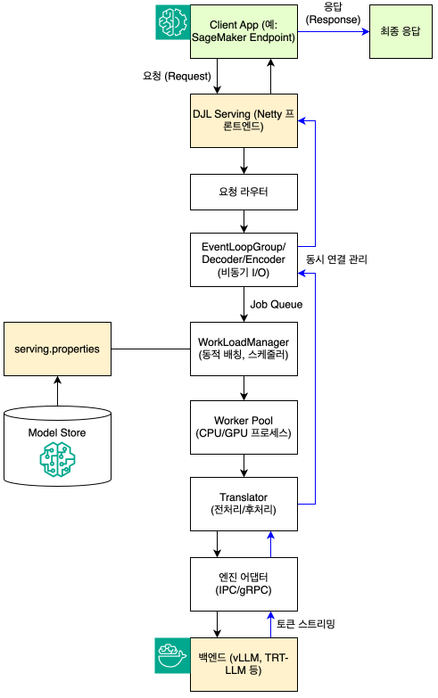

# SageMaker Large Model Inference (LMI)를 활용한 모델 서빙 및 최적화 가이드

대규모 언어/파운데이션 모델의 추론 환경은 종래 머신 러닝 모델 배포 이상의 복합적 고려가 필요합니다. 모델의 크기가 수십억\~수천억 파라미터에 이르고 트래픽의 변동성이 종래 모델 대비 많기 때문에, 추론 효율·레이턴시·메모리 관리·동시성 제어·오토스케일링·비용 효율성 등 다양한 요소가 균형 있게 통합되어야 합니다.

Amazon SageMaker의 Large Model Inference (이하 LMI) 컨테이너는 이러한 복잡성을 해결하기 위한 통합 추론 프레임워크입니다. 이 컨테이너는 DJL(Deep Java Library) Serving 위에서 동작하며, 내부적으로 vLLM, TensorRT-LLM, Transformers NeuronX 등의 백엔드를 선택적으로 결합할 수 있습니다. AWS는 이를 통해 대규모 모델의 효율적인 서빙과 확장 가능한 운영 환경을 제공합니다. 본 문서는 LMI의 동작 원리와 아키텍처 구성 요소, vLLM 및 SGLang과 같은 단독 추론 프레임워크 대비 장점, 그리고 실제 배포 방법론 및 최적화 가이드를 다룹니다.

## 1. LMI 동작 원리 및 특장점

***

### 1.1. LMI 동작 원리

LMI는 크게 3가지 계층 구조로 구성됩니다.

* **프론트엔드 레이어: DJL Serving -** HTTP/gRPC 요청을 처리하는 핵심 서버 계층
  * 요청 수신 및 라우팅: Netty 기반의 프론트엔드를 통해 들어오는 요청을 라우팅하고 백엔드 워커로 전달)
  * 모델 로드 및 관리: 디바이스별로 워커 그룹을 생성하여 CPU와 GPU에서의 병렬 실행을 지원하며 하드웨어 리소스(CPU 코어 수, GPU 디바이스 수)를 기반으로 모델이 지원할 수 있는 최대 워커 수를 자동으로 결정
  * 멀티 모델 동시 운영 및 워커 스케줄링: 트래픽 로드에 따라 워커를 동적으로 증감
* **중간 레이어: Python 엔진/MPI 엔진 -** DJL Serving이 추론 라이브러리와 통신할 수 있도록 중계하는 계층
  * 엔진은 별도의 서브프로세스로 실행되며, DJL Serving과 IPC(gRPC, Unix socket 등)로 연결
  * 요청 단위로 스레드를 분리해 병렬 추론 처리 수행
  * 텐서 병렬화와 같은 병렬 기법을 통해 다중 GPU 추론을 지원해야 하는 경우, MPI를 통한 분산 추론 활용
* **백엔드 레이어: 추론 라이브러리 런타임 -** 실제 추론이 실행되는 레이어로 필요 시 커스텀 핸들러를 통해 새로운 백엔드를 추가하는 것도 가능
  * vLLM: Token streaming, continuous batching, PagedAttention을 통한 GPU 메모리 효율 극대화
  * TensorRT-LLM: NVIDIA TensorRT 최적화를 활용한 빠른 텍스트 생성
  * Transformers NeuronX: AWS Inferentia/Trainium 전용 가속기 환경

LMI 컨테이너의 요청 처리 과정은 다음과 같은 순서로 진행됩니다.

<figure><figcaption></figcaption></figure>

1. 사용자가 SageMaker Endpoint를 통해 추론 요청을 보냅니다.
2. DJL Serving이 요청을 수신하고, 요청된 모델 이름 혹은 엔드포인트별 설정에 따라 해당 Python/MPI 엔진으로 라우팅합니다. 구체적인 워크플로는 위의 도식을 참조 바랍니다.
3. 엔진은 내부의 추론 런타임(vLLM, TensorRT-LLM 등)에 요청을 전달합니다.
4. 런타임 엔진은 토큰을 단계적으로 생성하며, 스트리밍 모드로 응답을 반환할 수 있습니다.
5. DJL Serving은 이를 JSON 혹은 gRPC Response 형태로 가공하여 최종적으로 클라이언트에 전송합니다.

이 구조 덕분에 모델 백엔드 교체나 다중 모델 병행 배포가 "플러그인형"으로 상대적으로 용이하며, AWS 관리형 인프라와 연동해 확장성(autoscaling)과 로깅·모니터링이 자동화됩니다.

### 1.2. 단독 프레임워크 대비 LMI의 장점


한줄요약: DJL Serving을 기반으로 한 대규모 추론 인프라 관리·확장 플랫폼으로 대규모 모델을 안정적이고 효율적으로 서빙하려는 기업 환경에서는 **자원 활용, 운영 자동화, 확장성, 다중 모델 관리** 측면에서 확실한 이점을 제공합니다.


#### "vLLM만 사용하면 되지 않나요?"

많은 개발자들이 "왜 vLLM을 직접 배포하지 않고 LMI를 사용해야 하는가?"라는 질문을 제기합니다. 이는 타당한 질문이지만, LMI는 단순히 vLLM을 래핑하는 것 이상의 가치를 제공합니다.

* 통합 설정 인터페이스 제공: `serving.properties` 파일이나 환경 변수를 통해 다양한 백엔드(vLLM, TensorRT-LLM, LMI-Dist, Transformers NeuronX)를 동일한 방식으로 설정할 수 있습니다. 백엔드 전환은 몇 가지 설정 변경만으로 가능하며, 각 백엔드에 특화된 복잡한 초기화 로직을 직접 작성할 필요가 없습니다.
* 프로덕션 운영에 필요한 기능 내장: DJL Serving은 모델 versioning, 멀티 모델 엔드포인트, 자동 워커 스케일링, 헬스 체크 API, 메트릭Metrics 수집 등의 기능을 기본으로 제공합니다. vLLM을 단독으로 사용할 경우 이러한 기능들을 직접 구현해야 하는 부담이 있습니다.
* SageMaker 생태계와의 긴밀한 통합: LMI 컨테이너는 SageMaker의 관리형 인프라, IAM 권한 관리, CloudWatch 로깅, 네트워크 격리, 모델 아티팩트 자동 다운로드 등의 기능과 통합됩니다. 커스텀 컨테이너를 구축하고 SageMaker와 통합하는 데 필요한 boilerplate 코드와 설정을 제거할 수 있습니다.
* 멀티 엔진 지원을 통한 유연성: DJL Serving은 동시에 여러 프레임워크의 모델을 호스팅할 수 있습니다. 예를 들어, PyTorch와 TensorFlow 모델을 같은 엔드포인트에서 서빙하거나, 복잡한 워크플로우에서 일부는 CPU에서, 일부는 GPU에서 실행하도록 구성할 수 있습니다.

#### 내장 핸들러와 커스터마이징의 균형

LMI는 지원되는 모든 백엔드에 대해 기본 추론 핸들러를 제공합니다. 이러한 핸들러는 설정 파싱, 가속기에 모델 로딩, 최적화 적용, 추론 실행을 자동으로 처리한다. 대부분의 경우 모델 ID와 몇 가지 설정만 제공하면 즉시 배포가 가능합니다.

동시에 커스터마이징이 필요한 경우를 위해 [model.py](http://model.py) 파일을 통한 커스텀 핸들러 작성도 지원합니다. 전처리, 후처리 로직을 자유롭게 구현할 수 있으며, DJL의 Python Engine은 동기 모드와 비동기 모드를 모두 지원합니다. 비동기 모드(`option.async_mode=true`)를 사용하면 `asyncio`를 활용하여 단일 요청 레벨에서 코드를 작성하면서도 여러 동시 요청을 효율적으로 처리할 수 있습니다.

#### 성능 최적화 기능

LMI v16(2025년 10월 출시)는 vLLM 0.10.2와 V1 엔진을 지원하며 V1 엔진은 단순화된 스케줄링, 제로 오버헤드 prefix caching, 효율적인 텐서 병렬 추론, `torch.compile` 및 Flash Attention 3와 같은 고급 최적화 기능을 지원합니다.

async 모드는 vLLM의 AsyncLLMEngine과 직접 통합되어 요청 처리 효율을 개선합니다. 백그라운드 루프가 지속적으로 들어오는 요청을 처리하여 이전 Rolling-Batch 구현보다 높은 처리량으로 여러 동시 요청을 처리하고 출력을 스트리밍할 수 있습니다.

### 1.3. 한계점 (멀티 노드 분산 미지원)

SageMaker 실시간 엔드포인트는 **단일 인스턴스 내에서만 병렬화**를 지원하며, 멀티 인스턴스(노드)의 분산 추론과 disaggregated serving 기능은 2025년 10월 기준으로 지원하지 않습니다.

* `initial_instance_count > 1`로 설정하면 여러 인스턴스가 생성되지만, 이는 수평 확장(horizontal scaling)이며 **각 인스턴스는 완전히 독립적인 모델 복사본**을 실행합니다
* 인스턴스 간 통신이나 모델 파티셔닝은 지원되지 않습니다

따라서, 초거대 모델의 배포가 필요할 땐 증류 기법이나 양자화를 통해 모델 크기를 줄이거나, HyperPod EKS로 배포하는 옵션을 고려해야 합니다.&#x20;


## 2. Getting Started

***

### 2.1. 모델 아티팩트 준비 및 설정

#### 모델 아티팩트 준비

LMI 배포의 첫 단계는 모델 아티팩트를 준비하는 것으로 허깅페이스에 등록된 OSS 모델은 모델 ID만 입력하여 직접 배포가 가능하며(예: `meta-llama/Llama-3.3-70B-Instruct`), 모델 아티팩트가 S3에 저장된 경우에는 S3 URI를 입력하면 됩니다. (예: `s3://my-bucket/my-model/`).

모델 아티팩트가 S3에 저장된 경우, 압축되지 않은 형태로 저장하는 것이 권장됩니다. LMI는 대규모 모델에 최적화된 빠른 다운로드 메커니즘을 구현했으며, 이는 아티팩트가 압축되지 않은 상태를 요구합니다. SageMaker의 S3DataType을 S3Prefix로, CompressionType을 None으로 설정하면 SageMaker가 모델 아티팩트를 다운로드하여 컨테이너에 마운트합니다.

#### 설정 방식: 환경 변수 vs. serving.properties&#x20;

LMI는 두 가지 설정 메커니즘을 제공한다. `serving.properties` 파일을 사용하거나 환경 변수를 통해 설정할 수 있습니다. 대부분의 사용 사례에서는 환경 변수만으로 충분하지만, 동일한 컨테이너 내에서 여러 모델을 서빙하는 경우(SageMaker Multi-Model Endpoint)에는 모델별 `serving.properties` 파일을 사용해야 합니다.

환경 변수는 전역 설정이며 단일 LMI 인스턴스 내에서 서빙되는 모든 모델에 적용됩니다. `serving.properties`와 환경 변수를 혼합할 수 있지만, 한 가지 방식을 선택하여 모든 설정을 지정하는 것이 권장됩니다. `serving.properties` 파일의 설정은 환경 변수의 설정을 오버라이드합니다.

### 2.2. SageMaker Python SDK를 통한 배포

#### 환경 변수 사용

환경 변수를 통한 설정 예시는 다음과 같습니다.

```python
import sagemaker
from sagemaker.model import Model

role = "[YOUR ROLE]"
region = "us-west-2"

# LMI 컨테이너 URI 조회
container_uri = sagemaker.image_uris.retrieve(
    framework="djl-lmi",
    version="0.32.0",
    region=region
)

# 사용할 모델 지정
HF_MODEL_ID = "meta-llama/Llama-3.3-70B-Instruct"

# Hugging Face 토큰 (선택사항)
HF_TOKEN = ""

# 환경 변수로 설정 지정
env = {
    "HF_MODEL_ID": "meta-llama/Llama-3.2-3B",
    "TENSOR_PARALLEL_DEGREE": "max",
    "OPTION_ROLLING_BATCH": "vllm",
    "OPTION_DTYPE": "bf16"
}

# 모델 생성
model = Model(
    image_uri=container_uri,
    role=role,
    env=vllm_config
)

# 엔드포인트 배포
predictor = model.deploy(
    instance_type="ml.g5.xlarge",
    initial_instance_count=1,
    endpoint_name="my-llm-endpoint",
    container_startup_health_check_timeout=1800
)
```

#### serving.properties 파일 사용

`serving.properties` 파일을 사용하는 경우, 해당 파일을 S3에 업로드하고 모델 아티팩트와 함께 배포합니다.

```
engine=Python
option.model_id=meta-llama/Llama-3.2-3B
option.tensor_parallel_degree=max
option.rolling_batch=vllm
option.dtype=bf16
option.trust_remote_code=true
```

디렉토리 구조는 다음과 같습니다.

```
my-model/
├── serving.properties
├── config.json
├── model-00001-of-00002.safetensors
└── model-00002-of-00002.safetensors ...

```

S3에 업로드 후 ModelDataSource를 통해 배포합니다.

```python
model_data = {
    "S3DataSource": {
        "S3Uri": "s3://my-bucket/my-model/",
        "S3DataType": "S3Prefix",
        "CompressionType": "None"
    }
}

model = Model(
    image_uri=container_uri,
    role=role,
    model_data=model_data
)
```

### 2.3. 추론 실행 및 스트리밍

배포된 엔드포인트는 REST API, AWS boto3 SDK 또는 SageMaker Python SDK를 통해 호출합니다. 기본적으로 JSON 직렬화를 사용합니다.

```python
response = predictor.predict({
    "inputs": "What is deep learning?",
    "parameters": {
        "max_new_tokens": 512,
        "temperature": 0.7,
        "top_p": 0.9
    }
})

```

LMI v15부터는 세 가지 API 스키마를 지원합니다. OpenAI Chat Completions API와 호환되는 Message 형식, OpenAI Completions 형식, 그리고 이전 모델과의 하위 호환성을 위한 Text Generation Inference(TGI) 스키마가 있습니다.

스트리밍 응답을 위해서는 SageMaker Runtime의 `invoke_endpoint_with_response_stream`을 사용합니다.

```python
import boto3

smr_client = boto3.client("sagemaker-runtime")

response = smr_client.invoke_endpoint_with_response_stream(
    EndpointName="my-llm-endpoint",
    Body=json.dumps({
        "inputs": "Explain quantum computing",
        "parameters": {"max_new_tokens": 256}
    }),
    ContentType="application/json"
)

for event in response["Body"]:
    print(event["PayloadPart"]["Bytes"].decode())
```

보다 자세한 내용은 [https://github.com/daekeun-ml/sm-endpoint-bmt](https://github.com/daekeun-ml/sm-endpoint-bmt) 를 참조하기 바랍니다.


## 3. 성능 튜닝 및 최적화 가이드

***

### 3.1. 베이스라인

#### 인스턴스 타입 선택 베이스라인

| 모델 크기              | 활성화 파라미터 | 권장 인스턴스          | GPU 메모리 |
| ------------------ | -------- | ---------------- | ------- |
| DeepSeek-R1 (671B) | 37B      | ml.p5en.48xlarge | 1,128GB |
| Qwen3-235B-A22B    | 22B      | ml.p5.48xlarge   | 640GB   |
| GPT-OSS-120B       | 5.1B     | ml.g6.48xlarge   | 192GB   |
| GPT-OSS-20B        | 3.6B     | ml.g6.2xlarge    | 24GB    |

#### vLLM 전용 설정

```json
{
  "OPTION_ROLLING_BATCH": "vllm",
  "OPTION_ENFORCE_EAGER": "false",
  "OPTION_DISABLE_SLIDING_WINDOW": "false",
  "OPTION_ENABLE_PREFIX_CACHING": "true",
  "OPTION_DISABLE_LOG_STATS": "false",
  "OPTION_GUIDED_DECODING_BACKEND": "outlines"
}

```

**주요 vLLM 파라미터:**

* `ENFORCE_EAGER`: CUDA 그래프 비활성화 (디버깅용)
* `ENABLE_PREFIX_CACHING`: 공통 프롬프트 캐싱으로 성능 향상
* `GUIDED_DECODING_BACKEND`: 구조화된 출력 (JSON, Regex)

#### TensorRT-LLM 전용 설정

```json
{
  "OPTION_ROLLING_BATCH": "trtllm",
  "OPTION_MAX_BEAM_WIDTH": "1",
  "OPTION_DECODING_STRATEGY": "sample",
  "OPTION_TRT_ENABLE_CHUNKED_CONTEXT": "true",
  "OPTION_PAGED_KV_CACHE": "true"
}

```

#### LMI-Dist 전용 설정

```json
{
  "OPTION_ROLLING_BATCH": "lmi-dist",
  "OPTION_SPECULATIVE_DRAFT_MODEL": "model-id",
  "OPTION_SPECULATIVE_LENGTH": "5",
  "OPTION_DRAFT_MODEL_TP_SIZE": "1"
}

```

#### DeepSpeed 전용 설정

```json
{
  "OPTION_ROLLING_BATCH": "deepspeed",
  "OPTION_TRIANGULAR_MASKING": "true",
  "OPTION_RETURN_ALL_LOGITS": "false",
  "OPTION_CHECKPOINT": "auto"
}

```

#### 베이스라인 세팅 1: vLLM 비동기 모드 (권장)

```json
{
  "HF_MODEL_ID": "meta-llama/Meta-Llama-3-8B-Instruct",
  "HF_TOKEN": "<your-huggingface-token>",
  "OPTION_ROLLING_BATCH": "vllm",
  "OPTION_DTYPE": "fp16",
  "TENSOR_PARALLEL_DEGREE": "max",
  "OPTION_MAX_MODEL_LEN": "4096",
  "OPTION_GPU_MEMORY_UTILIZATION": "0.9",
  "OPTION_MODEL_LOADING_TIMEOUT": "1800",
  "SERVING_LOAD_MODELS": "test::vLLM=/opt/ml/model"
}

```

#### 베이스라인 세팅 2: GPT-OSS-120B

```json
    "HF_MODEL_ID": "openai/gpt-oss-120b",
    "TENSOR_PARALLEL_DEGREE": "8",
    "OPTION_ROLLING_BATCH": "vllm",
    "OPTION_DTYPE": "bf16",  # 또는 fp8
    "OPTION_MAX_ROLLING_BATCH_SIZE": "64",
    "OPTION_MAX_MODEL_LEN": "8192",
    "OPTION_TRUST_REMOTE_CODE": "true"
}

```

#### 베이스라인 세팅 3: Qwen3-235B-A22B

```json
{
    "HF_MODEL_ID": "Qwen/Qwen3-235B-A22B-Instruct",
    "TENSOR_PARALLEL_DEGREE": "8",
    "OPTION_ROLLING_BATCH": "vllm",
    "OPTION_DTYPE": "fp8",  # 대규모 MoE는 FP8 권장
    "OPTION_MAX_ROLLING_BATCH_SIZE": "48",
    "OPTION_MAX_MODEL_LEN": "16384",
    "OPTION_TRUST_REMOTE_CODE": "true",
    "OPTION_GPU_MEMORY_UTILIZATION": "0.92"
}

```

#### 베이스라인 세팅 4: 양자화 모델 (AWQ)

```json
{
  "HF_MODEL_ID": "TheBloke/Llama-2-70B-AWQ",
  "OPTION_ROLLING_BATCH": "vllm",
  "OPTION_QUANTIZE": "awq",
  "TENSOR_PARALLEL_DEGREE": "4",
  "OPTION_MAX_MODEL_LEN": "4096",
  "OPTION_GPU_MEMORY_UTILIZATION": "0.95"
}

```

#### 베이스라인 세팅 5: LoRA 어댑터 활용

```json
{
  "HF_MODEL_ID": "meta-llama/Meta-Llama-3-8B",
  "OPTION_ROLLING_BATCH": "lmi-dist",
  "OPTION_ENABLE_LORA": "true",
  "OPTION_MAX_LORAS": "4",
  "OPTION_MAX_LORA_RANK": "64",
  "OPTION_LORA_EXTRA_VOCAB_SIZE": "256",
  "TENSOR_PARALLEL_DEGREE": "1"
}

```

### 3.2. 필수 설정

#### 모델 식별

| 변수                | 설명                             | 예제                                    | 필수               |
| ----------------- | ------------------------------ | ------------------------------------- | ---------------- |
| `HF_MODEL_ID`     | HuggingFace 모델 ID              | `meta-llama/Meta-Llama-3-8B-Instruct` | ✓                |
| `HF_TOKEN`        | HuggingFace 액세스 토큰 (gated 모델용) | `hf_xxxxx`                            | 조건부              |
| `OPTION_MODEL_ID` | 로컬 모델 경로 또는 S3 경로              | `s3://bucket/model/`                  | HF\_MODEL\_ID 대신 |

#### 백엔드 선택

| 변수                     | 설명        | 가능한 값                                                  | 기본값    |
| ---------------------- | --------- | ------------------------------------------------------ | ------ |
| `OPTION_ROLLING_BATCH` | 추론 백엔드 엔진 | `vllm`, `lmi-dist`, `trtllm`, `deepspeed`, `scheduler` | `vllm` |

**백엔드 선택 가이드:**

* **vLLM**: 가장 범용적, 최신 기능 지원, 커뮤니티 활발 (권장)
* **TensorRT-LLM**: NVIDIA GPU 최적화, 최고 성능, 복잡한 설정
* **LMI-Dist**: AWS 자체 엔진, vLLM 기반, LoRA 최적화
* **DeepSpeed**: Microsoft 엔진, 대규모 모델 분산 추론

### 3.3. 핵심 설정

#### 병렬화 설정

<table><thead><tr><th width="273.2578125">변수</th><th>설명</th><th>권장값</th><th>비고</th></tr></thead><tbody><tr><td><code>TENSOR_PARALLEL_DEGREE</code></td><td>텐서 병렬 처리 GPU 수</td><td><code>max</code> 또는 GPU 수</td><td><code>max</code>는 사용 가능한 모든 GPU 사용</td></tr><tr><td><code>OPTION_MAX_ROLLING_BATCH_SIZE</code></td><td>동시 처리 요청 수</td><td>32-128</td><td>높을수록 처리량 증가, 지연 증가</td></tr></tbody></table>

**텐서 병렬화 가이드:**

* 모델 크기가 단일 GPU 메모리를 초과할 때 필수
* 7B 모델: 1 GPU (FP16 기준 \~14GB)
* 13B 모델: 1-2 GPU
* 70B 모델: 4-8 GPU
* 큰 배치 사이즈보다 텐서 병렬화가 지연시간에 유리

#### 데이터 타입

| 변수             | 설명         | 가능한 값                          | 권장                       |
| -------------- | ---------- | ------------------------------ | ------------------------ |
| `OPTION_DTYPE` | 모델 가중치 정밀도 | `fp32`, `fp16`, `bf16`, `auto` | `bf16` (A100+) 또는 `fp16` |

**데이터 타입 선택:**

* **BF16**: A100, H100 등 최신 GPU에서 권장, 수치 안정성 우수
* **FP16**: V100, T4 등 구형 GPU, 메모리 효율 높음
* **FP32**: 디버깅용, 실제 서비스에서는 비권장
* **Auto**: 모델 설정에 따라 자동 선택

#### 컨텍스트 길이 설정

<table><thead><tr><th width="205.34765625">변수</th><th>설명</th><th>권장값</th><th>비고</th></tr></thead><tbody><tr><td><code>OPTION_MAX_MODEL_LEN</code></td><td>최대 시퀀스 길이 (입력+출력)</td><td><code>2048</code>-<code>8192</code></td><td>모델 한계 내에서 설정</td></tr><tr><td><code>OPTION_MAX_INPUT_LEN</code></td><td>최대 입력 토큰 수</td><td><code>MAX_MODEL_LEN - 512</code></td><td>출력 공간 확보 필요</td></tr><tr><td><code>OPTION_MAX_NEW_TOKENS</code></td><td>최대 생성 토큰 수</td><td><code>512</code>-<code>2048</code></td><td>사용 사례에 따라 조정</td></tr></tbody></table>

### 3.4. 성능 튜닝

#### 메모리 최적화

| 변수                              | 설명          | 권장값            | 영향                    |
| ------------------------------- | ----------- | -------------- | --------------------- |
| `OPTION_GPU_MEMORY_UTILIZATION` | GPU 메모리 사용률 | `0.85`-`0.95`  | 높을수록 배치 크기 증가, OOM 위험 |
| `OPTION_MAX_NUM_BATCHED_TOKENS` | 배치당 최대 토큰 수 | `8192`-`32768` | 처리량과 지연시간 트레이드오프      |
| `OPTION_MAX_NUM_SEQS`           | 동시 처리 시퀀스 수 | `256`          | 높으면 처리량 증가            |

**메모리 튜닝 전략:**

* 초기 설정: `GPU_MEMORY_UTILIZATION=0.85`로 시작
* OOM 에러 발생: 0.8로 낮추기
* 여유 메모리 있음: 0.9\~0.95로 증가하여 배치 크기 확대
* 모니터링: CloudWatch에서 GPU 메모리 사용률 확인

#### 배치 처리 최적화

<table><thead><tr><th width="265.421875">변수</th><th>설명</th><th>권장값</th><th>사용 사례</th></tr></thead><tbody><tr><td><code>OPTION_MAX_ROLLING_BATCH_PREFILL_TOKENS</code></td><td>Prefill 단계 토큰 수</td><td><code>4096</code>-<code>16384</code></td><td>긴 입력 처리 시 증가</td></tr><tr><td><code>OPTION_ENABLE_CHUNKED_PREFILL</code></td><td>청크 단위 prefill</td><td><code>true</code></td><td>긴 컨텍스트 안정성 향상</td></tr></tbody></table>

#### 스케줄링 정책

<table><thead><tr><th width="227.44921875">변수</th><th>설명</th><th>가능한 값</th><th>권장</th></tr></thead><tbody><tr><td><code>OPTION_SCHEDULER_POLICY</code></td><td>요청 스케줄링 방식</td><td><code>fcfs</code>, <code>priority</code></td><td><code>fcfs</code> (선착순)</td></tr></tbody></table>

#### KV 캐시 최적화 (vLLM)

```json
{
  "OPTION_BLOCK_SIZE": "16",
  "OPTION_SWAP_SPACE": "4",
  "OPTION_ENABLE_PREFIX_CACHING": "true"
}

```

**KV 캐시 설정:**

* `BLOCK_SIZE`: 캐시 블록 크기, 작을수록 메모리 효율 증가, 16 또는 32 권장
* `SWAP_SPACE`: CPU 메모리로 스왑 가능 공간(GB), 긴 시퀀스 처리 시 유용
* `ENABLE_PREFIX_CACHING`: 공통 프롬프트 캐싱, 반복 요청 시 성능 향상

### 3.5. 양자화 설정

#### 지원 양자화 방법

| 변수                | 설명                                   | 지원 백엔드         | 성능                 |
| ----------------- | ------------------------------------ | -------------- | ------------------ |
| `OPTION_QUANTIZE` | 양자화 방법 선택                            | -              | -                  |
| `awq`             | Activation-aware Weight Quantization | vLLM, LMI-Dist | 4-bit, 높은 정확도      |
| `gptq`            | GPT Quantization                     | vLLM           | 4-bit, 범용적         |
| `squeezellm`      | SqueezeLLM                           | vLLM           | 3-4bit, 메모리 극대화    |
| `bitsandbytes`    | BitsAndBytes                         | LMI-Dist       | 8-bit/4-bit, 쉬운 적용 |

#### 양자화 모델 사용 예제

**AWQ 양자화 (권장)**

```json
{
  "HF_MODEL_ID": "casperhansen/llama-3-70b-instruct-awq",
  "OPTION_ROLLING_BATCH": "vllm",
  "OPTION_QUANTIZE": "awq",
  "TENSOR_PARALLEL_DEGREE": "4",
  "OPTION_MAX_MODEL_LEN": "8192",
  "OPTION_GPU_MEMORY_UTILIZATION": "0.95"
}

```

**GPTQ 양자화**

```json
{
  "HF_MODEL_ID": "TheBloke/Llama-2-70B-Chat-GPTQ",
  "OPTION_ROLLING_BATCH": "vllm",
  "OPTION_QUANTIZE": "gptq",
  "TENSOR_PARALLEL_DEGREE": "4"
}

```

**BitsAndBytes (LMI-Dist)**

```json
{
  "HF_MODEL_ID": "meta-llama/Meta-Llama-3-70B-Instruct",
  "OPTION_ROLLING_BATCH": "lmi-dist",
  "OPTION_QUANTIZE": "bitsandbytes",
  "OPTION_LOAD_IN_4BIT": "true",
  "TENSOR_PARALLEL_DEGREE": "4"
}

```

#### 양자화 선택 가이드

* **최고 정확도 필요**: AWQ (4-bit)
* **범용적 사용**: GPTQ
* **최대 메모리 절감**: SqueezeLLM (3-bit)
* **간편한 적용**: BitsAndBytes
* **70B 이상 모델**: AWQ 또는 GPTQ 필수

### 3.6. LoRA 어댑터

#### LoRA 기본 설정

<table><thead><tr><th width="266.33984375">변수</th><th width="158">설명</th><th width="107.09765625">권장값</th><th>비고</th></tr></thead><tbody><tr><td><code>OPTION_ENABLE_LORA</code></td><td>LoRA 활성화</td><td><code>true</code></td><td>LMI-Dist 백엔드 권장</td></tr><tr><td><code>OPTION_MAX_LORAS</code></td><td>동시 로드 가능 LoRA 수</td><td><code>4</code>-<code>8</code></td><td>메모리에 따라 조정</td></tr><tr><td><code>OPTION_MAX_LORA_RANK</code></td><td>최대 LoRA rank</td><td><code>64</code>-<code>128</code></td><td>모든 어댑터가 이하여야 함</td></tr><tr><td><code>OPTION_LORA_EXTRA_VOCAB_SIZE</code></td><td>LoRA 추가 어휘 크기</td><td><code>256</code></td><td>새 토큰 추가 시 필요</td></tr><tr><td><code>OPTION_MAX_CPU_LORAS</code></td><td>CPU 메모리 LoRA 수</td><td><code>8</code>-<code>16</code></td><td>동적 로딩 시 유용</td></tr></tbody></table>

#### LoRA 사용 예제

**단일 LoRA 어댑터**

```json
{
  "HF_MODEL_ID": "meta-llama/Meta-Llama-3-8B",
  "OPTION_ROLLING_BATCH": "lmi-dist",
  "OPTION_ENABLE_LORA": "true",
  "OPTION_MAX_LORAS": "1",
  "OPTION_MAX_LORA_RANK": "64",
  "TENSOR_PARALLEL_DEGREE": "1"
}

```

**다중 LoRA 어댑터 (멀티테넌트)**

```json
{
  "HF_MODEL_ID": "meta-llama/Meta-Llama-3-8B",
  "OPTION_ROLLING_BATCH": "lmi-dist",
  "OPTION_ENABLE_LORA": "true",
  "OPTION_MAX_LORAS": "8",
  "OPTION_MAX_LORA_RANK": "128",
  "OPTION_MAX_CPU_LORAS": "16",
  "OPTION_LORA_EXTRA_VOCAB_SIZE": "256",
  "TENSOR_PARALLEL_DEGREE": "2"
}

```

#### LoRA 요청 방법

추론 요청 시 `adapters` 필드로 어댑터 지정:

```python
response = predictor.predict({
    "inputs": "Your prompt here",
    "parameters": {
        "max_new_tokens": 512,
        "temperature": 0.7
    },
    "adapters": ["adapter-name-1"]  # LoRA 어댑터 지정
})

```

### 3.7. 추가 설정

#### 모델 로딩

<table><thead><tr><th width="264.828125">변수</th><th>설명</th><th>권장값</th><th>비고</th></tr></thead><tbody><tr><td><code>OPTION_MODEL_LOADING_TIMEOUT</code></td><td>모델 로딩 제한 시간 (초)</td><td><code>1800</code>-<code>3600</code></td><td>대형 모델은 길게 설정</td></tr><tr><td><code>SERVING_LOAD_MODELS</code></td><td>모델 로딩 정의</td><td><code>test::Python=/opt/ml/model</code></td><td>백엔드별 형식 다름</td></tr><tr><td><code>OPTION_TRUST_REMOTE_CODE</code></td><td>원격 코드 실행 허용</td><td><code>true</code></td><td>커스텀 모델 필요 시</td></tr></tbody></table>

#### 출력 제어

<table><thead><tr><th width="230.5">변수</th><th>설명</th><th>권장값</th><th>사용 사례</th></tr></thead><tbody><tr><td><code>OPTION_OUTPUT_FORMATTER</code></td><td>출력 형식</td><td><code>jsonlines</code>, <code>json</code></td><td>스트리밍: jsonlines</td></tr><tr><td><code>OPTION_RETURN_ALL_LOGITS</code></td><td>모든 로짓 반환</td><td><code>false</code></td><td>디버깅 시만 true</td></tr><tr><td><code>OPTION_MAX_LOGPROBS</code></td><td>로그 확률 상위 K개</td><td><code>5</code>-<code>10</code></td><td>필요 시만 활성화</td></tr></tbody></table>

#### 토큰화

<table><thead><tr><th width="292.71484375">변수</th><th>설명</th><th>권장값</th><th>비고</th></tr></thead><tbody><tr><td><code>OPTION_DISABLE_CUSTOM_ALL_REDUCE</code></td><td>커스텀 all-reduce 비활성화</td><td><code>false</code></td><td>NCCL 문제 시 true</td></tr><tr><td><code>OPTION_TOKENIZER_MODE</code></td><td>토크나이저 모드</td><td><code>auto</code>, <code>slow</code></td><td>auto 권장</td></tr></tbody></table>

#### 엔드포인트 설정

<table><thead><tr><th width="223.8671875">변수</th><th>설명</th><th>권장값</th><th>비고</th></tr></thead><tbody><tr><td><code>SERVING_FAIL_FAST</code></td><td>빠른 실패 모드</td><td><code>true</code></td><td>프로덕션 환경 권장</td></tr><tr><td><code>OPTION_PAGED_ATTENTION</code></td><td>Paged Attention 활성화</td><td><code>true</code></td><td>vLLM 기본 활성화</td></tr></tbody></table>


## 4. 트러블슈팅

***

#### OOM (Out of Memory) 에러

**증상**: `CUDA out of memory` 에러 해결책

```json
{
  "OPTION_GPU_MEMORY_UTILIZATION": "0.8",  // 0.9에서 낮추기
  "OPTION_MAX_MODEL_LEN": "2048",  // 컨텍스트 길이 감소
  "OPTION_MAX_NUM_SEQS": "128",  // 배치 크기 감소
  "TENSOR_PARALLEL_DEGREE": "max"  // GPU 추가 분산
}

```

#### 모델 로딩 타임아웃

**증상**: `Model loading timeout` 에러 해결책

```json
{
  "OPTION_MODEL_LOADING_TIMEOUT": "3600",  // 1시간으로 증가
  "OPTION_TRUST_REMOTE_CODE": "true"
}

```

#### 느린 추론 속도

**증상**: 높은 지연 시간 해결책

```json
{
  "OPTION_GPU_MEMORY_UTILIZATION": "0.95",  // 배치 크기 증가
  "OPTION_MAX_NUM_BATCHED_TOKENS": "16384",
  "OPTION_ENABLE_PREFIX_CACHING": "true",  // 캐싱 활성화
  "OPTION_ENABLE_CHUNKED_PREFILL": "false"  // 단일 요청 최적화
}

```

#### NCCL 통신 에러

**증상**: `NCCL error` 또는 텐서 병렬 실패 해결책

```json
{
  "OPTION_DISABLE_CUSTOM_ALL_REDUCE": "true",
  "NCCL_DEBUG": "INFO",  // 디버깅용
  "NCCL_SOCKET_IFNAME": "eth0"  // 네트워크 인터페이스 지정
}

```

#### 토큰화 에러

**증상**: Tokenizer 로드 실패 해결책

```json
{
  "OPTION_TRUST_REMOTE_CODE": "true",
  "OPTION_TOKENIZER_MODE": "slow",
  "HF_TOKEN": "<valid-token>"
}

```


## References

* [AWS SageMaker LMI 문서](https://docs.aws.amazon.com/sagemaker/latest/dg/large-model-inference-container-docs.html)
* [DJL Serving Documentation](https://docs.djl.ai/docs/serving/serving/docs/lmi/index.html)
* [vLLM 공식 문서](https://docs.vllm.ai/)
* [SageMaker Endpoint Benchmark Tool (제가 작성한 SageMaker LMI 핸즈온입니다.)](https://github.com/daekeun-ml/sm-endpoint-bmt)


