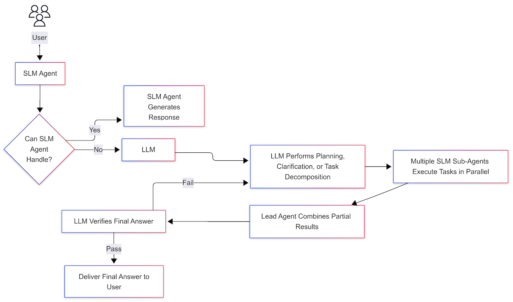

# Part 1: Overview & Background

## TL;DR

오픈소스 SLM을 주요 에이전트로 사용하고 Claude와 같은 상용 LLM을 백업으로 활용하는 하이브리드 AI 아키텍처를 설명합니다. SLM이 비용 효율성을 위해 대부분의 작업을 처리하고, 신뢰도가 낮거나 쿼리가 복잡할 때 Claude로 에스컬레이션합니다. Claude는 계획, 쿼리 재작성, 검증과 같은 메타 작업을 수행합니다. 이 시리즈에서는 다중 에이전트 워크플로, 기업 사용을 위한 세부 조정 전략, 오픈 소스와 상용 모델 간의 상충 관계 평가 등을 다룹니다.

## 1. Background

***

최근 10B 파라미터 미만의 경량 오픈소스 언어 모델들이 폐쇄형 대형 모델과 비교해 점점 경쟁력 있는 성능을 보이고 있습니다. Meta LLaMA 패밀리, Microsoft Phi 패밀리, Alibaba Qwen 패밀리 등의 SLM들은 품질 높은 프롬프트 주입과 파인튜닝을 통해 일부 벤치마크에서 대형 LLM과 비교할 만한 생성 성능을 보여줍니다. 예를 들어, 9개의 서로 다른 SLM을 평가한 한 연구에서는 SLM이 OpenAI GPT-4 기반 구현의 품질과 일치하면서도 더 높은 응답 지연 시간 일관성과 현저히 감소된 비용을 제공할 수 있음을 보여주었습니다.\[1] 실제 프로덕션 환경 애플리케이션에서 오픈소스 SLM 채택은 응답 품질을 유지하면서 지연 시간을 안정화하고 비용을 **5배 이상** 절감한다고 보고되었습니다. 반대로 GPT-4와 Claude 같은 폐쇄형 LLM은 여전히 일반적인 추론 능력과 멀티턴 대화 이해에서 뛰어나지만, API 사용 비용이 누적되고, 지연 시간 변동이나 일시적 서비스 중단의 위험이 있으며, 커스터마이징이 어렵습니다. 클라우드 API 접근 방식은 특히 트래픽 피크 시 불안정하며, 토큰당 요금이 누적되어 대규모 사용 시 스타트업과 대기업에게 비용 부담을 만들고, 모델 내부를 수정하거나 회사 데이터로 파인튜닝을 수행할 수 없어 도메인 적응성에 제한이 있습니다.

기업 환경에서는 민감한 내부 데이터나 지식 기반 Q\&A에 LLM을 활용할 때 데이터 프라이버시와 규제 준수도 중요합니다. 오픈소스 SLM은 자체 인프라에 온프레미스로 배포할 수 있어 내부 데이터 유출 위험 없이 사용할 수 있으며 모델 가중치와 동작에 대한 투명성과 제어를 확보할 수 있습니다. 이러한 장점들로 인해 기업들은 특정 작업에 최적화된 커스터마이징된 경량 모델을 활용하면서 일반적인 고난도 추론이 필요할 때는 대형 상용 모델에 의존하는 하이브리드 전략을 탐색하고 있습니다.

## 2. SLM/LLM Hybrid Architecture Overview

***

<figure><figcaption></figcaption></figure>

_그림 1. SLM/LLM 하이브리드 AI 아키텍처_

이 하이브리드 아키텍처의 핵심 구성 요소는 오픈소스 SLM, 상용 LLM(예: Claude), 그리고 지식/도구 플러그인으로 구성됩니다. 일반적인 운영 흐름은 다음과 같습니다:

* **General Query Processing**: 사용자 쿼리가 도착하면 주요 SLM 에이전트가 먼저 처리를 시도합니다. 이 주요 에이전트는 기업 도메인 지식과 도구 사용법을 학습한 사전 파인튜닝된 LLaMA 패밀리, Phi 패밀리, Qwen 패밀리 등으로, 간단하거나 명확한 질문에 대해 독립적으로 답변을 구성할 수 있습니다. 필요시 관련 지식 검색 도구(예: 내부 문서 검색, 벡터 DB 쿼리)를 호출하여 지원 정보를 검색하고 증거 기반 응답을 생성합니다.
* **Query Difficulty/Ambiguity Assessment and Fallback**: SLM 에이전트가 답변 생성이 어렵거나 신뢰도가 부족하다고 판단할 때(예: 쿼리가 모호하여 추가 명확화가 필요하거나, 외부 지식 부족, 도구 사용 오류), 상위 모델인 Claude로 에스컬레이션합니다. SLM 자체가 그러한 판단을 신호하거나 사전 정의된 실패 감지 규칙에 따라 Claude 호출이 결정됩니다. Claude는 쿼리를 재분석하여 상세한 계획, 질문 재구성, 또는 임시 답변 생성을 수행합니다. 이후 SLM 에이전트는 Claude의 출력(예: 정제된 질문이나 계획)을 받아 후속 작업을 계속합니다. 따라서 Claude는 최종 답변을 직접 생성하기보다는 계획자와 품질 관리자 역할을 하며, 필요에 따라 최소한으로만 개입합니다.
* **Multi-Agent Collaboration and Result Integration**: 복잡한 요청의 경우, Claude(또는 상위 오케스트레이터)가 쿼리를 여러 하위 작업으로 나누고 각각을 병렬 또는 순차적으로 수행할 SLM 하위 에이전트를 생성하고 라우팅합니다. 예를 들어, 연구 질문의 경우 리드 에이전트가 조사할 주제를 계획한 다음 여러 검색 에이전트를 병렬로 실행하여 각각 다른 키워드로 웹 검색/문서 검색을 수행합니다. 각 하위 에이전트는 독립적으로 자신의 컨텍스트 윈도우를 활용하여 검색 결과를 요약/분석하고 부분 답변을 생성한 다음 이를 리드 에이전트에게 반환합니다. 리드 에이전트 또는 별도의 결합 에이전트가 이러한 중간 결과를 병합하고 정리하여 최종 답변을 구성합니다. 모든 주장에는 각 하위 에이전트가 제공한 증거 출처가 포함되어 신뢰성을 향상시킵니다.
* **Claude Verification and Final Answer Generation**: 마지막으로 중요한 경우에는 Claude가 최종 결합된 답변을 한 번 더 검토하여 사실 오류나 부적절한 부분을 확인합니다. Anthropic의 멀티 Claude 에이전트 시스템과 유사하게, 별도의 LLM 검토자가 사실 정확성, 출처 일치, 내용 누락 등을 검증하여 0-1로 점수를 매긴 후 최종 답변을 사용자에게 전송합니다. 필요시 Claude가 수정 제안을 하거나 SLM 에이전트에게 재시도를 지시하며, 모든 검증을 통과한 답변만 사용자에게 전달됩니다.

하이브리드 에이전트 아키텍처는 기본적으로 경량 SLM의 빠른 응답성과 유연한 커스터마이징 능력을 활용하면서 필요할 때만 상위 모델의 **고차원 추론 능력을 차용**합니다. 다음 섹션에서는 대표적인 설계 패턴을 살펴봅니다.

## 3. Open vs. Closed Models: Trade-Offs and Discussion

***

하이브리드 에이전트 아키텍처를 구축할 때, 오픈소스 SLM과 상용 대형 LLM을 어떻게 분배할지는 **기술적/전략적 트레이드오프**의 문제입니다. 주요 비교 요소는 다음과 같습니다:

* **Performance**: Claude와 같은 폐쇄형 최상위 모델은 여전히 광범위한 일반 지식, 추론 능력, 다국어 처리에서 앞서고 있습니다. 더 큰 모델은 복잡한 지시사항과 창의적 생성에서 강점을 보입니다. 반대로 오픈 SLM은 크기 제한으로 인해 고난도 추론에서 오류 확률이 높지만, 특정 작업에 제한될 때는 대형 모델과 일치하거나 이를 초과할 수 있습니다. 특히 도메인별 또는 RAG 상황에서 잘 튜닝된 SLM은 때때로 거대 모델보다 더 정확하고 빠른 답변을 제공합니다. 요약하면, 대형 모델은 튜닝 없이 지배적이지만, 소형 모델은 튜닝/커스터마이징을 통해 자신의 분야에서 뛰어날 수 있습니다.
* **Cost and Infrastructure**: 오픈 모델은 초기 설정 비용(모델 호스팅 서버 등)이 있지만 사용당 비용은 거의 0에 가깝습니다. 반대로 API 모델은 호출량에 따라 선형적으로 증가하는 비용이 있습니다. 대규모 서비스의 경우 오픈 모델이 장기적으로 훨씬 경제적입니다. 또한 자체 인프라에 배포하면 인터넷 연결 없이 내부 네트워크에서 운영할 수 있어 네트워크 라운드트립 없이 잠재적으로 더 낮은 지연 시간을 달성할 수 있습니다. 그러나 기업은 인프라 관리와 모델 업그레이드 같은 MLOps 부담을 져야 하며, 더 큰 모델일수록 이러한 부담이 증가합니다. 한편 Claude와 같은 모델은 클라우드 환경에서 투명한 스케일링 관리를 제공하여 높은 개발 편의성을 제공합니다. 우리의 하이브리드 접근법은 일반적인 요청을 로컬 SLM으로 처리하여 비용을 절감하면서 가끔씩 Claude API 호출로 성능을 보완하여 비용 효율성을 최적화합니다.
* **Data Privacy and Control**: 오픈 모델은 투명한 모델 가중치와 추론 경로를 가지고 있어 출력 추론을 추적하거나 학습된 내용을 제어할 수 있습니다. 또한 모든 추론이 내부에서 발생하므로 민감한 데이터를 외부로 전송할 필요가 없습니다. 이는 금융과 의료 같은 엄격히 규제되는 산업에서 매우 중요한 장점으로, 온프레미스 LLM이 민감한 정보 보호와 규정 준수 요구사항을 만족시킬 수 있습니다. 반대로 클라우드 LLM을 사용하면 입력 데이터가 제3자에게 전송되고 모델에 정보가 보존될 가능성이 있습니다. 많은 기업이 이러한 이유로 오픈 모델 채택을 고려합니다. 오픈 모델은 또한 내부 정책에 따라 필터링 수준을 조정하거나 편향을 수정할 수 있는 반면, 상용 모델 필터링/검열은 제공업체 정책을 따라야 합니다. 따라서 규제 환경이나 자체 보안 요구사항이 중요할 때 오픈소스가 가중치를 얻습니다.
* **Adaptability and Innovation Speed**: 오픈 생태계 모델은 매일 발전하고 있으며, GPT-OSS, Qwen3, LLaMA 4와 같은 최신 공개 모델은 이미 평가에 따르면 GPT-4o 수준을 달성했습니다. 커뮤니티 노력으로 품질 높은 튜닝 방법과 확장 도구가 빠른 개선 주기로 생산됩니다. 기업 관점에서 오픈 모델을 채택하면 그러한 혁신을 즉시 활용하거나 자체 기여를 통해 원하는 기능을 추가할 수 있습니다. 반대로 폐쇄형 모델은 제공업체가 새 버전을 출시할 때까지 기다려야 하며, 내부 운영을 알 수 없어 문제 해결이나 기능 추가에서 자율성이 낮습니다. 즉, 커스터마이징 자유도는 오픈 모델이 훨씬 우수합니다. 그러나 상용 모델은 전문 연구팀이 지속적으로 튜닝하므로 최신 기능이 먼저 도입되고 오픈 모델보다 구매하여 사용하는 것이 더 효율적일 수 있습니다.
* **Safety and Alignment**: Anthropic Claude와 OpenAI GPT 같은 상용 LLM 모델은 광범위한 RLHF를 거쳐 유해한 발언 억제, 의문 없이 명령 따르기, 사실 확인 등에서 높은 신뢰성을 가집니다. 오픈 모델은 상대적으로 RLHF 훈련 단계가 적어 개발자가 책임지고 이러한 측면을 보완해야 합니다. 적절한 처리 없이는 소형 모델이 필터 없이 민감한 정보나 부적절한 응답을 생성할 수 있습니다. 따라서 오픈 모델 사용 시 별도의 모델 출력 모니터링이나 안전 메커니즘(예: 욕설 필터, LLM 기반 2차 검열)을 병렬로 구현해야 합니다. 하이브리드 시스템에서는 상용 LLM이 최종 응답을 검열/정제하도록 하여 이 문제를 완화할 수 있습니다. 예를 들어, Claude가 SLM 답변을 "회사 정책에 부적절한 내용"에 대해 검사하고 그러한 부분을 제거하거나 다시 작성하도록 합니다. 이러한 협업을 통해 오픈 모델의 강점을 보존하면서 상용 모델의 안전 메커니즘을 활용할 수 있습니다.

요약하면, 오픈 vs 클로즈드 선택은 **제어/유연성 vs 즉시성/성능 (control/flexibility vs immediacy/performance)**&#xC758; 균형을 나타냅니다. 우리의 하이브리드 아키텍처는 이 두 세계를 조화시켜 "**보통은 오픈 모델로 빠르고 저렴하게, 필요할 때만 대형 모델로 깊고 정확하게**"라는 원칙을 구현합니다. 이는 기업의 **비용 효율성 (cost efficiency)**, **확장성 (scalability)**, **신뢰성 (reliability)** 욕구를 만족시키는 접근법입니다. 이러한 멀티 모델 전략을 적용하여 **LLM 사용 비용**을 극적으로 줄이면서 사용자 만족도를 유지하거나 향상시킨 고객 사례가 증가하고 있습니다.

## Further Reading

* [Part 2: Agentic Patterns & Prompting](https://housekdk.gitbook.io/ml/genai/open-source-slm-based-hybrid-agent-ai-architecture/part-2-agentic-patterns-and-prompting)
* [Part 3: Tool Integration & Fine-Tuning](https://housekdk.gitbook.io/ml/genai/open-source-slm-based-hybrid-agent-ai-architecture/part-3-tool-integration-and-fine-tuning)

## References

* \[1] [S. S. et al. (2024). _Scaling Down to Scale Up: Replacing OpenAI's LLM with Open Source SLMs in Production_.](https://arxiv.org/abs/2312.14972)
