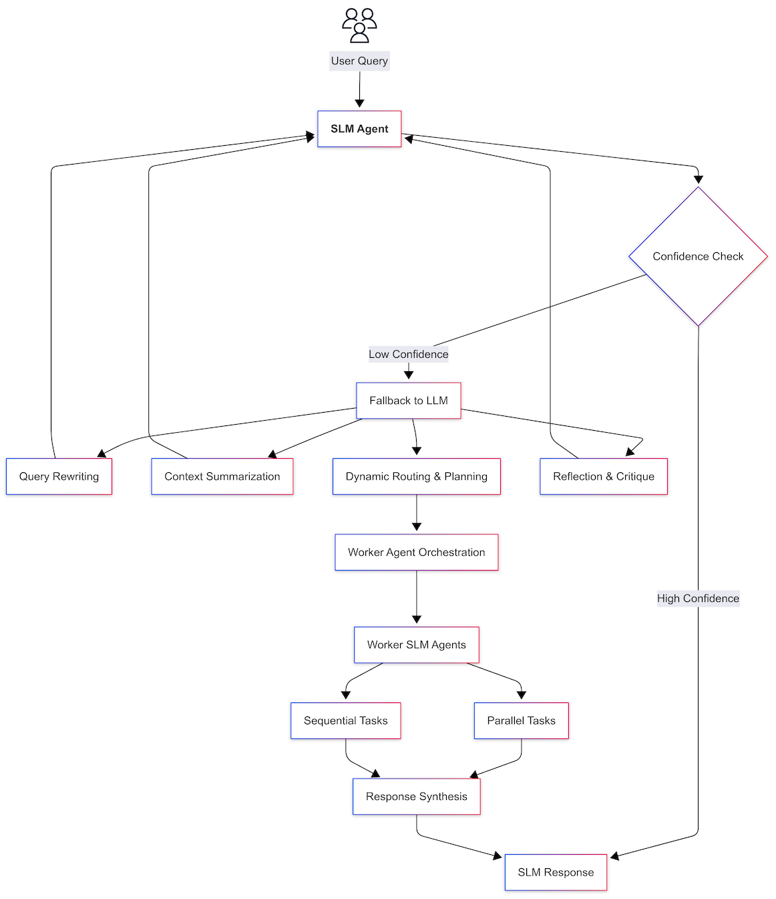

# Part 2: Agentic Patterns & Prompting

#### Content Level: 200

## Suggested Pre-Reading

* [Part 1: Overview & Background](part-1-overview-and-background.md)

### TL;DR

SLM을 주요 처리 에이전트로 활용하고 신뢰할 수 없거나 복잡한 상황에에서 Claude와 같은 상용 LLM로 폴백하는 하이브리드 패턴입니다. Claude는 쿼리 재작성, 계획, 품질 검증과 같은 메타 역할을 처리하고, 멀티 에이전트 오케스트레이션을 통해 병렬 처리와 전문화된 작업 분배를 달성합니다. SLM 도구 사용에는 제로샷 프롬프팅보다 퓨샷 프롬프팅이 더 효과적입니다.

### 1. Agentic Patterns

<figure><figcaption></figcaption></figure>

_그림 1. 오픈소스 SLM 기반 하이브리드 AI 아키텍처의 핵심 메커니즘_

이 다이어그램은 오픈소스 SLM 기반 하이브리드 에이전트 AI 아키텍처의 핵심 메커니즘을 보여줍니다:

* **SLM 에이전트**: 사용자 쿼리를 처리하는 주요 에이전트
* **신뢰도 확인 (Confidence Check)**: SLM 응답의 신뢰성을 검증하고 필요시 폴백을 트리거
* **LLM으로 폴백**: 복잡한 쿼리나 실패를 대형 언어 모델 Claude에 위임
* **LLM**: 쿼리 재작성, 컨텍스트 요약, 라우팅/계획, 응답 평가 등 다양한 작업 수행
* **에이전트 오케스트레이션**: 작업을 병렬 또는 순차적으로 처리하는 멀티 에이전트 구조

이를 통해 SLM 중심의 하이브리드 아키텍처가 다양한 방식으로 신뢰성과 확장성을 달성할 수 있습니다.

#### 1.1. SLM-First Agent Execution

기업 챗봇이나 지식 탐색 에이전트를 구축할 때 오픈소스 SLM을 주요 모델로 채택하면 지연 시간과 비용을 극적으로 줄일 수 있습니다. 소형 모델은 파라미터가 적어 더 빠른 추론 속도를 가능하게 하고, 자체 호스팅 시 API 호출 비용이 발생하지 않아 대용량 트래픽 처리에 경제적입니다. 예를 들어, 품질 높은 내부 FAQ 데이터로 7B 규모의 LLaMA 패밀리 모델을 파인튜닝하면 수천억 규모 모델과 비교할 만한 응답 정확도를 제공하면서 자체 서버에서 안정적인 실시간 응답을 전달할 수 있습니다. 연구에 따르면 특정 작업에 대해 잘 파인튜닝된 10B 규모 모델이 때때로 훨씬 큰 GPT-3 모델과 동등한 성능을 보입니다 – 실험에서는 1,400배 작은 모델이 GPT-3와 유사한 결과를 달성하여 경량 전문화 모델의 효율성을 증명했습니다.\[^2] 따라서 필요에 따라 여러 소형 모델을 병렬/전용 역할로 배포하는 것이 단일 거대 모델을 과도하게 사용하는 것보다 비용 효율적일 수 있습니다.

SLM 우선 전략의 장점은 다음과 같습니다.

* **Low Cost and High Throughput**: 오픈 모델은 API 수수료 없이 운영할 수 있고 여러 인스턴스를 배포하여 수평 확장으로 높은 QPS(초당 쿼리 수)를 처리할 수 있습니다. 오픈소스 SLM 자체 호스팅은 클라우드 API 사용 대비 최대 5배 이상의 비용 절감을 달성한다고 보고되었습니다.\[^1]
* **Latency Stability**: 폐쇄형 API는 호출 중 지연 시간 변동이나 일시적 실패를 경험할 수 있지만, 자체 호스팅 SLM은 제어 가능한 인프라를 통해 일관된 응답 시간을 보장할 수 있습니다. GPU/가속기 최적화로 지연 시간을 더욱 줄일 수 있고, 자동 스케일링으로 부하 대응이 가능합니다.
* **Data Privacy and Security**: 모델이 내부 서버에서 운영되므로 고객/기업 데이터를 외부로 전송할 필요가 없습니다. 이는 금융과 의료 같은 엄격히 규제되는 산업에서 매우 중요한 장점으로, 온프레미스 LLM이 민감한 정보 보호와 규정 준수 요구사항을 만족시킬 수 있습니다.
* **Easy Model Customization**: 오픈 모델은 가중치를 획득하고 자체 데이터로 파인튜닝하거나 추가 제어를 적용할 수 있어 기업별 톤, 지식, 기능을 주입할 수 있습니다. 반대로 API 모델은 내부 조정 없이 프롬프트 엔지니어링에만 의존할 수 있습니다. 오픈 모델의 투명성은 또한 예측할 수 없는 출력을 디버깅하거나 편향을 수정하는 것을 더 쉽게 만듭니다.

물론 SLM이 항상 만능은 아니며, 지나치게 작은 모델은 질문의 **뉘앙스**를 놓치거나 도구 사용 (tool usage)에서 실수를 할 수 있습니다. 또한 내부 문서와 같은 매우 광범위한 컨텍스트를 처리하거나 광범위한 상식/추론이 필요한 문제는 여전히 최신 대형 모델이 유리합니다.\[^3]

따라서 **저난도 및 반복적 작업은 SLM으로 빠르게 처리**하고 **복잡한 문제는 상위 모델에 위임**하는 메커니즘이 필요합니다. 다음 섹션에서는 그러한 **신뢰도 기반 폴백 (confidence-based fallback)** 전략을 다룹니다.

#### 1.2. Confidence-Based Fallback to Claude

SLM을 주로 활용하더라도 시스템은 불확실한 상황을 인식하고 상위 모델의 도움을 구하여 높은 신뢰성을 유지할 수 있어야 합니다. 이 아키텍처에서는 SLM 에이전트가 답변 생성 중 실패 신호를 감지하면 Anthropic Claude와 같은 대형 언어 모델로 요청을 에스컬레이션합니다. 실패 신호는 다음과 같은 경우를 포함할 수 있습니다:

* **Tool Usage Failures**: SLM이 호출한 도구가 오류를 생성하거나 결과를 해석할 수 없는 경우(예: API 타임아웃, 코드 실행 오류, "파일을 찾을 수 없음" 등).
* **Output Format/Grammar Errors**: SLM이 생성한 코드나 SQL 쿼리에 구문 오류나 기타 명백한 실행 오류가 있는 경우.
* **User Feedback**: 사용자가 "틀렸다"나 "다시 시도해"와 같은 응답으로 잘못된 답변을 나타내는 경우. 이는 모델이 컨텍스트를 잘못 이해했거나 정보를 놓쳤음을 시사하여 상위 모델 개입의 신호 역할을 합니다.
* **Ambiguous Queries/Ambiguity**: 질문 자체가 모호하거나 여러 방식으로 해석될 수 있는 경우. SLM이 질문 의도에 대해 혼란스럽다고 판단하면 Claude에게 재질문을 요청하거나 Claude가 명확화 질문을 생성하여 사용자와 의도를 재확인하도록 할 수 있습니다.
* **Sensitive or High-Risk Responses**: 의학과 법률처럼 잘못된 답변이 큰 영향을 미치는 분야나 회사 정책에 따라 민감한 주제에 대한 쿼리. 이런 경우 소형 모델보다는 규제된 RLHF 모델인 Claude가 응답하도록 하여 위험을 줄입니다. 또한 외부 지식 근거 위험이 높고 환각 가능성이 있을 때 정확성을 보장하기 위해 상위 모델을 할당합니다.

폴백이 트리거되면 Claude는 상황에 적합한 **지원 임무**를 수행합니다. 예를 들어, SLM 코드 생성이 반복적으로 실패하면 Claude가 직접 올바른 코드 예제를 제공할 수 있습니다. 쿼리가 모호하면 Claude가 대화 의도를 명확히 재진술하거나 필요한 추가 정보를 요청할 수 있습니다. Claude는 광범위한 **사전 지식**과 **고급 추론** 능력을 보유하여 SLM이 해결할 수 없는 격차를 메우는 **안전망** 역할을 합니다.

폴백을 통해 Claude가 일시적으로 배치되고 문제가 안정화된 후 **SLM으로 제어권을 다시 이전**하는 것이 이 시스템의 특징입니다. 예를 들어, Goose 프레임워크의 리드/워커 모드에서 소형 모델(워커)이 **N번 연속 실패**하면 대형 모델(리드)이 일시적으로 개입한 다음 상황 해결 후 워커에게 작업을 반환합니다. 마찬가지로 우리 아키텍처에서도 Claude가 답변 프레임워크를 구축하거나 어려운 문제를 해결한 후 상세한 응답 구성이나 추가 사용자 대화는 SLM이 재개합니다.\[^4] 이는 **최소 비용으로 최대 성능**을 달성합니다.

다른 관점에서 Claude는 **품질 보증(QA)** 역할도 수행합니다. SLM 초안 답변이 생성되면 Claude가 이를 **평가/비판**할 수 있습니다(예: "이 답변에 오류나 위험 요소가 있습니까?"라고 묻기). Claude의 피드백은 SLM 자기 개선을 위한 피드백으로 사용됩니다. 연구에 따르면 그러한 **자기 반성 루프**를 도입하면 모델의 문제 해결 능력이 향상됩니다.\[^5] Anthropic의 멀티 Claude 에이전트 실험에서 **별도의 Claude 판사 모델**이 다른 에이전트의 결론을 평가하여 정확성, 출처 일치 등을 점수화하고 문제가 있을 때 수정을 요구함으로써 최종 성능을 향상시켰습니다. 우리 아키텍처에서도 Claude가 SLM 응답을 검토하고 필요시 수정하여 SLM 단독보다 **더 안정적이고 신뢰할 수 있는** 응답을 생성합니다.

요약하면, SLM 우선 시스템 위에 "실패 시 상용 LLM으로 폴백"이라는 **이중 안전망**을 두어 사용자 쿼리가 아무리 복잡하거나 예외적이어도 궁극적으로 대형 모델 능력을 통해 완료되도록 보장합니다.

#### 1.3. Claude-Assisted Query Rewriting, Summarization, and Meta-Reasoning

하이브리드 아키텍처에서 상용 LLM은 어려운 질문에 대한 **답변 대체**만 하는 것이 아니라 **쿼리 해석**부터 **답변 검증**까지 다양한 **메타 기능**을 수행합니다. 주요 활용 패턴은 다음과 같습니다:

* **Query Rewriting**: 사용자 입력이 모호하거나 장황할 때 Claude가 이를 명확하고 모델 친화적인 버전으로 변환합니다. 예를 들어, Claude는 모호한 질문을 내부적으로 여러 해석으로 의역한 다음 가장 적절한 해석을 선택할 수 있습니다. 또는 사용자의 긴 서술형 질문을 요약하여 SLM이 처리하기 쉽게 만들 수 있습니다. 이는 SLM이 의도 인식 오류 없이 핵심 질문에 집중할 수 있도록 도와줍니다. Claude의 우수한 언어 이해력이 라우터처럼 활용됩니다.
* **Context Summarization**: 사용자 대화 컨텍스트나 검색을 통해 검색된 문서가 매우 광범위할 때 Claude가 관련 정보를 요약/정리하여 SLM에 제공합니다. 예를 들어, 사용자가 여러 문서를 업로드하고 질문할 때 Claude가 각 문서를 요약하거나 쿼리와 관련된 부분만 추출하여 SLM에 전달합니다. 이를 통해 제한된 컨텍스트 윈도우를 가진 소형 모델이 긴 컨텍스트의 본질을 반영한 답변을 생성할 수 있습니다. Claude 4 Sonnet 모델은 1M 토큰을 처리할 수 있으므로 Claude가 먼저 기업 데이터베이스나 보고서의 방대한 정보를 압축하여 SLM이 활용하도록 하는 구조가 가능합니다. 이는 RAG 파이프라인에서 자주 사용되는 패턴으로, 대형 모델이 긴 텍스트 요약기 역할을 합니다.
* **Dynamic Routing and Planning**: 앞서 설명한 바와 같이 Claude는 쿼리에 따라 필요한 절차와 도구를 결정하고 계획을 수립할 수 있습니다. 소형 모델에 비해 Claude는 논리적 계획에 뛰어나며 복잡한 문제를 적절히 분해합니다. 예를 들어, "우리 회사 제품 A에 대한 시장 반응과 경쟁사 동향을 알려주세요"와 같은 복잡한 요청이 도착하면 Claude가 이를 "1) 제품 A에 대한 소셜 미디어 감정 수집, 2) 경쟁사 신제품 발표 조사, 3) 두 정보를 통합하여 인사이트 도출"과 같은 단계로 나눌 수 있습니다. 그런 다음 각 단계에 적절한 전문 에이전트/도구를 할당하는 라우팅을 수행합니다. 여기서 Claude는 모든 작업을 직접 수행하기보다는 지휘자 역할을 하며, SLM 하위 에이전트가 실행할 지시사항(프롬프트)을 작성합니다. 리드 Claude가 계획을 수립하고 집중된 목표를 가진 하위 에이전트를 소환하여 병렬 탐색을 수행한 Anthropic 사례와 유사합니다. Claude의 메타 이해와 제어 능력은 효과적인 멀티 에이전트 협업을 가능하게 합니다.
* **Reflection and Critique**: Claude는 SLM이나 다른 에이전트의 중간 출력이나 최종 답변에 대한 비평가로 작동합니다. 예를 들어, Claude에게 "위 답변의 약점은 무엇입니까?" 또는 "추가 검증이 필요한 부분은 어디입니까?"라고 묻는 것은 답변에서 부정확하거나 논리적으로 불충분한 부분을 식별하는 데 도움이 됩니다. Claude의 피드백은 SLM이 답변을 개선하거나 추가 조치를 취하는 트리거로 사용됩니다.

요약하면, Claude는 단순한 응답 생성기보다는 더 높은 수준에서 지능적으로 생각하는 조언자 역할을 합니다. Claude의 이러한 비생성적 활용은 소형 모델 중심 시스템에서 중앙 안전 메커니즘이자 생산성 향상 요소가 됩니다. Claude를 전능한 문제 해결사로 위치시키기보다는 계획/비판 전문가 AI로 위치시키는 것이 전체 시스템 효율성을 향상시킵니다.

#### 1.4. Multi-Agent Orchestration Patterns

단일 에이전트가 복잡한 문제 해결에 한계가 있을 때, **여러 LLM 에이전트의 협업**을 통해 성능을 극대화하는 **멀티 에이전트 아키텍처**가 빛을 발합니다. 주요 패턴은 다음과 같습니다:

* **오케스트레이터-워커 패턴 (Orchestrator-Worker Pattern)**: 중앙 조정자(오케스트레이터) 에이전트가 존재하고 여러 워커 에이전트가 실제 작업을 수행하는 구조입니다. 일반적으로 오케스트레이터는 고수준 계획과 통합 역할을 처리하고(우리의 경우 이 역할은 SLM이나 필요시 Claude가 처리), 워커는 개별 작업에 최적화된 SLM 인스턴스입니다. 오케스트레이터는 사용자 쿼리를 받아 작업을 나누고 각각을 어떤 워커/도구에 할당할지 결정합니다. 워커는 할당된 하위 작업(예: 특정 질문 검색, 데이터베이스 쿼리, 텍스트 요약)을 수행한 다음 결과를 오케스트레이터에게 반환합니다. 마지막으로 오케스트레이터가 이를 종합하여 사용자에게 응답합니다. 이 패턴은 각 모델을 가장 잘 활용할 수 있는 부분에 배치하여 전체 효율성을 향상시킵니다.
* **병렬 하위 작업 및 토큰 용량 확장 (Parallel Sub-tasks and Token Capacity Expansion)**: 멀티 에이전트의 주요 장점 중 하나는 병렬 실행을 통한 시간 단축과 컨텍스트 용량 증가입니다. 서로 다른 에이전트가 동시에 여러 정보 소스를 탐색하면 순차 처리보다 훨씬 빠르게 더 광범위한 사실을 수집할 수 있습니다. 예를 들어, Anthropic 실험에서 단일 Claude가 30단계와 10분이 걸린 웹 연구를 10개의 소규모 Claude 에이전트가 병렬로 작업하여 훨씬 짧은 시간에 완료했습니다. 또한 각 에이전트가 별도의 컨텍스트 윈도우를 사용하므로 리드 + N개 하위 에이전트가 협업하면 본질적으로 N배의 토큰 컨텍스트 활용 효과를 제공합니다. 이는 방대한 검색 공간을 다루거나 한 모델의 컨텍스트 한계를 넘는 정보를 처리할 때 특히 유용합니다. Anthropic은 그러한 병렬 토큰 사용이 성능 향상의 80%를 설명하며, 실제 내부 작업에서 단일 모델보다 90.2% 높은 성능을 달성했다고 보고했습니다.
* **순차 작업 시퀀싱 및 메모리 핸드오프 (Serial Task Sequencing and Memory Handoff)**: 일부 시나리오에서는 병렬보다 순차적 에이전트 체인이 더 적절합니다. 여기서 에이전트 A의 출력이 에이전트 B의 입력이 되고, B의 출력이 C로 가는 파이프라인을 형성합니다. 예를 들어, 고객 질문에 답하기 전에 에이전트1이 사용자 의도를 분류하고, 에이전트2가 관련 내부 데이터를 쿼리한 다음, 에이전트3이 최종 답변을 생성합니다. 각 단계에는 전문화된 에이전트가 있으며, 이전 단계의 메모리(대화 컨텍스트나 결과)가 다음 에이전트에게 전달됩니다. 중앙 오케스트레이터는 각 중간 결과를 저장/관리하고 그러한 메모리 전송을 위해 다음 에이전트 프롬프트에 필요한 부분만 포함합니다. 멀티턴 대화에서는 대화 기록이 공유 메모리에 저장되어 장기 컨텍스트 유지를 가능하게 합니다. 오케스트레이터는 실패 시 체크포인트로 롤백하거나 에이전트를 교체하여 전체 프로세스 중단을 방지하는 워크플로우 제어를 처리합니다.
* **전문가 에이전트 및 도구 사용 (Expert Agents and Tool Usage)**: 각 에이전트는 특정 분야나 도구 사용에 최적화되어 전문가 그룹처럼 작동할 수 있습니다. 예를 들어, 한 SLM은 자연어 요약에 특화되고 다른 하나는 역할 할당을 위한 프롬프트 엔지니어링이나 파인튜닝을 통해 SQL 쿼리 생성에 뛰어납니다. 사용자 질문이 복잡할 때 오케스트레이터는 "이 부분은 데이터베이스 쿼리가 필요하므로 SQL 에이전트에게, 저 부분은 보고서 요약이 필요하므로 요약 에이전트에게"와 같이 적절히 작업을 분배합니다. 이를 통해 각 에이전트가 자신의 강점 영역에서만 작업하여 효율성과 정확성을 향상시킵니다. 이 구조는 인간 조직 협업과 유사하며, 궁극적으로 AI 에이전트가 팀으로 작업하는 효과를 만듭니다.

SLM을 중심으로 한 그러한 멀티 에이전트 오케스트레이션을 구현할 때 주요 고려사항은 **오케스트레이터** 자체를 SLM으로 할지 Claude와 같은 상위 모델로 할지입니다. 기본적으로 경량 모델이 모든 것을 감독하려고 시도해야 하지만, 복잡성이 특정 수준을 초과하면 Claude가 오케스트레이션 역할을 맡는 **하이브리드** 접근법이 합리적입니다. 앞서 논의한 바와 같이 이는 "SLM 간의 쉬운 협업, Claude 개입으로 어려운 조정"으로 요약할 수 있습니다. 이 역시 비용과 성능 간의 균형점으로 볼 수 있습니다.

결과적으로 멀티 에이전트 아키텍처는 여러 모델의 **집단 지능**을 통해 단일 LLM 한계를 극복하는 경로를 제공합니다. 기업 환경에서 광범위한 지식 탐색이나 복잡한 작업 자동화에 그러한 구조를 활용하면 AI 에이전트가 작업을 나누는 인간 팀처럼 **병렬적이고 탄력적인 문제 해결**을 수행할 수 있습니다.

### 2. Prompting Techniques for Tool Use

오픈소스 SLM을 에이전트로 활용할 때 프롬프트 설계가 성능에 큰 영향을 미칩니다. 특히 SLM이 외부 도구(예: 검색, 계산, DB)와 상호작용할 수 있도록 하는 명시적 시연 예제를 제공하는 퓨샷 프롬프트 전략이 효과적입니다. 대형 모델은 RLHF 과정에서 함수 호출과 같은 도구 사용 시나리오를 부분적으로 학습하지만, 소형 모델은 그러한 지식이 부족하여 도구 사용 관행을 가르쳐야 합니다.

* **Zero-shot**: "다음 질문에 답하는 데 필요한 절차를 생각하고 필요시 검색 도구를 사용하세요"와 같은 지시사항만 예제 없이 제공합니다. 최신 LLM은 제로샷으로 일부 도구 사용 행동을 보이지만, 소형 모델은 추론 오류나 형식 실수를 하기 쉽습니다. 잘못된 도구 호출은 직접적으로 실패로 이어지므로 제로샷으로는 안정적인 도구 사용을 기대하기 어렵습니다.
* **Few-shot Example Provision**: 과거 대화나 시나리오를 예제로 프롬프트에 포함하여 도구 사용의 모범 사례를 보여줍니다. 모델에게 도구 호출 형식과 컨텍스트를 직접 보여주면 유사한 미래 상황에서 같은 패턴을 따를 확률이 증가합니다. LangChain 팀 실험에서도 퓨샷 예제를 추가할 때 복잡한 도구 선택 정확도가 크게 향상되었다고 보고했습니다. 특히 메시지 형식으로 3개 예제를 제공할 때 Claude 3 모델의 도구 선택 성공률이 제로샷 16%에서 52로 급증했습니다.\[^6] 질문과 높은 유사성을 가진 3개 예제를 동적으로 선택하는 기법이 정적 3개 예제보다 더 효과적이었고, 한 번에 많은 예제보다 대화 형식의 적은 예제가 더 나은 성능을 보였습니다. 이러한 결과는 소형 SLM에서도 사전 훈련이나 프롬프트에 도메인별 도구 사용 샘플을 포함하면 훨씬 더 안정적인 올바른 도구 호출이 가능함을 시사합니다.

퓨샷 프롬프트의 단점은 모델의 컨텍스트 길이를 많이 소모한다는 것입니다. 그러나 2025년 현재 많은 오픈소스 모델이 32K 이상의 긴 컨텍스트를 지원하며, 2-3개 예제를 포함하는 것은 충분히 실현 가능하여 트레이드오프가 가치 있습니다. 또한 파인튜닝을 통해 도구 사용 패턴을 모델에 내재화하면 매번 긴 예제가 필요하지 않습니다. Anthropic과 OpenAI 같은 주요 회사들도 개발자의 프롬프트 작업을 줄이기 위해 함수 호출과 도구 사용 능력으로 모델을 사전 파인튜닝합니다.

궁극적으로 제로샷 vs 퓨샷 전략 선택은 모델의 사전 지식 수준과 컨텍스트 가용성에 따라 달라집니다. 우리 아키텍처에서는 가능할 때 시스템 프롬프트나 모델 튜닝을 통해 도구 사용 예제를 주입하여 SLM이 상황에 맞게 적절한 도구를 자율적으로 사용할 수 있도록 합니다. 이는 에이전트가 추가 사용자 개입 없이 필요한 도구를 선택하는 올바른 판단을 내리는 진정한 에이전트 자동화에 더 가까워집니다.

## Further Reading&#x20;

* [Part 3: Tool Integration & Fine-Tuning](part-3-tool-integration-and-fine-tuning.md)

## References

* \[^1] [S. S. et al. (2024). _Scaling Down to Scale Up: Replacing OpenAI's LLM with Open Source SLMs in Production_.](https://arxiv.org/abs/2312.14972)
* \[^2] [Monte Carlo (2023). _RAG vs. Fine Tuning: Which One to Choose the Right Method_](https://www.montecarlodata.com/blog-rag-vs-fine-tuning).
* \[^3] [Dextralabs (2025). _Open Source LLMs vs. Closed: Best Fit for Enterprise_.](https://dextralabs.com/blog/open-source-llms-vs-closed-enterprise)
* \[^4] [Block (2025). _Treating LLMs Like Tools in a Toolbox: A Multi-Model Approach to Smarter AI Agents_.](https://block.github.io/goose/blog/2025/06/16/multi-model-in-goose)
* \[^5] [Rohan Paul (2025). _Anthropic reveals multi-agent Claude research wizardry powering 90% accuracy boost_.](https://www.rohan-paul.com/p/anthropic-reveals-multi-agent-claude)
* \[^6] [LangChain (2024). _Few-shot prompting to improve tool-calling performance_.](https://blog.langchain.com/few-shot-prompting-to-improve-tool-calling-performance/)
