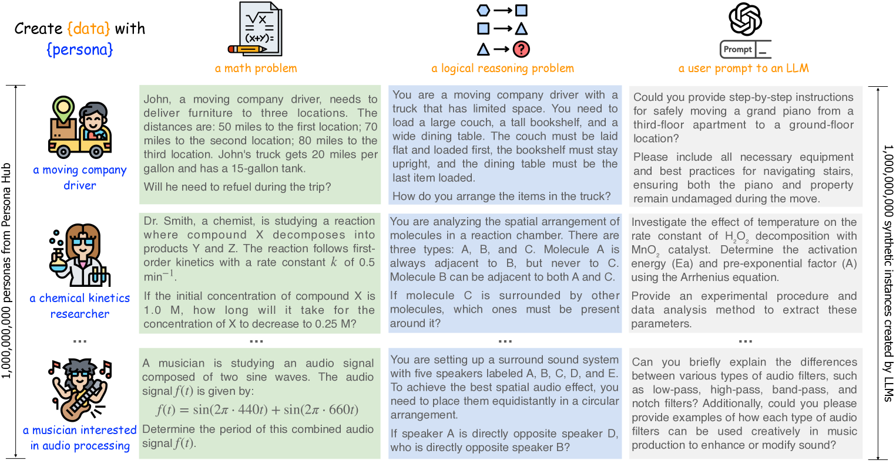
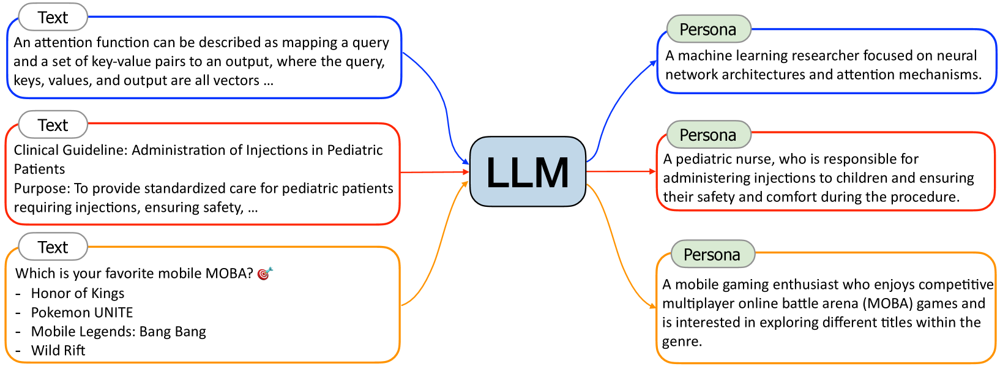
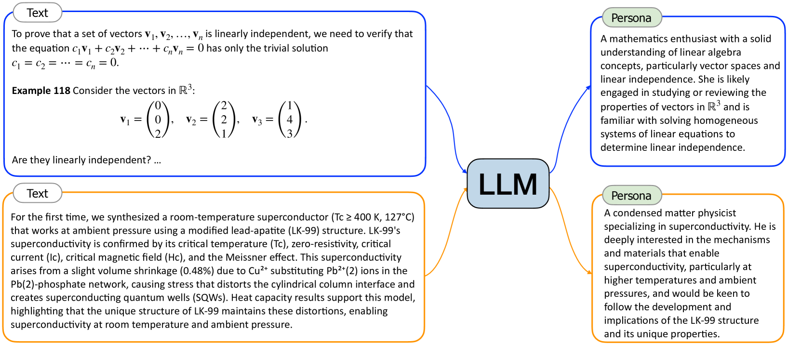
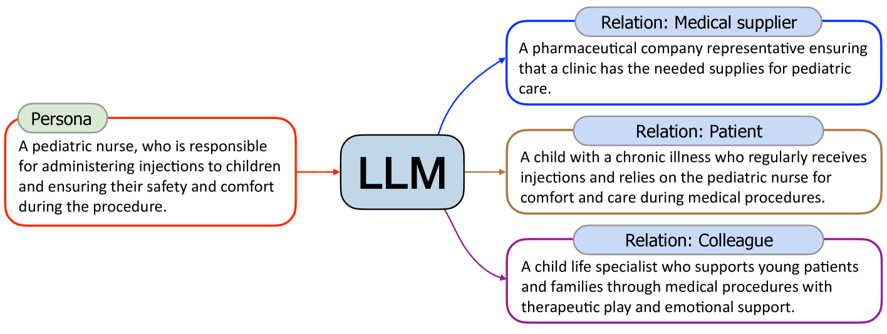
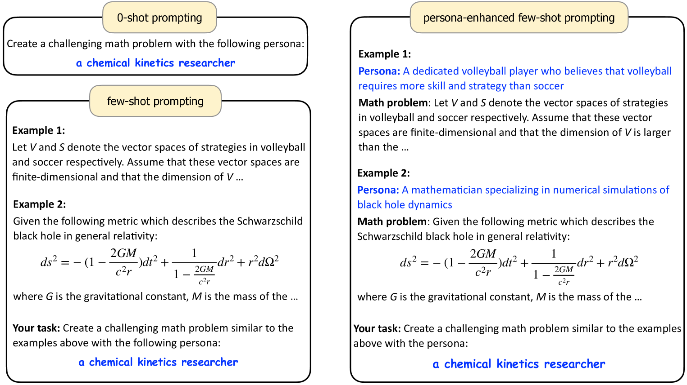

# 10B Persona Creation Paper review


Paper: Scaling Synthetic Data Creation with 1,000,000,000 Personas ([https://arxiv.org/abs/2406.20094](https://arxiv.org/abs/2406.20094))

GitHub: [https://github.com/tencent-ailab/persona-hub](https://github.com/tencent-ailab/persona-hub)

Hugging Face: [https://huggingface.co/datasets/proj-persona/PersonaHub](https://huggingface.co/datasets/proj-persona/PersonaHub)


## 1. Overview

***

#### **합성 데이터의 중요성과 한계**

* 합성 데이터는 모델이나 알고리즘이 생성한 데이터로, 인간이 직접 만든 것이 아님
* LLM 훈련에서 합성 데이터의 가치가 증가하고 있음
* 핵심 문제: 합성 데이터의 양적 확장은 쉽지만 **다양성 확장이 어려움**
* 샘플링을 고려하지 않으면, LLM은 하나의 데이터 합성 프롬프트당 단 1개의 인스턴스만 생성 가능

#### 기존 방법론의 한계

* **Instance-driven** 방식: 시드 코퍼스에 기반해 프롬프트를 변형·확장하지만, 다양성의 원천이 시드에 갇혀 **스케일과 커버리지가 제한**됨. 띠라서 대부분 실무에서 시드 코퍼스 크기가 제한적이기에 대규모로 진정한 다양성을 확보하기 어려움.
* **Key-point-driven** 방식: 포괄적 키포인트 목록을 큐레이션해 프롬프트를 구성하나, **전 영역·다층의 키포인트를 인간이 열거**하는 것은 현실적으로 불가능(특히 범용 도메인) → 좁고 특정한 도메인(예: 수학)에만 제한적으로 적용 가능

#### 본 논문의 Persona-driven 방법론

* **데이터 합성 프롬프트에 페르소나를 추가**하면 LLM이 해당 관점으로 독특한 합성 데이터를 생성하도록 유도할 수 있음 → **간단하지만 강력한 다양성 증폭기**로 작동.
* **Persona Hub**: 대규모 웹 데이터로부터 자동 구축한 **10억 개 페르소나(세계 인구의 13%에 해당하는 규모)** 풀을 프롬프트에 결합해 수학/논리·지식 텍스트·지시문·게임 NPC·툴 정의 등 전방위적 **합성 과제**를 대규모로 생성.
* 구현 난점이었던 “다양성의 스케일링”을 **Text-to-Persona → Persona-to-Persona 자동 생성 → 체계적 중복 제거**로 해결.

#### **데이터 합성 프롬프트 예시**

<figure><figcaption></figcaption></figure>

* `"Create {data} with {persona}"` 형태의 템플릿
* 여기서 `{data}`는 생성하고자 하는 데이터 유형, `{persona}`는 특정 페르소나

같은 "수학 문제 만들기" 요청이라도 페르소나에 따라:

* **직업적 맥락이 반영된** 문제가 생성됨
* **전문 지식이 자연스럽게 통합됨**
* **실제 그 직업군이 마주할 법한** 현실적인 시나리오가 만들어짐

#### HF Dataset

* [https://huggingface.co/datasets/proj-persona/PersonaHub](https://huggingface.co/datasets/proj-persona/PersonaHub)

## 2. Persona Hub: **페르소나 생성 방법**

***

* **Text-to-Persona**: 웹 텍스트에서 해당 텍스트를 읽거나 쓸 만한 페르소나 추론
* **Persona-to-Persona**: 기존 페르소나로부터 대인관계를 통해 새로운 페르소나 생성

### 2.1 Text-to-Persona

#### 핵심 아이디어

* 특정 전문 경험과 문화적 배경을 가진 사람은 읽기와 쓰기에 고유한 관심사를 가질 것
* 따라서 특정 텍스트로부터 그 텍스트를 읽거나 쓰거나 좋아하거나 싫어할 만한 특정 페르소나를 추론할 수 있음.
* 웹상의 텍스트 데이터는 사실상 무제한이고 전방위적이므로, Text-to-Persona 접근법을 대규모 웹 텍스트 데이터에 적용하면 다양한 세분화 수준에서 거의 모든 측면을 포괄하는 수십억(또는 수조) 개의 다양한 페르소나를 얻을 수 있음
* 한줄요약: 무한한 웹 텍스트 → 무한한 페르소나 가능성 (실제로는 수천만 개의 초기 페르소나 후보 확보)
* 핵심 프롬프트 패턴: LLM에게 "**이 텍스트를 읽을|쓸|좋아할|싫어할 만한 사람은 누구인가?**" 질문을 던짐.
* 페르소나 출력 형식: 프롬프트 내에서 세분화 수준 제어(일반 텍스트/구조화형, 대충(coarse-grained persona)/세밀한 수준(fine-grained persona)). 예: “컴퓨터 과학자(rough)” ↔ “신경망 아키텍처와 어텐션 메커니즘에 초점을 맞춘 머신러닝 연구자(세밀)”.
* 프롬프트 예시 (논문에서 설명된 개념을 간단한 베이스라이닝 목적으로 재구성함)

```python
"""
System: 당신은 '페르소소나 추출가' 입니다.  
User: 아래 텍스트를 읽고, 이 텍스트를 [읽을/쓸/좋아할/싫어할] 법한 페르소나를 5명 생성하세요. 각 페르소나는 1-2문장으로
      (직업/전문영역, 경험, 관심사, 배경)까지 구체화하세요.
      가능한 한 세밀하게 기술하고, 중복을 피하세요.
-----
<텍스트 본문>
-----
Output Format:
- Persona: (요약 라벨)
- Profile: (1-2문장 설명; 직업/전문성/관심/배경 포함)
- Why: (추정 근거: 텍스트의 어떤 단서 때문인지)
"""
```

#### 구체적 예시들

<figure><figcaption></figcaption></figure>

**Figure 3에서 생성된 페르소나 예시**

1. **어텐션 함수 기술 텍스트**
   * 생성된 페르소나: "신경망 아키텍처와 어텐션 메커니즘에 초점을 맞춘 머신러닝 연구자"
2. **소아과 주사 임상 가이드라인**
   * 생성된 페르소나: "아이들에게 주사를 놓고 시술 중 안전과 편안함을 보장하는 소아과 간호사"
3. **모바일 MOBA 게임 선호도 질문**
   * 생성된 페르소나: "경쟁적 멀티플레이어 온라인 배틀 아레나(MOBA) 게임을 즐기고 장르 내 다양한 타이틀 탐험에 관심 있는 모바일 게임 애호가"
   *

* Figure 4 예시: 입력 텍스트에 많은 세부 요소가 포함되어 있으면 페르소나 설명도 구체적이고 세밀해짐

<figure><figcaption></figcaption></figure>

### 2.2 Persona-to-Persona

#### **Text-to-Persona의 한계**

* Text-to-Persona는 거의 모든 측면을 다루는 페르소나를 합성할 수 있는 고도로 확장 가능한 방법이지만, 웹상에서 가시성이 낮은 일부 페르소나들을 놓칠 수 있음
* **놓치기 쉬운 페르소나 예시**: 아동, 노숙인, 촬영 스태프 등

#### 해결책: 대인관계 기반 페르소나 확장

* Text-to-Persona로 얻은 페르소나들로부터 대인관계를 통해 페르소나를 파생시키는 Persona-to-Persona 제안
* Text-to-Persona가 도달하기 어려운 페르소나들을 보완하는 역할 → 훨씬 넓은 커버리지의 **대규모 페르소나 그래프 산출**
* **관계 확장 깊이**: “6단계 분리 이론(Six Degrees of Separation Theory)”에 착안해 **각 페르소나당 6회 반복 확장**을 수행해 커버리지를 극대화.
* **핵심 프롬프트 패턴**: “**주어진 페르소나와 밀접한 관계에 있는 사람은 누구인가?**”를 질의
* 프롬프트 예시 (_확장을 6회 반복하여 그래프처럼 주변 페르소나를 확장함.)_

```python
"""
System: 당신은 '관계 기반 페르소나 확장가' 입니다.
User: 아래 '기준 페르소나'와 밀접한 관계(가족/환자-간병/사수-부사수/동료/고객-판매자/현장 협업 등)에 있는
      새로운 페르소나를 10명 생성하세요. 각 항목에 '관계 유형'을 명시하세요.
-----
기준 페르소나: [예: 소아병동 간호사]
-----
Output Format:
- Persona: (요약 라벨)
- Relation: (관계 유형; 예: 환자, 보호자, 주치의, 병원 행정직 등)
- Profile: (1-2문장 설명)
"""
```

#### 구체적 예시 (Figure 5)

<figure><figcaption></figcaption></figure>

**기준 베이스라인:** 소아병동 간호사 - "주사를 놓고 시술 중 아이들의 안전과 편안함을 보장하는 소아병동 간호사"

* LLM에게 "주어진 페르소나와 밀접한 관계에 있는 사람은 누구인가?" 질문
* 관계 유형(환자-간병인, 동료, 공급업체 등)과 함께 구체적인 페르소나 설명 생성

**파생되는 관계별 페르소나들:**

1. **환자 관계**
   * "만성 질환을 앓고 있어 정기적으로 주사를 맞으며, 의료 시술 중 소아과 간호사의 위로와 돌봄에 의존하는 아이"
2. **동료 관계**
   * "치료적 놀이와 정서적 지원을 통해 의료 시술을 받는 어린 환자와 가족을 돕는 아동 전문가"
3. **의료 공급업체 관계**
   * "클리닉이 소아병동 치료에 필요한 용품을 확보할 수 있도록 하는 제약회사 대표"

#### 전략적 의미

이 방법론은 **사회적 네트워크의 완전성** 보장

* 웹에서 직접 발견하기 어려운 사회적 역할들을 체계적으로 포착
* 사회 구조의 모든 층위와 관계망을 페르소나 컬렉션에 반영
* Text-to-Persona의 "엘리트/가시적 역할" 편향을 균형 있게 보완

### 2.3. Deduplication (중복 제거)

#### 배경

* 대규모로 생성된 페르소나에는 표면적으로 같거나 의미적으로 유사한 항목이 다수 포함됨
* 예컨대 RedPajama v2 데이터셋에서 Text-to-Persona를 실행한 후 Persona-to-Persona를 수행하여 수십억 개의 페르소나를 얻을 수 있지만, 일부 페르소나들이 동일하거나 유사함. → Persona Hub의 다양성을 보장하기 위해 중복 제거 필요
* 따라서 논문에서는 2단계 중복 제거 파이프라인을 제안함.→ 표면적 + 의미적 유사성으로 철저한 중복 제거

#### **MinHash 기반 어휘(표면형) 중복 제거**

* 페르소나 설명의 n-gram 특성을 기반으로 MinHash를 사용하여 중복 제거
* **대상 표현**: 페르소나 설명은 보통 **1–2문장**으로 문서보다 훨씬 짧기 때문에 긴 문서처럼 복잡한 n-gram이 필요치 않다고 보고 **1-gram**만 사용하고 **서명 크기(signature size)는** **128으로 지**.
* 유사도 임계치: **Jaccard 유사도 ≥ 0.9 → 같은 그룹으로 묶고 대표 1개만 유지**
* 의미: 철자·어휘 수준에서 거의 동일한 표현을 정리해 **표면형 중복**을 대거 제거

#### **임베딩 기반 중복 제거**: 의미적 유사성 기반 제거

* **모델**: 텍스트 임베딩 모델(예: text-embedding-3-small)을 사용해 각 페르소나의 임베딩 계산.
* **판별 기준**: **코사인 유사도 ≥ 0.9 → 의미 중복으로 간주, 대표 1개만 유지**
* **의미**: 표현은 다르지만 내용·의미가 사실상 같은 퍼소나를 제거해 **의미적 다양성**을 보장.
* 유연한 임계값 조정
  * 여기서는 0.9를 임계값으로 선택했지만, 특정 요구에 따라 추가 중복 제거를 위해 유연하게 조정할 수 있음
  * **예시**: 인스턴스 수 요구는 낮지만(예: 100만 개만 필요) 다양성 요구가 높은 경우
    * **더 엄격한 중복 제거 기준** 적용 가능 (예: 유사도 0.5 초과 페르소나 폐기)

## 3. Persona-driven Synthetic Data Creation

***

#### 개요

<figure><figcaption></figcaption></figure>

* **Zero-shot Prompting**: 가장 간단하고 확장성 높음, 그러나 컨텍스트 부족으로 결과가 다소 단순할 수 있
* **Few-shot Prompting**: zero-shot보다는 품질 우수, 하지만 prompt 설계 비용 및 데모 준비 필요
* **Persona-enhanced Few-shot Prompting**
  * Few-shot 예시 각각에 persona 정보를 붙여 주는 방식. 예컨대, “Example 1: persona A → task → output”, “Example 2: persona B → task → output” … 이런 식으로 구성
  * **단점**: few-shot 프롬프트의 각 시연에 대해 미리 해당 페르소나를 도출해야 함
  * 다양한 페르소나 기반 데모가 포함되어 있어 LLM이 persona별 variation을 더 잘 반영할 수 있음. 논문에서도 이 방식이 가장 좋은 성능/다양성 균형을 보여준다고 보고됨

#### 요약

* 페르소나 삽입 방식은 매우 유연하여 거의 모든 데이터 생성 task (수학/추론 문제, prompt/instruction generation, 지식 중심 텍스트, NPC 시나리오, 함수/툴 정의 등)에 적용 가능함
* 페르소나를 변경하는 것만으로 prompt의 맥락(context)를 바꿀 수 있기 때문에, 동일한 task template에 대해서도 매우 다양한 스타일/시점/도메인 variation을 쉽게 확보할 수 있다는 장점이 있음.
* 특히 Persona-enhanced few-shot 방식은, 각 데모(example)가 갖는 페르소나를 통해 LLM이 prompt-output mapping을 더 명확히 학습할 수 있는 효과가 있어서, 생성 품질과 다양성 모두에서 더 우수한 결과를 도출 가능.
* 확장성(scalability) 측면에서도, persona만 바꿔서 prompt 조합을 바꿀 수 있으므로, 사실상 생성 가능한 synthetic data instance 수는 persona 수와 비례하여 거의 선형적으로 증가

## **4. Use Cases**

***

* Persona-driven 방식이 다양한 데이터 생성 시나리오에 얼마나 유연하고 효과적인지, 또 얼마나 확장 가능성(scalability)을 갖는지 보여주기 위해, 논문에서는 5가지 주요 응용 사례를 제시함
* 각 사례는 persona-driven prompting (zero-shot, few-shot, persona-enhanced few-shot 등을 조합) 방식으로 구현 가능

### **4.1 수학 문제 생성 (Math Problems)**

가장 상세히 다뤄진 부분으로, Persona Hub 기반으로 수학/논리 문제를 생성하는 방식 및 실험 결과가 설명되어 있음.

* Figure 7의 예시처럼, 단순 프롬프트(예: “create a math problem of difficulty X”)에 특정 페르소나(예: linguist, computational linguist, 수학 전공자 등)를 포함시키면 LLM은 그 페르소나의 배경/관점에 맞는 맥락(context)을 반영한 수학 문제를 생성함. 예를 들어, 언어학자(linguist) 페르소나와 함께하면 언어 분석 또는 통계적 언어 모델링 맥락을 담은 수학 문제가 나올 수 있음.
* 페르소나가 주어져도 문제의 포커스(예: combinatorics / probability / geometry 등)나 난이도(level) 등의 조정은 여전히 가능하며, 페르소나가 생성의 자유도를 지나치게 제한하지 않으면서도 맥락적 변형(contextual variation)을 촉진함.
* 또한, 수학 전공 페르소나 (예: “graduate student in applied mathematics”, “math contest coach”) 등을 사용하면 일반 페르소나보다 더 전문적이고 난이도 높은 문제도 생성 가능함
* LLM 모델, prompt 방식(zero-shot vs few-shot vs persona-enhanced few-shot) 등에 따라 생성된 문제의 난이도, 해법 다양성(solutions diversity), 문항 품질(validity) 등이 달라지는 경향이 관찰됨. 예컨대, persona-enhanced few-shot prompting이 일반 few-shot 대비 더 창의적이고 다양한 유형의 문제를 생성하는 경향을 보임.

### **4.2 논리 추론 문제 (Logical Reasoning Problems)**

* 논리 추론 문제는 일반적으로 조건 해석, 논리 흐름 추적, 배경 정보 해석 등을 요구하는데, 페르소나 배경(context) 덕분에 문제 배경이 다양해지고, 문제 설계 시 다양한 관점(예: 사회적 상황을 고려한 조건, 일상적 시나리오 기반 조건 등)을 포함시키기 용이해졌음.
* 예를 들어, “enthusiastic amateur golfer” 같은 페르소나와 함께하면 “골프 토너먼트 참가자들의 득점 분포 조건” 등의 시나리오가 포함된 논리 문제를 생성할 수 있고, “software engineer” 페르소나와 함께하면 서버 네트워크/메시지 전달 경로 등의 조건을 포함한 논리 퍼즐을 생성할 수 있음. (Medium 리뷰 요약에서도 유사한 예시가 언급됨)

### **4.3 사용자 지시문 생성 (Instructions / Prompts)**

* 다양한 페르소나(연령대, 직업, 관심사, 성향 등)와 결합된 “어떤 작업을 요청” 프롬프트를 자동 생성함으로써, LLM instruction-tuning 또는 instruction-fine-tuning에 활용할 수 있는 대규모 사용자 요청 데이터셋 확보 가능
* 이 과정에서는 페르소나별 요청 스타일(request style), 요청 목적(request goal), 사용자의 사전 지식 수준(knowledge level) 등에 맞춘 다양한 프롬프트 템플릿을 활용하여, 동일한 작업 요청(task)이라도 사용자 배경(persona)에 따라 변형된 요청이 만들어짐.
* 예를 들어, “환경문제에 대해 글 작성해 주세요”라는 요청도, 학생 페르소나, 환경 NGO 활동가 페르소나, 일반 시민 페르소나 등 각각의 배경에 따라 다른 phrasing과 depth, 관점(예: 정책 중심, 과학 중심, 개인 행동 중심 등)의 차이를 반영한 지시문이 생성됨.

### **4.4 지식 기반 텍스트 생성 (Knowledge-rich Texts)**

* 페르소나를 활용하여, 지식 중심의 문서/텍스트(예: 설명문, 기술 블로그 스타일 글, 주제별 심층 글 등)를 합성한 경우도 다수 제시됨.
* 이러한 텍스트는 단순히 일반 설명문보다는 해당 페르소나의 배경/관점/지식 수준을 반영한 맥락적 차별화(contextual variation)를 가진다. 예를 들어, 동일 주제(예: 암호화폐 기술, 의료 AI, 기후 변화 등)에 대해 “대학원 컴퓨터 과학자”, “재무 분석가”, “정책 담당 공무원” 등의 다양한 페르소나를 주면, 글의 용어 수준, 강조점, 논조(style), 전개 방식 등이 달라지도록 자동 생성할 수 있다.
* 실험적으로, 이 방식으로 생성된 지식 중심 텍스트는 품질(validity) 면에서 비교적 높게 평가되었으며, 다양한 페르소나 배경 덕분에 “비슷하지만 다른 관점(different perspectives)”의 설명문이 생성됨.

### **4.5 게임 NPC 생성 (Game NPCs)**

* NPC 생성 시, 페르소나별 배경(profile, 관심사, 직업, 대인 관계 등) + 간단한 행동 루틴(behavior routine) 템플릿 및 상호작용(interaction style) 프롬프트를 결합하여 다양한 캐릭터 배경과 대화 스타일을 자동으로 생성 가능.
* 예컨대, “retired teacher living in coastal town”, “freelance software developer traveling in Southeast Asia”, “local café barista with amateur musician hobby” 등과 같은 배경을 가진 NPC에 대해, 초기 자기소개, 관심사, 선호도, 대화 스타일(친절, 직설적, 장난스러움 등), 행동 루틴(예: 매일 아침 바다 풍경 보며 걷기, 손님 응대 루틴, 주변인들과의 상호작용 방식 등)을 생성.
* 이 방식은 게임 시나리오 설계에서 NPC 다양성을 확보하고, 수작업 NPC 설계 부담을 크게 줄일 수 있다는 장점이 있음.

### **4.6 도구(Function) 생성 및 활용 (Tool Development)**

* 사용자/페르소나 기반 사용자 요구(user requirement)를 반영한 다양한 “함수(function/tool)” 정의 및 설명(prompt + spec) 생성이 가능함.
* 예를 들어, “재무 분석가 페르소나라면, 특정 주식 포트폴리오 리스크 계산 함수”, “건축가 페르소나라면, 특정 구조물 하중 계산 함수” 같은 맥락 기반 툴 정의를 자동 생성
* 생성된 도구 사양(specifications)은 함수 이름, 입력 파라미터 설명, 기능 설명, 예시 입력/출력, 예외 상황 처리 방식 등을 포함하도록 설계되며, LLM을 활용해 이를 확장하거나 테스트 시나리오(prompt를 통한 사용 예시)도 함께 생성 가능
* 저자들은 이 방식이 LLM의 기능 확장(functionality augmentation) 측면에서 페르소나 중심 합성 데이터 생성의 또 다른 유용한 응용 사례임을 강조함

### 4.7. 정량적 실험 결과

#### **다양성(Diversity; 1-similarity) 측정: 문항 간 유사도 분석**

* 생성된 수학/논리 문제 쌍을 비교했을 때, 페르소나 간 **语义적 유사도(similarity)** 가 페르소나 다양성과 밀접한 상관.
* **비슷한 페르소나**(예: 동일 분야 학부생/대학원생)끼리 생성한 문제는 유사도가 높음.
* **이질적 페르소나**(예: 음악가 vs 수학자)로부터 생성한 문제 쌍은 유사도가 낮아, **맥락적 다양성(contextual variation)** 확보에 효과적임.
* 정량적으로, 코사인 유사도를 사용했을 때, 페르소나 거리가 클수록 문제 간 평균 유사도가 **0.1\~0.2 포인트** 감소.

#### **유효성(Validity) 평가**

* LLM이 생성한 수학 문제의 정답 유효성(validity) 비율을 검증한 결과, **persona-enhanced few-shot** 설정에서 정답률이 가장 높게 유지됨.
* Zero-shot보다 few-shot이, few-shot보다 persona-enhanced few-shot이 consistently better.
* 예를 들어, persona-enhanced few-shot으로 생성된 수학 문제의 정답 검증 성공률은 **약 80% 이상**, 반면 zero-shot은 65\~70% 수준에 머무름.

#### **난이도 조절(Controllability)**

* 프롬프트에 난이도 수준을 명시했을 때(Low/Medium/High), 생성 문제의 실제 난이도 분포가 사람이 판단한 라벨과 **70\~80% 이상 일치**.
* 즉, 페르소나와 결합된 프롬프트는 **난이도 제어 가능성(controllability)** 을 유지하면서도 맥락적 다양성을 추가함.

#### **프롬프트 방식 비교**

* **Zero-shot**: 단순한 문제 생성, 반복적 패턴 많음.
* **Few-shot**: 문제의 품질, 정답률 개선.
* **Persona-enhanced few-shot**: 품질+다양성 모두 개선 → 가장 바람직한 설정으로 결론.
* 실제로 **문항 유사도 분포의 표준편차(variance)** 가 persona-enhanced few-shot 조건에서 가장 크게 나타나, **다양성 증가**를 입증.

## **5. Broad Impact & Ethical Concerns**

***

### **5.1 Broad Impact**

#### **데이터 생성 패러다임의 전환 (Paradigm Shift in Data Creation by Humans & LLMs)**

* 지금까지 인공 데이터(synthetic data)는 주로 사람이 설계하거나 소규모 샘플 기반으로 확장해 왔지만, Persona Hub를 이용하면 LLM 중심으로 대규모, 고다양성(scalable and high-diversity) synthetic data 생성이 가능
* 예를 들어, seed 코퍼스나 키포인트 기반 방식은 결국 사람의 설계 한계(키포인트 열거, 시드 샘플 커버리지 등)에 묶여 있는데, Persona Hub 방식은 단순히 페르소나(perspective)를 바꾸는 것만으로도 엄청난 prompt 다양성을 확보할 수 있고, 따라서 synthetic instance 수가 거의 선형적으로 확대 가능
* 또한, synthetic data 생성 부담 및 시간·비용 부담이 줄어들어, 특히 작은 팀이나 자원이 제한된 연구자들도 다양한 도메인/관점의 데이터를 쉽게 확보 가능

#### **Reality Simulation**

* 다양한 사용자 군(user groups)의 입장/반응/행동을 미리 시뮬레이션
  * 기업이 신제품 출시 시 서로 다른 배경을 가진 사용자 그룹들이 어떻게 반응할지 시뮬레이션
  * 정부가 정책 도입 전 국민의 다양한 계층이 어떻게 인지하고 대응할지 예측
  * 온라인 서비스 제공자가 신규 기능 도입 시 사용자 행동 변화나 요구 패턴을 미리 예측
  * 콜드스타트(cold start) 문제 완화: 새로운 서비스나 제품에 대한 사용자 초기 반응 예측, 사용자 프로파일링 및 행동 시뮬레이션 가능
* 더 나아가, Persona Hub 기반 synthetic personas를 agent로 취급하여, 대규모 에이전트(agent) 상호작용 시뮬레이션, 역할 놀이(role-play), 메타버스/가상환경(sandbox/parallel world) 내 가상사회(simulated society) 구축 가능성도 언급됨. 이를 통해 정책 실험, 사회적 역학(emergent behavior) 관찰, 사용자 상호작용 패턴 분석 등이 가능

#### **Full Memory Access of LLMs**

* LLM은 거대한 매개변수(parameter) 기반의 압축된 세계지식(world knowledge)를 내재하고 있는데, 일반 사용자나 단일 프롬프트로는 그 내부 지식의 일부만 실현 가능하다는 한계가 있음. 하지만 Persona Hub의 다양한 페르소나를 사용하면, LLM이 내재한 여러 관점/지식 조각(piece)을 끌어낼 수 있고, 이는 일종의 “페르소나 기반 분산 캐리어(distributed carrier-based) 방식”으로 LLM 내부 기억을 “텍스트 형태로 해제(decompress)” 하는 개념으로 볼 수 있음.
* 즉, Persona Hub는 LLM 내부 지식을 synthetic data 형태로 끄집어내는 도구(tool)가 될 수 있으며, 향후 LLM의 파라미터 압축 능력과 연결하여 synthetic data 생성 추출(extraction) 가능성을 탐구할 수 있다는 주장
* 다만 아직은 현재 LLM의 hallucination(허위 생성) 리스크, 그로 인한 품질 저하 가능성, 의미적 정확성 한계 등이 존재하므로 완전한 “lossless” 복원은 불가능하다는 점도 언급되고 있음

#### **5.2 Ethical Concerns**

#### **학습 데이터 보안 및 LLM 우위성 유지 위협**

* target LLM의 학습된 지식(training data / memorized data)을 끄집어내는 방식과 유사하기에 잠재적으로 저작권 침해, 데이터 유출(leakage) 우려를 불러올 수 있음.
* 특히, LLM 제공 업체들이 경쟁 우위를 확보하는 데 있어 데이터를 비공개로 유지하는 경우가 많은데, Persona Hub 방식이 그 내부 지식 일부를 텍스트 형태로 추출 가능하게 만들면, 이로 인해 “최강 모델(top-performing LLM)”의 우위가 약화될 수 있다는 우려가 있음.
* 또한, synthetic instruction prompt generation을 Persona Hub로 확장하면, 타겟 LLM이 학습된 instruction template, 예제 응답 스타일, 패턴 등이 대량 노출될 가능성이 있으며, 이는 LLM의 내부 구조/프롬프트 패턴이 외부에 복제 가능하게 된다는 보안 리스크도 존재함.

#### **허위 정보 및 인공지능 기반 왜곡 가능성**

* “가짜 정보(fake news)” 또는 왜곡된 정보(bias)가 포함될 가능성 증가. 특히 페르소나가 매우 다양하고 “사람처럼” 글을 쓰면, synthetic 텍스트가 인간 작성 텍스트와 구분하기 어려워지는 문제가 있음.
* 또한 synthetic data가 실제 학습 데이터에 혼입(contamination)될 경우 downstream 모델 학습시 편향(bias) 유입, 과적합(overfit) 가능성, 또는 synthetic data의 오류가 전파될 위험성도 제기됨.

#### **책임성과 투명성**

* Persona Hub 방식은 누구든지 쉽게 다양한 synthetic personas 및 synthetic data를 만들 수 있으므로, 악의적 또는 부적절한 사용 가능성도 있음.
* 따라서 synthetic data 생성 과정 및 persona來源(source), 프롬프트 내 persona 선택 기준(persona sampling strategy), 중복 제거(deduplication) 방법, synthetic sample의 품질 평가(validity filtering) 등에 대해 투명하게 공개하고, 적절한 감사(audit) 또는 추적 가능성(traceability)가 필요하다는 점이 강조됨.
* 예컨대, synthetic data 사용 시 어떤 persona가 어떤 prompt로 어떤 synthetic sample을 생성했는지 provenance 정보를 기록(provenance tracking)하는 것이 좋으며, 이를 통해 synthetic data의 출처/책임소재를 명확히 할 필요가 있음.

#### **사회적·법적 책임**

* 사용자 행동 시뮬레이션, 정책 실험, 여론 예측 등 현실 세계 시나리오에 활용될 경우, 민감한 주제(sensitive domain: 정치, 의료, 사법 등)에 대해 왜곡된 synthetic 시뮬레이션이 사회적 영향을 줄 수 있다는 우려가 있음.
* 예컨대 정부 정책 반응 예측, 사용자 감정 분석, 여론 변화 예측 시, synthetic personas의 편향(bias) 또는 왜곡된 배경 설정이 실제 사회 현상을 잘못 모사할 수 있으며, 이는 잘못된 결론 도출 또는 정책 오판(policy mis-design) 가능성을 내포함.
