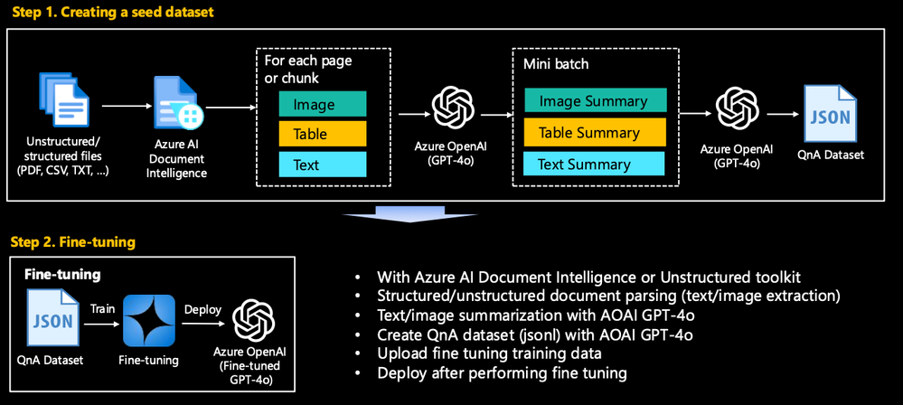
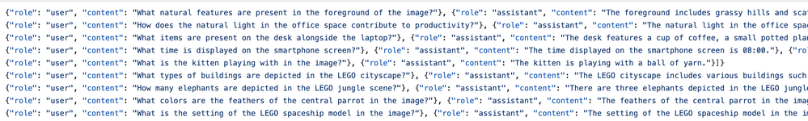
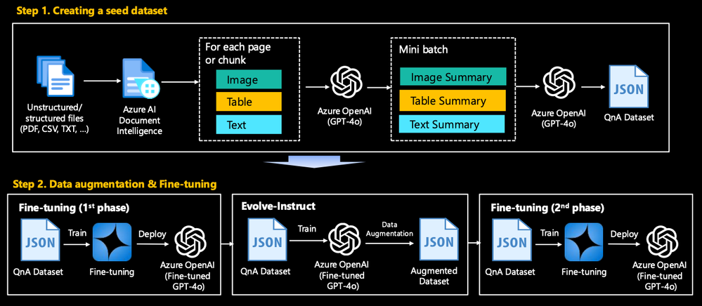
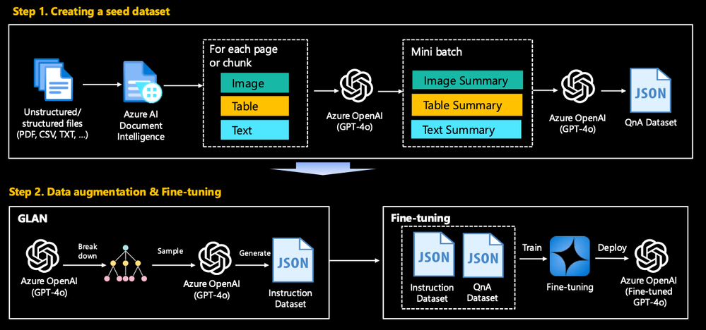
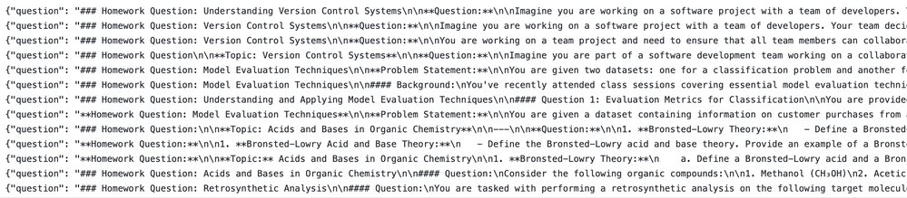
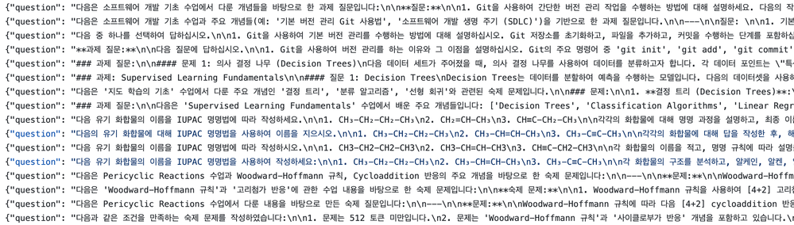

# Generate Synthetic QnAs from Real-world Data on Azure

> _이 글은 저자가 마이크로소프트 AIML 기술 커뮤니티에 기고한_ [_Generate Synthetic QnAs from Real-world Data on Azure_](https://techcommunity.microsoft.com/blog/azure-ai-foundry-blog/generate-synthetic-qnas-from-real-world-data-on-azure/4202053) _를 직접 한국어로 번역 및 편집하였습니다._

## 1. Background <a href="#community-4202053-toc-hid-1223282387" id="community-4202053-toc-hid-1223282387"></a>

***

빠르게 발전하는 생성형 AI 분야에서 SLM/LLM 파인튜닝과 RAG(Retrieval-Augmented Generation) 기법 구현은 고성능의 도메인별 애플리케이션을 달성하기 위해 필수적이 되었습니다. 이러한 목적을 위한 합성 데이터셋 생성은 기존 데이터셋으로는 적절히 다루어지지 않을 수 있는 대상 도메인의 특정 격차와 뉘앙스를 해결하는 맞춤형 훈련 데이터 생성을 가능하게 하므로 매우 중요합니다. 이 접근법은 모델이 관련성 있고 정확한 정보를 이해하고 생성하는 능력을 향상시켜, 궁극적으로 전문 분야에서 사용자의 요구를 더 잘 충족할 수 있는 더욱 견고하고 신뢰할 수 있으며 맥락을 인식하는 AI 시스템으로 이어집니다.

PDF, CSV, TXT와 같은 다양한 형식의 원시 데이터, 특히 이미지, 표, 텍스트가 혼재된 데이터로부터 고품질 데이터셋을 생성하는 것은 여러 중요한 과제를 제시합니다. 이는 주로 추출 과정 자체가 복잡하기 때문인데, 각 형식마다 콘텐츠를 정확하게 검색하고 해석하기 위해 서로 다른 파싱 기법이 필요하기 때문입니다. 예를 들어, PDF는 다양한 구조를 가질 수 있고 표준화된 레이아웃을 따르지 않을 수 있어 텍스트와 이미지를 일관되게 추출하기 어렵게 만듭니다. 또한 PDF 내의 표 처리는 여러 페이지에 걸쳐 있을 수 있고 복잡한 셀 구조를 가질 수 있어 특히 어렵습니다.

원시 데이터로부터 생성된 시드 데이터셋을 기준선으로 사용하여 모델의 성능을 향상시키고자 한다면, 고품질 합성 데이터를 생성하기 위한 데이터 증강이 필요할 수 있습니다. 하지만 증강 과정에서 편향이나 불일치를 도입할 위험이 있습니다. 증강된 데이터는 실제 데이터에 존재하는 다양성과 변동성을 대표해야 합니다. 신중하게 관리되지 않으면, 증강은 모델이 증강된 데이터에서는 잘 수행하지만 실제 데이터에서는 성능이 떨어지는 과적합으로 이어지거나, 데이터셋의 기존 편향을 증폭시킬 수 있습니다. 이 블로그에서는 이러한 과제를 해결하는 데 도움이 될 방법론과 코드 스니펫을 자세히 공유합니다.

## 2. Constructing a Seed Dataset <a href="#community-4202053-toc-hid-543224017" id="community-4202053-toc-hid-543224017"></a>

***

<figure><figcaption></figcaption></figure>

### 2.1. 개요 <a href="#community-4202053-toc-hid-147337457" id="community-4202053-toc-hid-147337457"></a>

이 작업은 이러한 이질적인 데이터를 파인튜닝이나 RAG에 적합한 구조화된 형식으로 전처리하고 변환하는 것입니다. 여기에는 다양한 파일 형식에서 텍스트를 추출하고 정리하는 것이 포함되며, 필요한 경우 [Azure AI Document Intelligence](https://azure.microsoft.com/en-us/products/ai-services/ai-document-intelligence)로 대표되는 AI 서비스를 사용하여 표와 이미지를 텍스트로 변환하는 것도 포함됩니다. 이 데이터셋은 파인튜닝이나 RAG를 위한 시드 데이터셋으로 사용되며 도메인별 사용 사례의 성능을 향상시키기 위한 기준선 역할을 합니다. 다음은 일반적인 사용 사례를 기반으로 한 따라하기 쉬운 실습입니다. 모든 코드는 [여기](https://github.com/Azure/synthetic-qa-generation/tree/main/seed)에 업로드되어 있습니다.

**PDF**

* `make_qa_multimodal_pdf_docai.ipynb`: (권장) Azure AI Document Intelligence를 사용하여 복잡한 PDF에서 QnA 합성 데이터셋 생성.
* `make_qa_multimodal_pdf_oss.ipynb`: 오픈 소스(이 실습에서는 Unstructured 툴킷)를 사용하여 복잡한 PDF에서 QnA 합성 데이터셋 생성. 이 파일을 실행하려면 먼저 `startup_unstructured.sh`로 필요한 패키지를 설치해야 합니다. 설치에는 몇 분이 소요됩니다.
* `make_qa_only_image_multiple_pdf.ipynb`: 여러 PDF에서 QnA 합성 데이터셋 생성 - 이미지 중심 PDF.
* `make_qa_only_image_pdf.ipynb`: PDF에서 QnA 합성 데이터셋 생성 - 이미지 중심 PDF.

**CSV**

* `make_qa_csv.ipynb`: 일반적인 경우입니다. CSVLoader로 읽고 청킹하여 QnA 데이터셋을 만드는 것은 어렵지 않습니다.
* `make_qa_image_url_csv.ipynb`: 또 다른 일반적인 경우입니다. 이미지 URL 정보가 포함된 경우, 이 URL을 해당 이미지에 대한 요약 결과로 변경합니다.

가장 대표적인 `make_qa_multimodal_pdf_docai.ipynb`의 내용을 살펴보겠습니다.

### 2.2. PDF 페이지 분리 <a href="#community-4202053-toc-hid-300000266" id="community-4202053-toc-hid-300000266"></a>

`analyze_pdf_page_content(...)`를 사용하여 PDF 페이지를 텍스트, 이미지, 표가 포함된 "Text", "Image", "Mixed"로 분리합니다.

```python
def analyze_pdf_page_content(pdf_path, text_length_thres=600):
    document = fitz.open(pdf_path)
    page_analysis = defaultdict(list)

    for page_num in range(len(document)):
        page = document.load_page(page_num)
        text = page.get_text("text")
        image_list = page.get_images(full=True)

        text_length = len(text)
        num_images = len(image_list)

        if text_length > text_length_thres and num_images == 0:
            content_type = 'Text'
        elif text_length <= text_length_thres and num_images > 0:
            content_type = 'Image'
        else:
            content_type = 'Mixed'            

        page_analysis[content_type].append(page_num)

    return dict(page_analysis)
```

* **텍스트 중심 페이지**는 Azure AI Document Intelligence나 Unstructured 같은 툴킷을 사용할 필요 없이 오픈 소스(예: PyMuPDF)로 처리할 수 있습니다.
* **이미지 중심 페이지**는 전체 페이지를 이미지로 변환하고 Azure OpenAI GPT-4o 같은 멀티모달 LLM이 각 페이지를 요약하도록 할 수 있습니다.
* **혼합 페이지**는 Azure AI Document Intelligence를 사용하여 이미지, 텍스트, 표를 분리합니다. Azure Document Intelligence의 내장 모델은 문서 분석을 위한 주요 기능을 제공합니다:
  1. **텍스트 추출:** 다양한 문서 유형에서 텍스트를 식별하고 추출합니다.
  2. **표 인식:** 표 구조를 감지하고 추출합니다.
  3. **선택 표시:** 체크박스와 라디오 버튼을 인식합니다.
  4. **양식 필드 인식:** 양식에서 필드를 추출합니다.
  5. **문서 구조 이해:** 제목, 헤더, 푸터 및 기타 섹션을 구분합니다.
  6. **다국어 지원:** 여러 언어의 문서를 처리합니다.
  7. **SDK 및 REST API 통합:** 애플리케이션에 원활한 통합을 위한 도구를 제공합니다.

자세한 내용은 [Microsoft의 AI Document Intelligence 공식 페이지](https://learn.microsoft.com/en-us/azure/ai-services/document-intelligence/concept-layout?view=doc-intel-4.0.0\&tabs=sample-code)를 참조하세요.

### 2.3. Mixed page processing <a href="#community-4202053-toc-hid-2053827843" id="community-4202053-toc-hid-2053827843"></a>

이제 혼합 페이지에서 정보를 추출하는 방법을 자세히 살펴보겠습니다.

* 혼합 페이지를 prebuilt-layout 모델로 추출하고 마크다운으로 변환 - `document_intelligence_client.begin_analyze_document("prebuilt-layout", output_content_format=ContentFormat.MARKDOWN, ...)`
* figure 태그에 저장된 바운딩 박스(x, y, w, h)를 사용하여 이미지 추출 - `crop_image_from_file(...)`. 바운딩 박스 크기가 너무 작거나(`is_bounding_box_larger_than(...)`) 이미지가 의미 없는 단순한 패턴인 경우(`image_complexity(...)`), 이미지는 추출되지 않습니다.
* 추출된 이미지를 GPT-4o로 요약합니다(`understand_image_with_gpt(...)`). 데이터셋을 공개해야 하는 경우 OpenAI 모델이 아닌 오픈 소스 LLM을 사용해야 함에 주의하세요.

다음은 이를 간략히 요약한 코드 스니펫입니다. 실제 구현은 이보다 더 복잡합니다.

```python
# Import necessary functions for processing
from util.preprocess import (
    image_complexity, is_bounding_box_larger_than, crop_image_from_file, 
    understand_image_with_gpt, update_figure_description
)
    
if "Mixed" in analyzed_pdf_result:
    pdf_mixed_path = path_to_mixed_pdf

    # Open and analyze the PDF file with Azure Document Intelligence
    with open(pdf_mixed_path, "rb") as file:
        poller = document_intelligence_client.begin_analyze_document(
            "prebuilt-layout", analyze_request=file, content_type="application/octet-stream", 
            output_content_format=ContentFormat.MARKDOWN 
        )

    result = poller.result()
    md_content = result.content

    output_folder = "pdf_mixed_tmp"
    delete_folder_and_make_folder(output_folder)
    input_file_path = file_path

    if result.figures:
        for idx, figure in enumerate(result.figures):
            figure_content = ""
            img_description = ""

            # Extract figure content from markdown
            for span in figure.spans:
                figure_content += md_content[span.offset:span.offset + span.length]
			
            for region in figure.bounding_regions:
                boundingbox = extract_bounding_box(region)
                # Extract images only when the bounding box size is greater than a certain size.
                if is_bounding_box_larger_than(boundingbox):
                    cropped_image = crop_image_from_file(input_file_path, region.page_number - 1, boundingbox)
                    # Extract images only when the image complexity is high.
                    if image_complexity(cropped_image) == "Complex":
                        cropped_image_filename = save_cropped_image(cropped_image, idx, input_file_path, output_folder)
                        try:
                            image_summarization = understand_image_with_gpt(client, aoai_deployment_name, cropped_image_filename, "", max_tokens, language)
                        except openai.BadRequestError:
                            image_summarization = ""
                        img_description += image_summarization
						# Update the figure tag in the extracted markdown document
            md_content = update_figure_description(md_content, img_description, idx)
```

`image_complexity(...)`는 히스토그램 엔트로피, 라플라시안 분산, 엣지 수를 분석하여 이미지의 복잡도를 평가합니다. 이미지를 [OpenCV](https://opencv.org/) 처리에 적합한 형식으로 변환하고, 색상 히스토그램의 엔트로피, 초점을 측정하는 라플라시안의 분산, [Canny 엣지 검출기](https://en.wikipedia.org/wiki/Canny_edge_detector)로 감지된 엣지 수를 계산합니다. 이러한 메트릭을 기반으로 각 메트릭에 대한 미리 정의된 임계값에 따라 이미지를 **"Complex"** 또는 **"Simple"**&#xB85C; 분류합니다. 코드 스니펫은 다음과 같습니다.

```python
# Function to calculate complexity using variance of Laplacian and Canny edge detection
def image_complexity(img, laplacian_var_thres=500, edge_count_thres=10000, total_entropy_thres=5.0):
    
    if isinstance(img, Image.Image):
        img = cv2.cvtColor(np.array(img), cv2.COLOR_RGB2BGR)

    ##### Histogram entropy
    hist_b = cv2.calcHist([img], [0], None, [256], [0, 256])
    hist_g = cv2.calcHist([img], [1], None, [256], [0, 256])
    hist_r = cv2.calcHist([img], [2], None, [256], [0, 256])
    
    # Normalize the histograms
    hist_b /= hist_b.sum()
    hist_g /= hist_g.sum()
    hist_r /= hist_r.sum()
    
    # Calculate histogram entropy
    entropy_b = -np.sum(hist_b * np.log2(hist_b + 1e-7))
    entropy_g = -np.sum(hist_g * np.log2(hist_g + 1e-7))
    entropy_r = -np.sum(hist_r * np.log2(hist_r + 1e-7))
    
    # Total entropy
    total_entropy = entropy_b + entropy_g + entropy_r

    ### Laplacian variance
    gray_img = cv2.cvtColor(img, cv2.COLOR_BGR2GRAY)
    laplacian_var = cv2.Laplacian(gray_img, cv2.CV_64F).var()
    
    ### Canny edge detection
    edges = cv2.Canny(gray_img, 100, 200)
    edge_count = np.sum(edges > 0)

    if laplacian_var_thres > laplacian_var_thres or edge_count > edge_count_thres or total_entropy > total_entropy_thres:
        return "Complex", laplacian_var, edge_count, total_entropy
    else:
        return "Simple", laplacian_var, edge_count, total_entropy
```

### 2.4. QnA 쌍 구성 <a href="#community-4202053-toc-hid-246373380" id="community-4202053-toc-hid-246373380"></a>

`azure-ai-generative` 패키지를 활용할 수 있습니다. 이 패키지의 `QADataGenerator` 클래스는 QnA 합성 질문을 쉽게 생성할 수 있게 해줍니다. 하지만 이 클래스를 그대로 사용하면 사용자 정의 프롬프트를 사용할 수 없다는 단점이 있어서, 이를 상속받아 다음과 같이 `CustomQADataGenerator` 클래스를 만들었습니다.

```python
import os
from azure.ai.generative.synthetic.qa import QADataGenerator, QAType
from typing import Dict, List, Tuple, Any, Union, Optional
from azure.ai.generative._telemetry import ActivityType, monitor_with_activity, ActivityLogger

activity_logger = ActivityLogger(__name__)
logger, module_logger = activity_logger.package_logger, activity_logger.module_logger

class CustomQADataGenerator(QADataGenerator):
    def __init__(self, templates_dir: str, **kwargs):
        self.templates_dir = templates_dir
        super().__init__(**kwargs)
        
    def _get_template(self, filename) -> str:
        logger.debug("Getting prompt template from %s file", filename)
        filepath = os.path.join(self.templates_dir, filename)
        with open(filepath, encoding="utf-8") as f:
            template = f.read()
        return template
    
    def _get_messages_for_qa_type(self, qa_type: QAType, text: str, num_questions: int) -> List:
        logger.debug("Getting prompt messages for %s QA type", qa_type)
        template_filename = {
            QAType.SHORT_ANSWER: "prompt_qa_short_answer.txt",
            QAType.LONG_ANSWER: "prompt_qa_long_answer.txt",
            QAType.BOOLEAN: "prompt_qa_boolean.txt",
            QAType.SUMMARY: "prompt_qa_summary.txt",
            QAType.CONVERSATION: "prompt_qa_conversation.txt",
        }
        filename = template_filename[qa_type]
        messages = self._get_messages_from_file(filename)
        input_variables: Dict[str, Any] = {"text": text}
        if qa_type == QAType.SUMMARY:
            input_variables["num_words"] = 100
        else:
            input_variables["num_questions"] = num_questions
        messages[-1]["content"] = messages[-1]["content"].format(**input_variables)
        return messages
    
    def _get_messages_for_modify_conversation(self, questions: List[str]) -> List:
        messages = self._get_messages_from_file("prompt_qa_conversation_modify.txt")
        questions_str = "\n".join([f"[Q]: {q}" for q in questions])
        messages[-1]["content"] = messages[-1]["content"].format(questions=questions_str)
        return messages
```

자신만의 프롬프트를 텍스트 파일에 넣기만 하면 됩니다. 이 [링크](https://github.com/Azure/slm-innovator-lab/tree/main/1_synthetic-qa-generation/seed/prompt_template)에 몇 가지 프롬프트 예제가 있습니다.

이제 아래 코드 스니펫을 사용하여 파인튜닝용 QnA 데이터셋을 쉽게 만들 수 있습니다. 물론 코드를 조금만 수정하면 RAG에도 사용할 수 있습니다.

```python
import os
import asyncio
from collections import Counter
from typing import Dict
from azure.ai.generative.synthetic.qa import QAType
from util.qa import CustomQADataGenerator

model_config = {
    "deployment": os.getenv("AZURE_OPENAI_DEPLOYMENT_NAME"),
    "model": "gpt-4o",
    "max_tokens": 2000,
}

qa_generator = CustomQADataGenerator(model_config=model_config, templates_dir=f"./prompt_template/{LANGUAGE_CODE}")

concurrency = 6  # number of concurrent calls
sem = asyncio.Semaphore(concurrency)

#qa_type = QAType.CONVERSATION
qa_type = QAType.LONG_ANSWER

async def generate_async(text: str) -> Dict:
    async with sem:
        return await qa_generator.generate_async(
            text=text,
            qa_type=qa_type,
            num_questions=3,  # Number of questions to generate per text
        )
input_batch = mixed_chunks + text_chunks + image_summaries
results = await asyncio.gather(*[generate_async(text) for text in input_batch], return_exceptions=True)

question_answer_list = []
token_usage = Counter()
for result in results:
    if isinstance(result, Exception):
        raise result  # exception raised inside generate_async()
    question_answer_list.append(result["question_answers"])
    token_usage += result["token_usage"]

print("Successfully generated QAs")
```

아래 스크린샷은 샘플 원시 데이터에서 추출한 Q\&A 결과입니다. 이 [폴더](https://github.com/Azure/synthetic-qa-generation/tree/main/seed/samples)에서 샘플 결과를 볼 수 있습니다. 모든 샘플 원시 데이터는 제가 작성한 기사나 Llama3를 사용하여 생성한 데이터를 기반으로 하므로 라이선스 문제가 없습니다. PoC/MVP를 진행하는 경우 자체 데이터셋을 준비해 주세요.

<figure><figcaption></figcaption></figure>

다음은 한국 고객 PoC를 위해 RAG 없이 GPT-4o를 파인튜닝하기 전후의 결과 비교입니다. GPT-4o는 2024년 7월 기준으로 소수의 고객에게 비공개 미리보기로 제공됩니다. 이는 PoC용으로 16개의 질문과 답변 세트를 만들고 Azure AI Foundry에서 **유사성, 일관성, 유창성**의 세 가지 지표를 비교한 결과입니다. 지표 값은 1-5 척도이며, 높을수록 좋습니다.

<figure><figcaption></figcaption></figure>

## 3. Synthetic Data Generation <a href="#community-4202053-toc-hid-1690163802" id="community-4202053-toc-hid-1690163802"></a>

***

위 섹션에서 생성된 데이터셋으로 파인튜닝한 후 기준선이 설정되었지만, 데이터 부족으로 인해 성능 개선이 필요합니다(예: 데이터셋에 1,000개 샘플만 있는 경우). 이 경우 성능을 향상시키기 위해 데이터 증강 기법을 적용하여 합성 데이터셋을 만들어야 합니다. 데이터 증강 기법은 Microsoft에서 발표한 대표적인 기법들을 활용합니다: Evol-Instruct, GLAN (Generalized Instruction Tuning), Auto Evol-Instruct.

* **Evol-Instruct:** 시드 데이터셋에서 데이터셋을 증강하기 위해 다양한 교육 데이터를 생성합니다.
* **GLAN:** 일반화된 명령어 튜닝을 적용하여 Q\&A 쌍의 다양성을 확장합니다.
* **Auto Evol-Instruct:** 합성 데이터 생성을 자동화하여 증강 과정을 확장합니다.

### 3.1. 데이터셋 증강 - Evol-Instruct <a href="#id-31-eb-8d-b0-ec-9d-b4-ed-84-b0-ec-85-8b-ec-a6-9d-ea-b0-95-evol-instruct" id="id-31-eb-8d-b0-ec-9d-b4-ed-84-b0-ec-85-8b-ec-a6-9d-ea-b0-95-evol-instruct"></a>

<figure><figcaption></figcaption></figure>

Microsoft에서 개발한 Evol-Instruct 개념은 수동으로 생성된 명령어에만 의존하는 대신 명령어를 다양한 복잡도 수준으로 자동 진화시켜 LLM의 능력을 향상시키는 것을 목표로 합니다. 이 방법은 여러 주요 구성 요소와 단계를 포함합니다:

* **명령어 진화**: 초기 명령어 세트에서 시작하여 모델은 GPT-4o 같은 LLM을 사용하여 이러한 명령어를 더 복잡한 버전으로 반복적으로 다시 작성합니다. 진화 과정은 두 가지 유형의 명령어 향상을 포함합니다: 심화 진화(제약 추가, 심화, 추론 단계 증가)와 확장 진화(새롭고 다양한 명령어 생성).
* **응답 생성**: 명령어를 진화시킨 후, LLM은 이러한 새로운 복잡한 명령어에 대한 응답을 생성하여 인간이 이해할 수 있고 합리적인지 확인합니다.
* **명령어 제거**: 이 과정에는 제대로 진화하지 못한 명령어를 필터링하는 단계가 포함되어 고품질의 도전적인 명령어만 남도록 합니다.

이 오픈 소스 구현은 [WizardLM 논문](https://arxiv.org/abs/2304.12244)과 [h2o-wizardlm](https://github.com/h2oai/h2o-wizardlm)을 기반으로 합니다. 원래 구현에 다음 기능을 추가했습니다:

* `AzureGPTPipeline` 클래스를 추가하여 Azure OpenAI를 호출할 수 있도록 수정했습니다.
* 프롬프트를 개선하고 여러 언어를 지원하도록 수정했습니다. 다른 언어의 경우 `--language` 인수를 사용하세요. (예: `--language Korean`)
* 필요할 때만 질문을 만들 수 있도록 했습니다. 더 나은 전략은 질문과 답변을 별도로 만드는 것입니다. `--question_only` 인수를 사용하세요. (예: `--question_only True`)
* 무한 루프를 방지했습니다. 원래 구현의 `mutate(...)`는 증강된 문장의 유효성을 판단하고 유효할 때까지 루프를 반복합니다. 하지만 이 과정은 매우 오래 걸리고 특정 상황에서 루프가 무한히 반복되는 문제가 있습니다.

이전 섹션의 jsonl 파일을 [convert.py](https://github.com/Azure/synthetic-qa-generation/blob/main/evolve-instruct/convert.py)로 쉽게 변환하고 [evolve.py](https://github.com/Azure/synthetic-qa-generation/blob/main/evolve-instruct/evolve.py)로 데이터셋을 증강할 수 있습니다.

```applescript
#!/bin/bash

INPUT_FILE="../seed/samples/advertising-oai.jsonl"
SEED_FILE="seed.jsonl"
COLUMN_NAMES="Instruction"
NUM_ROWS=10
MAX_LEN_CHARS=256

python convert.py --input_file "$INPUT_FILE" --output_file "$SEED_FILE
python evolve.py --seed_file "$SEED_FILE" --column_names "$COLUMN_NAMES" --num_rows "$NUM_ROWS" --max_len_chars "$MAX_LEN_CHARS"
```

시드 명령어 - `convert.py` 실행 후

```applescript
{"idx": 1, "Skill": "Distributed training on Cloud", "Difficulty": 5, "Instruction": "What version of TensorFlow was used in the evaluation?"}
{"idx": 2, "Skill": "Distributed training on Cloud", "Difficulty": 5, "Instruction": "What is the first step to prepare the validation set for ImageNet training?"}
{"idx": 3, "Skill": "Distributed training on Cloud", "Difficulty": 5, "Instruction": "What is the purpose of the script 'preprocess_imagenet.py' and how is it executed?"}
```

합성 명령어 - `evolve.py` 실행 후 (10개 샘플만 표시)

```applescript
[
  {
    "input": "Could you determine the specific learning rate value (LR) recorded at the 7000th iteration within the hvd_train_log?"
  },
  {
    "input": "Can you provide the accuracy and precision metrics recorded at epoch 37 in the model training logs?"
  },
  {
    "input": "Could you elaborate on the process and specific steps needed to resize the TFRecord training dataset for ImageNet utilizing the provided scripts, including any potential challenges and solutions?"
  },
  {
    "input": "Could you outline the sequential procedures to be followed post-data transformation to ensure both the reliability of data backup and its continuous availability, requiring detailed verification and contingency planning?"
  },
  {
    "input": "Could you explain the primary function and broader implications of using the 'nohup' command, especially in the context of manually downloading the extensive ImageNet dataset, along with potential advantages and disadvantages?"
  },
  {
    "input": "What is the purpose of using the 'nohup' command when manually downloading the ImageNet dataset?"
  },
  {
    "input": "Can you explain the rationale behind not performing the resizing to 224x224 for the RecordIO format, and discuss any potential consequences and alternatives?"
  },
  {
    "input": "What are the underlying reasons that make a supplementary EBS volume of 1.0TB advisable for efficiently handling the ImageNet dataset? Please elaborate on the factors involved."
  },
  {
    "input": "Taking into account both cost-efficiency and performance, what is the recommended EC2 instance type for storing the ImageNet dataset and why?"
  },
  {
    "input": "What is the purpose of the script 'preprocess_imagenet.py' and how is it executed?"
  }
]
```

예제 데이터셋은 이 [폴더](https://github.com/Azure/synthetic-qa-generation/blob/main/seed/samples)에 있습니다. 먼저 최소 예제를 시도하고 조정 가능한 매개변수를 참조하여 데이터셋을 구성해 보세요.

### 3.2. 모델의 일반화 능력 향상 - GLAN <a href="#id-32-eb-aa-a8-eb-8d-b8-ec-9d-98-ec-9d-bc-eb-b0-98-ed-99-94-eb-8a-a5-eb-a0-a5-ed-96-a5-ec-83-81-glan" id="id-32-eb-aa-a8-eb-8d-b8-ec-9d-98-ec-9d-bc-eb-b0-98-ed-99-94-eb-8a-a5-eb-a0-a5-ed-96-a5-ec-83-81-glan"></a>

<figure><figcaption></figcaption></figure>

파국적 망각(catastrophic forgetting), 파국적 간섭이라고도 알려진 현상은 SLM/LLM 파인튜닝 중에 새로운 데이터로 훈련된 모델이 이전에 습득한 지식을 덮어쓰면서 이전 작업에서의 성능이 크게 떨어지는 현상입니다. 이 문제는 모델이 초기 작업에서 잘 수행할 수 있는 능력을 잃지 않으면서 다양하고 잠재적으로 상충하는 데이터 분포에 적응해야 하는 시나리오에서 특히 두드러집니다.

GLAN(Generalized Instruction Tuning)은 체계적으로 큐레이션된 인간 지식의 분류 체계를 활용하여 합성적이고 다양하며 포괄적인 명령어 데이터셋을 생성함으로써 파국적 망각을 해결합니다. 구체적으로, GLAN은 미리 큐레이션된 인간 지식과 능력의 분류 체계를 사용하여 다양한 분야에 걸쳐 대규모의 다양한 명령어 데이터를 생성합니다. 이 분류 체계는 인간 교육의 체계적 구조를 반영하여 지식을 분야, 하위 분야, 개별 학문으로 나누고, 이를 사용하여 다양한 과목의 강의 계획서를 설계합니다. 이러한 강의 계획서는 각 수업 세션의 핵심 개념을 자세히 설명하여 다양하고 포괄적인 명령어 생성을 가능하게 합니다. GLAN의 주요 특징은 다음과 같습니다:

* **분류 체계 생성**: LLM과 인간 검증을 사용하여 인간 지식의 상세한 계층 구조를 구축합니다.
* **과목 및 강의 계획서 생성**: LLM이 과목 목록과 상세한 강의 계획서를 생성하여 과목을 핵심 개념이 있는 수업 세션으로 나눕니다.
* **명령어 생성**: 강의 계획서를 기반으로 숙제 문제와 답변을 생성하여 광범위한 범위와 다양성을 보장합니다.

우리는 이 논문의 개념을 처음부터 구현하여 공개했습니다. 코드의 핵심 개념을 살펴보겠습니다.

* `generate_taxonomy(...)`: 인간 지식과 능력의 분류 체계를 생성합니다.
* `generate_subjects(...)`: 주어진 학문 분야에 대한 과목 목록을 생성합니다. 논문의 섹션 2.2를 참조하세요.
* `generate_syllabus(...)`: 특정 수준의 주어진 과목에 대한 강의 계획서를 생성합니다. 논문의 섹션 2.3을 참조하세요.
* `sample_class_sessions_and_key_concepts(...)`: 다양한 난이도의 질문을 생성하기 위해 수업 세션과 핵심 개념을 샘플링합니다.
* `generate_questions(...)`: LangChain 파이프라인을 사용하여 수업 세션과 핵심 개념을 기반으로 질문을 생성합니다. 논문의 섹션 2.4를 참조하세요.
* `generate_answers(...)`: LangChain 파이프라인을 사용하여 질문에 대한 답변을 생성합니다. 논문의 섹션 2.4를 참조하세요.
* `glan_instruction_generation(...)`: GLAN 파이프라인

`glan_instruction_generation(...)`에 대한 이 의사 코드는 학문 분야 생성 또는 로드, 각 학문 분야에 대한 과목과 강의 계획서 생성, 강의 계획서를 기반으로 한 질문 생성, 질문 저장, 선택적으로 답변 생성 및 저장하여 포괄적인 명령어 데이터셋을 만드는 단계를 개략적으로 설명합니다.

```python
def glan_instruction_generation(args):

    if args.generate_disciplines:
        taxonomy_json, disciplines = generate_taxonomy(
            max_number_of_fields=args.max_number_of_fields,
            model_name=args.model_name
        )
    else:
        disciplines = read_text_to_list(args.disciplines_filepath)

    all_questions = []
    for discipline in disciplines:
        subjects_json = generate_subjects(
            discipline,
            max_number_of_subjects=args.max_number_of_subjects,
            max_number_of_subtopics=args.max_number_of_subtopics,
            model_name=args.model_name
        )
        for subject_info in subjects_json["subjects"]:
            subject = subject_info['subject']
            level = subject_info['level']
            subtopics = ", ".join(subject_info['subtopics'])

            class_sessions, key_concepts = generate_syllabus(
                subject, level, subtopics,
                max_number_of_session_name=args.max_number_of_session_name,
                model_name=args.model_name
            )

            questions = generate_questions(
                class_sessions, key_concepts,
                subject, level, subtopics,
                model_name=args.model_name,
                num_iterations=args.num_iterations,
                num_questions_per_iteration=args.num_questions_per_iteration,
                max_tokens=args.question_max_tokens,
                batch_size=args.question_batch_size,
                language=args.language
            )
            all_questions.extend(questions)

    save_questions(all_questions, args.output_dir, args.language)

    if not args.generate_question_only:
        all_answers = generate_answers(
            all_questions,
            model_name=args.model_name_for_answer,
            max_tokens=args.answer_max_tokens,
            batch_size=args.answer_batch_size
        )
        save_instructions(all_questions, all_answers, args.output_dir, args.language)
```

이 구현은 LLM이 지원하는 모든 언어를 지원하므로 자국 언어로 데이터셋을 쉽게 만들 수 있습니다. 다음은 이 코드로 생성한 예제입니다.

**영어**

<figure><figcaption></figcaption></figure>

**한국어**

<figure><figcaption></figcaption></figure>

예제 데이터셋은 이 [폴더](https://github.com/Azure/synthetic-qa-generation/tree/main/glan-instruct/samples)에 있습니다. 먼저 최소 예제를 시도하고 조정 가능한 매개변수를 참조하여 데이터셋을 구성해 보세요.

아래 코드 스니펫은 대규모 합성 데이터셋을 생성하는 셸 스크립트입니다. 충분한 Azure OpenAI PTU(Provisioned Throughput Units)를 지불할 의향이 있다면 이 스크립트를 실행하는 것만으로 자체 데이터셋을 만들 수 있습니다.

```applescript
# Initialize counter
counter=1

# Read disciplines.txt line by line
while IFS= read -r line || [[ -n "$line" ]]; do
    # Create the corresponding disciplines file
    discipline_file="disciplines_line${counter}.txt"
    echo Created "$discipline_file"
    echo "$line" > "$discipline_file"

    # # Run the Python script with the current disciplines file
    python generate.py \
        --disciplines_filepath "$discipline_file" \
        --language Korean \
        --max_number_of_subjects 15 \
        --max_number_of_subtopics 30 \
        --max_number_of_session_name 30 \
        --num_iterations 15 \
        --num_questions_per_iteration 18 \
        --question_max_tokens 1024 \
        --question_batch_size 9 \
        --model_name_for_answer gpt-4o \
        --answer_max_tokens 2048 \
        --answer_batch_size 9

    # Increment counter
    ((counter++))

    # Delete the temporary disciplines file
    rm "$discipline_file"

done < disciplines_sample.txt
```


Disclaimer: _저자가 게시한 코드는 Azure OpenAI를 사용하지만, Azure OpenAI 모델(예: GPT-4o, GPT-4o-mini)로 생성된 데이터셋은 정책상 공개적으로 릴리스할 수 없습니다. 저자는 라이선스 문제가 없는 Phi-3.5 MoE 모델로 합성 데이터셋을 생성하여 Hugging Face에 릴리스하였습니다._

* Dataset: [_https://huggingface.co/datasets/daekeun-ml/GLAN-qna-kr-300k_](https://huggingface.co/datasets/daekeun-ml/GLAN-qna-kr-300k)


### 4. 결론 <a href="#community-4202053-toc-hid-2137501525" id="community-4202053-toc-hid-2137501525"></a>

***

생성형 AI 영역에서 SLM/LLM 모델의 파인튜닝을 위한 데이터셋 생성 및 증강은 견고하고 신뢰할 수 있으며 맥락을 인식하는 AI 시스템을 보장하는 중요한 단계입니다. 이 블로그 포스트는 다양한 원시 데이터 형식에서 시드 데이터셋을 구축하고 Evol-Instruct 및 GLAN과 같은 데이터 증강 기법을 적용하여 데이터셋의 품질과 다양성을 향상시키는 과정을 개략적으로 설명했습니다. 이러한 기법은 PDF 및 CSV와 같은 복잡한 형식에서 고품질 데이터를 추출하는 과제를 완화하고 파인튜닝 과정에서 파국적 망각과 같은 문제를 방지하는 데 도움이 됩니다.

GLAN과 같은 고급 방법을 활용하면 다양한 학문 분야에 걸쳐 포괄적인 명령어 데이터셋을 체계적으로 생성할 수 있어 이전에 학습한 지식을 손상시키지 않으면서 모델의 성능을 향상시킬 수 있습니다. 이 접근법은 모델의 일반화 능력을 향상시킬 뿐만 아니라 광범위한 복잡한 작업을 효과적으로 처리할 수 있도록 보장합니다.

이러한 기법을 더 자세히 탐구하고 프로젝트에 구현하는 데 관심이 있는 분들을 위해, 이 블로그에서 논의된 모든 코드와 예제는 [Azure synthetic-qa-generation GitHub 저장소](https://github.com/Azure/synthetic-qa-generation)에서 확인할 수 있습니다. 이 리소스는 고품질 QnA 데이터셋을 생성하는 실용적인 가이드와 도구를 제공하여 전문 애플리케이션을 위한 AI 모델을 파인튜닝하고 최적화할 수 있게 해줍니다. 제공된 방법론을 따르고 도구를 활용함으로써 개발자와 데이터 과학자는 AI 모델의 능력을 크게 향상시키는 견고한 데이터셋을 만들 수 있어 다양한 도메인에서 더욱 발전되고 신뢰할 수 있는 AI 솔루션의 길을 열 수 있습니다.

**이 코드로 엔드투엔드 파인튜닝 여정을 시작하세요:** [**https://github.com/Azure/synthetic-qa-generation**](https://github.com/Azure/synthetic-qa-generation)

## References <a href="#community-4202053-toc-hid-1457443155" id="community-4202053-toc-hid-1457443155"></a>

***

* End-to-end hands-on labs: [https://github.com/Azure/synthetic-qa-generation](https://github.com/Azure/synthetic-qa-generation)
* Evolve-Instruct paper: [https://arxiv.org/abs/2304.12244](https://arxiv.org/abs/2304.12244)
* GLAN paper: [https://arxiv.org/abs/2402.13064](https://arxiv.org/abs/2402.13064)
* Auto Evolve-Instruct paper: [https://arxiv.org/abs/2406.00770](https://arxiv.org/abs/2406.00770)
