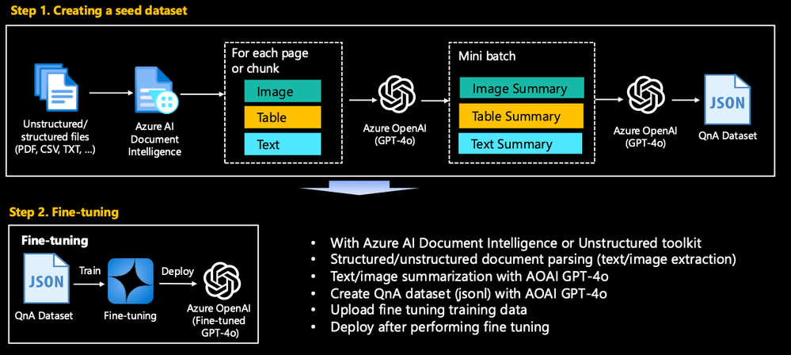
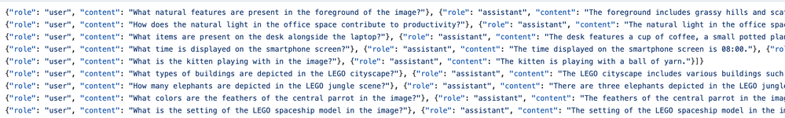
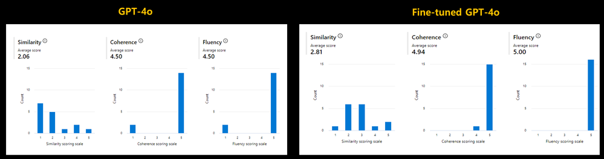
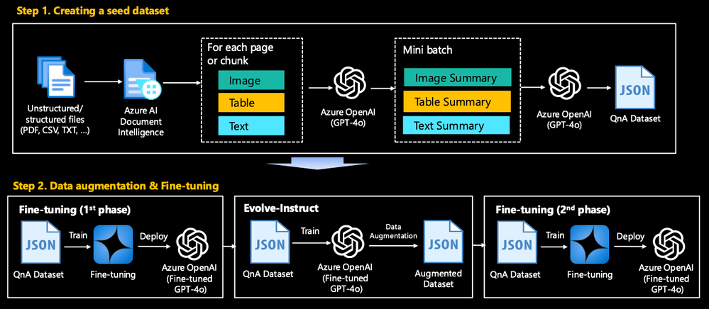
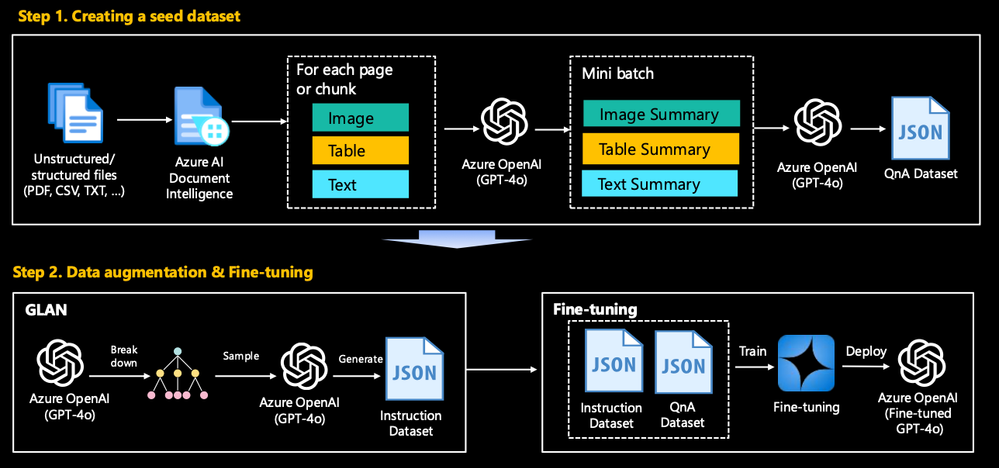
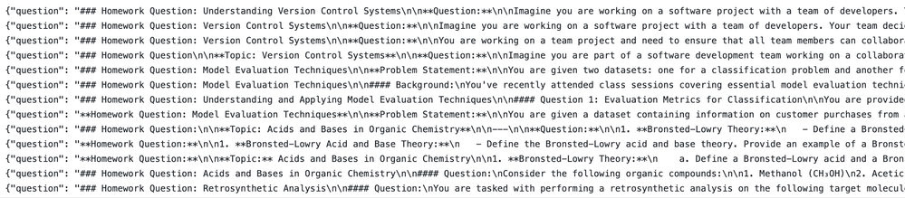
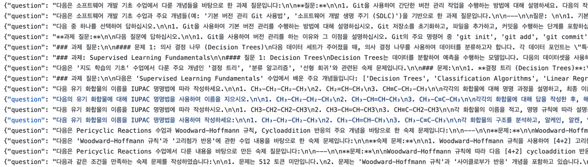

# Generate Synthetic QnAs from Real-world Data on Azure

## 1. Background <a href="#community-4202053-toc-hid-1223282387" id="community-4202053-toc-hid-1223282387"></a>

***

In the rapidly evolving field of Generative AI, SLM/LLM fine-tuning and implementing RAG (Retrieval-Augmented Generation) techniques have become essential for achieving high-performance and domain-specific applications. Creating synthetic datasets for these purposes is crucial as it allows for the generation of tailored training data that addresses specific gaps and nuances in the target domain, which might not be adequately covered by existing datasets. This approach enhances the model's ability to understand and generate relevant and accurate information, ultimately leading to more robust, reliable, and context-aware AI systems that can better serve users' needs in specialized areas.

Generating high-quality datasets from diverse formats of raw data, such as PDFs, CSVs, and TXTs, especially those containing a mix of images, tables, and text, presents several significant challenges. This is mainly because the extraction process itself is complex, as each format requires different parsing techniques to accurately retrieve and interpret the content. PDFs, for instance, can have varied structures and may not follow a standardized layout, making it difficult to consistently extract text and images. Additionally, handling tables within PDFs is particularly challenging because they can span multiple pages and have complex cell structures.

If you want to improve the performance of your model using a seed dataset generated from raw data as a baseline, you may need data augmentation to generate high-quality synthetic data. But there is a risk of introducing biases or inconsistencies during the augmentation process. Augmented data needs to be representative of the diversity and variability present in the real-world data. If not carefully managed, augmentation can lead to overfitting, where the model performs well on augmented data but poorly on actual data, or it can amplify existing biases in the dataset. In this blog, we share in detail the methodology and code snippets that will help you solve these challenges.

## 2. Constructing a Seed Dataset <a href="#community-4202053-toc-hid-543224017" id="community-4202053-toc-hid-543224017"></a>

***

<figure><figcaption></figcaption></figure>

### 2.1. Overview <a href="#community-4202053-toc-hid-147337457" id="community-4202053-toc-hid-147337457"></a>

The task is to preprocess and convert this heterogeneous data into a structured format suitable for fine-tuning or RAG. This includes extracting and cleaning text from a variety of file formats and, where necessary, converting tables and images to text using AI services represented by [Azure AI Document Intelligence](https://azure.microsoft.com/en-us/products/ai-services/ai-document-intelligence). This dataset is used as a seed dataset for fine-tuning or RAG and serves as a baseline to improve the performance of domain-specific use cases. Here is an easy to follow hands-on for you based on a typical use case. All of this code is uploaded [here](https://github.com/Azure/synthetic-qa-generation/tree/main/seed).

#### **PDF** <a href="#community-4202053-toc-hid-969555532" id="community-4202053-toc-hid-969555532"></a>

* `make_qa_multimodal_pdf_docai.ipynb`: (Recommended) Generate QnA synthetic dataset from a Complex PDF using Azure AI Document Intelligence.
* `make_qa_multimodal_pdf_oss.ipynb`: Generate QnA synthetic dataset from a Complex PDF using Open source (Unstructured toolkit for this hands-on). To run this file, you first need to install the required packages with `startup_unstructured.sh`. The installation will take a few minutes.
* `make_qa_only_image_multiple_pdf.ipynb`: Generate QnA synthetic dataset from multiple PDFs - Image-heavy PDF.
* `make_qa_only_image_pdf.ipynb`: Generate QnA synthetic dataset from a PDF - Image-heavy PDF.

#### **CSV** <a href="#community-4202053-toc-hid-1517957301" id="community-4202053-toc-hid-1517957301"></a>

* `make_qa_csv.ipynb`: This is the general case. It is not difficult to create a QnA dataset by reading and chunking with CSVLoader.
* `make_qa_image_url_csv.ipynb`: This is another common case. If image url information is included, change this url to a summary result for that image.

Let's take a look at the contents of the most representative `make_qa_multimodal_pdf_docai.ipynb`.

### 2.2. Separate the PDF pages <a href="#community-4202053-toc-hid-300000266" id="community-4202053-toc-hid-300000266"></a>

Separate the PDF pages into "Text", "Image", and "Mixed" with text, image, and table by using `analyze_pdf_page_content(...)`

```python
def analyze_pdf_page_content(pdf_path, text_length_thres=600):
    document = fitz.open(pdf_path)
    page_analysis = defaultdict(list)

    for page_num in range(len(document)):
        page = document.load_page(page_num)
        text = page.get_text("text")
        image_list = page.get_images(full=True)

        text_length = len(text)
        num_images = len(image_list)

        if text_length > text_length_thres and num_images == 0:
            content_type = 'Text'
        elif text_length <= text_length_thres and num_images > 0:
            content_type = 'Image'
        else:
            content_type = 'Mixed'            

        page_analysis[content_type].append(page_num)

    return dict(page_analysis)
```

* **Text-heavy page** can be processed with open source (e.g., PyMuPDF) without the need to use toolkits like Azure AI Document Intelligence or Unstructured.
* **Image-heavy page** can be converted the entire page to images and let a multimodal LLM like Azure OpenAI GPT-4o summarize each page.
* **Mixed page** uses Azure AI Document Intelligence to separate images, text, and tables. Azure Document Intelligence's built-in models offer key features for document analysis, including:
  1. **Text Extraction:** Identifies and extracts text from various document types.
  2. **Table Recognition:** Detects and extracts table structures.
  3. **Selection Marks:** Recognizes checkboxes and radio buttons.
  4. **Form Field Recognition:** Extracts fields from forms.
  5. **Document Structure Understanding:** Differentiates between titles, headers, footers, and other sections.
  6. **Multi-language Support:** Handles documents in multiple languages.
  7. **SDK and REST API Integration:** Provides tools for seamless integration into applications.

For more details, visit [Microsoft's AI Document Intelligence official page](https://learn.microsoft.com/en-us/azure/ai-services/document-intelligence/concept-layout?view=doc-intel-4.0.0\&tabs=sample-code).

### 2.3. Mixed page processing <a href="#community-4202053-toc-hid-2053827843" id="community-4202053-toc-hid-2053827843"></a>

Now let's look at how to extract information from mixed pages in detail.

* Extract mixed pages as prebuilt-layout models and convert them to markdown -`document_intelligence_client.begin_analyze_document("prebuilt-layout", output_content_format=ContentFormat.MARKDOWN, ...)`
* Extract images using bounding boxes (x, y, w, h) stored in figure tags - `crop_image_from_file(...)`. If the bounding box size is too small (`is_bounding_box_larger_than(...)`) or the image is a simple pattern with no meaning (`image_complexity(...)`), the image is not extracted.
* Summarize the extracted images with GPT-4o. (`understand_image_with_gpt(...)`). Please note that if you need to make your dataset public, you must use the open source LLM and not OpenAI's model.

Here is a code snippet that summarizes this briefly. Note that the actual implementation is more complex than this.

```python
# Import necessary functions for processing
from util.preprocess import (
    image_complexity, is_bounding_box_larger_than, crop_image_from_file, 
    understand_image_with_gpt, update_figure_description
)
    
if "Mixed" in analyzed_pdf_result:
    pdf_mixed_path = path_to_mixed_pdf

    # Open and analyze the PDF file with Azure Document Intelligence
    with open(pdf_mixed_path, "rb") as file:
        poller = document_intelligence_client.begin_analyze_document(
            "prebuilt-layout", analyze_request=file, content_type="application/octet-stream", 
            output_content_format=ContentFormat.MARKDOWN 
        )

    result = poller.result()
    md_content = result.content

    output_folder = "pdf_mixed_tmp"
    delete_folder_and_make_folder(output_folder)
    input_file_path = file_path

    if result.figures:
        for idx, figure in enumerate(result.figures):
            figure_content = ""
            img_description = ""

            # Extract figure content from markdown
            for span in figure.spans:
                figure_content += md_content[span.offset:span.offset + span.length]
			
            for region in figure.bounding_regions:
                boundingbox = extract_bounding_box(region)
                # Extract images only when the bounding box size is greater than a certain size.
                if is_bounding_box_larger_than(boundingbox):
                    cropped_image = crop_image_from_file(input_file_path, region.page_number - 1, boundingbox)
                    # Extract images only when the image complexity is high.
                    if image_complexity(cropped_image) == "Complex":
                        cropped_image_filename = save_cropped_image(cropped_image, idx, input_file_path, output_folder)
                        try:
                            image_summarization = understand_image_with_gpt(client, aoai_deployment_name, cropped_image_filename, "", max_tokens, language)
                        except openai.BadRequestError:
                            image_summarization = ""
                        img_description += image_summarization
						# Update the figure tag in the extracted markdown document
            md_content = update_figure_description(md_content, img_description, idx)
```

`image_complexity(...)` assesses the complexity of an image by analyzing its histogram entropy, Laplacian variance, and edge count. It converts the image to a format suitable for [OpenCV](https://opencv.org/) processing, calculates the entropy of the color histograms, the variance of the Laplacian to measure focus, and the number of edges detected by the [Canny edge detector](https://en.wikipedia.org/wiki/Canny_edge_detector). Based on these metrics, it classifies the image as either **"Complex"** or **"Simple"** depending on predefined threshold values for each metric. The code snippet is below.

```python
# Function to calculate complexity using variance of Laplacian and Canny edge detection
def image_complexity(img, laplacian_var_thres=500, edge_count_thres=10000, total_entropy_thres=5.0):
    
    if isinstance(img, Image.Image):
        img = cv2.cvtColor(np.array(img), cv2.COLOR_RGB2BGR)

    ##### Histogram entropy
    hist_b = cv2.calcHist([img], [0], None, [256], [0, 256])
    hist_g = cv2.calcHist([img], [1], None, [256], [0, 256])
    hist_r = cv2.calcHist([img], [2], None, [256], [0, 256])
    
    # Normalize the histograms
    hist_b /= hist_b.sum()
    hist_g /= hist_g.sum()
    hist_r /= hist_r.sum()
    
    # Calculate histogram entropy
    entropy_b = -np.sum(hist_b * np.log2(hist_b + 1e-7))
    entropy_g = -np.sum(hist_g * np.log2(hist_g + 1e-7))
    entropy_r = -np.sum(hist_r * np.log2(hist_r + 1e-7))
    
    # Total entropy
    total_entropy = entropy_b + entropy_g + entropy_r

    ### Laplacian variance
    gray_img = cv2.cvtColor(img, cv2.COLOR_BGR2GRAY)
    laplacian_var = cv2.Laplacian(gray_img, cv2.CV_64F).var()
    
    ### Canny edge detection
    edges = cv2.Canny(gray_img, 100, 200)
    edge_count = np.sum(edges > 0)

    if laplacian_var_thres > laplacian_var_thres or edge_count > edge_count_thres or total_entropy > total_entropy_thres:
        return "Complex", laplacian_var, edge_count, total_entropy
    else:
        return "Simple", laplacian_var, edge_count, total_entropy
```

### 2.4. Construct QnA Pairs <a href="#community-4202053-toc-hid-246373380" id="community-4202053-toc-hid-246373380"></a>

We can leverage the `azure-ai-generative` package. The `QADataGenerator` class in this package makes it easy to generate QnA synthetic questions. However, using this class as is has the disadvantage of not being able to use custom prompts, so we inherited from it and created the `CustomQADataGenerator` class as follows.

```python
import os
from azure.ai.generative.synthetic.qa import QADataGenerator, QAType
from typing import Dict, List, Tuple, Any, Union, Optional
from azure.ai.generative._telemetry import ActivityType, monitor_with_activity, ActivityLogger

activity_logger = ActivityLogger(__name__)
logger, module_logger = activity_logger.package_logger, activity_logger.module_logger

class CustomQADataGenerator(QADataGenerator):
    def __init__(self, templates_dir: str, **kwargs):
        self.templates_dir = templates_dir
        super().__init__(**kwargs)
        
    def _get_template(self, filename) -> str:
        logger.debug("Getting prompt template from %s file", filename)
        filepath = os.path.join(self.templates_dir, filename)
        with open(filepath, encoding="utf-8") as f:
            template = f.read()
        return template
    
    def _get_messages_for_qa_type(self, qa_type: QAType, text: str, num_questions: int) -> List:
        logger.debug("Getting prompt messages for %s QA type", qa_type)
        template_filename = {
            QAType.SHORT_ANSWER: "prompt_qa_short_answer.txt",
            QAType.LONG_ANSWER: "prompt_qa_long_answer.txt",
            QAType.BOOLEAN: "prompt_qa_boolean.txt",
            QAType.SUMMARY: "prompt_qa_summary.txt",
            QAType.CONVERSATION: "prompt_qa_conversation.txt",
        }
        filename = template_filename[qa_type]
        messages = self._get_messages_from_file(filename)
        input_variables: Dict[str, Any] = {"text": text}
        if qa_type == QAType.SUMMARY:
            input_variables["num_words"] = 100
        else:
            input_variables["num_questions"] = num_questions
        messages[-1]["content"] = messages[-1]["content"].format(**input_variables)
        return messages
    
    def _get_messages_for_modify_conversation(self, questions: List[str]) -> List:
        messages = self._get_messages_from_file("prompt_qa_conversation_modify.txt")
        questions_str = "\n".join([f"[Q]: {q}" for q in questions])
        messages[-1]["content"] = messages[-1]["content"].format(questions=questions_str)
        return messages
```

All you have to do is put your own prompts into a text file and you're done. There are some prompt examples at this [link](https://github.com/Azure/slm-innovator-lab/tree/main/1_synthetic-qa-generation/seed/prompt_template).

Now, you can easily create a QnA dataset for fine-tuning using the code snippet below. Of course, you can also use it for RAG with just a little modification of the code.

```python
import os
import asyncio
from collections import Counter
from typing import Dict
from azure.ai.generative.synthetic.qa import QAType
from util.qa import CustomQADataGenerator

model_config = {
    "deployment": os.getenv("AZURE_OPENAI_DEPLOYMENT_NAME"),
    "model": "gpt-4o",
    "max_tokens": 2000,
}

qa_generator = CustomQADataGenerator(model_config=model_config, templates_dir=f"./prompt_template/{LANGUAGE_CODE}")

concurrency = 6  # number of concurrent calls
sem = asyncio.Semaphore(concurrency)

#qa_type = QAType.CONVERSATION
qa_type = QAType.LONG_ANSWER

async def generate_async(text: str) -> Dict:
    async with sem:
        return await qa_generator.generate_async(
            text=text,
            qa_type=qa_type,
            num_questions=3,  # Number of questions to generate per text
        )
input_batch = mixed_chunks + text_chunks + image_summaries
results = await asyncio.gather(*[generate_async(text) for text in input_batch], return_exceptions=True)

question_answer_list = []
token_usage = Counter()
for result in results:
    if isinstance(result, Exception):
        raise result  # exception raised inside generate_async()
    question_answer_list.append(result["question_answers"])
    token_usage += result["token_usage"]

print("Successfully generated QAs")
```

The screenshot below is a Q\&A result extracted from sample raw data, you can see sample results in this [folder](https://github.com/Azure/synthetic-qa-generation/tree/main/seed/samples), all of the sample raw data is based on articles I have written or data I have generated using Llama3, so there are no license issues. If you are doing a PoC/MVP, please prepare your own dataset.

<figure><figcaption></figcaption></figure>

Below is a comparison of the results before and after fine tuning of GPT-4o without RAG for a Korea customer PoC. GPT-4o is available to a small number of customers as a private preview as of July 2024. This is the result of creating a set of 16 questions and answers for PoC and comparing three indicators of **Similarity, Coherence, and Fluency** in [Azure AI studio](https://azure.microsoft.com/products/ai-studio). The values of the indicator are on a scale of 1-5, with higher values being better.

<figure><figcaption></figcaption></figure>

## 3. Synthetic Data Generation <a href="#community-4202053-toc-hid-1690163802" id="community-4202053-toc-hid-1690163802"></a>

***

After fine-tuning with the generated dataset from the above section, a baseline was established, but the performance requires improvement due to a lack of data (e.g., there are only 1,000 samples in the dataset). In this case, a synthetic dataset must be created by applying data augmentation techniques to enhance performance. The data augmentation technique utilizes the representative techniques announced by Microsoft: Evol-Instruct, GLAN (Generalized Instruction Tuning), and Auto Evol-Instruct.

* **Evol-Instruct:** Generate diverse instructional data to augment the dataset from the seed datset.
* **GLAN:** Apply generalized instruction tuning to expand the variety of Q\&A pairs.
* **Auto Evol-Instruct:** Automate the generation of synthetic data to scale the augmentation process.

### 3.1. Augment your dataset - Evol-Instruct <a href="#community-4202053-toc-hid-881022713" id="community-4202053-toc-hid-881022713"></a>

<figure><figcaption></figcaption></figure>

The Evol-Instruct concept developed by Microsoft aims to enhance the capabilities of LLMs by automatically evolving instructions to various complexity levels, instead of relying solely on manually created instructions. This method involves several key components and steps:

* **Instruction Evolution**: Starting with an initial set of instructions, the model uses a LLM like GPT-4o to iteratively rewrite these instructions into more complex versions. The evolution process involves two types of instruction enhancement: in-depth evolving (adding constraints, deepening, increasing reasoning steps) and in-breadth evolving (generating new, diverse instructions).
* **Response Generation**: After evolving the instructions, the LLM generates responses to these newly complex instructions, ensuring that they are reasonable and understandable by humans.
* **Instruction Elimination**: The process includes a step to filter out any instructions that fail to evolve properly, ensuring only high-quality, challenging instructions remain.

This open-source implementation is based on the [WizardLM paper](https://arxiv.org/abs/2304.12244) and [h2o-wizardlm.](https://github.com/h2oai/h2o-wizardlm) We added the following features to the original implementation:

* Modified it to be able to call Azure OpenAI by adding the `AzureGPTPipeline` class.
* The prompt has been refined and modified to support multiple languages. Use `--language` argument for other language. (e.g., `--language Korean`)
* Made it possible to create questions only when necessary. A better strategy is to create questions and answers separately. Use `--question_only` argument. (e.g., `--question_only True`)
* Prevented infinite loop. `mutate(...)` in the original implementation determines the validity of the augmented statement and repeats the loop until it is valid. However, this process takes a very long time and there is a problem in that the loop repeats infinitely in certain situations.

You can easily convert your jsonl file from the previous section with [convert.py](https://github.com/Azure/synthetic-qa-generation/blob/main/evolve-instruct/convert.py) and augment your dataset with [evolve.py](https://github.com/Azure/synthetic-qa-generation/blob/main/evolve-instruct/evolve.py).

```applescript
#!/bin/bash

INPUT_FILE="../seed/samples/advertising-oai.jsonl"
SEED_FILE="seed.jsonl"
COLUMN_NAMES="Instruction"
NUM_ROWS=10
MAX_LEN_CHARS=256

python convert.py --input_file "$INPUT_FILE" --output_file "$SEED_FILE
python evolve.py --seed_file "$SEED_FILE" --column_names "$COLUMN_NAMES" --num_rows "$NUM_ROWS" --max_len_chars "$MAX_LEN_CHARS"
```

Seed instruction - after running `convert.py`

```applescript
{"idx": 1, "Skill": "Distributed training on Cloud", "Difficulty": 5, "Instruction": "What version of TensorFlow was used in the evaluation?"}
{"idx": 2, "Skill": "Distributed training on Cloud", "Difficulty": 5, "Instruction": "What is the first step to prepare the validation set for ImageNet training?"}
{"idx": 3, "Skill": "Distributed training on Cloud", "Difficulty": 5, "Instruction": "What is the purpose of the script 'preprocess_imagenet.py' and how is it executed?"}
```

Synthetic instruction - after running `evolve.py` (shows only 10 samples)

```applescript
[
  {
    "input": "Could you determine the specific learning rate value (LR) recorded at the 7000th iteration within the hvd_train_log?"
  },
  {
    "input": "Can you provide the accuracy and precision metrics recorded at epoch 37 in the model training logs?"
  },
  {
    "input": "Could you elaborate on the process and specific steps needed to resize the TFRecord training dataset for ImageNet utilizing the provided scripts, including any potential challenges and solutions?"
  },
  {
    "input": "Could you outline the sequential procedures to be followed post-data transformation to ensure both the reliability of data backup and its continuous availability, requiring detailed verification and contingency planning?"
  },
  {
    "input": "Could you explain the primary function and broader implications of using the 'nohup' command, especially in the context of manually downloading the extensive ImageNet dataset, along with potential advantages and disadvantages?"
  },
  {
    "input": "What is the purpose of using the 'nohup' command when manually downloading the ImageNet dataset?"
  },
  {
    "input": "Can you explain the rationale behind not performing the resizing to 224x224 for the RecordIO format, and discuss any potential consequences and alternatives?"
  },
  {
    "input": "What are the underlying reasons that make a supplementary EBS volume of 1.0TB advisable for efficiently handling the ImageNet dataset? Please elaborate on the factors involved."
  },
  {
    "input": "Taking into account both cost-efficiency and performance, what is the recommended EC2 instance type for storing the ImageNet dataset and why?"
  },
  {
    "input": "What is the purpose of the script 'preprocess_imagenet.py' and how is it executed?"
  }
]
```

Example datasets are placed in this [folder](https://github.com/Azure/synthetic-qa-generation/blob/main/seed/samples). Please try the minimal example first and configure your dataset by referring to the tunable parameters.

### 3.2. Improve the generalizability of your model - GLAN <a href="#community-4202053-toc-hid-200964343" id="community-4202053-toc-hid-200964343"></a>

<figure><figcaption></figcaption></figure>

&#x20;Catastrophic forgetting, also known as catastrophic interference, occurs during SLM/LLM fine-tuning when a model trained on new data overwrites the knowledge it previously acquired, leading to a significant drop in performance on earlier tasks. This issue is particularly prominent in scenarios where the model needs to adapt to diverse and potentially conflicting data distributions without losing its ability to perform well on initial tasks.

GLAN (Generalized Instruction Tuning) addresses catastrophic forgetting by leveraging a systematically curated taxonomy of human knowledge to generate synthetic, diverse, and comprehensive instruction datasets. Specifically, GLAN uses a pre-curated taxonomy of human knowledge and capabilities to generate large-scale, diverse instruction data across various disciplines. This taxonomy mirrors the systematic structure of human education, breaking down knowledge into fields, sub-fields, and distinct disciplines, which are then used to design syllabi for different subjects. These syllabi detail key concepts for each class session, enabling the generation of diverse and comprehensive instructions. Here is GLAN's key features:

* **Taxonomy Creation**: A detailed hierarchy of human knowledge is built using LLMs and human verification.
* **Subject and Syllabus Generation**: LLMs generate a list of subjects and detailed syllabi, breaking down subjects into class sessions with key concepts.
* **Instruction Generation**: Homework questions and their answers are generated based on the syllabi, ensuring broad coverage and diversity.

We have implemented the concept of this paper from the scratch and made it public. Let's take a look at the core concepts of the code.

* `generate_taxonomy(...)`: Generate a taxonomy of human knowledge and capabilities.
* `generate_subjects(...):` Generate a list of subjects for a given discipline. Please refer to section 2.2 of the paper.
* `generate_syllabus(...)`: Generate a syllabus for a given subject at a specific level. Please refer to section 2.3 of the paper.
* `sample_class_sessions_and_key_concepts(...)`: Sample class sessions and key concepts to generate questions of varying difficulty.
* `generate_questions(...)`: Generate questions based on class sessions and key concepts using LangChain pipeline. Please refer to section 2.4 of the paper.
* `generate_answers(...)`: Generate answers to the questions using LangChain pipeline. Please refer to section 2.4 of the paper.
* `glan_instruction_generation(...)`: GLAN pipeline

This pseudo-code for `glan_instruction_generation(...)` outlines the steps of generating or loading disciplines, generating subjects and syllabi for each discipline, creating questions based on the syllabi, saving the questions, and optionally generating and saving answers to create a comprehensive instruction dataset.

```python
def glan_instruction_generation(args):

    if args.generate_disciplines:
        taxonomy_json, disciplines = generate_taxonomy(
            max_number_of_fields=args.max_number_of_fields,
            model_name=args.model_name
        )
    else:
        disciplines = read_text_to_list(args.disciplines_filepath)

    all_questions = []
    for discipline in disciplines:
        subjects_json = generate_subjects(
            discipline,
            max_number_of_subjects=args.max_number_of_subjects,
            max_number_of_subtopics=args.max_number_of_subtopics,
            model_name=args.model_name
        )
        for subject_info in subjects_json["subjects"]:
            subject = subject_info['subject']
            level = subject_info['level']
            subtopics = ", ".join(subject_info['subtopics'])

            class_sessions, key_concepts = generate_syllabus(
                subject, level, subtopics,
                max_number_of_session_name=args.max_number_of_session_name,
                model_name=args.model_name
            )

            questions = generate_questions(
                class_sessions, key_concepts,
                subject, level, subtopics,
                model_name=args.model_name,
                num_iterations=args.num_iterations,
                num_questions_per_iteration=args.num_questions_per_iteration,
                max_tokens=args.question_max_tokens,
                batch_size=args.question_batch_size,
                language=args.language
            )
            all_questions.extend(questions)

    save_questions(all_questions, args.output_dir, args.language)

    if not args.generate_question_only:
        all_answers = generate_answers(
            all_questions,
            model_name=args.model_name_for_answer,
            max_tokens=args.answer_max_tokens,
            batch_size=args.answer_batch_size
        )
        save_instructions(all_questions, all_answers, args.output_dir, args.language)
```

This implementation supports all languages supported by LLM, so you can easily create datasets in your country's language. Below is an example created with this code.

**English language**

<figure><figcaption></figcaption></figure>

**Korean language**

<figure><figcaption></figcaption></figure>

Example datasets are placed in this [folder](https://github.com/Azure/synthetic-qa-generation/tree/main/glan-instruct/samples). Please try the minimal example first and configure your dataset by referring to the tunable parameters.

The code snippet below is a shell script that generates a large synthetic dataset. If you are willing to pay enough Azure OpenAI PTUs (Provisioned Throughput Units), you can create your own datasets just by running this script.&#x20;

```applescript
# Initialize counter
counter=1

# Read disciplines.txt line by line
while IFS= read -r line || [[ -n "$line" ]]; do
    # Create the corresponding disciplines file
    discipline_file="disciplines_line${counter}.txt"
    echo Created "$discipline_file"
    echo "$line" > "$discipline_file"

    # # Run the Python script with the current disciplines file
    python generate.py \
        --disciplines_filepath "$discipline_file" \
        --language Korean \
        --max_number_of_subjects 15 \
        --max_number_of_subtopics 30 \
        --max_number_of_session_name 30 \
        --num_iterations 15 \
        --num_questions_per_iteration 18 \
        --question_max_tokens 1024 \
        --question_batch_size 9 \
        --model_name_for_answer gpt-4o \
        --answer_max_tokens 2048 \
        --answer_batch_size 9

    # Increment counter
    ((counter++))

    # Delete the temporary disciplines file
    rm "$discipline_file"

done < disciplines_sample.txt
```

_Disclaimer: The code the author published uses Azure OpenAI, but the dataset created with Azure OpenAI cannot be publicly released due to policy. The author will create a dataset with Llama3.1, which has no license issues, and release it on Hugging Face._

## 4. Conclusion <a href="#community-4202053-toc-hid-2137501525" id="community-4202053-toc-hid-2137501525"></a>

***

In the realm of Generative AI, creating and augmenting datasets for fine-tuning SLM/LLM models is a crucial step to ensure robust, reliable, and context-aware AI systems. This blog post outlined the process of constructing a seed dataset from diverse raw data formats and then applying data augmentation techniques such as Evol-Instruct and GLAN to enhance the dataset's quality and diversity. These techniques help mitigate the challenges of extracting high-quality data from complex formats like PDFs and CSVs and prevent issues such as catastrophic forgetting during the fine-tuning process.

By leveraging advanced methods like GLAN, we can systematically generate comprehensive instruction datasets across various disciplines, enhancing the model's performance without compromising previously learned knowledge. This approach not only improves the generalizability of the model but also ensures that it can handle a wide range of complex tasks effectively.

For those interested in exploring these techniques further and implementing them in their projects, all the code and examples discussed in this blog are available on the [Azure synthetic-qa-generation GitHub repository](https://github.com/Azure/synthetic-qa-generation). This resource provides a practical guide and tools to generate high-quality QnA datasets, enabling you to fine-tune and optimize your AI models for specialized applications. By following the methodologies and utilizing the tools provided, developers and data scientists can create robust datasets that significantly enhance the capabilities of their AI models, paving the way for more advanced and reliable AI solutions in various domains.

**Start your end-to-end fine-tuning journey with this code:** [**https://github.com/Azure/synthetic-qa-generation**](https://github.com/Azure/synthetic-qa-generation)&#x20;

## References <a href="#community-4202053-toc-hid-1457443155" id="community-4202053-toc-hid-1457443155"></a>

***

* End-to-end hands-on labs: [https://github.com/Azure/synthetic-qa-generation](https://github.com/Azure/synthetic-qa-generation)
* Evolve-Instruct paper: [https://arxiv.org/abs/2304.12244](https://arxiv.org/abs/2304.12244)
* GLAN paper: [https://arxiv.org/abs/2402.13064](https://arxiv.org/abs/2402.13064)
* Auto Evolve-Instruct paper: [https://arxiv.org/abs/2406.00770](https://arxiv.org/abs/2406.00770)
