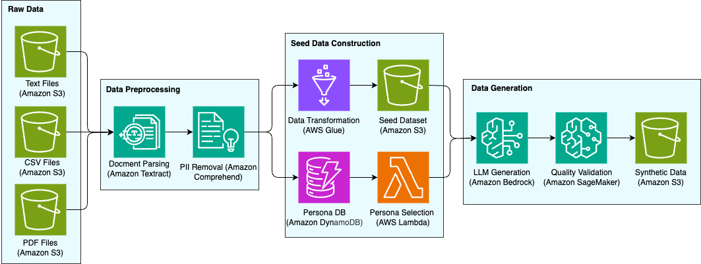

# Seed Data-Based Synthetic Data Generation Approach

#### Content Level: 200-300

## Suggested Pre-Reading

* [The Necessity of Synthetic Data: Core Requirements for Modern AI Development](the-necessity-of-synthetic-data.md)

## TL;DR

Seed 데이터 기반 접근법은 기존에 보유한 데이터(“Seed 데이터”)를 활용하여 특정 도메인이나 _페르소&#xB098;_&#xC5D0; 특화된 합성 데이터를 생성하는 방법입니다. 이 접근을 통해 모델은 실제 도메인 지식을 반영한 데이터로 학습할 수 있으며, 특히 고객 서비스 챗봇이나 도메인 전문 QA 시스템처럼 **특정 영역에 최적화된 AI**를 훈련할 때 유용합니다. 우선 사용자가 보유한 원천 데이터에서 핵심 정보를 추출하고, [**Scaling Synthetic Data Creation with 1,000,000,000 Personas**](https://arxiv.org/abs/2406.20094) 논문의 기법을 참고해 **태스크 특화 페르소나**를 정의한 뒤, 이를 토대로 최신 LLM을 활용하여 새로운 데이터를 만들어냅니다.

**적용 시나리오:**

* **고객 서비스 챗봇 훈련 데이터**: 기업의 FAQ, 고객 문의 이력을 기반으로 다양한 고객 상황별 대화 데이터 생성
* **도메인 특화 QA 시스템**: 의료, 법률, 금융 등 전문 분야의 문서를 기반으로 한 질의응답 데이터셋 구축
* **개인화된 콘텐츠 생성**: 사용자 선호도와 행동 패턴을 반영한 맞춤형 콘텐츠 생성
* **특정 업계/직군 맞춤형 AI 어시스턴트**: 업계별 용어, 프로세스, 규정을 반영한 전문 AI 어시스턴트 훈련

## 1. Seed 데이터 준비 및 추출

먼저 사용자가 가진 원천 데이터(raw data)에서 모델 학습에 활용할 seed 데이터를 구축합니다. 원천 데이터는 PDF, TXT, CSV, 이미지 등 다양한 포맷일 수 있으며, 이를 일관된 텍스트/QA 형태로 변환해야 합니다. 이 과정에서는 각 포맷별로 다른 파싱 기법이 필요하며, 특히 PDF처럼 **텍스트와 이미지, 표가 혼재**된 문서는 내용 추출이 복잡한 작업입니다 . 예를 들어 PDF 문서에서는 OCR(광학 문자 인식)을 통해 텍스트를 추출하고, 표는 구조를 파악하여 텍스트화하며, 이미지에 담긴 정보는 별도의 설명을 생성해야 할 수 있습니다. 실제 사례로, [Unstructured](https://github.com/Unstructured-IO/unstructured) 같은 도구를 이용해 **PDF의 텍스트/표/이미지를 분리 추출하고**, 이를 기반으로 Q\&A 페어를 생성하는 노트북 예제가 공개되어 있습니다 . 이처럼 seed 데이터 준비 단계에서는:

* 원천 데이터로부터 중요한 내용을 식별하고 추출
* 필요한 경우 정형화: 예를 들어 문서를 요약하거나 문단별로 **질문-답변 쌍**을 생성
* 다양한 포맷을 통합 처리해 모델 입력용 **구조화 데이터셋** 확보

이 단계의 결과는 도메인 지식이 함축된 **Seed QA 데이터셋**입니다. 예컨대 회사 매뉴얼 PDF 여러 개를 처리해 Q\&A 리스트를 만들거나, 제품 설명서에서 자주 물을 법한 질문들을 생성해볼 수 있습니다. Seed 데이터셋은 이후 합성 데이터 생성을 위한 토대이자, 품질 기준 역할을 합니다 (Seed 데이터 자체는 보통 소량이므로 직접 모델 훈련에 모두 쓰이기보다 방향을 제시하는 용도).

## 2. 태스크 특화 페르소나 추출 (Persona 선정)

* 페르소나(Persona)란 데이터 생성 시 모델이 역할을 수행하는 가상의 인물 설정을 뜻합니다. 최근 연구인 \*“10억 페르소나 (Persona Hub)”\*에서는 LLM이 다양한 관점으로 데이터를 생성하도록 **1,000,000,000개의 방대한 페르소나** 모음을 제안하였습니다. 각 페르소나는 고유한 지식, 경험, 관심, 직업을 지닌 캐릭터로 설정되어 있으며, LLM에 특정 페르소나를 부여하면 그 관점에서 **독특한 결과**를 생성할 수 있다고 합니다 . 이를 통해 **동일한 프롬프트**라도 페르소나에 따라 답변 양상이 달라지므로, 대규모로 다양하고 풍부한 합성 데이터를 얻는 것이 가능합니다. Persona Hub 연구에서는 이러한 페르소나들을 웹 데이터로부터 자동 구축하여 거의 모든 관점을 아우르는 합성 데이터를 생성했고, 그 효과로 논리/수학 문제부터 지식 응답, 게임 NPC 대사까지 광범위한 데이터셋을 합성해냈습니다.

그러나 실제로 우리 모델을 파인튜닝할 때 **모든 페르소나를 다 활용**할 수는 없습니다. 불필요하게 방대한 페르소나를 투입하면 오히려 잡음이 될 수 있고, 또 파인튜닝 데이터 규모가 과도해질 수 있습니다. 따라서 **우리의 목표 태스크에 특화된 페르소나**를 **선별 또는 추출**하는 단계가 필요합니다. 방법은 다음과 같습니다:

* **도메인 분석:** Seed 데이터와 대상 도메인을 검토하여, 어떤 유형의 사용자/전문가/캐릭터가 관련 있는지 파악합니다. 예를 들어 금융 도메인이라면 “투자 전문가”, “초보 투자자”, “재무 분석가” 같은 페르소나가 relevant할 수 있습니다. 고객지원 챗봇이라면 “화난 고객”, “친절한 상담원” 등 역할 설정이 도움이 됩니다.
* **페르소나 소스 활용:** Persona Hub와 같은 방대한 페르소나 저장소가 있다면, 거기서 **키워드나 도메인으로 필터링**하여 관련 페르소나를 찾습니다. 연구에 따르면 Persona Hub의 페르소나들은 각기 전세계 지식의 일부분을 담고 있어, 적절한 페르소나를 골라내면 해당 분야 지식을 모델이 끌어내도록 유도할 수 있습니다. 가령 의료 도메인 QA를 만든다면 “내과 의사”, “환자”, “약사” 등의 페르소나를 선택해 대화를 생성하는 식입니다.
* **텍스트 기반 추론:** 만약 별도의 페르소나 데이터가 없다면, seed 데이터 자체에서 **잠재 페르소나**를 추론할 수 있습니다. 예컨대 seed Q\&A를 살펴보고 질문자가 누구인지(고객인지 전문가인지), 답변자는 누구인지(매뉴얼인지 사람인지) 추론하여, 그에 부합하는 페르소나 설정을 정의합니다. 또는 LLM에게 “이 텍스트의 말투나 관점을 분석해보라”고 하여 페르소나를 역추론할 수도 있습니다.

이처럼 **태스크 특화 페르소나 선정**을 거치면, 모델이 생성할 합성 데이터의 말투, 관점, 전문성 수준이 구체화됩니다. 중요한 점은 선택된 페르소나들이 **목표 분야와 연관성**이 높아야 한다는 것입니다. Persona Hub 연구에서도 “모든 사용 사례는 특정 페르소나와 연결지을 수 있다”고 하였듯 , 어떤 작업이든 적절한 페르소나를 붙이면 LLM이 그 역할극(role-play)을 통해 관련 지식을 이끌어낼 수 있습니다. 다만, 너무 엉뚱한 페르소나(예: 금융 데이터 생성에 요리사 페르소나)는 피해야 하며, **페르소나 다양성**과 **현실성** 사이에서 균형을 잡습니다.

아래는 태스크 특화 페르소나를 생성하는 코드 스니펫입니다.

```python
import random
from typing import List, Dict

class PersonaGenerator:
    def __init__(self):
        self.persona_templates = {
            'professional': [
                "A {experience_level} {profession} working in {industry}",
                "An expert {profession} with {years} years of experience in {specialty}",
                "A {profession} specializing in {domain} at a {company_size} company"
            ],
            'demographic': [
                "A {age_group} {gender} from {location}",
                "Someone with {education_level} education background",
                "A {lifestyle} person interested in {interests}"
            ],
            'behavioral': [
                "Someone who prefers {communication_style} communication",
                "A {personality_trait} individual who values {values}",
                "A person with {technical_proficiency} technical skills"
            ]
        }
        
        self.attributes = {
            'experience_level': ['junior', 'mid-level', 'senior', 'expert'],
            'profession': ['doctor', 'lawyer', 'engineer', 'teacher', 'consultant'],
            'industry': ['healthcare', 'technology', 'finance', 'education', 'retail'],
            'years': ['2-5', '5-10', '10-15', '15+'],
            'specialty': ['data analysis', 'customer service', 'project management'],
            'company_size': ['startup', 'mid-size', 'enterprise'],
            'age_group': ['young adult', 'middle-aged', 'senior'],
            'gender': ['male', 'female', 'non-binary'],
            'location': ['urban', 'suburban', 'rural'],
            'education_level': ['high school', 'bachelor\'s', 'master\'s', 'PhD'],
            'communication_style': ['direct', 'diplomatic', 'casual', 'formal'],
            'personality_trait': ['analytical', 'creative', 'detail-oriented', 'big-picture'],
            'technical_proficiency': ['basic', 'intermediate', 'advanced', 'expert']
        }
    
    def generate_task_specific_personas(self, task_domain: str, 
                                      num_personas: int = 100) -> List[Dict]:
        """태스크 도메인에 특화된 페르소나 생성"""
        personas = []
        
        for _ in range(num_personas):
            persona = self._create_single_persona(task_domain)
            personas.append(persona)
        
        return personas
    
    def _create_single_persona(self, task_domain: str) -> Dict:
        """단일 페르소나 생성"""
        # 도메인별 특화 속성 선택
        domain_specific_attrs = self._get_domain_attributes(task_domain)
        
        # 랜덤 속성 조합
        selected_attrs = {}
        for attr_type, options in domain_specific_attrs.items():
            selected_attrs[attr_type] = random.choice(options)
        
        # 페르소나 텍스트 생성
        template_type = random.choice(list(self.persona_templates.keys()))
        template = random.choice(self.persona_templates[template_type])
        
        try:
            persona_text = template.format(**selected_attrs)
        except KeyError:
            # 필요한 속성이 없는 경우 기본 페르소나 생성
            persona_text = f"A professional working in {task_domain}"
        
        return {
            'id': f"persona_{random.randint(10000, 99999)}",
            'description': persona_text,
            'attributes': selected_attrs,
            'domain': task_domain
        }
    
    def _get_domain_attributes(self, domain: str) -> Dict:
        """도메인별 특화 속성 반환"""
        base_attrs = dict(self.attributes)
        
        if domain == 'healthcare':
            base_attrs['profession'] = ['doctor', 'nurse', 'pharmacist', 'therapist']
            base_attrs['specialty'] = ['cardiology', 'pediatrics', 'surgery', 'psychiatry']
        elif domain == 'technology':
            base_attrs['profession'] = ['software engineer', 'data scientist', 'product manager']
            base_attrs['specialty'] = ['machine learning', 'web development', 'cybersecurity']
        elif domain == 'finance':
            base_attrs['profession'] = ['financial advisor', 'analyst', 'accountant']
            base_attrs['specialty'] = ['investment', 'risk management', 'taxation']
        
        return base_attrs
```

## 3. 페르소나 기반 합성 데이터 생성 (LLM 활용)

이제 준비된 seed 데이터와 선택한 페르소나 정보를 바탕으로, LLM에 프롬프트를 주어 새로운 합성 데이터를 생성합니다. 현재 공개된 가장 성능 좋은 LLM 모델이나 API(예: Claude Sonnet)를 사용하는 것이 좋으며, 내부적으로는 해당 LLM이 seed 데이터를 잘 **참조**하고 페르소나를 **역할 수행**하게 프롬프트를 설계해야 합니다.

**프롬프트 설계:** 합성할 데이터 형태에 따라 프롬프트 템플릿을 만듭니다. 예를 들어 Q\&A 데이터를 만들고 싶다면:

* 프롬프트 예시: _“다음 정보를 참고하여 \[페르소나: {의학 전문가}]으로서 질문-답변 쌍을 만들어줘. 정보: "{seed 문단}"”_
* 또는 _“너는 {페르소나 설명}. 위 자료를 읽고 사용자가 물을 법한 질문 하나를 생성하고, 그에 대한 답변을 해줘.”_

아래는 좀 더 구체적인 프롬프트 예시입니다.

```python
class PersonaPromptGenerator:
    def __init__(self):
        self.prompt_templates = {
            'question_generation': """
You are {persona_description}.

Based on your background and expertise, generate {num_questions} realistic questions 
that someone like you would ask about {topic}.

Consider your:
- Professional experience and knowledge level
- Communication style and preferences  
- Specific interests and concerns related to {topic}

Format each question clearly and make them diverse in complexity and focus.
""",
            
            'response_generation': """
You are {persona_description}.

A user has asked: "{question}"

Respond as this persona would, considering:
- Your professional background and expertise level
- Your communication style and tone
- Your specific perspective on this topic
- Any domain-specific knowledge you would have

Provide a helpful, authentic response that reflects your persona's characteristics.
""",
            
            'conversation_simulation': """
You are {persona_description}.

Engage in a natural conversation about {topic}. 

Your conversation partner is: {partner_persona}

Start the conversation with a question or comment that your persona would naturally make.
Keep your responses authentic to your background and communication style.
"""
        }
    
    def generate_persona_prompt(self, persona: Dict, 
                              prompt_type: str, **kwargs) -> str:
        """페르소나 기반 프롬프트 생성"""
        template = self.prompt_templates.get(prompt_type)
        if not template:
            raise ValueError(f"Unknown prompt type: {prompt_type}")
        
        prompt_vars = {
            'persona_description': persona['description'],
            **kwargs
        }
        
        return template.format(**prompt_vars)
```

이처럼 **seed 데이터의 내용**을 투입하거나, 또는 seed 데이터에서 추출한 **키워드**만 넣고 질문을 만들어보라고 할 수 있습니다. 페르소나 프로필(예: “45세 경험 많은 내과 의사”)을 프롬프트에 명시하면 LLM이 그 인격을 가장해 답을 생성하게 됩니다. 이를 통해 동일한 seed 정보로도 _다양한 질문과 답&#xBCC0;_&#xC744; 끌어낼 수 있습니다.

**생성 과정:** LLM에게 한두 개의 seed 예시를 **few-shot 예문**으로 보여준 뒤, 새로운 입력에 대해 답변을 생성하도록 유도할 수 있습니다. 또는 seed 없이 zero-shot으로 “페르소나 X라면 이 주제로 어떤 질문을 할까?”를 물어도 됩니다. 중요한 것은 **충분한 다양성**과 **도메인 적합성**입니다. Persona Hub 연구에 따르면 1억 개 이상의 대화 생성에서도 페르소나를 달리하며 다양한 출력이 나왔는데, 특히 LLM의 _“role-play”_ 능력을 활용하면 거의 **모든 데이터 생성 시나리오에 페르소나 기법을 결합**할 수 있다고 합니다.

이 단계에서는 생성된 데이터의 **품질 관리**도 병행해야 합니다. LLM이 가끔 사실과 다른 답을 하거나 맥락에 맞지 않는 질문을 만들 수 있으므로, seed 데이터 대비 **일관성 검증**을 합니다. 간단한 방법으로, LLM에게 자기 자신이 생성한 Q\&A를 다시 검사하도록 시켜볼 수 있습니다 (자세한 방법은 후술하는 “데이터 신뢰성 검증” 참고). 생성 결과 중 명백히 부적절한 것은 제외하면서도, **가능한 한 풍부한 표현과 다양한 난이도**의 Q\&A가 모이도록 조절합니다.

**예시:** 예를 들어 “고객 서비스 챗봇” 용도의 데이터를 합성한다고 하면, seed 데이터로 실제 고객 문의 사례 몇 가지를 준비합니다. 그런 다음 “화난 고객”, “정중한 고객”, “세세한 것을 묻는 고객” 등의 페르소나를 설정해 각기 다른 말투와 관점의 질문을 만들게 하고, 답변은 “친절한 상담원” 페르소나로 작성하게 할 수 있습니다. 이렇게 하면 질문의 톤도 다양해지고 답변 역시 상황에 맞는 뉘앙스를 띠게 됩니다. 결과적으로 seed 데이터 몇 개에서 출발했지만 **다양한 고객 시나리오**의 합성 대화 데이터를 얻어 챗봇을 폭넓게 훈련시킬 수 있습니다.

**출력 데이터 형식:** 최종적으로 얻는 합성 데이터는 처음 기획 단계에서 정의한 **형식**이어야 합니다. Q\&A 페어, 대화, 요약문 등 무엇이든 가능하나, 모델 학습 입력으로 바로 활용할 수 있도록 **구조화**합니다. 예컨대 JSON이나 CSV로 “prompt”와 “response” 칼럼을 만들거나, 파인튜닝 스크립트에 맞는 텍스트 포맷으로 정리합니다.

이상으로 seed 데이터 기반의 페르소나 특화 합성 데이터 생성 과정을 살펴봤습니다. 핵심 요약을 하면: **원천 데이터로 seed을 만들고 → 과업에 맞는 페르소나를 정하고 → LLM으로 다채로운 새 데이터를 키워낸다**는 흐름입니다. 다음은 별도의 seed 없이도 합성 데이터를 만드는 방법, 즉 _시드리스(seedless)_ 접근법을 살펴보겠습니다. 각 접근법의 공통적으로 고려해야 할 사항 (추가 데이터 증강, PII 제거, 검증 등)은 뒤에 따로 정리합니다.

## 4. Seed 데이터 기반 합성 데이터 생성 아키텍처

기존 데이터(PDF, CSV, 텍스트)를 활용해 페르소나 특화 합성 데이터를 생성하는 아키텍처입니다.

전체 데이터 생성 과정은 6단계의 연속적인 파이프라인으로 구성됩니다. 먼저 다양한 형태의 원천 데이터가 Amazon S3에 수집되어 중앙 저장소 역할을 합니다. 수집된 데이터는 Amazon Textract를 통해 텍스트가 추출되고, Amazon Comprehend를 활용하여 개인식별정보(PII)가 자동으로 제거되는 전처리 과정을 거칩니다. 정제된 데이터는 AWS Glue를 통해 질문-답변 형태로 변환되어 구조화된 seed 데이터셋으로 구축됩니다. 이후 AWS Lambda 함수가 seed 데이터의 내용과 맥락을 분석하여 가장 적합한 페르소나를 자동으로 선택하고 매칭합니다. 선택된 페르소나 정보는 Amazon Bedrock으로 전달되어 페르소나의 특성이 반영된 고품질 합성 데이터가 생성됩니다.

생성된 데이터는 Amazon SageMaker의 LLM-as-Judge 기능을 통해 정확성, 완전성, 관련성 등의 다양한 기준으로 품질이 평가됩니다. 최종적으로 품질 검증을 통과한 데이터는 Amazon S3에 저장되고 AWS Glue Data Catalog에 메타데이터와 함께 등록되어 향후 검색과 활용이 용이하도록 자산화됩니다.

<figure><figcaption></figcaption></figure>

_그림 1. Seed-based Synthetic Data Generation Architecture_

> 참고: 이 아키텍처는 설명을 위한 참조 사례이며, 모든 프로덕션 요구 사항을 반영하지 않을 수 있습니다. 실제 구현은 특정 사용 사례, 규모 요구 사항 및 조직의 제약 조건에 따라 더 간단하거나 더 복잡할 수 있습니다. 이 패턴을 적용할 때는 항상 고유한 요구 사항을 고려하십시오.

### 4.1. 원천 데이터 (Raw Data Sources)

* Amazon S3 - 다양한 형태의 원천 데이터 저장
  * **PDF 문서**: 매뉴얼, 보고서, 계약서 등 비정형 문서
  * **CSV 데이터**: 구조화된 테이블 형태의 데이터
  * **텍스트 파일**: 로그, 대화 기록, 문서 등

### 4.2. 데이터 전처리 (Data Preprocessing)

* Amazon Textract - 문서 파싱
  * **OCR 기능**: 스캔된 문서에서 텍스트 추출
  * **구조 인식**: 표, 양식, 키-값 쌍 자동 인식
  * **다국어 지원**: 한글, 영어 등 다양한 언어 처리
* Amazon Comprehend - PII 제거
  * **자동 PII 탐지**: 이름, 주소, 전화번호, 이메일 등 개인정보 식별
  * **신뢰도 점수**: 각 PII 항목에 대한 정확도 제공
  * **마스킹 처리**: 탐지된 PII를 자동으로 마스킹 또는 제거

### 4.3. 시드 데이터 구축 (Seed Data Construction)

* AWS Glue - 데이터 변환
  * **ETL 작업**: 추출된 텍스트를 Q\&A 형태로 변환
  * **데이터 정제**: 중복 제거, 형식 통일, 품질 검증
  * **스키마 진화**: 데이터 구조 변경에 자동 대응
* Amazon S3 - Seed 데이터셋 저장
  * **구조화된 저장**: JSON, Parquet 형태로 정제된 데이터 저장
  * **파티셔닝**: 도메인, 날짜별 효율적 데이터 구조
  * **압축**: 저장 비용 최적화

### 4.4. 페르소나 시스템 (Persona System)

*   Amazon DynamoDB - 페르소나 DB

    * **페르소나 프로필**: 직업, 전문성, 관심사, 말투 등 특성 저장
    * **빠른 조회**: 밀리초 단위 응답 시간
    * **확장성**: 페르소나 수 증가에 따른 자동 확장
    * 페르소나 데이터 구조 예시

    ```json
    {
        "persona_id": "medical_expert_001",
        "name": "의료 전문가",
        "expertise": ["내과", "진단", "치료"],
        "tone": "전문적이고 정확한",
        "background": "15년 경력의 내과 전문의",
        "language_style": "의학 용어 사용, 정확한 설명"
    }
    ```
* AWS Lambda - 페르소나 선택
  * **자동 매칭**: 시드 데이터 내용에 적합한 페르소나 선택
  * **다양성 보장**: 동일한 주제에 대해 다양한 관점 제공
  * **실시간 처리**: 빠른 페르소나 선택 및 할당

### 4.5. 데이터 생성 (Data Generation)

* Amazon Bedrock - LLM 생성
  * **다양한 모델**: Claude, Nova, GPT-OSS 등 선택 가능
  * **페르소나 적용**: 선택된 페르소나 특성을 프롬프트에 반영
  * **배치 처리**: 대량 데이터 효율적 생성
* Amazon SageMaker - 품질 검증. 품질 평가 기준의 베이스라인은 아래와 같습니다.
  * **정확성**: 답변이 질문에 올바르게 대응하는가?
  * **완전성**: 필요한 정보가 모두 포함되었는가?
  * **일관성**: 페르소나 특성이 일관되게 반영되었는가?
  * **자연스러움**: 인간이 작성한 것처럼 자연스러운가?

### 4.6. 데이터 자산화 (Data Asset Management)

* Amazon S3 - 합성 데이터 저장
  * **버전 관리**: 생성된 데이터의 버전별 관리
  * **메타데이터 태깅**: 생성 조건, 품질 점수 등 정보 저장
  * **접근 제어**: IAM 정책으로 데이터 보안 관리
* AWS Glue Data Catalog - 메타데이터 관리
  * **스키마 관리**: 데이터 구조 자동 인식 및 관리
  * **검색 기능**: 메타데이터 기반 데이터 검색
  * **데이터 리니지**: 데이터 생성 과정 추적

이 아키텍처를 통해 기존 데이터의 가치를 극대화하면서 고품질의 페르소나 특화 합성 데이터를 안전하고 효율적으로 생성할 수 있습니다.
