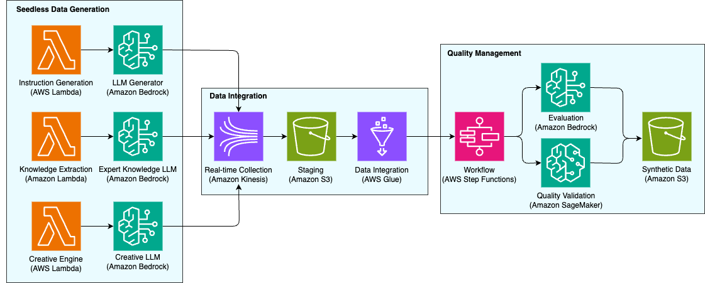

# Seedless Synthetic Data Generation Approach

## Suggested Pre-Reading

* [The Necessity of Synthetic Data: Core Requirements for Modern AI Development](the-necessity-of-synthetic-data.md)
* [Seed Data-Based Synthetic Data Generation Approach (Persona-Specific)](seed-data-based-synthetic-data-generation-approach.md)

## TL;DR

Seedless 접근법은 **기존에 준비된 데이터 없이**, 오로지 LLM의 지식과 능력에 의존하여 합성 데이터를 만들어내는 방식입니다. 새로운 분야에 대한 AI 모델을 만들 때 실제 데이터가 부족하거나, 매우 **범용적인 지식/지시 따르기(instruction following)** 능력을 갖춘 모델을 훈련하고자 할 때 사용합니다. 이 접근법에서는 인간이 제공하는 구체적인 seed 없이도, 모델 스스로 광범위한 주제의 학습 데이터를 생산하도록 프롬프트를 구성합니다.

**적용 시나리오:**

* 완전히 새로운 도메인의 AI 모델 개발 (관련 데이터가 거의 없을 때)
* 범용 **Instruction-Following** 모델 훈련 (다양한 과제에 두루 능한 모델 개발)
* 데이터가 부족한 **저자원 언어**에 대한 지원 (희귀 언어로 모델 학습 데이터 생성)
* **창의적 콘텐츠 생성** 모델 (기존 데이터에 얽매이지 않고 참신한 문장/아이디어 생성)

## 1. Seedless 합성 데이터 접근의 핵심 아이디어

Seedless 방식의 핵심은 _“모델에게 무엇을 만들어야 하는지 체계적으로 가이드”_ 하는 것입니다. 과거 방식으로는 몇 가지 예시(seed)를 주고 Self-Instruct 기법으로 모델이 비슷한 데이터를 만들어내게 하곤 했습니다. 그러나 이는 seed가 편협하면 결과도 편중되는 한계가 있었습니다. 최신 연구 동향은 **인간 지식의 구조**를 활용하여 가능한 한 전 범위의 과제를 망라하는 방향으로 나아갑니다.

특히 2024년 제안된 [**“Synthetic Data (Almost) from Scratch: Generalized Instruction Tuning (GLAN)”**](https://arxiv.org/abs/2402.13064) 방법은, **사전 지식 체계(taxonomy)** 만을 입력으로 하여 **대규모의 Instruction 튜닝 데이터**를 생성하는 혁신적인 접근입니다. GLAN은 사람이 준비한 실예나 정답 없이도 오직 방대한 **인류 지식의 지도를 그려놓고**, 이를 따라가며 문제와 답을 만들어냅니다. 구체적으로 GLAN의 절차를 살펴보면:

1. **지식 Taxonomy 구축:** 우선 GPT-4 등의 LLM 도움을 받아 **인간 지식의 분류체계**를 나눕니다. 모든 학문과 기술을 **영역 (field)** – **하위영역 (sub-field)** – **세부 과목 (discipline)** 식으로 계층화하는 것입니다. 마치 교육 과정 커리큘럼을 짜듯이, 예를 들어 “물리학 -> 역학 -> 고전역학” 식의 트리를 만들고, 이를 사람 검토로 다듬어 최종 **지식 지도**로 삼습니다. (이 단계만 일부 인간 개입이 있고, 이후로는 모두 모델 자동화입니다.)
2. **과목 목록 생성:** 각 discipline에 대해 “해당 분야에서 학생들이 배워야 할 과목은 무엇인가?”를 LLM(GPT-4)에 묻습니다. 모델을 그 분야의 전문가로 설정해 주요 **과목명, 수준, 하위 토픽** 등을 JSON 형식으로 출력하게 합니다. 이를 통해 방대한 지식 체계의 말단 노드들을 구체화합니다.
3. **세부 커리큘럼(강의 계획) 작성:** 이제 각 과목마다 세분화된 강의 세션(class session)과 해당 세션에서 다룰 **핵심 개념(key concepts)** 리스트를 생성합니다. 이것도 LLM을 활용하여 “과목 X를 가르치기 위한 주차별 개념 목록”을 만들게 하는 식입니다. 예컨대 “고전역학” 과목이라면 1주차 개념: 뉴턴 법칙, 2주차: 에너지 보존, … 등.
4. **Instruction 생성:** 이렇게 얻은 **세부 개념들**을 바탕으로, 각 개념을 물어보는 문제(지시)를 생성합니다. LLM에게 “학생이 개념 Y를 이해했는지 평가할 질문을 만들어라” 또는 “이러이러한 키워드들을 포함한 연습문제를 만들어라” 식으로 프롬프트를 주어 **과제/질문 세트**를 만듭니다. 이때 난이도를 조절하기 위해 한 번에 한 개념만 질문에 쓰거나, 두 개 이상의 개념을 조합해 복합 문제를 내기도 합니다. (후자를 통해 난이도가 올라가며 창의적 응용 문제가 만들어집니다.)
5. **모델 답변 생성:** 마지막으로, 만들어진 질문들에 대한 **정답/해설**을 생성합니다. 이 부분은 굳이 최고 성능 모델이 아니어도 되므로, 연구에서는 GPT-3.5 정도를 써서 빠르게 답변을 달았다고 합니다. 질문 자체는 GPT-4급이 만든 고난도 문제일 수 있지만, 답변은 비교적 간단히 얻게 최적화한 것입니다.

이 과정을 거치면 초기 지식 지도에 포함된 **사실상 전 분야에 걸친 수많은 질의응답**이 생성됩니다. GLAN 연구에서는 이렇게 합성한 데이터로 작은 LLM(예: Mistral 7B)을 튜닝한 결과, 수학적 추론, 코딩, 학술 시험, 논리적 추론, 일반적 지시 따르기 등 여러 방면에서 뛰어난 성능을 보였다고 보고합니다. 놀라운 점은 이 모델이 **각 과제에 대한 실제 인간 데이터가 전혀 없이**도 높은 성능을 냈다는 것입니다 (예를 들어 Mistral 7B 모델이 수학 문제 벤치마크에서 GPT-4의 65% 수준에 도달함). 또한 GLAN 방식은 **확장성**이 커서, 새로운 분야나 개념을 다루고 싶다면 지식 트리에 노드만 추가하면 해당 부분의 데이터를 손쉽게 합성할 수 있다고 합니다.

요약하면, Seedless 접근은 **모델 스스로에게 가상의 “교과 과정”을 제시하여 학습 문제를 만들어내게 하는 방식**입니다. 이러한 체계적 방법 덕분에 기존의 Self-Instruct 기법 등이 가지는 편향을 극복하고, 매우 폭넓은 주제에 대한 합성 데이터셋을 얻을 수 있습니다.

GLAN의 자세한 구현은 [이 GitHub 리포지토리](https://github.com/daekeun-ml/synthetic-qa-generation/tree/main/glan-instruct)을 참조하세요.

## 2. 일반화된 Instruction 튜닝을 위한 기법 (GLAN 사례)

위에서 설명한 GLAN을 통해 알 수 있듯, seedless 합성의 핵심은 **일반화**와 **체계화**입니다. 이를 구현하는 구체적인 방안과 그 효과를 GLAN 사례를 들어 조금 더 상세히 살펴보면:

* **선행 연구와의 비교:** 기존에는 FLAN, Self-Instruct, WizardLM Evolve-Instruct 등의 방식으로 일부 **seed 예시**나 **인간 작성 지침**에 의존해 데이터를 만들었습니다. 예컨대 Self-Instruct는 사람이 몇 개 질문/답을 직접 만든 후, 모델이 그를 모방해 추가 생성하는 방식이었고, WizardLM은 비교적 적은 수의 쉬운 프롬프트를 준비한 뒤 이를 모델이 점차 복잡하게 변형하며 어려운 프롬프트를 만드는 방식이었습니다. 이런 접근들은 **seed에 없는 분야나 새로운 형태의 과제는 생성되지 못하는** 한계가 있습니다. 반면 GLAN은 애초에 인류 지식 지도를 입력으로 삼기 때문에 **포함되지 않는 주제가 거의 없을 정도로 범용적인 데이터**를 만들 수 있습니다.
* **체계적인 난이도 조절:** GLAN 절차에서 보았듯, 한 과목 내에서도 기본 개념만 묻는 문제부터 여러 개념을 얽은 문제까지 **난이도를 조절**할 수 있습니다. 이는 모델이 **단계별 학습**을 하거나 쉬운 것부터 어려운 것까지 고루 노출되게 하는 데 이점이 있습니다. Evolve-Instruct 기법도 난이도 상승을 꾀했지만, GLAN은 애초에 커리큘럼을 짜서 쉬움→어려움 계층을 만든다는 점에서 더 구조적입니다.
* **종합적인 능력 향상:** GLAN으로 생성된 데이터로 학습한 모델 (논문에서 GLAN-Mistral7B 등) 성능을 보면, 수리적 추론(Mathematical reasoning), 코드 작성, 학술시험(MMLU), 논리 퍼즐, 일반 문장 생성 등 **다양한 벤치마크에서 고르게 향상**을 보였습니다. 즉, 특정 몇 개 태스크가 아니라 전반적인 **제너럴리스트 모델**로서의 성능이 올라갔다는 것입니다. 이를 통해 seedless 방식으로도 충분히 모델의 전 영역 능력을 키울 수 있음이 입증되었습니다. 물론 여전히 GPT-4 같은 초거대 모델 수준에는 못 미치지만, **대폭향상된 2류 모델**을 만드는 전략으로 가치가 있습니다.
* **커스터마이징 용이성:** GLAN의 큰 장점 중 하나는 **사용자 정의의 용이함**입니다. 예를 들어 특정 기업 도메인에 맞게 모델을 튜닝하려는 경우, 일반 지식 트리에서 해당 분야 노드를 강화하거나 새로 추가하고, 그 부분의 합성 데이터를 더 많이 생성하도록 하면 됩니다. 이렇게 생성된 데이터만 추가로 파인튜닝함으로써 **기존 범용 지식을 유지하면서 특정 분야 능력을 보강**할 수 있습니다. 반대로 어떤 영역이 필요 없으면 그 부분 데이터는 빼고 학습하는 식으로 조절도 가능합니다.
* **한계와 보완:** Seedless 접근에도 도전과제는 있습니다. 완전히 모델 혼자 데이터 생성을 하면 **사실성과 자연스러움 측면에서 왜곡**이 생길 수 있습니다. 인간의 질문 패턴과 조금 다르거나, 모델의 지식 오류가 답변에 섞일 위험도 있습니다. 이를 보완하기 위해 종종 **인간 검수**나 **부분적인 seed 사용**을 병행합니다. 예를 들어 Persona Hub의 zero-shot 방식을 쓰면서도, 일부 few-shot 실제 질문 데이터를 시범으로 줘서 어색한 질문을 줄이는 시도 가 있었습니다. 궁극적으로 완전 자동 데이터 생성이 이상적이지만, 필요한 경우 소량의 고품질 인삿말이나 포맷 예시를 seed로 넣어주는 것도 실용적인 절충안입니다.

정리하면, seedless 합성 데이터 생성은 **모델의 내부 지식과 구조화된 프롬프트 전략**만으로 데이터를 얻는 접근으로, 이미 연구를 통해 그 **효과성과 범용성**이 증명되고 있습니다. GLAN 같은 방법론을 활용하면 방대한 인간 전문 지식 체계를 모사한 데이터를 자동 생성하여 모델을 튜닝할 수 있고, 이는 새로운 도메인이나 저자원 환경에서도 강력한 해결책이 됩니다.

여기에서는 구체적인 구현 코드를 제공하지는 않지만 빠른 시작을 위해 아래의 코드 스니펫을 참고하십시오.

```python
import asyncio
import random
from typing import List, Dict

# Self-Instruct 기반 데이터 생성
class SelfInstructGenerator:
    def __init__(self):
        self.task_types = ['classification', 'generation', 'qa', 'reasoning']
        self.seed_templates = [
            "Classify {item} into categories: {categories}",
            "Generate {content} about {topic}",
            "Answer: {question}",
            "Analyze {scenario} and explain {aspect}"
        ]
    
    async def generate_instructions(self, count: int = 100) -> List[Dict]:
        """자가 지시사항 생성"""
        instructions = []
        
        for i in range(count):
            template = random.choice(self.seed_templates)
            task_type = random.choice(self.task_types)
            
            # LLM으로 새로운 지시사항 생성
            new_instruction = await self._create_instruction(template, task_type)
            
            # 입출력 쌍 생성
            io_pair = await self._generate_io_pair(new_instruction)
            
            instructions.append({
                'instruction': new_instruction,
                'input': io_pair['input'],
                'output': io_pair['output'],
                'task_type': task_type
            })
        
        return instructions
    
    async def _create_instruction(self, template: str, task_type: str) -> str:
        prompt = f"Create a new {task_type} instruction based on: {template}"
        # AWS Bedrock 호출
        return await self._call_bedrock(prompt)
    
    async def _generate_io_pair(self, instruction: str) -> Dict:
        prompt = f"For instruction '{instruction}', create realistic input and output"
        response = await self._call_bedrock(prompt)
        
        # 파싱 로직
        parts = response.split("Output:")
        return {
            'input': parts[0].replace("Input:", "").strip(),
            'output': parts[1].strip() if len(parts) > 1 else ""
        }


# 다양성 확보
class DiversityController:
    def __init__(self):
        self.dimensions = {
            'complexity': ['simple', 'moderate', 'complex'],
            'format': ['text', 'list', 'json', 'code'],
            'domain': ['general', 'technical', 'creative', 'analytical']
        }
    
    def ensure_diversity(self, instructions: List[Dict]) -> List[Dict]:
        """다양성 보장"""
        diverse_set = []
        used_combinations = set()
        
        for instruction in instructions:
            combo = self._get_combination(instruction)
            if combo not in used_combinations:
                diverse_set.append(instruction)
                used_combinations.add(combo)
        
        return diverse_set

# 도메인 특화 지식 생성
class KnowledgeGenerator:
    def __init__(self):
        self.knowledge_types = ['factual', 'procedural', 'conceptual']
    
    async def generate_domain_knowledge(self, domain: str) -> List[Dict]:
        """도메인 지식 생성"""
        knowledge_items = []
        
        for knowledge_type in self.knowledge_types:
            prompt = f"""
Generate {knowledge_type} knowledge for {domain} domain.
Include:
1. Core concepts
2. Key relationships  
3. Practical applications
4. Common misconceptions
"""
            
            response = await self._call_bedrock(prompt)
            knowledge_items.append({
                'domain': domain,
                'type': knowledge_type,
                'content': response
            })
        
        return knowledge_items

# 창의적 콘텐츠 생성
class CreativeGenerator:
    def __init__(self):
        self.techniques = ['analogical', 'constraint_based', 'combinatorial']
    
    async def generate_creative_content(self, content_type: str) -> List[Dict]:
        """창의적 콘텐츠 생성"""
        creative_items = []
        
        for technique in self.techniques:
            if technique == 'analogical':
                prompt = f"Create {content_type} using analogy between nature and technology"
            elif technique == 'constraint_based':
                prompt = f"Create {content_type} with constraint: use exactly 5 colors"
            else:  # combinatorial
                prompt = f"Create {content_type} combining music and mathematics"
            
            content = await self._call_bedrock(prompt)
            creative_items.append({
                'content': content,
                'technique': technique,
                'type': content_type
            })
        
        return creative_items
```

## 3. Seedless 합성 데이터 생성 아키텍처

기존 데이터 없이 순수 LLM 능력으로 합성 데이터를 생성하는 아키텍처입니다. Self-Instruct로 지시사항 자동 생성, 도메인 지식 추출, 창의적 콘텐츠 생성을 Lambda와 Bedrock으로 처리합니다. Kinesis로 실시간 수집, Step Functions로 품질 관리, Glue로 데이터 통합하여 새로운 도메인 AI 모델이나 범용 instruction following 모델 개발에 활용됩니다.

Seedless 접근법의 데이터 생성 과정은 7단계의 자동화된 파이프라인으로 진행됩니다. 첫 번째 단계에서 AWS Lambda 함수가 기본 템플릿을 바탕으로 분류, 생성, 질의응답, 추론 등 다양한 유형의 태스크 지시사항을 자동으로 생성합니다. 동시에 도메인별 전문 지식 추출 과정이 진행되어 의료, 법률, 금융 등 특정 분야의 사실적, 절차적, 개념적 지식이 체계적으로 생성되고 구조화됩니다.

세 번째 단계에서는 유추, 제약 기반, 조합적 사고 등의 창의적 기법을 적용하여 소설, 시, 시나리오 등의 창의적 콘텐츠가 생성됩니다. 이렇게 생성된 모든 데이터는 Amazon Kinesis Data Streams를 통해 실시간으로 수집되어 스트리밍 처리됩니다.

수집된 데이터는 AWS Step Functions가 관리하는 복잡한 워크플로우를 통해 다단계 품질 검증 과정을 거칩니다. 이 과정에서 언어 품질, 내용 일관성, 창의성 등이 종합적으로 평가됩니다. AWS Glue는 다양한 소스에서 생성된 데이터를 통합하고 중복 제거, 형식 통일 등의 정제 작업을 수행합니다. 최종적으로 모든 검증을 통과한 고품질 합성 데이터는 Amazon S3에 저장되고 메타데이터와 함께 카탈로그에 등록되어 향후 활용을 위한 자산으로 관리됩니다.

<figure><figcaption></figcaption></figure>

_그림 2. Seedless Synthetic Data Generation Architecture_

> 참고: 이 아키텍처는 설명을 위한 참조 사례이며, 모든 프로덕션 요구 사항을 반영하지 않을 수 있습니다. 실제 구현은 특정 사용 사례, 규모 요구 사항 및 조직의 제약 조건에 따라 더 간단하거나 더 복잡할 수 있습니다. 이 패턴을 적용할 때는 항상 고유한 요구 사항을 고려하십시오.

### 3.1. Self-Instruct 엔진

* AWS Lambda - 지시사항 생성
  * **자동 지시사항 생성**: 기본 템플릿에서 새로운 지시사항 자동 생성
  * **다양성 보장**: 분류, 생성, QA, 추론 등 다양한 태스크 유형
  * **확장성**: 서버리스로 대량 처리 가능
* Amazon Bedrock - LLM 생성기
  * **Self-Instruct 실행**: 생성된 지시사항을 바탕으로 입출력 쌍 생성
  * **모델 선택**: Claude, Llama 등 다양한 LLM 모델 활용
  * **배치 처리**: 대량의 지시사항 효율적 처리

### 3.2. 지식 생성 (Knowledge Generation)

* AWS Lambda - 지식 추출
  * **도메인 지식 생성**: 특정 분야의 전문 지식 자동 생성
  * **지식 유형 분류**: 사실적, 절차적, 개념적 지식 구분
  * **품질 제어**: 생성된 지식의 일관성 및 정확성 검증
* Amazon Bedrock - 전문 지식 LLM
  * **도메인 특화**: 의료, 법률, 금융 등 전문 분야 지식 생성
  * **다층 추론**: 복잡한 개념의 단계별 설명
  * **상호 연관성**: 개념 간 관계 및 의존성 표현

### 3.3. 창의 생성 (Creative Generation)

*   AWS Lambda - 창의 엔진

    * **창의 기법 적용**: 유추, 제약 기반, 조합적 접근
    * **다양성 증진**: 예측 불가능한 창의적 결과 생성
    * **품질 균형**: 창의성과 실용성 간 균형 유지
    * **창의 기법 구현:**

    ```python
    class CreativeEngine:
        def __init__(self):
            self.techniques = {
                'analogical': self.analogical_thinking,
                'constraint_based': self.constraint_based_thinking,
                'combinatorial': self.combinatorial_thinking
            }
        
        def analogical_thinking(self, topic):
            return f"{topic}를 자연 현상에 비유하여 설명해주세요"
        
        def constraint_based_thinking(self, topic):
            constraints = ["5가지 색깔만 사용", "100자 이내", "운율 맞추기"]
            constraint = random.choice(constraints)
            return f"{topic}에 대해 {constraint} 제약 조건으로 작성해주세요"
        
        def combinatorial_thinking(self, topic):
            domains = ["음악", "수학", "요리", "스포츠"]
            domain = random.choice(domains)
            return f"{topic}를 {domain}와 결합하여 새로운 아이디어를 제시해주세요"
    ```
* Amazon Bedrock - 창의 LLM
  * **창의적 콘텐츠**: 소설, 시, 대화, 시나리오 등 생성
  * **스타일 다양성**: 다양한 문체와 장르 지원
  * **감정 표현**: 감정이 풍부한 자연스러운 콘텐츠

### 3.4. 품질 관리 (Quality Management)

* AWS Step Functions - 워크플로우
  * **복잡한 품질 관리**: 다단계 검증 프로세스 조율
  * **조건부 실행**: 품질 점수에 따른 분기 처리
  * **오류 처리**: 실패 시 재시도 및 대안 경로
* Amazon SageMaker - 품질 필터
  * **자동 품질 평가**: ML 모델 기반 품질 점수 산출
  * **다차원 평가**: 일관성, 창의성, 실용성 등 종합 평가
  * **학습 개선**: 품질 평가 결과를 통한 생성 모델 개선
* Amazon Bedrock - 평가 모델
  * **언어 품질**: 문법, 어휘, 문체 등 언어적 품질 평가
  * **감정 분석**: 생성된 콘텐츠의 감정 적절성 검증
  * **주제 일관성**: 주제와 내용의 일치도 평가

### 3.5. 데이터 통합 (Data Integration)

* Amazon Kinesis Data Streams - 실시간 수집
  * **스트리밍 처리**: 생성되는 데이터의 실시간 수집
  * **확장성**: 데이터 볼륨 증가에 따른 자동 확장
  * **내구성**: 데이터 손실 방지를 위한 복제 및 백업
* Amazon S3 - 스테이징
  * **임시 저장**: 처리 중인 데이터의 임시 저장소
  * **배치 처리**: 일정량 누적 후 배치 처리
  * **데이터 파티셔닝**: 날짜, 유형별 효율적 구조
* AWS Glue - 데이터 통합
  * **ETL 처리**: 다양한 소스의 데이터 통합 및 변환
  * **스키마 진화**: 데이터 구조 변경에 대한 자동 대응
  * **데이터 품질**: 중복 제거, 형식 통일, 검증

### 3.6. 결과 저장 (Result Storage)

* Amazon S3 - 합성 데이터
  * **대용량 저장**: 생성된 대량의 합성 데이터 저장
  * **계층화 저장**: 접근 빈도에 따른 스토리지 클래스 자동 조정
  * **버전 관리**: 데이터 변경 이력 추적

이 아키텍처를 통해 기존 데이터 없이도 고품질의 다양한 합성 데이터를 생성할 수 있으며, 새로운 도메인이나 창의적 AI 모델 개발에 활용할 수 있습니다. 이제 마지막으로, 앞서 소개한 seed 기반이든 Seedless 기반이든 **합성 데이터를 만들 때 공통적으로 고려해야 할 사항들과 기법들**을 다루겠습니다. (예: 추가 데이터 증강, 개인 정보 제거, 데이터 검증, 레드팀 테스트, 버전 관리 등)
