# Diffusion 정리


왜 알아둬야 할까? → 관련 논문들의 background를 한눈에 파악할 수 있음

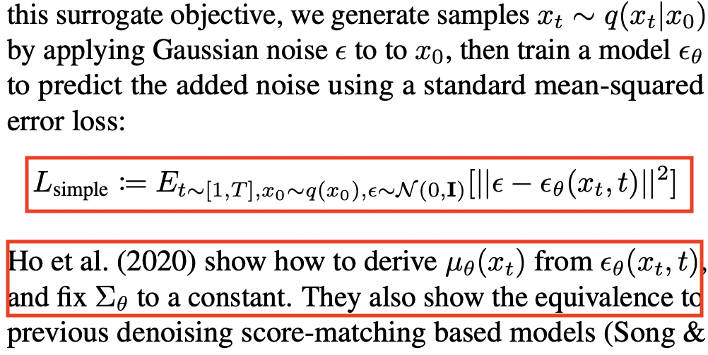


## 1. Diffusion Model

***

### Intuition

* 점진적으로 노이즈를 추가하여 고의적으로 패턴을 무너트리고 (diffusion process), 노이즈에서 데이터를 복원하는 조건부 PDF를 학습하는 과정 (reverse process)
  * $$p$$: 학습하고자 하는 확률 분포, $$q$$: 실제 확률 분포
* 총 time step $$T$$에 대한 $$T$$-layer의 hierarchical VAE라고 해석할 수 있음
  * VAE의 복잡한 생성 프로세스를 를 $$T$$개의 쉬운 markov process로 쪼갰다고 말할 수 있다.

<figure>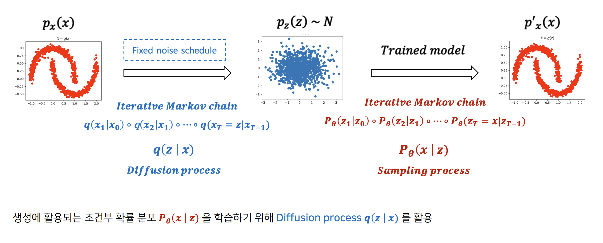<figcaption></figcaption></figure>

<figure>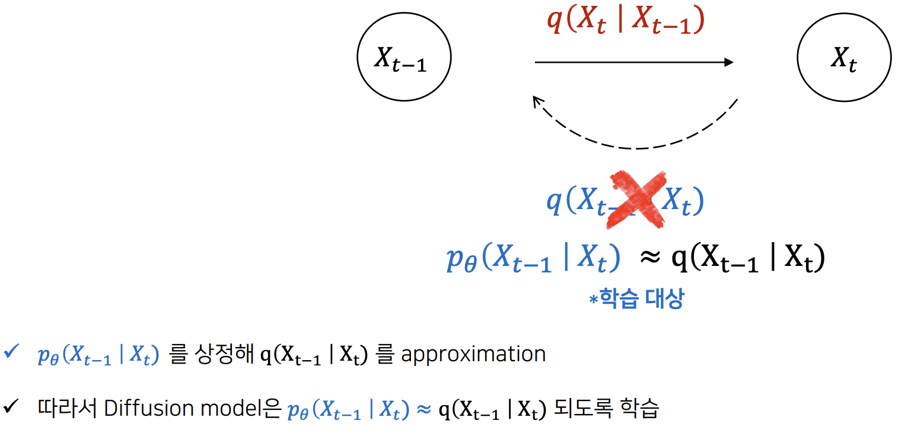<figcaption></figcaption></figure>


* GAN vs. VAE vs. Diffusion
  * GAN은 묵시적(implicit)인 확률분포를 모델링하기 때문에 모델 구성에 제한이 없으며 생성된 결과물의 품질이 좋지만, 훈련이 불안정하고 mode collapse 이슈가 있음.
  * VAE는 명시적인 확률분포를 모델링하지만 likelihood가 아닌 ELBO를 통한 학습이라 생성 이미지 품질이 상대적으로 떨어짐.
  * Diffusion은 GAN보다 훈련하기가 용이하면서 생성되는 이미지가 더 다양하고 품질이 좋음. 하지만 GAN/VAE에 비해 이미지 생성하는 데 시간이 매우 오래 걸림.


<figure>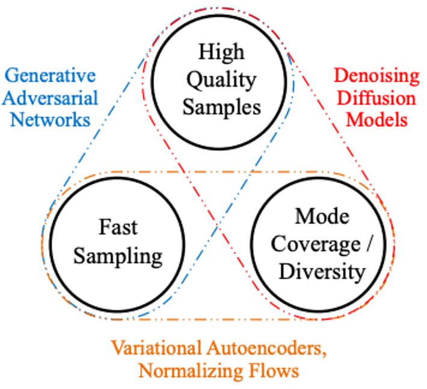<figcaption></figcaption></figure>

### Objective

* 우리의 목적은 Reverse process 과정의 $$p_\theta$$를 $$q$$에 근사하는 것이므로 Cross Entropy와 VLB(Variational Lower Bound)의 정의를 사용하여 수식을 풀어 쓰면 아래와 같은 목적 함수가 도출된다.
  * 참고로, VLB(Variational Lower Bound)는 ELBO(Evidence Lower Bound)라고도 하며 모델의 사후 분포(posterior distribution)를 근사할 때 널리 사용된다.
  * ELBO를 최대화하는 것은 결합 분포의 log likelihood를 최대화하고, 사후 분포의 log likelihood를 최소화한다는 의미이다.
* 이 수식을 실제로는 전부 사용하지 않고 Stable Diffusion의 근간이 되는 DDPM (Denoising Diffusion Probabilistic Model) 논문에서 $$L_{t-1}$$만 사용하며 전반적인 Loss term을 간소화하였다. (이름하여 $$L_{simple}$$)

$$
Loss_{Diffusion} = \mathbb{E}_q [\underbrace{D_\text{KL}(q(\mathbf{x}_T \vert \mathbf{x}_0) \parallel p_\theta(\mathbf{x}_T))}_{L_T} + \sum_{t=2}^T \underbrace{D_\text{KL}(q(\mathbf{x}_{t-1} \vert \mathbf{x}_t, \mathbf{x}_0) \parallel p_\theta(\mathbf{x}_{t-1} \vert\mathbf{x}_t))}_{L_{t-1}} \underbrace{- \log p_\theta(\mathbf{x}_0 \vert \mathbf{x}_1)}_{L_0} ]
$$

\[도출 과정]: 부등호는 Jensen's inequality에 의해 성립

$$
\begin{aligned}
L_\text{CE}
&= - \mathbb{E}_{q(\mathbf{x}_0)} \log p_\theta(\mathbf{x}_0) \\
&= - \mathbb{E}_{q(\mathbf{x}_0)} \log \Big( \int p_\theta(\mathbf{x}_{0:T}) d\mathbf{x}_{1:T} \Big) \\
&= - \mathbb{E}_{q(\mathbf{x}_0)} \log \Big( \int q(\mathbf{x}_{1:T} \vert \mathbf{x}_0) \frac{p_\theta(\mathbf{x}_{0:T})}{q(\mathbf{x}_{1:T} \vert \mathbf{x}_{0})} d\mathbf{x}_{1:T} \Big) \\
&= - \mathbb{E}_{q(\mathbf{x}_0)} \log \Big( \mathbb{E}_{q(\mathbf{x}_{1:T} \vert \mathbf{x}_0)} \frac{p_\theta(\mathbf{x}_{0:T})}{q(\mathbf{x}_{1:T} \vert \mathbf{x}_{0})} \Big) \\
&\leq - \mathbb{E}_{q(\mathbf{x}_{0:T})} \log \frac{p_\theta(\mathbf{x}_{0:T})}{q(\mathbf{x}_{1:T} \vert \mathbf{x}_{0})} \\
&= \mathbb{E}_{q(\mathbf{x}_{0:T})}\Big[\log \frac{q(\mathbf{x}_{1:T} \vert \mathbf{x}_{0})}{p_\theta(\mathbf{x}_{0:T})} \Big] = L_\text{VLB}
\end{aligned}
$$

$$
\begin{aligned}
L_\text{VLB} 
&= \mathbb{E}_{q(\mathbf{x}_{0:T})} \Big[ \log\frac{q(\mathbf{x}_{1:T}\vert\mathbf{x}_0)}{p_\theta(\mathbf{x}_{0:T})} \Big] \\
&= \mathbb{E}_q \Big[ \log\frac{\prod_{t=1}^T q(\mathbf{x}_t\vert\mathbf{x}_{t-1})}{ p_\theta(\mathbf{x}_T) \prod_{t=1}^T p_\theta(\mathbf{x}_{t-1} \vert\mathbf{x}_t) } \Big] \\
&= \mathbb{E}_q \Big[ -\log p_\theta(\mathbf{x}_T) + \sum_{t=1}^T \log \frac{q(\mathbf{x}_t\vert\mathbf{x}_{t-1})}{p_\theta(\mathbf{x}_{t-1} \vert\mathbf{x}_t)} \Big] \\
&= \mathbb{E}_q \Big[ -\log p_\theta(\mathbf{x}_T) + \sum_{t=2}^T \log \frac{q(\mathbf{x}_t\vert\mathbf{x}_{t-1})}{p_\theta(\mathbf{x}_{t-1} \vert\mathbf{x}_t)} + \log\frac{q(\mathbf{x}_1 \vert \mathbf{x}_0)}{p_\theta(\mathbf{x}_0 \vert \mathbf{x}_1)} \Big] \\
&= \mathbb{E}_q \Big[ -\log p_\theta(\mathbf{x}_T) + \sum_{t=2}^T \log \Big( \frac{q(\mathbf{x}_{t-1} \vert \mathbf{x}_t, \mathbf{x}_0)}{p_\theta(\mathbf{x}_{t-1} \vert\mathbf{x}_t)}\cdot \frac{q(\mathbf{x}_t \vert \mathbf{x}_0)}{q(\mathbf{x}_{t-1}\vert\mathbf{x}_0)} \Big) + \log \frac{q(\mathbf{x}_1 \vert \mathbf{x}_0)}{p_\theta(\mathbf{x}_0 \vert \mathbf{x}_1)} \Big] \\
&= \mathbb{E}_q \Big[ -\log p_\theta(\mathbf{x}_T) + \sum_{t=2}^T \log \frac{q(\mathbf{x}_{t-1} \vert \mathbf{x}_t, \mathbf{x}_0)}{p_\theta(\mathbf{x}_{t-1} \vert\mathbf{x}_t)} + \sum_{t=2}^T \log \frac{q(\mathbf{x}_t \vert \mathbf{x}_0)}{q(\mathbf{x}_{t-1} \vert \mathbf{x}_0)} + \log\frac{q(\mathbf{x}_1 \vert \mathbf{x}_0)}{p_\theta(\mathbf{x}_0 \vert \mathbf{x}_1)} \Big] \\
&= \mathbb{E}_q \Big[ -\log p_\theta(\mathbf{x}_T) + \sum_{t=2}^T \log \frac{q(\mathbf{x}_{t-1} \vert \mathbf{x}_t, \mathbf{x}_0)}{p_\theta(\mathbf{x}_{t-1} \vert\mathbf{x}_t)} + \log\frac{q(\mathbf{x}_T \vert \mathbf{x}_0)}{q(\mathbf{x}_1 \vert \mathbf{x}_0)} + \log \frac{q(\mathbf{x}_1 \vert \mathbf{x}_0)}{p_\theta(\mathbf{x}_0 \vert \mathbf{x}_1)} \Big]\\
&= \mathbb{E}_q \Big[ \log\frac{q(\mathbf{x}_T \vert \mathbf{x}_0)}{p_\theta(\mathbf{x}_T)} + \sum_{t=2}^T \log \frac{q(\mathbf{x}_{t-1} \vert \mathbf{x}_t, \mathbf{x}_0)}{p_\theta(\mathbf{x}_{t-1} \vert\mathbf{x}_t)} - \log p_\theta(\mathbf{x}_0 \vert \mathbf{x}_1) \Big] \\
&= \mathbb{E}_q [\underbrace{D_\text{KL}(q(\mathbf{x}_T \vert \mathbf{x}_0) \parallel p_\theta(\mathbf{x}_T))}_{L_T} + \sum_{t=2}^T \underbrace{D_\text{KL}(q(\mathbf{x}_{t-1} \vert \mathbf{x}_t, \mathbf{x}_0) \parallel p_\theta(\mathbf{x}_{t-1} \vert\mathbf{x}_t))}_{L_{t-1}} \underbrace{- \log p_\theta(\mathbf{x}_0 \vert \mathbf{x}_1)}_{L_0} ]
\end{aligned}
$$

두 Loss를 비교해 보면?

* Regularization term은 $$\beta_t$$ 학습이 목적인데 DDPM 논문에서 $$\beta_t$$ 를 상수로 놓아도 훈련이 잘 되었다는 것을 확인했기 때문에 실제 구현에서는 사용하지 않음

<figure>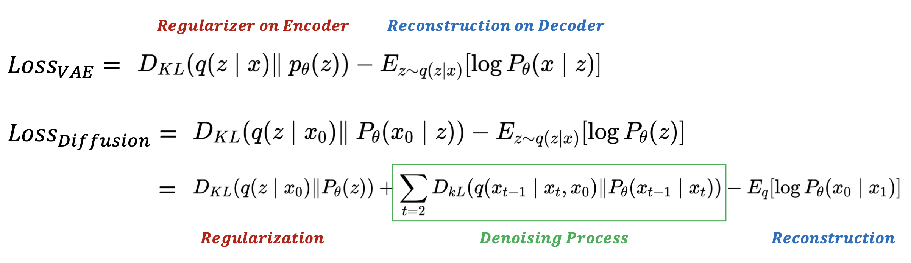<figcaption></figcaption></figure>

### Forward diffusion

* 각 스텝마다 조건부 가우시안 분포(노이즈)를 데이터(보통 이미지)에 점진적으로 주입하는 과정으로 별도의 파라메터 훈련 없이 곧바로 계산된다. 이 노이즈는 각 픽셀에 대해 독립적이며 이를 등방성(isotropic)이라고 한다.
* 주입되는 가우시안 노이즈를 $$\beta_t$$ 로 표기하면 아래와 같음
  * $$\beta_t$$ 는 실제 구현에서는 1e-4로 출발해서 0.02까지 늘리는 구조이며, $$\beta_t$$ 가 1일 때는 순수 노이즈가 됨
  * 갑자기 뜬금없이 $$\sqrt{1 - \beta_t}$$ 로 scaling 하는 이유
    * 평균을 점차 0에 수렴하도록 보장 (쉽게 말해 0.99를 계속 곱하다 보면 0에 가까워짐)
    * 분산이 점차 1에 수렴하도록 보장 (각 스텝에서 노이즈를 합산한 이후의 분산이 unit variance)

$$
q(\mathbf{x}_t \vert \mathbf{x}_{t-1}) = \mathcal{N}(\mathbf{x}_t; \sqrt{1 - \beta_t} \mathbf{x}_{t-1}, \beta_t\mathbf{I}) \quad
q(\mathbf{x}_{1:T} \vert \mathbf{x}_0) = \prod^T_{t=1} q(\mathbf{x}_t \vert \mathbf{x}_{t-1})
$$

* 향후 loss term의 미분을 위해 Reparameterization trick으로 x = mean + std\*noise 형태로 표현하면 아래와 같다.

$$
\mathbf{x}_t = \sqrt{1 - \beta_t} \mathbf{x}_{t-1} + \sqrt{\beta_t} \boldsymbol{\epsilon}
$$

* $$\alpha_t = 1 - \beta_t, \bar{\alpha}t = \prod{i=1}^t \alpha_i$$ 로 치환하고 위 식을 풀어보면 $$\mathbf{x}_t$$를 아래와 같이 간소화할 수 있다.
  * Note: $$\boldsymbol{\epsilon} \sim \mathcal{N}(0,1)$$, 가우시안의 합은 가우시안

$$
\begin{aligned}
\mathbf{x}_t 
&= \sqrt{\alpha_t}\mathbf{x}_{t-1} + \sqrt{1 - \alpha_t}\boldsymbol{\epsilon}_{t-1} & \text{ ;where } \boldsymbol{\epsilon}_{t-1}, \boldsymbol{\epsilon}_{t-2}, \dots \sim \mathcal{N}(\mathbf{0}, \mathbf{I}) \\
&= \sqrt{\alpha_t \alpha_{t-1}} \mathbf{x}_{t-2} + \sqrt{1 - \alpha_t \alpha_{t-1}} \bar{\boldsymbol{\epsilon}}_{t-2} & \text{ ;where } \bar{\boldsymbol{\epsilon}}_{t-2} \text{ merges two Gaussians (*).} \\
&= \dots \\
&= \sqrt{\bar{\alpha}_t}\mathbf{x}_0 + \sqrt{1 - \bar{\alpha}_t}\boldsymbol{\epsilon} 
\end{aligned}
$$

* 따라서 어떤 데이터 $$\mathbf{x}_0$$에 대한 forward diffusion 과정의 확률분포 $$q$$는 아래와 같이 요약할 수 있다.

$$
q(\mathbf{x}_t \vert \mathbf{x}_0) = \mathcal{N}(\sqrt{\bar{\alpha}_t} \mathbf{x}_0, (1 - \bar{\alpha}_t)\mathbf{I})
$$

<figure>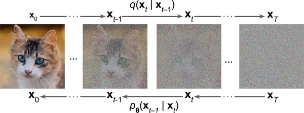<figcaption></figcaption></figure>

### Reverse diffusion

* 직관적 이해: Reverse diffusion 과정의 확률 분포 함수는 순수 노이즈 $$\mathbf{x}_T$$에서 시작하여 데이터 샘플(원본과 동일한 분포)에 도달하기 위해 취할 수 있는 모든 가능한 경로에 대한 적분

$$
L = -\sum_{\mathbf{x} \in  \mathcal{D}} \ln p_0(\mathbf{x}) \approx -\int q_0(\mathbf{x}_0) \ln p_0(\mathbf{x}_0; \theta) d\mathbf{x}_0
$$

* 당연히 이 적분을 모든 타임스텝에 대해 그대로 푸는 것은 intractable하므로 log-likelihood를 최대화하는 generative distribution을 찾는 목적 함수를 정의하여 아래와 같이 전개한다.

$$
\ln p_0(\mathbf{x}_0; \theta) = \ln\left\lbrace\int  p(\mathbf{x}_0, \ldots, \mathbf{x}_T) d\mathbf{x}_{1:T}\right\rbrace = \ln  \left\lbrace\int  \ p_T(\mathbf{x}_T) d\mathbf{x}_{1:T}\ \prod_{t=1}^T p(\mathbf{x}_{t-1} | \mathbf{x}_t; \theta)\right\rbrace
$$

* 따라서,

$$
p_\theta(\mathbf{x}_{0:T}) = p(\mathbf{x}_T) \prod^T_{t=1} p_\theta(\mathbf{x}_{t-1} \vert \mathbf{x}_t)
$$

* 임의의 $$\mathbf{x}_{t}$$에서  $$\mathbf{x}_{t-1}$$로 가는 확률분포 $$q(\mathbf{x}_{t-1} \vert \mathbf{x}_{t})$$는 직접적으로 계산하기 어려움 (어느 정도의 노이즈를 제거해야 원본 데이터 $$\mathbf{x}_{0}$$로 가는 지 알 수 없으므로)
* 다만, $$q(\mathbf{x}_{t} \vert \mathbf{x}_{t-1})$$가 가우시안이고 $$\beta_t$$가 충분히 작을 때 $$q(\mathbf{x}_{t-1} \vert \mathbf{x}_{t})$$도 가우시안이라는 점이 증명이 되어 있다.
* $$q$$를 직접적으로 계산할 수는 없고 $$p_\theta$$를 근사하는 것이 목적이므로 아래와 같은 수식으로부터 전개한다.

$$
q(\mathbf{x}_{t-1} \vert \mathbf{x}_t) \approx p_\theta(\mathbf{x}_{t-1} \vert \mathbf{x}_t) = \mathcal{N}(\mathbf{x}_{t-1}; \boldsymbol{\mu}_\theta(\mathbf{x}_t, t), \boldsymbol{\Sigma}_\theta(\mathbf{x}_t, t))
$$

* 따라서 목적은 mean, variance를 예측하는 것임
  * 실제 DDPM에서는 mean만 예측하고 variance는 상수로 간주
* 훈련 과정에서는 $$\mathbf{x}_0$$가 필요하므로 아래의 수식을 활용 (모델 훈련 후 추론 시에는 $$\mathbf{x}_0$$가 주어지지 않아도 $$\mathbf{x}_{t-1}$$을 잘 예측해야 함)

$$
q(\mathbf{x}_{t-1} \vert \mathbf{x}_t, \mathbf{x}_0) = \mathcal{N}(\mathbf{x}_{t-1}; \color{blue}{\tilde{\boldsymbol{\mu}}}(\mathbf{x}_t, \mathbf{x}_0), \color{red}{\tilde{\beta}_t} \mathbf{I})
$$

* 베이즈 정리를 사용하면, $$q(\mathbf{x}_{t-1} \vert \mathbf{x}_t, \mathbf{x}_0) = q(\mathbf{x}_t \vert \mathbf{x}_{t-1}) \frac{ q(\mathbf{x}_{t-1} \vert \mathbf{x}_0) }{ q(\mathbf{x}_t \vert \mathbf{x}_0) }$$인데, $$q(\mathbf{x}_{t} \vert \mathbf{x}_{t-1}), q(\mathbf{x}_{t-1} \vert \mathbf{x}_0), q(\mathbf{x}_{t} \vert \mathbf{x}_0)$$ 가 모두 정규분포이므로 $$q(\mathbf{x}_{t-1} \vert \mathbf{x}_t, \mathbf{x}_0)$$도 정규분포이다. 따라서, 이를 세 분포의 확률분포로 표현이 가능하다.

$$
\begin{align} q(x_t \vert x_{t-1})&=\frac{1}{\sqrt{2\pi\beta_t}}\exp{(-\frac{(x_t - \sqrt{\alpha_t}x_{t-1})^2}{2\beta_t})} 
\\ q(x_{t-1} \vert x_0) &=\frac{1}{\sqrt{2\pi(1-\bar{\alpha}_{t-1})}}\exp{(-\frac{(x_{t-1} - \sqrt{\bar{\alpha}_{t-1}}x_0)^2}
{2(1-\bar{\alpha}_{t-1})})} 
\\
 q(x_t \vert x_0) &=\frac{1}{\sqrt{2\pi(1-\bar{\alpha}_t)}}\exp{(-\frac{(x_t - \sqrt{\bar{\alpha}_t}x_0)^2}{2(1-\bar{\alpha}_t)})} 

\end{align}
$$

$$
\begin{aligned}
q(\mathbf{x}_{t-1} \vert \mathbf{x}_t, \mathbf{x}_0) 
&= q(\mathbf{x}_t \vert \mathbf{x}_{t-1}) \frac{ q(\mathbf{x}_{t-1} \vert \mathbf{x}_0) }{ q(\mathbf{x}_t \vert \mathbf{x}_0) } \\
&\propto \exp \Big(-\frac{1}{2} \big(\frac{(\mathbf{x}_t - \sqrt{\alpha_t} \mathbf{x}_{t-1})^2}{\beta_t} + \frac{(\mathbf{x}_{t-1} - \sqrt{\bar{\alpha}_{t-1}} \mathbf{x}_0)^2}{1-\bar{\alpha}_{t-1}} - \frac{(\mathbf{x}_t - \sqrt{\bar{\alpha}_t} \mathbf{x}_0)^2}{1-\bar{\alpha}_t} \big) \Big) \\
&= \exp \Big(-\frac{1}{2} \big(\frac{\mathbf{x}_t^2 - 2\sqrt{\alpha_t} \mathbf{x}_t \color{blue}{\mathbf{x}_{t-1}} \color{black}{+ \alpha_t} \color{red}{\mathbf{x}_{t-1}^2} }{\beta_t} + \frac{ \color{red}{\mathbf{x}_{t-1}^2} \color{black}{- 2 \sqrt{\bar{\alpha}_{t-1}} \mathbf{x}_0} \color{blue}{\mathbf{x}_{t-1}} \color{black}{+ \bar{\alpha}_{t-1} \mathbf{x}_0^2}  }{1-\bar{\alpha}_{t-1}} - \frac{(\mathbf{x}_t - \sqrt{\bar{\alpha}_t} \mathbf{x}_0)^2}{1-\bar{\alpha}_t} \big) \Big) \\
&= \exp\Big( -\frac{1}{2} \big( \color{red}{(\frac{\alpha_t}{\beta_t} + \frac{1}{1 - \bar{\alpha}_{t-1}})} \mathbf{x}_{t-1}^2 - \color{blue}{(\frac{2\sqrt{\alpha_t}}{\beta_t} \mathbf{x}_t + \frac{2\sqrt{\bar{\alpha}_{t-1}}}{1 - \bar{\alpha}_{t-1}} \mathbf{x}_0)} \mathbf{x}_{t-1} \color{black}{ + C(\mathbf{x}_t, \mathbf{x}_0) \big) \Big)}
\end{aligned}
$$

위의 식을 $$\tilde{\beta}_t$$를 정의해 간소화하면 $$\tilde{\boldsymbol{\mu}}$$를 아래과 같이 추정할 수 있다.

$$
\begin{aligned}
\tilde{\beta}_t 
&= 1/(\frac{\alpha_t}{\beta_t} + \frac{1}{1 - \bar{\alpha}_{t-1}}) 
= 1/(\frac{\alpha_t - \bar{\alpha}_t + \beta_t}{\beta_t(1 - \bar{\alpha}_{t-1})})
= \color{green}{\frac{1 - \bar{\alpha}_{t-1}}{1 - \bar{\alpha}_t} \cdot \beta_t} \\
\tilde{\boldsymbol{\mu}}_t (\mathbf{x}_t, \mathbf{x}_0)
&= (\frac{\sqrt{\alpha_t}}{\beta_t} \mathbf{x}_t + \frac{\sqrt{\bar{\alpha}_{t-1} }}{1 - \bar{\alpha}_{t-1}} \mathbf{x}_0)/(\frac{\alpha_t}{\beta_t} + \frac{1}{1 - \bar{\alpha}_{t-1}}) \\
&= (\frac{\sqrt{\alpha_t}}{\beta_t} \mathbf{x}_t + \frac{\sqrt{\bar{\alpha}_{t-1} }}{1 - \bar{\alpha}_{t-1}} \mathbf{x}_0) \color{green}{\frac{1 - \bar{\alpha}_{t-1}}{1 - \bar{\alpha}_t} \cdot \beta_t} \\
&= \frac{\sqrt{\alpha_t}(1 - \bar{\alpha}_{t-1})}{1 - \bar{\alpha}_t} \mathbf{x}_t + \frac{\sqrt{\bar{\alpha}_{t-1}}\beta_t}{1 - \bar{\alpha}_t} \mathbf{x}_0\\
\end{aligned}
$$

$$\mathbf{x}_t = \sqrt{\bar{\alpha}_t}\mathbf{x}_0 + \sqrt{1 - \bar{\alpha}_t}\boldsymbol{\epsilon_t}$$ 로부터 $$\mathbf{x}_0 = \frac{1}{\sqrt{\bar{\alpha}_t}}(\mathbf{x}_t - \sqrt{1 - \bar{\alpha}_t}\boldsymbol{\epsilon}_t)$$인 것을 알고 있으므로 (직관적으로 $$\mathbf{x}_t$$와 $$\mathbf{x}_0$$는 우리가 쉽게 알 수 있으므로 $$\boldsymbol{\epsilon}_t$$, 즉 $$t$$번째 타입스텝의 노이즈만 알아내면 됨), 이를 대입하면 아래와 같다.

$$
\begin{aligned}
\tilde{\boldsymbol{\mu}}_t
&= \frac{\sqrt{\alpha_t}(1 - \bar{\alpha}_{t-1})}{1 - \bar{\alpha}_t} \mathbf{x}_t + \frac{\sqrt{\bar{\alpha}_{t-1}}\beta_t}{1 - \bar{\alpha}_t} \frac{1}{\sqrt{\bar{\alpha}_t}}(\mathbf{x}_t - \sqrt{1 - \bar{\alpha}_t}\boldsymbol{\epsilon}_t) \\
&= \color{red}{\frac{1}{\sqrt{\alpha_t}} \Big( \mathbf{x}_t - \frac{1 - \alpha_t}{\sqrt{1 - \bar{\alpha}_t}} \boldsymbol{\epsilon}_t \Big)}
\end{aligned}
$$

따라서,

$$
\begin{aligned}
\boldsymbol{\mu}_\theta(\mathbf{x}_t, t) &= \color{red}{\frac{1}{\sqrt{\alpha_t}} \Big( \mathbf{x}_t - \frac{1 - \alpha_t}{\sqrt{1 - \bar{\alpha}_t}} \boldsymbol{\epsilon}_\theta(\mathbf{x}_t, t) \Big)} \\
\text{}\mathbf{x}_{t-1} &= \mathcal{N}(\mathbf{x}_{t-1}; \frac{1}{\sqrt{\alpha_t}} \Big( \mathbf{x}_t - \frac{1 - \alpha_t}{\sqrt{1 - \bar{\alpha}_t}} \boldsymbol{\epsilon}_\theta(\mathbf{x}_t, t) \Big), \boldsymbol{\Sigma}_\theta(\mathbf{x}_t, t))
\end{aligned}
$$

뭔가 이 수식에서 띠링\~하고 와닿는 게 있지 않을까?

* $$\boldsymbol{\mu}_\theta$$를 한 번에 예측하는 것이 아니라 residual 개념을 활용하여 $$\epsilon_\theta$$를 예측하고 $$x_t$$에서 빼는 과정으로 예측하는 문제로 바뀜
* 비전에서 많이 쓰이는 denoising 기법과 동일!

### U-Net

* 픽셀 수준에서 low-level의 정확한 예측을 수행하는 동시에 이미지 전체의 high-level 수준의 정보도 캡처해야 함
* 이에 적합한 딥러닝 아키텍처가 U-Net으로 다운샘플링과 업샘플링 블록이 '스킵 연결'로 연결되어 다운샘플링 블록에서 업샘플링 블록으로 정보가 직접 전달되는 구조임
* VAE를 생각할 수 있겠지만, 저차원 latent 공간에서 출력값을 완전히 재구성하는 능력이 U-Net보다 떨어짐
* 구현:
  * [https://nn.labml.ai/diffusion/ddpm/unet.html](https://nn.labml.ai/diffusion/ddpm/unet.html)
  * [https://huggingface.co/blog/annotated-diffusion](https://huggingface.co/blog/annotated-diffusion)

<figure><figcaption></figcaption></figure>

#### Encoder: Contracting path (그림 왼쪽)

* 3x3 valid convolutions을 2번 반복 (패딩이 없는 valid convolution이므로 사이즈가 2씩 줄어듦)
* 2x2 max-pooling (stride: 2)
* Down-sampling 마다 채널 수 2배 증가 (64 → 128 → 256 → 512 → 1024)

#### Decoder: Expanding path (그림 오른쪽)

* 2x2 up convolution으로 업샘플링
* 3x3 valid convolutions을 2번 반복 (패딩이 없는 valid convolution이므로 사이즈가 2씩 줄어듦)
* Up-Conv를 통한 Up-sampling 마다 채널 개수가 절반으로 감소 (1024 → 512 → 256 → 128 → 64)
* Up-Conv 된 피처맵은 Contracting path의 Cropped된 피쳐맵과 concatenate
* 마지막 레이어에 1x1 convolution 연산으로 64개 채널에서 2개(분할할 카테고리 개수)로 감소
  * 각 픽셀을 분류하는 segmentation map

## 2. DDPM (Denoising Diffusion Probabilistic Models)

***


관련 논문: Denoising Diffusion Probabilistic Models ([https://arxiv.org/pdf/2006.11239.pdf](https://arxiv.org/pdf/2006.11239.pdf))


### Idea

* Generative 모델이 불안정하므로 전부 기계에게 맡기지 말고 사람이 알고 있는 사전(prior) 지식을 투입
* 실험 결과, 계산이 복잡하고 성능 차이도 별로 없는 regularization term($$\beta_t$$에 의존)을 과감히 제거하고 denoising term에만 집중

<figure>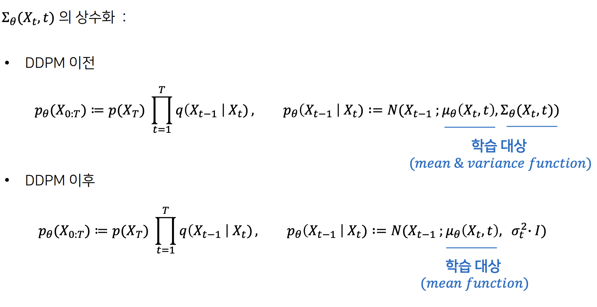<figcaption></figcaption></figure>

*   $$\beta_t$$는 스케줄링으로 다양한 전략을 세울 수 있음

    * Linear schedule / Quad schedule, Sigmoid schedule 등

    ```jsx
    def make_beta_schedule(schedule, n_timestep, linear_start=1e-4, linear_end=2e-2, cosine_s=8e-3):
        if schedule == "linear":
            betas = (
                    torch.linspace(linear_start ** 0.5, linear_end ** 0.5, n_timestep, dtype=torch.float64) ** 2
            )

        elif schedule == "cosine":
            timesteps = (
                    torch.arange(n_timestep + 1, dtype=torch.float64) / n_timestep + cosine_s
            )
            alphas = timesteps / (1 + cosine_s) * np.pi / 2
            alphas = torch.cos(alphas).pow(2)
            alphas = alphas / alphas[0]
            betas = 1 - alphas[1:] / alphas[:-1]
            betas = np.clip(betas, a_min=0, a_max=0.999)

        elif schedule == "sqrt_linear":
            betas = torch.linspace(linear_start, linear_end, n_timestep, dtype=torch.float64)
        elif schedule == "sqrt":
            betas = torch.linspace(linear_start, linear_end, n_timestep, dtype=torch.float64) ** 0.5
        else:
            raise ValueError(f"schedule '{schedule}' unknown.")
        return betas.numpy()
    ```
* 직관적으로, 각 step에서 다양한 스케일의 가우시안 노이즈를 예측해서 denoising에 활용

<figure>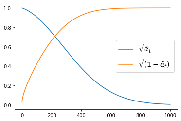<figcaption></figcaption></figure>

<figure>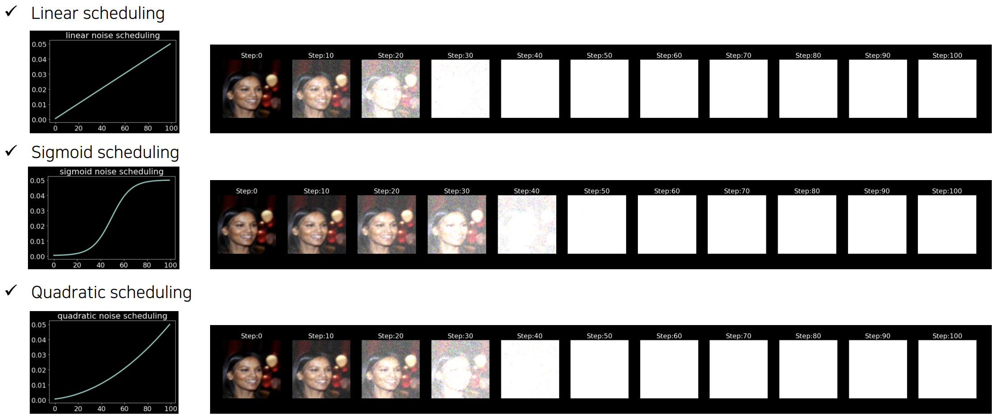<figcaption></figcaption></figure>

### Simplified Loss

* ELBO Denoising Term의 Loss를 간소화하면 아래와 같다.

$$
\begin{aligned}
L_t 
&= \mathbb{E}_{\mathbf{x}_0, \boldsymbol{\epsilon}} \Big[\frac{1}{2 \| \boldsymbol{\Sigma}_\theta(\mathbf{x}_t, t) \|^2_2} \| \color{blue}{\tilde{\boldsymbol{\mu}}_t(\mathbf{x}_t, \mathbf{x}_0)} - \color{green}{\boldsymbol{\mu}_\theta(\mathbf{x}_t, t)} \|^2 \Big] \\
&= \mathbb{E}_{\mathbf{x}_0, \boldsymbol{\epsilon}} \Big[\frac{1}{2  \|\boldsymbol{\Sigma}_\theta \|^2_2} \| \color{blue}{\frac{1}{\sqrt{\alpha_t}} \Big( \mathbf{x}_t - \frac{1 - \alpha_t}{\sqrt{1 - \bar{\alpha}_t}} \boldsymbol{\epsilon}_t \Big)} - \color{green}{\frac{1}{\sqrt{\alpha_t}} \Big( \mathbf{x}_t - \frac{1 - \alpha_t}{\sqrt{1 - \bar{\alpha}_t}} \boldsymbol{\boldsymbol{\epsilon}}_\theta(\mathbf{x}_t, t) \Big)} \|^2 \Big] \\
&= \mathbb{E}_{\mathbf{x}_0, \boldsymbol{\epsilon}} \Big[\frac{ (1 - \alpha_t)^2 }{2 \alpha_t (1 - \bar{\alpha}_t) \| \boldsymbol{\Sigma}_\theta \|^2_2} \|\boldsymbol{\epsilon}_t - \boldsymbol{\epsilon}_\theta(\mathbf{x}_t, t)\|^2 \Big] \\
&= \mathbb{E}_{\mathbf{x}_0, \boldsymbol{\epsilon}} \Big[\frac{ (1 - \alpha_t)^2 }{2 \alpha_t (1 - \bar{\alpha}_t) \| \boldsymbol{\Sigma}_\theta \|^2_2} \|\boldsymbol{\epsilon}_t - \boldsymbol{\epsilon}_\theta(\sqrt{\bar{\alpha}_t}\mathbf{x}_0 + \sqrt{1 - \bar{\alpha}_t}\boldsymbol{\epsilon}_t, t)\|^2 \Big] 
\end{aligned}
$$

* 논문에서는 weight term을 무시하고 Loss를 더욱 간소화하였다. (좀 더 자세한 내용은 [https://arxiv.org/pdf/2208.11970.pdf](https://arxiv.org/pdf/2208.11970.pdf) 논문을 참조)
  * $$\mathbf{x}_0$$에서 $$\boldsymbol{\epsilon}$$을 계속 더하면서 $$\mathbf{x}_t$$를 만들고, $$\mathbf{x}_t$$를 이용해 $$\boldsymbol{\epsilon}_{\theta}$$을 예측하는 문제로 바뀜

$$
\begin{aligned}
L_t^\text{simple}
&= \mathbb{E}_{t \sim [1, T], \mathbf{x}_0, \boldsymbol{\epsilon}_t} \Big[\|\boldsymbol{\epsilon}_t - \boldsymbol{\epsilon}_\theta(\mathbf{x}_t, t)\|^2 \Big] \\
&= \mathbb{E}_{t \sim [1, T], \mathbf{x}_0, \boldsymbol{\epsilon}_t} \Big[\|\boldsymbol{\epsilon}_t - \boldsymbol{\epsilon}_\theta(\sqrt{\bar{\alpha}_t}\mathbf{x}_0 + \sqrt{1 - \bar{\alpha}_t}\boldsymbol{\epsilon}_t, t)\|^2 \Big]
\end{aligned}
$$

<figure><figcaption></figcaption></figure>

### Experiments

<figure>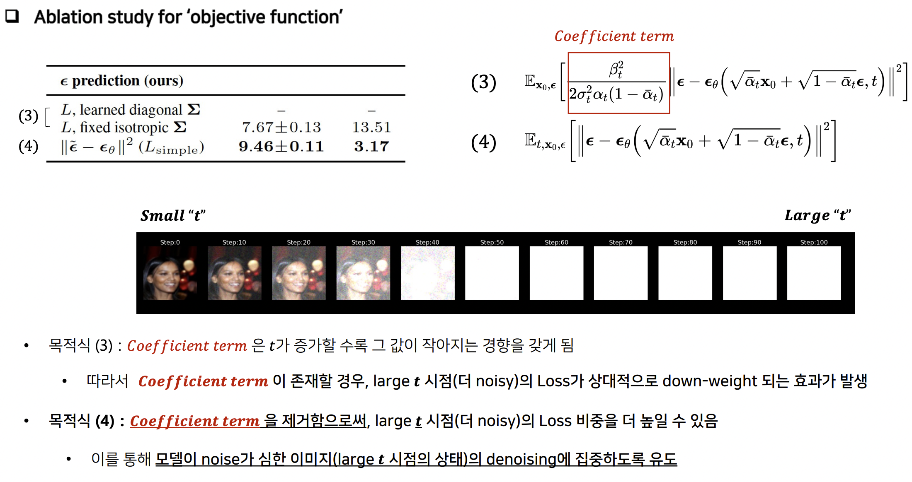<figcaption></figcaption></figure>

### Hands-on

* [https://github.com/acids-ircam/diffusion\_models](https://github.com/acids-ircam/diffusion_models)
* [https://nn.labml.ai/diffusion/ddpm/index.html](https://nn.labml.ai/diffusion/ddpm/index.html)

## 3. DDIM (Deep Diffusion Image Model)

***


관련 논문: Denoising Diffusion Implicit Models ([https://arxiv.org/pdf/2010.02502.pdf](https://arxiv.org/pdf/2010.02502.pdf))


### Background

* DDPM은 마르코프 체인으로 모델을 훈련하고 추론하기 때문에 sample을 생성하려면 많은 스텝을 거쳐야 함 → 수천 번의 스텝이 있을 수 있으며, 단일 샘플을 생성하려면 모든 스텝을 반복해야 하므로 네트워크를 한 번만 통과하는 GAN/VAE에 비해 속도가 매우 느림
  * 논문에 따르면, NVIDIA RTX 2080Ti에서 32x32 이미지 50만 장을 샘플링하는데 DDPM에서 약 20시간 소요 (GAN에서는 1분이 채 걸리지 않는다고 함)
* DDIM에서는 좀 더 빠르게 sample을 생성하기 위해 non-markovian diffusion process로 DDPM을 일반화하여 보다 deterministic한 generative process 학습이 가능
  * 즉, DDPM의 posterior를 일반화하고 stochastic한 항을 deterministic function으로 만든 것
* DDPM의 loss가 marginal distribution인 $$q(\mathbf{x}_{t} | \mathbf{x}_{0})$$에 의존할 뿐, joint distribution인 $$q(\mathbf{x}_{1:T} | \mathbf{x}_{0})$$에는 직접적으로 의존하지 않는다는 것을 발견
* 즉, 이미지 생성 및 재구성 과정에서 Diffusion Process를 건너뛰는 것이 가능함. 이는 DDIM이 Diffusion Process의 각 스텝에서 이미지의 특징을 추출하여 이를 활용하여 이미지를 생성하는 것이 아니라, 특정 스텝을 건너뛰어 이미지를 생성하는 방식으로 작동하기 때문임

<figure>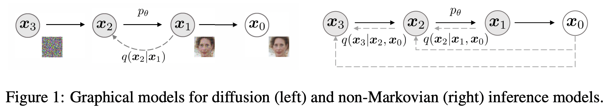<figcaption></figcaption></figure>

### Forward diffusion

* Forward diffusion은 DDPM과 동일

### Reverse diffusion

* DDPM은 forward process부터 설계하고 posterior를 유도해 내지만, DDIM은 $$\mathbf{x}_{t}$$와 $$\mathbf{x}_{0}$$이 주어졌을 때 $$\mathbf{x}_{t-1}$$을 예측하는 posterior부터 설계하는 방식으로 변경
* DDIM의 reverse diffusion process는 deterministic이기 때문에 $$\mathbf{x}_{t}$$에만 의존 → DDPM처럼 $$p$$의 특정 output을 가정하여 가우시안으로 샘플링하는 대신 $$\mathbf{x}_{t}$$만 사용하여 $$\mathbf{x}_{0}$$를 복원하는 loss를 사용
* $$f_{\theta}^{(t)}(\mathbf{x}_t)$$는 노이즈 $$\mathbf{x}_t$$가 주어졌을 때 네트워크를 거쳐 $$\mathbf{x}_0$$를 예측

$$
f_{\theta}^{(t)}(\mathbf{x}_t) = \dfrac{(\mathbf{x}_t - \sqrt{1-\bar{\alpha}_t} \cdot \boldsymbol{\epsilon}_{\theta}^{(t)} (\mathbf{x}_t)) } {\sqrt{\bar{\alpha}_t}}
$$

* &#x20;$$\mathbf{x}_{t-1}$$에 대한 수식을 풀어쓰면 아래와 같다 (sigma term이 나오는 이유은 unit variance로 맞추기 위해)

$$
\begin{aligned}
\mathbf{x}_{t-1} 
&= \sqrt{\bar{\alpha}_{t-1}}\mathbf{x}_0 +  \sqrt{1 - \bar{\alpha}_{t-1}}\boldsymbol{\epsilon}_{t-1} \\
&= \sqrt{\bar{\alpha}_{t-1}}\mathbf{x}_0 + \sqrt{1 - \bar{\alpha}_{t-1} - \sigma_t^2} \boldsymbol{\epsilon}_t + \sigma_t\boldsymbol{\epsilon} \\
&= \sqrt{\bar{\alpha}_{t-1}}\mathbf{x}_0 + \sqrt{1 - \bar{\alpha}_{t-1} - \sigma_t^2} \frac{\mathbf{x}_t - \sqrt{\bar{\alpha}_t}\mathbf{x}_0}{\sqrt{1 - \bar{\alpha}_t}} + \sigma_t\boldsymbol{\epsilon}
\end{aligned}
$$

* 따라서, Reverse process는 아래와 같이 도출되는데 $$\sigma_t = 0$$인 경우(random noise를 없애는 경우) deterministic임 → 이를 consistency라고 함
  * DDPM에서는 reverse process를 진행할 때, noise를 제거하고 다시 조금 더하는 과정이 들어가는데 더하는 과정을 없앰

$$
q_\sigma(\mathbf{x}_{t-1} |\mathbf{x}_t, \mathbf{x}_0)=\mathcal{N}(\mathbf{x}_{t-1}; \sqrt{\alpha_{t-1}}\mathbf{x}_0+\sqrt{1-\alpha_{t-1}-\sigma^2_t}\cdot\underbrace{\frac{\mathbf{x}_t-\sqrt{\alpha_t}\mathbf{x}_0}{\sqrt{1-\alpha_t}}}_{\epsilon_\theta(\mathbf{x}_t)}, \, \sigma^2_tI)
$$

$$
\mathbf{x}_{t-1}=\sqrt{\alpha_{t-1}}\underbrace{\left(\frac{\mathbf{x}_t-\sqrt{1-\alpha_t}\epsilon_\theta(\mathbf{x}_t)}{\sqrt{\alpha_t}}\right)}_{\text{predicted} \, \mathbf{x}_0=f_\theta(\mathbf{x}_t)}+\underbrace{\sqrt{1-\alpha_{t-1}-\sigma^2_t}\cdot\epsilon_\theta(\mathbf{x}_t)}_{\text{direction pointing to} \, \mathbf{x}_t}+\underbrace{\sigma_t\epsilon}_{\text{noise}}
$$

* 위의 식에서 알 수 있는 부분은 Reverse process에서  $$\mathbf{x}_{0}$$ 를 다이렉트로 예측하므로 step을 건너뛰는 것이 가능
* 실제 훈련은 DDPM으로 수행하고, 추론을 DDIM을 비롯한 다양한 방법을 사용하는 것이 추세임

### Notes

* OpenAI는 1스텝만으로 샘플링 가능한 Consistency model의 논문과 코드를 공개
* [https://arxiv.org/abs/2303.01469](https://arxiv.org/abs/2303.01469)
* [https://github.com/openai/consistency\_models](https://github.com/openai/consistency_models)

## 4. Classifier Guided Diffusion

***


관련 논문: Diffusion Models Beat GANs on Image Synthesis ([https://arxiv.org/pdf/2105.05233.pdf](https://arxiv.org/pdf/2105.05233.pdf))


### Background

* CIFAR-10에서는 SOTA를 달성했으나, LSUN\&ImageNet에서는 GAN에게 밀림
* GAN은 fidelity를 위해 diversity 희생
  * "Fidelity"는 원본과 복제본 간의 유사성을 측정함으로써 새로운 정보가 얼마나 정확하게 전달되는지를 나타내는 의미 (precision과 유사)
  * Generator는 본질적으로 discriminator만 속일 수 있으면 되기 때문에 fidelity가 높고 diversity가 낮음
* Diffusion model에도 이런 전략을 도입하면 fidelity를 올릴 수 있지 않을까라는 아이디어에서 출발 → 실험해 보니 생성된 이미지의 퀄리티가 향상됨
* Conditional reverse process: $$t$$ 시점의 노이즈 이미지가 주어졌을 때, 그 이미지의 원래 레이블이 무엇인지 맞추는 classifier $$p_\phi(y|x_t)$$를 학습하고 해당 classifier의 gradient를 이용해서 condition을 부여함으로써 pre-trained DDPM의 생성 과정을 guide한다는 아이디어

<figure>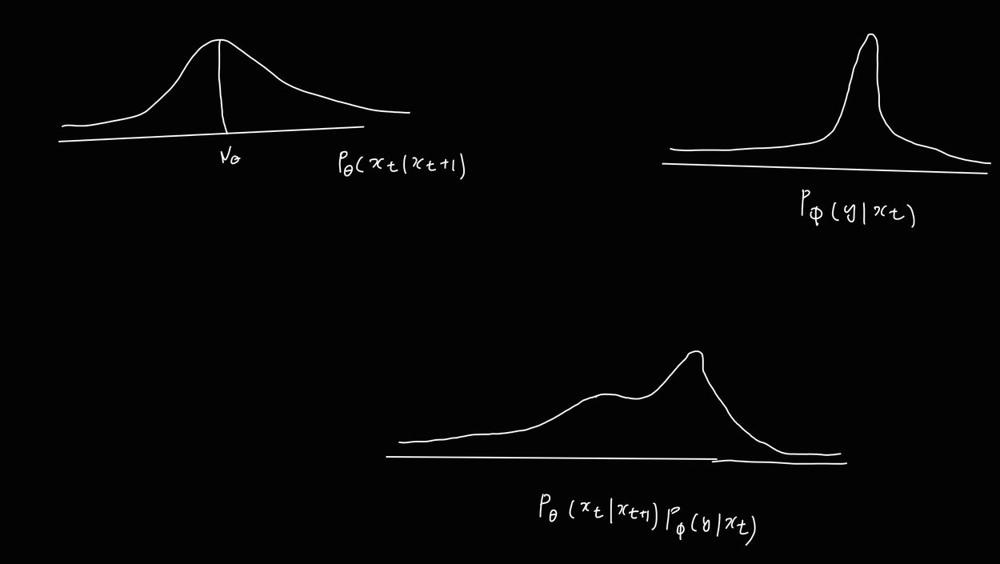<figcaption></figcaption></figure>

### Overview

* 아키텍처 개선
  * Multi-head attention
  * Multi resolution attention
  * Adaptive Group Normalization (AdaGN)
    * GN: 채널을 여러 그룹으로 나누어 각 그룹별로 정규화를 수행. 그룹 크기는 사전에 정해짐
    * AdaGN: 각 샘플에 대해 다른 크기의 그룹을 생성하며, 각 그룹의 크기와 비율을 데이터에 따라 동적으로 조정한다. 이는 GN에서는 처리할 수 없는 feature map의 크기나 그룹 크기가 다른 경우에 유용함.

<figure><figcaption></figcaption></figure>

*   Truncation trick: Classifier guidance

    $$
    q(\mathbf{x}_t \vert \mathbf{x}_{t+1}, y) \sim p_\theta(\mathbf{x}_t \vert \mathbf{x}_{t+1})p_\phi(y\vert \mathbf{x}_{t})
    $$
* $$p_{\theta}$$ 의 경우, 가우시안 분포 정의 & log를 씌우면 아래와 같이 표현되고

<figure>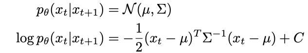<figcaption></figcaption></figure>

* $$p_{\phi}$$의 경우, $$\mu$$를 기준으로 테일러 급수로 근사하면 아래과 같이 표현된다.

<figure>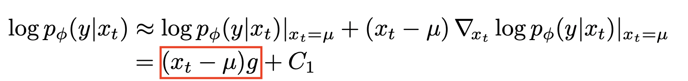<figcaption></figcaption></figure>

* 이 수식들을 전개하면 아래와 같이 간소화할 수 있다. ($$g$$는 classifier의 gradient로 $$g = \nabla_{\mathbf{x}t} \log p\phi(y|\mathbf{x}_t)$$, $$C_4$$는 상수값)

<figure>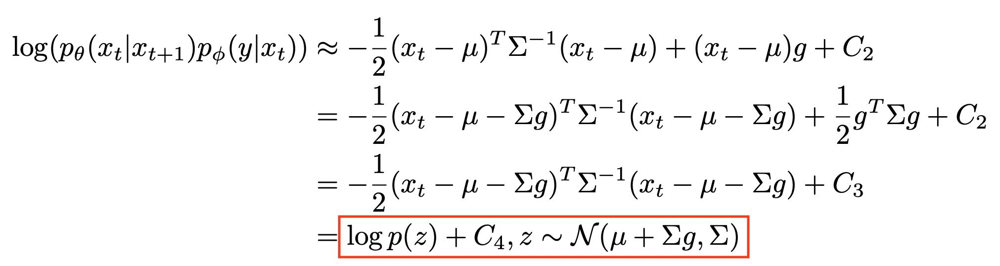<figcaption></figcaption></figure>

* 따라서, 논문의 알고리즘 1이 도출된다. ($$s$$는 gradient scale 파라메터로 $$s$$가 클수록 이미지의 fidelity가 높아짐)

<figure>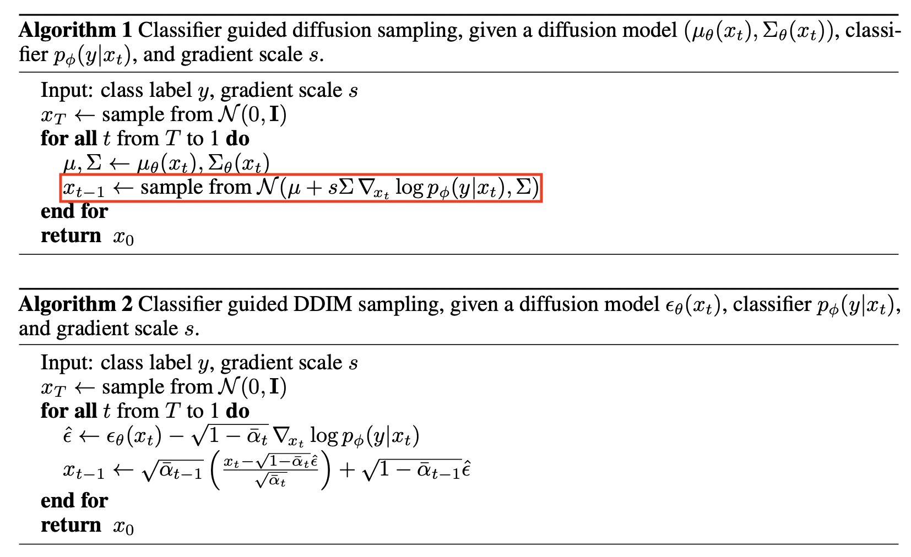<figcaption></figcaption></figure>

벡터 관점에서 보자면, 기존 diffusion에서 classifier 가이드를 준다면 (클래스 레이블로 유도하는 방향 벡터 합산) 아래와 같음.



<figure>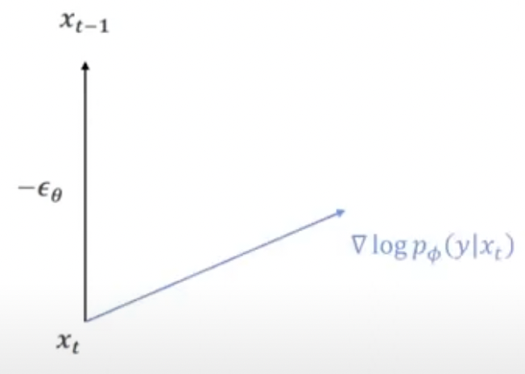<figcaption></figcaption></figure>



<figure>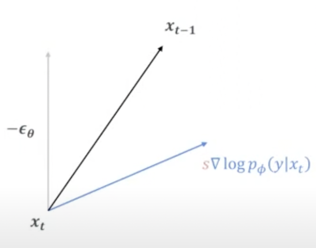<figcaption></figcaption></figure>



<figure>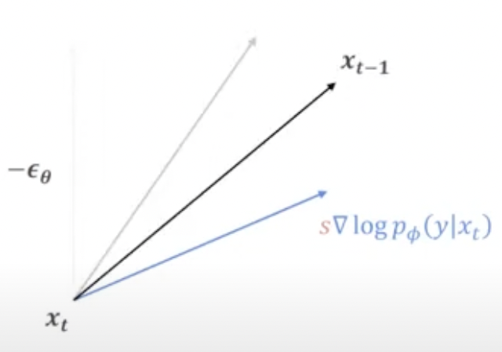<figcaption></figcaption></figure>



$$s$$가 커질 경우 좀 더 클래스 레이블을 유도

* 다만, GAN/VAE와 같은 생성모델과 달리 latent representation을 직접 학습하지 못함

## 5. Classifier-free Guided Diffusion

***

관련 논문: GLIDE: Towards Photorealistic Image Generation and Editing with Text-Guided Diffusion Models ([https://arxiv.org/pdf/2112.10741.pdf](https://arxiv.org/pdf/2112.10741.pdf))

### Background

* Classifier-based guidance는 추가 classifier 학습으로 인한 복잡성 증가 이슈가 있음
* Classifier-based guidance는 noise level에 따른 classifier를 따로 학습시켜야 할 뿐만 아니라 classifier based metric인 IS(Inception Score)와 FID를 의도적으로 향상하기 위한 adversarial attack일 수 있음
* Classifier-free guidance는 classifier의 기울기 방향으로 샘플링하는 대신 conditional diffusion model과 함께 학습된 unconditional diffusion model의 score 추정치를 혼합한다.
* 주의: classifier가 필요 없다는 뜻이 레이블이 필요 없다는 뜻은 아님. 정답 클래스 레이블이나 텍스트 프롬프트가 필요함

## Overview

* Diffusion 모델을 condition과 uncondition을 동시에 훈련하는 방식으로 작동
* unconditional diffusion 모델 $$p_\theta(\mathbf{x})$$이 $$\boldsymbol{\epsilon}_\theta(\mathbf{x}_t, t)$$에 의해 산출되고 conditional diffusion 모델 $$p_\theta(\mathbf{x|y})$$이 $$\boldsymbol{\epsilon}_\theta(\mathbf{x}_t, t, y)$$에 의해 산출된다고 가정할 때, 조건부 정보인 $$y$$가 랜덤하게 드롭아웃(null label $$\varnothing$$로 대체됨)되어 모델이 y condition이 없이도 이미지를 생성하는 법을 배우게 된다.
  * 다시 말해, $$\boldsymbol{\epsilon}_\theta(\mathbf{x}_t, t) = \boldsymbol{\epsilon}_\theta(\mathbf{x}_t, t, y=\varnothing)$$&#x20;
* 추론 중에서는 unconditional gradient와 conditional gradient 사이를 보간하게 되며, 이 때 guidance weight를 크게 줄수록 프롬프트에 적절한 샘플 이미지를 얻게 됨
* 좀 더 직관적으로 생각해 보면 diffusion model에서 implicit classifier를 구축하게 되는데, guided classifier는 $$x$$의 대부분의 정보가 $$y$$를 예측하는 것과 관련이 없기 때문에, 입력에 따라 분류기의 기울기를 취하면 입력 공간에서 임의의(심지어 적대적인) 방향이 나올 수 있음. 하지만, classifier-free는 end-to-end로 single network로 구성되므로 이런 이슈에서 좀 더 자유로움.
* GLIDE는 CLIP guidance와 classifier-free guidance를 테스트함

$$
\begin{aligned}
\nabla_{\mathbf{x}_t} \log p(y \vert \mathbf{x}_t)
&= \nabla_{\mathbf{x}_t} \log p(\mathbf{x}_t \vert y) - \nabla_{\mathbf{x}_t} \log p(\mathbf{x}_t) \\
&= - \frac{1}{\sqrt{1 - \bar{\alpha}_t}}\Big( \boldsymbol{\epsilon}_\theta(\mathbf{x}_t, t, y) - \boldsymbol{\epsilon}_\theta(\mathbf{x}_t, t) \Big) \\
\bar{\boldsymbol{\epsilon}}_\theta(\mathbf{x}_t, t, y)
&= \boldsymbol{\epsilon}_\theta(\mathbf{x}_t, t, y) - \sqrt{1 - \bar{\alpha}_t} \; w \nabla_{\mathbf{x}_t} \log p(y \vert \mathbf{x}_t) \\
&= \boldsymbol{\epsilon}_\theta(\mathbf{x}_t, t, y) + w \big(\boldsymbol{\epsilon}_\theta(\mathbf{x}_t, t, y) - \boldsymbol{\epsilon}_\theta(\mathbf{x}_t, t) \big) \\
&= (w+1) \boldsymbol{\epsilon}_\theta(\mathbf{x}_t, t, y) - w \boldsymbol{\epsilon}_\theta(\mathbf{x}_t, t)
\end{aligned}
$$

$$
\bar{\boldsymbol\epsilon}_{\theta}(\mathbf{z}_{\lambda}, \mathbf{c}) = (1+w) \boldsymbol\epsilon_{\theta}(\mathbf{z}_{\lambda}, \mathbf{c}) - w\boldsymbol\epsilon_{\theta}(\mathbf{z}_{\lambda})
$$

이 식을 $$w$$에 대해 정리하면,

$$
(1+w)\boldsymbol{\epsilon}_{\theta}(\mathbf{z}_t, \mathbf{c}) - w\boldsymbol{\epsilon}_{\theta}(\mathbf{z}_t) = w(\boldsymbol{\epsilon}_{\theta}(\mathbf{z}_t, \mathbf{c}) - \boldsymbol{\epsilon}_{\theta}(\mathbf{z}_t) ) + \boldsymbol{\epsilon}_{\theta}(\mathbf{z}_t, \mathbf{c})
$$

* 실제 실험을 해보니 classifier-free guidance 결과가 더 좋았음
* 저자들은 CLIP guidance가 더 잘 일치하는 이미지 생성을 최적화하기보다는 CLIP 모델에 대한 적대적 예시로 모델을 악용하기 때문이라는 가설을 세움
