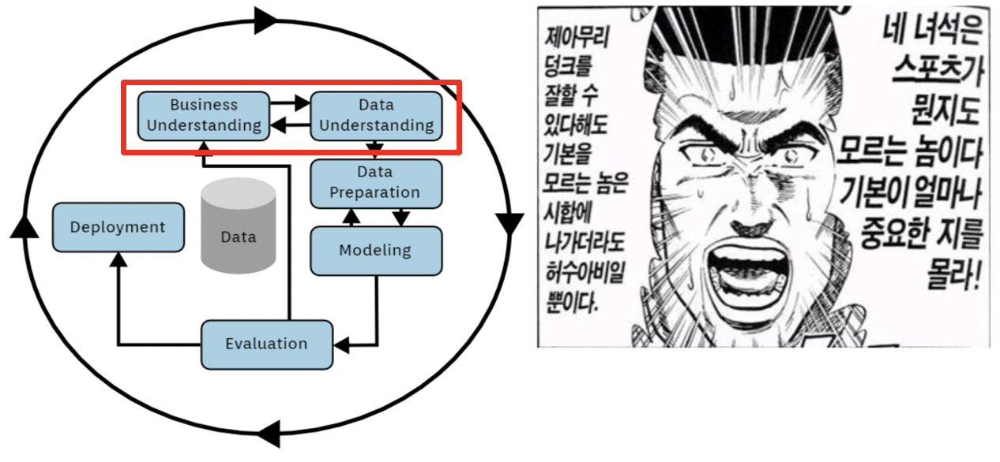
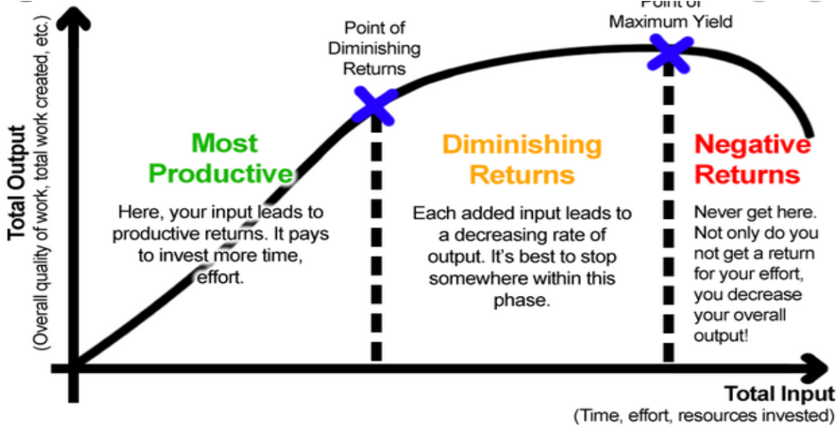
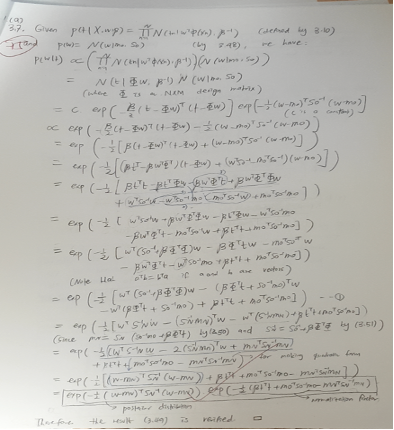
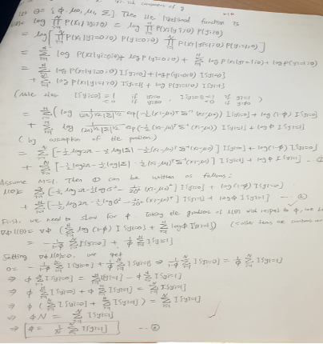
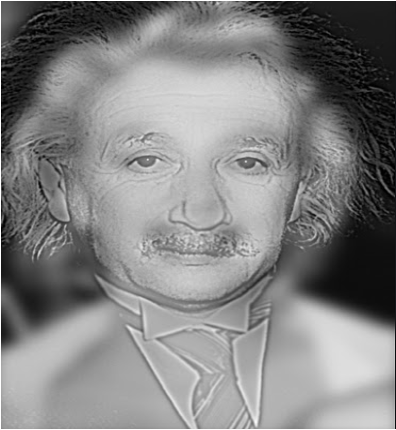

# 데이터 과학이란?

## 1. 데이터 과학에 대한 오해와 진실

### 데이터 과학에 대한 환상과 현실

### 데이터만 모으면 머신 러닝이 전부 해준다?

* CRISP-DM(Cross-Industry Standard Process for Data Mining): 데이터 과학을 위한 정석  문제 정의부터 시작

### 데이터가 많을수록 좋다?

* 더 많은 데이터 -> 정확도 무조건 향상?

#### Business/Data Understanding의 중요성

* 주택/아파트 경매가 예측
* 경매 낙찰 시마다 감정가에서 20% discount
* 2회 이상 낙찰 시 큰 폭으로 경매가 감소
* 도시별 낙찰율, 낙찰가
* 기초 통계 분석, 구간 자르기
* Linear Regression > XGBoost > 딥러닝

### 빅데이터가 반드시 필요하다?

* 닭잡는 칼에 소잡는 칼 쓰지 말기
* 스몰 데이터부터 시작&#x20;
  * 표본추출 기법 중요 (잘 모르면 통계 백그라운드 가진 분께 도움 요청)&#x20;
  * 쉬운 예시: 여론조사, 선거 출구조사&#x20;
  * 데이터의 양을 점진적으로 늘리면서 실험 반복&#x20;
* 검색 & 개인화 추천은 빅데이터 필요

### 스몰데이터도 없다면 안된다?

* 수많은 레퍼런스
  * 베이지안&#x20;
  * Off-the-shelf features&#x20;
  * Transfer Learning&#x20;
* 데이터 수집으로 불확실성 감소&#x20;
* 수학, 통계학 지식이 있으면 유리

### Tree 모델 or 딥러닝이 킹왕짱?

* 이렇게 주장하는 분은 업계 퇴출 0순위&#x20;
* 딥러닝으로 주가 예측 잘한다고 주장하는 자칭 전문가 vs. 차트분석 전문가&#x20;
* Parametric vs. Non-parametric 왜 설명 가능한 머신러닝(eXplainable AI)이 유행할까요?&#x20;
* Tree & 딥러닝: 어떤 형태로 튀어나올지 예측 불가능&#x20;
  * Hint: One-hot Encoding은 범주형 데이터 변환에서만 쓰이지 않습니다.

복잡한 수학/통계를 알아야 한다?

* 99% 거짓, 1% 진실&#x20;
  * 진정한 의미의 데이터 과학자가 되려면 필수: 고난의 행군 &#x20;
    * 공짜 점심 없음. 수학은 내 친구 기본기 >>> 넘사벽 >>> 초필살기
    *  &#x20;
  *
    * AIML 서비스 개발은 개발자 background가 더 유리&#x20;
* 평균, 표준편차만 알아도 절반은 먹고 들어감&#x20;
* 시각화도 매우 중요
* 나이팅게일 예시: 후방 병원에서 훨씬 많은 환자가 사망한다는 사실을 데이터 시각화로 알아냄 -> 후방 사망률 1/10로 개선

### 데이터 과학자만 있으면 된다?

* 각 분야의 전문가들이 필요합니다.&#x20;
  * 인프라&#x20;
  * 안정적인 DB 구축 및 구조화&#x20;
  * 모델 자동화 Deployment&#x20;

### 훈련 성능, latency만 좋으면 된다?

* 프로덕션에서 사고 터지기 딱 좋음 (실제 사례: xx억 날아감)

* 고객이 고수한다면?  잘 설득하면 좋겠지만 현실은…

### A/B 테스트는 필수가 아니다?

* 무조건 써야 함. 현실 데이터는 상식에 반하는 결과를 만나는 경우가 부지기수&#x20;
* 시간, 요일, 주 단위의 비즈니스 사이클이 아닌 경우는 다른 대안 활용&#x20;
* Counterfactual evaluation 활용, MAB(Multi Armed Bandits) 활용

### 모수의 함정 (Simpsons Paradox)

* A 기업: 평균연봉 5천만원, 평균연령 35세&#x20;
* B 기업: 평균연봉 8천만원, 평균연령 30세&#x20;
* 이 사실만으로 B가 A보다 좋다고 할 수 있을까요?
* 데이터는 거짓말을 하지 않지만, 잘못된 통계 해석은 거짓말이 될 수 있습니다.
* 아래 사진을 가까이서 보기 & 멀리서 보기 (모니터에서 5걸음 뒤로)

|   |
| - |

## 2. 데이터 과학자의 역할

### 팀스포츠

DJ Patil (데이터 과학자라는 표현을 만든 분) says:

> People make a mistake by forgetting that Data Science is a team sport. People might point to people like me or Hammerbacher or Hilary or [Peter Norvig](https://www.quora.com/Peter-Norvig-1) and they say, oh look at these people! It’s false, it’s totally false, there’s not one single data scientist that does it all on their own.
>
> Data science is a team sport, somebody has to bring the data together, somebody has to move it, someone needs to analyze it, someone needs to be there to bounce ideas around.
>
> 출처: [https://dataconomy.com/2014/12/jumping-from-phd-to-data-scientist-3-tips-for-success/](https://dataconomy.com/2014/12/jumping-from-phd-to-data-scientist-3-tips-for-success/)

### 현업과의 커뮤니케이션

* 화성에서 온 남자, 금성에서 온 여자&#x20;
* 참신한 것을 분석해 달라는 요구에 휘둘리지 말 것&#x20;
  * 대부분의 현상, 추이는 현업들이 알고 있음&#x20;
  * AIML은 참신한 것을 뽑아주는 마법봉이 아님&#x20;
* **AIML의 진정한 힘은 정량화를 통한 Next Best Action/Item 예측**&#x20;
  * 예시: MLB 세이버매트릭스, Statcast

### 데이터 과학자에게 닥치는 시련

* 한 단어 요약: Pipeline Jungle&#x20;
  * Subset: 스파게티 코드&#x20;
  * 어떻게든 모델 훈련/배포하면 끝?&#x20;
* 많은 데이터 과학자들은 DevOps 역량이 없음&#x20;
  * 컨테이너가 뭔지도 모름 (대다수)&#x20;
  * 좋은 줄은 알겠는데 도커 빌드하는 법 모름&#x20;
  * 도커 빌드까지는 알겠지만 구체적인 사용 방법 모름&#x20;
  * K8S로 가면 정신이 혼미해짐

### 한국 데이터 과학자의 또다른 시련

* 앵무새 모드 데이터 전처리가 왜 중요하냐면 말이죠. 블라블라…반복
* 하지만, 반복학습의 효과를 위해서 감내해야 함
* &#x20;
* (높은 빈도로) 엉망진창 내부 데이터&#x20;
* 내/외부 규제

### 추천 도서

* 데이터 과학에 발 담근 비 tech분들께 강추합니다.

