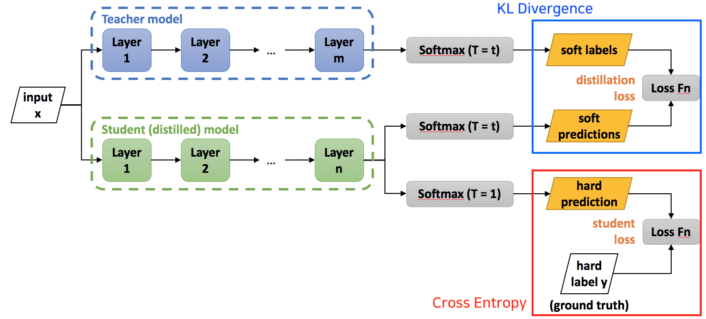
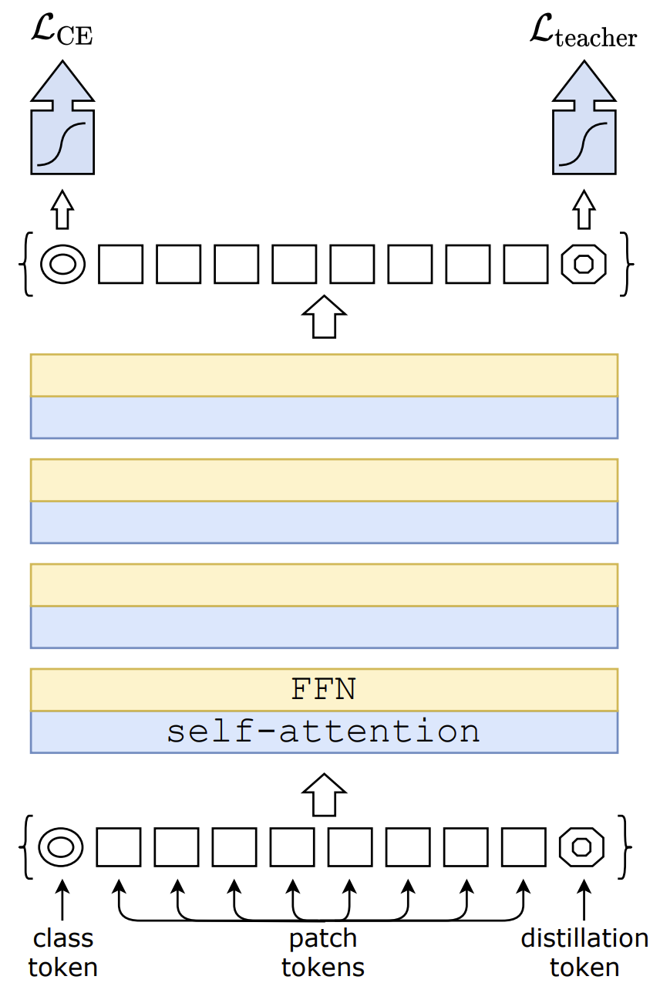
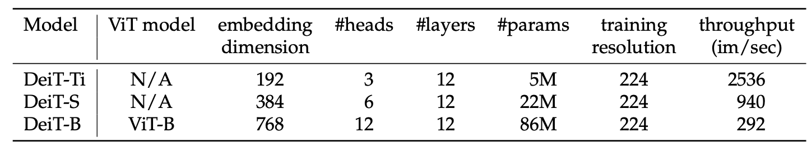
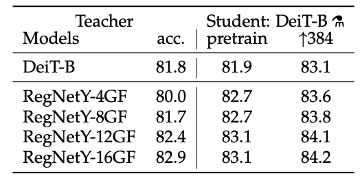
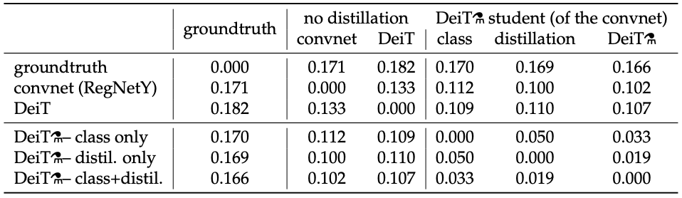
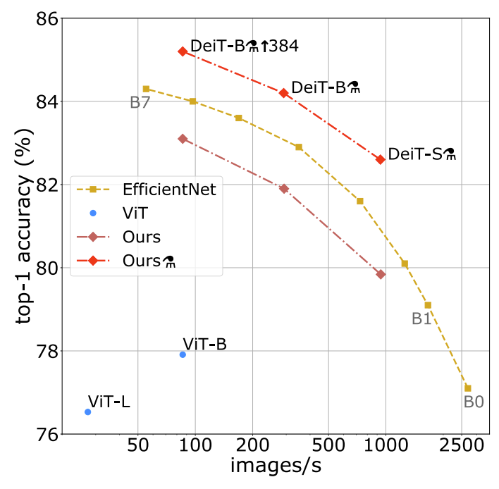

# DeiT \(Training Data-efficient Image Transformers & Distillation through Attention\)

## 1. Overview

* Facebook Research에서 2020년 12월 공개; [https://github.com/facebookresearch/deit](https://github.com/facebookresearch/deit)
* Knowledge Distillation 기법을 적용하여 대용량 데이터셋으로 pre-training하는 과정 없이 높은 성능 달성
* 대부분의 구조는 ViT와 동일하며, data augmentation, regularization 등 다양한 기법들을 적용하고 기존의 class token에 distillation token을 추가하여 학습

## 2. Knowledge Distillation

### Summary

* Hinton et al., "Distilling the Knowledge in a Neural Network" \(NIPS 2014\)
* 한줄요약: 청출어람 \(big 네트워크에서 축적된 정보를 small 네트워크로 전달하여 small 네트워크에서도 big 네트워크와 비슷한 성능을 내는 것이 목적\)
  * big = teacher, small = student
  * Teacher 모델의 Inductive bias를 soft한 방법으로 전달
  * Supervised Learning으로 학습한 모델의 output은 hard label이 아니라 logit에 대한 출력으로 다른 클래스들의 가중치도 포함되어 있음.

### Objective

* Teacher의 모델의 softmax 분포와 student 모델의 softmax 분포의 KL divergence를 최소화. 
* Student loss + Distillation loss
  * Cross Entropy between ground truth and student's hard predictions\(standard softmax\) + Cross Entropy between the student's soft predictions and the teacher's soft targets 
* Soft Distillation:

$$
\begin{equation}
\begin{split}

& \mathcal{L} = \alpha * \mathcal{L}_{CE}(y_{pred}, y_{true}) + \beta * KL(y_{pred}, y_{teacher}) \\
& \mathcal{L}(x;W) = (1-\alpha) * \mathcal{L}_{CE}(y, \sigma(z_s)) + 2 \alpha T^2 * KL(\sigma(\dfrac{z_s}{T}), \sigma(\dfrac{z_t}{T})) 

\end{split}
\end{equation}
$$

* Hard Distillation:

$$
\mathcal{L}(x;W) = 0.5 * \mathcal{L}_{CE}(y, \sigma(z_s)) + 0.5  * \mathcal{L}_{CE}(y_t, \sigma(z_s)),\; y_t = \text{argmax}_c z_t(c)
$$



### Temperature

* 더 많은 knowledge를 전달하기 위한 방법으로 Temperature\(T\)가 높을 수록 더 soft한 확률분포를 얻을 수 있음  \(T = 1일 때, Softmax와 동일\); $$\begin{align} p_i = \frac {\exp(\frac{z_i}{T})} {\sum_{j} \exp(\frac{z_j}{T})} \end{align}$$ 

| T | Logits | Softmax Probs |
| :--- | :--- | :--- |
| 1 | \[30, 5, 2, 2\] | \[1.0000e+00, 1.3888e-11, 6.9144e-13, 6.9144e-13\] |
| 10 | \[3, 0.5, 0.2, 0.2\] | \[0.8308, 0.0682, 0.0505, 0.0505\] |

## 3.  Model Architecture

* 기본적인 형태는 ViT와 동일하며, KD를 위한 distillation token을 추출
* class token과 distillation token의 코사인 유사도는 0.06이나 embedding을 수행 후 class embedding과  distillation embedding의 코사인 유사도를 계산하면 0.93
* class embedding과 distillation embedding을 concatenate하거나 합산하는 방법\(late fusion\)이 가능



## 4. Experiments

### Training Details

#### Models

* DeiT-B: baseline model; D = 768, h = 12, d = D/h = 64
* BeiT-B 384: 384x384 해상도로 파인튜닝 수행
* DeiT\(증류수 모양\): DeiT w/ distillation
* DeiT-S\(Small\), DeiT-Ti\(Tiny\): DeiT의 경량화 버전



#### Settings

* Transformer 기반 모델은 하이퍼파라메터 설정에 민감하므로 여러 가지 설정들을 조합하여 실험
* Stochastic depth, Mixup, Cutmix, Repeated Augmentation, Random Augmentation 등 적용
* Repeated Augmentation\(RA\)
  * 이미지 배치 $$B$$에서 $$\lceil |B|/m\rceil$$의 이미지들을 샘플링 후, 데이터를 $$m$$회 변환하여 늘림
  * 동일한 성격의 이미지들이 섞이므로, i.i.d scheme에 벗어나기에 Small Batch에서는 퍼포먼스가 저하되지만, Large Batch에서는 성능이 향상됨


### Performance

* CNN 기반의 teacher 네트워크가 transformer보다 top-1 accuracy가 높음



* Hard distillation 전반적으로 좋고, class token과 distillation token을 동시 사용하는 것이 성능이 좀 더 좋음


* Distillation 모델이 CNN 모델보다 좀 더 연관성이 높음 -&gt; Convnet의 inductive bias가 잘 전달됨을 알 수 있음.



### Accuracy

* ImageNet 기반으로 학습 시, ViT보다 우세하고\(top-1 +6.3%\) EfficientNet에 근접한 성능을 보임



## 5. Implementation

Source: [https://github.com/facebookresearch/deit/blob/main/losses.py](https://github.com/facebookresearch/deit/blob/main/losses.py)

```python
import torch
from torch.nn import functional as F


class DistillationLoss(torch.nn.Module):
    """
    This module wraps a standard criterion and adds an extra knowledge distillation loss by
    taking a teacher model prediction and using it as additional supervision.
    """
    def __init__(self, base_criterion: torch.nn.Module, teacher_model: torch.nn.Module,
                 distillation_type: str, alpha: float, tau: float):
        super().__init__()
        self.base_criterion = base_criterion
        self.teacher_model = teacher_model
        assert distillation_type in ['none', 'soft', 'hard']
        self.distillation_type = distillation_type
        self.alpha = alpha
        self.tau = tau

    def forward(self, inputs, outputs, labels):
        """
        Args:
            inputs: The original inputs that are feed to the teacher model
            outputs: the outputs of the model to be trained. It is expected to be
                either a Tensor, or a Tuple[Tensor, Tensor], with the original output
                in the first position and the distillation predictions as the second output
            labels: the labels for the base criterion
        """
        outputs_kd = None
        if not isinstance(outputs, torch.Tensor):
            # assume that the model outputs a tuple of [outputs, outputs_kd]
            outputs, outputs_kd = outputs
        base_loss = self.base_criterion(outputs, labels)
        if self.distillation_type == 'none':
            return base_loss

        if outputs_kd is None:
            raise ValueError("When knowledge distillation is enabled, the model is "
                             "expected to return a Tuple[Tensor, Tensor] with the output of the "
                             "class_token and the dist_token")
        # don't backprop throught the teacher
        with torch.no_grad():
            teacher_outputs = self.teacher_model(inputs)

        if self.distillation_type == 'soft':
            T = self.tau
            # taken from https://github.com/peterliht/knowledge-distillation-pytorch/blob/master/model/net.py#L100
            # with slight modifications
            distillation_loss = F.kl_div(
                F.log_softmax(outputs_kd / T, dim=1),
                F.log_softmax(teacher_outputs / T, dim=1),
                reduction='sum',
                log_target=True
            ) * (T * T) / outputs_kd.numel()
        elif self.distillation_type == 'hard':
            distillation_loss = F.cross_entropy(outputs_kd, teacher_outputs.argmax(dim=1))

        loss = base_loss * (1 - self.alpha) + distillation_loss * self.alpha
        return loss
```

## References

* Paper
  * [https://arxiv.org/pdf/2012.12877.pdf](https://arxiv.org/pdf/2012.12877.pdf)
* Blog
  * [https://ramesharvind.github.io/posts/deep-learning/knowledge-distillation/](https://ramesharvind.github.io/posts/deep-learning/knowledge-distillation/)
* Movie Clip
  * PR-297: [https://www.youtube.com/watch?v=DjEvzeiWBTo](https://www.youtube.com/watch?v=DjEvzeiWBTo)
* Implementation
  * [https://github.com/facebookresearch/deit](https://github.com/facebookresearch/deit)

