# DETR for Object Detection

## 1. Background

### Classical Object Detection Approach

* Bounding box의 형태와 중복되는 bounding box 제거를 위해 Anchor box를 정의하고 Non Maximum Supression\(NMS\)을 수행하는 과정이 필요함.
  * Heuristic한 Hand-crafted feature가 필요하고 non-differentiable하므로 end-to-end learning이 아님.
* 클래스 판별을 위한 Classification과 Bounding box 영역을 판별하기 위한 Regression 작업을 각각 수행해야 함.

## 2. DETR\(DEtection TRansformer\)

### Overview

* ROI, NMS 같은 작업이 필요 없는 set 기반 global loss와 트랜스포머\(Transformer\) 기반의 end-to-end object detection 모델
* Direct set prediction: 모든 object를 set으로 간주하고, 이분 매칭\(bipartite matching\)을 통해 loss function 계산
* 한줄요약: CNN-based features + 이분 매칭 loss function + encoder-decoder transformer

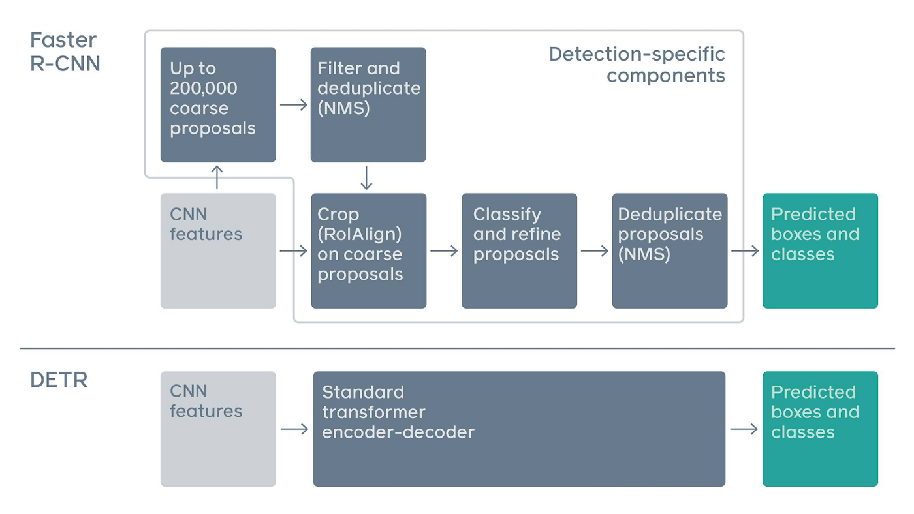

### Architecture

* CNN \(ResNet\) backbone을 통해 \(13, 13, 2048\) dimension feature map 생성 후, 1x1 convolution & flatten으로 \(13, 13, 256\) -&gt; \(169, 256\) 으로 reshaping
* Flatten된 feature에 2D 벡터에도 적용 가능한 spatial positional encoding 정보를 가산하여 Transformer Encoder에 피
* Transformer Decoder는 N개의 object queries과 encoder output을 input으로 받아 디코딩. 
  * N개의 고정된 크기의 object를 예측하기 위판 파라메터로 N은 이미지에 나오는 일반적인 object 수보다 충분히 크게 설정하며, 보통 100을 설정
* FFN\(Shared Feed Forward Network\)을 통과시킨 예측값과 정답값 사이의 이분 매칭으로 적절한 매칭 set을 찾고, 객체별로 bounding box를 최적화하는 loss function 계산
  * N개의 예측 중 n &lt;= N개는 object에 대한 예측이고 N-n개의 예측은 no object에 대한 예측
  * 각 예측은 클래스와 bounding box를 포함하는 tuple이며, 이분 매칭을 통해 인스턴스가 중복되지 않음

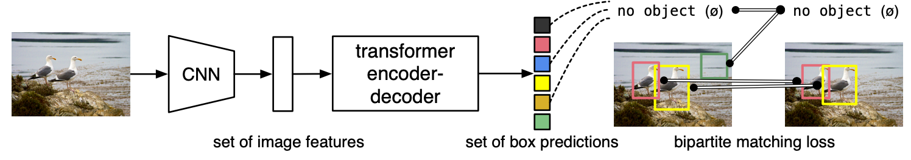

* 이분 매칭을 통해 가장 매칭이 잘 되는 pair들을 찾고, 동일하거나 유사한 클래스에 대해서 bounding box 차이에 따른 loss를 줄이도록 학습

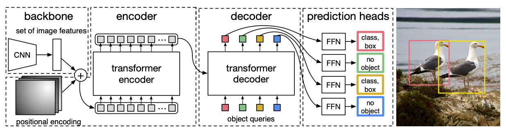

* 주의: Spatial positional encoding 및 Object queries 매 layer마다 계속 사용 

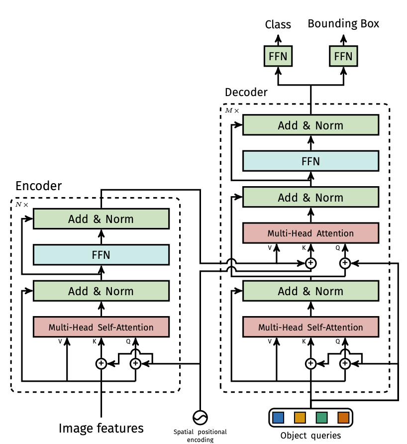

### Set Prediction Loss

#### Bipartite Matching Cost

* Matching Cost를 최소화하는 bounding box들의 순서를 찾는 문제 \(Search for a permutation of N elements $${\sigma \in \beta_N}$$ w/ the lowest cost\)로 이분 매칭 탐색

$$
\begin{equation}
\begin{split}
& \hat{\sigma}  = \text{argmin}_{\sigma \in \beta_N} \sum_{i=1}^N L_{match} (y_i, \hat{y}_{\sigma(i)}) \\
& L_{match} (y_i, \hat{y}_{\sigma(i)}) = -1_{\{c_i \neq \emptyset\}} \hat{p}_{\sigma(i)} + 1_{\{c_i \neq \emptyset\}} L_{box} (b_i, \hat{b}_{\sigma(i)})
\end{split}
\end{equation}
$$

* $$y_i = (c_i, b_i)$$, $$c_i$$는 target class label, $$b_i \in [0,1]^4$$는 bounding box 좌표, $$\hat{p}_{\sigma(i)}(c_i)$$는 class $$c_i$$에 속할 확률
* $$\sigma$$는 예측-정답 
* $$L_{match}$$좌측 항의 클래스 확률은 높을 수록 loss가 낮아야 하므로 - term이 들어가야 함 \(Cross entropy가 아닌 확률을 그대로 사용\)

#### Hungarian loss

* 상기 과정에서 매칭된 $$\sigma$$에 대 Hungarian loss로 모든 pair를 매칭
* A linear combination of a negative log-likelihood for class prediction and a box loss:
  * Log prob. term은 imbalanced class 분포를 고려하여 weighted cross entropy 적용
  * 또, 대부분의 클래스가 no object\($$\emptyset$$\)이기 때문에 발생하는 class imbalance 문제를 완화하기 위해 log probability term을 1/10로 감소
* $$L_{box}$$는 L1 loss와 generalized IoU loss의 linear combination으로 small object와 large object의 오차가 비슷함에도 다른 scale을 가지게 되는 문제를 완화

$$
\begin{equation}
\begin{split}
& L_{Hungrian}(y, \hat{y}) = \sum_{i=1}^N [-\log \hat{p}_{\hat{\sigma}(i)}(c_i)+ 1_{\{c_i \neq \emptyset\}}L_{box}(b_i, \hat{b}_\hat{\sigma}(i)) ] \\
& L_{box}(b_i, \hat{b}_{\sigma}(i)) = \lambda_{iou}L_{iou}(b_i, \hat{b}_{\sigma}(i)) + \lambda_{L1} || b_i - \hat{b}_{\sigma}(i)) ||_1

\end{split}
\end{equation}
$$

### Encoder

* Multi-head self-attention + FFN
* Transformer는 permutation-invariant이므로\(즉, 순서를 무시하므로\), 이를 위해 attention layer의 입력값에 positional encoding 추가해야 함.
* Last encoder layer를 self-attention map으로 시각화해보면, 개별 인스턴스를 잘 분리하고 있음.

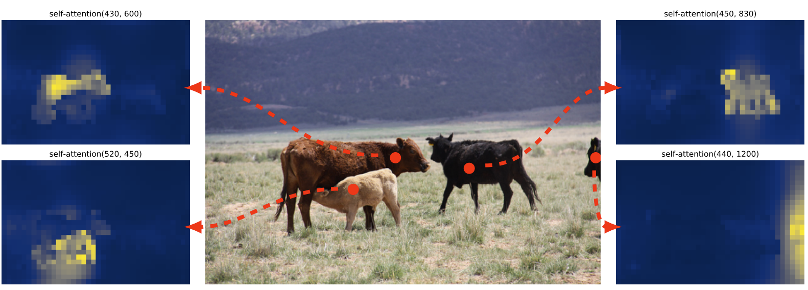

### Decoder

* N개의 object queries\(positional encoding과 동일한 의미이며, 처음에는 0으로 설정\) 초기 입력으로 받아 output embedding 생성
  * Decoder 또한 permutation-invariant이므로, object query 또 고유한 값이 들어가야 하고 이는 이미지 내 서로 다른 고유한 인스턴스를 생성하게 됨
* 순차적으로 계산하는 것이 아니라 병렬적으로 N개의 결괏값을 병렬적으로 계산 후 이분 매칭 수행
  * object의 순서는 상관이 없으며 matching loss function이 ground truth와 예측값의 1:1 매칭을 수행하므로 Original Transformer와 달리 병렬적으로 계산
* Attention map을 시각화해보면 각 인스턴스의 edge 부분의 attention score값이 높게 형성됨. --&gt; 겹치는 object들에 대해서 기존 방법들에 비해 상대적으로 강건

## 3. Experiments

### Training Condition

* Optimizer: AdamW
* Initial transformer's learning rate: 10^-4, backbone learning rate: 10^-5, weight decay: 10^-4
* Backbone: ImageNet pre-trained ResNet50, ResNet-101 from torchvision w/ batchnorm layers
  * Conv5 layer의 stride를 삭제하고 resolution 증가 \(DC5\)
  * Scale augmentation으로 이미지 사이즈를 shortest side 기준으로 480~800px까지, longest side 기준으로 1333까지 리사이징
  * Random Crop augmentation 적용: AP 약 1 상승
  * Dropout 0.1 for Transformers
* 16의 V100 GPU로 COCO dataset 300 epoch 학습 \(약 3일 소요\). minibatch 사이즈는 GPU 당 4장 \(minibatch = 64\)
  * 이미지 당 평균 7개의 인스턴스이며, 최대 63개의 인스턴스. 저자는 인스턴스 개수 N = 100으로 설정 
* 비교 대상은 500 epoch로 학습한\(400 epoch 후에 learning rate drop\) Faster RCNN
  * +표시가 붙은 네트워크는 3배의 시간을 더 학습

### AP\(Average Precision\)

* Faster RCNN보다 전반적으로 AP가 높음. 단, small object 검출 성능은 떨어짐 \(low APs\)
  * Hungarian Loss self-attention 구조가 large object 검출에는 유리하지만, small object 검출에는 적합하지 않음.

> 2020년 10월 소개된 Deformable DETR\([https://arxiv.org/abs/2010.04159](https://arxiv.org/abs/2010.04159)\)에서 Small object 검출 성능을 Faster R-CNN 수준으로 끌어올림.

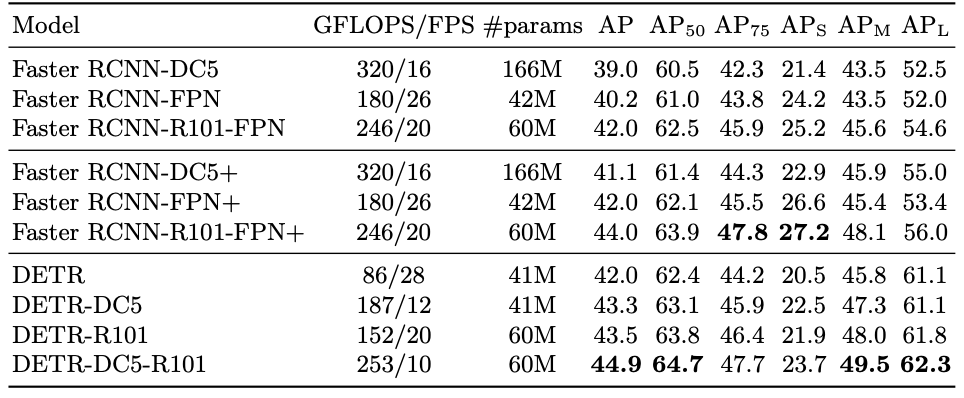

### Decoder

* Decoder layer 개수 및 NMS 유무에 따른 성능 확인 결과, Decoder layer가 1개일 때는 NMS 미적용 시 성능 저하폭이 심함. \(이는 동일 object에 multiple prediction을 수행하려 하기 때문\)

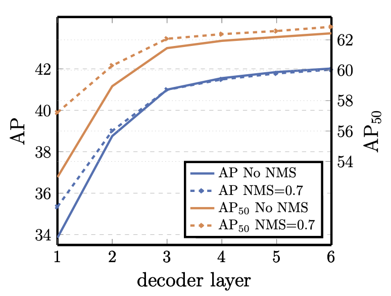

* Decoder Attention 확인 결과, locally한 부분과 object의 가장자리 부분에 높은 가중치가 부여됨
* 인코더는 global attention을 통해 인스턴스를 분리하고, 디코더는 local attention으로 object 가장자리를 잘 검출하기 때문에 겹치는 object들에 대해서도 잘 검출 

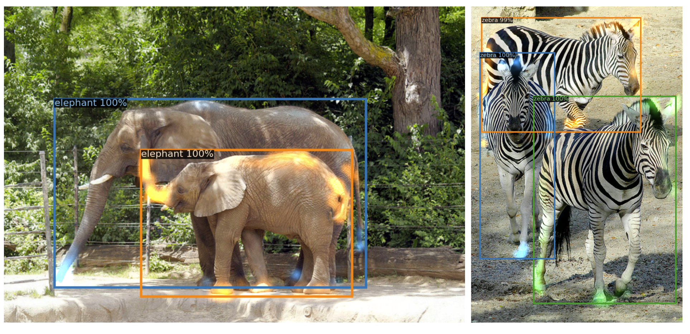

* 특정 임계점까지 인스턴스 개수가 많아도 잘 검출
  * 13개의 기린이 있는 이미지를 인위적으로 24개로 늘렸을 때에도 검출이 잘 됨
  * 이미지 내 50개의 인스턴스까지는 미검출 인스턴스 비율이 적지만 이미지 내 100개의 인스턴스가 있을 때는 미검출 인스턴스 개수가 약 70







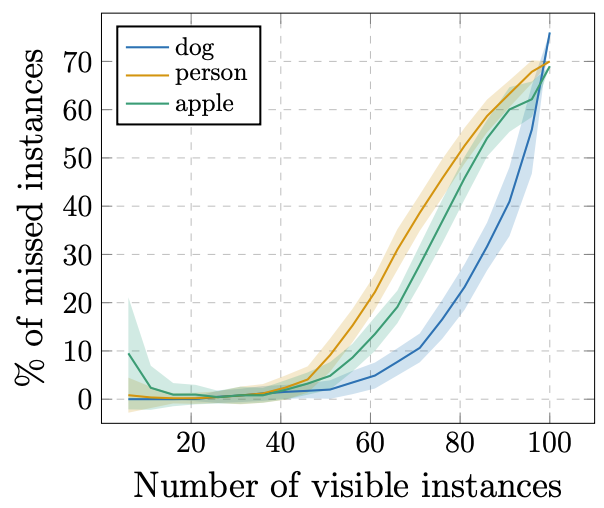



### DETR for Panoptic Segmentation

* Panoptic Segmentation = Semantic Segmentation + Instance Segmentation
* DETR의 output으로 출력된 인스턴스를 multi-head attention layer로 임베딩하여 attention map 산출. 이 때, DETR의 CNN backbone의 중간 feature들 FPN에서 사용하기 위해 별도로 저장
* Attention map과 CNN feature들 FPN\(Feature Pyramid Network\)-style CNN으로 들어가고, pixel-wise argmax로 segmentation map 산출
* Weight을 고정시키고, mask head를 25 epoch 학습
  * DICE/F-1 loss와 focal loss 사용
* 2020년 5월 기준 SOTA인 UPSNet과 Panoptic FPN과 비교

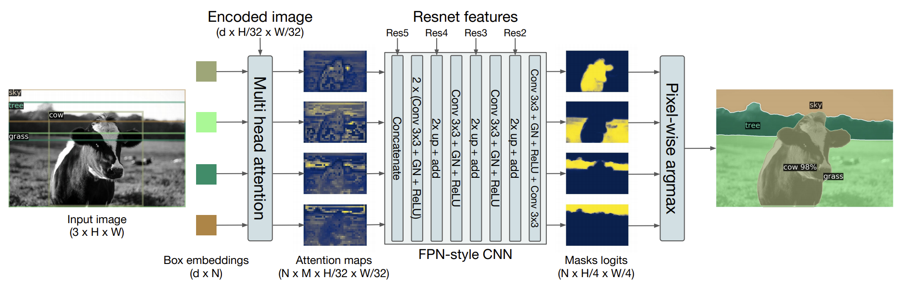

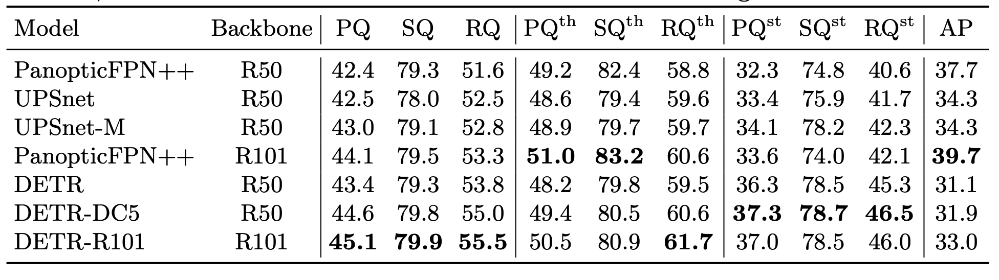

## References

* Paper
  * [https://arxiv.org/pdf/2005.12872.pdf](https://arxiv.org/pdf/2005.12872.pdf)
* Movie Clip
  * PR-284: [https://www.youtube.com/watch?v=lXpBcW\_I54U](https://www.youtube.com/watch?v=lXpBcW_I54U) 
  * ECCV 2020 presentation: [https://www.youtube.com/watch?v=utxbUlo9CyY](https://www.youtube.com/watch?v=utxbUlo9CyY)
* Implementation
  * Official GitHub: [https://github.com/facebookresearch/detr](https://github.com/facebookresearch/detr)
  * [https://www.kaggle.com/tanulsingh077/end-to-end-object-detection-with-transformers-detr](https://www.kaggle.com/tanulsingh077/end-to-end-object-detection-with-transformers-detr)

