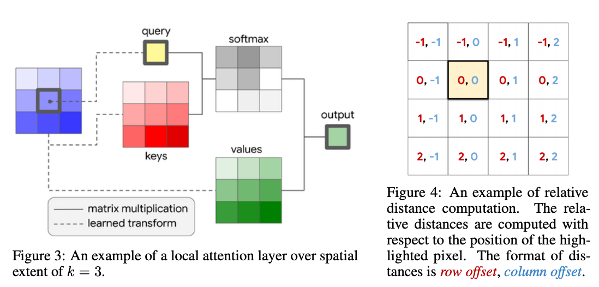
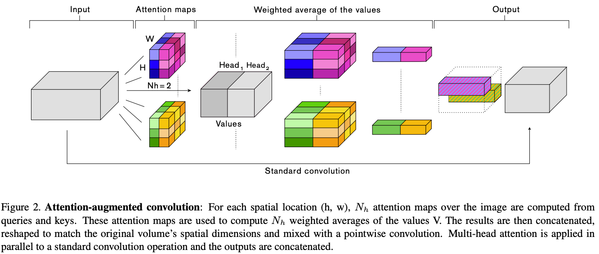
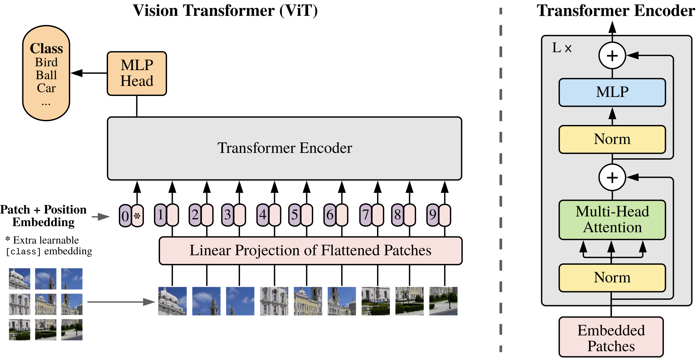
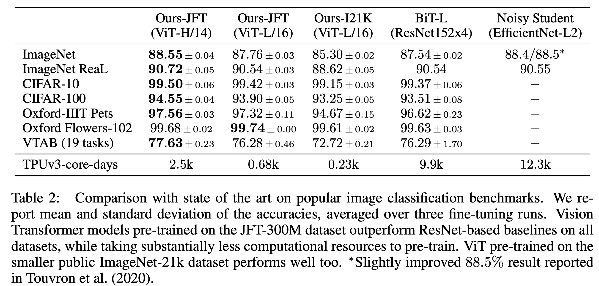
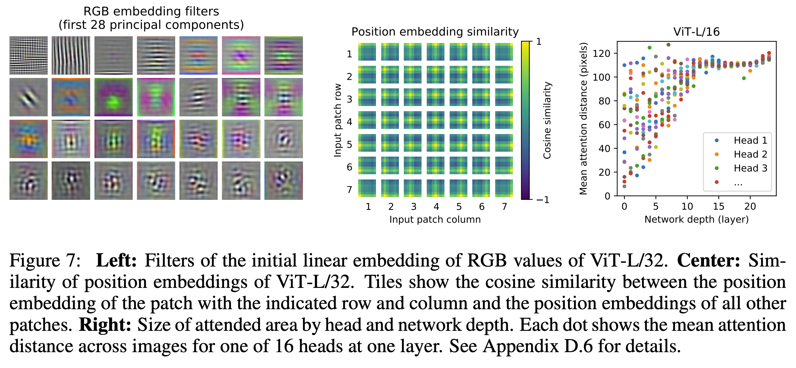

# ViT for Image Classification

## 1. Background

### CNN 기반 모델의 한계

* Inductive bias
  * From wikipedia: The **inductive bias** \(also known as **learning bias**\) of a learning algorithm is the set of assumptions that the learner uses to predict outputs of given inputs that it has not encountered.
* Conv 필터의 weight 사이즈는 고정된 사이즈로 필터 영역 밖에 있는 픽셀을 참조할 수 없음.
* weight는 학습 이후 고정되기 때문에,  테스트 데이터의 분포가 학습 데이터와 다르다면 성능이 저하될 가능성이 높음. \(weight를 adaptive하게 수정할 수 없기 때문에\)
* Transformer 기반의 네트워크는 상기 이슈들에 대해 강건하기 때문에 Transformer를 비전에 접목하려는 연구가 활발히 이루어짐.

### Local Self-attention

#### Image Transformer \([https://arxiv.org/pdf/1802.05751.pdf](https://arxiv.org/pdf/1802.05751.pdf)\)

* 모든 픽셀을 사용하는 대신, 현재 픽셀의 인접 영역만 사용
* Positional Encoding
  * 1D attention: raster-scan order \(상단 왼쪽부터 하단 오른쪽까지 순차적으로 스캐닝\) 
  * 2D attention: 사각형 블록 내에서 raster-scan order 수행


* 실험 결과, baseline보다 조금 더 낮은 Negative log-likelihood를 보임.
  *  3.83 vs 3.77

#### Stand-Alone Self-Attention in Vision Models \([https://arxiv.org/pdf/1906.05909.pdf](https://arxiv.org/pdf/1906.05909.pdf)\)

* 기본적으로는 ResNet 구조를 사용하지만, Conv Layer들을 모두 Local Self-Attention Layer로 대체
  * Vanilla Transformer에서 Scaling과 Mask Layer가 제외됨.
* Positional Encoding을 위해 현재 픽셀 기준으로 상대 위치\(relative distance\) 정보 추가 \(Figure 4.\)
  * Recall: Vanilla Transformer는 sin 곡선
  * $$a-i$$는 row offset, $$b-j$$는 column offset
  * $$q_{ij} = W_qx_{ij}$$는 쿼리, $$k_{ab}=W_kx_{ab}$$는 키, $$v_{ab}=W_vx_{ab}$$는 $$(i,j)$$와 인접 영역의 피쳐로부터 선형 변환으로 계산된 값

$$
y_{ij} = \sum_{a,b \in \mathcal{N}_ k(i,j)} \text{softmax}_{ab}(q^T_{ij}k_{ab} + q^T_{ij}r_{a-i,b-j})v_{ab}
$$

* 실험 결과, 12% 적은 FLOPS와 29% 적은 파라메터로 ResNet보다 살짝 좋은 성능을 보임.
  * Top 1 Accuracy: 76.9%\(baseline\), 77.4%\(conv-stem + attention\), 77.6%\(Full attention\)



### Global Self-attention & Combining CNN w/ self-attention

#### Attention Augmented Convolutional Networks \(AACN, [https://arxiv.org/pdf/1904.09925.pdf](https://arxiv.org/pdf/1904.09925.pdf,%20)\)

* SENet과 유
* Recall: SENet\(Squeeze-and-Excitation\) 
  * Channel과 spatial 정보를 분리하여 연산
  * Squeeze에서는 Conv layer의 각 채널에 대한 피쳐들을 global average pooling으로 집계하여 global 정보 수집
  * Excitation: 각 채널의 가중치 산출로 Attention
  * 2017 ImageNet Contest에서 우승
* Conv layer multi-head self-attention layer를 같이 사용
  * CNN의 translation equivariance를 유지하면서 전역적인 정보를 같이 고려하기 위한 목적



* 유의미한 성능 향상은 없으며, SENet 대비 Top-1 accuracy 약 0.2% 향상

## 2.Vision Transformers \(ViT\) Model Architecture

### Overview

* Convolution 미사용 \(단, 실제 구현에서는 계산 효율성을 위해 Conv 사용\)
* Transformer Encoder \(BERT\) 구조와 대부분 유사하며, sequence 토큰을 입력 데이터의 patch로 대
* Big Transfer\(BiT\)에 비해 계산 비용은 1/15이면서, SOTA 달성



$$
\mathbf{z}_0 = [\mathbf{x}_{class}; \mathbf{x}^1_p \mathbf{E}; \mathbf{x}^2_p \mathbf{E}; ...; \mathbf{x}^N_p \mathbf{E}] + \mathbf{E}_{pos}
$$

* 입력 이미지 $$\mathbf{x} \in \mathbb{R}^{H \times W \times C}$$는  $$\mathbf{x}_p \in \mathbb{R}^{N \times (P^2 \cdot C)}$$의 패치\(patch\)로 분할됨. $$N$$은 이미지 패치의 개수로 입력 sequence 길이로 간주됨.
* $$\mathbf{x}_p $$는 embedding 파라메터$$\mathbf{E} \in \mathbb{R}^{(P^2 \cdot C) \times D}$$을 통해 $$D$$ dimension으로 선형 변환됨. 이 때 이미지의 클래스 정보를 첫번째 위치에 concatenate하므로 실제 dimension은 $$\mathbf{z}_0 \in \mathbb{R}^{(N + 1) \times D}$$
* $$\mathbf{z}_0$$는 Transformer 인코더에 피드되어 계산 수행

$$
\begin{equation}
\begin{split}
& \mathbf{z}'_l = MSA(LN(\mathbf{z}_{l-1})) + \mathbf{z}_{l-1}  \\
& \mathbf{z}_l = MLP(LN(z'_{l})) + \mathbf{z}'_l \\
& \mathbf{y}=LN(\mathbf{z}_L^0)
\end{split}
\end{equation}
$$

* Transformer 인코더
  * LayerNorm\(LN\) - Multi-head Self-Attention\(MSA\)을 인코더의 각 블록에 적용하고 residual connection을 합산
  * LN - MLP와 residual connection 적용. MLP는 FCN-GELU-FCN으로 구성되어 있.

### Pre-training

* 입력 이미지를 16x16 패치로 분할 후 flatten하여 각 패치를 단어처럼 다룸.
* Flatten된 패치에서 linear embedding 수행
* Positional Embedding 가산
* Sequence를 Transformer 인코더에 피드
* 논문에서는 303M개 이미지와 18K 클래스가 포함된 Google의 비공개 데이터 JFT-300M을 사용하며, ImageNet으로 pre-training을 했을 때는 그리 좋은 성능을 보이지 못함. Transformer는 Inductive bias가 없기에 대량의 데이터가 필요
  * ImageNet - 1k 클래스 & 1.3M 이미지
  * ImageNet-21k - 21K 클래스 & 14M 이미지
  * JFT-300M - 18k 클래스 & 303M 이미지
* Adam optimizer\($$\beta_1=0.9, \beta_2 = 0.999$$\), weight decay = 0.1, batch\_size = 4096

### Fine-tuning

* Pre-training 에 사용된 입력 이미지보다 높은 해상도로 파인튜닝 수행 \(예: 224x224 &gt; 384x384\)
  * ImageNet / ImageNet-ReaL / CIFAR-10&100 / Oxford-IIIT Pets / Oxford Flowers-102 / VTAB
* Positional Embedding 시에는 2D interpolation 수행
* SGD w/ momentum, batch\_size = 512, linear rate warmup

## 3. Experiments

### Accuracy

* pre-training 시에 대용량 데이터셋이 필요해서 학습 시간이 느리다는 단점이 있지만, Transformer 구조만으로 SOTA 달성





### Inspecting ViT

* 왼쪽 그림: Linear embedding filter의 주성분 
* 중간 그림: 이미지 내의 거리 정보를 인코딩하고 있는 것을 확인 가능 
* 오른쪽 그림: 하위 layer에서도 멀리 떨어진 픽셀을 참조하는 것을 볼 수 있으며, 이는 CNN과 달리 전역적인 정보를 참조함을 볼 수 있음.



## 4. Code

* Google Research의 공식 구현\(TensorFlow\): [https://github.com/google-research/vision\_transformer](https://github.com/google-research/vision_transformer)
* 스터디 목적으로 적합한 구현\(PyTorch, 추천\): [https://github.com/FrancescoSaverioZuppichini/ViT](https://github.com/FrancescoSaverioZuppichini/ViT)

```python
class PatchEmbedding(nn.Module):
    def __init__(self, in_channels: int = 3, patch_size: int = 16, emb_size: int = 768, img_size: int = 224):
        self.patch_size = patch_size
        super().__init__()
        
        #self.projection = nn.Sequential(
        #    # break-down the image in s1 x s2 patches and flat them
        #    Rearrange('b c (h s1) (w s2) -> b (h w) (s1 s2 c)', s1=patch_size, s2=patch_size),
        #    nn.Linear(patch_size * patch_size * in_channels, emb_size)
        #)        
        
        self.projection = nn.Sequential(
            # using a conv layer instead of a linear one -> performance gains
            nn.Conv2d(in_channels, emb_size, kernel_size=patch_size, stride=patch_size),
            Rearrange('b e (h) (w) -> b (h w) e'),
        )
        self.cls_token = nn.Parameter(torch.randn(1,1, emb_size))
        self.positions = nn.Parameter(torch.randn((img_size // patch_size) **2 + 1, emb_size))
        
    def forward(self, x: Tensor) -> Tensor:
        b, _, _, _ = x.shape
        x = self.projection(x)
        cls_tokens = repeat(self.cls_token, '() n e -> b n e', b=b)
        # prepend the cls token to the input
        x = torch.cat([cls_tokens, x], dim=1)
        # add position embedding
        x += self.positions
        return x
    
PatchEmbedding()(x).shape
```

## References

* Paper
  * [https://arxiv.org/abs/2010.11929](https://arxiv.org/abs/2010.11929)
* Blog
  * Google AI Blog: [https://ai.googleblog.com/2020/12/transformers-for-image-recognition-at.html](https://ai.googleblog.com/2020/12/transformers-for-image-recognition-at.html)
* Movie Clip
  * [https://www.youtube.com/watch?v=WsQLdu2JMgI](https://www.youtube.com/watch?v=WsQLdu2JMgI)
* Implementation
  * [https://github.com/google-research/vision\_transformer](https://github.com/google-research/vision_transformer)
  * [https://github.com/FrancescoSaverioZuppichini/ViT](https://github.com/FrancescoSaverioZuppichini/ViT)

