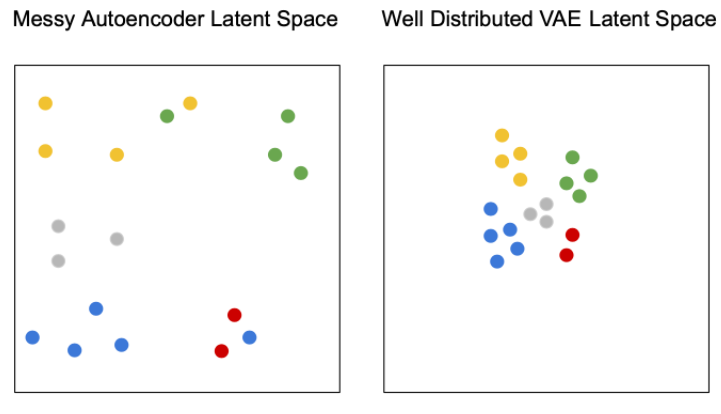
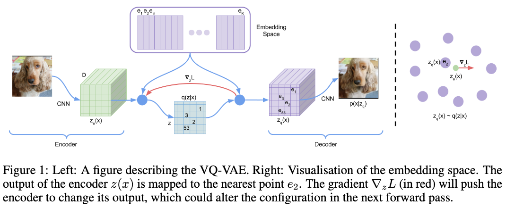
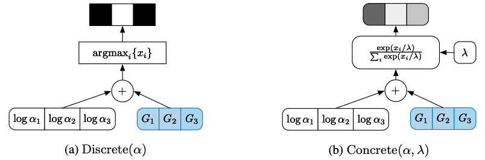
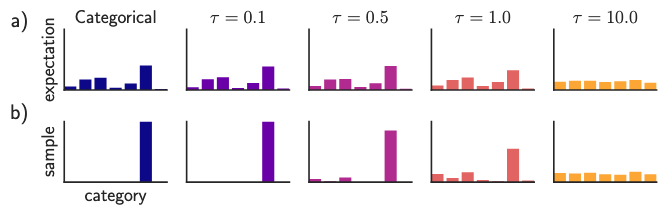
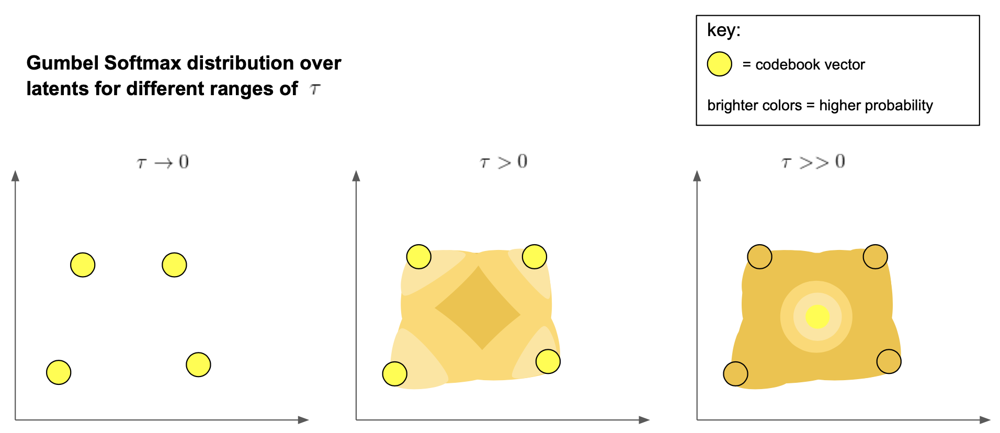
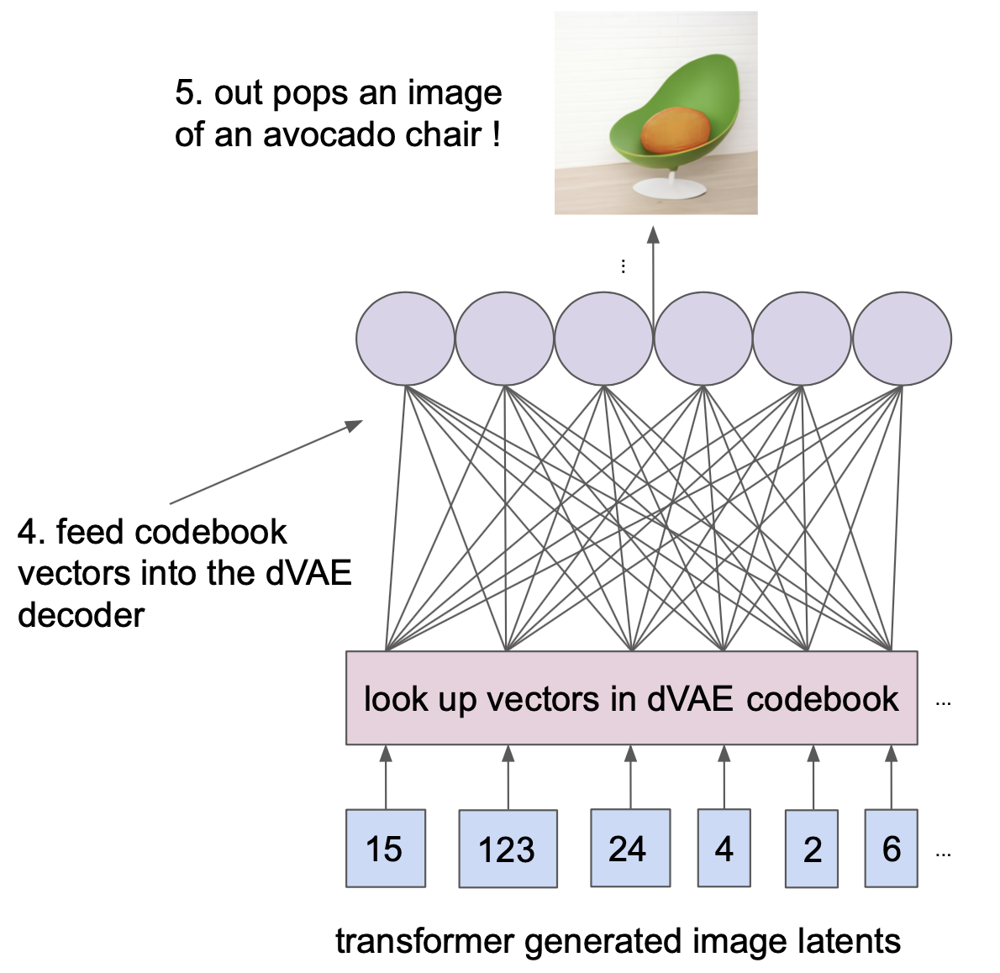
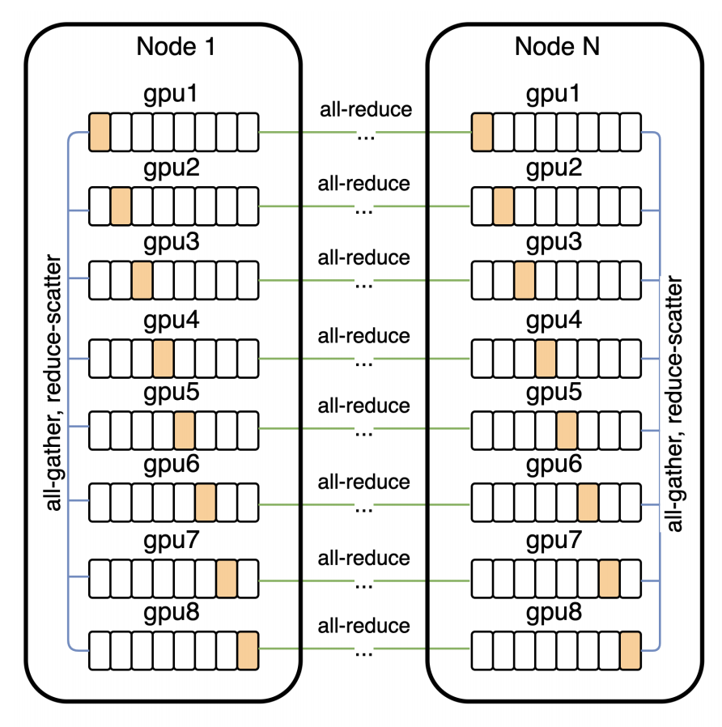
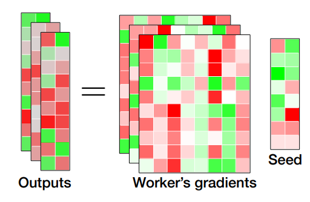

# Zero-Shot Text-to-Image Generation \(DALL-E\) - Paper Review

## 1. Preliminaries


VAE, VQ-VAE에 대한 사전 지식이 부족하거나 리마인드가 필요할 때에만 참고 


### Variational Autoencoders \(VAE\)

#### Intuition

* 직관적으로 데이터 분포는 latent space 내에서 컴팩트한 볼륨을 구성하고 무한대로 확장되지 않아야 함
* 하지만, Vanilla Autoencoder의 latent space는 컴팩트하지 않으며, VAE는 이를 latent space 상에서의 확률적 prior를 적용하여 개선



#### Derivation

먼저, latent space의 사후 확률\(posterior probability\)을 $$p(\mathbf{z}|\mathbf{x})$$로 정의하면, Bayes Theorem에 따라 사후 확률은 아래와 같이 표현할 수 있다.

$$
p(\mathbf{z}|\mathbf{x}) = \dfrac{p(\mathbf{x}|\mathbf{z})p(\mathbf{z})}{p(\mathbf{x})} \tag {1}
$$

하지만 $$p(\mathbf{x})$$는 계산하기 매우 어렵기 때문에\($$p(\mathbf{x}) = \int p(\mathbf{x}|\mathbf{z})p(\mathbf{z}) d\mathbf{z}$$ 로 무수히 많은 z에 대한 적분을 계샨해야 함\) 계산이 간단한 특정 확률분포\(예: Gaussian\) $$q(\mathbf{z})$$를 근사하는 방법\(i.e., Variational Inference\) 적용할 수 있다.

실제 사후 확률분포와 근사된 확률분포간의 KLD\(Kullback-Leibler divergence\)를 계산하면 아래와 같이 전개된다.

$$
\begin{align*} { D }_{ KL }\left( q\left( \mathbf{z }\right) ||p\left( \mathbf{z}|\mathbf{x} \right) \right) =&\int { q\left( \mathbf{z} \right) \log { \frac { q\left( \mathbf{z} \right) }{ p\left( \mathbf{z}|\mathbf{x} \right) } } d\mathbf{z} } \\ =&\int { q\left( \mathbf{z} \right) \log { \frac { q\left( \mathbf{z} \right) p\left( \mathbf{x} \right) }{ p\left( \mathbf{x}|\mathbf{z} \right) p\left( \mathbf{z} \right) } } d\mathbf{z} } \\ =&\int { q\left( \mathbf{z} \right) \log { \frac { q\left( \mathbf{z} \right) }{ p\left( \mathbf{z} \right) } } d\mathbf{z} } +\int { q\left( \mathbf{z} \right) \log { p\left( \mathbf{x} \right) } d\mathbf{z} } -\int { q\left( \mathbf{z} \right) \log { p(\mathbf{x}||\mathbf{z}) } d\mathbf{z} } \\ = &{ D }_{ KL }\left( q\left(\mathbf{z} \right) ||p\left( \mathbf{z} \right) \right) +\log { p\left( \mathbf{x} \right) } - { E }_{ \mathbf{z}\sim q\left( \mathbf{z} \right) }\left[ \log { p({ D }_{ KL }\left( q\left( \mathbf{z} \right) ||p\left( \mathbf{z} \right) \right) } \right] \end{align*} \tag {2}
$$

\(2\) $$\log(x)$$에 대해 정리하면 아래와 같은 식을 도출할 수 있다.

$$
\log { p(\mathbf{x}) } ={ E }_{ \mathbf{z}\sim q\left( \mathbf{z} \right) }\left[ \log { p(\mathbf{x}|\mathbf{z}) } \right] -{ D }_{ KL }\left( q\left( \mathbf{z} \right) ||p\left( \mathbf{z} \right) \right) +{ D }_{ KL }\left( q\left( \mathbf{z} \right) ||p\left( \mathbf{z}|\mathbf{x} \right) \right) \tag{3}
$$

Jensen's inequality에 의하여 $${ D }_{ KL }\left( q\left( \mathbf{z} \right) ||p\left( \mathbf{z}|\mathbf{x} \right) \right) \ge 0$$ 이므로, $$\log p(\mathbf{x})$$는 아래와 같은 lower bound를 가진다. Bayes Theorem의 정의에서 $$p(\mathbf{x})$$는 Evidence이기에 이를 **Evidence Lower Bound\(ELBO\)**라고도 한다.

$$
\log { p\left( \mathbf{x} \right) } \ge { E }_{ \mathbf{z}\sim q\left( \mathbf{z} \right) }\left[ \log { p(\mathbf{x}|\mathbf{z}) } \right] -{ D }_{ KL }\left( q\left( \mathbf{z} \right) ||p\left( \mathbf{z} \right) \right) = ELBO \tag{4}
$$

계산이 어려운$$\log p(\mathbf{x})$$대신 계산이 간단한 확률 분포 $$q(\mathbf{z})$$로 근사하여 목적 함수를 최대화할 수 있으며, $$q(\mathbf{z}$$\)를 Gaussian으로 가정 시 아래와 같이 근사 가능하다.

$$
q\left( \mathbf{z} \right) =\mathcal{N}\left( { \boldsymbol{\mu} }_{ q },{ \boldsymbol{\sigma} }_{ q }^{2} \right) \tag{5}
$$

하지만, 이 경우에는 모든 데이터에 대해 동일한 통계치를 가지므로, q의 파라메터를 x에 대한 함수로 정의하면 아래와 같다.

$$
q\left( \mathbf{z}|\mathbf{x} \right) =\mathcal{N}\left( { \boldsymbol{\mu} }_{q}\left( \mathbf{x} \right) ,\boldsymbol{\Sigma}_{q} \left( \mathbf{x} \right) \right) \tag{6}
$$

따라서, \(4\)는 아래와 같이 정리할 수 있으며,

$$
\log { p\left( \mathbf{x} \right) } \ge { E }_{ \mathbf{z}\sim q\left( \mathbf{z}|\mathbf{x} \right) }\left[ \log { p(\mathbf{x}|\mathbf{z}) }\right] -{ D }_{ KL }\left( q\left( \mathbf{z}|\mathbf{x} \right) ||p\left( \mathbf{z} \right) \right) \tag{7}
$$

ELBO를 최대화하는 대신 일반적으로 딥러닝에서 쓰이는 최소화 문제로 변경하여\(즉, 음수를 곱하면\) loss function으로 정의 후 stochastic gradient descent로 최적화할 수 있다.

$$
L(\theta, \phi) = -{ E }_{ \mathbf{z}\sim q_{\theta}\left( \mathbf{z}|\mathbf{x} \right) }\left[ \log { p_{\phi}(\mathbf{x}|\mathbf{z}) } \right] +{ D }_{ KL }\left( q_{\theta}\left( \mathbf{z}|\mathbf{x} \right) ||p\left( \mathbf{z} \right) \right) \tag{8}
$$

Loss function의 첫번째 항은 reconstruction loss로 현재 샘플 $$\mathbf{z}$$에 대한 negative log likelihood이며, 두번째 항은 KLD regularizer로 샘플링된 $$\mathbf{z}$$에 대한 제약 조건\($$q(\mathbf{z}|\mathbf{x})$$가 $$p(\mathbf{z})$$와 유사해야 함\)을 부여함으로써, latent space 내에서 컴팩트한 볼륨을 구성할 수 있게 한다.

* $$q(\mathbf{z}|\mathbf{x})$$는 probabilistic encoder라고도 하며, $$p(\mathbf{x}|\mathbf{z})$$는 probabilistic decoder\(Likelihood of generating true data sample given the latent code\)라고도 한다.
* KLD regularizer를 Entropy 항으로 분해해서 살펴보면, Posterior에서 샘플링된 $$\mathbf{z}$$는 최대햔 다양해야 한다는 제약 조건이 같이 포함되기에, GAN의 고질적인 문제 mode collapse 방지 효과가 있다.
* 하지만, KLD regularizer로 인한 posterior collapse 문제가 발생한다.

하지만, $$\mathbf{z}$$는 샘플링된 fixed 데이터로 $$\theta$$에 대한 $$\mathbf{z}$$의 미분을 직접적으로 계산할 수 없기에, 노이즈\($$\boldsymbol{\epsilon}$$\)를 샘플링하는 문제로 변경하여 평균과 분산에 대한 미분을 계산하는 reparameterization trick을 적용한다. \($$\odot$$는 element-wise product\)

$$
\mathbf{z} = \boldsymbol{\mu} + \boldsymbol{\sigma} \odot \boldsymbol{\epsilon} \text{, where } \boldsymbol{\epsilon} \sim \mathcal{N}(0, \boldsymbol{I}) \tag{9}
$$


#### Posterior collapse

* VAE의 고질적인 문제인 블러한 이미지는 복잡한 데이터 분포에서 posterior 분포가 prior 분포와 일치함으로써, latent varaible을 무시하고 학습이 진행되는 posterior collapse임.
* input $$\mathbf{x}$$에서 posterior로 흐르는 신호가 너무 미약하거나 노이즈가 많을 때, 디코더는 posterior $$q(\mathbf{z}|\mathbf{x})$$에서 샘플링되는 latent variable $$\mathbf{z}$$를 무시하고 학습이 진행됨.

$$
q_{\phi}(\mathbf{z}|\mathbf{x}) = p_{\theta}(\mathbf{z}|\mathbf{x}) = p(\mathbf{z}) \tag{10}
$$

### VQ-VAE \(Vector Quantized VAE\)

#### Intuition

* VAE는 continuous latent space를 학습하는 반면, VQ\(Vector Quanzited; 벡터 양자화\)-VAE는 discrete latent space를 학습
  * 일반적으로 실제 세계에서 접하는 많은 데이터는 discrete representation임. \(이미지는 여러 개의 discrete object로 표현되며, 언어는 discrete phonemes로 표현됨\)
* VQ-VAE는 K차원의 벡터를 유한한 코드 벡터 셋으로 매핑하는 방법으로 KNN과 매우 유사함. 
* VQ-VAE는 별도의 prior 분포를 가정하지 않고 모든 latent code에 대해 uniform한 prior를 가정함으로써, posterior가 stochastic이 아닌 deterministic임.

#### Derivation

$$\mathbf{e}$$를 latent embedding space\(codebook\)으로 아래와 같이 정의한다. \($$K$$: the number of latent variable categories, $$D$$: embedding size\)

$$
\mathbf{e} \in \mathbb{R}^{K \times D}, i=1, \dots, K \tag{11}
$$

우리의 목적은 $$k$$개의 임베딩 벡터 중 Encoder output $$E(\mathbf{x})$$와 가장 유사한 벡터\(codebook vector\)를 찾고 이를 디코더 $$D(\cdot)$$의 입력값으로 넣어 $$\mathbf{x}$$를 복원하는 것으로 아래와 같이 정의할 수 있다.

$$
\mathbf{z}_q(\mathbf{x}) = \text{Codebook}(E(\mathbf{x})) = \mathbf{e}_k \text{ where } k = \arg\min_i \|E(\mathbf{x}) - \mathbf{e}_i \|_2 \tag{12}
$$

* Encoder output $$E(\mathbf{x}) = \mathbf{z_e(x)}$$는 input vector $$\mathbf{x}$$에 대한 encoder vector
* $$k$$: nearest neighborhood search를 통해 K개의 임베딩 벡터 중 하나와 일치하는 코드 백터
* $$\mathbf{e}_k$$: codebook에서 input과 가장 가까운 code vector

$$\text{argmin}(\cdot)$$은 미분 불가능하므로, decoder input $$z_q$$는 encoder output $$z_e$$로 복사된다.

Latent vector들의 set인 codebook을 학습하기 위하여 VQ-VAE의 loss function은 3가지 loss function의 합으로 이루어져 있다.

$$
L = \underbrace{\|\mathbf{x} - D(\mathbf{e}_k)\|_2^2}_{\textrm{reconstruction loss}} + \underbrace{\|\text{sg}[E(\mathbf{x})] - \mathbf{e}_k\|_2^2}_{\textrm{VQ loss}} + \underbrace{\beta \|E(\mathbf{x}) - \text{sg}[ \mathbf{e}_k]\|_2^2}_{\textrm{commitment loss}} \tag{13}
$$

* $$\text{sg}(\cdot)$$: stop gradient operator로, zero gradient를 가지기에 sg\(.\)안의 파라메터는 업데이트되지 않는다. 
* $$\text{VQ loss}$$\(aka. codebook loss\): Encoder output과 embedding space간의 L2 에러로 input에 대응하는 codebook만을 업데이트하기 위한 용도이기 때문에, encoder output에 대한 stop gradient operator가 필요하다.
* $$\text{Commitment loss}$$: VQ loss와 유사하지만 encoder의 weight를 고정함으로써 codebook을 학습하는 과정에서 동일한 신호가 다른 codebook vector로 매핑되는 경우를 줄여주는 역할을 한다. 

VQ-VAE는 별도의 prior 분포를 가정하지 않고 모든 latent code에 대해 uniform한 piror를 가정함으로써, posterior가 deterministic이기에 KLD regularizer의 영향을 받지 않는다. 이를 수식으로 표현하면 다음과 같다.

$$
q(\mathbf{z} = \mathbf{e}_k|\mathbf{x}) =
    \begin{cases}
      1 & \text{for k = $\text{argmin}_i|| \mathbf{z_e(x)} - \mathbf{e}_i||_2$} \\
      0 & \text{otherwise}
    \end{cases} \tag{14}
$$

VQ-VAE의 학습 과정을 그림으 표현하면 아래와 같다.  




### dVAE\(discrete VAE\)

* DALL-E에서 제안된 방법으로 VQ-VAE와 유사하자만, dVAE는 벡터 양자화의 방법처럼 하나의 codebook 벡터만 선택하게 강제하지 않고 posterior 확률분포를 stochastic하게 표현할 수 있게 변경.
* Discrete 샘플링을 continuous approximation 문제로 이완시키기에, loss function은 VAE의 형태와 동일
* 이를 위해, Encoder output은 codebook 벡터셋에 대한 범주형\(categorical\) 분포를 출력
* 범주형 분포에서 곧바로 backpropagation이 불가능하므로, 이를 Gumbel-max trick과 Gumbel-softmax Trick을 사용한 categorical reparameterization으로 해결

#### Derivation

$$g_1,g_2,…,g_k$$이 Standard Gumbel 분포를 따르고 i.i.d.라고 할 때, \($$g_k \sim Gumbel(0,1)$$\) 클래스 확률이 $$q(\mathbf{e}_i|\mathbf{x})$$ 인 카테고리 분포에서의 샘플 $$\mathbf{z}$$를 다음과 같이 나타낼 수 있다.

$$
\mathbf{z}=\text{codebook}(\text{argmax}_i[g_i+\log q(\mathbf{e}_i)]) \tag{15}
$$

\($$\text{codebook}(i)$$는 codebook 벡터셋에서 $$i$$번째 벡터를 의미하며, one-hot과 동일한 의미이다.\)

이를 Gumbel-max trick이라고 하며, argmax를 softmax로 근사하여 미분 가능하게 변경한 방법이 Gumbel-softmax trick이다.

$$
y_i={\exp((\ln(q(\mathbf{e}_i|\mathbf{x}))+g_i)/\tau) \over {\sum_{j=1}^k \exp((\ln(q(\mathbf{e}_j|\mathbf{x}))+g_j)/\tau)}}, i=1,..,k \tag{16}
$$



보다 자세한 내용은 [https://blog.evjang.com/2016/11/tutorial-categorical-variational.html](https://blog.evjang.com/2016/11/tutorial-categorical-variational.html) 를 참고하자.

sampled latent vector는 codebook 벡터의 weighted sum이기에 최종적으로 미분 가능한 형태가 갖추어짐을 알 수 있다.

$$
\mathbf{z} = \sum_{j=1}^k y_j\mathbf{e}_j \tag{17}
$$

$$\tau$$가 0에 가까워질 수록 Gumbel-Softmax의 샘플이 one-hot argmax weights에 가까워지고 분포가 카테고리 분포 $$\mathbf{z}=\text{codebook}(\text{argmax}_i[g_i+\log q(\mathbf{e}_i)])$$와 비슷해진다. 반대로 $$\tau$$가 커질 수록 분포가 uniform 분포에 가까워진다.





## 2. DALL-E Summary

### Overview

* Zero-shot image generation by a text prompt
* Objective: 이미지 $$\mathbf{x}$$와 캡션 $$\mathbf{y}$$, 인코딩된 RGB 이미지에 대한 토큰 $$\mathbf{z}$$의 joint 확률분포에 대한 evidence lower bound\(ELB\)를 최대화 \(autoregressive하게 텍스트와 이미지 토큰을 같이 묶어서 트랜스포머로 학습\)
* Inputs: Text tokens + image tokens \(text-image로 이루어진 2억 5천만 쌍에 대해 학습\)
* Outputs: image tokens
* $$p(\mathbf{x}|\mathbf{y})$$를 직접적으로 모델링하는 대신 factorization을 통해 아래와 같이 분해 후 2-stage 학습으로 간소화

$$
p(\mathbf{x},\mathbf{z}| \mathbf{y}) = \underbrace{p(\mathbf{x}|\mathbf{z,y})}_{\textrm{dVAE}} \ \underbrace{p(\mathbf{z}|\mathbf{y})}_{\textrm{Transformer}} \tag{18}
$$

* Stage-1: $$p(\mathbf{z}|\mathbf{y})$$를 uniform distribution으로 놓고 dVAE를 먼저 학습
* Stage-2: dVAE network를 frozen하고 $$p(\mathbf{z}|\mathbf{y})$$를 학습
  * dVAE와 Transformer를 동시에 학습하는 것도 가능하지만, 실험 결과 퍼포먼스 개선은 없었음
* MS-COCO 데이터셋에서 zero-shot으로도 높은 성능을 보이며, 사람이 주관적으로 평가 시에도 90%의 평가자들이 DALL-E의 결과를 더 선호
* 약 12 billion개의 파라터로 상당히 많은 리소스가 필요함 \(GPT-3 17.5B params, iGPT 6.8B params JukeBox 5B params\)

### Stage-1: dVAE\(discrete VAE\)

* 이미지의 모든 픽셀을 예측하는 것이 아닌 image latent의 sequence를 예측하고 dVAE로 디코딩하여 픽셀 정보 복구
* 256x256 RGB 이미지를 32x32=1024개의 이미지 토큰으로 임베딩
* 각 이미지 토큰은 8192 차원의 codebook 벡터를 가짐
* 따라서, transformer가 처리해야 하는 context 크기를 192배 압축하면서, visual quality는 유지 가

### Stage 2: Transformer

* 256개의 BPE로 인코딩된 텍스트 토큰과 32x32=1024 이미지 토큰을 concat하여 transformer에 입력
  * sequence 길이는 1024+256로 꽤 크지만 transformer에서 수용 가능
* 텍스트와 이미지 토큰에 대한 joint 확률분포 학습




## 3. Training

#### Data Collection

* Conceptual captions \(3.3M text-image pairs\) 데이터셋으로 처음에는 1.2B 파라메터 모델로 학습
* 12B 파라메터 모델 학습을 위해 YFCC100M 데이터셋의 filtered subset\(MS-COCO 검증 이미지 포함\)과 위키피디아의 text-image pairs 사용 
* 필터링을 통해 학습에 도움이 되지 않는 일부 데이터를 제외 \(too short captions, non-English captions, boilerplate phrase로 주로 구성된 데이터, aspect ratio\[1/2, 2\] 범위를 벗어나는 경우\)

#### Preprocessing

* TensorFlow image preprocessing code for training dVAE \(`target_res = 256, channel_count = 3`\)

```python
def preprocess_image(img, target_res):
	h, w = tf.shape(img)[0], tf.shape(img)[1]
	s_min = tf.minimum(h, w)
	img = tf.image.random_crop(img, 2 * [s_min] + [3])

	t_min = tf.minimum(s_min, round(9 / 8 * target_res))
	t_max = tf.minimum(s_min, round(12 / 8 * target_res))
	t = tf.random.uniform([], t_min, t_max + 1, dtype=tf.int32)
	img = tf.image.resize_images(img, [t, t], 
		method=tf.image.ResizeMethod.AREA, 
		align_corners=True
	)
	
	img = tf.cast(tf.rint(tf.clip_by_value(img, 0, 255)), tf.uint8)
	img = tf.image.random_crop(img, 2 * [target_res] + [channel_count])
	return tf.image.random_flip_left_right(img)
```

* TensorFlow image preprocessing code for training the transformer \(`target_res = 256, channel_count = 3`\)

```python
def preprocess_image(img, target_res):
	h, w = tf.shape(img)[0], tf.shape(img)[1]
	s_min = tf.minimum(h, w)

	off_h = tf.random.uniform([], 3 * (h - s_min) // 8,
		tf.maximum(3 * (h - s_min) // 8 + 1, 5 * (h - s_min) // 8), 
		dtype=tf.int32)
	off_w = tf.random.uniform([], 3 * (w - s_min) // 8,
		tf.maximum(3 * (w - s_min) // 8 + 1, 5 * (w - s_min) // 8),
		dtype=tf.int32)
	
	# Random full square crop.
	img = tf.image.crop_to_bounding_box(img, off_h, off_w, s_min, s_min)
	t_max = tf.minimum(s_min, round(9 / 8 * target_res))
	t = tf.random.uniform([], target_res, t_max + 1, dtype=tf.int32)
	img = tf.image.resize_images(img, [t, t], method=tf.image.ResizeMethod.AREA,
		align_corners=True)
	img = tf.cast(tf.rint(tf.clip_by_value(img, 0, 255)), tf.uint8)

	# We don’t use hflip aug since the image may contain text.
	return tf.image.random_crop(img, 2 * [target_res] + [channel_count])
```

#### Mixed-Precision and Distributed Training

* FP32 적용시 약 50GB의 메모리가 필요하기 16GB 메모리의 V100 GPU에서는 학습 불가
  * FP16을 적용해도 약 24GB의 메모리가 필요하므로 Model Parallelism 필수 
* 일반적인 mixed-precision 적용 시에는 underflow 현상으로 학습이 잘 되지 않아 여러 가지 트릭들을 사용함
  * Per-resblock gradient scaling: Standard loss scaling 대신 Residual Block마다 gradient scaling을 사용
  * 16-bit precision은 반드시 필요한 경우에만 사용하며 gain, bias, embedding, unembedding, gradient, Adam momemt는 32-bit precision을 사용하고 gradient 압축을 수행하지 않음.
  * Data-parallel 학습 시 worker 개수가 많아질수록 underflow 빈도가 높아지기에, loss를 전체 배치 크기로 나눈 다음 gradient scale을 곱함.
* Pipeline Model Parallelism도 같이 구현 \(Parameter Sharding\)
* 노드 간의 통신 시 모델 전체를 all-reduce하면 노드 간 너무나 많은 communication cost가 발생하기에 PowerSGD로 low-rank factorization을 통해 gradient를 압축해서 all-reduce communication cost를 줄임.













#### PowerSGD

* Gain, bias, embedding, unembedding을 제외한 모든 파라메터에 대한 gradient는 PowerSGD로 gradient 압축 수행
* 85% compression rate 달성
* Backpropagation 과정에서 gradient를 error buffer로 축적함으로써 개별적인 buffer를 할당하는 방법 대비 메모리를 절약
* error buffer를 0으로 만드는 인스턴스 최소화 \(mixed-precision backprop에서 생기는 nonfinite 값 혹은 체크포인트에서 모델을 재시작할 때 등\)
* Gram-Schmidt 대신 Householder orthogonalization을 사용함으로써 수치적인 안정성 개선
* 16FP 적용 시 발생하는 underflow 방지
* 보다 자세한 내용은 [https://arxiv.org/abs/1905.13727](https://arxiv.org/abs/1905.13727) 참조.

#### dVAE Training

* 64장의 16GB V100 GPU 사용 \(Batch size = 512, GPU당 batch size = 8, Total updates = 3백만\)
* Cosine scheduling 사
  * 첫 5000 updates까지 KL weight $$\beta$$를 0부터 6.6까지 증가
  * relexation temperature $$\tau$$는 첫 150,000 updates까지 1에서 1/16으로 annealing
  * step sizes는 120만 updates까지 $$1 \cdot 10^{-4}$$에서 $$1.25 \cdot 10^{-6}$$으로 annealing
* AdamW w/ $$\beta_1 = 0.9, \beta_2 = 0.999, \epsilon = 10^{-8}$$, weight decay multiplier = $$10^{-4}$$

#### Transformer Training

* 1024장의 NVIDIA V100 GPU 사용 \(Batch size = 1024, GPU당 batch size = 1, Total updates = 43만\)
* 10% BPE dropout 적용
* 첫 5000 step까지 linear scheduling으로 step size를 $$4.5 \cdot 10^{-4}$$로 증가시키고 training loss가 감소하지 않을 때마다 step size를 절반으로 감소 \(총 5번 수행하기에 최종적으로는 peak보다 32배 작은 step size를 가짐\)
* AdamW w/ $$\beta_1 = 0.9, \beta_2 = 0.96, \epsilon = 10^{-8}$$, weight decay multiplier = $$4.5 \cdot 10^{-2} $$
* 606,000장의 검증셋 이미지로 검증

## References

* Paper
  * Zero-Shot Text-to-Image Generation: [https://](https://arxiv.org/abs/2010.11929)[arxiv.org/pdf/2102.12092.pdf](https://arxiv.org/pdf/2102.12092.pdf)
  * The Concrete Distribution: A Continuous Relaxation of Discrete Random Variables: [https://arxiv.org/pdf/1611.00712.pdf](https://arxiv.org/pdf/1611.00712.pdf)
  * Neural Discrete Representation Learning: [https://arxiv.org/abs/1711.00937](https://arxiv.org/abs/1711.00937)
  * PowerSGD: [https://arxiv.org/abs/1905.13727](https://arxiv.org/abs/1905.13727)
* Dataset
  * [http://www.vision.caltech.edu/visipedia/CUB-200-2011.html](http://www.vision.caltech.edu/visipedia/CUB-200-2011.html)
* GitHub
  *  [github.com/lucidrains/DALLE-pytorch](https://github.com/lucidrains/DALLE-pytorch)
* Blog
  * Understanding VQ-VAE: [https://ml.berkeley.edu/blog/posts/vq-vae/](https://ml.berkeley.edu/blog/posts/vq-vae/)
  * Tutorial: Categorical Variational Autoencoders using Gumbel-Softmax: [https://blog.evjang.com/2016/11/tutorial-categorical-variational.html](https://blog.evjang.com/2016/11/tutorial-categorical-variational.html)
* Movie Clip
  * PR-301: [https://www.youtube.com/watch?v=az-OV47oKvA](https://www.youtube.com/watch?v=az-OV47oKvA)

