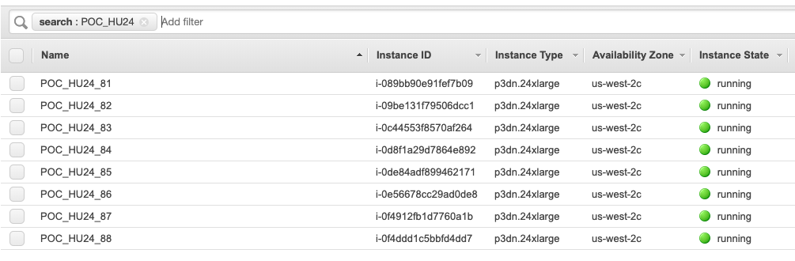
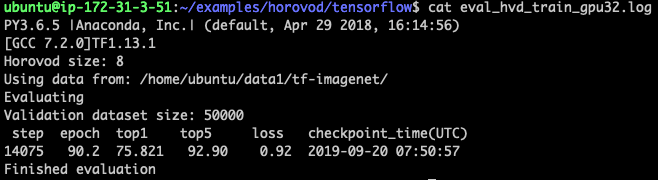

# \[Hands-on\] Fast Training ImageNet on on-demand EC2 GPU instances with Horovod

## Goal

This document is for people who need distributed GPU training using Horovod for experimental purposes. Many steps are similar to what mentioned in Julien Simon’s article\([https://medium.com/@julsimon/imagenet-part-1-going-on-an-adventure-c0a62976dc72](https://medium.com/@julsimon/imagenet-part-1-going-on-an-adventure-c0a62976dc72)\) and AWS Documentation\([https://docs.aws.amazon.com/dlami/latest/devguide/tutorial-horovod-tensorflow.html](https://docs.aws.amazon.com/dlami/latest/devguide/tutorial-horovod-tensorflow.html)\). So I recommend you to view these articles first. If there are some things that aren’t going well \(e.g., Downloading the dataset does not work, How to convert the raw data to the TFRecord feature set?, How to fix the error `ModuleNotFoundError: No module named 'cv2'?`\) please refer this document.

### Introduction

For data preparation and data transformation, we do not need to use a GPU instance such as p2 and p3. Instead, we can start much cheaper instances like `t2.large` instance with 1.0TB EBS volume.

For distributed training, we need to use multiple GPU instances like p2, p3, g3 and g4.

You can skip step 1 if you do not want to invent the wheel again because I have stored everything in my s3 bucket.

* `s3://dataset-image/imagenet/raw` \(raw jpeg\)
* `s3://dataset-image/imagenet/tfrecord` \(TFRecord before resizing\)
* `s3://dataset-image/imagenet/tfrecord-resized` \(TFRecord after resizing to 224x224\)
* `s3://dataset-image/imagenet/recordio` \(RecordIO after resizing to 256x256\)
  * The reason I did not resize 224x224 is that the below article shows different validation accuracy for resizing strategy.
  * [https://forums.fast.ai/t/impact-of-image-resizing-on-model-training-time-and-performance/1980](https://forums.fast.ai/t/impact-of-image-resizing-on-model-training-time-and-performance/1980)

Please let me know if you want to access the bucket because I did not grant any public access.

## Step 1. Downloading and Transformation

### **Setting up an EC2 instance for Data Transformation**

* Create an EC2 instance for storing ImageNet dataset \(Ubuntu 18.04 or 16.04. Linux is also available\). `t2.micro` is also available, but `t2.large` is recommended due to memory size. Note that we do not need large storage size since we will make another EBS volume to attach the EC2 instance.
* Create an EBS volume \(1.0TB\) for ImageNet dataset and then attach the volume it to your EC2 instance. ImageNet consists of 138GB for training set and 6.3GB for validation set, but we need an additional space since we need to extract tar files as well as need to transform it to the feature sets like TFRecord and RecordIO. Here is an example command using AWS CLI.

  ```bash
    $ aws ec2 create-volume \
    --size 1000 \
    --region [YOUR_AWS_REGION] \
    --availability-zone [YOUR_AZ> \
    --volume-type sc1 \
    --tag-specifications 'ResourceType=volume,Tags=[{Key=Name,Value=ImageNet}]'

    $ aws ec2 attach-volume \
    --volume-id vol-[YOUR_EC2_volume_id] \
    --instance-id i-[YOUR_EC2_instance_id] \
    --device /dev/sdf
  ```

* Format the EBS volume, mount it on `/data`, and then change the owner to `ec2-user:ec2-user`. You may refer to [https://docs.aws.amazon.com/AWSEC2/latest/UserGuide/ebs-using-volumes.html](https://docs.aws.amazon.com/AWSEC2/latest/UserGuide/ebs-using-volumes.html) if you do not know how to mount it.
* Download MXNet repository and TensorFlow models repository.

  ```bash
    $ cd /data
    $ git clone https://github.com/tensorflow/models.git
    $ git clone https://github.com/apache/incubator-mxnet.git 
    # or, you can just type `pip install mxnet`
  ```

  * \[Optional\] For your convenience, use symbolic link such that:


* \[Important Step\] You need to install OpenCV also. \(Both 3.x and 4.x work well\). If you do not install OpenCV, then you cannot convert ImageNet raw data to RecordIO files since `im2rec.py` utilizes some OpenCV functions. You may refer to [https://www.pyimagesearch.com/2018/08/15/how-to-install-opencv-4-on-ubuntu/](https://www.pyimagesearch.com/2018/08/15/how-to-install-opencv-4-on-ubuntu/).
* \[Caution\] I strongly recommend to use Python2 instead of Python3 because many codes of Tensorflow models repository does not work on Python3. Please refer to [https://stackoverflow.com/questions/38546672/inception-build-imagenet-data-py-typeerror-rgb-has-type-class-str-but-ex](https://stackoverflow.com/questions/38546672/inception-build-imagenet-data-py-typeerror-rgb-has-type-class-str-but-ex).

### Downloading ImageNet

Please note that ImageNet server is sometimes unstable so download speed is not fast, taking 4 to 5 days.

#### Method 1

* Go to [http://www.image-net.org/](http://www.image-net.org/), sign up, and get your own username and access key.
* You can use the TensorFlow's download script\([https://github.com/tensorflow/models/blob/master/research/inception/inception/data/download\_imagenet.sh](https://github.com/tensorflow/models/blob/master/research/inception/inception/data/download_imagenet.sh)\) by exporting your username and access key.

  ```bash
    $ export IMAGENET_USERNAME=[YOUR_USERNAME]
    $ export IMAGENET_ACCESS_KEY=[YOUR_ACCESS_KEY]
    $ cd imagenet/data
    $ mv imagenet_2012_validation_synset_labels.txt synsets.txt
    $ nohup bash download_imagenet.sh . synsets.txt >& download.log &
  ```

#### Method 2 \(Alternative method if Method 1 does not work\)

* Download ImageNet dataset manually.

  ```bash
    $ nohup wget http://www.image-net.org/challenges/LSVRC/2012/nnoupb/ILSVRC2012_img_train.tar &
    $ nohup wget http://www.image-net.org/challenges/LSVRC/2012/nnoupb/ILSVRC2012_bbox_train_v2.tar.gz &
    $ nohup wget http://www.image-net.org/challenges/LSVRC/2012/nnoupb/ILSVRC2012_img_val.tar &
    $ nohup wget http://www.image-net.org/challenges/LSVRC/2012/nnoupb/ILSVRC2012_bbox_val_v3.tgz &
  ```

* Extract the validation set

  ```bash
    $ mkdir validation
    $ mv ILSVRC2012_img_val.tar validation
    $ cd validation
    $ tar xf ILSVRC2012_img_val.tar
  ```

  * After extracting the validation set, move jpeg files\(ILSVRC2012\_val\_00000001.JPEG, ..., ILSVRC2012\_val\_00050000.JPEG\) in 1,000 directories using the following script; [https://github.com/juliensimon/aws/blob/master/mxnet/imagenet/build\_validation\_tree.sh](https://github.com/juliensimon/aws/blob/master/mxnet/imagenet/build_validation_tree.sh) \(Each directory means the unique category like \).

    n01728572

* Extract the training set

  ```bash
    $ mkdir train
    $ mv ILSVRC2012_img_train.tar train
    $ cd train
    $ tar xf ILSVRC2012_img_train.tar
    $ find . -name "*.tar" | while read NAME ; do mkdir -p "${NAME%.tar}"; tar -xvf "${NAME}" -C "${NAME%.tar}"; rm -f "${NAME}"; done
  ```

  * After extracting the training set, check if the number of directories is 1,000 \(class 1 is n01728572 and class 1000 is n15075141\).

* Extract bounding boxes

  ```bash
    $ mkdir bounding_boxes
    $ mv ILSVRC2012_bbox_train_v2.tar.gz bounding_boxes
    $ mv ILSVRC2012_bbox_val_v3.tgz bounding_boxes
    $ cd bounding_boxes
    $ tar xzf ILSVRC2012_bbox_val_v3.tgz
    $ mkdir train
    $ mv ILSVRC2012_bbox_train_v2.tar.gz train
    $ cd train
    $ tar xzf ILSVRC2012_bbox_train_v2.tar.gz
  ```


### Data Transformation

#### RecordIO format

* Use `im2rec.py` the same way Simon did. \([https://medium.com/@julsimon/imagenet-part-1-going-on-an-adventure-c0a62976dc72](https://medium.com/@julsimon/imagenet-part-1-going-on-an-adventure-c0a62976dc72)\). It takes 1.5 days on the `t2.large` instance. I think he did some typos \(ImageNet baseline usually uses 224x224 size image, but he uses 480x480\).

#### TFRecord format

* Please refer to [https://github.com/aws-samples/deep-learning-models/blob/master/utils/tensorflow/preprocess\_imagenet.py](https://github.com/aws-samples/deep-learning-models/blob/master/utils/tensorflow/preprocess_imagenet.py) \(code\) and [https://docs.aws.amazon.com/ko\_kr/dlami/latest/devguide/tutorial-horovod-tensorflow.html](https://docs.aws.amazon.com/ko_kr/dlami/latest/devguide/tutorial-horovod-tensorflow.html) \(document\).
  * `python preprocess_imagenet.py \ --local_scratch_dir=[YOUR DIRECTORY] \ --imagenet_username=[imagenet account] \ --imagenet_access_key=[imagenet access key]`
  * `python tensorflow_image_resizer.py \ -d imagenet \ -i [PATH TO TFRECORD TRAINING DATASET] \ -o [PATH TO RESIZED TFRECORD TRAINING DATASET] \ --subset_name train \ --num_preprocess_threads 60 \ --num_intra_threads 2 \ --num_inter_threads 2`
* \[Additional Notes\] The original document uses the small number of intra-op\(multiple threads within one op; for example, while doing matrix multiplication operation we can divide the op by multiple threads\) and inter-op\(thread-pool size per one executor\) such that `--num_intra_threads 2 \ --num_inter_threads 2`. But, you can give higher number of intra-op and inter-op.

### Backing up and Copying to S3

* After data transformation, create a new bucket and sync or copy feature sets to the bucket.
* Create a snapshot of the EBS volume.

## Step 2. Training ResNet-50 Model with Horovod

\[Before get started\] If you just want to train on a single machine, you may refer to [https://medium.com/@julsimon/imagenet-part-2-the-road-goes-ever-on-and-on-578f09a749f9](https://medium.com/@julsimon/imagenet-part-2-the-road-goes-ever-on-and-on-578f09a749f9) \(RecordIO\) and [https://github.com/tensorflow/models/tree/master/official/r1/resnet](https://github.com/tensorflow/models/tree/master/official/r1/resnet) \(TFRecord\)

* Create an EC2 instance for Training \(Deep Learning AMI \(Ubuntu 16.04\) or Deep Learning AMI \(Amazon Linux\)\). `p3.16xlarge` or `p3dn.24xlarge` is recommended if you need to do distributed GPU training using Uber’s Horovod or Tensorflow's DistributedStrategy\). Please also note that the default root volume size is 75GB, but I recommend you to increase 100GB since training logs and model checkpoints are stored in the root volume if you do not modify training configuration. If you not want to increase the volume size, then you can delete some conda environments such as Theano, Chainer, Caffe, and Caffe2 after logging in to the EC2 instance.
  * [https://aws.amazon.com/ko/getting-started/tutorials/get-started-dlami/](https://aws.amazon.com/ko/getting-started/tutorials/get-started-dlami/)
* If you want to train on distributed GPUs, then you need to create multiple GPU instances with the same setting. For example, the below figure shows 8 `p3dn.24xlarge` instances.



* Please refer to the website for the remaining steps; [https://docs.aws.amazon.com/dlami/latest/devguide/tutorial-horovod-tensorflow.html](https://docs.aws.amazon.com/dlami/latest/devguide/tutorial-horovod-tensorflow.html). Note that all code and all feature sets\(TFRecord and RecordIO\) must be on the same path on each server.
* After training, please check the training log and evaluation log by checking `imagenet_resnet` folder:


* vd\_train\_log \(32 GPUS; 4 p3dn.24xlarge instances\)

  ```bash
    - Step Epoch Speed Loss FinLoss LR
    - 0 0.0 952.2 6.923 8.262 0.00100
    - 1 0.0 2686.6 6.928 8.267 0.00305
    - 50 0.3 22243.7 6.586 7.919 0.10353
    - ..
    - 14000 89.5 21021.1 0.750 1.152 0.00012
    - 14050 89.8 21818.7 0.583 0.985 0.00002
    - Finished in 5289.161954164505
  ```

* eval\_hvd\_train.log \(32 GPUS; 4 p3dn.24xlarge instances\)



* hvd\_train\_log \(64 GPUS; 8 p3dn.24xlarge instances\)

  ```bash
    - Step Epoch Speed Loss FinLoss LR
    - 0 0.0 1907.3 6.920 8.259 0.00100
    - 1 0.0 5164.9 6.935 8.274 0.00920
    - 50 0.6 43926.5 6.206 7.522 0.41119
    - ...
    - 6950 88.9 43552.2 0.783 1.185 0.00125
    - 7000 89.5 41958.4 0.624 1.027 0.00023
    - Finished in 2685.1825189590454
  ```

* eval\_hvd\_train.log \(64 GPUS; 8 p3dn.24xlarge instances\)


## References

* [https://aws.amazon.com/ko/getting-started/tutorials/get-started-dlami/](https://aws.amazon.com/ko/getting-started/tutorials/get-started-dlami/)
* [https://docs.aws.amazon.com/dlami/latest/devguide/tutorial-horovod-tensorflow.html](https://docs.aws.amazon.com/dlami/latest/devguide/tutorial-horovod-tensorflow.html)
* [http://hwengineer.blogspot.com/2017/12/tensorflow-ilsvrc2012-dataset-resnet101.html](http://hwengineer.blogspot.com/2017/12/tensorflow-ilsvrc2012-dataset-resnet101.html) \(written in Korean, but it is very helpful\)
* [https://medium.com/@julsimon/imagenet-part-1-going-on-an-adventure-c0a62976dc72](https://medium.com/@julsimon/imagenet-part-1-going-on-an-adventure-c0a62976dc72)
* [https://medium.com/@julsimon/imagenet-part-2-the-road-goes-ever-on-and-on-578f09a749f9](https://medium.com/@julsimon/imagenet-part-2-the-road-goes-ever-on-and-on-578f09a749f9)

