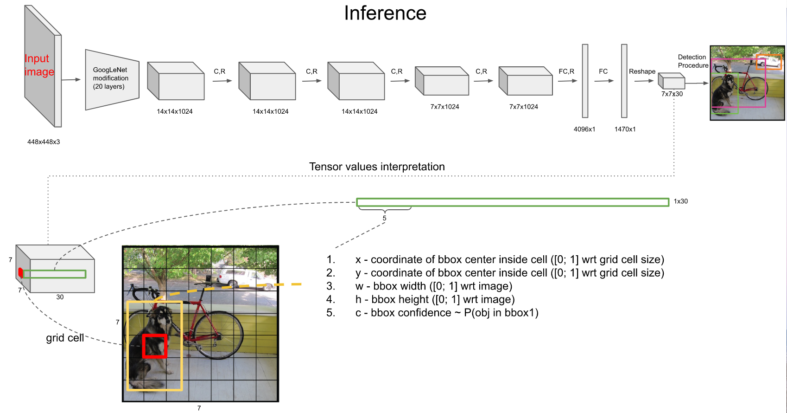
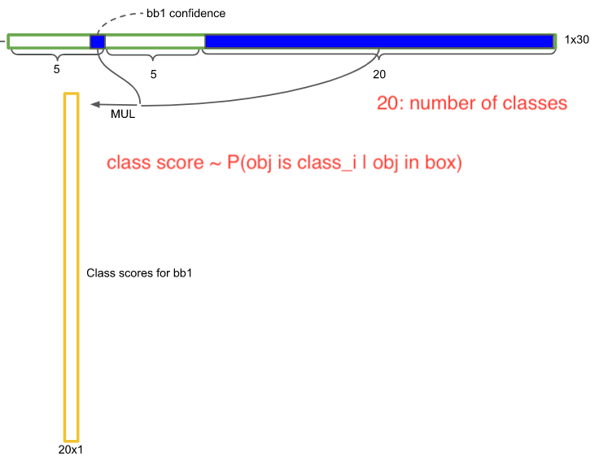
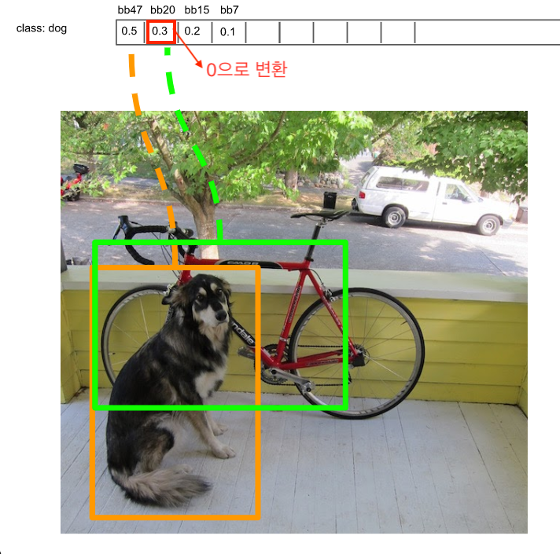
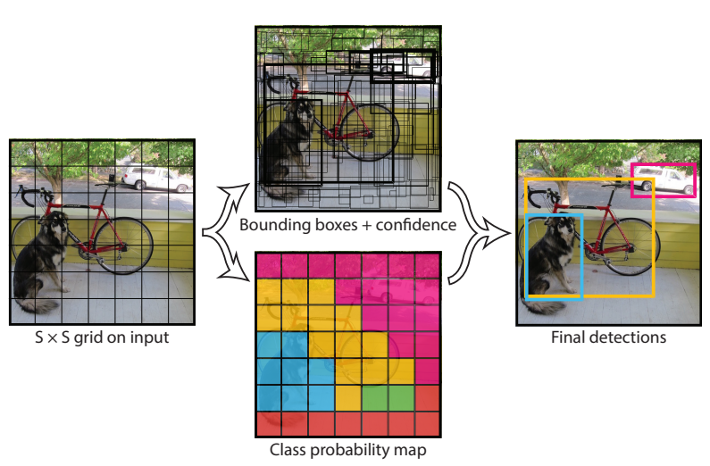
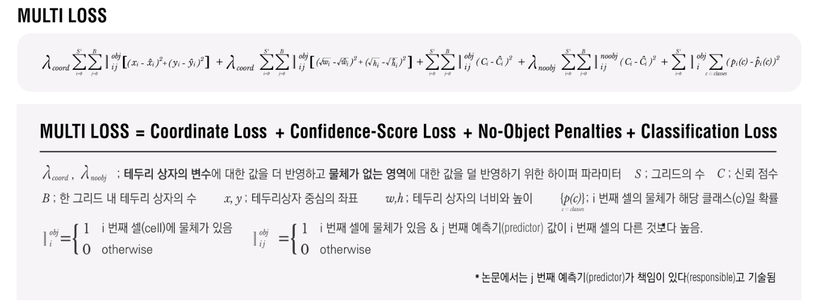

# YOLO \(You Only Look Once\)

## 1. Background

* Faster R-CNN에 이르러 초당 여러 장의 이미지를 처리 가능하게 되었지만, 여전히 느림
* Why? 단일 CNN이라고 해도 결국은 각 region이 네트워크에 들어가는 것은 변함이 없음; 각 region에 해당하는 feature map이 FCN\(Fully Connected Network\)에 들어가므로 네트워크 병목 발생
* 그리고 Object가 있을 것 같은 곳이나 아무데나 bounding box를 뿌려 놓고 많이 보는 건 느릴 수밖에 없음
* 또한, 전체 이미지를 보지 못하므로, object를 background로 간주하는 오류 발생 \(High False positive\)
* 따라서, End-to-end로 파이프라인을 간소화하는 방법 필요; **One-stage Detector or Unified Detector**

## 2. Algorithm

### Model Output

* GoogleNet으로 20개 layer의 사전 학습 후 추가 layer들을 덧붙여 S x S x channel까지 conv 수행 \(S = 7\)
* 전체 이미지를 SxS를 grid cell로 분리하여 각 grid cell마다 bounding box의 좌표\(x, y, w, h\)와 bounding box의 confidence score를 예측
  * $$x$$: bounding box 중심의 x좌표 \(\[0,1\]로 normalize\)
  * $$y$$: bounding box 중심의 y좌표 \(\[0,1\]로 normalize\)
  * $$w$$: bounding box의 폭 \(\[0,1\]로 normalize\)
  * $$h$$: bounding box의 높이 \(\[0,1\]로 normalize\)
  * $$c$$: bounding box의 confidence score로 Pr\(Object\) x IOU; 즉, object가 있을 확률과 object의 bounding box가 실제 ground truth의 bounding box가 얼마나 겹치는 지를 확인

    $$\text{Confidence Score} = Pr(Object) * IOU_{pred}^{truth}$$
* 또한, 각 grid cell당 2개의 object를 찾으므로 실제로는 10개의 파라메터들을 예측해야 함; \(x, y, w, h, c\) \* 2
* 또한, 최종 class score를 구할 때는 bounding box의 confidence score에서 각 class에 해당하는 값을 곱해 주므로 추가로 20개의 파라메터들이 필요
  * 주의: class 판별 시에는 bounding box가 아닌 bounding box의 중심 좌표가 들어 있는 grid cell에서 판별
* 따라서, 하나의 grid cell에는 30개의 파라메터 필요; \(B\*5 + C\) → 논문의 Figure 2 참조

* class에 대한 최종 파라메터 개수는 B x \(S x S\) x C = 2 x 7 x 7 x 20 = 1440개
* 최종적으로 redundant box에 대해 non-maximum suppression을 수행하여 object일 확률이 높은 box만 남김

### Non-maximum Suppression

* 0.2보다 작은 값들은 모두 0으로 만든 후, bounding box에 대해 내림차순 수행
* Class별로 최대값을 가지는 bounding box와 현재 bounding box의 IoU를 계산하여 0.5보다 크면, 같은 object를 다른 bounding box로 예측하고 있다고 판단하여 값을 0으로 변환

* Grid cell에서 예측한 bounding box들에 대한 값들과 confidence를 시각화
* Grid cell에서 예측한 가장 높은 클래스를 시각화

### Loss Function

* indicator function: object가 있는 곳에서는 class prob. 과 bounding box의 크기를 고려할 필요가 없음
  * 첫번째 항: object가 존재하는 grid cell i의 bounding box j에 대해 x, y의 loss 계산
  * 두번째 항: object가 존재하는 grid cell i의 bounding box j에 대해 w, y의 loss 계산
    * sqrt: 작은 박스는 큰 박스에 비해 더 작아지므로\(즉, x,y에 비해 w,h값이 커질 수 있으므로\) 이를 상쇄시키기 위해 square root를 씌움
  * 세번째 항: object가 존재하는 grid cell i의 bounding box j에 대해 , confidence score의 loss 계산
  * 네번째 항: object가 존재하지 않는 grid cell i의 bounding box j에 대해, confidence score의 loss 계산
  * 다섯번째 항: object가 존해하는 grid cell i에 대해, cond. class probability loss 계산

### Parameters

* GoogleNet pre-training 이후 4 convolutioanl layers와 2 fully connected layers 추가
* Bounding Box의 width와 height는 입력 이미지의 width와 height로 nomalize \(Range: 0~1\)
* Bounding Box의 x와 y는 특정 grid cell 위치의 offset값 사용 \(Range: 0~1\)
* λ\_coord: 5, λ\_noobj: 0.5
  * λ\_coord: Bounding box 좌표\(x, y, w, h\)에 대한 loss와 다른 loss들과의 균형을 위한 파라메터로 이 값이 클 수록 bounding box에 대한 가중치가 큼
  * λ\_noobj: object가 있는 box와 object가 없는 box간에 균형을 위한 파라메터
* Batch size: 64
* Momentum: 0.9 w/ a decay of 0.0005
* Learning Rate: 0.001에서 0.01로 epoch마다 천천히 상승. 이후 75 epoch동안 0.01, 30 epoch동안 0.001, 마지막 30 epoch동안 0.0001
* Dropout Rate: 0.5

### Advantages

* 빠른 속도로 real-time 가능 \(baseline: 45fps, smaller vision: 155 fps\)
* 좀 더 일반화된 특징을 학습하므로, transfer learning에 적합

### Disadvantages

* Grid size에 의존하고 1개의 grid cell은 1개의 bounding만 포함한다는 가정이 있기 때문에, grid size보다 작은 object들은 거의 예측 못함
* 또한, 각 grid cell이 하나의 class만을 예측할 수 있으므로, object 여러 개가 붙으면 예측을 잘 하지 못함
* 몇 단계의 layer를 거쳐서 나온 feature map을 대상으로 bounding box를 예측하므로 bounding box 위치가 다소 부정확해질 수 있음

## References

* Paper
  * [https://arxiv.org/abs/1506.02640](https://arxiv.org/abs/1506.02640)
* Slide
  * [deepsystems.io](http://deepsystems.io) [https://docs.google.com/presentation/d/1aeRvtKG21KHdD5lg6Hgyhx5rPq\_ZOsGjG5rJ1HP7BbA/pub?start=false&loop=false&delayms=3000&slide=id.p](https://docs.google.com/presentation/d/1aeRvtKG21KHdD5lg6Hgyhx5rPq_ZOsGjG5rJ1HP7BbA/pub?start=false&loop=false&delayms=3000&slide=id.p)
* Blog
  * [https://curt-park.github.io/2017-03-26/yolo](https://curt-park.github.io/2017-03-26/yolo/)
  * [http://christopher5106.github.io/object/detectors/2017/08/10/bounding-box-object-detectors-understanding-yolo.html](http://christopher5106.github.io/object/detectors/2017/08/10/bounding-box-object-detectors-understanding-yolo.html)
* Video Clip
  * [https://www.edwith.org/deeplearningchoi/lecture/15579/](https://www.edwith.org/deeplearningchoi/lecture/15579/)
  * [https://www.youtube.com/watch?v=L0tzmv--CGY&feature=youtu.be](https://www.youtube.com/watch?v=L0tzmv--CGY&feature=youtu.be)
  * [https://www.youtube.com/watch?v=8DjIJc7xH5U](https://www.youtube.com/watch?v=8DjIJc7xH5U)

