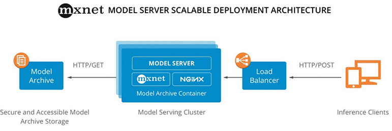

# Multi Model Server and SageMaker Multi-Model Endpoint Overview

## 1. Introduction

### MMS\(Multi Model Server\)

* [https://github.com/awslabs/multi-model-server](https://github.com/awslabs/multi-model-server) \(2017년 12월 초 MXNet 1.0 릴리스 시 최초 공개, MXNet용 모델 서버로 시작\)
* Prerequisites: Java 8, MXNet \(단, MXNet 사용 시에만\)
* MMS는 프레임워크에 구애받지 않도록 설계되었기 때문에, 모든 프레임워크의 백엔드 엔진 역할을 할 수 있는 충분한 유연성 제공
* 마이크로 서비스 기반 아키텍처로 자체적으로 엔드포인트를 생성하여 추론 서버를 구축하므로, MMS만 사용한다면 SageMaker와 무관
  * 프론트엔드: REST API를 제공하는 자바 기반 웹 서비스
  * 백엔드: Custom Service 코드를 실행하는 worker
* Flask 대비 다양한 버전의 모델을 관리하는 측면 및 logging & 지표 확인 측면의 ML 편의성이 좋음.
  * Logging: [https://github.com/awslabs/multi-model-server/blob/master/docs/logging.md](https://github.com/awslabs/multi-model-server/blob/master/docs/logging.md)
  * Metric: [https://github.com/awslabs/multi-model-server/blob/master/docs/metrics.md](https://github.com/awslabs/multi-model-server/blob/master/docs/metrics.md)
* 추론용 서버의 CPU가 메모리가 충분할 때 다양한 모델을 하나의 엔드포인트에 배포할 수 있는 기능 내장; Multi-Model Endpoint 사용 가능



* 간략한 사용 방법
  * Model Handler 구현 \(Custom Service class 구현\)
    * 1. How to initialize Multi-Model Endpoint on SageMaker? 참조
  * `model-archiver` 로 모델 패키징 → MMS가 파싱할 수 있는 아카이브 생성
    * 모델 아티팩트들을 MMS가 파싱할 수 있는 단일 모델 아카이브 파일로 패키징
      * \[필수\] Model artifacts \(weights, layer 등\)
      * \[필수\] Model signature file \(입력 데이터 텐서의 shape\)
      * \[선택\] Custom service file: 입/출력 전처리; 모델 초기화, raw 데이터를 tensor로 변환 등
      * \[선택\] Auxiliary files \(추론 수행에 필요한 추가 파일 및 Python 모듈\)
        * 예: object detection 시, 각 클래스의 string 저장
    * `export_path`로 지정한 경로에 추론 요청을 처리하기 위해 MMS에 제공하는 `<model-name>.mar` 파일이 생성됨. \([https://github.com/awslabs/multi-model-server/tree/master/model-archiver\#creating-a-model-archive](https://github.com/awslabs/multi-model-server/tree/master/model-archiver#creating-a-model-archive) 참조\)

      ```bash
      $ pip install model-archiver # multi-model-server의 디펜던시로 깔리지만, 혹시 없을 경우 인스톨할 것
      $ cd multi-model-server/examples
      $ model-archiver --model-name resnet-50_compiled --model-path mxnet_vision --handler mxnet_vision_service:handle
      ```
  * MMS 시작
    * 컴퓨팅 리소스가 많은 호스트의 경우 서버 시작에 시간이 많이 걸릴 수 있음.
    * 아래 예시에서는 MMS 로컬 파일 시스템에서 .mar 파일을 로드하지만, AWS S3에 .mar 파일을 저장하고 `http://` 또는 `https://`와 같은 URL을 사용하여 모델 아카이브 로드 가능

      ```bash
      $ cd multi-model-server
      $ multi-model-server --start --model-store examples > /dev/null # Pipe to log file if you want to keep a log of MMS
      $ curl -v -X POST "http://localhost:8081/models?initial_workers=1&max_workers=4&synchronous=true&url=resnet-50_compiled.mar"
      $ sleep 10 # allow sufficient time to load model
      ```
  * 추론 예시; MMS 프로세스가 모델 아카이브를 다운로드 및 압축 해제 후, 모델 아티팩트로 서비스를 구성하고 엔드포인트를 통해 들어오는 요청을 수신하기 시작

    ```bash
      $ cd multi-model-server
      $ curl -X POST http://127.0.0.1:8080/predictions/resnet-50_compiled -T kitten_small.jpg
    ```

  * MMS 서비스 중단 예시

    ```bash
      $ curl -X DELETE http://127.0.0.1:8081/models/resnet-50_compiled
      $ multi-model-server --stop
    ```
* 공식 문서에서는 더 강력한 보안을 위해 Docker 컨테이너 내에서 MMS를 실행하는 것을 권장함.
  * 컨테이너 예시: [https://github.com/awslabs/multi-model-server/blob/master/docker/README.md](https://github.com/awslabs/multi-model-server/blob/master/docker/README.md)

### SageMaker Inference Toolkit

* [https://github.com/aws/sagemaker-inference-toolkit](https://github.com/aws/sagemaker-inference-toolkit)
* SageMaker 상에서 MMS를 좀 더 쉽고 편하게 배포할 수 있는 high-level 어플리케이션으로 배포한 툴킷
* 또한, SageMaker Multi-Model endpoint를 쉽게 시작할 수 있는 구성 및 설정 및 인터페이스를 지원함.
* 단, Python 모델 핸들러만 지원하며, 다른 언어로 핸들러를 구현하려면 MMS를 사용해야 함.
* MMS를 래핑하여 SageMaker 추론 컨테이너로 작동하기 때문에 컨테이너 작성 난이도가 MMS를 직접 가져다 쓰는 것보다 낮음.
* MXNet, PyTorch 추론 컨테이너에는 이 toolkit를 디폴트로 사용하므로, inference handler script 인터페이스가 동일함

  향후 PyTorch 추론 컨테이너는 TorchServe로 마이그레이션될 예정. 기본적인 근간은 MMS이지만 PyTorch 특화 feature가 있음; 출처: [https://twitter.com/shshnkp/status/1290801831518433280?s=20](https://twitter.com/shshnkp/status/1290801831518433280?s=20)

  * Option 1. `model_fn(), input_fn, predict_fn(), output_fn()`
  * Option 2. `model_fn(), transform_fn()`
  * [https://github.com/aws/sagemaker-inference-toolkit/blob/ac1b164aed3c466876452202e5858b620a87c3cc/src/sagemaker\_inference/transformer.py\#L160](https://github.com/aws/sagemaker-inference-toolkit/blob/ac1b164aed3c466876452202e5858b620a87c3cc/src/sagemaker_inference/transformer.py#L160) 참조

    ```python
    def _validate_user_module_and_set_functions(self):
          """Retrieves and validates the inference handlers provided within the user module.
          Default implementations of the inference handlers are utilized in
          place of missing functions defined in the user module.
          """
          user_module_name = self._environment.module_name
          if find_spec(user_module_name) is not None:
              user_module = importlib.import_module(user_module_name)

              self._model_fn = getattr(
                  user_module, "model_fn", self._default_inference_handler.default_model_fn
              )

              transform_fn = getattr(user_module, "transform_fn", None)
              input_fn = getattr(user_module, "input_fn", None)
              predict_fn = getattr(user_module, "predict_fn", None)
              output_fn = getattr(user_module, "output_fn", None)

              if transform_fn and (input_fn or predict_fn or output_fn):
                  raise ValueError(
                      "Cannot use transform_fn implementation in conjunction with "
                      "input_fn, predict_fn, and/or output_fn implementation"
                  )

              self._transform_fn = transform_fn or self._default_transform_fn
              self._input_fn = input_fn or self._default_inference_handler.default_input_fn
              self._predict_fn = predict_fn or self._default_inference_handler.default_predict_fn
              self._output_fn = output_fn or self._default_inference_handler.default_output_fn
          else:
              self._model_fn = self._default_inference_handler.default_model_fn
              self._input_fn = self._default_inference_handler.default_input_fn
              self._predict_fn = self._default_inference_handler.default_predict_fn
              self._output_fn = self._default_inference_handler.default_output_fn

              self._transform_fn = self._default_transform_fn

    def _default_transform_fn(self, model, input_data, content_type, accept):
          """Make predictions against the model and return a serialized response.
          This serves as the default implementation of transform_fn, used when the
          user has not provided an implementation.
          Args:
              model (obj): model loaded by model_fn.
              input_data (obj): the request data.
              content_type (str): the request content type.
              accept (str): accept header expected by the client.
          Returns:
              obj: the serialized prediction result or a tuple of the form
                  (response_data, content_type)
          """
          data = self._input_fn(input_data, content_type)
          prediction = self._predict_fn(data, model)
          result = self._output_fn(prediction, accept)
          return result
    ```

### SageMaker Multi-Model Endpoint

* 2019년 11월 말 re:Invent 2019 직전에 공개
* 보통은 엔드포인트 생성 시 S3에 저장된 모델을 추론 컨테이너로 다운로드하고 지속적으로 메모리에 로드하지만, Multi-Model Endpoint는 모델을 S3에서 동적으로 로드
  * 특정 모델에 대해 첫 번째 요청이 들어오면, 그 때 S3에서 모델을 추론 컨테이너로 다운로드하고 메모리에 로드 → Cold start 발생
  * 한 번 호출된 모델은 인스턴스에 다운로드되어 메모리에 로드되므로, 추론이 빠르게 수행됨.

    ```python
      # ResNet-18 모델 1번째 호출 시 2.71s 소요
      response = runtime_sm_client.invoke_endpoint(
          EndpointName=endpoint_name,
          ContentType='application/x-image',
          TargetModel='resnet_18.tar.gz',
          Body=payload)

      print(*json.loads(response['Body'].read()), sep = '\n')
      probability=0.244390, class=n02119022 red fox, Vulpes vulpes
      probability=0.170341, class=n02119789 kit fox, Vulpes macrotis
      probability=0.145019, class=n02113023 Pembroke, Pembroke Welsh corgi
      probability=0.059833, class=n02356798 fox squirrel, eastern fox squirrel, Sciurus niger
      probability=0.051555, class=n02123159 tiger cat
      CPU times: user 13.5 ms, sys: 0 ns, total: 13.5 ms
      Wall time: 2.71 s

      # ResNet-18 모델 2번째 호출 시 156ms 소요
      response = runtime_sm_client.invoke_endpoint(
          EndpointName=endpoint_name,
          ContentType='application/x-image',
          TargetModel='resnet_18.tar.gz',
          Body=payload)

      print(*json.loads(response['Body'].read()), sep = '\n')

      probability=0.244390, class=n02119022 red fox, Vulpes vulpes
      probability=0.170341, class=n02119789 kit fox, Vulpes macrotis
      probability=0.145019, class=n02113023 Pembroke, Pembroke Welsh corgi
      probability=0.059833, class=n02356798 fox squirrel, eastern fox squirrel, Sciurus niger
      probability=0.051555, class=n02123159 tiger cat
      CPU times: user 6.03 ms, sys: 0 ns, total: 6.03 ms
      Wall time: 156 ms

      # ResNet-152 모델 1번째 호출 시 7.2s 소요
      response = runtime_sm_client.invoke_endpoint(
          EndpointName=endpoint_name,
          ContentType='application/x-image',
          TargetModel='resnet_152.tar.gz',
          Body=payload)

      print(*json.loads(response['Body'].read()), sep = '\n')

      probability=0.386026, class=n02119022 red fox, Vulpes vulpes
      probability=0.300927, class=n02119789 kit fox, Vulpes macrotis
      probability=0.029575, class=n02123045 tabby, tabby cat
      probability=0.026005, class=n02123159 tiger cat
      probability=0.023201, class=n02113023 Pembroke, Pembroke Welsh corgi
      CPU times: user 15.5 ms, sys: 80 µs, total: 15.5 ms
      Wall time: 7.2 s
    ```

  * 신규 모델을 위한 공간을 확보하기 위해 캐시 공간이 부족할 때, 모델을 동적으로 언로드
    * ModelCacheHit, ModelUnloadingTime 지표를 활용해 모델 캐싱/언로드를 모니터링할 수 있고, 모델 언로드 빈도가 잦은 경우, 인스턴스 갯수를 늘리거나 인스턴스 사양을 높이는 것이 좋음.
  * 따라서, 만약 low latency 및 high TPS가 필요하면 Multi-Model Endpoint는 적절한 솔루션이 아님.
  * 하지만, 신규 모델 배포 시, Endpoint 중단-업데이트-시작 과정이 필요 없이 S3에 복사하기만 되므로 많은 수의 모델을 배포하거나 A/B 테스트 시에 유리 \(단, framework, 네트워크 구조, 입/출력이 동일해야 함\)
* Multi-Model Endpoint는 딥러닝 프레임워크 중 MXNet 추론 컨테이너 및 PyTorch 추론 컨테이너에서만 디폴트로 지원되며, 다른 프레임워크에 적용하려면 MMS 서비스를 시작하고 호출하는 컨테이너 빌드 필요 \(BYOC\)
  * TensorFlow, Chainer는 구축된 딥러닝 프레임워크 Docker 이미지 기반으로 확장하는 것을 권장.
  * TFS\(TensorFlow Serving\) 컨테이너도 2020년부터 Multi-Model Endpoint 지원
    * [https://github.com/aws/sagemaker-tensorflow-serving-container](https://github.com/aws/sagemaker-tensorflow-serving-container)
    * 2020년 8월 기준 1.5.0과 2.1.0만 Multi-Model Endpoint 지원
  * [https://docs.aws.amazon.com/ko\_kr/sagemaker/latest/dg/pre-built-containers-frameworks-deep-learning.html](https://docs.aws.amazon.com/ko_kr/sagemaker/latest/dg/pre-built-containers-frameworks-deep-learning.html)
* 대부분의 SageMaker built-in 알고리즘들은 Multi-Model Endpoint 미지원 \(상황에 따라 변동 가능\)
  * Scikit-learn, XGBoost 컨테이너는 Multi-Model Endpoint 지원; [https://github.com/aws/sagemaker-xgboost-container/blob/mme/src/sagemaker\_xgboost\_container/serving.py](https://github.com/aws/sagemaker-xgboost-container/blob/mme/src/sagemaker_xgboost_container/serving.py)
* 직접 Inference 컨테이너에서 Multi-Model Endpoint를 사용하려면 `LOAD MODEL, LIST MODEL, GET MODEL, UNLOAD MODEL, INVOKE MODEL` API를 구현해야 함; [https://docs.aws.amazon.com/sagemaker/latest/dg/mms-container-apis.html](https://docs.aws.amazon.com/sagemaker/latest/dg/mms-container-apis.html) 참조
* 다중 모델에 대한 Model Monitoring 기능은 향후 지원 예정
* **주의**
  * **Elastic Inference와 동시 사용이 불가능하고 GPU 미지원**
  * Multi-container endpoint가 아님. 컨테이너, 엔드포인트는 단일로 구성되어 있음
* References \(AWS Internal Only\)
  * [https://answers.amazon.com/questions/108401](https://answers.amazon.com/questions/108401)?
  * [https://answers.amazon.com/questions/103311](https://answers.amazon.com/questions/103311)?
  * [https://aws-crm--c.na67.visual.force.com/apex/OverrideProductFeatureRequestView?id=a2v0z000002GaszAAC&sfdc.override=1](https://aws-crm--c.na67.visual.force.com/apex/OverrideProductFeatureRequestView?id=a2v0z000002GaszAAC&sfdc.override=1)

### Trade-off between Server Load and Response Latency

#### Horizontal scaling

* AutoScaling 기능을 사용하여 사전 정의된 Cloudwatch 지표 중 InvocationsPerInstance 지표를 기반으로 scale-out/in을 수행할 수 있음.

#### Vertical scaling

* 적절한 컴퓨팅 인스턴스를 선택하되, 비용 및 latency가 중요하면 Elastic Inference / Inferentia을 고려할 것
* 단, Multi-Model Endpoint는 GPU, Elastic Inference, Inferentia 미지원

## 2. How to initialize Multi-Model Endpoint on SageMaker?

### 구현 개요

1. Handler 구현
   * Method 1. SageMaker Inference Toolkit의 Handler 및 HandlerService 구현
   * Method 2. MMS 템플릿의 Custom Service 파일 구현
2. Model Server를 시작하는 Serving 엔드리포인트 구현

   ```python
    from sagemaker_inference import model_server
    model_server.start_model_server(handler_service=[YOUR HANDLER]
   ```

3. Dockerfile 생성

   ```python
    FROM ubuntu:16.04

    # Set a docker label to advertise multi-model support on the container
    LABEL com.amazonaws.sagemaker.capabilities.multi-models=true
    # Set a docker label to enable container to use SAGEMAKER_BIND_TO_PORT environment variable if present
    LABEL com.amazonaws.sagemaker.capabilities.accept-bind-to-port=true

    # Install necessary dependencies for MMS and SageMaker Inference Toolkit
    RUN apt-get update && \
        apt-get -y install --no-install-recommends \
        build-essential \
        ca-certificates \
        openjdk-8-jdk-headless \
        python3-dev \
        curl \
        vim \
        && rm -rf /var/lib/apt/lists/* \
        && curl -O https://bootstrap.pypa.io/get-pip.py \
        && python3 get-pip.py

    RUN update-alternatives --install /usr/bin/python python /usr/bin/python3 1
    RUN update-alternatives --install /usr/local/bin/pip pip /usr/local/bin/pip3 1

    # Install MXNet, MMS, and SageMaker Inference Toolkit to set up MMS
    RUN pip3 --no-cache-dir install mxnet \
                                    multi-model-server \
                                    sagemaker-inference \
                                    retrying

    # Copy entrypoint script to the image
    COPY dockerd-entrypoint.py /usr/local/bin/dockerd-entrypoint.py
    RUN chmod +x /usr/local/bin/dockerd-entrypoint.py

    RUN mkdir -p /home/model-server/

    # Copy the default custom service file to handle incoming data and inference requests
    COPY model_handler.py /home/model-server/model_handler.py

    # Define an entrypoint script for the docker image
    ENTRYPOINT ["python", "/usr/local/bin/dockerd-entrypoint.py"]

    # Define command to be passed to the entrypoint
    CMD ["serve"]
   ```

4. [https://github.com/awslabs/amazon-sagemaker-examples/blob/master/advanced\_functionality/multi\_model\_bring\_your\_own/container/Dockerfile](https://github.com/awslabs/amazon-sagemaker-examples/blob/master/advanced_functionality/multi_model_bring_your_own/container/Dockerfile) 참조

### Handler 구현 방법

#### Method 1. SageMaker Inference Toolkit의 Handler 및 HandlerService 구현

* Inference handler 구현: 흔히 SageMaker Endpoint 딥러닝 프레임워크에서 추론 시 사용하는 `input_fn, predict_fn, output_fn, model_fn` 과 동일한 형태
* SageMaker inference toolkit의 레퍼런스 구현이지만, 템플릿 코드만 존재하고 실제 예제 코드가 없음.

```python
import textwrap

from sagemaker_inference import decoder, encoder, errors, utils, default_inference_handler

#class DefaultPytorchInferenceHandler(default_inference_handler.DefaultInferenceHandler):
class DefaultInferenceHandler(object):
    """Bare-bones implementation of default inference functions.
    """

    def default_model_fn(self, model_dir):
        """Function responsible for loading the model.
        Args:
            model_dir (str): The directory where model files are stored.
        Returns:
            obj: the loaded model.
        """
        raise NotImplementedError(
            textwrap.dedent(
                """
            Please provide a model_fn implementation.
            See documentation for model_fn at https://sagemaker.readthedocs.io/en/stable/
            """
            )
        )

    def default_input_fn(self, input_data, content_type):  # pylint: disable=no-self-use
        """Function responsible for deserializing the input data into an object for prediction.
        Args:
            input_data (obj): the request data.
            content_type (str): the request content type.
        Returns:
            obj: data ready for prediction.
        """
        return decoder.decode(input_data, content_type)

    def default_predict_fn(self, data, model):
        """Function responsible for model predictions.
        Args:
            model (obj): model loaded by the model_fn
            data: deserialized data returned by the input_fn
        Returns:
            obj: prediction result.
        """
        raise NotImplementedError(
            textwrap.dedent(
                """
            Please provide a predict_fn implementation.
            See documentation for predict_fn at https://sagemaker.readthedocs.io/en/stable/
            """
            )
        )

    def default_output_fn(self, prediction, accept):  # pylint: disable=no-self-use
        """Function responsible for serializing the prediction result to the desired accept type.
        Args:
            prediction (obj): prediction result returned by the predict_fn.
            accept (str): accept header expected by the client.
        Returns:
            obj: prediction data.
        """
        for content_type in utils.parse_accept(accept):
            if content_type in encoder.SUPPORTED_CONTENT_TYPES:
                return encoder.encode(prediction, content_type), content_type
        raise errors.UnsupportedFormatError(accept)
```

* `DefaultHandlerService`를 상속받아 `HandlerService` 클래스 구현

```python
from __future__ import absolute_import

from sagemaker_inference.default_handler_service import DefaultHandlerService
from sagemaker_inference.transformer import Transformer
from sagemaker_pytorch_serving_container.default_pytorch_inference_handler import DefaultPytorchInferenceHandler

import os
import sys

ENABLE_MULTI_MODEL = os.getenv("SAGEMAKER_MULTI_MODEL", "false") == "true"

class HandlerService(DefaultHandlerService):

    """Handler service that is executed by the model server.

    Determines specific default inference handlers to use based on the type MXNet model being used.

    This class extends ``DefaultHandlerService``, which define the following:
        - The ``handle`` method is invoked for all incoming inference requests to the model server.
        - The ``initialize`` method is invoked at model server start up.

    Based on: https://github.com/awslabs/mxnet-model-server/blob/master/docs/custom_service.md

    """
    def __init__(self):
        self._initialized = False

        transformer = Transformer(default_inference_handler=DefaultInferenceHandler())
        super(HandlerService, self).__init__(transformer=transformer)

    def initialize(self, context):
        # Adding the 'code' directory path to sys.path to allow importing user modules when multi-model mode is enabled.
        if (not self._initialized) and ENABLE_MULTI_MODEL:
            code_dir = os.path.join(context.system_properties.get("model_dir"), 'code')
            sys.path.append(code_dir)
            self._initialized = True

        super().initialize(context)
```

#### Method 2. MMS 템플릿의 Custom Service 파일 구현

* [https://github.com/awslabs/multi-model-server/blob/master/docs/custom\_service.md](https://github.com/awslabs/multi-model-server/blob/master/docs/custom_service.md) 참조
* SageMaker inference toolkit 클래스를 상속받지 않고 자체 커스텀 서비스 구현
* SageMaker Notebook 공식 예제는 이 방법을 기반으로 하고 있음.
  * 원문: [https://github.com/awslabs/amazon-sagemaker-examples/blob/master/advanced\_functionality/multi\_model\_bring\_your\_own/multi\_model\_endpoint\_bring\_your\_own.ipynb](https://github.com/awslabs/amazon-sagemaker-examples/blob/master/advanced_functionality/multi_model_bring_your_own/multi_model_endpoint_bring_your_own.ipynb)
  * 번역: [https://github.com/daekeun-ml/sagemaker-reinvent2019-kr/blob/master/multi-model-endpoint/multi\_model\_endpoint\_bring\_your\_own.ipynb](https://github.com/daekeun-ml/sagemaker-reinvent2019-kr/blob/master/multi-model-endpoint/multi_model_endpoint_bring_your_own.ipynb)
* `handle(data, context)` 메서드는 MMS에 의해 호출되는 entrypoint
  * context는 `transform()` 함수로 전달되지만, 추론 handler 함수들\(`model_fn()` 등\)로는 전달되지 않음
  * 따라서, 만약 multi-GPU를 최대한 활용하고 싶으면 Custom Transformer class를 생성 후, context를 `model_fn()` 모듈에 전달할 수 있게 수정해야 함 \(예: model\_server\_workers = 4일 때, 각 worker마다 각자 다른 GPU로 처리\)

```python
import logging

class ModelHandler(object):
    """
    A base Model handler implementation.
    """
    def __init__(self):
        self.error = None
        self._context = None
        self._batch_size = 0
        self.initialized = False

    def initialize(self, context):
        """
        Initialize model. This will be called during model loading time
        :param context: Initial context contains model server system properties.
        :return:
        """
        self._context = context
        self._batch_size = context.system_properties["batch_size"]
        self.initialized = True

    def preprocess(self, batch):
        """
        Transform raw input into model input data.
        :param batch: list of raw requests, should match batch size
        :return: list of preprocessed model input data
        """
        # Take the input data and pre-process it make it inference ready
        assert self._batch_size == len(batch), "Invalid input batch size: {}".format(len(batch))
        return None

    def inference(self, model_input):
        """
        Internal inference methods
        :param model_input: transformed model input data
        :return: list of inference output in NDArray
        """
        # Do some inference call to engine here and return output
        return None

    def postprocess(self, inference_output):
        """
        Return predict result in batch.
        :param inference_output: list of inference output
        :return: list of predict results
        """
        # Take output from network and post-process to desired format
        return ["OK"] * self._batch_size

    def handle(self, data, context):
        """
        Call preprocess, inference and post-process functions
        :param data: input data
        :param context: mms context
        """
        model_input = self.preprocess(data)
        model_out = self.inference(model_input)
        return self.postprocess(model_out)

_service = ModelHandler()

def handle(data, context):
    if not _service.initialized:
        _service.initialize(context)

    if data is None:
        return None

    return _service.handle(data, context)
```

## References

* [awslabs/multi-model-server](https://github.com/awslabs/multi-model-server/blob/master/docs/README.md)
* [Build Your Own Container with Multi Model Server](https://docs.aws.amazon.com/sagemaker/latest/dg/build-multi-model-build-container.html)
* [Deploying PyTorch inference with MXNet Model Server \| Amazon Web Services](https://aws.amazon.com/ko/blogs/machine-learning/deploying-pytorch-inference-with-mxnet-model-server/)

