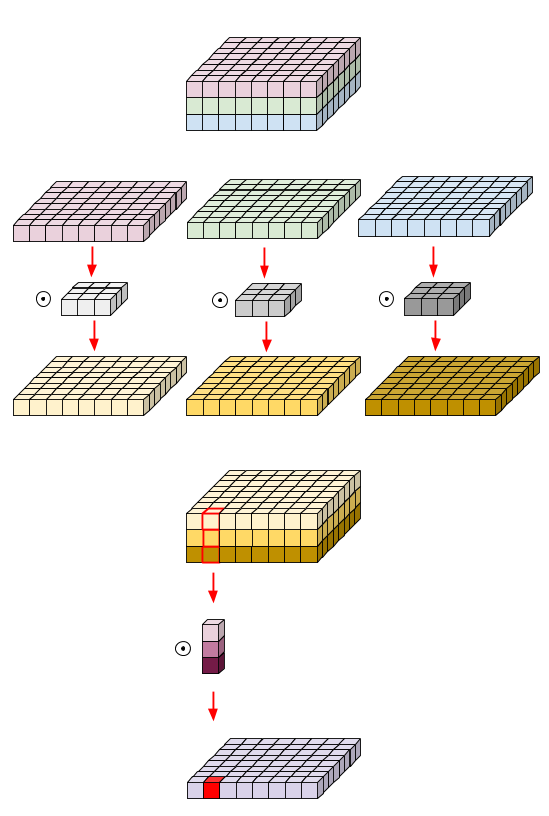
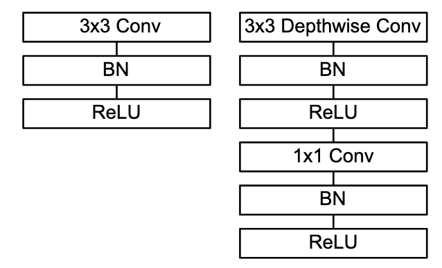

# MobileNet V1/V2/V3 Overview

## MobileNet-v1 \(2017/04\)

* 대부분의 연산을 1x1 Conv, 3x3 Conv, Depthwise Separable Convolution을 사용하여 연산을 줄임

### Depthwise Separable Convolution

* Keras 창시자가 투고한 Xception에서 제안한 기법\([https://arxiv.org/abs/1610.02357](https://arxiv.org/abs/1610.02357) 참조\)
* Depthwise convolution followed by a Pointwise\(1x1\) convolution
  * 즉, 공간\(spatial\)에 대한 Convolution을 먼저 수행 후, 채널\(channel\)에 대한 Convolution 수행
  * Depthwise Conv: 각 채널당 convlution을 한 후 concatenation 수행
  * Pointwise Conv: 1x1 conv



* Computation cost가 $$(1/d_j) + (1/k^2)$$로 감소. 3x3 Convolution 기준으로 8-9배 Computation cost 저감
  * d: depth or channel, k : mask size

$$
\text{Conv}: h_i \times w_i \times d_j \times k \times k \times d_i \\ \text{Depthwise Conv}: h_i \times w_i \times d_i \times (k^2 + d_j)
$$

3x3 Conv를 오른쪽과 같이 근사할 수 있음

*  

연산\(Multi-Add\) 개수와 파라메터 개수와 획기적으로 줄었지만, accuracy 차이는 1.1%밖에 나지 않음


### Architecture

* 전체 28개 계층 \(Conv 13회 + Depthwise Conv 13회\)
  * Depthwise Separable Convolution\(dw\)을 13회 수행
  * 7x7 Global Average Pooling 수행 후 1024x1000 FC 수행 후 softmax
  * alpha: Width multiplier로 각 계층의 채널 개수를 제어하는 하이퍼파라메터 \(0.25, 0.5, 0.75, 1.0 중 선택\)
  * rho: Resolution multiplier로 입력 데이터의 해상도를 일정 비율로 줄임


* 90%의 파라메터는 FCN\(Fully-Connected Layer\)에서 발생함
* 따라서, 대부분의 연산을 1x1 Conv, 3x3 Conv, Depthwise Separable Convolution을 사용하여 연산을 줄임

## MobileNet-v2 \(2018/01\)

* Convolution에서 Spatial 방향의 계산보다 채널 방향의 개선이 압도적으로 많음
* MobileNet-v1에서 1x1 Convolution으로 계산량을 줄였지만 Pointwise Convolution으로 인해 1x1 Convolution의 계산이 여전히 많기 때문에 이 부분을 Bottleneck Residual Block으로 개선

### Linear Bottlenecks

* 차원 축소 시 ReLU와 같은 비선형 함수에 의해 문제가 발생
  * 만약 ReLU를 지난 출력이 S인 경우, S &gt; 0이면, S에 mapping 된 input의 각 값은 linear transformation된 것
  * Linear transformation 결과는 정보 손실이 없지만, 0 이하의 값은 모두 버려지기에 정보 손실 발생 \(즉, 입력 채널의 정보를 activation space에 전부 담지 못함\)
* 이를 방지하기 위한 두 가지 방법
  1. Channel reduction이 아닌 channel expansion을 이용 \(직관적으로 고차원의 space일수록 정보가 손실될 가능성이 줄어듦\) → Inverted Residual 의 주요 아이디어
  2. Residual Block의 last convolution에 ReLU activation을 적용하지 않고 곧바로 linear output으로 출력

### Inverted Residuals

* Pointwise의 계산량을 더욱 줄이기 위한 방법
* 기존 ResNet의 Residual Block이 thick-thin-thick 구조였다면, MobileNet-v2에서는 thin-thick-thin으로 변경
* 채널 수는 Inverted Residual Block에서만 늘림


* Code snippet \(출처: [https://towardsdatascience.com/mobilenetv2-inverted-residuals-and-linear-bottlenecks-8a4362f4ffd5](https://towardsdatascience.com/mobilenetv2-inverted-residuals-and-linear-bottlenecks-8a4362f4ffd5)\)

```python
def residual_block(x, squeeze=16, expand=64):
  m = Conv2D(squeeze, (1,1), activation='relu')(x)
  m = Conv2D(squeeze, (3,3), activation='relu')(m)
  m = Conv2D(expand, (1,1), activation='relu')(m)
  return Add()([m, x])

def inverted_residual_block(x, expand=64, squeeze=16):
  m = Conv2D(expand, (1,1), activation='relu')(x)
  m = DepthwiseConv2D((3,3), activation='relu')(m)
  m = Conv2D(squeeze, (1,1), activation='relu')(m)
  return Add()([m, x])

def inverted_linear_residual_block(x, expand=64, squeeze=16):
  m = Conv2D(expand, (1,1), activation='relu')(x)
  m = DepthwiseConv2D((3,3),  activation='relu')(m)
  m = Conv2D(squeeze, (1,1))(m)
  return Add()([m, x])
```

### Bottleneck Residual Block

* 3개의 sub-block들로 구성됨; Expansion Convolution → Depthwise Convolution → Projection Convolution
  * Expansion: 1x1 Conv로 채널을 키우고 BN - ReLU6 수행 \(채널을 몇 배 키울 건지 정하는 expansion factor t는 하이퍼파라메터로 5~10 레인지를 주로 사용하고 보통 6을 설정\)
  * Depthwise: 3x3 Depthwise Conv → BN → ReLU6
  * Projection: sub-space로 임베딩; 1x1 Conv로 채널을 줄이고\(linear bottleneck\) BN 수행

MobileNet-v1


MobileNet-v2


expressiveness와 capacity\(bottleneck\) 를 분리했음


* Code Snippet

```python
def bottleneck_block(x, expand=64, squeeze=16):
  # Expansion

  m = Conv2D(expand, (1,1))(x)
  m = BatchNormalization()(m)
  m = Activation('relu6')(m)
  # Depthwise Conv
  m = DepthwiseConv2D((3,3))(m)
  m = BatchNormalization()(m)
  m = Activation('relu6')(m)

  # Projection
  m = Conv2D(squeeze, (1,1))(m)
  m = BatchNormalization()(m)
  return Add()([m, x])
```


* 전체 19개 계층 \(Conv2D → 17 Residual Bottleneck Layers → Conv2D -&gt; AvgPool → Conv\)
* v1의 경우 최종 FCN 전의 input size가 7 × 7 × 1024인데 비해, v2는 7 × 7 × 320
* 하이퍼파라메터
  * Input Resolution: 96~224
  * Width multiplier: 0.35~1.4

## MobileNet-v3 \(2019/05\)

* 주요 변경점
  * AutoML 적용; Platform-aware NAS\(Network Architecture Search\)와 NetAdapt 조합
    * NAS로 자동으로 최적 아키텍처를 찾고 NetAdapt 를 적용하여 target 디바이스에 맞게 자동으로 압축
  * Bottleneck에 Squeeze-and-Excite 모듈을 도입
  * h-swish activation 사용
* 개선점
  * MobileNetV3-Small: MobileNetV2에 비해 비슷한 latency로 6.6% 더 정확
  * MobileNetV3-Large: MobileNetV2에 비해 ImageNet classification에서 3.2% 더 높은 정확도 &  20%의 개선된 latency, MS COCO dataset에서도 약 25% 더 빠름
  * MobileNetV3-Large LR-ASPP\(Lite Reduced Atrous Spatial Pyramid Pooling\): MobileNetV2 R-ASPP에 비해 Cityspace segmentation에서 34% 빠르고 비슷한 정확도

### NAS\(Network Architecture Search\)

* MnasNet와 유사한 방법으로 최적의 아키텍처 탐색
  * FLOP 대신 target 디바이스의 latency를 줄이기 위한 목적 함수를 설정하여 강화 학습으로 훈련
* 이렇게 찾은 아키텍처를 분석해 보니 네트워크의 앞단과 끝단이 비효율적인 것을 확인
* 따라서 accuracy를 유지하면서도 latency를 줄이기 위해 몇 가지 개선 방법들을 제안
  * projection layer를 average pooling layer 뒤에 보냄 → 7x7 spatial resolution 연산이 1x1 spatial resolution으로 저감
  * 이전 bottleneck layer의 projection과 filtering layer 제거


### Squeeze and Excitation

* ILSVRC 2017에서 우승한 아키텍처로 SE\(Squeeze and Excitation\) Block 사용
* Squeeze: 각 feature map에 대한 전체 정보 요약; H xW x C 크기의 feautre map을 Global Average Pooling을 통해 1 x 1 x C로 변환
* Excitation: 각 feature map의 중요도를 Recalibation을 통해 스케일링; FCN → ReLU → FCN → Sigmoid 사용
* 임의의 네트워크\(VGG, ResNet 등\)에 SE block을 마음껏 붙일 수 있음


```python
def se_block(input, channels, r=8):
    # Squeeze
    x = GlobalAveragePooling2D()(input)
    # Excitation
    x = Dense(channels//r, activation="relu")(x)
    x = Dense(channels, activation="sigmoid")(x)
    return Multiply()([input, x])
```

### Hard Activation

* 모바일에서는 sigmoid 연산이 복잡하므로 hard version of sigmoid\(piece-wise linear hard analog\)를 제안; $$\frac{\text{ReLU6}(x+3)}{6}$$ 
* Swish activation function $$x=x\cdot \sigma(x)$$은 dying ReLU를 해결하여 정확도는 향상되지만, 모바일 환경에서의 계산 복잡도를 무시할 수 없기 때문에 hard version of swish \(h-swish\)로 계산 복잡도를 줄임

$$
\text{h-swish}(x) = x\frac{\text{ReLU6}(x+3)}{6}
$$


* Memory access 횟수가 줄어들기 때문에 latency도 낮을 뿐더러, 정확도 저하도 없음

### Architecture

* platform-aware NAS와 NetAdapt를 적용해 두 개의 아키텍처를 제안

MovileNetV3-Small


MobileNetV3-Large


* 하이퍼파라메터
  * RMSProp Optimizer with 0.9 momentum
  * 초기 learning rate = 0.1, batch size = 4096 \(128 images per chip\), learning rate decay rate는 3 epoch마다 0.01
  * Dropout = 0.8
  * L2 weight decay = 1e-5
  * Decay = 0.9999의 exponential moving average 사용함

## References

* Paper
  * MobileNet V1: [https://arxiv.org/pdf/1704.04861.pdf](https://arxiv.org/pdf/1704.04861.pdf)
  * MobileNet V2: [https://arxiv.org/pdf/1801.04381.pdf](https://arxiv.org/pdf/1801.04381.pdf)
  * MobileNet V3: [https://arxiv.org/pdf/1905.02244.pdf](https://arxiv.org/pdf/1905.02244.pdf)
  * Squeeze-and-Excitation Networks: [https://arxiv.org/pdf/1709.01507.pdf](https://arxiv.org/pdf/1709.01507.pdf)
* Blog
  * [http://machinethink.net/blog/mobilenet-v2/](http://machinethink.net/blog/mobilenet-v2/)

