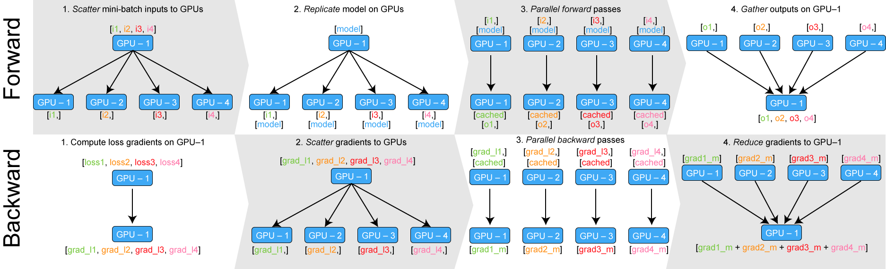

# Data Parallelism Overview

## Deck



## 1. Single GPU

### Gradient Accumulation

* 부족한 GPU의 메모리에서 batch size를 키우기 위한 방법
* 매 step마다 파라메터를 업데이트하지 않고(`optimizer.step()` 호출) parameter.grad 텐서에서 여러 backward 연산의 gradient들을 모았다가 일정 step이 경과하면 파라메터를 업데이트
* loss도 합산되므로 `accumulation_steps`로 나눠야 함


```python
model.zero_grad()                                   # Reset gradients tensors
for i, (inputs, labels) in enumerate(training_set):
    predictions = model(inputs)                     # Forward pass
    loss = loss_function(predictions, labels)       # Compute loss function
    loss = loss / accumulation_steps                # Normalize our loss (if averaged)
    loss.backward()                                 # Backward pass
    if (i+1) % accumulation_steps == 0:             # Wait for several backward steps
        optimizer.step()                            # Now we can do an optimizer step
        model.zero_grad()                           # Reset gradients tensors
        if (i+1) % evaluation_steps == 0:           # Evaluate the model when we...
            evaluate_model()                        # ...have no gradients accumulated
```

### Gradient Checkpoint

* 최초 소개: Training Deep Nets with Sublinear Memory Cost ([https://arxiv.org/pdf/1604.06174.pdf](https://arxiv.org/pdf/1604.06174.pdf))
* OpenAI가 적극 활용

> For feed-forward models we were able to fit more than 10x larger models onto our GPU, at only a 20% increase in computation time. (Source: ttps://github.com/cybertronai/gradient-checkpointing)

* Gradient를 노드마다 저장하는 대신, 그래프를 분석하여 저장되지 않아도 되는 gradient를 삭제


.gif>)

* 기본 아이디어
  * 필요한 노드에만 조약돌(pebbles, 메모리)을 놓고 중간 결과 계산
  * 값이 더 필요하지 않으면 노드에서 조약돌을 제거하고 향후 계산에 사용
* Memory Requirement: $$O(\sqrt{n})$$
  * $$O(1)$$ 메모리 전략을 사용할 수도 있지만, 계산 복잡도가 $$O(n^2)$$로 증가하므로 권장하지 않음
  * $$O(\sqrt{n})$$ 전략으로 중간 결과를 체크포인트로 지정하여 저장하면 계산 복잡도가 $$O(n)$$이기에 권장 전략으로 사용
  * 속도는 약 10\~20% 정도 느려지지만, Transformer 같은 대용량 모델 학습에 필요한 메모리를 크게 줄일 수 있으며, 긴 sequence의 RNN에 대해서도 효과적
* 계산 그래프 적용을 위해 Dynamic programming 및 트리 분해 기법 적용
* 참조
  * [https://medium.com/tensorflow/fitting-larger-networks-into-memory-583e3c758ff9](https://medium.com/tensorflow/fitting-larger-networks-into-memory-583e3c758ff9)
  * [https://openai.com/blog/sparse-transformer/](https://openai.com/blog/sparse-transformer/)
* TensorFlow: [https://github.com/openai/gradient-checkpointing](https://github.com/openai/gradient-checkpointing)
* PyTorch: [https://pytorch.org/docs/stable/checkpoint.html](https://pytorch.org/docs/stable/checkpoint.html)

### Iterable-style Dataset

* PyTorch 1.2부터 지원하고 있는 `torch.utils.data.IterableDataset` 유형의 데이터셋으로 데이터 사이즈가 커서 메모리가 부족한 경우나 스트리밍 데이터셋에 권장
* `__getitem__()`과 `__len__()`을 구현하는 대신 `__iter__()` 구현
* map-style dataset은 `dataset[index]`를 사용하는 반면 iteratble-style dataset은 `next(iterable_dataset)`을 사용하므로, 데이터셋을 사전에 셔플링하는 것이 좋음
* 주의: Multi-process로 사용 시 동일한 데이터셋 객체가 각 worker processing에 복제되어 중복데이터가 모델에 feeding되므로 워크로드를 분배해야 함.
* 참조: [https://pytorch.org/docs/stable/data.html](https://pytorch.org/docs/stable/data.html)

## 2. Single-Machine Multi-GPU

### 기본 용어

* **rank**: 글로벌 process id (각 GPU는 단일 process에 매칭됨)
* **local\_rank**: 해당 node에서의 process id (a unique local ID for processes running in a single node)
* **node\_size**: 독립된 머신의 수
* **num\_gpu**: 각 머신당 사용할 gpu 개수
* **world\_size**: 총 글로벌 process 개수 (node\_size \*num\_gpu)
* 예: p3.8xlarge x 2 (각 노드 당 4장의 GPU)
  * world\_size = 2\*4= 8
  * process rank for node 0 = 0, 1, 2, 3
  * process rank for node 1 = 4, 5, 6, 7
  * local rank for node 0 = 0, 1, 2, 3
  * local rank for node 1 = 0, 1, 2, 3

### PyTorch DataParallel

* 사용법이 매우 간단하지만 (Only 1-line code), 1개의 GPU에 리소스가 몰리므로 메모리 불균형 문제 발생
* 또한, multi processing이 아닌 multi threading 방식으로 파이썬 인터프리터의 GIL(Global Interpreter Lock;  다른 thread는 자원을 acquire하기 전까지는 실행 불가능)로 인한 퍼포먼스 오버헤드 발생

```python
parallel_model = torch.nn.DataParallel(model) # Encapsulate the model

predictions = parallel_model(inputs)          # Forward pass on multi-GPUs
loss = loss_function(predictions, labels)     # Compute loss function
loss.mean().backward()                        # Average GPU-losses + backward pass
optimizer.step()                              # Optimizer step
predictions = parallel_model(inputs)          # Forward pass with new parameters
```

* DataParallel은 **replicate → scatter → parallel\_apply → gather** 순서로 진행
  * **replicate**: 모델을 각 GPU에 복사
  * **scatter**: mini-batch를 GPU 개수만큼 나눈 다음 분배
  * **parallel\_apply**: Forward propagation
  * **gather**: tensor 출력 결과를 하나의 GPU로 모음



```python
def data_parallel(module, input, device_ids, output_device):
    replicas = nn.parallel.replicate(module, device_ids)
    inputs = nn.parallel.scatter(input, device_ids)
    replicas = replicas[:len(inputs)]
    outputs = nn.parallel.parallel_apply(replicas, inputs)
    return nn.parallel.gather(outputs, output_device)
```

### Balanced load on multi-GPU (Custom DataParallel)

* PyTorch-Encoding 패키지를 사용하여 메모리 불균형 개선
* 각 label도 scatter하여 loss function을 parallel하게 연산
* 각 GPU에서 계산한 loss에 대한 backward propagation 수행

```python
from torch.nn.parallel.data_parallel import DataParallel

class DataParallelCriterion(DataParallel):
    def forward(self, inputs, *targets, **kwargs):
        targets, kwargs = self.scatter(targets, kwargs, self.device_ids)
        replicas = self.replicate(self.module, self.device_ids[:len(inputs)])
        targets = tuple(targets_per_gpu[0] for targets_per_gpu in targets)
        outputs = _criterion_parallel_apply(replicas, inputs, targets, kwargs)
        return Reduce.apply(*outputs) / len(outputs), targets
```

## 3. Multi-Machine Multi-GPU

### PyTorch DistributedDataParallel (DDP)

* PyTorch에서 쉽게 사용할 수 있는 Data Parallelism 기법으로 multi processing 이용
  * 각 GPU가 dedicated process를 사용하므로 파이썬 인터프리터의 GIL로 인한 퍼포먼스 오버헤드 방지
* `torch.distributed.init_process_group()` 을 통해 여러 노드에서 여러 프로세스가 동기화되고 통신할 수 있게 설정
* Getting Started with DDP: [https://pytorch.org/tutorials/intermediate/ddp\_tutorial.html](https://pytorch.org/tutorials/intermediate/ddp_tutorial.html)

#### Code snippets

```python
import torch.distributed as dist
from torch.nn.parallel import DistributedDataParallel as DDP
from torch.utils.data.distributed import DistributedSampler
from torch.utils.data import DataLoader   

def main_worker(gpu, ngpus_per_node, args):
    args.gpu = gpu
    torch.cuda.set_device(args.gpu)

    print("Use GPU: {} for training".format(args.gpu))
    args.rank = args.rank * ngpus_per_node + gpu

    # 각 GPU마다 분산 학습을 위한 초기화 수행
    # Initializes the distributed backend which will take care of sychronizing nodes/GPUs
    dist.init_process_group(backend='nccl', 
                            init_method='tcp://127.0.0.1:FREEPORT',
                            world_size=args.world_size, 
                            rank=args.rank)

    model = '[YOUR MODEL]'

    # Encapsulate the model on the GPU assigned to the current process
    device = torch.device('cuda', arg.local_rank)
    model = model.to(device)
    model = DDP(model, device_ids=[args.gpu])

        trn_dataset = '[YOUR DATASET]'
        # Restricts data loading to a subset of the dataset exclusive to the current process
        trn_sampler = DistributedSampler(trn_dataset)
        trn_loader = DataLoader(trn_dataset, batdh_size=args.batch_size,
                                                        sampler=trn_sampler, 
                                                        pin_memory=True, num_workers=args.workers)

    for i in range(args.num_epochs):
                for inputs, labels in trn_loader:
                        preds = model(inputs.to(device))
                        loss = loss_fn(preds, labels.to(device))
            loss.backward()
                        optimizer.step()

def main():
    args = parser.parse_args()
    ngpus_per_node = torch.cuda.device_count()
    args.world_size = ngpus_per_node * args.world_size
    mp.spawn(main_worker, nprocs=ngpus_per_node, 
             args=(ngpus_per_node, args))
```

#### DistributedSampler

* 각 프로세스는 배치가 겹치지 않게 작업할 부분 데이터(전체 데이터를 world size로 나눈 데이터)를 알아야 하며 DistributedSampler에서 이를 자동으로 수행함
* 부분 데이터를 만들기 위해 전체 데이터셋 인덱스 리스트를 랜덤으로 섞은 다음에 그 인덱스 리스트를 쪼개서 각 GPU Sampler에 할당

```python
class DistributedSampler(Sampler):
    def __init__(self, dataset, num_replicas=None, rank=None):
        num_replicas = dist.get_world_size()
        rank = dist.get_rank()
        self.dataset = dataset
        self.num_replicas = num_replicas
        self.rank = rank
        self.num_samples = int(math.ceil(len(self.dataset) * 1.0 / self.num_replicas))
        self.total_size = self.num_samples * self.num_replicas

    def __iter__(self):
        g = torch.Generator()
        g.manual_seed(self.epoch)
        indices = torch.randperm(len(self.dataset), generator=g).tolist()
        indices = indices[self.rank:self.total_size:self.num_replicas]
        return iter(indices)
```

#### Gradient as Bucket View (≥ PyTorch 1.7)

* DDP는 내부 버킷에 대한 전체 gradient 사본을 생성하므로 gradient를 복사하는 과정에서 메모리 오버헤드 발생
* `gradient_as_bucket_view=True`로 설정 시 메모리 오버헤드 제거
* 아직 실험적인 기능이므로 주의 필요

#### Horovod vs. DDP

* Horovod는 MPI의 병렬 프로그래밍 스타일을 사용하며, DDP는 런타임에 worker 프로세스 생성
* Horovod는 Adasum, allreduce 성능을 향상시키는 자동 튜닝, FP16 gradient 압축 등의 고급 기능들이 있음

### NVIDIA Apex

* 2018년 NVIDIA에서 개발한 분산 학습 PyTorch Extension(APEX = A Pytorch EXtension)으로 PyTorch >= 1.6.0부터 기본 라이브러리로 제공되고 있으며, Automatic Mixed Presicion 기능을 지원함.
  * Mixed Precision: FP16과 FP32를 섞어서 학습
* 3줄의 코드만으로 AMP 가능하다는 점을 내세우고 있음. 단, Volta 이후의 아키텍처에서 성능 향상이 있으며, p2 계열 인스턴스에서는 권장하지 않음
  * Autocast와 Gradient Scaling을 요청
* 참조:
  * [https://github.com/NVIDIA/apex](https://github.com/NVIDIA/apex)
  * [https://pytorch.org/docs/stable/amp.html](https://pytorch.org/docs/stable/amp.html)
  * [https://pytorch.org/docs/stable/notes/amp\_examples.html](https://pytorch.org/docs/stable/notes/amp_examples.html)

#### Autocast

* Autocast instance를 Context manager나 decorator로 감싼 forward pass 영역에서 mixed precision으로 자동으로 캐스팅

#### Gradient Scaling

* 특정 연산에 대한 forward 패스가 FP16 입력이 있는 경우, 해당 연산에 대한 backward pass는 FP16 gradient를 생성하는데, 이 때 크기가 작은 기울기 값은 FP16으로 전부 표현할 수 없기에 0으로 세팅되는 언터플로우 현상 발생


* loss에 scale factor를 곱하여 scaling된 손실에 backward pass를 호출하면 gradient 크기가 더 커지므로 FP16이 표현할 수 있는 범위에 들어옴
  * `scaled_loss = loss * scale_factor`
* 보통의 학습 코드

```python
for batch_idx, (inputs, labels) in enumerate(data_loader):
  optimizer.zero_grad()

  outputs = model(inputs)
  loss = criterion(outputs, labels)

  loss.backward()
  optimizer.step()
```

* AMP 적용 코드 (참조: [https://pytorch.org/blog/accelerating-training-on-nvidia-gpus-with-pytorch-automatic-mixed-precision/](https://pytorch.org/blog/accelerating-training-on-nvidia-gpus-with-pytorch-automatic-mixed-precision/))

```python
# Creates once at the beginning of training 
scaler = torch.cuda.amp.GradScaler() 

for data, label in data_iter: 
   optimizer.zero_grad() 
   # Casts operations to mixed precision
   # Enables autocasting for the forward pass (model + loss)
   with torch.cuda.amp.autocast(): 
      output = model(data) 
          loss = loss(output, label)

   # Scales the loss, and calls backward() 
   # to create scaled gradients 
   scaler.scale(loss).backward() 

   # Unscales gradients and calls 
   # or skips optimizer.step() 
   scaler.step(optimizer) 

   # Updates the scale for next iteration 
   scaler.update()
```

#### AMP Optimization Options

| opt\_label              | O0      | O1      | O2      | O3      |
| ----------------------- | ------- | ------- | ------- | ------- |
| cast\_model\_type       | float32 | -       | float16 | float16 |
| patch\_torch\_functions | False   | True    | False   | False   |
| keep\_batchnorm\_fp32   | -       | -       | True    | False   |
| master\_weights         | False   | -       | True    | False   |
| loss\_scale             | 1.0     | dynamic | dynamic | 1.0     |

* **opt\_level**
  * **O0**: FP32 training
  * **O1**: \[Default] TensorCore을 이용한 FP32 / FP16 혼합 연산으로 TensorCore에 적합한 연산(ops)들은 FP16으로 캐스팅하고 정확한 계산이 필요한 연산들은 FP32를 유지
  * **O2**: Almost FP16 (BatchNorm weight를 제외한 Model weight가 FP16으로 캐스팅)
  * **O3**: FP16 training
* **cast\_model\_type**: 모델 파라메터를 어떤 타입으로 변환할 것인지 여부
* **patch\_torch\_functions**: 함수를 TensorCore용으로 변환할지 여부
* **keep\_batchnorm\_fp32**: BatchNorm 연산을 FP32로 유지할지 여부
* **master\_weights**: 연산 시의 weight를 FP32로 할지 여부
* **loss\_scale**: Gradient Scaling 관련 파라메터

## 4. Collective Communication

다수 프로세스 간 파라메터 간의 통신을 위한 방법


* MPI(Message Passing Interface): HPC에서 분산 시스템 구현을 위해 1990년대 초에 만들어진 표준화된 데이터 통신 라이브러리
* NCCL(NVIDIA Collective Communications Library; Nickel로 발음): NVIDIA에서 개발한 방법으로 노드 내부 GPU 간 통신은 NVLink, PCIe, GPU Direct P2P를 통해 통신하며, 노드 간에는 Socket, Infiniband를 통해 통신
* Gloo: Facebook에서 개발한 라이브러리로 대부분의 Linux에서 사용 가능하며 CPU 병렬화에 권장
* 각 백엔드에서 지원하는 연산은 아래 표 참조


* gRPC: Google에서 개발한 클라이언트-서버 기반의 원격 프로시저 방식으로 protobuf 기반으로 메세지 전달

### All-Reduce (Naive Parameter Server)

* 모든 프로세스가 가지고 있는 배열 데이터를 집계 후(Reduce) 집계 결과를 모든 프로세스로 반환
* 총 프로세스 수를 $$P$$, $$p$$번째 $$(1≤p≤P)$$ 프로세스에 길이(i.e., 파라메터 개수) N의 배열 $$A_p$$가 있다고 할 때, i번째 element는 $$A_{p,i}$$이고 이 때 집계 결과 배열의 B의 $$i$$번째 element는 아래와 같이 정의 가능

$$
B_{i}~~=~~A_{1,i}~~Op~~A_{2,i}~~Op~~…~~Op~~A_{P,i}
$$

* Op는 이진 연산자로 `SUM, MAX, MIN`이 자주 사용됨


$$P=4, N=4$$일 때의 All-Reduce 모식도 (출처: [https://tech.preferred.jp/ja/blog/prototype-allreduce-library/](https://tech.preferred.jp/ja/blog/prototype-allreduce-library/))

* Naive하게 하나의 프로세스를 마스터로 선택 후 이 프로세스에서 Reduce 연산을 수행하고 전체 프로세스에 배포할 수 있는데, 이 경우 프로세스 간의 처리량에 불균형이 발생
* 총 프로세스 수를 $$P$$,  파라메터 개수가 $$N$$일 때 각 프로세스의 Communication Cost = $$N(P - 1)$$
* Total Communication cost = $$P$$ senders x $$(P-1)$$ receivers x $$O(N)$$ tensor = $$O(NP^2)$$
* 이를 개선하기 위한 여러 기법들이 제안되어 있음 (Ring All-Reduce, Rabenseifner 알고리즘, SageMaker Data Parallelism 등)

### Ring All-Reduce

* Baidu에서 개발하고 Uber의 Horovod, NCCL에서 활용되고 있는 기법
* 아래 그림 참조 (출처: [https://tech.preferred.jp/ja/blog/prototype-allreduce-library/](https://tech.preferred.jp/ja/blog/prototype-allreduce-library/))
* Baidu에서 개발하고 Uber의 Horovod에서 적극 활용하고 있는 기법

.png>)

* 프로세스 $$p$$는 자신의 배열을 $$P$$개로 분할($$\text{chunk}[p]$$) 후 다음 프로세스 $$p+1$$로 전송함. 이 때 프로세스 $$p-1$$은 $$p$$로 $$\text{chunk}[p-1]$$을 전송하고 있기 때문에 동시에 수신 가능

![Fig. 각 프로세스 p가 chunk\[p\]를 p+1 프로세스로 전송](<../../.gitbook/assets/ring-allreduce2 (1).png>)

* 각 프로세스 $$p$$는 이전 단계에서 수신받은 chunk와 $$\text{chunk}[p-1]$$의 Reduce 연산을 수행 후 $$p+1$$ 프로세스로 전송
  * 이 때, Reduce 연산자는 associative, commutative 조건을 만족해야 함

![Fig. 각 프로세스가 Reduce 후 chunk\[p-1\] 전송](<../../.gitbook/assets/ring-allreduce3 (1).png>)

* $$P-1$$ 횟수를 반복하여 각 프로세스마다 Reduce chunk를 얻음

.png>)

* 다시 $$P-1$$회를 반복하여 각 프로세스의 Reduce 결과를 공유
* Communication cost는 $$2(N  (P - 1))$$--> 프로세스 당 communication cost는 $$2(N  (P - 1) / P)$$로 프로세스마다 부하가 잘 분산됨
  * Recall: All-Reduce의 경우 각 프로세스의 communication cost는 $$N(P - 1)$$
* Total Communication cost = $$O(NP)$$

## 5. Hardware Communication

### AWS GPU instances

* g4 인스턴스 타입은 T4(Turing 아키텍처) GPU로 NVLink 미지원 (PCIe Gen3 지원)
* p3 인스턴스 타입은 V100(Volta 아키텍처) GPU로 NVLink 지원 (EFA 적용 시 100Gbps까지 가능)
  * GPU간 통신 성능: 양방향 25GB/s 대역폭으로 6개의 link를 사용하므로, 25\*6 = 150GB/s의 대역폭을 지님
* p4 인스턴스 타입은 A100(Ampere 아키텍처) GPU로 NVSwitch, EFA 및 GPUDirect RDMA를 지원(400Gbps)하므로, CPU를 우회하여 노드 간 GPU-GPU 통신으로 latency 개선 가능
  * A100은 PCIe gen4 x 16를 지원하지만, P4d 인스턴스는 PCIe gen3 x 16으로 제한되어 있음
  * GPU간 통신 성능: 양방향 50GB/s 대역폭으로 12개의 link를 사용하므로 50\*12 = 600GB/s의 대역폭을 지님

### AWS p4d.24xlarge vs. NVIDIA DGX A100

|                  | AWS p4d.24xlarge                                                                                       | NVIDIA DGX A100                                                                                                                                                                       |
| ---------------- | ------------------------------------------------------------------------------------------------------ | ------------------------------------------------------------------------------------------------------------------------------------------------------------------------------------- |
| CPU              | Intel Xeon Platinum 8275CL x2 sockets = 48 physical cores                                              | AMD EPYC 7742 x2 sockets = 128 physical cores                                                                                                                                         |
| CPU/GPU 간의 통신    | PCIe gen3 x16: 단방향으로 15.75 GB/s                                                                        | PCIe gen4 x16: 단방향으로 31.51 GB/s                                                                                                                                                       |
| 통신 연결 방식         | Elastic Fabric Adapter (EFA): [https://aws.amazon.com/ko/hpc/efa/](https://aws.amazon.com/ko/hpc/efa/) | ConnextX-6 HDR 200GB/s Infiniband: [https://www.nvidia.com/en-us/networking/infiniband-adapters/connectx-6/](https://www.nvidia.com/en-us/networking/infiniband-adapters/connectx-6/) |
| 노드 간 통신 성능       | 100 Gbps x4 links = 400 Gbps                                                                           | 200 Gbps x8 links = 1600 Gbps                                                                                                                                                         |
| 각 노드의 GPU간 통신 성능 | 600 Gbps                                                                                               | 600 Gbps                                                                                                                                                                              |

* 직관적으로 GPU-GPU간 성능은 동등하며, 노드 간 통신 성능은 CPU-GPU 간의 통신이 빈번하게 발생할 경우 불리함

### Good to know

* Turing 아키텍처 이전까지는 동일한 아키텍처라 하더라도 일부 게이밍 카드에서 FP16 및 FP64 성능이 심각하게 낮음
  * GeForce GTX 1080 Ti: < 0.177 TFLOPS (FP16)
  * Tesla P100: 18.7 \~ 21.2 TFLOPS (FP16)
* Turing 아키텍처부터는 FP16에 대한 성능 제약이 없음

## References

* Training Deep Nets with Sublinear Memory Cost: [https://arxiv.org/pdf/1604.06174.pdf](https://arxiv.org/pdf/1604.06174.pdf)
* Fitting larger networks into memory: [https://medium.com/tensorflow/fitting-larger-networks-into-memory-583e3c758ff9](https://medium.com/tensorflow/fitting-larger-networks-into-memory-583e3c758ff9)
* PyTorch Multi-GPU 제대로 학습하기(당근마켓 블로그): [https://medium.com/daangn/pytorch-multi-gpu-%ED%95%99%EC%8A%B5-%EC%A0%9C%EB%8C%80%EB%A1%9C-%ED%95%98%EA%B8%B0-27270617936b](https://medium.com/daangn/pytorch-multi-gpu-%ED%95%99%EC%8A%B5-%EC%A0%9C%EB%8C%80%EB%A1%9C-%ED%95%98%EA%B8%B0-27270617936b)
* Technologies behind Distributed Deep Learning: AllReduce: [https://tech.preferred.jp/en/blog/technologies-behind-distributed-deep-learning-allreduce/](https://tech.preferred.jp/en/blog/technologies-behind-distributed-deep-learning-allreduce/)
* Comparison of NVIDIA Tesla/Quadro and NVIDIA GeForce GPUs: [https://www.microway.com/knowledge-center-articles/comparison-of-nvidia-geforce-gpus-and-nvidia-tesla-gpus/](https://www.microway.com/knowledge-center-articles/comparison-of-nvidia-geforce-gpus-and-nvidia-tesla-gpus/)
* OpenMPI: [https://www.open-mpi.org/](https://www.open-mpi.org/)
* NVIDIA NCCL: [https://developer.nvidia.com/nccl](https://developer.nvidia.com/nccl)
* PyTorch Official Documents: [https://pytorch.org/docs/stable/distributed.html](https://pytorch.org/docs/stable/distributed.html)

